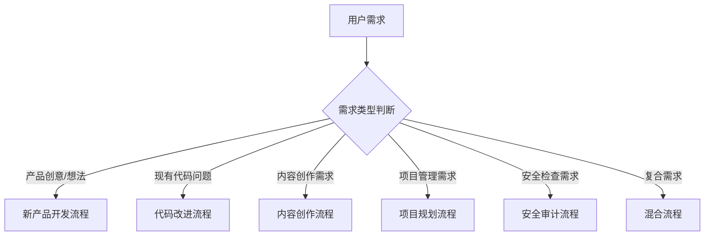

# .agent/ 工作流程调用规划

## 🎯 需求分析与角色调用决策树

### 第一步：需求类型识别

当接收到用户需求时，首先进行需求分类：



## 📋 详细工作流程规划

### 1️⃣ 新产品开发流程（最完整流程）

**触发条件**：

- "我想做一个 XXX 应用"
- "帮我开发一个 XXX 平台"
- "我有个产品想法"

**执行顺序**：

```yaml
阶段1 - 需求澄清与文档化:
  主角色: prd-writer
  输入: 用户的产品想法、功能描述
  输出: prd.md (产品需求文档)
  耗时: 30-60分钟
  成功标准: PRD包含完整的用户故事和验收标准

阶段2 - 开发计划制定:
  主角色: project-task-planner
  输入: prd.md
  输出: plan.md (开发任务清单)
  耗时: 20-40分钟
  成功标准: 任务分解到可执行的粒度

阶段3 - 应用开发实现:
  主角色: vibe-coding-coach
  输入: plan.md + 用户的视觉偏好
  输出: 完整工作应用
  耗时: 1-4小时
  成功标准: 应用符合PRD要求且可正常运行

阶段4 - 代码质量优化:
  主角色: code-refactorer
  输入: vibe-coding-coach输出的代码
  输出: 重构后的代码
  耗时: 30-60分钟
  成功标准: 代码可读性和维护性提升

阶段5 - 安全检查:
  主角色: security-auditor
  输入: 重构后的完整代码库
  输出: security-report.md
  耗时: 20-45分钟
  成功标准: 无Critical和High级别漏洞

阶段6 - 文档和推广:
  主角色: content-writer
  输入: 完成的应用 + 功能特性
  输出: 产品介绍、使用指南、技术博客
  耗时: 30-90分钟
  成功标准: 内容清晰易懂，适合目标用户

总耗时预估: 3-7小时
```

### 2️⃣ 代码改进流程

**触发条件**：

- "这段代码有问题"
- "帮我优化这个项目"
- "代码审查后需要改进"

**执行顺序**：

```yaml
情况A - 功能正常但需要优化:
  步骤1:
    角色: code-refactorer
    目标: 改进代码结构和可读性
  步骤2:
    角色: security-auditor
    目标: 检查重构后的安全性

情况B - 怀疑有安全问题:
  步骤1:
    角色: security-auditor
    目标: 全面安全检查
  步骤2:
    角色: code-refactorer
    目标: 修复安全问题后进行代码优化

情况C - 需要添加新功能:
  步骤1:
    角色: prd-writer
    目标: 补充功能需求文档
  步骤2:
    角色: project-task-planner
    目标: 规划新功能开发任务
  步骤3:
    角色: vibe-coding-coach
    目标: 实现新功能
  步骤4:
    角色: code-refactorer
    目标: 整体代码优化
  步骤5:
    角色: security-auditor
    目标: 安全检查
```

### 3️⃣ 内容创作流程

**触发条件**：

- "写一篇关于 XXX 的文章"
- "帮我创建产品介绍"
- "需要技术博客"

**执行顺序**：

```yaml
简单内容创作:
  单一角色: content-writer
  模式: outline → write

产品相关内容:
  步骤1:
    角色: prd-writer (如果没有现成PRD)
    目标: 明确产品特性和卖点
  步骤2:
    角色: content-writer
    目标: 基于PRD创建营销内容

技术教程类:
  步骤1:
    角色: content-writer
    目标: 创建技术内容大纲
  步骤2:
    角色: vibe-coding-coach (如需要代码示例)
    目标: 提供可运行的代码示例
  步骤3:
    角色: content-writer
    目标: 完善文章内容
```

### 4️⃣ 项目规划流程

**触发条件**：

- "帮我制定开发计划"
- "我需要项目路线图"
- "如何组织这个项目"

**执行顺序**：

```yaml
有现成PRD:
  直接使用: project-task-planner

无PRD情况:
  步骤1:
    角色: prd-writer
    目标: 创建或补充PRD
  步骤2:
    角色: project-task-planner
    目标: 基于PRD制定详细计划
```

### 5️⃣ 安全审计流程

**触发条件**：

- "检查代码安全性"
- "安全审计"
- "上线前安全检查"

**执行顺序**：

```yaml
单纯安全检查:
  单一角色: security-auditor

安全问题修复:
  步骤1:
    角色: security-auditor
    目标: 发现安全问题
  步骤2:
    角色: code-refactorer
    目标: 修复安全问题
  步骤3:
    角色: security-auditor
    目标: 验证修复效果
```

### 6️⃣ 混合流程（复合需求）

**触发条件**：

- 需求涉及多个方面
- 大型项目
- 不确定具体需要什么

**执行策略**：

```yaml
智能分解策略:
  1. 需求拆分: 将复合需求分解为单一需求
  2. 优先级排序: 确定哪些需求最紧急
  3. 顺序执行: 按照依赖关系安排执行顺序
  4. 并行处理: 独立的任务可以并行进行

示例 - "开发一个电商平台并写推广文案":
  并行分支A (产品开发): prd-writer → project-task-planner → vibe-coding-coach → code-refactorer → security-auditor

  并行分支B (内容创作): content-writer (outline mode)

  汇聚点: content-writer (write mode) - 基于开发完成的产品写详细推广内容
```

## 🔄 角色切换与协作机制

### 自动切换触发条件

```yaml
从prd-writer切换到project-task-planner:
  - PRD文档完成
  - 用户确认需求无误
  - 需要制定开发计划

从project-task-planner切换到vibe-coding-coach:
  - 开发计划确认
  - 需要开始编码实现
  - 用户提供了UI/UX偏好

从vibe-coding-coach切换到code-refactorer:
  - 基本功能实现完成
  - 代码可以运行
  - 需要优化代码质量

从code-refactorer切换到security-auditor:
  - 代码重构完成
  - 准备上线前检查
  - 用户关心安全问题

任何角色切换到content-writer:
  - 需要创建文档
  - 需要营销材料
  - 需要技术说明
```

### 角色协作输入输出

```yaml
角色间数据传递:
  prd-writer输出 → project-task-planner输入:
    - prd.md文件
    - 功能优先级
    - 技术栈偏好

  project-task-planner输出 → vibe-coding-coach输入:
    - plan.md文件
    - 开发任务清单
    - 技术架构建议

  vibe-coding-coach输出 → code-refactorer输入:
    - 完整代码库
    - 功能说明
    - 已知问题点

  code-refactorer输出 → security-auditor输入:
    - 重构后代码
    - 代码结构说明
    - 重构记录

  任何角色输出 → content-writer输入:
    - 产品特性描述
    - 技术实现细节
    - 目标用户画像
```

## ⚡ 快速决策表

根据用户需求关键词快速决策：

| 关键词                   | 首选角色             | 后续角色链                                 |
| ------------------------ | -------------------- | ------------------------------------------ |
| "想法"、"创意"、"做一个" | prd-writer           | → project-task-planner → vibe-coding-coach |
| "优化"、"重构"、"改进"   | code-refactorer      | → security-auditor                         |
| "安全"、"漏洞"、"检查"   | security-auditor     | → code-refactorer (如需修复)               |
| "计划"、"任务"、"规划"   | project-task-planner | 依赖是否有 PRD                             |
| "文章"、"内容"、"写作"   | content-writer       | 单独执行或与其他配合                       |
| "实现"、"开发"、"编程"   | vibe-coding-coach    | → code-refactorer → security-auditor       |

## 🎛️ 工作流控制策略

### 质量检查点

```yaml
每个阶段完成后的检查: 1. 输出质量验证
  2. 用户满意度确认
  3. 是否需要迭代改进
  4. 是否可以进入下一阶段

异常处理:
  - 角色无法完成任务 → 切换到backup角色或手动处理
  - 输出质量不满足要求 → 同角色重新执行
  - 用户需求变更 → 回到prd-writer重新分析
```

### 并行执行策略

```yaml
可以并行的任务:
  - content-writer创建大纲 ∥ prd-writer撰写PRD
  - security-auditor安全检查 ∥ content-writer准备文档
  - code-refactorer重构代码 ∥ content-writer准备技术文档

不能并行的依赖关系:
  - prd-writer → project-task-planner (必须等PRD完成)
  - project-task-planner → vibe-coding-coach (必须等计划完成)
  - vibe-coding-coach → code-refactorer (必须等代码完成)
```

## 📊 执行效果评估

### 成功指标

```yaml
流程成功指标:
  - 每个角色都产生了预期输出
  - 角色间切换顺畅无卡顿
  - 最终产品满足用户需求
  - 时间成本在预期范围内

质量指标:
  - PRD的完整性和准确性
  - 代码的功能性和安全性
  - 内容的可读性和实用性
  - 用户的满意度反馈
```

---

## 🎯 新项目 vs 新增需求策略指南

> 💡 **相关文档**:
>
> - 详细角色功能说明请参考 @使用文档.md
> - 各角色具体能力请查看 @vibe-coding-coach.md, @security-auditor.md, @prd-writer.md, @project-task-planner.md, @content-writer.md, @code-refactorer.md

### 🆕 新项目建议策略

#### **推荐工作流程**（完整 6 阶段）

```yaml
🎯 新项目标准流程:
  阶段1: @prd-writer.md (30-60分钟)
    目标: 将想法转化为完整PRD
    关键点: 确保需求清晰、用户故事完整
    输出: prd.md

  阶段2: @project-task-planner.md (20-40分钟)
    目标: 制定详细开发计划
    关键点: 任务分解到可执行粒度
    输出: plan.md

  阶段3: @vibe-coding-coach.md (1-4小时)
    目标: 实现MVP核心功能
    关键点: 先做能用的原型，再完善细节
    输出: 完整工作应用

  阶段4: @code-refactorer.md (30-60分钟)
    目标: 优化代码结构和可维护性
    关键点: 为后续扩展打好基础
    输出: 重构后代码

  阶段5: @security-auditor.md (20-45分钟)
    目标: 全面安全检查
    关键点: 修复所有Critical和High级别问题
    输出: security-report.md

  阶段6: @content-writer.md (30-90分钟)
    目标: 创建文档和推广材料
    关键点: 用户指南、技术文档、营销内容
    输出: .content/{slug}.md

总时长: 3-7小时 | 成功率: 95%+
```

#### **新项目核心建议**

```yaml
💡 最佳实践:
  需求阶段:
    - 花足够时间在PRD上，磨刀不误砍柴工
    - 定义清晰的MVP范围，避免功能蔓延
    - 确定目标用户画像和核心使用场景
    - 设定明确的成功指标和验收标准

  开发策略:
    - MVP优先: 先实现80%用户需要的20%功能
    - 迭代开发: 快速原型 → 用户反馈 → 优化改进
    - 技术选型: 选择团队熟悉且稳定的技术栈
    - 预留缓冲: 预留20-30%时间处理意外情况

  质量保证:
    - 代码重构不是可选项，是必需品
    - 安全检查要在上线前完成
    - 保持代码和文档的同步更新

🚩 常见陷阱:
  - 需求不明确就急于开发
  - 想一次性实现所有功能
  - 忽略用户体验设计
```

### 🔄 新增需求建议策略

#### **系统健康度评估**

```yaml
🔍 评估检查清单:
  代码质量评估:
    ✅ 代码结构是否清晰
    ✅ 是否存在技术债务
    ✅ 测试覆盖率如何
    ✅ 文档是否完整

  安全状况评估:
    ✅ 是否存在已知漏洞
    ✅ 依赖项是否最新
    ✅ 权限控制是否完善
    ✅ 数据保护是否到位

评估结果 → 选择对应路径
```

#### **三种处理路径**

```yaml
路径A - 现有系统健康良好:
  步骤1: @prd-writer.md (15-30分钟) - 补充新功能PRD
  步骤2: @project-task-planner.md (15-25分钟) - 规划开发任务
  步骤3: @vibe-coding-coach.md (30分钟-2小时) - 实现新功能
  步骤4: @security-auditor.md (15-30分钟) - 安全检查
  预估时长: 1.5-4小时

路径B - 现有系统需要改进:
  步骤1: @security-auditor.md (30-45分钟) - 评估现有问题
  步骤2: @code-refactorer.md (45-90分钟) - 重构现有代码
  步骤3: @prd-writer.md (20-40分钟) - 完善新功能需求
  步骤4: @vibe-coding-coach.md (1-3小时) - 开发新功能
  步骤5: @security-auditor.md (20-30分钟) - 最终验证
  预估时长: 3-6小时

路径C - 需求复杂，影响整体架构:
  步骤1: @prd-writer.md (45-90分钟) - 重新评估产品需求
  步骤2: @project-task-planner.md (30-60分钟) - 制定重构计划
  步骤3-6: 按新项目流程执行 (参考上方完整6阶段)
  预估时长: 4-8小时
```

#### **兼容性优先原则**

```yaml
🔄 向后兼容策略:
  - 新功能不能破坏现有功能
  - 保持用户界面的一致性
  - 数据结构变更要可回滚
  - API变更要有版本控制

🛡️ 风险缓解措施:
  - 功能开关: 新功能可以随时开启/关闭
  - 灰度发布: 逐步向用户开放新功能
  - 监控告警: 实时监控新功能的表现
  - 快速回滚: 准备回滚方案和操作手册
```

## 🚀 简单指令调用区分流程

### **快速识别指令**

```yaml
📋 指令关键词映射:
  新项目指令:
    - "新建" | "创建" | "做一个" | "开发一个"
    - "从零开始" | "全新" | "新的"
    - "想法" | "创意" | "产品"

  新增需求指令:
    - "添加" | "增加" | "新增" | "扩展"
    - "现有" | "已有" | "基于现有"
    - "升级" | "改进" | "优化"

  其他专项指令:
    - "重构" | "优化" → @code-refactorer.md
    - "安全" | "漏洞" → @security-auditor.md
    - "文档" | "文章" → @content-writer.md
    - "计划" | "规划" → @project-task-planner.md
```

### **一句话决策表**

| 用户说...                 | 系统识别 | 推荐流程        | 首选角色                 |
| ------------------------- | -------- | --------------- | ------------------------ |
| "我想做一个 XXX 应用"     | 新项目   | 完整 6 阶段流程 | @prd-writer.md           |
| "给现有系统添加 XXX 功能" | 新增需求 | 路径 A 增量开发 | 先评估系统健康度         |
| "这个代码需要优化"        | 代码改进 | 情况 A 优化流程 | @code-refactorer.md      |
| "检查一下安全问题"        | 安全审计 | 单纯安全检查    | @security-auditor.md     |
| "写一篇 XXX 文章"         | 内容创作 | 简单内容创作    | @content-writer.md       |
| "制定开发计划"            | 项目规划 | 依赖 PRD 情况   | @project-task-planner.md |

### **智能路由算法**

```yaml
🤖 自动判断逻辑:
  Step 1: 关键词扫描
    if 包含("新建","创建","做一个","从零"):
      → 新项目流程
    elif 包含("添加","新增","扩展","基于现有"):
      → 新增需求流程
    elif 包含("重构","优化","改进"):
      → 代码改进流程
    else:
      → 进入专项识别

  Step 2: 上下文分析
    检查是否提及现有系统/代码
    评估需求复杂度(简单/中等/复杂)
    确定技术栈和平台

  Step 3: 路径推荐
    输出: 推荐流程 + 预估时间 + 关键注意事项
```

### **用户交互模板**

```yaml
🎯 标准回复模板:

场景1 - 新项目: "检测到这是一个新项目需求！
  推荐流程: 完整6阶段开发流程
  预估时间: 3-7小时
  首先启动: prd-writer 角色
  建议: 准备好产品想法的详细描述和参考案例"

场景2 - 新增需求: "检测到这是现有系统的新增需求！
  需要先评估: 现有系统健康状况
  可能路径: A(1.5-4h) | B(3-6h) | C(4-8h)
  首先启动: security-auditor 进行系统评估
  建议: 提供现有代码库和新功能描述"

场景3 - 不确定: "需求信息不够明确，请选择：
  1️⃣ 新项目开发 (从零开始)
  2️⃣ 现有系统增强 (添加功能)
  3️⃣ 代码优化改进 (提升质量)
  4️⃣ 其他专项需求 (安全/文档/规划)"
```

## 🎮 简易单词指令调用系统

### **一键调用指令表**

```yaml
🚀 超简易指令 (单词触发):
  # 新项目开发
  new | create | build → 启动完整6阶段新项目流程 (@prd-writer.md 开始)

  # 现有项目改进
  add | extend | upgrade → 启动新增需求评估流程 (@security-auditor.md 评估)

  # 代码质量优化
  fix | clean | refactor → 启动代码重构流程 (@code-refactorer.md 开始)

  # 安全检查
  secure | audit | check → 启动安全审计流程 (@security-auditor.md 开始)

  # 内容创作
  write | blog | doc → 启动内容创作流程 (@content-writer.md 开始)

  # 项目规划
  plan | roadmap | task → 启动项目规划流程 (@project-task-planner.md 开始)

  # 体验开发 (愿景驱动)
  vibe | feel | ui → 启动体验开发流程 (@vibe-coding-coach.md 开始)

💡 使用方法: 直接输入单词 + 需求描述
   例: "new 电商平台" | "add 用户评论功能" | "fix 这段代码"
```

### **组合指令系统**

```yaml
🔥 高级组合指令:
  # 完整产品开发
  fullstack + 描述 → 启动完整6阶段流程
  例: "fullstack 在线教育平台"

  # 快速原型
  prototype + 描述 → 跳过PRD,直接开发
  路径: @vibe-coding-coach.md → @security-auditor.md
  例: "prototype 待办事项APP"

  # 安全优先开发
  secure-dev + 描述 → 安全检查前置
  路径: @security-auditor.md → @prd-writer.md → @vibe-coding-coach.md
  例: "secure-dev 金融支付系统"

  # 内容驱动开发
  content-first + 描述 → 先做内容规划
  路径: @content-writer.md → @prd-writer.md → @vibe-coding-coach.md
  例: "content-first 技术博客平台"

⚡ 快速修复指令:
  hotfix + 问题描述 → 紧急修复流程
  路径: @security-auditor.md → @code-refactorer.md (30分钟内完成)
  例: "hotfix 登录页面崩溃"
```

### **智能指令匹配算法**

```yaml
🤖 指令解析优先级:
  Level 1: 精确匹配 (完全匹配预设指令)
    "new" → 新项目流程
    "add" → 新增需求流程

  Level 2: 模糊匹配 (包含关键词)
    包含"创建|做|开发" → new 流程
    包含"添加|扩展|增加" → add 流程
    包含"优化|重构|修复" → fix 流程

  Level 3: 语义分析 (AI理解意图)
    "我想要一个..." → new 流程
    "现有系统需要..." → add 流程
    "这段代码..." → fix 流程

  Level 4: 交互确认 (不确定时询问)
    显示选项让用户选择具体指令
```

### **指令执行反馈模板**

```yaml
📋 标准执行反馈:
  指令识别确认: "✅ 识别指令: [指令名称]
    🎯 启动流程: [具体流程名称]
    📁 调用角色: @[角色文件名].md
    ⏱️ 预估时间: [时间范围]
    📝 下一步: [具体操作指导]"

  例子:
    输入: "new 博客系统"
    输出: "✅ 识别指令: new (新项目)
      🎯 启动流程: 完整6阶段开发流程
      📁 调用角色: @prd-writer.md
      ⏱️ 预估时间: 3-7小时
      📝 下一步: 请详细描述您的博客系统需求和功能特性"
```

### **快速参考卡片**

```yaml
🎯 记忆要点:
  单字指令: new → 新建项目
    add → 添加功能
    fix → 修复代码
    secure → 安全检查
    write → 内容创作
    plan → 项目规划
    vibe → 体验开发

  组合指令: fullstack → 完整开发
    prototype → 快速原型
    secure-dev → 安全优先
    content-first → 内容驱动
    hotfix → 紧急修复

  文件引用: 所有角色都用 @角色名.md 格式引用
    相关文档用 @文档名.md 格式引用
```

---

_🎯 通过系统化的工作流程和智能指令识别，确保每个需求都能得到最优的角色组合处理！_

> 💡 **快速上手**: 直接输入 `new`、`add`、`fix` 等单词 + 你的需求，系统会自动选择最佳工作流程！
