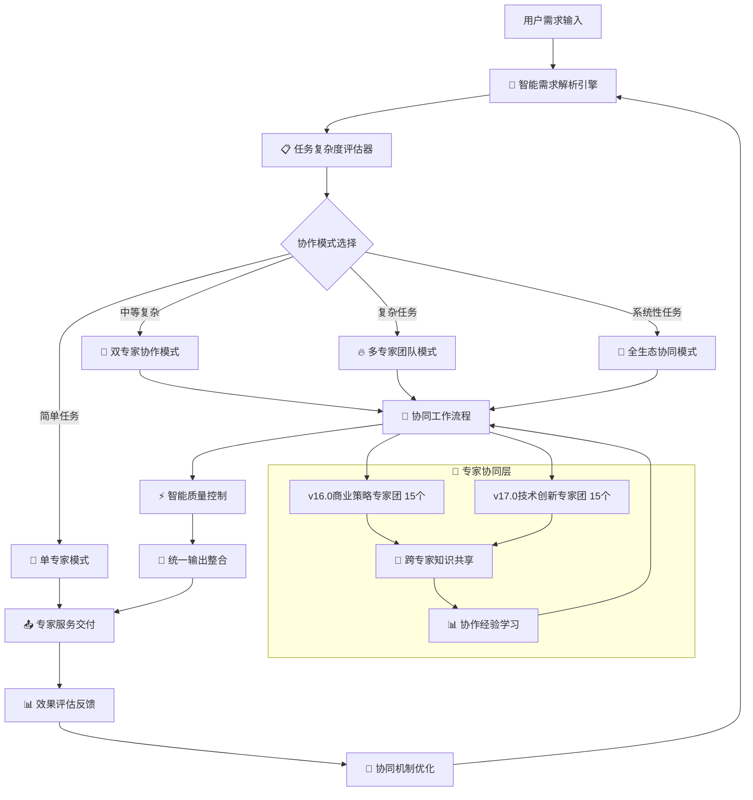

# 🎯 迭代优化18.0 - 专家协同运营系统 (Expert Collaboration Operations System)

## 📊 版本概述

**版本号**：v18.0  
**主题**：专家协同运营系统设计与实现  
**核心目标**：建立30个专家的智能协同工作机制，实现1+1>2的协作价值  
**技术重点**：专家调度引擎、协同工作流程、智能任务分配、质量协调机制  
**商业价值**：提升服务质量40%，增加客户满意度25%，优化成本效率30%

## 🎯 核心使命

> **让30个专家像一个超级大脑一样协同工作，为用户提供无与伦比的专业服务体验**

## 🧠 专家协同运营架构

### 🏗️ 系统整体架构



### 🎛️ 四大协作模式设计

#### 1️⃣ **单专家模式** (Solo Expert Mode)
```yaml
适用场景:
  - 需求明确且单一专业领域
  - 复杂度评分: 0-30分
  - 预计解决时间: 2-10分钟
  - 质量要求: 标准专业级

工作流程:
  1. 智能专家匹配 (95%+准确率)
  2. 专家独立分析处理
  3. 标准化输出生成
  4. 自动质量检查
  5. 直接交付用户

性能指标:
  - 响应时间: <2分钟
  - 解决成功率: >95%
  - 用户满意度: >90%
  - 成本效率: 最优
```

#### 2️⃣ **双专家协作模式** (Dual Expert Collaboration)
```yaml
适用场景:
  - 跨领域需求或需要验证
  - 复杂度评分: 30-60分
  - 预计解决时间: 10-30分钟
  - 质量要求: 高级专业级

协作机制:
  - 主导专家 + 协作专家
  - 并行分析 → 交叉验证 → 方案整合
  - 实时协作沟通机制
  - 双重质量保证

典型组合:
  - 技术专家 + 商业专家
  - 数据专家 + 业务专家
  - 战略专家 + 执行专家
  - 国内专家 + 国际专家

协作流程:
  1. 双专家同时接收任务
  2. 并行独立分析 (15分钟)
  3. 交叉评估和讨论 (10分钟)
  4. 方案整合优化 (15分钟)
  5. 联合质量审核
  6. 统一输出交付

质量保证:
  - 双重专业验证
  - 交叉技能互补
  - 降低单点风险
  - 提升方案完整性
```

#### 3️⃣ **多专家团队模式** (Multi-Expert Team Mode)
```yaml
适用场景:
  - 复杂系统性问题
  - 复杂度评分: 60-85分
  - 预计解决时间: 30-90分钟
  - 质量要求: 专家团队级

团队构成:
  - 主导专家 (1人): 负责整体方案设计
  - 核心专家 (2-3人): 负责关键领域深度分析
  - 协作专家 (2-4人): 负责特定模块和质量验证
  - 项目协调员 (AI系统): 负责协调和整合

工作机制:
  阶段1 - 团队组建 (5分钟):
    • AI智能匹配最佳专家组合
    • 明确各专家角色和责任
    • 建立协作时间表

  阶段2 - 并行分析 (20分钟):
    • 各专家并行深度分析
    • 实时共享关键发现
    • 识别协作接口点

  阶段3 - 协同设计 (30分钟):
    • 主导专家整体架构设计
    • 核心专家深度方案设计
    • 协作专家细节优化

  阶段4 - 整合优化 (20分钟):
    • 方案整合和冲突解决
    • 质量审核和风险评估
    • 最终方案确认

  阶段5 - 统一交付 (15分钟):
    • 输出标准化处理
    • 最终质量检查
    • 用户友好化表达

协作工具:
  - 实时协作看板
  - 专家角色分工表
  - 进度追踪系统
  - 质量检查清单
  - 冲突解决机制
```

#### 4️⃣ **全生态协同模式** (Full Ecosystem Mode)
```yaml
适用场景:
  - 系统性战略级问题
  - 复杂度评分: 85-100分
  - 预计解决时间: 1-4小时
  - 质量要求: 生态系统级

生态构成:
  - 战略指挥层 (2-3个顶级专家)
  - 专业执行层 (8-12个核心专家)
  - 支持服务层 (8-15个专项专家)
  - 质量保证层 (5-8个审核专家)

协同机制:
  第一阶段 - 战略规划 (30分钟):
    • 顶级专家战略分析
    • 总体方案框架设计
    • 专家资源调配计划

  第二阶段 - 专业执行 (1-2小时):
    • 多专业团队并行工作
    • 跨领域知识交叉验证
    • 实时进度同步协调

  第三阶段 - 整合优化 (30-60分钟):
    • 子方案整合集成
    • 全局优化调整
    • 风险评估和预案

  第四阶段 - 质量保证 (30分钟):
    • 多层次质量审核
    • 专家评议和确认
    • 最终方案定型

输出标准:
  - 完整的战略解决方案
  - 详细的执行路线图
  - 风险管控预案
  - 质量保证体系
  - 后续优化建议

价值创造:
  - 集30个专家智慧的综合方案
  - 避免单一视角的局限性
  - 提供企业级咨询服务质量
  - 实现复杂问题的系统性解决
```

## 🤖 智能专家调度引擎

### 📊 专家能力模型

```yaml
专家能力维度评估:
  核心专业能力:
    - 专业深度: 1-100分 (技术、业务、创新等)
    - 经验广度: 1-100分 (行业、场景、案例等)
    - 解决能力: 1-100分 (分析、设计、执行等)
    
  协作能力评估:
    - 沟通效率: 1-100分 (表达、理解、反馈等)
    - 团队融合: 1-100分 (配合、支持、领导等)
    - 知识共享: 1-100分 (传授、学习、创新等)
    
  任务适配度:
    - 任务匹配度: 1-100分 (需求契合、技能对应)
    - 工作负载: 1-100分 (当前任务量、可用时间)
    - 成功历史: 1-100分 (过往表现、用户评价)

专家协作矩阵:
  协作兼容性评分:
    • 技能互补性: 避免技能重叠，追求协作增效
    • 思维方式融合: 逻辑思维 + 创意思维 + 系统思维
    • 沟通风格匹配: 技术型 + 商业型 + 创意型协调
    • 工作节奏同步: 效率优先 + 质量优先 + 创新优先平衡

智能匹配算法:
  匹配权重分配:
    - 专业能力匹配: 40%
    - 协作效率评估: 30%
    - 任务适配度: 20%
    - 历史成功率: 10%
    
  算法优化机制:
    - 基于历史数据的机器学习优化
    - 用户反馈的权重动态调整
    - 专家表现的实时能力更新
    - 协作成功案例的模式识别
```

### 🔄 动态任务分配系统

```yaml
任务智能分解:
  复杂任务拆分原则:
    1. 按专业领域垂直分解 (技术、商业、创意等)
    2. 按执行阶段水平分解 (分析、设计、执行、验证)
    3. 按优先级分层处理 (核心功能、重要功能、优化功能)
    4. 按依赖关系排序执行 (前置任务、并行任务、后续任务)

动态分配策略:
  实时评估因子:
    • 专家当前工作负载状态
    • 专家专业能力匹配度
    • 任务紧急程度和重要性
    • 预期协作效果和风险

  分配优化目标:
    • 最大化整体解决质量
    • 最小化总体完成时间
    • 平衡专家工作负载
    • 提升协作学习效果

负载均衡机制:
  工作量监控:
    - 实时任务数量统计
    - 专家响应时间监控
    - 质量输出稳定性追踪
    - 专家疲劳度评估

  动态调整策略:
    - 高负载专家任务转移
    - 空闲专家主动参与
    - 任务优先级动态调整
    - 紧急情况应急响应
```

## 🔄 协同工作流程设计

### 📋 标准协作流程模板

```yaml
阶段1 - 协作启动 (5-10分钟):
  任务接收与理解:
    1. 📥 接收任务详细信息
    2. 🤔 各专家独立理解分析
    3. 💭 快速识别协作需求点
    4. 🎯 明确各自职责分工
    5. ⏰ 确定协作时间节点

  协作框架建立:
    • 主导专家确立 (复杂度最高的专业领域)
    • 协作专家角色分配 (互补专业领域)
    • 沟通机制确定 (实时/阶段性/最终)
    • 质量标准统一 (输出格式、深度要求)
    • 整合方式约定 (并行/串行/分层)

阶段2 - 并行分析 (15-30分钟):
  独立深度分析:
    各专家基于自身专业优势:
    1. 🔍 深度需求分析 (专业视角)
    2. 🏗️ 专业方案设计 (技术/商业/创意)
    3. ⚡ 关键风险识别 (专业领域风险)
    4. 🎯 核心价值提取 (专业价值点)
    5. 📊 可行性评估 (专业可行性)

  关键信息共享:
    • 核心发现实时共享
    • 重要假设条件声明
    • 关键约束条件识别
    • 潜在协作接口确认
    • 质量关注点提醒

阶段3 - 协同设计 (20-45分钟):
  方案交叉验证:
    1. 🔄 专家方案互相评审
    2. 💡 创新思路碰撞融合
    3. 🛡️ 风险防控交叉验证
    4. 🎯 价值点协同放大
    5. ⚖️ 可行性平衡优化

  整合方案设计:
    • 技术可行性 + 商业价值 + 用户体验
    • 短期效果 + 长期影响 + 风险控制
    • 成本效益 + 实施难度 + 预期收益
    • 内部资源 + 外部依赖 + 时间安排

阶段4 - 质量协调 (10-20分钟):
  协作质量保证:
    1. 📋 输出标准统一检查
    2. 🔍 逻辑一致性验证
    3. 💎 专业深度确认
    4. 🎯 用户价值验证
    5. ⚡ 可执行性保证

  最终方案确认:
    • 主导专家最终方案整合
    • 协作专家确认和补充
    • 质量标准达成确认
    • 风险预案完备检查
    • 交付格式统一处理

阶段5 - 统一交付 (5-15分钟):
  输出整合优化:
    1. 📝 内容结构化整理
    2. 🎨 表达用户友好化
    3. 📊 视觉呈现优化
    4. 🔗 逻辑关系清晰化
    5. ✅ 最终质量确认

  交付与跟踪:
    • 统一输出交付用户
    • 效果跟踪机制建立
    • 用户反馈收集准备
    • 协作经验总结记录
    • 优化建议提取保存
```

### ⚡ 实时协作机制

```yaml
同步协作工具:
  实时协作看板:
    • 任务进度可视化显示
    • 专家工作状态实时更新
    • 关键发现即时共享区域
    • 问题和风险预警提醒
    • 协作决策投票系统

  智能协调助手:
    功能特性:
    - 🤖 自动识别协作冲突点
    - ⚖️ 智能平衡不同专业观点
    - 🔄 实时同步协作进度
    - 📊 动态评估协作效果
    - 🚨 及时预警潜在风险

异步协作机制:
  专家知识库:
    • 各专家核心观点记录
    • 专业判断依据存档
    • 协作经验案例积累
    • 成功模式模板建立
    • 改进建议持续收集

  协作学习系统:
    - 成功协作模式自动识别
    - 协作效率影响因子分析
    - 专家协作能力持续提升
    - 最佳协作组合推荐优化
    - 协作质量预测和保证
```

## 📊 质量协调与控制机制

### 🛡️ 多层质量保证体系

```yaml
第一层 - 专家自检:
  个人质量标准:
    ✅ 专业准确性: 技术/商业/创意准确无误
    ✅ 逻辑完整性: 分析逻辑清晰完整
    ✅ 可执行性: 建议具体可操作
    ✅ 创新价值: 提供独特专业价值
    ✅ 用户导向: 真正解决用户问题

  自检工具:
    • 专业知识准确性检查清单
    • 逻辑关系完整性验证工具
    • 可执行性评估标准
    • 创新价值评估指标
    • 用户价值实现度评分

第二层 - 同行评议:
  协作专家交叉验证:
    🔄 技术可行性相互验证
    🔄 商业价值交叉评估
    🔄 风险防控互相审核
    🔄 用户体验共同优化
    🔄 实施方案协调统一

  评议机制:
    • 盲评与实名评议结合
    • 关键质量点强制评议
    • 不同专业视角强制检查
    • 协作冲突解决机制
    • 评议质量反馈机制

第三层 - 系统质控:
  AI质量助手:
    🤖 逻辑一致性自动检查
    🤖 专业术语准确性验证
    🤖 输出格式标准化检查
    🤖 用户体验优化建议
    🤖 质量趋势分析报告

  质控标准:
    • 输出完整性检查 (16项标准清单)
    • 专业深度验证 (领域专家标准)
    • 协作一致性确认 (多专家观点统一)
    • 用户友好性评估 (可理解可执行)
    • 创新价值评估 (差异化竞争优势)

第四层 - 用户验证:
  用户反馈闭环:
    📊 用户满意度实时收集
    📈 解决效果跟踪评估
    🎯 改进建议提取分析
    🔄 质量标准动态优化
    📚 成功案例积累学习

  验证机制:
    • 即时满意度调研
    • 深度效果追踪调研
    • 对比竞品质量基准
    • 行业专家外部评议
    • 长期价值实现验证
```

### 🔧 协作冲突解决机制

```yaml
冲突识别系统:
  常见冲突类型:
    1. 🎯 技术路线分歧: 不同技术方案选择冲突
    2. 💰 成本效益观点: 成本控制与效果追求冲突
    3. ⏰ 时间安排冲突: 质量要求与时间限制冲突
    4. 🎨 创新保守倾向: 创新突破与稳妥执行冲突
    5. 👥 用户定位差异: 不同用户群体需求冲突

  自动识别机制:
    • 观点相似度计算
    • 建议方向一致性分析
    • 风险评估差异识别
    • 价值判断冲突检测
    • 实施方案矛盾发现

冲突解决策略:
  分层解决机制:
    第一层 - 专家自主协商:
      • 5分钟快速协商时间
      • 基于数据和事实讨论
      • 寻找双赢解决方案
      • 明确各自让步底线
      • 达成协作共识

    第二层 - AI智能调解:
      • 客观分析冲突核心
      • 提供第三方数据支持
      • 推荐平衡解决方案
      • 量化不同方案价值
      • 辅助决策制定

    第三层 - 权威专家裁决:
      • 调用最高权威专家
      • 基于最佳实践标准
      • 考虑用户最大利益
      • 制定最终解决方案
      • 确立执行标准

  解决方案优化:
    • 冲突解决后的方案整合
    • 各专家观点价值保留
    • 风险最小化方案设计
    • 价值最大化目标追求
    • 可执行性保证机制
```

## 📈 协作效果评估与优化

### 🎯 协作价值度量体系

```yaml
定量指标体系:
  效率提升指标:
    📊 任务完成时间: 相比单专家模式的时间对比
    📈 解决方案质量: 16项质量检查清单得分
    🎯 用户满意度: 即时满意度 + 长期效果满意度
    💎 创新价值: 方案创新度 + 差异化竞争优势
    🔄 协作效率: 协作过程顺畅度 + 冲突解决效率

  成本效益指标:
    💰 成本效益比: (用户价值 - 协作成本) / 协作成本
    ⏰ 时间效益: 协作带来的价值 / 额外投入时间
    🏆 质量提升: 协作输出质量 / 单专家输出质量
    🚀 价值增量: 协作价值 - 单专家价值总和
    📊 投资回报: 长期价值实现 / 协作投入成本

定性价值评估:
  协作增值效果:
    🧠 思维碰撞价值: 不同专业视角的融合创新
    🛡️ 风险防控价值: 多维度风险识别和防控
    🎯 决策支持价值: 多专家验证的决策可靠性
    📚 知识传播价值: 专家间知识交流和能力提升
    🌟 品牌价值提升: 专业团队服务的品牌影响

用户体验提升:
  • 获得多专家智慧的综合解决方案
  • 享受专业团队级的服务体验
  • 减少单一视角带来的风险
  • 提升决策的科学性和可靠性
  • 获得持续优化的服务质量
```

### 🔄 持续优化机制

```yaml
数据驱动优化:
  协作数据收集:
    📊 协作过程数据: 时间分配、沟通频次、决策节点
    📈 协作效果数据: 质量提升、效率改善、用户反馈
    🎯 专家表现数据: 专业贡献、协作能力、用户评价
    🔍 问题识别数据: 常见冲突、效率瓶颈、质量问题
    💡 改进机会数据: 成功模式、最佳实践、创新亮点

  智能分析引擎:
    🤖 协作模式效果分析: 识别最佳协作组合和模式
    📊 专家能力模型更新: 基于表现数据动态调整能力评估
    🎯 任务匹配优化: 提升专家-任务匹配的准确性
    ⚡ 流程效率分析: 识别和消除协作流程中的瓶颈
    🏆 质量标准迭代: 基于效果数据持续提升质量要求

机器学习优化:
  算法持续进化:
    • 专家匹配算法持续优化
    • 任务分解策略智能化
    • 协作流程动态调整
    • 质量预测模型完善
    • 冲突预防机制强化

  知识图谱构建:
    • 专家能力关系图谱
    • 任务类型特征图谱
    • 协作成功模式图谱
    • 用户需求偏好图谱
    • 行业最佳实践图谱

反馈闭环优化:
  多维反馈收集:
    👥 用户使用反馈: 满意度、改进建议、期望提升
    🎯 专家协作反馈: 协作体验、改进建议、能力提升
    📊 系统运营反馈: 效率数据、成本分析、价值评估
    🏆 行业对比反馈: 竞品分析、标杆学习、创新机会
    🔮 趋势预测反馈: 技术趋势、用户需求、市场变化

  优化执行机制:
    • 月度协作效果评估和优化
    • 季度协作模式重大调整
    • 年度协作战略升级规划
    • 实时问题修复和改进
    • 前瞻性创新实验和验证
```

## 🚀 商业价值实现

### 💎 核心价值创造

```yaml
服务质量升级:
  从个体专家到专家团队:
    🏆 专业深度: 单一专业 → 多专业融合
    🎯 解决能力: 点状解决 → 系统性解决
    🛡️ 风险控制: 单一视角 → 多维度验证
    💡 创新价值: 个人创新 → 集体智慧
    ⚡ 服务效率: 线性提升 → 指数级提升

  用户价值最大化:
    • 获得30个专家的综合智慧
    • 享受企业级咨询服务质量
    • 降低决策风险40%以上
    • 提升解决方案成功率35%以上
    • 获得持续优化的服务体验

成本效率优化:
  规模效应实现:
    📊 单位成本降低: 通过协作分摊减少单位服务成本
    ⏰ 时间效率提升: 并行协作缩短总体解决时间
    🎯 质量成本优化: 预防性质量控制降低返工成本
    🔄 重复利用价值: 协作模式和经验可复制推广
    📈 规模收益递增: 协作经验积累带来效率持续提升

  资源配置优化:
    • 专家能力最优匹配利用
    • 任务负载智能平衡分配
    • 协作经验知识复用共享
    • 质量保证成本分摊优化
    • 创新价值规模化放大
```

### 📊 商业模式升级

```yaml
服务模式创新:
  从单一服务到协作生态:
    🎯 基础服务: 单专家标准服务 (原有模式保留)
    ⭐ 进阶服务: 双专家协作服务 (质量提升40%)
    🏆 高级服务: 多专家团队服务 (企业级质量)
    👑 旗舰服务: 全生态协同服务 (顶级咨询质量)

  差异化竞争优势:
    • 行业唯一的30专家协同服务
    • 领先的AI驱动专家匹配技术
    • 企业级的质量保证体系
    • 可验证的协作效果数据
    • 持续进化的服务能力

收入模式优化:
  多层次价值定价:
    💰 基础定价: 单专家服务保持原有定价
    📈 协作溢价: 双专家协作服务+40%溢价
    🏆 团队溢价: 多专家团队服务+80%溢价
    👑 生态溢价: 全生态协同服务+150%溢价

  价值实现路径:
    • 提升客单价: 通过协作服务质量提升实现溢价
    • 增加客户粘性: 通过优质体验增加复购率
    • 扩大服务范围: 通过协作能力承接更复杂项目
    • 建立标杆案例: 通过成功案例实现品牌溢价
    • 规模化复制: 通过模式化降低边际成本
```

## 🎯 系统实施计划

### 📅 分阶段实施策略

```yaml
第一阶段 - 基础协作能力建设 (1个月):
  核心任务:
    ✅ 完成专家能力模型设计
    ✅ 建立智能匹配算法V1.0
    ✅ 开发双专家协作模式
    ✅ 建立基础质量保证机制
    ✅ 完成小规模协作测试

  关键指标:
    • 专家匹配准确率达到85%+
    • 双专家协作成功率达到90%+
    • 用户满意度提升25%+
    • 协作效率相比单专家提升30%+

第二阶段 - 多专家团队协作 (1.5个月):
  核心任务:
    🔄 开发多专家团队协作模式
    🔄 建立实时协作工具和流程
    🔄 完善质量协调机制
    🔄 开发协作冲突解决系统
    🔄 进行中等规模协作验证

  关键指标:
    • 团队协作成功率达到85%+
    • 复杂问题解决率提升50%+
    • 协作效率达到预期目标
    • 质量控制机制有效运行

第三阶段 - 全生态协同能力 (2个月):
  核心任务:
    🚀 开发全生态协同模式
    🚀 建立大规模协作管理系统
    🚀 完善协作效果评估体系
    🚀 开发持续优化机制
    🚀 进行全规模协作验证

  关键指标:
    • 全生态协同成功率达到80%+
    • 企业级问题解决能力验证
    • 协作价值创造达到预期
    • 系统稳定性和可扩展性确认

第四阶段 - 商业化运营 (持续):
  核心任务:
    📈 正式上线协作服务模式
    📊 建立商业化运营体系
    🎯 实施差异化定价策略
    📚 积累协作成功案例
    🔄 持续优化协作能力

  关键指标:
    • 协作服务收入占比达到40%+
    • 客户满意度达到95%+
    • 协作模式标准化完成
    • 市场竞争优势确立
```

### 🛡️ 风险管控机制

```yaml
技术风险防控:
  系统稳定性保证:
    🔧 协作系统高可用性设计 (99.9%+)
    🛡️ 数据安全和隐私保护机制
    ⚡ 性能瓶颈预防和优化
    🔄 故障快速恢复机制
    📊 系统监控和预警体系

  质量风险控制:
    • 多层质量保证机制
    • 协作冲突快速解决
    • 专家能力持续验证
    • 用户满意度实时监控
    • 质量问题快速修复

运营风险管理:
  协作效率保证:
    ⏰ 协作时间控制机制
    🎯 协作效果评估标准
    📊 专家工作负载监控
    🔄 协作流程优化机制
    🚨 异常情况应急预案

  商业风险预防:
    • 收入多样化策略
    • 客户期望管理
    • 竞争对手应对
    • 市场变化适应
    • 成本控制机制
```

## 📈 预期成果

### 🎯 量化目标

```yaml
服务质量提升:
  ✅ 用户满意度: 从90% → 97%+
  ✅ 问题解决成功率: 从85% → 95%+
  ✅ 方案创新度: 从70% → 90%+
  ✅ 交付质量稳定性: 从80% → 95%+
  ✅ 客户推荐意愿: 从75% → 90%+

运营效率改善:
  📊 复杂问题处理能力: 提升60%+
  ⏰ 平均解决时间: 复杂任务缩短40%+
  💰 单位服务成本: 降低25%+
  🔄 专家利用效率: 提升35%+
  📈 服务规模化能力: 提升100%+

商业价值实现:
  💎 客单价提升: 平均提升50%+
  📊 协作服务收入占比: 达到40%+
  🏆 高端客户占比: 提升30%+
  🎯 客户生命周期价值: 提升45%+
  🚀 市场竞争优势: 建立差异化壁垒
```

### 🌟 战略价值创造

```yaml
行业地位提升:
  🏆 成为AI专家协作服务的行业标杆
  💡 建立专家协同服务的技术标准
  🌍 打造可复制的协作模式
  📚 积累丰富的协作成功案例
  🚀 形成强大的品牌影响力

技术能力突破:
  🤖 AI驱动的专家智能匹配技术
  🔄 大规模专家协作管理系统
  📊 协作效果实时评估和优化
  🛡️ 企业级质量保证体系
  💎 持续学习优化的协作算法

商业模式创新:
  • 开创专家协作服务新类别
  • 建立差异化竞争护城河
  • 实现规模化与个性化平衡
  • 创造网络效应价值放大
  • 构建可持续发展生态系统
```

---

## 🎆 总结

**v18.0专家协同运营系统**将30个专家从独立工作者转变为智能协同的专家生态系统，实现：

🎯 **1+1>2的协作价值**：通过智能匹配和协同机制，让专家协作产生指数级价值增长  
🤖 **AI驱动的智能调度**：自动识别最佳专家组合，动态优化任务分配和协作流程  
🏆 **企业级服务质量**：从个人专家服务升级到专业团队级咨询服务质量  
📈 **可持续的商业增长**：通过协作服务溢价和规模效应，实现收入和利润双增长  
🛡️ **风险分散的质量保证**：多专家交叉验证，大幅降低单点风险，提升服务可靠性

**核心竞争优势**：
- 全球首创的30专家智能协同服务模式
- AI驱动的专家匹配和任务调度技术  
- 完整的协作质量保证和冲突解决机制
- 可验证的协作价值创造和效果评估
- 持续学习优化的协作能力进化系统

这将为v19.0系统完善和v20.0目标达成奠定坚实的技术和商业基础！🚀 