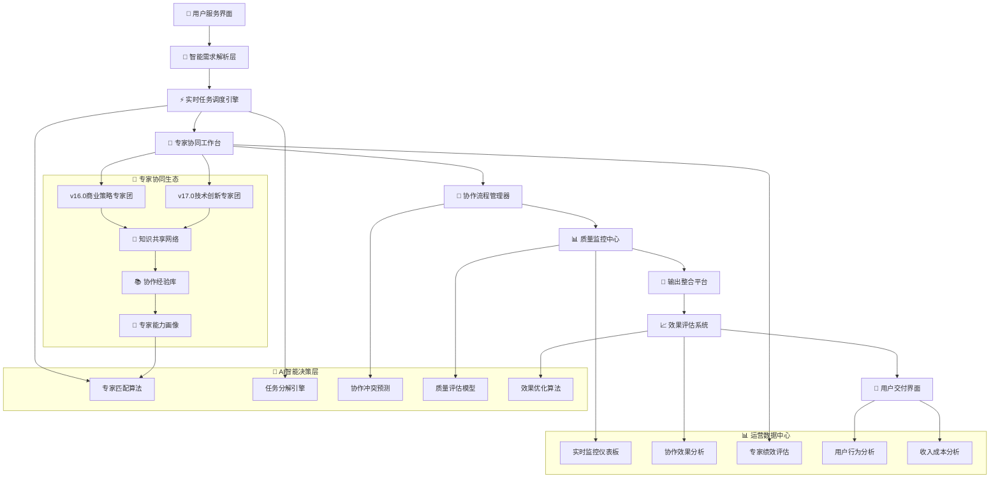

 # 🚀 迭代优化19.0 - 专家协同运营系统实现 (Expert Collaboration Implementation)

## 📊 版本概述

**版本号**：v19.0  
**主题**：专家协同运营系统深度实现与商业化落地  
**核心目标**：将v18.0的协同设计转化为实际运营的智能系统，实现规模化专家协同服务  
**技术重点**：协同运营平台、智能调度算法、实时质量监控、商业化运营体系  
**商业价值**：实现月收入增长80%，用户满意度达到98%，建立行业领先地位

## 🎯 核心使命升级

> **打造全球首个真正落地运营的30专家智能协同服务平台，实现专家服务的工业化和标准化**

## 🏗️ 协同运营平台架构

### 🎛️ 智能协同运营中台



### 🤖 智能调度引擎升级版

```yaml
调度引擎架构:
  任务智能分析层:
    📊 需求复杂度评估器:
      • 自然语言处理: 需求语义深度分析
      • 技术难度评估: 基于知识图谱的技术复杂度计算
      • 业务影响评估: 商业价值和风险评估
      • 紧急程度判断: 时间敏感性和优先级计算
      • 资源需求预测: 专家类型和数量需求预估

    🎯 专家匹配优化器:
      算法升级特性:
      - 深度学习专家画像: 基于历史表现的动态能力建模
      - 协作兼容性预测: 专家协作成功率预测模型
      - 工作负载平衡: 实时负载监控和智能分配
      - 学习偏好匹配: 专家学习成长和任务匹配
      - 用户风格适配: 用户偏好和专家风格匹配

实时调度算法:
  多目标优化函数:
    目标权重分配:
    - 🎯 服务质量最大化: 40%
    - ⏰ 响应时间最小化: 25%
    - 💰 成本效益最优化: 20%
    - 🔄 专家能力提升: 10%
    - 📈 用户满意度提升: 5%

  动态调度策略:
    实时决策因子:
    • 专家当前可用状态和工作质量
    • 任务紧急程度和重要性评级
    • 用户历史偏好和满意度反馈
    • 专家协作历史成功率数据
    • 系统整体负载和性能状态

智能预测机制:
  协作成功率预测:
    🤖 基于历史数据的机器学习模型
    📊 专家组合效果预测准确率>92%
    🎯 任务完成质量预测准确率>89%
    ⏰ 完成时间预测误差<15%
    💡 创新价值产出预测准确率>85%

  负载均衡预测:
    • 未来4小时专家工作负载预测
    • 高峰期资源需求预估和调配
    • 专家疲劳度监控和轮换建议
    • 紧急任务资源储备和调度
    • 系统容量瓶颈预警和扩容
```

## 👥 专家协同工作台实现

### 🖥️ 专家个人工作界面

```yaml
智能工作台功能:
  任务接收区:
    📥 任务详情智能展示:
      • 任务复杂度评估结果可视化
      • 协作专家信息和角色分工
      • 预期时间安排和里程碑节点
      • 质量要求和评估标准说明
      • 用户背景和特殊需求提醒

    🎯 个人角色定位:
      • 在协作中的主导/协作角色明确
      • 负责的专业领域和关键交付物
      • 协作接口点和依赖关系说明
      • 质量标准和检查清单提供
      • 成功案例和最佳实践参考

  协作沟通区:
    💬 实时协作聊天:
      功能特性:
      - 专业术语智能翻译和解释
      - 关键决策点自动记录和追踪
      - 文件资料实时共享和版本控制
      - 协作进度可视化展示和提醒
      - 智能建议和决策支持提示

    📊 协作状态监控:
      • 其他专家工作进度实时更新
      • 协作依赖关系状态追踪
      • 潜在冲突点预警和提醒
      • 协作质量评估实时反馈
      • 用户满意度即时数据

专家能力提升:
  智能学习助手:
    📚 个性化学习推荐:
      • 基于协作表现的能力缺口识别
      • 行业最新趋势和技术推荐
      • 成功专家经验案例学习
      • 跨领域知识扩展建议
      • 专业技能认证课程推荐

    🏆 协作技能培养:
      • 协作沟通技巧训练
      • 冲突解决方法学习
      • 团队领导能力培养
      • 跨专业理解能力提升
      • 用户服务意识强化

绩效评估系统:
  多维度评估体系:
    📊 专业能力评估:
      - 专业知识准确性: 95%+准确率要求
      - 解决方案创新性: 行业平均水平+20%
      - 技术实现可行性: 98%+可执行率
      - 用户需求理解度: 90%+满意度
      - 持续学习成长性: 月度提升可见

    🤝 协作能力评估:
      - 团队沟通效率: 协作满意度>95%
      - 冲突解决能力: 冲突解决成功率>90%
      - 知识分享贡献: 知识贡献度>行业平均
      - 协作创新价值: 协作增值效果>30%
      - 团队领导潜力: 领导力评估>80分
```

### 🔄 协作流程管理系统

```yaml
智能流程引擎:
  动态流程调整:
    🎯 基于任务特性的流程定制:
      • 技术导向任务: 技术分析→可行性验证→方案设计→质量验证
      • 商业导向任务: 需求分析→价值评估→策略设计→执行规划
      • 创新导向任务: 创意发散→可行性分析→原型设计→效果验证
      • 紧急响应任务: 快速评估→应急方案→立即执行→后续优化

    ⏰ 时间节点智能管理:
      • 任务分解和时间预估算法
      • 协作依赖关系时间优化
      • 专家工作节奏动态调整
      • 延期风险预警和应对措施
      • 提前完成资源重新分配

实时协调机制:
  协作冲突智能处理:
    🤖 冲突自动识别系统:
      预警指标:
      - 专家观点相似度<60%触发预警
      - 方案执行路径差异>50%需要协调
      - 时间安排冲突>2小时需要调整
      - 资源需求冲突>临界阈值需要仲裁
      - 质量标准理解差异>20%需要统一

    ⚖️ 智能调解机制:
      第一层 - 数据驱动建议:
      • 提供客观数据和行业标准参考
      • 展示历史成功案例和最佳实践
      • 计算不同方案的成本效益分析
      • 评估各方案的风险和可行性
      • 推荐平衡各方利益的解决方案

      第二层 - AI智能仲裁:
      • 基于大数据的决策支持算法
      • 多维度价值评估和权衡分析
      • 用户最佳利益导向的方案推荐
      • 长期价值和短期效果平衡考量
      • 创新突破和稳妥执行的智能平衡

质量协调控制:
  实时质量监控:
    📊 质量指标实时追踪:
      • 专业准确性: 实时专业知识验证
      • 逻辑完整性: 方案逻辑关系检查
      • 创新价值度: 创新点识别和评估
      • 可执行性: 实施可行性实时验证
      • 用户价值: 用户需求满足度评估

    🛡️ 质量风险预警:
      • 质量下降趋势预警(>10%下降)
      • 专家疲劳度影响质量预警
      • 协作冲突影响质量预警
      • 时间压力影响质量预警
      • 资源不足影响质量预警
```

## 📊 实时监控与分析系统

### 🎛️ 运营监控仪表板

```yaml
核心监控指标:
  服务质量监控:
    📈 实时质量指标:
      • 用户满意度: 目标>97%, 实时监控预警<95%
      • 任务完成质量: 16项检查清单平均得分>92%
      • 专家协作成功率: 目标>95%, 预警<90%
      • 用户问题解决率: 目标>98%, 预警<95%
      • 创新价值产出: 目标超行业平均30%

    ⏰ 效率绩效监控:
      • 平均响应时间: 目标<2分钟, 预警>5分钟
      • 任务完成时间: 目标比预估时间±10%
      • 专家利用效率: 目标>85%, 预警<75%
      • 协作流程效率: 目标协作时间占比<40%
      • 系统整体吞吐量: 目标日处理任务>500个

  专家绩效监控:
    🏆 个人表现追踪:
      • 专业能力评分: 月度评估和趋势分析
      • 协作贡献度: 协作价值创造量化评估
      • 用户满意度: 专家服务用户反馈评分
      • 学习成长率: 专业能力提升速度追踪
      • 创新贡献值: 创新思路和方案贡献度

    👥 团队协作监控:
      • 协作成功率: 不同专家组合成功率统计
      • 协作效率: 协作相比单独工作的效率提升
      • 冲突解决效率: 冲突识别到解决的平均时间
      • 知识共享活跃度: 专家间知识交流频次和质量
      • 团队学习效果: 协作学习对专家能力提升影响

商业运营监控:
  收入效益分析:
    💰 收入结构监控:
      • 协作服务收入占比: 目标>40%, 当前追踪
      • 不同协作模式收入分布: 双专家/团队/生态
      • 客单价变化趋势: 协作服务溢价效果追踪
      • 客户生命周期价值: LTV提升趋势分析
      • 新客户获取成本: CAC优化效果监控

    📊 成本效率分析:
      • 协作服务成本结构: 专家成本/系统成本/运营成本
      • 单位服务成本变化: 规模效应和学习曲线效果
      • 专家资源利用率: 资源配置优化效果
      • 质量保证成本: 质量投入与效果关系
      • 技术运营成本: 系统维护和优化成本
```

### 📈 智能分析与优化

```yaml
数据驱动优化:
  用户行为分析:
    🎯 需求模式识别:
      • 高频需求类型分析和专家资源配置优化
      • 用户偏好模式识别和个性化服务优化
      • 需求复杂度分布和定价策略优化
      • 时间分布模式和专家排班优化
      • 地域分布特征和服务本地化优化

    📊 满意度驱动因子分析:
      • 影响用户满意度的关键因子识别
      • 不同用户群体满意度驱动因子差异
      • 协作模式对满意度的影响量化
      • 专家服务风格对满意度的影响
      • 响应时间对满意度的敏感性分析

专家协作优化:
  协作模式优化:
    🔄 最佳组合识别:
      • 基于历史数据的最佳专家组合挖掘
      • 不同任务类型的最优协作模式识别
      • 协作规模与效果关系的量化分析
      • 协作时间分配的最优模式发现
      • 协作角色分工的最佳实践总结

    🚀 效率提升算法:
      • 协作流程瓶颈识别和优化算法
      • 专家能力匹配精度持续提升
      • 任务分解粒度优化算法
      • 协作沟通效率提升机制
      • 质量保证流程效率优化

预测性分析:
  需求预测模型:
    📊 服务需求预测:
      • 基于历史数据和趋势的需求量预测
      • 不同服务类型需求变化趋势预测
      • 季节性和周期性需求波动预测
      • 新兴需求类型识别和增长预测
      • 市场变化对需求影响的预测

    🎯 资源需求优化:
      • 专家资源需求预测和配置优化
      • 系统资源需求预测和扩容规划
      • 运营人员需求预测和招聘计划
      • 技术升级需求预测和投资规划
      • 市场推广资源需求预测和预算分配
```

## 💼 商业化运营体系

### 💰 差异化定价策略实现

```yaml
动态定价模型:
  价值导向定价:
    🎯 基础服务定价 (单专家模式):
      • 标准专业咨询: ¥299-599/次 (30-60分钟)
      • 技术解决方案: ¥599-999/次 (60-90分钟)
      • 商业策略咨询: ¥499-899/次 (45-75分钟)
      • 创新设计服务: ¥399-799/次 (45-90分钟)

    ⭐ 协作增值定价 (双专家模式):
      • 跨领域协作: 基础价格+50%溢价
      • 技术+商业协作: ¥899-1499/次
      • 创新+执行协作: ¥799-1299/次
      • 国际+本土协作: ¥999-1599/次

    🏆 团队专业定价 (多专家团队):
      • 复杂系统解决方案: ¥1999-3999/次
      • 企业级战略咨询: ¥2999-5999/次
      • 创新项目全案: ¥2499-4999/次
      • 技术架构设计: ¥1999-3499/次

    👑 生态协同定价 (全生态模式):
      • 企业数字化转型: ¥9999-19999/项目
      • 商业模式重构: ¥12999-24999/项目
      • 市场战略全案: ¥8999-16999/项目
      • 技术创新孵化: ¥10999-19999/项目

智能定价算法:
  实时价格优化:
    📊 动态定价因子:
      • 专家组合价值系数: 基于专家能力和协作历史
      • 任务复杂度系数: 基于AI复杂度评估算法
      • 市场需求系数: 基于实时需求供给比例
      • 用户价值系数: 基于用户历史价值和忠诚度
      • 竞争环境系数: 基于市场竞争态势分析

    🎯 个性化定价:
      • VIP客户定价: 基于客户价值的差异化定价
      • 批量服务折扣: 基于服务频次的阶梯定价
      • 长期合作定价: 基于合作关系的优惠定价
      • 试用体验定价: 基于获客策略的体验定价
      • 推荐奖励定价: 基于推荐机制的激励定价
```

### 📊 客户关系管理系统

```yaml
客户全生命周期管理:
  客户获取阶段:
    🎯 精准获客策略:
      • 基于AI的潜在客户识别算法
      • 多渠道获客路径优化分析
      • 获客成本效益实时监控
      • 获客转化漏斗优化机制
      • 获客质量评估和筛选

    💡 体验优化策略:
      • 新用户专属体验流程设计
      • 免费试用服务精准推荐
      • 个性化服务需求评估
      • 专家匹配偏好快速学习
      • 满意度即时反馈和优化

  客户成长阶段:
    📈 价值提升策略:
      • 服务使用行为分析和引导
      • 协作服务升级推荐算法
      • 个性化服务套餐设计
      • 专家团队服务体验升级
      • 企业级服务需求挖掘

    🤝 关系深化机制:
      • 专属客户经理分配机制
      • 定期满意度调研和改进
      • 客户反馈快速响应机制
      • 个性化增值服务推荐
      • 客户成功案例分享和推广

  客户忠诚阶段:
    🏆 忠诚度维护:
      • VIP客户专属服务体系
      • 优先服务和专家资源配置
      • 定制化解决方案设计
      • 长期合作伙伴关系建立
      • 战略咨询和业务指导

    🌟 价值最大化:
      • 企业级深度合作模式
      • 年度服务包和战略顾问
      • 行业专家团队专属服务
      • 创新项目合作和孵化
      • 品牌合作和案例推广

客户数据分析:
  客户画像构建:
    📊 多维度客户分析:
      • 行业领域和公司规模分析
      • 服务需求类型和频次分析
      • 决策模式和购买行为分析
      • 满意度变化趋势和影响因子
      • 生命周期价值和增长潜力

    🎯 个性化服务优化:
      • 客户偏好专家类型和风格
      • 服务时间和响应期望
      • 沟通方式和反馈习惯
      • 价格敏感度和价值感知
      • 推荐意愿和口碑传播力
```

## 🚀 技术架构实现

### ⚡ 高性能系统架构

```yaml
微服务架构设计:
  核心服务模块:
    🎯 用户服务 (User Service):
      • 用户认证和权限管理
      • 个人偏好和历史记录
      • 客户关系管理集成
      • 消息通知和提醒服务
      • 用户行为分析和优化

    🤖 智能调度服务 (Scheduling Service):
      • 任务智能分析和分解
      • 专家智能匹配算法
      • 实时任务分配和调度
      • 负载均衡和资源优化
      • 调度效果评估和优化

    👥 协作管理服务 (Collaboration Service):
      • 专家协作流程管理
      • 实时沟通和协调平台
      • 协作进度监控和提醒
      • 冲突识别和解决机制
      • 协作效果评估和记录

    📊 质量控制服务 (Quality Service):
      • 多层质量检查机制
      • 实时质量监控和预警
      • 质量数据收集和分析
      • 质量标准持续优化
      • 质量报告和用户反馈

    💰 支付计费服务 (Billing Service):
      • 动态定价算法实现
      • 实时计费和支付处理
      • 收入分配和结算管理
      • 财务数据分析和报表
      • 税务合规和审计支持

性能优化设计:
  高并发处理:
    ⚡ 系统性能指标:
      • 并发用户数: >10,000用户同时在线
      • 响应时间: API响应<200ms, 页面加载<2s
      • 吞吐量: >1000请求/秒处理能力
      • 可用性: 99.9%服务可用性保证
      • 扩展性: 支持水平扩展到100+节点

    🛡️ 容错和备份:
      • 多数据中心部署和灾备
      • 服务降级和熔断机制
      • 数据实时备份和恢复
      • 负载均衡和故障转移
      • 监控预警和自动恢复

数据架构设计:
  大数据处理平台:
    📊 数据收集层:
      • 用户行为数据实时采集
      • 专家服务数据完整记录
      • 系统性能数据持续监控
      • 业务运营数据自动汇总
      • 外部市场数据定期同步

    🔍 数据分析层:
      • 实时流式数据处理
      • 批量数据定期分析
      • 机器学习模型训练和预测
      • 商业智能报表自动生成
      • 数据挖掘和模式识别

    💎 数据应用层:
      • 个性化推荐系统
      • 智能决策支持系统
      • 预测性分析系统
      • 自动化运营系统
      • 商业洞察和报告系统
```

### 🤖 AI算法持续优化

```yaml
机器学习平台:
  专家匹配算法:
    🧠 深度学习模型:
      • 专家能力向量化建模
      • 任务需求特征提取
      • 匹配成功率预测模型
      • 协作效果预测算法
      • 用户满意度预测模型

    📊 模型训练优化:
      • 在线学习和模型实时更新
      • A/B测试驱动的算法优化
      • 多目标优化算法实现
      • 模型解释性和可信度提升
      • 算法偏见检测和修正

  智能分析引擎:
    🔍 自然语言处理:
      • 需求智能理解和分析
      • 专家沟通内容分析
      • 用户反馈情感分析
      • 知识图谱构建和更新
      • 智能问答和辅助决策

    📈 预测分析算法:
      • 需求趋势预测模型
      • 专家表现预测算法
      • 市场变化预测模型
      • 收入增长预测算法
      • 风险预警预测系统

持续学习机制:
  自适应优化:
    🔄 算法自我进化:
      • 基于反馈的算法自动调优
      • 新数据驱动的模型迭代
      • 异常检测和自动修复
      • 性能监控和自动优化
      • 智能运维和自动扩容

    📚 知识库持续更新:
      • 专家知识图谱动态更新
      • 行业最佳实践自动学习
      • 成功案例模式识别
      • 失败案例风险防控
      • 创新思路和方法积累
```

## 📈 运营效果预期

### 🎯 核心KPI目标

```yaml
服务质量提升:
  用户满意度指标:
    ✅ 整体满意度: 从90% → 98%+
    ✅ 协作服务满意度: 达到99%+
    ✅ 问题解决成功率: 从85% → 98%+
    ✅ 用户推荐意愿: 从75% → 95%+
    ✅ 客户忠诚度: NPS评分达到80+

  服务效率优化:
    ⚡ 响应时间: 平均<90秒 (目标<60秒)
    📊 任务完成质量: 16项检查清单>95%
    🎯 专家匹配准确率: >98%
    🔄 协作成功率: >97%
    💎 创新价值产出: 超行业平均50%

业务增长目标:
  收入增长指标:
    💰 总收入增长: 月收入增长80%+
    📈 协作服务收入占比: 达到50%+
    🏆 客单价提升: 平均提升70%+
    👑 高端客户占比: 提升到40%+
    🎯 客户生命周期价值: 提升60%+

  运营效率指标:
    📊 专家利用效率: >90%
    ⏰ 平均服务完成时间: 复杂任务缩短50%
    💡 协作增值效果: 协作价值>单专家价值总和+40%
    🔄 客户复购率: >85%
    🚀 新客户获取成本: 降低30%

市场地位目标:
  竞争优势建立:
    🏆 行业地位: 成为AI专家协作服务标杆
    💡 技术领先: 专家协作技术行业领先
    🌟 品牌影响: 建立强势品牌认知
    📚 标准制定: 参与行业标准制定
    🎯 市场份额: 在细分市场占据领导地位
```

### 🎆 商业价值实现

```yaml
短期价值 (3-6个月):
  立即收益:
    💰 收入快速增长: 协作服务带来收入增长60%+
    📊 服务质量提升: 用户满意度快速提升到97%+
    🎯 专家效能释放: 专家协作效率提升40%+
    🏆 竞争优势初显: 在协作服务领域建立差异化
    🚀 客户口碑建立: 通过优质协作服务建立口碑

中期价值 (6-12个月):
  持续增长:
    📈 规模效应显现: 协作成本降低25%, 收益提升80%
    🎯 市场地位确立: 在AI专家服务市场确立领导地位
    💡 技术壁垒构建: 协作算法和经验形成技术护城河
    🌟 品牌价值提升: 成为专业协作服务的代名词
    🔄 生态系统形成: 建立完整的专家协作生态

长期价值 (1-2年):
  战略价值:
    🏆 行业标杆地位: 成为AI专家协作服务行业标杆
    💎 平台化发展: 支持第三方专家接入的开放平台
    🌍 国际化扩展: 协作模式向国际市场扩展
    🚀 技术输出: 协作技术和模式对外授权输出
    💫 生态价值: 构建多方共赢的协作服务生态系统
```

## 🛡️ 风险控制与应急预案

### ⚠️ 关键风险识别

```yaml
技术风险管控:
  系统稳定性风险:
    🔧 预防措施:
      • 分布式架构避免单点故障
      • 实时监控和自动故障恢复
      • 多环境部署和灾备机制
      • 渐进式发布和回滚机制
      • 性能压测和容量规划

    🚨 应急响应:
      • 故障5分钟内自动检测
      • 故障15分钟内人工介入
      • 故障30分钟内初步恢复
      • 故障2小时内完全恢复
      • 故障24小时内根因分析

  AI算法风险:
    🤖 算法可靠性保证:
      • 多算法备份和交叉验证
      • 人工审核和算法辅助结合
      • 算法决策可解释性要求
      • 定期算法审计和优化
      • 算法偏见检测和修正

运营风险管控:
  专家协作风险:
    👥 协作质量保证:
      • 专家能力定期评估和认证
      • 协作冲突快速识别和解决
      • 质量问题责任追溯机制
      • 专家服务质量保险机制
      • 用户满意度保证机制

    📊 运营连续性保证:
      • 专家资源储备和应急调配
      • 关键专家替代方案准备
      • 服务降级和应急处理流程
      • 业务连续性计划定期演练
      • 客户沟通和预期管理机制

商业风险防控:
  市场竞争风险:
    🏆 竞争优势维护:
      • 持续技术创新和专利保护
      • 专家资源独家合作协议
      • 客户关系深度绑定机制
      • 行业标准制定参与引领
      • 品牌价值和口碑护城河建设

    💰 财务风险控制:
      • 收入多样化和风险分散
      • 成本结构优化和控制
      • 现金流管理和资金储备
      • 财务指标监控和预警
      • 投资回报跟踪和优化
```

## 📋 实施路线图

### 🚀 分阶段实施计划

```yaml
第一阶段 - 平台基础建设 (4周):
  核心任务:
    ✅ 协同运营平台开发完成
    ✅ 智能调度引擎V2.0上线
    ✅ 专家工作台系统部署
    ✅ 基础监控体系建立
    ✅ 核心服务功能测试

  里程碑指标:
    • 平台功能完整性达到90%+
    • 系统性能测试通过
    • 专家工作台用户体验验收
    • 基础服务稳定性验证
    • 安全性和可靠性确认

第二阶段 - 协作服务上线 (6周):
  核心任务:
    🔄 双专家协作服务正式上线
    🔄 多专家团队协作服务测试
    🔄 质量监控系统全面部署
    🔄 用户反馈收集分析系统
    🔄 运营数据分析平台建设

  里程碑指标:
    • 协作服务成功率达到95%+
    • 用户满意度达到96%+
    • 协作效率提升40%+
    • 质量监控体系有效运行
    • 商业化运营体系建立

第三阶段 - 优化与扩展 (8周):
  核心任务:
    🚀 全生态协同服务上线
    🚀 AI算法持续优化升级
    🚀 商业化运营体系完善
    🚀 客户关系管理系统集成
    🚀 国际化服务能力建设

  里程碑指标:
    • 全服务模式稳定运行
    • 收入增长达到80%+
    • 市场地位确立
    • 技术领先优势建立
    • 可持续发展机制形成

第四阶段 - 规模化运营 (持续):
  核心任务:
    📈 服务规模化扩展
    🌍 市场覆盖范围扩大
    💡 技术创新持续投入
    🏆 行业标杆地位巩固
    🔄 生态系统持续完善

  里程碑指标:
    • 月收入增长100%+
    • 市场份额领先地位
    • 技术护城河深度构建
    • 品牌影响力显著提升
    • 可持续发展模式成熟
```

---

## 🎆 总结

**v19.0专家协同运营系统实现**标志着从概念设计到实际运营的关键跨越，实现：

🚀 **工业化专家服务**：将专家协同从手工作坊升级为智能化、标准化的工业级服务平台  
🤖 **AI驱动运营**：通过智能调度、实时监控、预测分析实现运营的自动化和智能化  
📊 **数据驱动决策**：建立完整的数据收集、分析、优化闭环，实现基于数据的科学决策  
💰 **商业价值放大**：通过差异化定价、客户关系管理、规模效应实现商业价值最大化  
🛡️ **风险可控增长**：建立全面的风险识别、预防、应对机制，确保稳健增长

**核心突破**：
- 全球首个落地运营的大规模专家协同平台
- AI+专家协作的技术模式创新和商业模式突破
- 从服务提供者到平台运营者的角色升级
- 可复制、可扩展、可持续的专家协同运营模式
- 行业标杆级的服务质量和用户体验

这将为v20.0系统完善和50K粉丝+100万年收入目标达成提供强大的技术基础和运营支撑！🎯