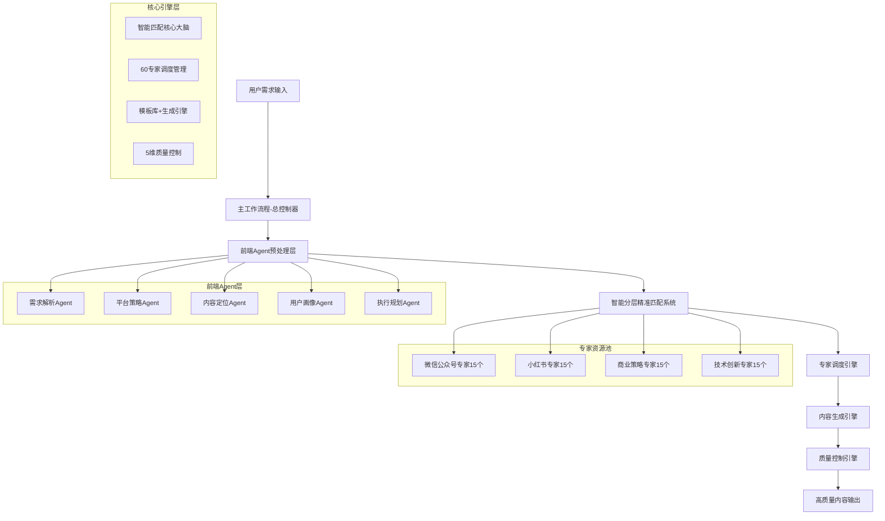

# AI写作2.0 - 主工作流程 (Master Workflow)

## 🎯 系统总览

**AI写作2.0主工作流程**是整个系统的总控制器和协调中心，采用方案A架构设计，负责统一调度前端Agent预处理层、核心引擎层、专家资源层和生态扩展层，实现从"用户需求输入"到"高质量内容输出"的完整闭环。

### ⚡ 核心使命
> **作为系统总入口，智能协调60个专家资源，为用户提供专业化、个性化的AI写作服务**

---

## 🏗️ 系统架构 (方案A)



---

## 🚀 主工作流程执行逻辑

### **阶段1: 用户需求接收与预处理**
```yaml
输入处理:
  用户需求获取: 接收用户原始需求描述
  初步需求验证: 检查需求完整性和合理性
  上下文信息收集: 获取用户背景、历史偏好等信息
  
调用前端Agent预处理:
  步骤1: 调用内容定位Agent
    引用: @.cursor/rules/ai-write-2.0/engine/ai-write-2.0-agent-内容定位智能体.md
    功能: 确定内容类型和风格定位
    
  步骤2: 调用用户画像Agent
    引用: @.cursor/rules/ai-write-2.0/engine/ai-write-2.0-agent-用户画像智能体.md
    功能: 构建详细的用户画像数据
    
  步骤3: 调用执行规划Agent
    引用: @.cursor/rules/ai-write-2.0/engine/ai-write-2.0-agent-执行规划智能体.md
    功能: 制定具体的执行计划和策略

预处理结果整合:
  数据标准化: 将各Agent输出整合为标准格式
  质量验证: 确保预处理数据的完整性和准确性
  优先级排序: 根据重要性对需求要素进行排序
```

### **阶段2: 智能匹配与专家选择**
```yaml
调用智能匹配系统:
  引用: @.cursor/rules/ai-write-2.0/engine/ai-write-2.0-engine-智能分层精准匹配系统.md
  
输入数据:
  预处理结果: 前端Agent层输出的结构化数据
  用户画像: 详细的用户特征和偏好信息
  历史数据: 用户历史使用记录和反馈数据
  
匹配处理:
  复杂度分析: 评估需求复杂度等级(1-10分)
  专家筛选: 从60个专家中筛选候选专家
  组合策略: 确定单专家/双专家/团队协作模式
  置信度评估: 计算匹配成功概率
  
输出结果:
  推荐专家: 最优专家或专家组合
  匹配策略: 具体的协作和执行策略
  预期效果: 质量预期和交付时间预估
  风险评估: 潜在风险点和预防措施
```

### **阶段3: 专家调度与任务分配**
```yaml
调用专家调度引擎:
  引用: @.cursor/rules/ai-write-2.0/engine/ai-write-2.0-engine-专家调度引擎.md
  
调度策略:
  负载均衡: 根据专家当前工作负载进行分配
  能力匹配: 确保专家能力与任务要求完全匹配
  协作配置: 设置多专家协作的分工和协调机制
  时间安排: 制定详细的任务时间表和里程碑
  
专家资源调用:
  微信公众号专家池:
    爆款标题专家: @.cursor/rules/ai-write-2.0/zhuanjia/ai-write-2.0-zhuanjia-wx-爆款标题专家.md
    开头引流专家: @.cursor/rules/ai-write-2.0/zhuanjia/ai-write-2.0-zhuanjia-wx-开头引流专家.md
    正文结构专家: @.cursor/rules/ai-write-2.0/zhuanjia/ai-write-2.0-zhuanjia-wx-正文结构专家.md
    金句亮点专家: @.cursor/rules/ai-write-2.0/zhuanjia/ai-write-2.0-zhuanjia-wx-金句亮点专家.md
    结尾转化专家: @.cursor/rules/ai-write-2.0/zhuanjia/ai-write-2.0-zhuanjia-wx-结尾转化专家.md
    涨粉策略专家: @.cursor/rules/ai-write-2.0/zhuanjia/ai-write-2.0-zhuanjia-wx-涨粉策略专家.md
    变现方案专家: @.cursor/rules/ai-write-2.0/zhuanjia/ai-write-2.0-zhuanjia-wx-变现方案专家.md
    职场成长专家: @.cursor/rules/ai-write-2.0/zhuanjia/ai-write-2.0-zhuanjia-wx-职场成长专家.md
    个人成长专家: @.cursor/rules/ai-write-2.0/zhuanjia/ai-write-2.0-zhuanjia-wx-个人成长专家.md
    理财投资专家: @.cursor/rules/ai-write-2.0/zhuanjia/ai-write-2.0-zhuanjia-wx-理财投资专家.md
    创业商业专家: @.cursor/rules/ai-write-2.0/zhuanjia/ai-write-2.0-zhuanjia-wx-创业商业专家.md
  
  小红书专家池:
    美妆测评专家: @.cursor/rules/ai-write-2.0/zhuanjia/ai-write-2.0-zhuanjia-xhs-美妆专家.md
    护肤彩妆专家: @.cursor/rules/ai-write-2.0/zhuanjia/ai-write-2.0-zhuanjia-xhs-护肤专家.md
    穿搭时尚专家: @.cursor/rules/ai-write-2.0/zhuanjia/ai-write-2.0-zhuanjia-xhs-穿搭专家.md
    生活方式专家: @.cursor/rules/ai-write-2.0/zhuanjia/ai-write-2.0-zhuanjia-xhs-生活专家.md
    种草带货专家: @.cursor/rules/ai-write-2.0/zhuanjia/ai-write-2.0-zhuanjia-xhs-种草专家.md
    涨粉运营专家: @.cursor/rules/ai-write-2.0/zhuanjia/ai-write-2.0-zhuanjia-xhs-涨粉专家.md
    美食探店专家: @.cursor/rules/ai-write-2.0/zhuanjia/ai-write-2.0-zhuanjia-xhs-美食专家.md
    旅行攻略专家: @.cursor/rules/ai-write-2.0/zhuanjia/ai-write-2.0-zhuanjia-xhs-旅行专家.md
    好物推荐专家: @.cursor/rules/ai-write-2.0/zhuanjia/ai-write-2.0-zhuanjia-xhs-好物专家.md
    教育学习专家: @.cursor/rules/ai-write-2.0/zhuanjia/ai-write-2.0-zhuanjia-xhs-学习专家.md
    数码科技专家: @.cursor/rules/ai-write-2.0/zhuanjia/ai-write-2.0-zhuanjia-xhs-数码专家.md
    健康养生专家: @.cursor/rules/ai-write-2.0/zhuanjia/ai-write-2.0-zhuanjia-xhs-养生专家.md
    财经理财专家: @.cursor/rules/ai-write-2.0/zhuanjia/ai-write-2.0-zhuanjia-xhs-理财专家.md
  
  商业策略专家池:
    商业策略专家团队: @.cursor/rules/ai-write-2.0/zhuanjia/ai-write-2.0-商业策略专家团队.md
  
  技术创新专家池:
    技术创新专家团队: @.cursor/rules/ai-write-2.0/zhuanjia/ai-write-2.0-技术创新专家团队.md
```

### **阶段4: 内容生成与协作执行**
```yaml
调用内容生成引擎:
  引用: @.cursor/rules/ai-write-2.0/engine/ai-write-2.0-engine-内容生成引擎.md
  
生成策略:
  模板匹配: 根据内容类型选择最优模板
  结构构建: 按照平台特性构建内容结构
  专家协作: 多专家分工合作完成内容创作
  风格统一: 确保内容风格的一致性和专业性
  
内容优化:
  平台适配: 针对微信/小红书等平台优化格式
  SEO优化: 关键词布局和搜索优化
  互动设计: 增强用户互动和参与感
  转化优化: 提升内容的商业转化效果
```

### **阶段5: 质量控制与交付**
```yaml
调用质量控制引擎:
  引用: @.cursor/rules/ai-write-2.0/engine/ai-write-2.0-engine-质量控制引擎.md
  
质量检测:
  原创性检测: 25% 权重 - 确保内容原创性
  专业准确性: 25% 权重 - 验证专业知识准确性
  可读性评估: 20% 权重 - 评估内容可读性和流畅度
  平台适配度: 15% 权重 - 检查平台规范符合度
  用户价值度: 15% 权重 - 评估对用户的实际价值
  
质量优化:
  问题识别: 自动识别质量问题和改进点
  修改建议: 提供具体的修改建议和优化方案
  迭代优化: 支持多轮迭代优化直到达标
  最终验收: 确保内容达到用户期望的质量标准
```

### **阶段6: 学习反馈与系统优化**
```yaml
学习进化机制:
  通过质量控制引擎自动收集用户反馈和内容效果数据，持续优化专家能力和系统性能
  
反馈收集:
  用户满意度: 收集用户对最终结果的评价
  使用行为: 分析用户的使用模式和偏好
  效果数据: 跟踪内容发布后的实际效果
  专家反馈: 收集专家对协作过程的建议
  
系统优化:
  匹配算法: 基于反馈优化专家匹配算法
  流程改进: 优化工作流程的效率和质量
  专家培养: 提升专家能力和协作效果
  用户体验: 持续改善用户使用体验
```

---

## 📊 核心配置参数

### **系统运行参数**
```yaml
并发处理能力:
  最大并发任务: 50个
  单任务最大专家数: 5个
  平均响应时间: ≤30秒
  质量检测时间: ≤60秒

质量标准:
  最低质量分数: 75分
  推荐质量分数: 85分
  优秀质量分数: 95分
  满分质量分数: 100分

用户体验:
  界面响应时间: ≤3秒
  任务状态更新: 实时
  进度可视化: 完整显示
  错误处理: 友好提示
```

### **专家调度策略**
```yaml
负载均衡:
  专家工作量监控: 实时
  任务分配算法: 智能均衡
  超负荷预警: 80%阈值
  紧急调度机制: 备用专家池

协作模式:
  单专家模式: 简单需求(1-3分复杂度)
  双专家协作: 中等需求(4-6分复杂度)
  团队协作: 复杂需求(7-8分复杂度)
  生态协作: 专家级需求(9-10分复杂度)
```

---

## 🎯 输入输出规范

### **标准输入格式**
```json
{
  "user_id": "用户唯一标识",
  "request_id": "请求唯一标识",
  "timestamp": "请求时间戳",
  "user_requirement": {
    "content": "用户需求描述",
    "platform": "目标平台",
    "style": "期望风格",
    "deadline": "截止时间",
    "quality_level": "质量要求"
  },
  "user_context": {
    "user_profile": "用户画像数据",
    "history": "历史使用记录",
    "preferences": "个人偏好设置"
  }
}
```

### **标准输出格式**
```json
{
  "request_id": "请求唯一标识",
  "status": "处理状态",
  "result": {
    "content": "生成的最终内容",
    "metadata": {
      "assigned_experts": "分配的专家列表",
      "quality_score": "质量评分",
      "processing_time": "处理耗时",
      "optimization_suggestions": "优化建议"
    }
  },
  "feedback": {
    "satisfaction_survey": "满意度调查",
    "improvement_suggestions": "改进建议收集"
  }
}
```

---

## 🚨 异常处理机制

### **常见异常处理**
```yaml
需求解析失败:
  原因: 用户描述不清晰或信息不足
  处理: 自动生成澄清问题，引导用户补充
  备选: 使用通用模板进行基础处理

专家匹配失败:
  原因: 没有合适的专家或专家都忙碌
  处理: 启用备用专家池或调整匹配策略
  备选: 降级到通用专家处理

内容生成异常:
  原因: 专家协作冲突或技术故障
  处理: 重新分配专家或切换生成策略
  备选: 使用AI辅助生成基础版本

质量检测不通过:
  原因: 内容质量不达标
  处理: 返回给专家重新优化
  备选: 提供修改建议供用户自主优化
```

### **容错与恢复**
```yaml
系统容错:
  自动重试: 3次重试机制
  降级服务: 核心功能优先保证
  数据备份: 实时数据备份和恢复
  监控告警: 24/7系统状态监控

服务恢复:
  故障检测: 自动故障检测和定位
  快速切换: 备用服务自动接管
  数据恢复: 从备份快速恢复数据
  用户通知: 及时告知用户处理进展
```

---

## 📈 性能监控与优化

### **关键性能指标**
```yaml
业务指标:
  日活用户数: 目标10000+
  任务完成率: ≥95%
  用户满意度: ≥4.5/5.0
  专家利用率: 80-90%

技术指标:
  系统可用性: ≥99.9%
  平均响应时间: ≤30秒
  并发处理能力: 50个任务
  错误率: ≤1%

质量指标:
  内容原创性: ≥95%
  专业准确性: ≥90%
  平台适配率: ≥98%
  用户价值度: ≥85%
```

### **持续优化策略**
```yaml
数据驱动优化:
  用户行为分析: 深度挖掘使用模式
  效果数据跟踪: 内容发布后效果监控
  A/B测试: 不同策略效果对比
  机器学习: 算法模型持续训练

流程优化:
  瓶颈识别: 定期分析处理瓶颈
  流程简化: 去除冗余环节
  自动化升级: 提升自动化程度
  用户体验: 持续改善交互体验
```

---

**🎯 AI写作2.0主工作流程 - 智能协调，精准匹配，高质量输出！** 