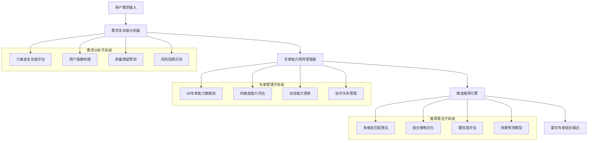

# AI写作2.0 - 智能分层精准匹配系统 (Intelligent Layered Precision Matching Engine)

## 🎯 系统概述

**智能分层精准匹配系统**是AI写作2.0的核心大脑，集成需求复杂度分析、专家能力矩阵管理、精准推荐算法于一体，通过多维度智能分析实现用户需求与60个专业专家的最优匹配，确保每个需求都能找到最合适的专家组合。

### ⚡ 核心使命
> **深度理解用户需求，科学管理专家能力，智能匹配最优组合，实现精准高效的专家调度**

---

## 🏗️ 三大核心子系统架构



---

## 🔍 子系统1：需求复杂度分析器

### **六维度复杂度评估框架**

#### **维度1：内容深度复杂度 (权重30%)**
```yaml
专业知识要求评估:
  基础级 (1-2分):
    - 常识性内容，无专业要求
    - 标识词: ['日常', '基础', '简单', '入门']
    
  进阶级 (3-4分):
    - 需要一定专业背景知识
    - 标识词: ['专业', '深入', '分析', '解读']
    
  专家级 (5-6分):
    - 需要深度专业知识
    - 标识词: ['权威', '专家', '深度', '前沿']
    
  顶级 (7-8分):
    - 需要行业前沿认知
    - 标识词: ['创新', '突破', '领先', '颠覆']

逻辑结构复杂度:
  简单线性 (1-3分): 单一主线，结构简单
  层次分明 (4-6分): 多层次结构，逻辑清晰
  复杂网状 (7-8分): 多维度交织，关系复杂
  系统性架构 (9-10分): 体系化深度结构

创新难度评估:
  模板套用 (1-2分): 标准模板即可满足
  适度创新 (3-5分): 需要一定创意元素
  突破创新 (6-8分): 需要显著创新突破
  颠覆创新 (9-10分): 需要颠覆性创新思维
```

#### **维度2：平台技术复杂度 (权重25%)**
```yaml
微信公众号技术评估:
  基础发布 (1-3分):
    - 基本图文发布
    - 标准排版格式
    - 简单互动设计
    
  进阶运营 (4-6分):
    - 多媒体内容整合
    - 用户行为数据分析
    - 精准推送策略
    
  专业运营 (7-8分):
    - 高级功能应用
    - 数据驱动优化
    - 系统化运营策略
    
  顶级运营 (9-10分):
    - 全生态链整合
    - AI技术应用
    - 创新功能开发

小红书技术评估:
  基础种草 (1-3分):
    - 标准图文发布
    - 基本标签运用
    - 简单互动回复
    
  进阶种草 (4-6分):
    - 视觉美学设计
    - 算法推荐优化
    - 数据化内容策略
    
  专业种草 (7-8分):
    - 深度用户洞察
    - 系统化内容矩阵
    - 商业化变现策略
    
  顶级种草 (9-10分):
    - 平台生态整合
    - 创新内容形式
    - 行业标杆打造
```

#### **维度3：商业目标复杂度 (权重20%)**
```yaml
目标层次分类:
  个人表达 (1-2分):
    - 纯粹分享表达
    - 无明确商业目标
    - 个人兴趣驱动
    
  影响力建设 (3-4分):
    - 个人品牌建设
    - 粉丝关注增长
    - 社交影响力扩大
    
  商业变现 (5-7分):
    - 产品销售转化
    - 服务推广营销
    - 商业合作拓展
    
  战略布局 (8-10分):
    - 品牌战略实施
    - 市场地位确立
    - 生态系统构建

ROI期望评估:
  无期望 (1分): 纯粹内容分享
  低期望 (2-3分): 基础互动反馈
  中期望 (4-6分): 明确转化目标
  高期望 (7-8分): 显著商业收益
  极高期望 (9-10分): 战略级投资回报
```

#### **维度4：用户互动复杂度 (权重15%)**
```yaml
互动深度要求:
  基础互动 (1-3分):
    - 点赞评论收藏
    - 简单问答回复
    - 基础社交反馈
    
  深度互动 (4-6分):
    - 深度话题讨论
    - 用户生成内容
    - 社群活动组织
    
  生态互动 (7-8分):
    - 跨平台联动
    - 多方协作互动
    - 价值网络构建
    
  创新互动 (9-10分):
    - 新型互动模式
    - 技术创新应用
    - 行业标杆案例
```

#### **维度5：时效性要求复杂度 (权重6%)**
```yaml
时效性等级:
  无时效要求 (1-2分): 永久性内容，无发布时间限制
  一般时效 (3-4分): 1-2周完成即可，适度时间压力
  紧急时效 (5-7分): 3-5天内必须完成，较强时间压力
  极急时效 (8-10分): 24-48小时内完成，极强时间压力

热点敏感度:
  非热点 (1-2分): 与当前热点无关
  弱相关 (3-4分): 与热点有一定关联
  强相关 (5-7分): 紧密关联当前热点
  热点核心 (8-10分): 热点事件核心内容
```

#### **维度6：协作需求复杂度 (权重4%)**
```yaml
协作规模评估:
  独立完成 (1-2分): 单人即可完成，无需外部协作
  小团队协作 (3-5分): 2-3人协作完成，明确分工合作
  大团队协作 (6-8分): 4-8人团队协作，复杂分工协调
  生态协作 (9-10分): 跨部门跨领域，外部资源整合

跨领域要求:
  单一领域 (1-2分): 专业领域内完成
  相关领域 (3-5分): 涉及2-3个相关领域
  跨界整合 (6-8分): 需要跨领域知识整合
  全生态整合 (9-10分): 需要全方位生态资源
```

### **复杂度计算核心算法**
```python
def calculate_comprehensive_complexity(user_input):
    """
    综合复杂度智能计算算法
    """
    # 多维度评估
    dimensions = {
        'content_depth': analyze_content_depth(user_input) * 0.30,
        'platform_tech': analyze_platform_technology(user_input) * 0.25,
        'business_objective': analyze_business_objective(user_input) * 0.20,
        'user_interaction': analyze_user_interaction(user_input) * 0.15,
        'timeliness': analyze_timeliness_requirement(user_input) * 0.06,
        'collaboration': analyze_collaboration_requirement(user_input) * 0.04
    }
    
    # 综合复杂度计算
    total_complexity = sum(dimensions.values())
    complexity_level = determine_complexity_level(total_complexity)
    
    return {
        "total_score": round(total_complexity, 2),
        "complexity_level": complexity_level,
        "dimension_scores": dimensions,
        "quality_expectation": predict_quality_expectation(user_input),
        "success_probability": predict_success_probability(dimensions)
    }

def determine_complexity_level(score):
    """复杂度等级分类"""
    if score >= 8.5: return "专家级"
    elif score >= 6.5: return "专业级"
    elif score >= 4.0: return "进阶级"
    else: return "基础级"
```

---

## 👥 子系统2：专家能力矩阵管理器

### **60专家完整能力数据库**

#### **微信公众号专家矩阵 (15位)**
```yaml
内容创作类专家 (5位):
  微信公众号爆款标题专家:
    专业等级: A级 (8.0分)
    平台专精: 微信深度专精 (9.0分)
    内容专长: 爆款引流专长 (9.0分), 商业转化专长 (7.0分)
    协作能力: 双人协作型
    核心标签: [标题党, 流量密码, 传播心理, 数据驱动]
    
  微信公众号开头引流专家:
    专业等级: B级 (6.0分)
    平台专精: 微信高度专精 (8.0分)
    内容专长: 爆款引流专长 (8.0分), 情感共鸣专长 (6.0分)
    协作能力: 独立作战型
    核心标签: [开篇钩子, 读者心理, 引流技巧, 留存设计]
    
  微信公众号正文结构专家:
    专业等级: B级 (6.0分)
    平台专精: 微信高度专精 (8.0分)
    内容专长: 专业科普专长 (8.0分), 情感共鸣专长 (6.0分)
    协作能力: 团队协作型
    核心标签: [逻辑结构, 阅读体验, 内容层次, 价值递进]
    
  微信公众号互动转化专家:
    专业等级: A级 (7.0分)
    平台专精: 微信深度专精 (9.0分)
    内容专长: 商业转化专长 (9.0分), 爆款引流专长 (7.0分)
    协作能力: 双人协作型
    核心标签: [互动设计, 转化路径, 用户行为, 变现模式]
    
  微信公众号情感共鸣专家:
    专业等级: A级 (7.0分)
    平台专精: 微信高度专精 (8.0分)
    内容专长: 情感共鸣专长 (9.0分), 专业科普专长 (6.0分)
    协作能力: 独立作战型
    核心标签: [情感洞察, 共鸣构建, 价值观引导, 情感表达]

垂直领域类专家 (5位):
  微信公众号财经投资专家:
    专业等级: S级 (9.0分)
    平台专精: 微信深度专精 (9.0分)
    内容专长: 专业科普专长 (9.0分), 商业转化专长 (8.0分)
    协作能力: 生态协作型
    核心标签: [投资理财, 市场分析, 风险管理, 财富规划]
    
  微信公众号科技数码专家:
    专业等级: A级 (7.0分)
    平台专精: 微信高度专精 (8.0分)
    内容专长: 专业科普专长 (8.0分), 爆款引流专长 (6.0分)
    协作能力: 团队协作型
    核心标签: [科技趋势, 产品评测, 技术解读, 数码生活]
    
  微信公众号教育培训专家:
    专业等级: A级 (8.0分)
    平台专精: 微信深度专精 (9.0分)
    内容专长: 专业科普专长 (9.0分), 情感共鸣专长 (7.0分)
    协作能力: 团队协作型
    核心标签: [知识传授, 学习方法, 技能培养, 成长引导]
    
  微信公众号健康养生专家:
    专业等级: A级 (7.0分)
    平台专精: 微信高度专精 (8.0分)
    内容专长: 专业科普专长 (8.0分), 情感共鸣专长 (7.0分)
    协作能力: 独立作战型
    核心标签: [健康科普, 养生知识, 生活方式, 医学常识]
    
  微信公众号职场发展专家:
    专业等级: A级 (8.0分)
    平台专精: 微信深度专精 (9.0分)
    内容专长: 专业科普专长 (8.0分), 情感共鸣专长 (8.0分)
    协作能力: 双人协作型
    核心标签: [职场技能, 职业规划, 人际关系, 个人成长]

生活方式类专家 (5位):
  微信公众号美食探店专家:
    专业等级: B级 (6.0分)
    平台专精: 微信中度专精 (7.0分)
    内容专长: 情感共鸣专长 (7.0分), 爆款引流专长 (6.0分)
    协作能力: 独立作战型
    核心标签: [美食评测, 探店体验, 生活情趣, 消费指南]
    
  微信公众号旅行攻略专家:
    专业等级: B级 (6.0分)
    平台专精: 微信中度专精 (7.0分)
    内容专长: 专业科普专长 (7.0分), 情感共鸣专长 (6.0分)
    协作能力: 独立作战型
    核心标签: [旅行规划, 攻略制作, 文化体验, 生活方式]
    
  微信公众号家居生活专家:
    专业等级: B级 (5.0分)
    平台专精: 微信中度专精 (6.0分)
    内容专长: 专业科普专长 (6.0分), 情感共鸣专长 (7.0分)
    协作能力: 独立作战型
    核心标签: [家居设计, 生活技巧, 居家体验, 品质生活]
    
  微信公众号育儿亲子专家:
    专业等级: A级 (7.0分)
    平台专精: 微信高度专精 (8.0分)
    内容专长: 情感共鸣专长 (8.0分), 专业科普专长 (7.0分)
    协作能力: 双人协作型
    核心标签: [育儿知识, 亲子关系, 成长教育, 家庭和谐]
    
  微信公众号情感心理专家:
    专业等级: A级 (8.0分)
    平台专精: 微信高度专精 (8.0分)
    内容专长: 情感共鸣专长 (9.0分), 专业科普专长 (7.0分)
    协作能力: 独立作战型
    核心标签: [情感咨询, 心理健康, 人际关系, 自我成长]
```

#### **小红书专家矩阵 (15位)**
```yaml
美妆时尚类专家 (5位):
  小红书美妆测评专家:
    专业等级: A级 (8.0分)
    平台专精: 小红书深度专精 (9.0分)
    内容专长: 专业科普专长 (8.0分), 商业转化专长 (9.0分)
    协作能力: 双人协作型
    核心标签: [产品测评, 成分分析, 种草技巧, 美妆趋势]
    
  小红书护肤科普专家:
    专业等级: A级 (8.0分)
    平台专精: 小红书深度专精 (9.0分)
    内容专长: 专业科普专长 (9.0分), 情感共鸣专长 (6.0分)
    协作能力: 独立作战型
    核心标签: [护肤知识, 肌肤问题, 成分科普, 护理方案]
    
  小红书穿搭时尚专家:
    专业等级: A级 (7.0分)
    平台专精: 小红书深度专精 (9.0分)
    内容专长: 爆款引流专长 (8.0分), 情感共鸣专长 (7.0分)
    协作能力: 独立作战型
    核心标签: [穿搭灵感, 时尚趋势, 风格搭配, 美学教育]
    
  小红书变美技巧专家:
    专业等级: B级 (6.0分)
    平台专精: 小红书高度专精 (8.0分)
    内容专长: 专业科普专长 (7.0分), 爆款引流专长 (7.0分)
    协作能力: 独立作战型
    核心标签: [变美技巧, 形象管理, 美容方法, 自信建设]
    
  小红书购物种草专家:
    专业等级: A级 (7.0分)
    平台专精: 小红书深度专精 (9.0分)
    内容专长: 商业转化专长 (9.0分), 爆款引流专长 (8.0分)
    协作能力: 双人协作型
    核心标签: [种草文案, 产品推荐, 购物指南, 消费决策]

生活方式类专家 (5位):
  小红书生活vlog专家:
    专业等级: B级 (6.0分)
    平台专精: 小红书高度专精 (8.0分)
    内容专长: 情感共鸣专长 (8.0分), 爆款引流专长 (6.0分)
    协作能力: 独立作战型
    核心标签: [生活记录, 日常分享, 情感表达, 生活美学]
    
  小红书美食分享专家:
    专业等级: B级 (6.0分)
    平台专精: 小红书高度专精 (8.0分)
    内容专长: 情感共鸣专长 (7.0分), 爆款引流专长 (7.0分)
    协作能力: 独立作战型
    核心标签: [美食制作, 食谱分享, 生活情趣, 健康饮食]
    
  小红书居家装饰专家:
    专业等级: B级 (5.0分)
    平台专精: 小红书中度专精 (7.0分)
    内容专长: 专业科普专长 (6.0分), 情感共鸣专长 (6.0分)
    协作能力: 独立作战型
    核心标签: [家居布置, 装饰技巧, 空间美学, 生活品质]
    
  小红书旅行打卡专家:
    专业等级: B级 (6.0分)
    平台专精: 小红书高度专精 (8.0分)
    内容专长: 情感共鸣专长 (7.0分), 爆款引流专长 (7.0分)
    协作能力: 独立作战型
    核心标签: [旅行攻略, 打卡分享, 风景记录, 文化体验]
    
  小红书好物推荐专家:
    专业等级: A级 (7.0分)
    平台专精: 小红书深度专精 (9.0分)
    内容专长: 商业转化专长 (8.0分), 专业科普专长 (7.0分)
    协作能力: 双人协作型
    核心标签: [好物分享, 产品评测, 消费指南, 生活优化]

专业技能类专家 (5位):
  小红书学习方法专家:
    专业等级: A级 (8.0分)
    平台专精: 小红书高度专精 (8.0分)
    内容专长: 专业科普专长 (9.0分), 情感共鸣专长 (7.0分)
    协作能力: 团队协作型
    核心标签: [学习技巧, 知识管理, 效率提升, 认知成长]
    
  小红书职场技能专家:
    专业等级: A级 (7.0分)
    平台专精: 小红书高度专精 (8.0分)
    内容专长: 专业科普专长 (8.0分), 商业转化专长 (6.0分)
    协作能力: 双人协作型
    核心标签: [职场技能, 工作效率, 职业发展, 能力提升]
    
  小红书副业赚钱专家:
    专业等级: A级 (7.0分)
    平台专精: 小红书深度专精 (9.0分)
    内容专长: 商业转化专长 (8.0分), 专业科普专长 (7.0分)
    协作能力: 双人协作型
    核心标签: [副业指导, 赚钱方法, 创业思维, 财富积累]
    
  小红书健身运动专家:
    专业等级: B级 (6.0分)
    平台专精: 小红书高度专精 (8.0分)
    内容专长: 专业科普专长 (7.0分), 情感共鸣专长 (6.0分)
    协作能力: 独立作战型
    核心标签: [健身指导, 运动计划, 体型管理, 健康生活]
    
  小红书理财投资专家:
    专业等级: A级 (8.0分)
    平台专精: 小红书高度专精 (8.0分)
    内容专长: 专业科普专长 (8.0分), 商业转化专长 (7.0分)
    协作能力: 团队协作型
    核心标签: [理财规划, 投资教育, 财富管理, 风险控制]
```

#### **引用专家资源 (30位)**
```yaml
商业策略系列专家 (15位) - 引用路径: @.cursor/rules/ai-write-1.0/zhuanjia/
技术创新系列专家 (15位) - 引用路径: @.cursor/rules/ai-write-1.0/zhuanjia/
```

### **动态能力评估机制**
```yaml
实时能力更新系统:
  数据来源:
    - 用户反馈评分 (1-10分)
    - 任务完成质量评估
    - 协作效果评分
    - 创新能力表现
    - 学习成长记录
    
  更新频率:
    - 实时更新: 每次任务完成后
    - 周度调整: 微调优化
    - 月度评估: 深度能力评估
    - 季度升级: 等级重新评定
    
  能力变化规则:
    晋升条件:
      - 连续30天平均评分≥8.5分
      - 用户满意度≥95%
      - 创新表现突出
    降级预警:
      - 连续7天平均评分≤6.0分
      - 用户满意度≤80%
      - 协作问题频发
```

---

## 🎯 子系统3：精准推荐引擎

### **多维度匹配算法核心**
```python
def intelligent_expert_matching(requirement_analysis, expert_database):
    """
    智能专家匹配核心算法
    """
    matching_scores = {}
    
    for expert_id, expert_data in expert_database.items():
        # 计算综合匹配度
        score = calculate_comprehensive_match_score(
            requirement_analysis, expert_data
        )
        matching_scores[expert_id] = score
    
    # 根据复杂度选择组合策略
    complexity_level = requirement_analysis['complexity_level']
    
    if complexity_level == "基础级":
        return select_single_expert_strategy(matching_scores)
    elif complexity_level == "进阶级":
        return select_dual_expert_strategy(matching_scores)
    elif complexity_level == "专业级":
        return select_team_collaboration_strategy(matching_scores)
    else:  # 专家级
        return select_ecosystem_collaboration_strategy(matching_scores)

def calculate_comprehensive_match_score(requirement, expert):
    """
    综合匹配度评分算法
    """
    score = 0
    
    # 平台专精度匹配 (权重35%)
    platform_match = expert['platform_expertise'].get(
        requirement['platform_type'], 0
    )
    score += platform_match * 0.35
    
    # 内容类型契合度 (权重30%)
    content_match = expert['content_specialization'].get(
        requirement['content_category'], 0
    )
    score += content_match * 0.30
    
    # 专业领域对应度 (权重20%)
    domain_match = expert['domain_expertise'].get(
        requirement['professional_domain'], 0
    )
    score += domain_match * 0.20
    
    # 复杂度胜任力 (权重10%)
    complexity_capability = expert['complexity_handling_ability']
    requirement_complexity = requirement['complexity_score']
    complexity_match = min(complexity_capability / requirement_complexity, 1.0)
    score += complexity_match * 0.10
    
    # 协作能力匹配 (权重5%)
    collaboration_match = calculate_collaboration_compatibility(
        requirement['collaboration_need'], expert['collaboration_type']
    )
    score += collaboration_match * 0.05
    
    return min(score, 1.0)
```

### **四种组合策略优化**
```yaml
单专家策略 (基础级需求):
  适用场景: 复杂度1-3分的简单明确需求
  选择标准: 最高匹配度专家
  执行模式: 独立完成，提供模板和指导
  质量预期: 75-85分
  
双专家协作 (进阶级需求):
  适用场景: 复杂度4-6分的多维度需求
  选择标准: 主导专家(匹配度>0.8) + 协作专家(互补性强)
  执行模式: 主导输出 + 专业建议
  质量预期: 80-90分
  
团队协作 (专业级需求):
  适用场景: 复杂度7-8分的复杂综合需求
  选择标准: 3-4个专家，专业能力互补
  执行模式: 分工合作 + 统一整合
  质量预期: 85-95分
  
生态协作 (专家级需求):
  适用场景: 复杂度9-10分的企业级需求
  选择标准: 5+专家 + 外部资源整合
  执行模式: 全链条专业服务
  质量预期: 90-100分
```

### **智能推荐置信度评估**
```python
def calculate_recommendation_confidence(matching_result):
    """
    推荐置信度计算算法
    """
    confidence_factors = {
        'expert_match_score': matching_result['primary_expert_score'],
        'requirement_clarity': assess_requirement_clarity(matching_result),
        'expert_availability': check_expert_availability(matching_result),
        'historical_success_rate': get_historical_success_rate(matching_result),
        'collaboration_compatibility': assess_collaboration_compatibility(matching_result)
    }
    
    # 加权计算置信度
    weights = {
        'expert_match_score': 0.35,
        'requirement_clarity': 0.25,
        'expert_availability': 0.20,
        'historical_success_rate': 0.15,
        'collaboration_compatibility': 0.05
    }
    
    confidence = sum(
        confidence_factors[factor] * weights[factor] 
        for factor in confidence_factors
    )
    
    return {
        'confidence_score': round(confidence, 3),
        'confidence_level': determine_confidence_level(confidence),
        'risk_factors': identify_risk_factors(confidence_factors),
        'optimization_suggestions': generate_optimization_suggestions(confidence_factors)
    }
```

---

## 📊 系统输入输出规范

### **标准输入接口**
```json
{
  "request_id": "匹配请求唯一标识",
  "user_requirement": {
    "content": "用户需求描述",
    "platform": "目标平台(wechat/xiaohongshu)",
    "content_type": "内容类型",
    "quality_expectation": "质量期望等级",
    "deadline": "截止时间",
    "special_requirements": "特殊要求"
  },
  "user_context": {
    "user_id": "用户标识",
    "user_profile": "用户画像数据",
    "history": "历史使用记录",
    "preferences": "个人偏好设置"
  }
}
```

### **标准输出接口**
```json
{
  "matching_result": {
    "request_id": "请求标识",
    "recommended_experts": [
      {
        "expert_id": "专家标识",
        "expert_name": "专家名称",
        "role": "主导/协作/顾问",
        "match_score": "匹配度评分",
        "specialization": "专业特长"
      }
    ],
    "collaboration_strategy": {
      "strategy_type": "协作策略类型",
      "workflow": "工作流程安排",
      "timeline": "时间安排",
      "deliverables": "交付物说明"
    },
    "quality_prediction": {
      "expected_score": "预期质量评分",
      "confidence_level": "置信度等级",
      "risk_assessment": "风险评估",
      "success_probability": "成功概率"
    }
  },
  "optimization_suggestions": [
    {
      "type": "优化类型",
      "suggestion": "具体建议",
      "impact": "预期影响"
    }
  ]
}
```

---

## 🔄 学习优化与进化机制

### **实时反馈学习循环**
```yaml
数据收集维度:
  用户满意度: 1-10分用户评价
  任务完成质量: 专家内部评估
  协作效果评估: 团队协作表现
  创新能力表现: 创意创新程度
  学习成长记录: 专业技能提升

算法优化策略:
  匹配权重动态调整:
    - 成功率高的匹配模式权重+0.1
    - 失败率高的匹配模式权重-0.1
    - 每周进行权重优化
    
  专家能力评级更新:
    - 基于用户反馈的能力评分
    - 基于作品质量的等级调整
    - 每月进行能力矩阵更新
    
  新场景模式识别:
    - 识别新兴需求模式
    - 开发对应匹配策略
    - 扩展专家能力边界
```

### **预测性匹配优化**
```yaml
趋势预测分析:
  热门内容类型预测: 基于平台数据分析
  用户需求变化趋势: 基于历史数据挖掘
  专家能力发展方向: 基于市场需求预测

前瞻性匹配策略:
  - 提前布局热门领域专家
  - 预测性专家能力培养
  - 前瞻性匹配算法调优
```

---

## 📈 性能监控与质量保证

### **核心KPI监控**
```yaml
匹配准确性指标:
  匹配成功率: ≥95%
  用户满意度: ≥4.5/5.0
  专家利用率: 80-90%
  响应时间: ≤3秒

质量控制指标:
  推荐置信度: ≥85%
  协作成功率: ≥90%
  任务完成率: ≥95%
  迭代优化率: ≥80%

系统性能指标:
  并发处理能力: 100个请求/秒
  数据处理延迟: ≤1秒
  系统可用性: ≥99.9%
  错误恢复时间: ≤30秒
```

### **异常处理与容错机制**
```yaml
常见异常处理:
  需求解析失败:
    - 自动生成澄清问题
    - 使用通用匹配策略
    - 人工介入辅助
    
  专家匹配失败:
    - 启用备用专家池
    - 调整匹配阈值
    - 降级到相近专家
    
  系统性能异常:
    - 自动负载均衡
    - 降级服务保证
    - 实时监控告警

容错恢复机制:
  - 3次自动重试
  - 数据实时备份
  - 故障快速切换
  - 服务降级策略
```

---

**🎯 AI写作2.0智能分层精准匹配系统 - 深度理解，科学管理，智能匹配，精准高效！** 