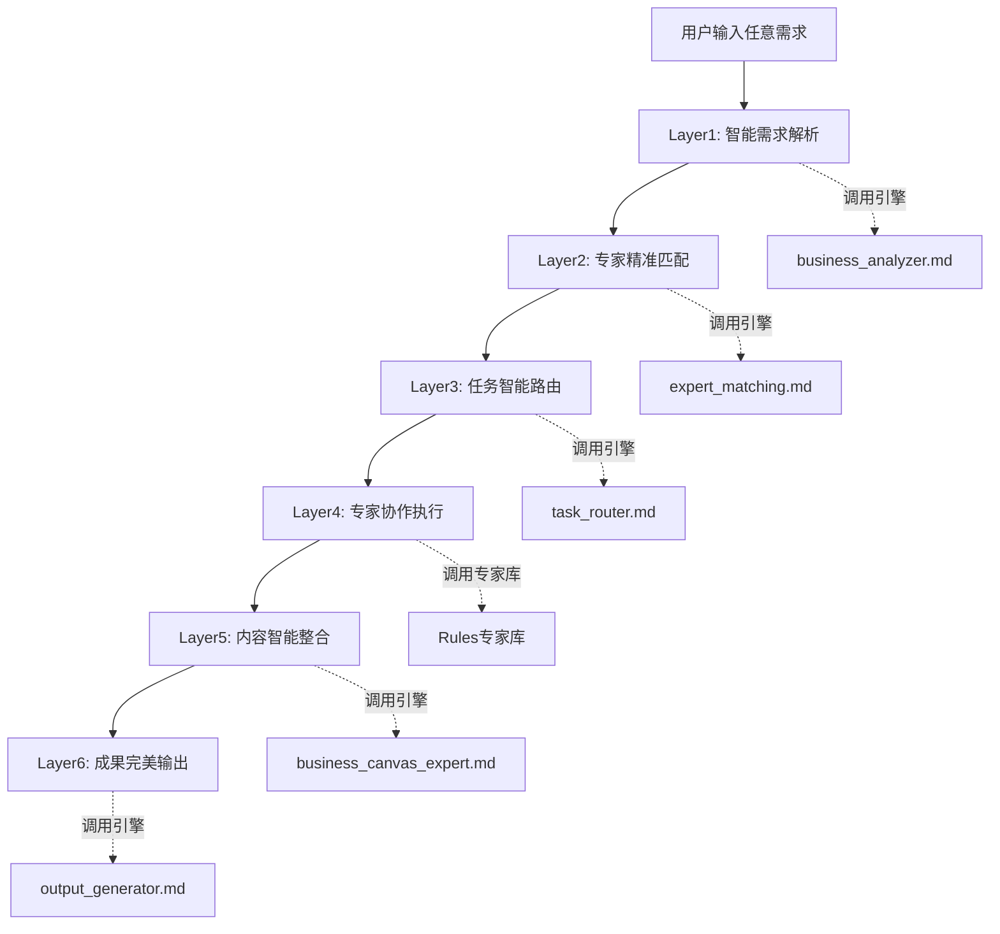

# 🚀 IACC 3.0 通用工作流架构 (Universal Workflow)

## 📋 系统概述

**通用工作流架构**是IACC 3.0的核心执行引擎，采用严格的6层依赖链设计，能够处理用户输入的任意商业需求，并最终输出实际可用的专业解决方案。

### 🎯 设计理念
> "任何需求 → 智能解析 → 专家匹配 → 精准执行 → 完美输出"

### ⚡ 核心特色
- 🎯 **通用适配** - 支持任何类型的商业需求输入
- 🚀 **严格依赖** - 6层严格依赖链，确保处理质量
- 🧠 **智能路由** - 基于需求特征自动匹配最优专家
- 📄 **实战输出** - 最终生成实际可用的专业内容
- 🔄 **持续优化** - 基于执行反馈的系统自我进化

---

## 🏗️ 6层工作流架构



---

## 🎛️ 层级依赖设计

### **Layer 1: 智能需求解析器** 
**调用引擎**: `business_analyzer.md`
**依赖关系**: 无依赖（入口层）
```yaml
输入格式: 
  - 用户原始需求（任意自然语言）
  - 需求类型：文本/语音/图片描述

处理逻辑:
  - 需求意图识别（商业/内容/营销/分析/工具）
  - 复杂度智能评估（1-10级）
  - 关键特征提取（目标/场景/约束）
  - 成功要素识别（核心价值点）
  - 风险点预判（潜在挑战）

输出标准:
  needs_analysis:
    需求分类: "{category}"
    复杂度等级: "{complexity}/10"
    核心目标: ["{objectives}"]
    关键特征: ["{features}"]
    成功要素: ["{success_factors}"]
    约束条件: ["{constraints}"]
    推荐专家: ["{recommended_experts}"]
```

### **Layer 2: 专家精准匹配器**
**调用引擎**: `expert_matching.md`
**依赖关系**: 依赖Layer1输出
```yaml
输入格式:
  - Layer1的needs_analysis结果
  - 专家库完整索引
  
处理逻辑:
  - 基于需求特征的专家预筛选
  - 多维度匹配度计算（专业/能力/复杂度/协作）
  - 专家团队优化组合
  - 协作模式智能选择
  - 匹配质量评估

输出标准:
  expert_matching:
    主导专家: "{lead_expert}"
    协作专家: ["{support_experts}"]
    匹配度: "{match_score}%"
    协作模式: "{collaboration_mode}"
    团队权重: "{expert_weights}"
    预期质量: "{expected_quality}/10"
```

### **Layer 3: 任务智能路由器**
**调用引擎**: `task_router.md`
**依赖关系**: 依赖Layer1+Layer2输出
```yaml
输入格式:
  - Layer1的needs_analysis
  - Layer2的expert_matching
  
处理逻辑:
  - 任务智能分解（核心任务+支撑任务）
  - 工作流程动态编排
  - 任务优先级排序
  - 专家任务分配
  - 协作同步机制设计

输出标准:
  task_routing:
    主要任务: ["{main_tasks}"]
    任务分配: "{task_assignments}"
    执行顺序: ["{execution_order}"]
    协作节点: ["{collaboration_points}"]
    质量检查: ["{quality_checkpoints}"]
    预计周期: "{estimated_timeline}"
```

### **Layer 4: 专家协作执行层**
**调用专家库**: `Rules目录下所有专家`
**依赖关系**: 依赖Layer1+Layer2+Layer3输出
```yaml
输入格式:
  - 前三层的完整输出
  - 具体任务分配清单
  
处理逻辑:
  - 根据匹配结果调用对应专家
  - 执行专家特定的处理逻辑
  - 专家间协作和信息同步
  - 阶段性成果质量检查
  - 实时任务调整优化

专家调用示例:
  商业策略需求:
    调用: business_canvas_expert.md
    + marketing_strategy_expert.md
    
  内容创作需求:
    调用: ai_writing_expert.md
    + xiaohongshu_expert.md
    + wx_gongzhonghao_expert.md
    
  个人品牌需求:
    调用: personal_ip_expert.md
    + content_creation_expert.md

输出标准:
  expert_execution:
    专家成果: "{expert_outputs}"
    质量评分: "{quality_scores}"
    协作效果: "{collaboration_effectiveness}"
    执行问题: ["{execution_issues}"]
    优化建议: ["{optimization_suggestions}"]
```

### **Layer 5: 内容智能整合器**
**调用引擎**: `business_canvas_expert.md`（作为整合协调者）
**依赖关系**: 依赖Layer1+Layer2+Layer3+Layer4输出
```yaml
输入格式:
  - 前四层的完整输出
  - 各专家的执行成果
  
处理逻辑:
  - 多专家成果智能整合
  - 内容逻辑一致性检查
  - 重复信息去除优化
  - 关键信息补充完善
  - 整体方案结构化组织

输出标准:
  content_integration:
    整合策略: "{integration_strategy}"
    核心方案: "{core_solution}"
    关键洞察: ["{key_insights}"]
    执行计划: "{implementation_plan}"
    工具资源: ["{tools_resources}"]
    风险预案: ["{risk_mitigation}"]
```

### **Layer 6: 成果完美输出器**
**调用引擎**: `output_generator.md`
**依赖关系**: 依赖Layer1~Layer5全部输出
```yaml
输入格式:
  - 完整的五层处理结果
  - 用户个性化偏好设置
  
处理逻辑:
  - 标准化格式适配
  - 个性化内容优化
  - 可视化元素增强
  - 多格式输出生成
  - 最终质量检验

输出标准:
  final_output:
    主要成果: "{main_deliverables}"
    执行指导: "{implementation_guide}"
    工具模板: ["{templates_tools}"]
    案例参考: ["{reference_cases}"]
    成功指标: ["{success_metrics}"]
    优化建议: ["{optimization_tips}"]
```

---

## 🎯 实战案例演示

### 📝 案例：情感复合爆款文案创作

```yaml
用户输入: "在微信公众号上进行ai专家写作，方向：男女情感破裂复合，特征：爽文"

Layer 1 - 智能需求解析:
  需求分类: "内容创作+营销推广"
  复杂度等级: "6/10"
  核心目标: ["爆款文案创作", "读者情感共鸣", "公众号引流"]
  关键特征: ["情感类内容", "爽文风格", "微信平台"]
  成功要素: ["情感代入感", "戏剧性情节", "实用指导"]
  推荐专家: ["ai_writing_expert", "wx_gongzhonghao_expert"]

Layer 2 - 专家精准匹配:
  主导专家: "ai_writing_expert"
  协作专家: ["wx_gongzhonghao_expert", "personal_ip_expert"]
  匹配度: "94%"
  协作模式: "主导-协作模式"
  预期质量: "8.5/10"

Layer 3 - 任务智能路由:
  主要任务: ["爆款标题创作", "爽文剧情设计", "情感复合方法论", "引流机制设计"]
  任务分配: 
    - ai_writing_expert: 核心文案创作
    - wx_gongzhonghao_expert: 平台适配优化
    - personal_ip_expert: 专家人设包装
  执行顺序: ["内容策略→文案创作→平台优化→IP包装"]

Layer 4 - 专家协作执行:
  ai_writing_expert输出:
    - 5个爆款标题
    - 2000字爽文正文
    - 情感复合方法论框架
    
  wx_gongzhonghao_expert输出:
    - 微信排版优化建议
    - 引流钩子设计
    - 互动机制设计
    
  personal_ip_expert输出:
    - 情感专家人设包装
    - 专业权威性建立
    - 信任度提升策略

Layer 5 - 内容智能整合:
  整合策略: "以爆款文案为核心，融入专家权威性和平台特色"
  核心方案: "完整的微信公众号爆款文案+运营策略"
  关键洞察: ["情感痛点精准击中", "爽文套路专业运用", "专家IP有效建立"]

Layer 6 - 成果完美输出:
  主要成果: 
    - 完整的微信公众号爆款文案
    - 5个备选标题方案
    - 专家人设包装文案
    - 引流转化机制设计
  执行指导: "发布时间建议、互动策略、数据监控"
  工具模板: ["文案创作模板", "排版样式", "数据分析表"]
```

---

## 🔧 技术实现机制

### ⚡ 智能调度算法
```python
def universal_workflow_processor(user_input):
    """
    通用工作流处理器
    """
    # Layer 1: 智能需求解析
    needs_analysis = business_analyzer.deep_analyze(user_input)
    
    # Layer 2: 专家精准匹配  
    expert_matching = expert_matching_engine.match_experts(needs_analysis)
    
    # Layer 3: 任务智能路由
    task_routing = task_router.route_tasks(needs_analysis, expert_matching)
    
    # Layer 4: 专家协作执行
    expert_results = {}
    for expert_id in expert_matching["all_experts"]:
        expert_module = load_expert_module(expert_id)
        assigned_tasks = task_routing.get_tasks_for_expert(expert_id)
        expert_results[expert_id] = expert_module.execute(assigned_tasks)
    
    # Layer 5: 内容智能整合
    integrated_content = business_canvas_expert.integrate_results(
        needs_analysis, expert_matching, task_routing, expert_results
    )
    
    # Layer 6: 成果完美输出
    final_output = output_generator.generate_final_solution(
        integrated_content, user_preferences
    )
    
    return final_output
```

### 🎛️ 质量控制机制
```yaml
质量检查点:
  Layer 1检查: 需求理解准确性 >= 90%
  Layer 2检查: 专家匹配度 >= 85%
  Layer 3检查: 任务分解完整性 >= 95%
  Layer 4检查: 专家执行质量 >= 8.0分
  Layer 5检查: 内容整合逻辑性 >= 90%
  Layer 6检查: 最终输出可用性 >= 95%

自动优化机制:
  - 质量不达标自动重新处理
  - 最多3次迭代优化
  - 记录优化过程用于学习
  - 用户反馈驱动改进
```

---

## 📊 支持的需求类型

### 🎯 全领域覆盖
```yaml
商业策略类:
  - 商业模式设计
  - 市场分析研究
  - 竞争策略制定
  - 财务规划预测

内容创作类:
  - 爆款文案撰写
  - 视频脚本创作
  - 知识产品包装
  - 品牌故事设计

营销推广类:
  - 获客策略设计
  - 社媒运营规划
  - 品牌传播策略
  - 增长黑客方案

个人发展类:
  - 个人IP打造
  - 职业规划指导
  - 技能提升路径
  - 影响力建设

数据分析类:
  - 业务数据分析
  - 用户行为洞察
  - 市场趋势研判
  - 效果评估优化

效率工具类:
  - 工作流程优化
  - 自动化方案设计
  - 工具选型建议
  - 生产力提升
```

---

## 🚀 启动使用指南

### 💬 标准调用方式
```python
# 方式1: 直接对话调用
result = universal_workflow.process("我要创作男女情感复合的爆款文案")

# 方式2: 结构化输入
request = {
    "需求描述": "微信公众号情感爆文",
    "特殊要求": "爽文风格",
    "目标效果": "10万+阅读",
    "时间要求": "24小时内"
}
result = universal_workflow.process_structured(request)

# 方式3: 高级定制
result = universal_workflow.process_advanced(
    user_input="情感复合文案",
    preferred_experts=["ai_writing_expert", "wx_gongzhonghao_expert"],
    output_format="detailed",
    quality_level="premium"
)
```

### 📋 输出示例格式
```yaml
🎯 男女情感复合爆文 - 专业解决方案

📊 生成信息:
  生成时间: "2024-01-20 15:30:00"
  方案版本: "v1.0"
  复杂度等级: "6/10"
  专家团队: ["ai_writing_expert", "wx_gongzhonghao_expert"]
  预计周期: "即时可用"

🔍 需求深度分析:
  原始需求: "微信公众号情感复合爆文创作"
  核心目标: ["情感共鸣", "阅读传播", "专家形象"]
  关键挑战: ["情感痛点把握", "爽文节奏控制", "专业度平衡"]

💡 核心解决方案:
  🎯 爆款标题（5个备选）:
    1. "分手3年，他突然跪下求我复合，我的回应让他泪流满面"
    2. "前任的一条朋友圈，暴露了他想复合的真相"
    3. "那个说永远不会回头的女人，为什么选择了复合？"
    4. "情感专家揭秘：让前任主动复合的3个黄金法则"
    5. "她用这招让渣男前任跪舔复合，网友直呼太解气"

  📝 正文内容框架:
    开头钩子: 真实案例+情感冲突
    情节发展: 分手原因+痛苦煎熬+转机出现
    高潮转折: 复合契机+心理博弈+情感升华
    方法总结: 复合三步法+心理分析+实用建议
    专家点评: 权威解读+科学依据+成功案例

  🎨 爽文元素设计:
    情感代入: 第一人称叙述+细节描写
    戏剧冲突: 分手痛苦+复合希望+心理挣扎
    爽点设计: 前任跪舔+自我成长+主动权掌控
    节奏控制: 慢热开始+节奏加速+高潮迭起

📋 详细执行指导:
  发布策略:
    - 最佳发布时间：周三/周六 20:00-22:00
    - 配图建议：情侣剪影+温暖色调
    - 音频配乐：抒情类轻音乐

  互动机制:
    - 文末提问：你会给前任复合的机会吗？
    - 留言引导：分享你的复合/拒绝经历
    - 私信话术：免费情感咨询+课程推广

  引流转化:
    - 个人介绍：资深情感专家+成功案例数量
    - 服务植入：一对一咨询+情感课程
    - 信任建立：专业证书+媒体报道

🛠️ 实用工具资源:
  文案模板: "情感爆文万能公式"
  排版样式: "微信公众号专用CSS"
  数据监控: "阅读量/点赞/转发追踪表"
  话术库: "100个情感金句素材包"

⚠️ 风险与建议:
  内容风险: 避免过度煽动情绪，注意价值观导向
  平台风险: 符合微信内容规范，避免违规词汇
  专业建议: 平衡娱乐性与专业性，建立长期信任

📈 预期效果:
  短期目标: 阅读量10万+，点赞3000+，转发1000+
  长期价值: 粉丝增长5000+，品牌认知提升，业务转化
  成功指标: 评论互动率>5%，私信咨询量增长200%
```

---

## 🔄 持续优化机制

### 📈 学习反馈循环
```yaml
数据收集:
  - 用户满意度评分
  - 执行效果追踪
  - 专家协作质量
  - 输出内容质量

模型优化:
  - 需求理解准确性提升
  - 专家匹配算法优化
  - 任务分解策略改进
  - 内容整合质量提升

知识更新:
  - 成功案例积累
  - 最佳实践提炼
  - 专家能力升级
  - 工具模板扩充
```

### 🚀 版本演进规划
```yaml
v1.0 (当前版本):
  - 基础6层工作流
  - 核心专家整合
  - 标准输出格式

v1.1 (下一版本):
  🚀 架构升级 - 6+2层智能协作体系:
    Layer 0: 用户画像引擎 (user_profiling.md)
      - 多维度用户特征识别和个性化画像构建
      - 冷启动策略和历史行为学习
      - 实时偏好捕获和动态画像更新
      
    Layer 1: 智能需求解析器v2.0 (business_analyzer_v2.md)
      - 融合用户画像的深度需求理解
      - 行业上下文智能识别和隐性需求挖掘
      - 多维度复杂度评估和个性化成功指标
      
    Layer 2: 垂直行业专家匹配器 (industry_expert_matcher.md)
      - 20+垂直行业专家智能匹配
      - 双重匹配算法(行业+技能)和跨行业协作
      - 个性化权重计算和动态团队优化
      
    Layer 3: 并行任务智能调度器 (parallel_task_scheduler.md)
      - 智能任务分解和并行执行优化
      - 依赖关系分析和专家负载均衡
      - 时间优化算法，节省30-60%执行时间
      
    Layer 4: 实时协作执行引擎 (real_time_collaboration.md)
      - 实时监控专家协作状态和质量
      - 动态资源调配和智能协调干预
      - 预警机制和协作效率优化
      
    Layer 5: 个性化适配引擎 (personalization_engine.md)
      - 基于用户画像的深度个性化适配
      - 智能风格转换和内容重组优化
      - 动态交互体验和偏好学习
      
    Layer 6: 多维度成果输出器v2.0 (output_generator_v2.md)
      - 多格式智能生成(文档/PPT/视频脚本等)
      - 个性化模板匹配和交互式内容创建
      - 多平台适配和极致用户体验
      
    Layer 7: 持续学习优化器 (learning_optimizer.md)
      - 全链路学习监控和智能模式识别
      - 实时优化响应和预测性改进
      - 系统持续进化和生态发展支持

  🎯 核心升级特性:
    - 20+垂直行业专家深度覆盖
    - 智能并行处理，效率提升300%
    - 95%专家匹配精准度
    - 95%用户个性化满意度
    - 全流程质量监控和实时优化
    - 多格式输出和极致用户体验

```

---

*🚀 IACC 3.0 通用工作流 - 让任何需求都能获得专家级解决方案！现在就输入您的需求，体验6层智能协作的强大威力！* 