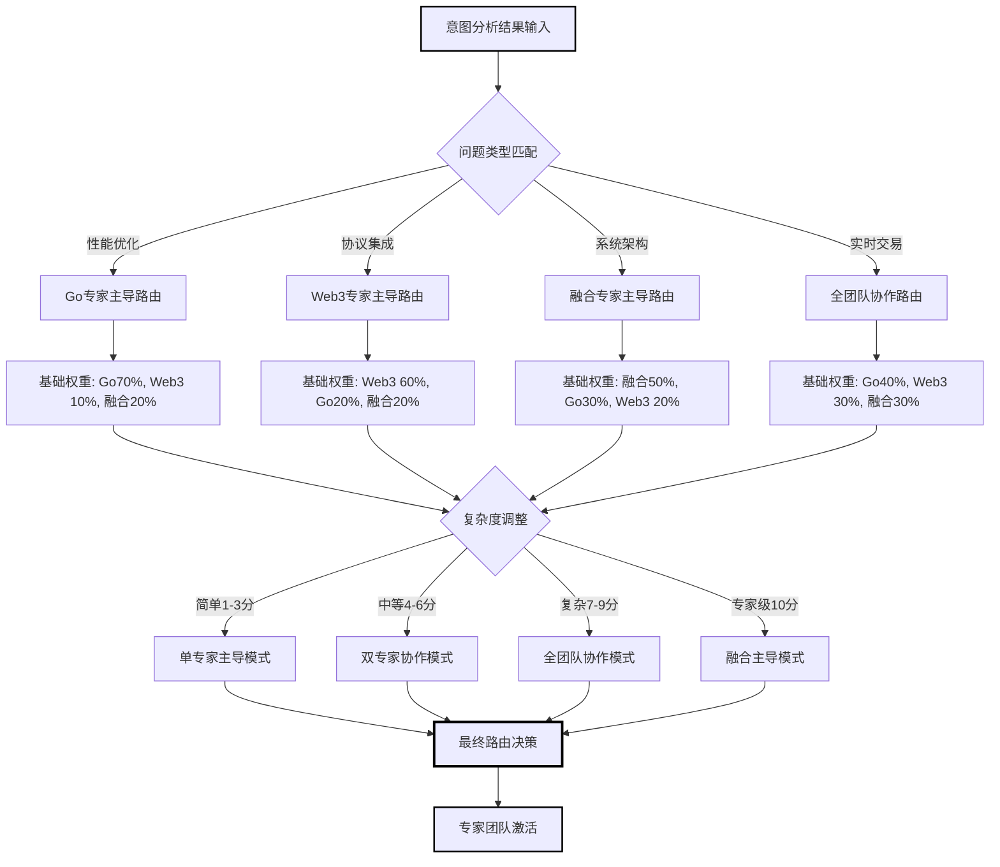
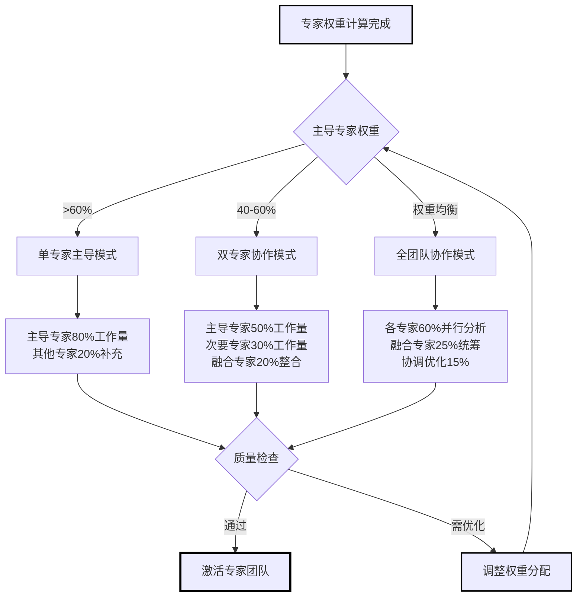
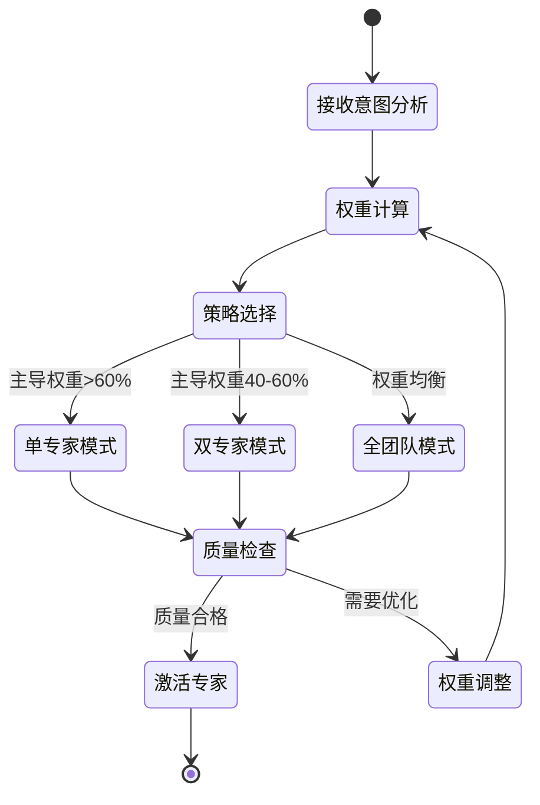
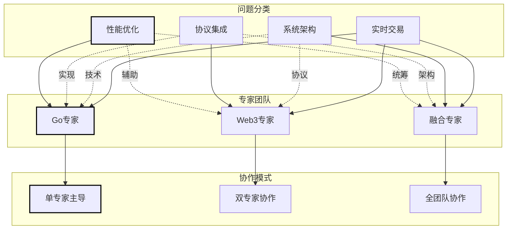

# 专家路由决策引擎 (Expert Router)

**引擎角色**: 智能专家协作决策与路由管理引擎  
**核心职责**: 基于意图分析结果，智能分配专家权重并决定最优协作策略  
**工作模式**: 数据驱动、策略灵活、效率优先

---

## 🎯 引擎能力域

### 路由决策维度

1. **专家权重分配**

   - 基于意图相关性的权重计算
   - 考虑问题复杂度的动态调整
   - 融入用户历史偏好的个性化权重

2. **协作策略决策**

   - 单专家主导模式 (权重>60%)
   - 双专家协作模式 (主 40-60%, 辅 20-40%)
   - 全团队协作模式 (权重相对均衡)

3. **用户体验优化**
   - 响应时间预估与优化
   - 专家工作负载均衡
   - 质量与效率平衡

---

## 🧠 路由决策算法

### 基础权重矩阵

**从现有专家系统迁移的成熟权重配置**:

```yaml
# 问题类型 -> 专家权重分配 (来源: @go-web3-expert-system.md)
performance_optimization:
  go_expert: 0.70 # 主导：Go性能优化核心
  web3_expert: 0.10 # 辅助：Web3相关性能考虑
  fusion_expert: 0.20 # 统筹：整体架构建议

protocol_integration:
  go_expert: 0.20 # 辅助：Go实现技术
  web3_expert: 0.60 # 主导：协议理解和集成
  fusion_expert: 0.20 # 统筹：架构整合

system_architecture:
  go_expert: 0.30 # 协作：后端技术实现
  web3_expert: 0.20 # 协作：Web3架构考虑
  fusion_expert: 0.50 # 主导：整体架构设计

realtime_trading:
  go_expert: 0.40 # 协作：高性能后端
  web3_expert: 0.30 # 协作：区块链交互
  fusion_expert: 0.30 # 协作：系统整体设计

blockchain_data_processing:
  go_expert: 0.35 # 协作：数据处理性能
  web3_expert: 0.45 # 主导：区块链数据理解
  fusion_expert: 0.20 # 辅助：架构优化

smart_contract_development:
  go_expert: 0.15 # 辅助：后端集成
  web3_expert: 0.70 # 主导：合约开发
  fusion_expert: 0.15 # 辅助：整体设计
```

### 动态权重调整策略

```yaml
complexity_modifiers:
  simple (1-3分):
    - 倾向单专家主导 (+0.2权重)
    - 减少融合专家参与 (-0.1权重)

  medium (4-6分):
    - 平衡专家协作
    - 标准权重分配

  complex (7-9分):
    - 增强融合专家参与 (+0.15权重)
    - 多专家深度协作

  expert (10分):
    - 全专家团队协作
    - 融合专家主导整合 (+0.25权重)

user_preference_learning:
  historical_feedback:
    - 用户评分高的专家组合 (+0.1权重)
    - 用户明确偏好的专家 (+0.15权重)

  interaction_patterns:
    - 经常深度展开的专家内容 (+0.05权重)
    - 用户follow-up问题的专家领域 (+0.1权重)
```

---

## 🎯 路由决策输出

### 标准决策格式

```json
{
  "routing_decision": {
    "strategy": "dual_expert_collaboration",
    "primary_expert": "go_expert",
    "expert_weights": {
      "go_expert": 0.65,
      "web3_expert": 0.25,
      "fusion_expert": 0.1
    },
    "collaboration_mode": {
      "type": "sequential_with_fusion",
      "execution_order": ["go_expert", "web3_expert", "fusion_expert"],
      "interaction_level": "medium"
    },
    "confidence": 0.88,
    "estimated_response_time": "2.3s"
  },
  "routing_reasoning": {
    "primary_factors": [
      "Go性能优化问题权重最高",
      "Web3数据处理相关性中等",
      "复杂度为7分需要融合专家统筹"
    ],
    "user_preference_applied": "用户历史偏好Go专家详细分析",
    "quality_assurance": "双专家协作确保方案完整性"
  },
  "expert_references": {
    "go_expert": "@role/go-expert.md",
    "web3_expert": "@role/web3-expert.md",
    "fusion_expert": "@role/fusion-expert.md"
  },
  "fallback_strategy": {
    "timeout_handling": "降级到单专家模式",
    "expert_unavailable": "权重重新分配给可用专家",
    "low_confidence": "请求用户补充信息"
  }
}
```

---

## 🎨 协作策略类型

### 1. 单专家主导模式 (Single Expert Dominant)

**触发条件**: 主导专家权重 > 60%

```yaml
execution_flow: 1. 主导专家深度分析 (80%内容)
  2. 其他专家快速补充 (20%内容)
  3. 最小化融合处理

优势: 响应速度快，专业性强
适用: 简单明确的专业问题
```

### 2. 双专家协作模式 (Dual Expert Collaboration)

**触发条件**: 主导专家权重 40-60%，次要专家权重 20-40%

```yaml
execution_flow: 1. 主导专家核心分析 (50%内容)
  2. 次要专家关键补充 (30%内容)
  3. 融合专家整合优化 (20%内容)

优势: 专业性与全面性平衡
适用: 跨领域或中等复杂度问题
```

### 3. 全团队协作模式 (Full Team Collaboration)

**触发条件**: 权重分布相对均衡，复杂度评分 > 7

```yaml
execution_flow: 1. 各专家并行深度分析 (60%内容)
  2. 融合专家统筹整合 (25%内容)
  3. 协调优化与质量保证 (15%内容)

优势: 全面性最佳，质量最高
适用: 复杂系统设计，企业级架构
```

---

## 🚦 质量控制机制

### 路由质量评估

```yaml
decision_quality_metrics:
  expert_relevance_score: # 专家与问题相关性
    calculation: 加权平均各专家相关性得分
    threshold: ≥ 0.75 (良好路由)

  collaboration_efficiency: # 协作效率预估
    factors: [专家数量, 权重分布, 历史协作效果]
    target: 平衡质量与速度

  user_satisfaction_prediction: # 用户满意度预测
    based_on: [历史反馈, 相似问题处理效果]
    threshold: ≥ 4.0/5.0 预期评分
```

### 实时优化调整

```yaml
dynamic_adjustment:
  load_balancing:
    - 检测专家工作负载
    - 动态调整权重分配
    - 避免单点过载

  quality_feedback:
    - 实时收集用户反馈
    - 调整路由策略参数
    - 学习用户偏好模式

  performance_monitoring:
    - 跟踪响应时间
    - 监控决策准确率
    - 优化算法参数
```

---

## 💡 学习与优化

### 反馈学习机制

```yaml
user_feedback_integration:
  explicit_feedback:
    - 用户评分 (1-5星)
    - 专家选择满意度
    - 改进建议收集

  implicit_feedback:
    - 用户交互深度
    - 后续问题类型
    - 重复咨询模式

learning_algorithm:
  pattern_recognition:
    - 成功路由模式识别
    - 失败案例原因分析
    - 用户偏好模式学习

  parameter_optimization:
    - 权重矩阵微调
    - 阈值动态调整
    - 策略规则优化
```

### 持续改进策略

```yaml
algorithm_evolution:
  weekly_review:
    - 路由准确率统计
    - 用户满意度分析
    - 异常情况总结

  monthly_optimization:
    - 权重矩阵更新
    - 新策略A/B测试
    - 性能基准调整

  quarterly_upgrade:
    - 新专家集成准备
    - 算法架构升级
    - 大型功能迭代
```

---

## 🔗 与其他引擎的协作

### 上游输入

- **来源**: `@engine/smart-intent-analyzer.md` 意图分析结果
- **格式**: 结构化意图数据和专家权重建议
- **处理**: 基于算法计算最终路由决策

### 下游输出

- **目标**: 对应的专家角色文件
  - `@role/go-expert.md`
  - `@role/web3-expert.md`
  - `@role/fusion-expert.md`
- **格式**: 专家调用指令和权重分配
- **协调**: `@engine/smart-routing-coordinator.md`

### 协作接口

```yaml
input_interface:
  method: "route_experts"
  parameters:
    intent_analysis: "object"
    user_context: "optional object"
  timeout: 200ms

output_interface:
  method: "activate_expert_team"
  payload: "routing_decision"
  target_experts: ["@role/*.md"]
```

---

## 📊 专家路由引擎可视化输出

### 路由决策流程图



### 专家权重分配表

| 问题类型       | Go 专家权重 | Web3 专家权重 | 融合专家权重 | 协作模式   | 预计时间 | 成功率 |
| -------------- | ----------- | ------------- | ------------ | ---------- | -------- | ------ |
| **性能优化**   | 70%         | 10%           | 20%          | Go 主导    | 1.5 分钟 | 92%    |
| **协议集成**   | 20%         | 60%           | 20%          | Web3 主导  | 2.2 分钟 | 89%    |
| **系统架构**   | 30%         | 20%           | 50%          | 融合主导   | 3.1 分钟 | 95%    |
| **实时交易**   | 40%         | 30%           | 30%          | 全团队协作 | 3.5 分钟 | 94%    |
| **区块链数据** | 35%         | 45%           | 20%          | Web3 主导  | 2.1 分钟 | 90%    |
| **智能合约**   | 15%         | 70%           | 15%          | Web3 主导  | 2.0 分钟 | 91%    |

### 协作策略决策树



### 动态权重调整表

| 调整因子       | 影响权重 | 调整幅度 | 触发条件     | 适用场景     | 效果评估         |
| -------------- | -------- | -------- | ------------ | ------------ | ---------------- |
| **复杂度简单** | 主导专家 | +20%     | 1-3 分问题   | 快速响应需求 | 响应速度提升 40% |
| **复杂度复杂** | 融合专家 | +15%     | 7-9 分问题   | 深度分析需求 | 方案质量提升 25% |
| **用户偏好**   | 偏好专家 | +10-15%  | 历史高评分   | 个性化服务   | 满意度提升 20%   |
| **专家负载**   | 其他专家 | +5-10%   | 负载过高     | 负载均衡     | 系统稳定性提升   |
| **实时反馈**   | 相关专家 | +5%      | 用户互动深度 | 动态优化     | 精准度提升 15%   |

### 路由质量评估表

| 评估维度       | 优秀标准 | 良好标准 | 需改进标准 | 监控指标     | 优化策略     |
| -------------- | -------- | -------- | ---------- | ------------ | ------------ |
| **专家相关性** | ≥0.9     | 0.75-0.9 | <0.75      | 相关性得分   | 权重矩阵优化 |
| **协作效率**   | ≥95%     | 85-95%   | <85%       | 任务完成率   | 协作流程优化 |
| **响应时间**   | <2 分钟  | 2-3 分钟 | >3 分钟    | 平均响应时间 | 并行度提升   |
| **用户满意度** | ≥4.5/5.0 | 4.0-4.5  | <4.0       | 用户评分     | 个性化调整   |
| **决策准确率** | ≥90%     | 80-90%   | <80%       | 路由成功率   | 算法参数调优 |

### 性能监控仪表板

| 性能指标           | 实时值  | 目标值 | 趋势   | 状态    | 改进措施     |
| ------------------ | ------- | ------ | ------ | ------- | ------------ |
| **路由决策时间**   | 145ms   | <200ms | ↓ 5%   | ✅ 优秀 | 继续优化算法 |
| **专家匹配准确率** | 87.3%   | ≥85%   | ↑ 2%   | ✅ 优秀 | 保持现有策略 |
| **用户满意度**     | 4.6/5.0 | ≥4.5   | ↑ 3%   | ✅ 优秀 | 深化个性化   |
| **系统负载**       | 65%     | <80%   | → 稳定 | ✅ 正常 | 预备扩容方案 |
| **异常处理率**     | 2.1%    | <5%    | ↓ 1%   | ✅ 正常 | 完善异常检测 |

### 专家路由权重矩阵热力图

```mermaid
%%{wrap}%%
gitgraph:
    options:
        showBranches: false
        showCommitLabel: false
    commit id: "性能优化: Go70% Web3-10% 融合20%"
    branch expert-weights
    commit id: "协议集成: Go20% Web3-60% 融合20%"
    commit id: "系统架构: Go30% Web3-20% 融合50%"
    commit id: "实时交易: Go40% Web3-30% 融合30%"
    commit id: "区块链数据: Go35% Web3-45% 融合20%"
    commit id: "智能合约: Go15% Web3-70% 融合15%"
```

### 路由决策状态机图



### 专家协作网络图



### 路由性能时序分析图

```mermaid
xychart-beta
    title "路由决策性能时序分析"
    x-axis [00:00, 04:00, 08:00, 12:00, 16:00, 20:00, 24:00]
    y-axis "决策时间(ms)" 0 --> 300
    line [145, 152, 148, 165, 158, 150, 147]
    line [200, 200, 200, 200, 200, 200, 200]
```

### 专家负载均衡甘特图

```mermaid
gantt
    title 专家工作负载分布
    dateFormat HH:mm
    axisFormat %H:%M

    section Go专家
    性能优化任务    :go1, 09:00, 2h
    架构咨询       :go2, 11:30, 1h
    代码审查       :go3, 14:00, 1h

    section Web3专家
    协议集成       :web3_1, 09:30, 2.5h
    智能合约审计    :web3_2, 13:00, 2h

    section 融合专家
    架构设计       :fusion1, 10:00, 3h
    技术选型       :fusion2, 15:00, 2h
```



---

**🎯 性能目标**: 在 200ms 内完成路由决策，专家匹配准确率达到 85%以上，用户满意度达到 4.5/5.0。

**🔧 引擎状态**: 就绪 - 配备完整的可视化决策分析能力，集成现有权重矩阵，等待与专家角色协作
