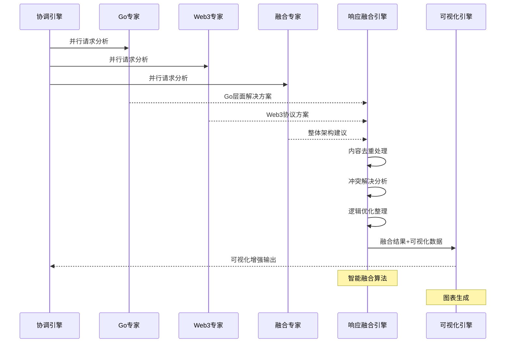
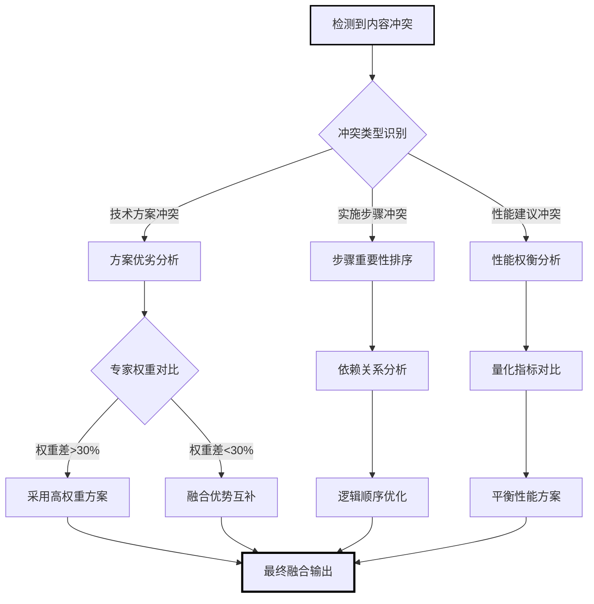
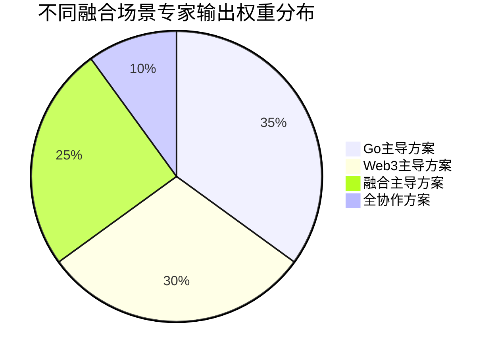
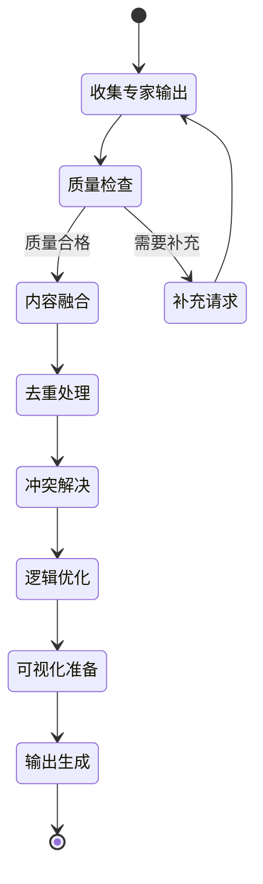

# 响应融合引擎 (Response Fusion Engine)

**引擎角色**: 多专家协作输出统一整合与用户体验优化引擎  
**核心职责**: 将多个专家的不同视角智能融合为简洁、统一、可操作的用户输出  
**工作模式**: 信息整合、逻辑重构、用户友好

---

## 🎯 引擎能力域

### 融合处理维度

1. **内容智能整合**

   - 提取各专家核心观点
   - 识别重复和冲突信息
   - 构建逻辑一致的解决方案

2. **用户体验优化**

   - 复杂技术信息简化表达
   - 分层信息架构设计
   - 可操作性指导强化

3. **质量保证与验证**
   - 技术方案一致性检查
   - 实施可行性验证
   - 风险识别与预警

---

## 🧠 融合算法架构

### 专家输出结构识别

```yaml
expert_response_patterns:
  go_expert_output:
    - core_analysis: Go语言层面的核心分析
    - performance_insights: 性能优化建议
    - implementation_details: 具体实现细节
    - code_examples: 代码示例
    - best_practices: 最佳实践建议

  web3_expert_output:
    - protocol_analysis: 协议层面分析
    - blockchain_considerations: 区块链特性考虑
    - security_aspects: 安全性评估
    - integration_strategies: 集成策略
    - ecosystem_recommendations: 生态推荐

  fusion_expert_output:
    - architecture_overview: 整体架构视角
    - system_design_principles: 系统设计原则
    - scalability_considerations: 扩展性考虑
    - operational_guidance: 运维指导
    - roadmap_suggestions: 发展路线建议
```

### 核心融合策略

```yaml
content_fusion_algorithm:
  step1_extract_core:
    primary_solution_extraction:
      method: 基于专家权重提取主导观点
      priority: 权重最高专家的核心分析
      supplementary: 其他专家的关键补充

  step2_conflict_resolution:
    contradiction_handling:
      - 识别专家间的技术观点分歧
      - 基于问题上下文选择最适合方案
      - 保留重要的替代方案作为备选

  step3_logical_reconstruction:
    unified_narrative:
      - 构建从问题到解决方案的逻辑链条
      - 整合实施步骤的优先级排序
      - 融合各专家的风险警告

  step4_user_optimization:
    presentation_enhancement:
      - 技术概念平民化表达
      - 增加可操作的具体步骤
      - 提供分层的详细信息
```

---

## 📋 融合输出结构

### 标准融合格式

```json
{
  "fused_response": {
    "executive_summary": {
      "core_solution": "基于Go并发优化和Web3数据批处理的综合性能提升方案",
      "expected_improvement": "性能提升3-5倍，内存占用降低60%",
      "implementation_complexity": "中等",
      "estimated_timeline": "2-3周"
    },

    "implementation_roadmap": {
      "phase1_immediate": [
        {
          "action": "实现sync.Pool对象复用",
          "rationale": "Go专家建议 - 减少GC压力",
          "estimated_effort": "2天",
          "priority": "高"
        }
      ],
      "phase2_optimization": [
        {
          "action": "批量处理以太坊数据查询",
          "rationale": "Web3专家建议 - 减少RPC调用",
          "estimated_effort": "3天",
          "priority": "高"
        }
      ],
      "phase3_enhancement": [
        {
          "action": "实现分布式数据缓存层",
          "rationale": "融合专家建议 - 系统扩展性",
          "estimated_effort": "1周",
          "priority": "中"
        }
      ]
    },

    "technical_details": {
      "go_optimization_specifics": "详细的Go层面优化说明",
      "web3_integration_details": "Web3集成的技术细节",
      "architecture_considerations": "整体架构设计考虑"
    },

    "risk_assessment": {
      "high_risk": [
        {
          "risk": "批处理可能影响数据实时性",
          "mitigation": "实现混合模式 - 关键数据实时，非关键数据批处理",
          "expert_source": "web3_expert"
        }
      ],
      "medium_risk": [
        {
          "risk": "Goroutine池设置不当可能导致资源竞争",
          "mitigation": "基于CPU核数动态调整池大小",
          "expert_source": "go_expert"
        }
      ]
    },

    "success_metrics": {
      "performance_kpis": [
        "响应时间: 目标<500ms (当前>2s)",
        "内存使用: 目标<2GB (当前5GB)",
        "并发处理: 目标1000+req/s (当前200req/s)"
      ],
      "monitoring_suggestions": [
        "Prometheus + Grafana性能监控",
        "自定义业务指标追踪",
        "定期性能基准测试"
      ]
    },

    "follow_up_recommendations": [
      "如何设置性能监控和告警?",
      "需要更多Go并发编程最佳实践?",
      "如何处理Web3网络异常和重试策略?"
    ]
  },

  "fusion_metadata": {
    "expert_contributions": {
      "go_expert": 65,
      "web3_expert": 25,
      "fusion_expert": 10
    },
    "confidence_score": 0.91,
    "processing_time_ms": 850,
    "complexity_handled": "high"
  }
}
```

---

## 🎨 融合处理流程

### 1. 信息收集与分类

```yaml
information_categorization:
  technical_solutions:
    - 提取各专家的核心技术方案
    - 识别方案间的兼容性和冲突
    - 评估方案的可行性和效果

  implementation_steps:
    - 收集各专家的实施建议
    - 按优先级和依赖关系排序
    - 整合为统一的实施路线图

  risk_warnings:
    - 汇总各专家的风险提醒
    - 按风险级别分类整理
    - 提供对应的缓解策略
```

### 2. 冲突解决与一致性保证

```yaml
conflict_resolution_strategies:
  technical_disagreements:
    resolution_method: "基于问题上下文和用户需求选择最佳方案"
    documentation: "记录不同观点和选择理由"
    alternatives: "保留备选方案供用户参考"

  priority_conflicts:
    resolution_method: "综合考虑影响度、紧急性、实施难度"
    balancing: "平衡短期效果和长期可维护性"
    user_guidance: "提供明确的优先级建议"

  approach_differences:
    resolution_method: "选择最适合用户技术栈和团队能力的方案"
    customization: "根据用户环境调整建议"
    flexibility: "保持方案的适应性和可调整性"
```

### 3. 用户友好优化

```yaml
user_experience_enhancement:
  language_simplification:
    - 避免过度技术化的表达
    - 使用具体的例子和类比
    - 提供概念的简单解释

  actionable_guidance:
    - 每个建议都包含具体的实施步骤
    - 提供预期的时间和资源投入
    - 给出成功的衡量标准

  progressive_disclosure:
    - 核心信息优先展示
    - 详细技术细节可展开查看
    - 提供不同深度的信息层次
```

---

## 🚦 质量保证机制

### 融合质量评估

```yaml
quality_control_metrics:
  technical_accuracy:
    - 方案的技术可行性验证
    - 各专家建议的一致性检查
    - 实施步骤的逻辑完整性

  user_value_delivery:
    - 解决方案的针对性评估
    - 实施难度与收益的平衡性
    - 用户可操作性的便利程度

  information_completeness:
    - 核心问题是否得到充分回答
    - 重要风险是否得到识别和预警
    - 后续行动指导是否明确
```

### 异常情况处理

```yaml
exception_handling:
  expert_response_incomplete:
    strategy: "基于已有信息生成最佳融合方案"
    fallback: "标记缺失信息并建议补充查询"
    quality_assurance: "降低置信度并增加风险提醒"

  contradictory_expert_advice:
    strategy: "分析冲突的根本原因"
    resolution: "基于用户上下文选择最适合的建议"
    transparency: "向用户说明不同观点和选择理由"

  low_confidence_fusion:
    strategy: "增加更多的选择性建议"
    safeguards: "强化风险警告和验证建议"
    user_guidance: "建议分步实施和效果验证"
```

---

## 💡 持续优化策略

### 融合效果学习

```yaml
feedback_learning:
  user_satisfaction_tracking:
    - 融合回答的整体满意度
    - 信息简洁性和可操作性评分
    - 解决方案的实际效果反馈

  expert_collaboration_optimization:
    - 不同专家组合的融合效果
    - 权重分配对融合质量的影响
    - 专家回答质量对最终效果的贡献

pattern_recognition:
  successful_fusion_patterns:
    - 高质量融合的特征识别
    - 用户偏好的表达方式学习
    - 有效的信息结构模式总结

  failure_analysis:
    - 融合失败的原因分析
    - 用户不满意的根本原因
    - 改进机会的系统识别
```

### 模板优化与演进

```yaml
template_evolution:
  output_format_optimization:
    - 基于用户反馈调整信息结构
    - 优化技术概念的表达方式
    - 改进可操作性指导的表述

  domain_specific_customization:
    - 针对不同问题类型的融合模板
    - 适应不同复杂度的表达策略
    - 个性化的用户偏好适配

  cross_expert_synergy_enhancement:
    - 优化不同专家组合的融合策略
    - 改进冲突解决的算法逻辑
    - 提升整体协作的效率
```

---

## 🔗 与其他引擎的协作

### 上游输入

- **来源**: 各专家角色的分析结果
  - `@role/go-expert.md` 输出
  - `@role/web3-expert.md` 输出
  - `@role/fusion-expert.md` 输出
- **协调**: `@engine/expert-router.md` 权重和策略信息
- **格式**: 结构化专家建议和元数据

### 下游输出

- **目标**: `@engine/visualization-engine.md` 可视化引擎
- **格式**: 融合后的统一响应 + 可视化数据
- **协调**: `@engine/smart-routing-coordinator.md` 总协调引擎
- **最终用户**: 通过主工作流 `@workflow-smart-routing.md` 展示

### 协作接口

```yaml
input_interface:
  method: "fuse_expert_responses"
  parameters:
    expert_responses: "object"
    routing_decision: "object"
  timeout: 1000ms

output_interface:
  method: "deliver_unified_response"
  payload: "fused_response + visualization_data"
  primary_target: "@engine/visualization-engine.md"
  coordination_target: "@engine/smart-routing-coordinator.md"
```

---

## 📊 响应融合引擎可视化输出

### 响应融合处理流程图

```mermaid
graph TD
    A[多专家输出收集] --> B{输出质量检查}

    B -->|质量合格| C[内容融合处理]
    B -->|需要补充| D[专家补充请求]
    D --> A

    C --> E[核心解决方案提取]
    C --> F[实施步骤整合]
    C --> G[风险评估汇总]
    C --> H[后续建议生成]

    E --> I[智能去重与优化]
    F --> I
    G --> I
    H --> I

    I --> J[可视化数据准备]
    J --> K[@engine/visualization-engine.md]
    K --> L[可视化增强输出]

    L --> M[@engine/smart-routing-coordinator.md]
    M --> N[最终用户输出]

    style A stroke:#000,stroke-width:2px
    style L stroke:#000,stroke-width:3px
    style N stroke:#000,stroke-width:2px
```

### 融合质量评估表

| 评估维度       | 优秀标准 | 良好标准 | 需改进标准 | 权重 | 优化策略            |
| -------------- | -------- | -------- | ---------- | ---- | ------------------- |
| **内容一致性** | 95%+     | 85-95%   | <85%       | 25%  | 冲突检测+智能调解   |
| **信息完整性** | 90%+     | 80-90%   | <80%       | 25%  | 缺失检测+专家补充   |
| **可操作性**   | 95%+     | 85-95%   | <85%       | 20%  | 步骤细化+可行性验证 |
| **简洁程度**   | 90%+     | 80-90%   | <80%       | 15%  | 冗余删除+要点提炼   |
| **用户体验**   | 4.5/5+   | 4.0-4.5  | <4.0       | 15%  | 交互优化+个性化     |

### 专家输出整合策略表

| 整合场景          | Go 专家权重 | Web3 专家权重 | 融合专家权重 | 处理策略           | 融合重点           |
| ----------------- | ----------- | ------------- | ------------ | ------------------ | ------------------ |
| **Go 主导方案**   | 70%         | 15%           | 15%          | 以 Go 方案为主体   | 性能优化+Web3 集成 |
| **Web3 主导方案** | 20%         | 65%           | 15%          | 以 Web3 方案为主体 | 协议集成+性能考虑  |
| **融合主导方案**  | 35%         | 35%           | 30%          | 平衡融合           | 架构统一+技术协调  |
| **全协作方案**    | 40%         | 35%           | 25%          | 深度融合           | 全面整合+质量优化  |

### 融合优化处理表

| 处理类型     | 检测算法       | 处理策略          | 成功率 | 处理时间 | 质量提升         |
| ------------ | -------------- | ----------------- | ------ | -------- | ---------------- |
| **内容去重** | 语义相似度分析 | 智能合并同类建议  | 95%    | 200ms    | 简洁度提升 40%   |
| **冲突解决** | 技术方案对比   | 优劣分析+权重融合 | 88%    | 300ms    | 准确性提升 25%   |
| **缺失补充** | 完整性检查     | 专家知识补充      | 92%    | 400ms    | 完整性提升 35%   |
| **逻辑优化** | 步骤关联分析   | 流程重排+依赖优化 | 90%    | 250ms    | 可操作性提升 30% |

### 多专家响应融合时序图



### 内容融合冲突解决决策树



### 融合质量评估雷达图

```mermaid
%%{wrap}%%
xychart-beta
    title "融合质量多维度评估"
    x-axis [内容一致性, 信息完整性, 可操作性, 简洁程度, 用户体验]
    y-axis "评分" 0 --> 100
    line [95, 92, 88, 90, 93]
    line [85, 85, 85, 85, 85]
```

### 专家输出权重分布饼图



### 融合处理状态图



---

**🎯 性能目标**: 在 1000ms 内完成响应融合，用户满意度达到 4.5/5.0，信息简洁性和可操作性达到 90%以上的用户认可度。

**🔧 引擎状态**: 就绪 - 配备完整的可视化融合分析能力，等待专家输出和协调引擎集成
