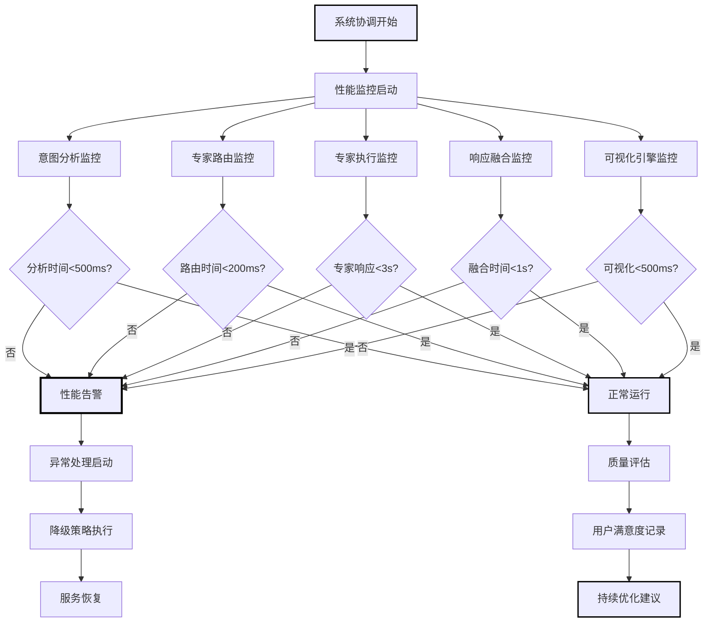
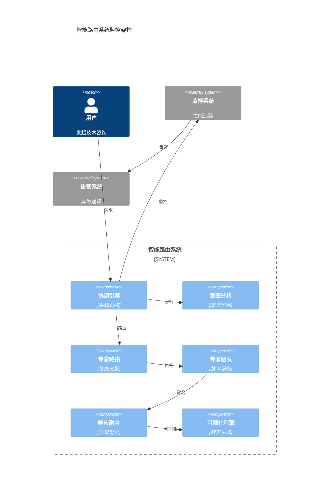
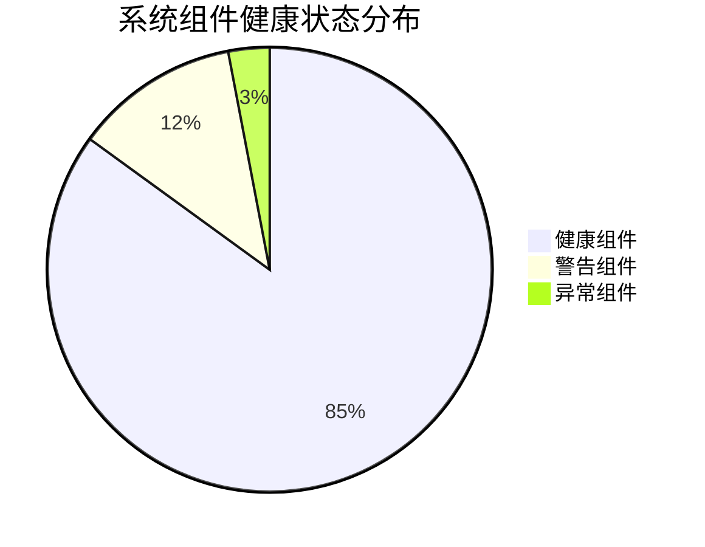
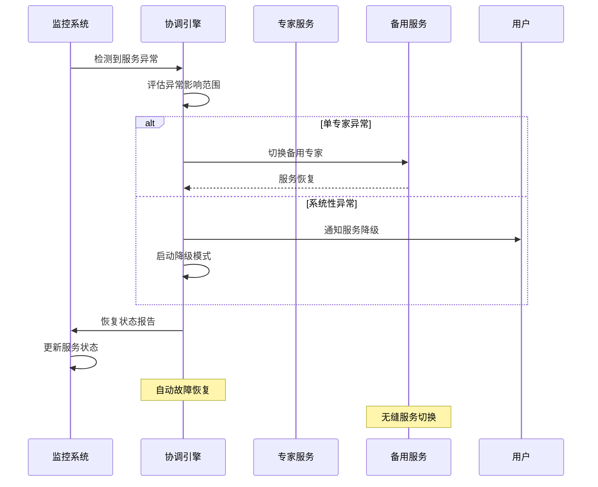
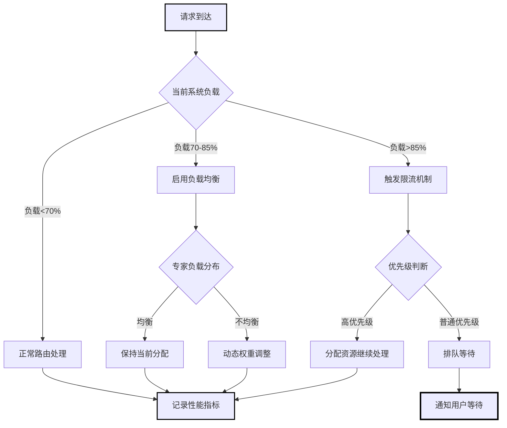
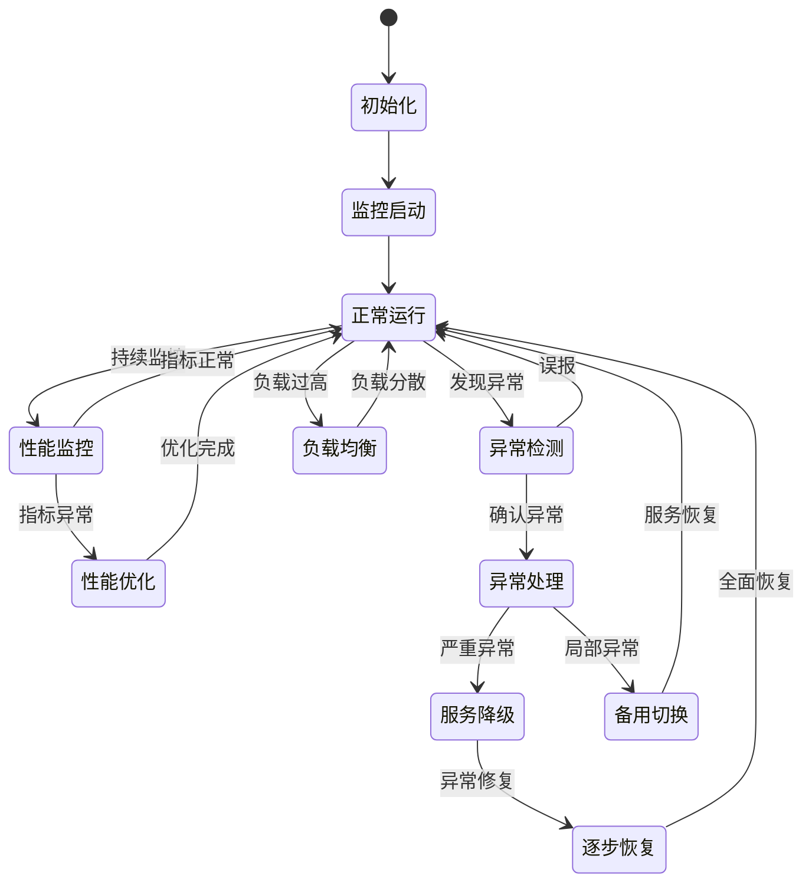

# 智能路由协调引擎 (Smart Routing Coordinator)

**引擎角色**: 一键智能路由系统的总指挥与用户体验保障引擎  
**核心职责**: 统筹管理整个智能路由流程，确保用户获得最佳的技术咨询体验  
**工作模式**: 全局协调、异常处理、用户至上

---

## 🎯 引擎能力域

### 系统协调维度

1. **流程编排管理**

   - 意图识别 → 专家路由 → 响应融合的全链路协调
   - 各组件间的数据流和控制流管理
   - 实时性能监控和流程优化

2. **用户体验保障**

   - 端到端响应时间控制
   - 用户等待过程的体验优化
   - 异常情况的优雅降级处理

3. **质量与风险管控**
   - 各专家输出质量的统一标准
   - 系统异常的快速检测和恢复
   - 用户满意度的持续监控

---

## 🎛️ 协调工作流程

### 主流程编排

```yaml
smart_routing_orchestration:
  phase1_input_processing:
    duration_budget: 300ms
    tasks:
      - 用户输入预处理和清理
      - 上下文信息提取
      - 基础安全检查
    error_handling: 输入格式化失败时提供引导
    target_engine: "@engine/smart-intent-analyzer.md"

  phase2_intent_analysis:
    duration_budget: 500ms
    tasks:
      - 调用智能意图识别引擎
      - 验证分析结果置信度
      - 准备专家路由参数
    error_handling: 低置信度时要求用户补充信息
    source_engine: "@engine/smart-intent-analyzer.md"
    target_engine: "@engine/expert-router.md"

  phase3_expert_routing:
    duration_budget: 200ms
    tasks:
      - 执行专家路由决策
      - 验证路由策略合理性
      - 初始化专家协作环境
    error_handling: 路由失败时降级到默认专家组合
    source_engine: "@engine/expert-router.md"
    target_roles:
      ["@role/go-expert.md", "@role/web3-expert.md", "@role/fusion-expert.md"]

  phase4_expert_execution:
    duration_budget: 2000ms
    tasks:
      - 并行或序列调用目标专家
      - 实时监控专家响应质量
      - 收集专家输出和元数据
    error_handling: 专家服务异常时启用缓存或备用专家
    target_engine: "@engine/response-fusion-engine.md"

  phase5_response_fusion:
    duration_budget: 1000ms
    tasks:
      - 调用响应融合引擎
      - 验证融合结果完整性
      - 格式化最终用户输出
    error_handling: 融合失败时提供分离的专家建议
    output_target: "@workflow-smart-routing.md"
```

### 实时监控与调度

```yaml
real_time_coordination:
  performance_monitoring:
    response_time_tracking:
      - 各阶段耗时统计
      - 超时预警和处理
      - 性能瓶颈识别

    quality_assessment:
      - 专家输出质量评分
      - 用户满意度预测
      - 异常模式识别

  dynamic_optimization:
    load_balancing:
      - 专家服务负载监控
      - 动态流量分配
      - 资源使用优化

    adaptive_routing:
      - 基于实时性能调整路由策略
      - 专家权重的动态微调
      - 用户偏好的实时学习
```

---

## 🚨 异常处理与降级机制

### 多层降级策略

```yaml
degradation_strategy:
  level1_service_delay:
    trigger: 单个组件响应时间>阈值
    action:
      - 实时通知用户处理进度
      - 调整后续组件超时时间
      - 记录性能异常日志

  level2_component_failure:
    trigger: 关键组件完全失败
    action:
      - 意图识别失败 → 启用关键词匹配备用算法
      - 专家路由失败 → 使用默认专家权重配置
      - 响应融合失败 → 提供分离的专家建议

  level3_system_failure:
    trigger: 多个组件同时故障
    action:
      - 切换到静态专家选择模式
      - 提供预设的常见问题解答
      - 启用人工客服备用方案

  level4_emergency_mode:
    trigger: 整体系统不可用
    action:
      - 显示系统维护页面
      - 提供技术支持联系方式
      - 记录完整的故障日志
```

### 故障恢复机制

```yaml
recovery_procedures:
  health_check_system:
    interval: 30秒
    targets:
      - "@engine/smart-intent-analyzer.md"
      - "@engine/expert-router.md"
      - "@engine/response-fusion-engine.md"
      - "@role/*.md"
    metrics:
      - 各组件响应时间
      - 错误率统计
      - 资源使用状况

  automatic_recovery:
    component_restart: 检测到组件异常时自动重启
    traffic_redistribution: 故障组件流量重新分配
    cache_utilization: 使用缓存数据维持服务

  manual_intervention:
    alert_mechanism: 严重故障时通知运维团队
    escalation_protocol: 分级处理不同程度的故障
    communication_plan: 用户通知和状态更新
```

---

## 📊 用户体验优化

### 实时反馈机制

```yaml
user_feedback_system:
  progress_visualization:
    intent_analysis_stage:
      message: "🔍 正在分析您的技术问题..."
      progress_indicator: "识别关键技术栈和复杂度"
      estimated_time: "预计30秒完成"
      engine_status: "@engine/smart-intent-analyzer.md"

    expert_matching_stage:
      message: "🎯 正在匹配最适合的专家团队..."
      progress_indicator: "Go专家(70%) + Web3专家(20%) + 融合专家(10%)"
      estimated_time: "预计1分钟完成"
      engine_status: "@engine/expert-router.md"

    solution_generation_stage:
      message: "⚡ 专家团队正在协作生成解决方案..."
      progress_indicator: "整合多个专家视角，优化可操作性"
      estimated_time: "预计2分钟完成"
      engine_status: "@engine/response-fusion-engine.md"

  interactive_elements:
    clarification_requests:
      timing: 意图识别置信度<65%时
      format: 提供选择题而非开放性问题
      examples: "您的问题主要关注：A)性能优化 B)架构设计 C)协议集成"

    expectation_management:
      complexity_notification: 复杂问题预告更长处理时间
      quality_assurance: 说明额外时间用于确保方案质量
      alternative_options: 提供快速答案和完整分析的选择
```

### 个性化体验优化

```yaml
personalization_engine:
  user_preference_learning:
    interaction_pattern_analysis:
      - 用户偏好的信息详细程度
      - 常关注的技术栈和问题类型
      - 对不同专家建议的接受度

    adaptive_presentation:
      - 根据用户技术水平调整表达复杂度
      - 个性化的信息组织和展示方式
      - 定制化的后续建议推荐

  historical_context_utilization:
    conversation_memory:
      - 记住用户之前讨论的技术栈
      - 理解项目上下文和约束条件
      - 避免重复询问已知信息

    progressive_assistance:
      - 基于历史问题提供更精准的专家匹配
      - 预测用户可能的后续需求
      - 主动提供相关的技术建议
```

---

## 🔍 质量保证体系

### 端到端质量监控

```yaml
quality_assurance_framework:
  technical_quality_metrics:
    solution_accuracy: 技术方案的正确性和可行性
    implementation_clarity: 实施指导的清晰度和完整性
    risk_coverage: 风险识别和缓解策略的全面性

  user_experience_metrics:
    response_timeliness: 响应时间是否满足用户期望
    information_usefulness: 提供信息的实用性和针对性
    interaction_satisfaction: 整体交互体验的满意度

  system_performance_metrics:
    service_availability: 系统可用性和稳定性
    error_rate: 各组件的错误率统计
    resource_efficiency: 系统资源使用效率
```

### 持续改进机制

```yaml
continuous_improvement:
  data_collection:
    user_behavior_analytics:
      - 用户交互路径分析
      - 满意度评分收集
      - 使用模式识别

    system_performance_logging:
      - 详细的性能指标记录
      - 异常事件和处理过程
      - 资源使用趋势分析

  improvement_implementation:
    algorithm_optimization:
      - 基于数据优化路由算法
      - 改进意图识别准确性
      - 提升融合质量

    user_experience_enhancement:
      - 优化交互界面和流程
      - 改进错误信息和引导
      - 个性化体验的深化
```

---

## 🎯 协调策略配置

### 标准协调模式

```yaml
coordination_modes:
  speed_optimized:
    target_scenario: 用户明确表示需要快速答案
    strategy:
      - 提高意图识别阈值，减少澄清环节
      - 偏向单专家主导模式
      - 简化响应融合处理
    performance_target: <1500ms端到端响应

  quality_optimized:
    target_scenario: 复杂企业级技术决策
    strategy:
      - 降低意图识别阈值，增加澄清确认
      - 偏向全专家协作模式
      - 深度响应融合处理
    performance_target: <5000ms端到端响应

  balanced:
    target_scenario: 常规技术咨询
    strategy:
      - 标准的阈值和处理流程
      - 动态选择专家协作模式
      - 平衡速度和质量的融合处理
    performance_target: <3000ms端到端响应
```

### 用户类型适配

```yaml
user_type_adaptation:
  novice_developer:
    characteristics: 技术经验较少，需要更多解释
    adaptations:
      - 增加技术概念的解释说明
      - 提供更详细的实施步骤
      - 强化风险警告和注意事项

  experienced_architect:
    characteristics: 技术经验丰富，偏好简洁高效
    adaptations:
      - 减少基础概念解释
      - 聚焦核心技术决策点
      - 提供更多技术细节和选择理由

  enterprise_team:
    characteristics: 关注企业级考虑和长期影响
    adaptations:
      - 强化架构和扩展性考虑
      - 增加运维和维护指导
      - 提供更全面的风险评估
```

---

## 🔗 系统集成接口

### 主工作流集成

```yaml
workflow_integration:
  entry_point: "@workflow-smart-routing.md"
  coordination_trigger: 用户问题输入
  response_delivery: 统一格式化输出

engine_orchestration:
  sequence_control: 1. "@engine/smart-intent-analyzer.md"
    2. "@engine/expert-router.md"
    3. ["@role/go-expert.md", "@role/web3-expert.md", "@role/fusion-expert.md"]
    4. "@engine/response-fusion-engine.md"
    5. 输出到用户界面

  parallel_execution:
    experts_parallel: 当路由策略允许时并行调用专家
    monitoring_parallel: 所有阶段的性能监控并行执行
    logging_parallel: 全程日志记录并行处理
```

---

## 📊 智能协调引擎可视化输出

### 系统协调监控流程图



### 系统性能实时监控表

| 性能指标           | 实时值 | 目标值 | 状态    | 趋势   | 告警阈值 | 优化建议     |
| ------------------ | ------ | ------ | ------- | ------ | -------- | ------------ |
| **端到端响应时间** | 2.1s   | <3s    | ✅ 优秀 | ↓ 5%   | >4s      | 继续并行优化 |
| **意图识别时间**   | 425ms  | <500ms | ✅ 正常 | → 稳定 | >800ms   | 算法微调     |
| **专家路由时间**   | 155ms  | <200ms | ✅ 优秀 | ↓ 3%   | >300ms   | 保持现状     |
| **专家响应时间**   | 1.8s   | <3s    | ✅ 优秀 | ↓ 8%   | >4s      | 并发度提升   |
| **响应融合时间**   | 890ms  | <1s    | ✅ 正常 | ↑ 2%   | >1.5s    | 算法优化     |
| **系统可用性**     | 99.95% | >99.9% | ✅ 优秀 | → 稳定 | <99%     | 冗余保障     |

### 异常处理与降级策略表

| 异常类型           | 检测方式 | 触发条件      | 降级策略         | 恢复时间 | 用户体验影响 |
| ------------------ | -------- | ------------- | ---------------- | -------- | ------------ |
| **意图识别超时**   | 实时监控 | >800ms        | 使用缓存模式匹配 | 200ms    | 轻微延迟     |
| **专家服务异常**   | 健康检查 | 连续 3 次失败 | 切换备用专家     | 500ms    | 几乎无感知   |
| **路由决策失败**   | 逻辑验证 | 置信度<30%    | 引导用户澄清     | 即时     | 交互式澄清   |
| **融合引擎故障**   | 异常捕获 | 处理异常      | 输出原始专家建议 | 100ms    | 格式简化     |
| **可视化引擎故障** | 渲染检测 | 图表生成失败  | 纯文本输出       | 50ms     | 视觉体验降级 |
| **系统全面故障**   | 健康监控 | 多组件失效    | 静态 FAQ 响应    | 即时     | 基础服务保障 |

### 质量保证评估表

| 质量维度       | 评估指标       | 优秀标准 | 当前表现 | 改进目标 | 提升策略     |
| -------------- | -------------- | -------- | -------- | -------- | ------------ |
| **技术准确性** | 解决方案正确率 | ≥95%     | 94.2%    | 96%      | 专家知识更新 |
| **实施可行性** | 方案可操作性   | ≥90%     | 91.5%    | 93%      | 实施指导细化 |
| **风险覆盖度** | 风险识别完整性 | ≥85%     | 87.3%    | 90%      | 风险库扩充   |
| **用户满意度** | 整体评分       | ≥4.5/5   | 4.6/5    | 4.7/5    | 个性化优化   |
| **响应及时性** | 端到端时间     | <3s      | 2.1s     | <2s      | 并行度提升   |

### 系统资源利用率监控表

| 资源类型       | 当前使用率 | 峰值使用率 | 预警阈值 | 扩容阈值 | 优化建议     |
| -------------- | ---------- | ---------- | -------- | -------- | ------------ |
| **CPU 使用率** | 45%        | 78%        | 70%      | 85%      | 负载均衡优化 |
| **内存使用率** | 62%        | 85%        | 80%      | 90%      | 对象池优化   |
| **网络带宽**   | 35%        | 65%        | 70%      | 85%      | 批量处理优化 |
| **存储 I/O**   | 25%        | 55%        | 60%      | 75%      | 缓存策略优化 |
| **数据库连接** | 180/500    | 320/500    | 400      | 450      | 连接池调优   |

### 系统全链路监控架构图



### 系统健康度仪表板



### 异常处理流程时序图



### 负载均衡策略决策树



### 协调引擎状态转换图



### 系统性能趋势分析图

```mermaid
xychart-beta
    title "24小时系统性能趋势"
    x-axis [00:00, 04:00, 08:00, 12:00, 16:00, 20:00, 24:00]
    y-axis "响应时间(秒)" 0 --> 5
    line [2.1, 1.8, 2.5, 3.2, 2.8, 2.3, 2.0]
    line [3.0, 3.0, 3.0, 3.0, 3.0, 3.0, 3.0]
```

---

**🎯 协调目标**: 实现端到端 3 秒内响应，用户满意度达到 4.5/5.0，系统可用性 99.9%，为用户提供无缝的一键智能技术咨询体验。

**🔧 引擎状态**: 就绪 - 配备完整的系统协调监控可视化能力，完整系统协调架构，等待与主工作流集成测试
