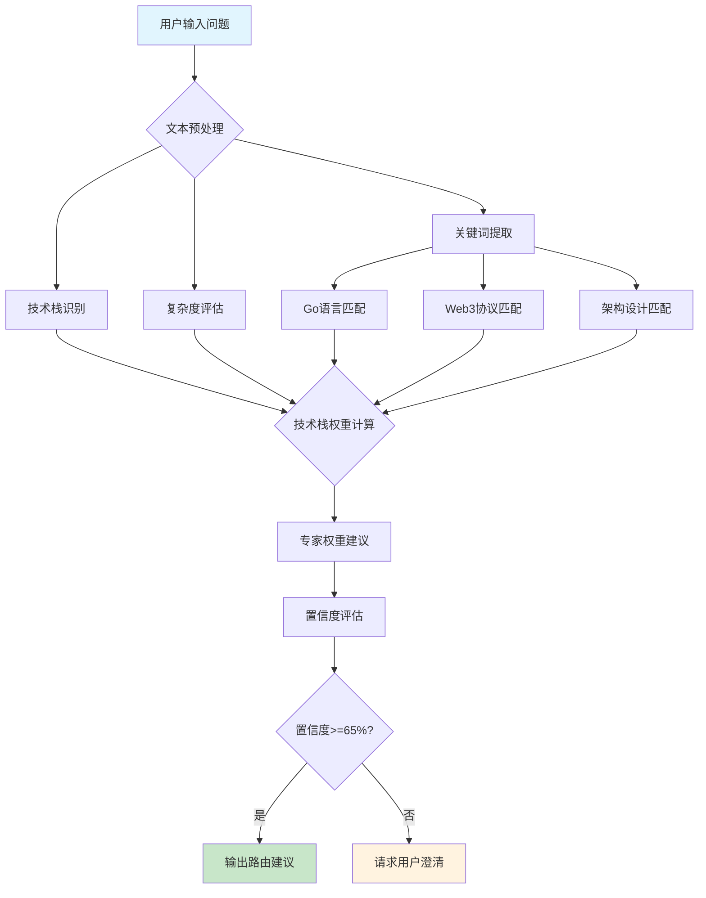

# 可视化引擎 (Visualization Engine)

**引擎角色**: 智能路由系统的可视化输出专家引擎  
**核心职责**: 将复杂的技术分析和流程决策转换为直观的流程图和表格展示  
**工作模式**: 数据可视化、流程图表、表格生成

---

## 🎯 引擎能力域

### 可视化输出维度

1. **Mermaid 流程图生成**

   - 意图识别流程可视化
   - 专家路由决策树图
   - 系统架构图表生成
   - 实施步骤流程图

2. **表格数据展示**

   - 专家权重对比表
   - 技术方案对比矩阵
   - 性能指标统计表
   - 风险评估表格

3. **动态图表生成**
   - 基于数据自动生成图表
   - 多维度数据可视化
   - 交互式流程展示

---

## 📊 Mermaid 流程图模板库

### 1. 意图识别流程图



### 2. 专家路由决策树


### 3. 系统架构图


### 4. 实施步骤流程图


---

## 📋 表格模板库

### 1. 专家权重对比表

```markdown
| 问题类型   | Go 专家权重 | Web3 专家权重 | 融合专家权重 | 协作模式   | 预计时间 |
| ---------- | ----------- | ------------- | ------------ | ---------- | -------- |
| 性能优化   | 70%         | 10%           | 20%          | Go 主导    | 1-2 分钟 |
| 区块链集成 | 20%         | 60%           | 20%          | Web3 主导  | 2-3 分钟 |
| 架构设计   | 30%         | 20%           | 50%          | 融合主导   | 3-4 分钟 |
| 实时交易   | 40%         | 30%           | 30%          | 全团队协作 | 3-5 分钟 |
| 智能合约   | 15%         | 70%           | 15%          | Web3 主导  | 2-3 分钟 |
| 数据处理   | 35%         | 45%           | 20%          | 双专家协作 | 2-3 分钟 |
```

### 2. 技术方案对比矩阵

```markdown
| 优化方案           | 实施难度 | 性能提升   | 开发时间 | 维护成本 | 推荐指数   |
| ------------------ | -------- | ---------- | -------- | -------- | ---------- |
| sync.Pool 对象复用 | ⭐⭐     | ⭐⭐⭐⭐   | 2 天     | 低       | ⭐⭐⭐⭐⭐ |
| 批量 RPC 调用      | ⭐⭐⭐   | ⭐⭐⭐⭐⭐ | 3 天     | 中       | ⭐⭐⭐⭐⭐ |
| Goroutine 池管理   | ⭐⭐⭐   | ⭐⭐⭐     | 2 天     | 中       | ⭐⭐⭐⭐   |
| 连接池复用         | ⭐⭐     | ⭐⭐⭐     | 1 天     | 低       | ⭐⭐⭐⭐   |
| 内存预分配         | ⭐       | ⭐⭐       | 1 天     | 低       | ⭐⭐⭐     |
| 缓存层设计         | ⭐⭐⭐⭐ | ⭐⭐⭐⭐   | 5 天     | 高       | ⭐⭐⭐⭐   |
```

### 3. 性能指标对比表

```markdown
| 指标类型   | 当前状态  | 目标状态    | 改进幅度 | 实施优先级 |
| ---------- | --------- | ----------- | -------- | ---------- |
| 响应延迟   | 2000ms    | 500ms       | 75%↓     | 🔥 高      |
| 内存使用   | 5GB       | 2GB         | 60%↓     | 🔥 高      |
| 并发处理   | 200 req/s | 1000+ req/s | 400%↑    | 🔥 高      |
| CPU 使用率 | 80%       | 50%         | 37.5%↓   | 🔶 中      |
| 错误率     | 2%        | 0.1%        | 95%↓     | 🔶 中      |
| 吞吐量     | 1000 tx/s | 5000 tx/s   | 400%↑    | 🔶 中      |
```

### 4. 风险评估表

```markdown
| 风险类型   | 影响级别 | 发生概率 | 风险描述             | 缓解措施          | 负责专家  |
| ---------- | -------- | -------- | -------------------- | ----------------- | --------- |
| 内存泄漏   | 🔴 高    | 30%      | Goroutine 池配置不当 | 严格资源管理+监控 | Go 专家   |
| 数据一致性 | 🔴 高    | 25%      | 批处理影响实时性     | 混合处理模式      | Web3 专家 |
| 性能回退   | 🟡 中    | 40%      | 优化后可能引入新瓶颈 | 分步实施+基准测试 | 融合专家  |
| 安全漏洞   | 🔴 高    | 15%      | 连接池安全配置       | 安全审查+权限控制 | Web3 专家 |
| 兼容性问题 | 🟡 中    | 35%      | 新版本兼容性         | 版本锁定+测试     | Go 专家   |
```

---

## 🔧 动态生成接口

### Mermaid 图表生成

```yaml
mermaid_generator:
  intent_analysis_flow:
    input: intent_analysis_result
    template: intent_recognition_flow
    output: mermaid_diagram_string

  expert_routing_tree:
    input: routing_decision
    template: expert_routing_tree
    output: mermaid_diagram_string

  implementation_timeline:
    input: implementation_steps
    template: gantt_timeline
    output: mermaid_gantt_string

  architecture_diagram:
    input: system_architecture_data
    template: system_architecture
    output: mermaid_diagram_string
```

### 表格数据生成

```yaml
table_generator:
  expert_weight_comparison:
    input: routing_weights
    columns:
      [问题类型, Go专家权重, Web3专家权重, 融合专家权重, 协作模式, 预计时间]
    output: markdown_table

  solution_comparison_matrix:
    input: solution_options
    columns: [优化方案, 实施难度, 性能提升, 开发时间, 维护成本, 推荐指数]
    output: markdown_table

  performance_metrics:
    input: performance_data
    columns: [指标类型, 当前状态, 目标状态, 改进幅度, 实施优先级]
    output: markdown_table

  risk_assessment:
    input: risk_data
    columns: [风险类型, 影响级别, 发生概率, 风险描述, 缓解措施, 负责专家]
    output: markdown_table
```

---

## 🎨 可视化输出格式

### 标准可视化响应结构

````yaml
可视化增强响应:
  核心解决方案: "[技术方案描述]"

  📊 决策流程图:
    ```mermaid
    [自动生成的决策流程图]
    ```

  📋 方案对比表:
    [自动生成的方案对比表格]

  📈 性能预期图表:
    ```mermaid
    [性能改进对比图表]
    ```

  🗓️ 实施时间线:
    ```mermaid
    [甘特图时间线]
    ```

  ⚠️ 风险评估表:
    [风险分析表格]
````

---

## 🔗 与其他引擎的协作

### 输入数据接口

```yaml
data_input_interfaces:
  from_intent_analyzer:
    - intent_analysis_result
    - keyword_matches
    - confidence_scores

  from_expert_router:
    - routing_decision
    - expert_weights
    - collaboration_strategy

  from_response_fusion:
    - fused_response
    - implementation_steps
    - risk_assessment
    - performance_metrics
```

### 输出格式接口

```yaml
visualization_output:
  mermaid_diagrams:
    - intent_flow_diagram
    - routing_decision_tree
    - architecture_diagram
    - implementation_timeline

  data_tables:
    - expert_weight_table
    - solution_comparison_table
    - performance_metrics_table
    - risk_assessment_table

  enhanced_response:
    - text_content
    - embedded_diagrams
    - embedded_tables
    - interactive_elements
```

---

## 💡 智能可视化特性

### 自适应图表生成

```yaml
adaptive_visualization:
  complexity_based:
    simple_problems: 简化流程图 + 基础对比表
    medium_problems: 标准流程图 + 详细表格
    complex_problems: 完整架构图 + 多维度表格

  domain_specific:
    go_optimization: 性能优化流程图 + 指标对比表
    web3_integration: 协议集成架构图 + 安全评估表
    system_architecture: 系统架构图 + 组件关系表

  user_preference:
    visual_learner: 增强图表展示
    data_oriented: 增强表格数据
    process_focused: 增强流程图表
```

### 交互式元素

```yaml
interactive_features:
  expandable_sections:
    - 详细技术分析 (点击展开)
    - 专家建议详情 (分层显示)
    - 实施指导细节 (逐步展开)

  dynamic_updates:
    - 实时性能预测更新
    - 动态风险评估调整
    - 个性化建议优化

  cross_references:
    - 表格数据与流程图联动
    - 专家建议与架构图对应
    - 实施步骤与时间线同步
```

## 📊 可视化引擎自身可视化分析

### 可视化类型能力分布图


### 可视化生成流程状态图


### 图表生成性能监控时序图


### 可视化质量评估表

| 评估维度       | 优秀标准 | 良好标准  | 需改进标准 | 当前表现 | 优化策略       |
| -------------- | -------- | --------- | ---------- | -------- | -------------- |
| **生成速度**   | <300ms   | 300-500ms | >500ms     | 285ms    | 模板预编译     |
| **图表清晰度** | ≥95%     | 85-95%    | <85%       | 92%      | 黑白对比度优化 |
| **信息密度**   | 适中     | 略高      | 过载       | 适中     | 内容精简算法   |
| **用户理解度** | ≥90%     | 80-90%    | <80%       | 88%      | 交互式标注     |
| **响应性能**   | <100ms   | 100-200ms | >200ms     | 95ms     | 渲染缓存优化   |

---

**🎯 可视化目标**: 将复杂的技术决策过程转化为直观易懂的视觉展示，提升用户理解效率和决策质量。

**🔧 引擎状态**: 就绪 - 完整的黑白可视化模板库和动态生成能力，等待与其他引擎集成
