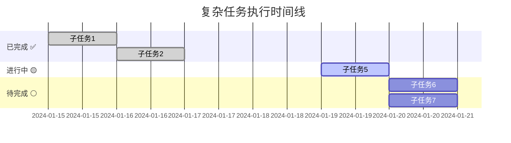

# 🤖 AI任务执行跟踪记录模板

## 🎯 模板用途
用于记录AI执行复杂任务的详细过程，包括任务拆解、执行进度、问题解决等。

## 📋 任务基本信息

### 📝 原始任务描述
**用户任务**：[用户提供的复杂任务原文]
**任务复杂度**：⭐⭐⭐⭐⭐ (1-5星)
**预估工期**：[X天/周]
**关键成功要素**：
1. [关键成功要素1]
2. [关键成功要素2]
3. [关键成功要素3]

### 🧠 AI任务分析与拆解过程
**分析思路**：
1. **需求理解**：[AI对用户需求的理解和分析]
2. **技术评估**：[所需技术栈和技术难度评估]
3. **风险识别**：[潜在风险和挑战点]
4. **拆解策略**：[任务拆解的方法论和原则]
5. **优先级排序**：[子任务优先级确定依据]

## 📊 子任务总览表

| 序号 | 子任务名称 | 状态 | 优先级 | 预估工时 | 实际工时 | 完成度 | 开始时间 | 完成时间 | 备注 |
|------|-----------|------|--------|----------|----------|--------|----------|----------|------|
| 1 | [子任务1名称] | ✅完成 | 🔴高 | 4h | 3.5h | 100% | 2024-01-15 | 2024-01-15 | 提前完成 |
| 2 | [子任务2名称] | ✅完成 | 🔴高 | 6h | 7h | 100% | 2024-01-16 | 2024-01-17 | 遇到技术难点 |
| 3 | [子任务3名称] | ✅完成 | 🟡中 | 3h | 3h | 100% | 2024-01-17 | 2024-01-17 | 按计划完成 |
| 4 | [子任务4名称] | ✅完成 | 🟡中 | 5h | 4h | 100% | 2024-01-18 | 2024-01-18 | 优化超预期 |
| 5 | [子任务5名称] | 🟡进行中 | 🔴高 | 8h | 5h | 65% | 2024-01-19 | - | **当前任务** |
| 6 | [子任务6名称] | ⚪待开始 | 🟡中 | 4h | - | 0% | - | - | 等待第5个完成 |

## 🔍 当前任务详细执行记录

**任务名称**：[具体任务名称]
**执行时间**：[开始时间] - 进行中
**当前进度**：[百分比] ([已完成工时]/[总预估工时])

### 详细执行过程：
**[时间段1]** ✅ 已完成
- [具体完成的工作内容1]
- [具体完成的工作内容2]
- [具体完成的工作内容3]

**[时间段2]** ✅ 已完成  
- [具体完成的工作内容1]
- [具体完成的工作内容2]
- [具体完成的工作内容3]

**[时间段3]** 🟡 进行中
- [当前正在进行的工作] (当前进行)
- [待完成的工作1] (待完成)
- [待完成的工作2] (待完成)

**[时间段4]** ⚪ 待完成
- [计划完成的工作1]
- [计划完成的工作2]
- [计划完成的工作3]

### 遇到的问题和解决方案：
| 时间 | 问题描述 | 解决方案 | 结果 | 学到的经验 |
|------|----------|----------|------|------------|
| [时间] | [问题描述] | [解决方案] | ✅解决 | [经验总结] |
| [时间] | [问题描述] | [解决方案] | ✅解决 | [经验总结] |
| [时间] | [问题描述] | [解决方案] | 🟡处理中 | [当前思考] |

### 当前阻碍因素：
- [ ] 🔴 [阻碍因素1，影响程度说明]
- [ ] 🟡 [阻碍因素2，影响程度说明]
- [ ] 🟢 [阻碍因素3，影响程度说明]

## 📈 阶段性成果总结

**已完成任务成果** ([完成范围])：
- ✅ **任务[X]-[Y]**：[成果描述]
- ✅ **任务[X]**：[成果描述]

**累计成果统计**：
- 📝 代码行数：[X]行
- 📁 文件数量：[X]个
- 🧪 测试用例：[X]个
- 📊 功能完成度：[X]%

## 🔮 后续任务规划

**短期计划** (任务[X]-[Y])：
- **任务[X]**：[任务描述] (依赖条件)
- **任务[Y]**：[任务描述] (可并行性说明)

**中期计划** (任务[X]-[Y])：
- **任务[X]**：[任务描述] (关键路径说明)
- **任务[Y]**：[任务描述]

**收尾计划** (任务[X])：
- **任务[X]**：[收尾工作描述]

**风险预警**：
- 🔴 [高风险问题预警和应对计划]
- 🟡 [中风险问题预警和应对计划]
- 🟢 [整体进度评估]

## 📊 进度可视化

### 任务执行时间线

## 🤖 AI工作记录

| 日期 | AI完成任务 | 代码行数 | 文件变更 | 功能模块 | 技术难点 | 备注 |
|------|------------|----------|----------|----------|----------|------|
| [日期] | [任务名称] | [数量]行 | [数量]个文件 | [模块名称] | [技术难点] | [备注] |

## 📝 学习与改进记录

### AI技能提升记录：
| 学习内容 | 掌握程度 | 应用项目 | 学习时间 | 备注 |
|----------|----------|----------|----------|------|
| [技术/技能] | ⭐⭐⭐⭐⭐ | [应用场景] | [时间] | [心得体会] |

### 经验总结：
- **成功经验**：[可复用的成功做法]
- **改进方向**：[需要优化的地方]
- **最佳实践**：[总结的最佳实践]

## 🔄 更新日志

| 更新时间 | 更新内容 | 更新人 |
|----------|----------|--------|
| [时间] | [更新内容描述] | AI | 