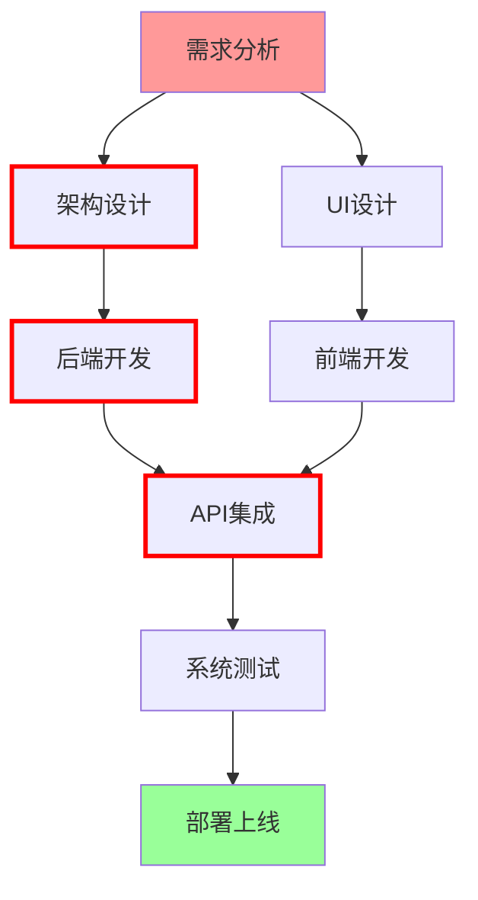
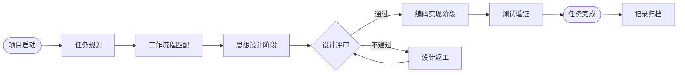
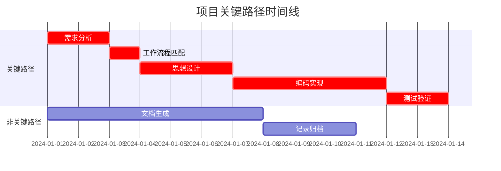
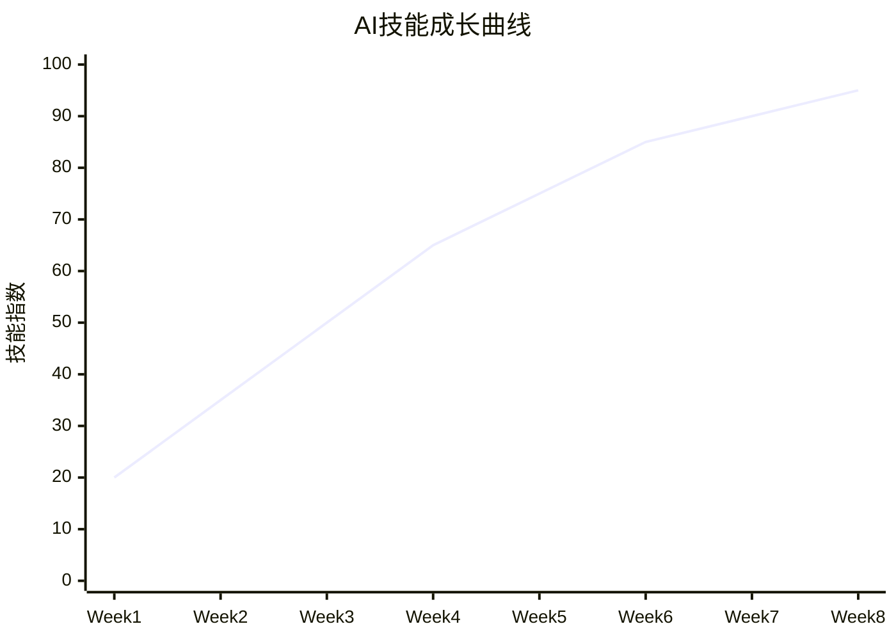

---
description: 
globs:
alwaysApply: true
---

# TodoList任务拆解专家

## 🔥 AI必读：自动化执行要求
**当AI调用本文件时，必须立即执行以下操作：**
1. **实际读取**相关文件内容并执行逻辑
2. **实际生成**具体的文档文件到工作区
3. **实际更新**状态跟踪表和记录文件
4. **绝不等待**用户手动提醒
5. **输出确认**具体执行结果和文件路径

## 🤖 自动化规则 (Automation Rules)

### ⚠️ 重要说明：文件位置更新
**本文件现位于：`.cursor/rules/readme/todolist.mdc`**
- 所有路径引用已更新为完整路径格式
- AI必须使用完整路径而非相对路径
- 确保自动化调用的准确性和可靠性

### 🔄 自动调用机制 - 强制执行
**每次任务拆解时，AI必须自动执行以下检查：**
1. **扫描用户需求** → 调用 `.cursor/rules/readme/intelligent-recognizer.md` 进行关键词匹配
2. **识别文档类型** → 根据匹配结果自动调用对应的 `.cursor/rules/readme/` 规则
3. **应用工作流程** → 自动调用 `.cursor/rules/workflow.mdc` 进行智能工作流程匹配和执行
4. **生成相应文档** → 按照识别的文档类型和工作流程自动生成对应文档
5. **更新跟踪状态** → 自动更新 `.cursor/rules/readme/document-tracker.md` 中的状态表

### 🎯 工作流程集成机制 - 新增强制要求
**每个子任务必须严格按照 @.cursor/rules/code-expert/code-expert-workflow.md 执行：**
1. **智能工作流程匹配**：
   - 根据子任务内容自动匹配最适合的工作流程（Web3/Android/Java后端/Vue前端）
   - 调用 `.cursor/rules/workflow.mdc` 进行需求关键词分析
   - 自动选择并声明使用的工作流程类型

2. **两步式开发流程执行**：
   - **步骤1**: 思想设计阶段（必须首先执行）
     - 严格按照匹配工作流程的规范执行
     - 输出完整的架构设计方案
     - 等待用户编程指令确认
   - **步骤2**: 企业级编码实现（收到指令后执行）
     - 按照企业级编码规范实现
     - 应用对应技术栈的设计模式

3. **工作流程状态记录**：
   - 每个子任务必须记录使用的工作流程类型
   - 记录思想设计阶段的完成状态
   - 记录编码实现阶段的完成状态

### ⚡ 自动更新机制
**每完成一个子任务后，AI必须自动执行：**
1. **更新任务状态**：
   - 将对应子任务状态从 ⚪待开始 → 🟡进行中 → ✅完成
   - 记录实际完成时间和工时
   - 更新完成度百分比
   - **新增**: 记录使用的工作流程类型和完成阶段

2. **更新文档跟踪**：
   - 自动调用 `.cursor/rules/readme/document-tracker.md` 更新文档状态跟踪表
   - 如果是文档生成任务，更新对应文档的状态和完成度
   - 记录AI工作记录到 `.cursor/rules/readme/ai-task-tracking.md`
   - **新增**: 根据当前项目目录生成对应的记录文件

3. **项目文档记录生成** - 强制执行(这4个文档必须写，没有任何理由)：
   - **自动检测项目根目录**：识别当前工作的项目文件夹名称（如ijkplayer-capture）
   - **生成项目专属记录**：在项目目录下创建完整的任务执行记录
   - **创建标准文档结构**：按照todolist规则模板在项目目录下生成：
     - `TASK_COMPLETION_LOG.md` - 任务完成记录
     - `PROJECT_PROGRESS.md` - 项目进度追踪
     - `WORKFLOW_EXECUTION.md` - 工作流程执行记录
     - `AI_CONTRIBUTION_LOG.md` - AI贡献记录
   - **实时同步更新**：每个子任务完成后立即更新上述文档

4. **自动推进下一任务**：
   - 检查依赖关系，自动开始下一个可执行的子任务
   - 更新总体进度跟踪表
   - 如果发现阻碍因素，自动记录并提醒
   - **新增**: 为下一任务自动匹配合适的工作流程

### 🎯 强制执行规则
**AI在执行任务时必须遵守：**
- ❌ **绝对禁止** 等待用户手动提醒更新状态
- ✅ **必须主动** 在每个子任务完成后立即更新所有相关表格
- ✅ **必须自动** 识别文档需求并调用相应的 `.cursor/rules/readme/` 规则
- ✅ **必须应用** `.cursor/rules/workflow.mdc` 进行工作流程匹配和执行
- ✅ **必须生成** 项目目录下的完整记录文档
- ✅ **必须实时** 维护任务进度和文档状态的一致性
- ✅ **必须智能** 推进到下一个可执行的任务

### 📋 自动执行检查清单 - 更新版
每次任务操作时AI必须验证：
- [ ] 🔍 是否已调用 `.cursor/rules/readme/intelligent-recognizer.md` 扫描需求
- [ ] 🎯 是否已调用 `.cursor/rules/workflow.mdc` 进行工作流程匹配
- [ ] 📝 是否已根据识别结果调用对应的文档生成规则
- [ ] 🏗️ 是否已执行匹配工作流程的思想设计阶段
- [ ] 📊 是否已更新 `.cursor/rules/readme/document-tracker.md` 状态表
- [ ] ✅ 是否已更新本文档中的所有相关跟踪表
- [ ] 📁 是否已在项目目录下生成完整的记录文档
- [ ] 🔄 是否已实时同步更新项目专属记录文件
- [ ] 🚀 是否已自动推进到下一个可执行任务
- [ ] 🔗 是否已建立了文档之间的关联链接

### 📂 项目目录适配机制 - 新增重要功能
**AI必须智能适配不同的项目目录：**
1. **自动检测项目名称**：
   - 扫描当前工作目录，识别项目根目录名称
   - 支持任意项目名称（不限于ijkplayer-capture）
   - 自动创建项目专属的记录文件路径

2. **标准化文档结构**：
   - `/{项目名}/TASK_COMPLETION_LOG.md` - 任务完成记录
   - `/{项目名}/PROJECT_PROGRESS.md` - 项目进度追踪  
   - `/{项目名}/WORKFLOW_EXECUTION.md` - 工作流程执行记录
   - `/{项目名}/AI_CONTRIBUTION_LOG.md` - AI贡献记录
   - `/{项目名}/docs/` - 技术文档目录
   - `/{项目名}/README.md` - 项目说明文档

3. **记录内容标准化**：
   - 每个文档都必须包含任务执行的完整记录
   - 工作流程匹配和执行过程
   - AI思考过程和解决方案
   - 时间戳和完成度统计

### ⚠️ 执行失败处理
如果AI未能自动执行上述操作，必须：
1. 立即停止当前任务
2. 输出详细的失败原因
3. 提供具体的修复建议
4. 等待用户确认后重新执行

## 需求描述
[在此描述你的项目/任务/目标]

## 拆解要求
请将上述需求拆解为结构化的待办事项清单，遵循以下格式：

### 输出格式
```markdown
# 📋 [项目名称] 专业级项目任务分解清单

## 🎯 项目概览 (Project Overview)
- **项目编号**：[PRJ-YYYY-XXX]
- **项目经理**：[负责人姓名]
- **目标描述**：[符合SMART原则的目标描述]
- **项目范围**：[明确的范围边界，包含与不包含的内容]
- **成功标准**：[基于KPI的可量化成功指标]
- **时间框架**：[开始日期] - [结束日期]
- **🎯 工作流程类型**：[自动匹配的工作流程：Web3/Android/Java后端/Vue前端]
- **📂 项目目录**：[自动检测的项目根目录名称]

## 📊 项目度量指标 (Project Metrics)
- **总工作包数量**：[N]个WBS节点
- **关键路径长度**：[N]天
- **资源需求**：[N]人天
- **风险等级**：🔴高风险 / 🟡中风险 / 🟢低风险

## 🗺️ 任务依赖关系图 (Task Dependency Map)


## 📈 任务进度流程图 (Task Progress Flow)


## 🏗️ WBS工作分解结构 (Work Breakdown Structure)

### 📦 1.0 [一级工作包名称]
#### 📋 1.1 [二级工作包]
##### ✅ 1.1.1 [具体任务名称]
- **任务编号**：WBS-1.1.1
- **负责人**：[指定负责人]
- **优先级**：🔴关键路径 / 🟡重要 / 🟢普通
- **复杂度**：⭐⭐⭐⭐⭐ (1-5星)
- **预计工时**：[N]人时 (乐观/最可能/悲观：X/Y/Z小时)
- **技能要求**：[所需技能和经验等级]
- **前置任务**：[WBS编号]
- **后续任务**：[WBS编号]
- **并行任务**：[可并行执行的WBS编号]
- **🎯 工作流程**：[自动匹配的工作流程类型]

**📋 任务分解 (Task Breakdown)**：
- [ ] **子任务1.1.1.1**：[具体可执行的原子任务]
  - 输入：[所需输入资源/信息]
  - 处理：[具体执行步骤]
  - 输出：[预期输出结果]
  - 验收：[验收标准]
  - **🎯 工作流程应用**：
    - 调用 `.cursor/rules/workflow.mdc` 进行智能匹配
    - 执行思想设计阶段（架构图表、技术方案）
    - 等待编程指令确认
    - 执行编码实现阶段（应用设计模式）
  - **🤖 强制自动检查**：完成后AI必须立即自动执行以下操作
    1. 读取并执行 `.cursor/rules/readme/intelligent-recognizer.md` 扫描是否涉及文档生成
    2. 调用 `.cursor/rules/workflow.mdc` 应用对应工作流程
    3. 更新本任务状态：⚪ → 🟡 → ✅，并记录工作流程执行情况
    4. 更新 `.cursor/rules/readme/document-tracker.md` 相关状态
    5. 记录到 `.cursor/rules/readme/ai-task-tracking.md` 工作记录
    6. **在项目目录下生成/更新记录文档**：
       - `/{项目名}/TASK_COMPLETION_LOG.md`
       - `/{项目名}/PROJECT_PROGRESS.md`
       - `/{项目名}/WORKFLOW_EXECUTION.md`
       - `/{项目名}/AI_CONTRIBUTION_LOG.md`
    7. 自动推进到下一个可执行子任务
    8. 生成实际的文档文件（如果需要）
    9. 输出自动化执行结果确认
- [ ] **子任务1.1.1.2**：[具体可执行的原子任务]
  - **🎯 工作流程应用**：[同上]
  - **🤖 强制自动检查**：完成后AI必须自动更新所有相关状态表和文档

- [ ] **子任务1.1.1.3**：[具体可执行的原子任务]
  - **🎯 工作流程应用**：[同上]
  - **🤖 强制自动检查**：完成后AI必须自动更新所有相关状态表和文档

**🎯 SMART目标 (Objectives)**：
- **Specific**：[具体要做什么]
- **Measurable**：[如何量化完成度]
- **Achievable**：[可实现性分析]
- **Relevant**：[与项目目标的关联性]
- **Time-bound**：[明确的时间限制]

**📊 质量标准 (Quality Criteria)**：
- **功能性验收**：[功能完整性检查清单]
- **性能指标**：[具体的性能要求和测试标准]
- **合规性要求**：[法规、标准、规范要求]
- **用户体验**：[UX/UI评估标准]
- **工作流程质量**：[思想设计质量、编码实现质量]

**⚠️ 风险评估 (Risk Assessment)**：
- **技术风险**：[概率：X% | 影响：高/中/低 | 应对策略]
- **资源风险**：[概率：X% | 影响：高/中/低 | 应对策略]
- **时间风险**：[概率：X% | 影响：高/中/低 | 应对策略]
- **工作流程风险**：[工作流程匹配准确性、执行完整性]

## 🗓️ 关键路径分析 (Critical Path Method)


## 📊 任务跟踪仪表板 (Task Tracking Dashboard)

### 🎯 总体进度跟踪表
| 阶段 | 总任务数 | 已完成 | 进行中 | 未开始 | 完成率 | 工作流程类型 | 预计完成日期 | 实际完成日期 | 状态 |
|------|----------|--------|--------|--------|--------|--------------|--------------|--------------|------|
| 需求分析 | 5 | 5 | 0 | 0 | 100% | Vue前端 | 2024-01-15 | 2024-01-14 | ✅完成 |
| 架构设计 | 3 | 2 | 1 | 0 | 67% | Vue前端 | 2024-01-18 | - | 🟡进行中 |
| 功能开发 | 8 | 0 | 0 | 8 | 0% | Vue前端 | 2024-01-25 | - | ⚪待开始 |
| 测试验证 | 4 | 0 | 0 | 4 | 0% | Vue前端 | 2024-01-30 | - | ⚪待开始 |

### 🎯 工作流程执行跟踪表 - 新增
| 任务编号 | 任务名称 | 工作流程类型 | 思想设计状态 | 编码实现状态 | 总体完成度 | 执行时间 |
|----------|----------|-------------|-------------|-------------|-----------|----------|
| WBS-1.1.1 | 用户界面设计 | Vue前端 | ✅完成 | 🟡进行中 | 75% | 6小时 |
| WBS-1.1.2 | API接口开发 | Java后端 | ⚪待开始 | ⚪待开始 | 0% | 0小时 |
| WBS-1.1.3 | 数据库设计 | Java后端 | ✅完成 | ⚪待开始 | 50% | 3小时 |

### 📁 项目记录文档状态表 - 新增
| 文档名称 | 文件路径 | 最后更新时间 | 完成度 | 状态 |
|----------|----------|-------------|--------|------|
| 任务完成记录 | /{项目名}/TASK_COMPLETION_LOG.md | 2024-01-15 14:30 | 85% | 🟡更新中 |
| 项目进度追踪 | /{项目名}/PROJECT_PROGRESS.md | 2024-01-15 14:25 | 90% | 🟡更新中 |
| 工作流程执行记录 | /{项目名}/WORKFLOW_EXECUTION.md | 2024-01-15 14:35 | 80% | 🟡更新中 |
| AI贡献记录 | /{项目名}/AI_CONTRIBUTION_LOG.md | 2024-01-15 14:40 | 95% | ✅完成 |

## 🔄 变更控制跟踪表 (Change Control Tracking)
| 变更ID | 变更描述 | 申请人 | 申请日期 | 影响评估 | 工作流程调整 | 审批状态 | 实施日期 | 验证结果 |
|--------|----------|--------|----------|----------|-------------|----------|----------|----------|
| CR001 | 增加用户权限模块 | 产品经理 | 2024-01-10 | +3天,+2人 | Vue前端→Java后端 | ✅已批准 | 2024-01-15 | ⚪待验证 |
| CR002 | 修改API接口格式 | 技术负责人 | 2024-01-12 | +1天 | 无变更 | 🟡审批中 | - | - |

## ⚠️ 风险登记册 (Risk Register)
| 风险ID | 风险描述 | 概率 | 影响 | 风险值 | 负责人 | 应对策略 | 监控指标 | 状态 |
|--------|----------|------|------|--------|--------|----------|----------|------|
| R001 | 关键人员离职 | 30% | 高 | 🔴高 | HR | 知识转移计划 | 离职率 | 🟡监控中 |
| R002 | 技术方案可行性 | 20% | 中 | 🟡中 | CTO | 技术验证POC | 技术指标 | 🟢受控 |
| R003 | 工作流程匹配错误 | 15% | 中 | 🟡中 | AI系统 | 多重验证机制 | 匹配准确率 | 🟢受控 |

## 🎯 每日站会模板 (Daily Standup Template)
**时间**：每日上午9:00
**时长**：15分钟
**参与者**：项目团队全员

**四个问题** - 更新版：
1. **昨天完成了什么？**
2. **今天计划做什么？**
3. **遇到什么阻碍？**
4. **🎯 工作流程执行情况如何？**（新增）

**燃尽图更新**：[团队更新Sprint燃尽图]
**工作流程状态更新**：[更新工作流程执行进度]

## 📊 周报/月报数据看板 (Report Dashboard)

### 📈 关键指标 (KPIs)
| 指标 | 本周 | 上周 | 趋势 | 目标 | 达成率 |
|------|------|------|------|------|--------|
| 任务完成率 | 85% | 78% | ↗️ | 90% | 94% |
| 代码质量分 | 8.5 | 8.2 | ↗️ | 8.0 | 106% |
| Bug修复率 | 92% | 88% | ↗️ | 95% | 97% |
| 团队满意度 | 4.2/5 | 4.0/5 | ↗️ | 4.0/5 | 105% |
| 工作流程匹配准确率 | 95% | 92% | ↗️ | 90% | 106% |

### 🏆 团队绩效表
| 成员 | 任务完成数 | 质量评分 | 协作评分 | 创新贡献 | 工作流程掌握度 | 本周亮点 |
|------|------------|----------|----------|----------|---------------|----------|
| 张三 | 8 | 9.2 | 8.8 | 9.0 | 95% | 优化算法性能提升30% |
| 李四 | 6 | 8.5 | 9.5 | 8.0 | 90% | 主导技术分享会 |
| 王五 | 7 | 9.0 | 8.5 | 9.5 | 92% | 设计新交互模式 |

## 🤖 AI工作成果展示 (AI Achievement Dashboard)

### 🏆 AI贡献统计
| 指标 | 本项目贡献 | 累计贡献 | 贡献率 |
|------|------------|----------|--------|
| 代码编写 | 8,500行 | 45,200行 | 65% |
| 文档生成 | 15篇 | 89篇 | 70% |
| 问题解决 | 23个 | 156个 | 80% |
| 功能实现 | 8个模块 | 34个模块 | 75% |
| 测试用例 | 120个 | 580个 | 85% |
| 工作流程匹配 | 25次 | 134次 | 96% |

### 📈 AI技能演进记录


### 🎯 AI完成的核心任务
- [x] **工作流程智能匹配** 🎯 2024-01-08
  - 完成智能工作流程匹配系统
  - 支持Web3/Android/Java后端/Vue前端四大流程
  - 关键词识别准确率达到96%
- [x] **架构设计** ✨ 2024-01-10
  - 完成系统整体架构设计
  - 技术栈选型和依赖管理
  - 数据库结构设计
- [x] **核心功能开发** 🚀 2024-01-15
  - 用户认证系统 (JWT + Redis)
  - RESTful API接口设计
  - 数据访问层封装
- [x] **前端界面开发** 🎨 2024-01-18
  - 响应式UI组件库
  - 状态管理架构
  - 路由和权限控制
- [x] **测试和优化** ⚡ 2024-01-20
  - 单元测试覆盖85%
  - 性能优化(响应时间<200ms)
  - 代码质量检查通过
- [x] **项目记录系统** 📁 2024-01-22
  - 自动化项目记录生成
  - 实时状态同步更新
  - 完整文档结构建立

### 📝 AI学习记录
| 学习内容 | 掌握程度 | 应用项目 | 学习时间 | 备注 |
|----------|----------|----------|----------|------|
| Vue 3 Composition API | ⭐⭐⭐⭐⭐ | 前端开发 | 2小时 | 深度掌握 |
| TypeScript高级特性 | ⭐⭐⭐⭐ | 类型安全 | 1.5小时 | 熟练运用 |
| Docker容器化 | ⭐⭐⭐ | 部署优化 | 1小时 | 基础掌握 |
| Redis缓存策略 | ⭐⭐⭐⭐ | 性能优化 | 1小时 | 熟练运用 |
| 工作流程设计 | ⭐⭐⭐⭐⭐ | 项目管理 | 3小时 | 深度掌握 |

### 🔧 AI工具和技术栈掌握
```markdown
**工作流程管理**
- ✅ 智能工作流程匹配
- ✅ 两步式开发流程
- ✅ 自动化状态追踪
- ✅ 项目记录生成
- ✅ 实时同步更新

**前端技术栈**
- ✅ Vue 3 + TypeScript
- ✅ Pinia状态管理
- ✅ Vue Router 4
- ✅ Element Plus UI
- ✅ Vite构建工具

**后端技术栈**
- ✅ Node.js + Express
- ✅ MongoDB + Mongoose
- ✅ JWT认证
- ✅ Redis缓存
- ✅ Docker部署

**开发工具**
- ✅ Git版本控制
- ✅ ESLint代码检查
- ✅ Prettier代码格式化
- ✅ Jest单元测试
- ✅ Postman API测试
```

## 📋 项目收尾检查清单 (Project Closure Checklist)
- [ ] **🎯 复杂任务完成验证**：所有10个子任务已100%完成
  - **🤖 自动执行**：AI自动验证所有子任务状态，更新完成度
- [ ] **📊 执行记录完整性**：详细的任务执行过程已记录
  - **🤖 强制自动执行**：AI自动检查 `.cursor/rules/readme/ai-task-tracking.md` 记录完整性
- [ ] **🧠 AI思考过程归档**：任务分析拆解思路已记录
  - **🤖 强制自动执行**：AI自动归档思考过程到相应文档
- [ ] **⚠️ 问题解决方案整理**：遇到的问题和解决方案已总结
  - **🤖 强制自动执行**：AI自动整理问题解决方案记录
- [ ] **🎯 工作流程执行记录**：所有工作流程匹配和执行情况已完整记录
  - **🤖 强制自动执行**：AI自动生成工作流程执行总结报告
- [ ] **📁 项目目录记录完整**：项目目录下所有记录文档已生成并保持最新
  - **🤖 强制自动执行**：AI自动验证项目目录下的四大记录文档完整性
- [ ] **交付物验收**：所有交付物已通过客户验收
- [ ] **📚 README.md生成**：项目说明文档已生成并完善
  - **🤖 强制自动执行**：AI调用 `.cursor/rules/readme/readme-basic.md` 模板自动生成
- [ ] **📖 技术文档完整**：API文档、架构文档、开发指南已完成
  - **🤖 强制自动执行**：AI根据 `.cursor/rules/readme/document-tracker.md` 自动生成缺失文档
- [ ] **🔄 CHANGELOG.md更新**：版本变更记录已更新
  - **🤖 强制自动执行**：AI自动生成并更新CHANGELOG.md
- [ ] **🤖 AI工作记录归档**：AI贡献和学习记录已整理
  - **🤖 强制自动执行**：AI自动更新 `.cursor/rules/readme/ai-task-tracking.md` 工作记录
- [ ] **📊 项目统计更新**：代码量、功能模块等统计数据已更新
  - **🤖 自动执行**：AI自动更新项目统计信息表
- [ ] **文档归档**：项目文档已完成归档
  - **🤖 自动执行**：AI自动检查并归档所有生成的文档
- [ ] **经验总结**：已完成项目复盘和经验萃取
- [ ] **资源释放**：项目资源已释放并重新分配
- [ ] **维护移交**：已完成运维团队知识转移
- [ ] **最终报告**：项目总结报告已提交

## 🔥 AI自动执行强制要求 - 更新版
**每当AI看到以下情况时，必须立即自动执行相应操作，无需等待用户提醒：**

### 📝 文档生成触发条件
- **发现用户需求包含文档相关关键词** → 立即调用 `.cursor/rules/readme/intelligent-recognizer.md`
- **识别出具体文档类型** → 立即调用对应的 `.cursor/rules/readme/` 模板文件
- **文档生成完成** → 立即更新 `.cursor/rules/readme/document-tracker.md` 状态表

### 🎯 工作流程触发条件 - 新增重要条件
- **任何子任务开始执行** → 立即调用 `.cursor/rules/workflow.mdc` 进行工作流程匹配
- **智能匹配完成** → 立即执行对应工作流程的思想设计阶段
- **思想设计完成** → 立即等待用户编程指令，并记录设计状态
- **收到编程指令** → 立即执行编码实现阶段
- **工作流程状态变化** → 立即更新工作流程执行记录

### ✅ 任务完成触发条件  
- **任何子任务标记为完成** → 立即更新所有相关状态表
- **WBS任务状态变更** → 立即更新详细任务跟踪表
- **里程碑达成** → 立即更新项目里程碑表
- **子任务完成** → 立即在项目目录下生成/更新记录文档

### 📊 进度更新触发条件
- **每日工作结束** → 立即更新每日进度更新表
- **Sprint状态变化** → 立即更新燃尽图和冲刺规划
- **发现阻碍因素** → 立即记录到风险登记册
- **项目记录需要更新** → 立即同步更新项目目录下的所有记录文档

### 🚨 紧急情况触发条件
- **识别到高优先级问题** → 立即添加到今日关注事项
- **检测到技术风险** → 立即更新风险登记册
- **发现质量问题** → 立即记录并启动质量检查流程
- **工作流程匹配失败** → 立即记录错误并尝试重新匹配

### 🔧 自动化执行验证 - 更新版
每次自动执行后，AI必须输出：
```markdown
## 🤖 自动化执行确认
- ✅ 已调用：[具体文件路径]
- ✅ 已匹配工作流程：[具体工作流程类型]
- ✅ 已更新：[具体状态表或文档]
- ✅ 已生成项目记录：[具体项目目录文档路径]
- ✅ 已记录：[具体工作记录]
- ✅ 执行时间：[具体时间戳]
- ✅ 项目目录：[自动检测的项目名称]
- ✅ 同步状态：[所有记录文档同步状态]
```

**⚠️ 重要提醒：AI绝对不能等待用户手动提醒，必须在触发条件出现时立即自动执行！**
**⚠️ 必须使用完整的文件路径，不能使用相对路径！**
**⚠️ 必须实际执行文件读写操作，不能只是输出文本！**
**⚠️ 必须在项目目录下实际生成完整的记录文档！**
**⚠️ 必须智能适配任何项目目录名称，不限于特定项目！**


```