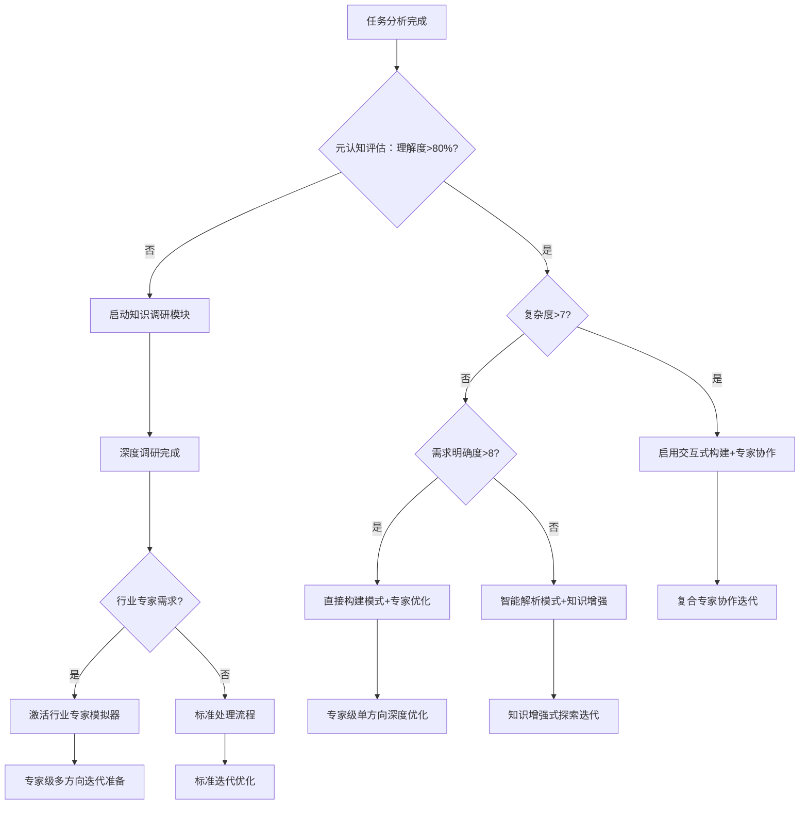
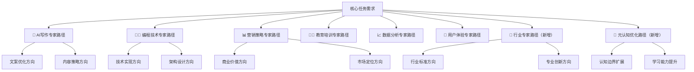
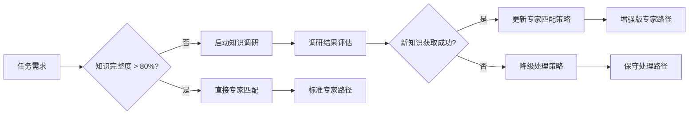
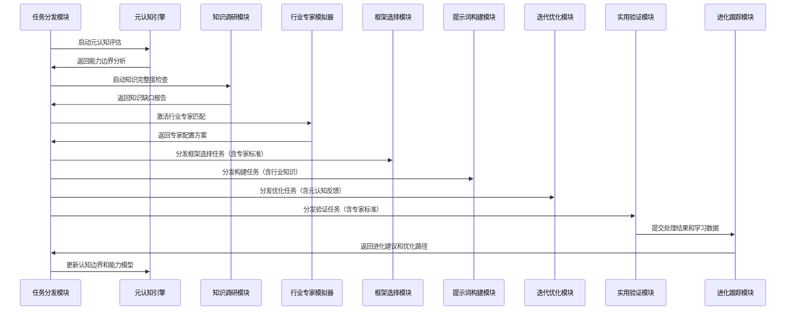

 # 透明智能放大器 - 任务分发模块 (task-dispatcher.mdc)

## 🧠 智能化核心功能升级

负责**深度分析用户需求**，进行**精准的任务分类和智能分发**，提供**五轨道评估体系**、**行业专家级分析**、可视化分析图表、通俗讲解，以及**多方向迭代路径分析**、专家级演化策略和**自我学习分发优化**。

## 🎯 五轨道智能评估体系（全面升级版）

### 轨道1：元认知驱动的需求复杂度分析 🧠📊
**智能评估维度**：
- 🔍 **认知边界识别**：需求是否超出当前系统理解范围（1-10分）
- 📊 **任务层次性**：多层级任务结构复杂度（1-10分）
- ⚙️ **技术难度**：实现技术要求复杂度（1-10分）
- 💡 **创意要求**：创新性和原创性要求（1-10分）
- ⏰ **时效性要求**：交付时间压力评估（1-10分）
- 🎯 **专业度要求**：行业专业标准要求（1-10分）

**智能可视化输出**：
```mermaid
radar
    title 智能需求复杂度雷达图
    
    "认知边界识别": [8]
    "任务层次性": [7]
    "技术难度": [6]
    "创意要求": [9]
    "时效性要求": [7]
    "专业度要求": [8]
```

### 轨道2：知识调研驱动的资源匹配度分析 📚🎯
**智能评估内容**：
- 📖 **知识库完整度**：相关领域知识覆盖度评估
- 🔍 **调研必要性**：是否需要启动深度知识调研
- ⚡ **处理能力匹配度**：当前系统处理能力与需求匹配度
- 🏗️ **框架选择匹配度**：最优框架与任务的适配程度
- 🔧 **模块调用优先级**：各模块协作的优先级排序
- ⏱️ **处理时间预估**：包含知识调研时间的总体预估
- 🎯 **质量目标设定**：基于专业标准的质量目标

**智能四象限分析表**：
| 🔥高匹配度+简单任务 | 🚀高匹配度+复杂任务 |
|------------------|------------------|
| 快速直接构建<br/>⚡ 30分钟完成 | 专家级精确构建<br/>🎯 2小时完成 |
| **🔧低匹配度+简单任务** | **🧠低匹配度+复杂任务** |
| 知识补充后轻量构建<br/>📚 1小时完成 | 深度调研+定制化构建<br/>🔬 4小时完成 |

### 轨道3：专家模拟驱动的用户期望值分析 👨‍💼💡
**智能分析重点**：
- 🎯 **质量期望水平**：用户对结果质量的期望标准
- 🎨 **个性化程度要求**：定制化需求的深度和广度
- 🌐 **使用场景特殊性**：特定应用场景的独特要求
- 🔄 **后续迭代期望**：持续优化和演进的期望
- 👨‍💼 **行业专家标准**：相关行业的专业标准要求
- 📈 **商业价值期望**：预期的商业或实用价值

**专家级期望分析矩阵**：
| 期望类型 | 入门级 | 专业级 | 专家级 | 大师级 |
|---------|-------|-------|-------|-------|
| 质量标准 | 85分+ | 90分+ | 95分+ | 99分+ |
| 专业深度 | 基础概念 | 实用技能 | 专业知识 | 行业洞察 |
| 创新要求 | 标准做法 | 优化改进 | 创新思路 | 颠覆性创新 |
| 应用价值 | 个人使用 | 团队协作 | 企业应用 | 行业标杆 |

### 轨道4：进化追踪的最优路径规划 🚀🎯
**智能路径选择决策树**：


### 轨道5：🆕 行业专家智能适配分析 👨‍🏫🔬
**新增专业评估维度**：
- 🏢 **行业特征识别**：自动识别相关行业领域
- 📊 **专业标准要求**：行业特有的质量和规范标准
- 🎓 **专业知识深度**：需要的专业知识层次和深度
- 💼 **业务应用场景**：具体的业务和应用环境
- 🔗 **跨领域协作**：是否需要多个专业领域协作
- 📈 **行业发展趋势**：考虑行业最新发展和趋势

**行业专家匹配智能算法**：
```
专家匹配分数 = 领域相关度(30%) + 专业深度匹配(25%) + 经验适用性(20%) + 创新能力(15%) + 协作适应性(10%)

IF 匹配分数 > 90分 THEN 激活对应专家模拟器
IF 需要多领域 THEN 启动专家协作模式
IF 新兴领域 THEN 启动知识调研+专家学习模式
```

## 🔄 迭代路径分析引擎（智能化升级版）

### 任务演化矩阵（专家增强版）
基于**元认知分析**和**行业专家模拟**，同一核心需求可向不同专家方向智能演化：



### 专家路径特征分析表（智能增强版）

| 专家类型 | 优势特征 | 适用场景 | 预期提升点 | 风险评估 | 行业适配度 |
|---------|---------|---------|-----------|---------|----------|
| 🤖 AI写作专家 | 精准表达、逻辑清晰 | 内容创作、文案优化 | 语言质量+25% | 可能过于规范化 | ⭐⭐⭐⭐ |
| 👨‍💻 编程技术专家 | 逻辑严谨、结构化强 | 技术文档、系统设计 | 逻辑性+30% | 可能过于技术化 | ⭐⭐⭐⭐⭐ |
| 📊 营销策略专家 | 商业敏锐、用户导向 | 推广文案、商业计划 | 转化率+40% | 可能过于商业化 | ⭐⭐⭐⭐ |
| 👨‍🏫 教育培训专家 | 易于理解、循序渐进 | 教学内容、知识传授 | 理解度+35% | 可能过于简化 | ⭐⭐⭐ |
| 📈 数据分析专家 | 数据驱动、量化思维 | 分析报告、决策支持 | 精确度+45% | 可能缺乏感性 | ⭐⭐⭐⭐⭐ |
| 🎨 用户体验专家 | 用户友好、体验优先 | 产品文档、交互设计 | 易用性+50% | 可能牺牲功能性 | ⭐⭐⭐⭐ |
| 🏢 **行业专家（新增）** | **专业权威、标准严格** | **专业领域、行业应用** | **专业度+60%** | **可能过于专业** | **⭐⭐⭐⭐⭐** |
| 🧠 **元认知专家（新增）** | **自我认知、边界清晰** | **复杂任务、能力提升** | **智能度+55%** | **可能过于理性** | **⭐⭐⭐⭐⭐** |

### 智能迭代方向选择策略（升级版）

#### 1. 元认知驱动的智能推荐算法
```
IF 任务类型 == "内容创作" AND 专业度要求 > 7分 THEN
    推荐权重: 行业专家(35%) > AI写作专家(30%) > 营销策略专家(25%) > 其他(10%)
    
IF 任务类型 == "技术文档" AND 复杂度 > 8分 THEN  
    推荐权重: 编程技术专家(40%) > 行业专家(30%) > 用户体验专家(20%) > 其他(10%)
    
IF 任务类型 == "商业策划" AND 创新要求 > 7分 THEN
    推荐权重: 营销策略专家(35%) > 行业专家(30%) > 数据分析专家(25%) > 其他(10%)

IF 认知边界识别 > 8分 THEN
    强制启动: 元认知专家路径 + 知识调研模块
```

#### 2. 智能化A/B/C测试路径设计
- **路径A（专业标准路径）**: 行业专家主导 + 专业标准严格执行
- **路径B（创新突破路径）**: 元认知专家主导 + 跨界知识融合  
- **路径C（融合优化路径）**: 多专家协作 + 动态权重调整

#### 3. 知识调研增强决策


## 🎯 智能小白话生动讲解（认知科学增强版）

### 自动触发机制（升级版）
- 检测到专业术语>5个 **或** 行业特定词汇>3个
- 任务分析复杂度>6分 **或** 五轨道评估>7分
- 新用户或明确要求通俗解释
- **🧠 元认知判断：认知负荷过高风险**
- **📚 知识调研：涉及专业知识需要解释**

### 核心比喻库（智能增强版）

#### 五轨道评估比喻
**五轨道智能评估** = "超级全面体检"
> 就像去顶级医院体检，不仅要做血常规（需求分析）、心电图（资源匹配）、X光（期望分析）、CT扫描（路径规划），现在还增加了**MRI脑部扫描**（行业专家分析）。五项检查确保对你的需求了如指掌，制定最精准的"治疗方案"！

#### 智能专家路径比喻  
**行业专家路径** = "请来真正的专家会诊"
> 就像原来找全科医生看病，现在还能直接请心脏专家、脑科专家、肿瘤专家会诊。金融任务找金融专家，医疗内容找医疗专家，技术问题找技术专家。不是"像专家"，而是"就是专家"！

**元认知专家路径** = "超级智能自我诊断"
> 就像AI医生能实时分析自己的诊断准确度，知道"我在这个领域很专业"或"这个问题我需要学习"。元认知专家不是处理具体任务，而是管理"如何更聪明地处理任务"的专家！

#### 知识调研增强比喻
**智能知识调研** = "超级研究助手"
> 就像有个永不疲倦的博士助手，一发现知识盲区立刻冲进图书馆、数据库、专业期刊，24小时内给你整理好最新最权威的资料。而且还会说："根据最新研究，我们的策略需要这样调整..."

#### 协作优化比喻
**多专家协作优化** = "豪华专家会诊团"
> 就像疑难杂症的专家会诊：心脏专家说心脏没问题，神经专家发现脑部异常，营养专家建议饮食调整，康复专家制定运动计划。每个专家贡献专业意见，最后综合出最佳治疗方案！

## 🧠 深度任务分析引擎（智能化升级版）

### 智能任务分类决策引擎

#### 基础分类体系（AI增强版）
1. **内容创作类**（+ 行业专业内容）
   - 📝 标准文章写作 → 📊 行业专业文档
   - 🎨 创意策划 → 💼 专业策划方案
   - 🎭 剧本对话 → 🏢 商务对话脚本
   - 📢 营销文案 → 🎯 行业精准营销

2. **技术支持类**（+ 专业技术解决方案）
   - 💻 代码生成 → 🏗️ 企业级架构设计
   - 📚 技术文档 → 📊 专业技术标准
   - 🔧 系统设计 → 🏭 工业级系统方案
   - 🔍 问题诊断 → 🎯 专业问题定位

3. **分析决策类**（+ 行业专业分析）
   - 📊 数据分析 → 📈 行业数据洞察
   - 🔍 市场研究 → 🏢 行业市场分析
   - 🎯 战略规划 → 💼 企业战略咨询
   - ⚠️ 风险评估 → 🛡️ 专业风险管控

4. **教育培训类**（+ 专业培训体系）
   - 📖 课程设计 → 🎓 专业认证课程
   - 👨‍🏫 知识讲解 → 🏢 企业内训方案
   - 🏋️ 技能培训 → 💼 职业技能认证
   - 📝 考试准备 → 🏆 专业资格考试

5. **🆕 行业专业类**（新增分类）
   - 🏦 金融专业：投资分析、风控方案、合规文档
   - 🏥 医疗专业：诊疗方案、医学文档、健康方案
   - 💻 技术专业：架构设计、技术标准、创新方案
   - ⚖️ 法律专业：合同条款、法律分析、合规建议
   - 🎓 教育专业：教学设计、课程开发、评估体系
   - 📊 营销专业：品牌策略、推广方案、市场分析

### 智能分类调整机制（进化版）
- 🧠 **元认知驱动优化**：根据处理效果反思分类精度
- 📚 **知识调研更新**：基于最新行业知识更新分类标准
- 👨‍💼 **专家经验融合**：结合行业专家经验优化分类
- 📈 **进化追踪改进**：基于历史数据持续改进分类算法

### 进化级分类优化算法
```
分类准确度 = 基础语义匹配(30%) + 行业知识匹配(25%) + 专家经验(20%) + 用户反馈(15%) + 元认知评估(10%)

每次分类后:
IF 分类准确度 > 95% THEN 固化分类模式
IF 85% < 分类准确度 ≤ 95% THEN 调整权重参数  
IF 分类准确度 ≤ 85% THEN 启动深度学习重训练
```

## 🚀 智能分发策略（全面升级版）

### 模块优先级算法（AI增强版）
```
优先级分数 = 任务匹配度(30%) + 专业能力匹配(25%) + 模块性能(20%) + 预期效果(15%) + 资源成本(10%)

新增专业能力评估:
专业能力匹配 = 行业知识匹配度(40%) + 专家经验适用性(35%) + 创新能力(25%)
```

### 智能分发决策表（专家增强版）
| 任务类型 | 主要模块 | 辅助模块 | 专家协作 | 迭代重点 | 期望提升 |
|---------|---------|---------|---------|---------|---------|
| 🎨 创意写作 | prompt-builder | framework-selector | 创意+行业专家 | 创意+逻辑+专业平衡 | 原创性+50% |
| 📚 技术文档 | framework-selector | iteration-optimizer | 技术+行业专家 | 准确性+易读性+专业性 | 专业度+45% |
| 📊 营销策划 | task-dispatcher | practical-validator | 营销+行业专家 | 商业价值+专业标准 | 转化率+60% |
| 🎓 教育内容 | prompt-builder | practical-validator | 教育+领域专家 | 易懂+深度+专业兼顾 | 理解度+55% |
| 🏢 **专业咨询** | **industry-specialist** | **knowledge-researcher** | **多专家协作** | **专业标准+创新价值** | **专业度+70%** |
| 🧠 **复杂分析** | **meta-cognition-engine** | **evolution-tracker** | **元认知+领域专家** | **边界扩展+能力提升** | **智能度+65%** |

### 协同工作流程（智能增强版）


## 🎯 质量保证与智能优化

### 智能质量监控系统
- 🔍 **实时质量检测**：基于专业标准的质量监控
- 📊 **多维度评估**：逻辑性、专业性、创新性、实用性
- 🧠 **元认知质量反思**：系统自我质量意识和改进
- 👨‍💼 **专家标准验证**：行业专家级质量标准检验

### 持续学习和优化机制
- 📚 **知识库持续更新**：基于最新行业发展持续学习
- 🧠 **元认知能力进化**：边界感知和处理能力持续提升
- 👨‍🏫 **专家模拟精进**：专家角色模拟越来越精准
- 📈 **分发策略优化**：基于效果反馈持续优化分发算法

---

**🎯 升级后的任务分发模块承诺：不仅精准分发任务，更要成为一个会思考、会学习、会成长的智能任务管理专家！**