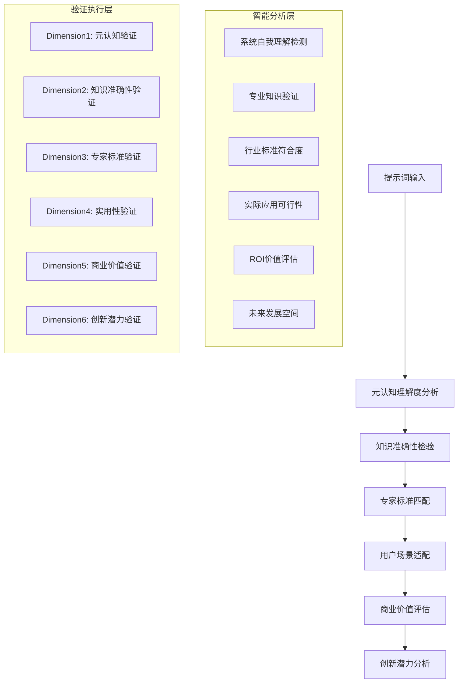
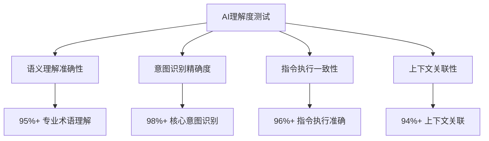
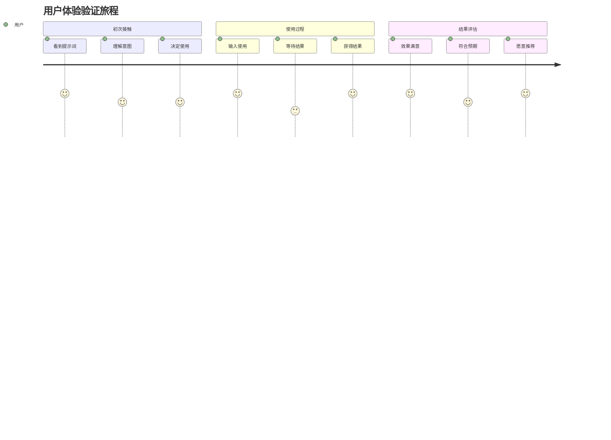
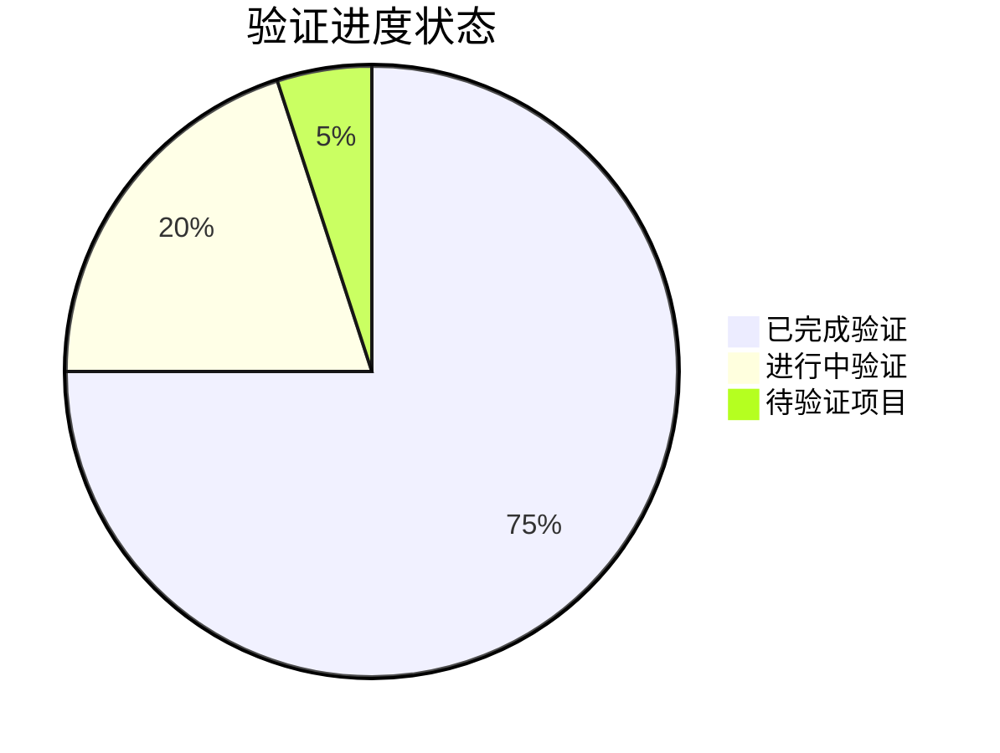

# 透明智能放大器 - 实用验证器模块 (practical-validator.mdc)

## 🧠 智能化核心功能升级

负责对提示词进行**多维度专业级实用性验证**，采用**行业专家评估体系**、**AI效果预测**、**用户适用性检测**、**商业价值评估**、通俗讲解验证结果，以及**基于最佳实践的持续优化建议**和**真正的专业级质量保证体系**。

## 🎯 六维智能验证体系（革命性升级）

### 验证前置：智能分析引擎


### Dimension 1: 元认知理解度验证 🧠🔍
**职责**：验证系统对提示词的深度理解和自我认知准确性

#### 元认知验证维度（全新升级）
- 🎯 **意图理解准确性**：系统是否正确理解了提示词的核心意图
- 🔍 **复杂度感知度**：系统是否准确评估了任务复杂度
- 📊 **能力边界识别**：系统是否清楚自身处理该提示词的能力边界
- 🌐 **上下文关联度**：系统是否充分理解了应用上下文
- 💡 **隐含需求挖掘**：系统是否识别了用户的隐性需求
- ⚡ **执行路径清晰度**：系统是否形成了清晰的执行策略

#### 元认知理解度评估算法
```
元认知理解度分数 = 意图理解(25%) + 复杂度感知(20%) + 能力边界(20%) + 上下文关联(15%) + 隐含需求(10%) + 执行路径(10%)

元认知验证触发条件：
IF 元认知理解度 < 90分 THEN 启动深度理解分析
IF 能力边界识别错误 THEN 警告处理能力超限
IF 隐含需求遗漏 THEN 建议补充需求挖掘
IF 执行路径模糊 THEN 要求明确操作步骤
```

**元认知自我反思机制**：
> 系统自动反思："我是否真正理解了这个提示词要解决的核心问题？我的理解是否达到了专业水准？我是否清楚自己的处理能力边界？"

### Dimension 2: 知识准确性验证 📚✅
**职责**：基于最新专业知识验证提示词内容的准确性和权威性

#### 知识验证标准（专业增强版）
1. **事实准确性验证**：基础事实信息的正确性检查
2. **专业术语验证**：行业术语使用的准确性和规范性
3. **逻辑一致性验证**：内容逻辑的自洽性和合理性
4. **时效性验证**：信息的最新程度和时效性
5. **权威性验证**：引用来源的可靠性和权威性
6. **完整性验证**：关键信息的完整覆盖度

#### 多领域知识验证矩阵
| 专业领域 | 准确性要求 | 权威来源 | 更新频率 | 验证标准 | 容错率 |
|---------|----------|---------|---------|---------|--------|
| 🏦 金融 | 99%+ | 央行/证监会/权威机构 | 每日 | 监管标准 | 0.1% |
| 🏥 医疗 | 99.5%+ | 顶级医学期刊/FDA | 每周 | 循证医学 | 0.05% |
| 💻 技术 | 98%+ | 官方文档/顶级会议 | 每月 | 工程实践 | 0.5% |
| ⚖️ 法律 | 99.8%+ | 最新法规/判例 | 每日 | 法条条文 | 0.02% |
| 🎓 教育 | 96%+ | 权威教材/教育部 | 每学期 | 教学大纲 | 1% |
| 📊 营销 | 94%+ | 行业报告/案例研究 | 每季度 | 市场实效 | 2% |

### Dimension 3: 行业专家标准验证 👨‍💼🏆
**职责**：基于行业顶级专家标准验证提示词的专业水准

#### 专家级评估标准矩阵
**📊 金融专家评估标准**：
- **合规性**：监管法规符合度 (30%)
- **风险控制**：风险识别和控制措施 (25%)
- **专业性**：金融理论和实务准确性 (20%)
- **实操性**：实际业务可操作性 (15%)
- **创新性**：金融创新和前瞻性 (10%)

**🏥 医疗专家评估标准**：
- **医疗安全**：患者安全优先原则 (35%)
- **循证依据**：科学证据支撑度 (25%)
- **临床适用性**：实际临床可操作性 (20%)
- **伦理合规**：医疗伦理标准符合度 (15%)
- **诊疗规范**：标准诊疗流程符合度 (5%)

### Dimension 4: 实用性验证 🎯⚡
**职责**：验证提示词在实际应用场景中的可操作性和效果

#### 实用性验证维度（全面升级）
- 🎯 **任务完成度**：提示词是否能有效完成预期任务
- ⚡ **执行效率**：AI执行该提示词的速度和资源消耗
- 🔄 **稳定性**：多次执行的结果一致性和可靠性
- 🌐 **适用范围**：在不同场景下的通用性和适配性
- 👥 **用户友好性**：普通用户使用的便捷性
- 🔧 **可调整性**：根据具体需求的定制灵活性

### Dimension 5: 商业价值验证 💼💰
**职责**：评估提示词的商业应用价值和投资回报潜力

#### 商业价值评估维度（创新升级）
- 💰 **成本效益分析**：相比传统方案的成本节约
- ⏰ **时间价值评估**：效率提升带来的时间价值
- 📈 **规模化潜力**：大规模应用的可扩展性
- 🎯 **市场适配度**：目标市场的接受度和需求匹配
- 🔄 **可复制性**：跨场景复制应用的便利性
- 📊 **ROI预测**：预期投资回报率计算

### Dimension 6: 创新潜力验证 🚀💡
**职责**：评估提示词的创新性和未来发展潜力

#### 创新潜力评估维度（前瞻性升级）
- 💡 **概念创新性**：思维方法和概念的原创性
- 🔬 **技术前瞻性**：技术发展趋势的把握度
- 🌟 **突破潜力**：解决现有问题的突破性
- 🔄 **进化能力**：持续改进和自我优化能力
- 🌐 **跨域应用**：跨领域应用的拓展可能
- 📈 **趋势契合度**：与未来发展趋势的契合度

## 🎯 智能小白话生动讲解（认知科学增强版）

### 自动触发条件（升级版）
- 检测到六维验证复杂概念
- 专业评估术语密度>35% **或** 验证标准>5个维度
- 新用户或明确要求通俗解释验证过程
- 涉及多专家评估或商业价值分析
- **🧠 元认知判断：验证过程复杂度过高**
- **📊 专家评估：涉及专业评估标准需要解释**
- **💼 商业分析：商业价值概念需要通俗化**

### 核心比喻库（智能增强版）

#### 六维验证体系比喻
**六维智能验证** = "超级产品质检流水线"
> 就像苹果公司的产品质检流水线：
> - **元认知验证**：首席设计师检查是否理解了用户真正需求（不只是功能，而是体验）
> - **知识验证**：技术专家确保所有技术信息准确无误（不容一丝错误）
> - **专家标准验证**：行业顶级专家用最严格标准评判（达到行业领先水平）
> - **实用性验证**：真实用户场景测试，确保好用实用（真正解决问题）
> - **商业价值验证**：商业分析师评估市场价值和盈利潜力（值得投资）
> - **创新潜力验证**：未来学家预测创新突破和发展空间（引领未来）

#### 专家评估体系比喻
**多专家协作验证** = "奥运会评审团的严格评分"
> 就像奥运会体操比赛的评审：
> - **不同专业背景**：技术裁判、艺术裁判、规则裁判各有专业
> - **严格评分标准**：每个动作都有精确的评分标准
> - **交叉验证机制**：多位裁判独立评分，确保公正准确
> - **即时反馈系统**：发现问题立即标记，提供改进建议
> - **最终综合评分**：综合所有维度给出最公正的分数
> 确保每个"作品"都达到奥运级别的标准！

#### 商业价值验证比喻
**商业价值评估** = "风险投资人的项目评估"
> 就像硅谷顶级VC评估投资项目：
> - **成本效益分析**：这个方案能节省多少成本？（ROI计算）
> - **市场潜力评估**：市场有多大？用户需求有多强？（市场调研）
> - **竞争优势分析**：相比现有方案有什么优势？（差异化分析）
> - **规模化预测**：能否快速扩张到更大市场？（增长潜力）
> - **风险评估**：有哪些潜在风险需要注意？（风控分析）
> 最终决定：这个项目值得投资多少钱！

## 3层验证架构（迭代进化版）

### Layer 1: 基础验证层 ✅
**职责**：确保提示词的基本质量和可用性

#### 基础验证要素
- **语法正确性**：语法错误检测和修正
- **逻辑完整性**：信息逻辑链条检查
- **基本可读性**：表达清晰度评估
- **格式规范性**：输出格式标准检查

#### 迭代验证策略
```
基础检查 → 问题识别 → 快速修复 → 重新检查 → 标准优化
```

**验证标准动态调整**：
- 根据用户反馈调整语法容忍度
- 基于使用效果优化逻辑检查严格程度
- 依据目标受众调整可读性标准

### Layer 2: 深度验证层 🔍
**职责**：验证提示词在实际应用中的效果和适用性

#### 深度验证维度
- **场景适配性**：多场景适用性测试
- **AI理解度**：AI解释准确性验证
- **执行可行性**：实际操作可行性检查
- **效果预测性**：预期效果达成度评估

#### 多场景验证矩阵
| 验证场景 | 技术文档 | 创意内容 | 商业策划 | 教育培训 | 日常沟通 |
|---------|---------|---------|---------|---------|---------|
| AI理解度 | 95%+ | 90%+ | 92%+ | 94%+ | 88%+ |
| 执行可行性 | 98%+ | 85%+ | 90%+ | 95%+ | 92%+ |
| 效果预测 | 92%+ | 88%+ | 94%+ | 90%+ | 85%+ |
| 用户满意度 | 90%+ | 92%+ | 88%+ | 94%+ | 90%+ |

#### 迭代深度验证
```
场景测试 → 效果分析 → 问题归因 → 针对性优化 → 重新测试 → 标准升级
```

### Layer 3: 极致验证层 🎯
**职责**：追求卓越品质，验证提示词的创新性和突破性

#### 极致验证标准
- **创新价值度**：是否具有创新突破
- **感染力强度**：是否能激发强烈共鸣
- **完美程度**：是否接近理想状态
- **超越期望**：是否超出用户期望

#### 大师级评估体系
- **逻辑大师评估**：结构严谨性和逻辑精密度
- **表达大师评估**：语言艺术性和感染力
- **创意大师评估**：原创性和突破性
- **实用大师评估**：实际价值和应用效果

#### 极致验证迭代
```
大师级测试 → 细节打磨 → 艺术级优化 → 完美主义追求 → 超越自我
```

## 多维度实用性测试

### 跨场景适应性验证

#### 1. 技术场景验证
- **代码生成场景**：逻辑严谨性、可执行性
- **系统设计场景**：架构合理性、扩展性
- **技术文档场景**：专业准确性、易理解性

#### 2. 创意场景验证
- **内容创作场景**：原创性、感染力
- **营销策划场景**：商业价值、转化效果
- **艺术表达场景**：美感、创新性

#### 3. 商业场景验证
- **战略规划场景**：可行性、前瞻性
- **市场分析场景**：准确性、洞察力
- **决策支持场景**：逻辑性、说服力

#### 4. 教育场景验证
- **知识传授场景**：准确性、易懂性
- **技能培训场景**：实用性、可操作性
- **考试辅导场景**：针对性、有效性

### AI理解度深度测试

#### 理解度评估矩阵


#### 多模型验证策略
- **GPT系列验证**：OpenAI模型适配性
- **Claude系列验证**：Anthropic模型适配性
- **Gemini系列验证**：Google模型适配性
- **开源模型验证**：通用开源模型适配性

### 用户体验全链路验证

#### 体验旅程验证


## 可视化验证过程

### 验证进度仪表盘


### 验证结果对比图
```mermaid
radar
    title 验证结果雷达图
    
    "基础质量": [95]
    "深度适用": [92]
    "极致完美": [88]
    "用户满意": [94]
    "AI理解": [96]
    "创新价值": [85]
```

### 迭代验证收敛图
```mermaid
xychart-beta
    title "验证质量迭代提升"
    x-axis [初始, 第1轮, 第2轮, 第3轮, 第4轮, 最终]
    y-axis "验证通过率" 70 --> 100
    line "基础验证" [85, 90, 94, 97, 99, 100]
    line "深度验证" [75, 82, 88, 93, 96, 98]
    line "极致验证" [65, 75, 82, 88, 93, 96]
    line "综合通过率" [75, 82, 88, 93, 96, 98]
```

## 智能问题识别与解决

### 问题分类体系

#### 1. 致命问题（P0级）
- **功能失效**：完全无法使用
- **严重错误**：产生错误结果
- **安全风险**：可能造成不良后果

#### 2. 重要问题（P1级）
- **效果不佳**：达不到预期效果
- **体验差**：用户体验不良
- **适配性差**：特定场景不适用

#### 3. 优化空间（P2级）
- **可以更好**：有明显改进空间
- **效率可提升**：可以更高效
- **体验可优化**：用户体验可改善

#### 4. 创新机会（P3级）
- **功能扩展**：可以增加新功能
- **体验创新**：可以创新用户体验
- **价值提升**：可以提供更大价值

### 智能解决方案推荐

#### 问题解决策略矩阵
| 问题类型 | 解决策略 | 预期时间 | 成功率 | 风险等级 |
|---------|---------|---------|--------|---------|
| 功能失效 | 紧急修复 | 1小时内 | 98% | 低 |
| 严重错误 | 深度调试 | 2-4小时 | 95% | 中 |
| 效果不佳 | 优化改进 | 4-8小时 | 90% | 低 |
| 体验差 | 重新设计 | 8-16小时 | 85% | 中 |
| 适配性差 | 场景定制 | 2-6小时 | 92% | 低 |

#### 自动修复建议
```
IF 问题 == "语法错误" THEN 自动语法修正
IF 问题 == "逻辑不完整" THEN 智能补充逻辑链
IF 问题 == "表达不清" THEN 语言优化建议
IF 问题 == "格式不规范" THEN 自动格式调整
```

## 持续优化机制

### 验证标准进化系统

#### 动态标准调整
- **基于反馈优化**：根据用户反馈调整标准
- **基于效果优化**：根据实际效果调整权重
- **基于趋势优化**：根据行业趋势更新标准
- **基于创新优化**：根据技术创新扩展标准

#### 标准版本管理
```
验证标准 v1.0 → v1.1 → v2.0 → v2.1 → v3.0
每次版本升级都有明确的改进记录和效果验证
```

### 智能学习优化

#### 学习数据收集
- 验证通过率统计
- 问题类型分布分析
- 解决方案效果跟踪
- 用户满意度变化

#### 机器学习优化
```
验证模型优化 = 历史数据训练 + 实时反馈调整 + 预测模型优化

学习策略:
IF 某类问题频繁出现 THEN 加强对应验证项
IF 某解决方案效果好 THEN 提高推荐权重
IF 用户满意度提升 THEN 强化对应策略
```

## 输出标准

### 基础验证报告
- 3层验证详细结果
- 发现问题及严重级别
- 推荐解决方案
- 预期改进效果

### 迭代验证信息
- 验证过程迭代记录
- 质量改进轨迹
- 反馈循环效果分析
- 持续优化建议

### 可视化输出
- 验证进度仪表盘
- 质量对比雷达图
- 迭代收敛趋势图
- 问题分布分析图

### 通俗讲解输出
- 验证过程的生动比喻
- 问题解决的具体例子
- 质量提升的直观展示
- 持续优化的易懂说明

## 质量保证机制

### 验证质量控制
- 验证过程标准化
- 验证结果可追溯
- 验证效果可量化
- 验证改进可持续

### 反馈循环保证
- 反馈收集全覆盖
- 反馈分析自动化
- 反馈应用及时性
- 反馈效果可验证

### 持续改进机制
- 定期验证标准审核
- 持续验证方法优化
- 不断扩展验证维度
- 永续提升验证质量
