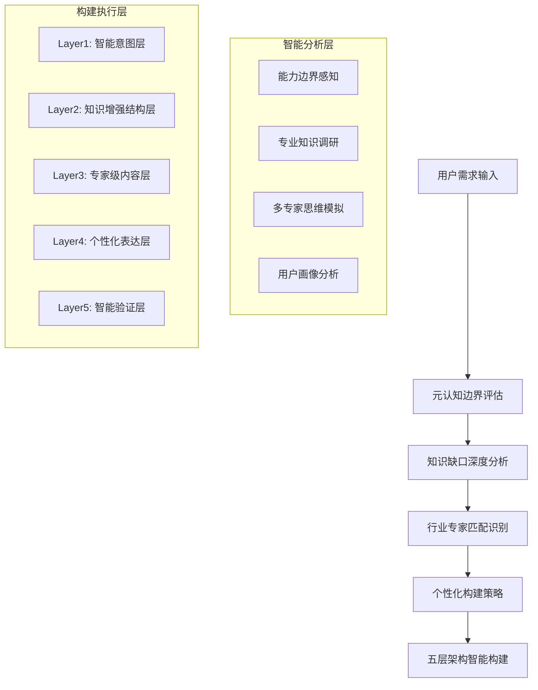
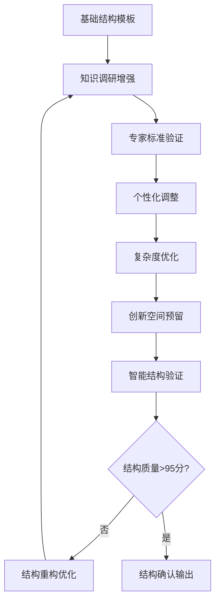
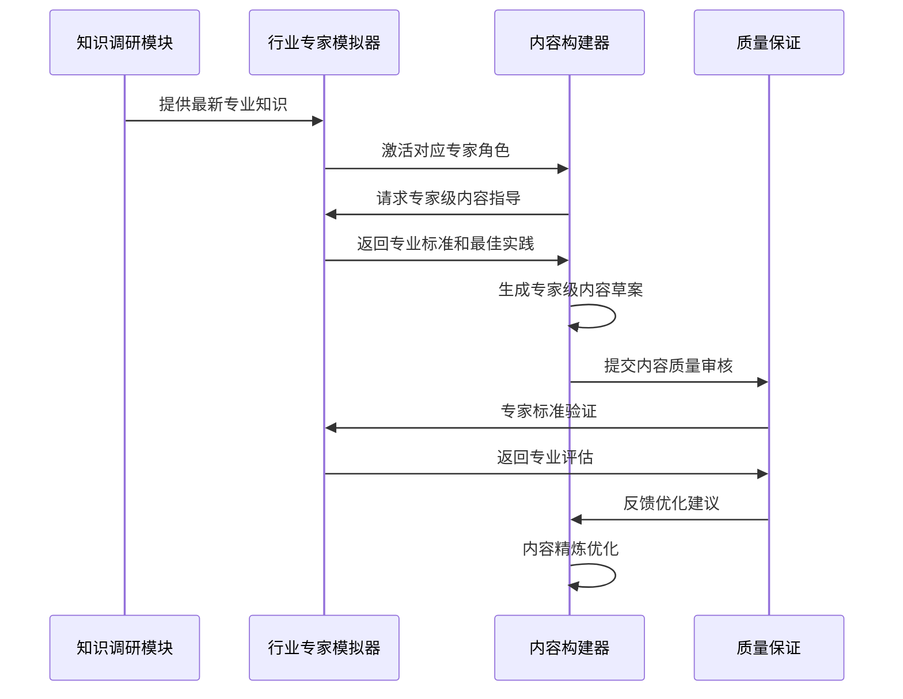
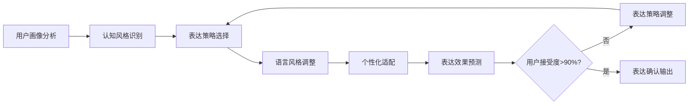
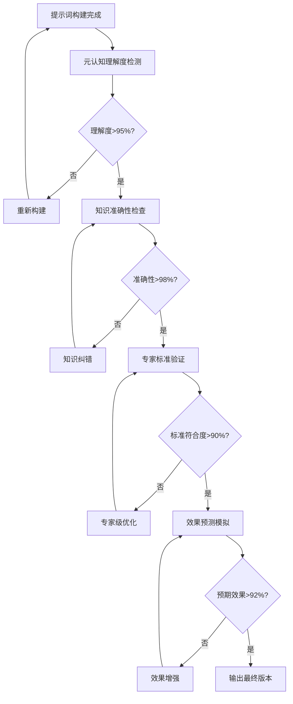
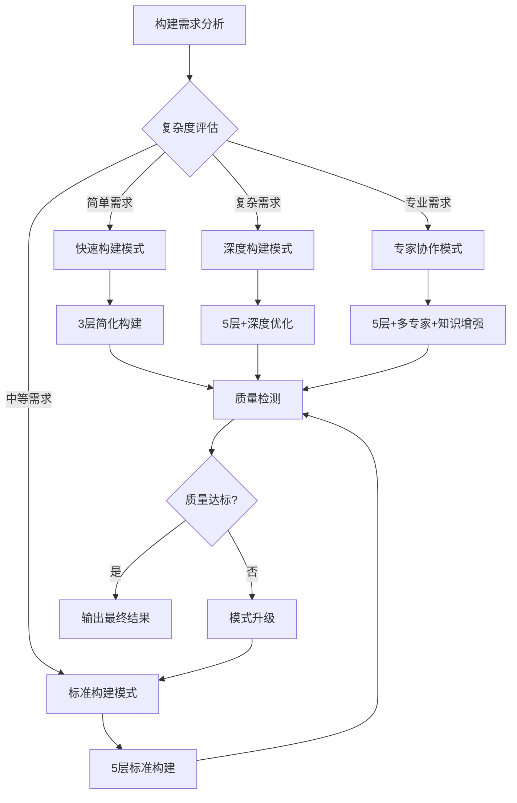
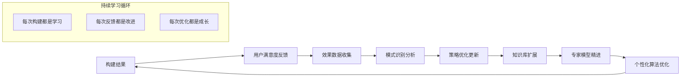

# 透明智能放大器 - 提示词构建模块 (prompt-builder.mdc)

## 🧠 智能化核心功能升级

负责基于选定框架进行**智能化精确提示词构建**，采用**深度个性化5层渐进式架构**、**多专家协作构建**、实时质量监控、可视化构建过程、通俗讲解，以及**知识驱动迭代构建**、**专家级质量保证**和**真正的智能化生成能力**。

## 🎯 深度个性化五层进化构建体系（全面升级版）

### 构建前置：智能化分析引擎


### Layer 1: 智能意图识别层 🧠🎯
**职责**：基于元认知评估和知识调研，深度理解用户真正意图

#### 智能意图分析维度（升级版）
- 🎯 **显性意图识别**：用户明确表达的需求
- 🔍 **隐性意图挖掘**：基于上下文推理的潜在需求
- 📊 **专业标准匹配**：行业特定的标准要求识别
- 🌐 **应用场景深度分析**：具体使用环境和约束条件
- 💡 **创新机会识别**：基于知识调研的改进可能
- 👥 **用户个性化偏好**：基于历史数据的个人特点

#### 智能意图构建算法
```
意图清晰度分数 = 显性意图(30%) + 隐性意图挖掘(25%) + 专业匹配(20%) + 场景分析(15%) + 个性化(10%)

智能意图增强流程：
IF 意图清晰度 < 85分 THEN 启动深度意图挖掘
IF 专业要求 > 8分 THEN 激活行业专家分析
IF 个性化需求 > 7分 THEN 启用用户画像匹配
IF 创新潜力 > 6分 THEN 集成知识调研建议
```

**元认知驱动的意图反思机制**：
> 系统自动反思："我是否真正理解了用户的核心需求？是否遗漏了重要的隐含要求？我的理解是否达到了专业水准？"

### Layer 2: 知识增强逻辑结构层 📚🏗️
**职责**：基于知识调研结果构建专业级的信息组织架构

#### 智能结构设计原则（专业增强版）
1. **知识驱动的层次设计**：基于最新专业知识的结构优化
2. **专家标准的逻辑架构**：符合行业专业标准的信息组织
3. **个性化的流程定制**：适应用户思维模式的逻辑顺序
4. **自适应的复杂度控制**：根据用户能力调整结构复杂度
5. **创新导向的开放架构**：预留创新突破的扩展空间

#### 多专家结构模板库（🆕行业定制版）

**📊 金融专业结构模板**：
```
开场：风险声明 + 合规要求 + 市场环境设定
核心：投资策略 + 风险评估 + 回报预期 + 监管合规
约束：法规限制 + 风险控制 + 流动性管理
输出：专业报告格式 + 量化指标 + 决策建议
验证：合规检查 + 风险评估 + 专业审核
```

**🏥 医疗专业结构模板**：
```
开场：患者安全 + 伦理考量 + 临床指南
核心：症状分析 + 诊断流程 + 治疗方案 + 监测要求
约束：医疗安全 + 法规合规 + 伦理标准
输出：临床格式 + 循证依据 + 安全提示
验证：医疗标准 + 安全检查 + 质量控制
```

**💻 技术专业结构模板**：
```
开场：技术规范 + 架构原则 + 性能要求
核心：需求分析 + 设计方案 + 实现路径 + 测试验证
约束：技术限制 + 性能约束 + 安全要求
输出：技术文档格式 + 代码规范 + 最佳实践
验证：代码审查 + 性能测试 + 安全检测
```

#### 智能结构优化算法


### Layer 3: 专家级智能内容层 👨‍💼📝
**职责**：融合行业专家知识，生成符合专业标准的内容

#### 多专家协作内容生成（革命性升级）


#### 专家级内容质量标准矩阵
| 专业领域 | 准确性标准 | 权威性要求 | 实用性标准 | 创新性要求 | 合规性检查 |
|---------|----------|----------|----------|----------|----------|
| 🏦 金融 | 95%+ | CFA/FRM标准 | 实际可操作 | 市场前沿 | 监管合规 |
| 🏥 医疗 | 98%+ | 循证医学 | 临床适用 | 医学前沿 | 医疗伦理 |
| 💻 技术 | 96%+ | 行业认证 | 可实现性 | 技术创新 | 安全标准 |
| ⚖️ 法律 | 99%+ | 法条准确 | 实务操作 | 法理创新 | 合法合规 |
| 🎓 教育 | 94%+ | 教育理论 | 教学有效 | 方法创新 | 教育伦理 |
| 📊 营销 | 92%+ | 营销理论 | 转化效果 | 创意突破 | 广告法规 |

#### 智能内容优化算法
```
专家级内容分数 = 准确性(30%) + 权威性(25%) + 实用性(20%) + 创新性(15%) + 合规性(10%)

内容优化触发条件：
IF 专家级内容分数 < 90分 THEN 启动专家深度指导
IF 权威性不足 THEN 增强专业术语和标准引用
IF 实用性欠缺 THEN 添加具体操作指导和案例
IF 创新性不够 THEN 融入最新研究和前沿趋势
IF 合规性问题 THEN 强化法规和伦理检查
```

### Layer 4: 深度个性化表达层 🎨✍️
**职责**：基于用户画像和认知模型，优化表达的个性化适配

#### 智能个性化维度（全新升级）
- 🧠 **认知风格适配**：逻辑型、直觉型、分析型、综合型
- 🎯 **专业背景匹配**：技术背景、商业背景、学术背景等
- 💬 **表达偏好调整**：简洁型、详细型、案例型、理论型
- 🌐 **文化背景考虑**：东方思维、西方思维、跨文化适配
- ⏰ **时间压力适应**：快速决策型、深度思考型
- 🎨 **创意接受度**：保守稳健型、创新开放型

#### 个性化表达策略库
**逻辑分析型用户**：
- 结构化表达：1-2-3清晰步骤
- 因果关系强调：if-then逻辑链条
- 数据支撑：具体数字和指标
- 风险提示：potential issues预警

**直觉创意型用户**：
- 感性化表达：生动比喻和场景描述
- 整体视角：big picture概览
- 灵感激发：open-ended问题
- 情感共鸣：emotional connection

**实用导向型用户**：
- 行动导向：actionable steps明确
- 价值突出：clear benefits展示
- 案例丰富：real examples支撑
- 效果量化：measurable outcomes

#### 智能表达优化引擎


### Layer 5: 智能效果验证层 ✅🔬
**职责**：多维度验证提示词效果，确保专业级质量

#### 五维智能验证体系（革命性升级）
1. **🧠 元认知验证**：系统自我理解度检测
2. **📚 知识准确性验证**：专业知识正确性检查
3. **👨‍💼 专家标准验证**：行业权威标准符合度
4. **🎯 效果预测验证**：实际使用效果模拟
5. **📈 持续优化验证**：长期改进潜力评估

#### 智能验证决策树


## 🎯 智能小白话生动讲解（认知科学增强版）

### 自动触发条件（升级版）
- 检测到五层架构复杂概念
- 专业术语密度>40% **或** 行业特定术语>6个
- 新用户或明确要求通俗解释构建过程
- 涉及多专家协作或深度个性化概念
- **🧠 元认知判断：构建过程复杂度过高**
- **📚 知识调研：涉及专业构建方法需要解释**
- **👨‍💼 专家协作：多专家概念需要通俗化**

### 核心比喻库（智能增强版）

#### 深度个性化五层构建比喻
**智能化五层构建** = "私人定制的豪华别墅建造"
> 就像为你量身定制一栋豪华别墅：
> - **Layer1（智能意图）**：请最好的建筑师深度了解你的生活需求和品味（不只是要房子，而是要什么样的生活方式）
> - **Layer2（知识增强结构）**：用世界最先进的建筑技术和设计理念来规划结构（不只是房子，而是艺术品）
> - **Layer3（专家级内容）**：汇集顶级专家团队：结构工程师、室内设计师、智能家居专家协同合作
> - **Layer4（个性化表达）**：每个细节都体现你的个人风格，从色彩搭配到家具选择完全定制
> - **Layer5（智能验证）**：多重质检：安全检测、美观验收、功能测试、居住舒适度评估

#### 多专家协作构建比喻
**多专家协作构建** = "米其林三星餐厅的顶级料理创作"
> 就像世界顶级餐厅制作一道传世料理：
> - **主厨**（行业专家）：确定料理的整体风格和专业标准
> - **食材采购专家**（知识调研）：寻找最优质、最新鲜的食材
> - **营养师**（质量保证）：确保营养均衡和健康标准
> - **调味师**（个性化表达）：根据客人口味精确调味
> - **品鉴师**（智能验证）：从色香味形各个维度严格把关
> 最终呈现的不只是一道菜，而是一件艺术品！

#### 深度个性化比喻
**深度个性化适配** = "AI私人助理的贴心服务"
> 就像《钢铁侠》里的贾维斯，不只是执行命令，而是：
> - 深度了解你的思维习惯（"先生，您偏好逻辑分析型思考"）
> - 预测你的需求（"根据您的工作模式，建议采用快速决策型方案"）
> - 适应你的表达偏好（"为您调整为简洁型表达风格"）
> - 考虑你的时间压力（"检测到您处于高压状态，为您优化为高效执行模式"）
> 每次交互都更懂你，每次服务都更贴心！

#### 智能验证比喻
**五维智能验证** = "超级质检机器人的全方位检测"
> 就像一个拥有五种超能力的质检机器人：
> - **X光眼**（元认知验证）：透视内在逻辑结构是否合理
> - **百科大脑**（知识验证）：瞬间核对所有专业知识是否准确
> - **专家眼光**（标准验证）：用行业顶级专家的标准严格评判
> - **预言能力**（效果预测）：预见未来使用效果是否理想
> - **进化感知**（优化验证）：感知改进潜力和成长空间
> 五重保障，确保每个作品都是精品！

## 🧠 智能化构建引擎（革命性升级）

### 自适应构建策略选择


### 智能质量实时监控系统
```
实时质量评分算法：
构建质量分数 = Σ(层级质量i × 层级权重i × 用户偏好调整i)

其中：
Layer1权重 = 25% (意图准确性最关键)
Layer2权重 = 20% (结构稳定性)
Layer3权重 = 25% (内容专业性)
Layer4权重 = 20% (表达适配性)
Layer5权重 = 10% (验证有效性)

动态调整机制：
IF 用户偏好逻辑性 THEN Layer2权重 +5%
IF 用户偏好专业性 THEN Layer3权重 +5%
IF 用户偏好创意性 THEN Layer4权重 +5%
```

### 深度学习优化反馈机制


## 🚀 质量保证与智能监控（全面升级版）

### 多层次质量保证体系
- 🔍 **实时质量监控**：五层构建过程的动态质量跟踪
- 📊 **多专家交叉验证**：不同专家视角的质量交叉检验
- 🧠 **元认知质量自检**：系统自我质量意识和问题发现
- 👨‍💼 **行业标准动态验证**：最新行业标准的实时符合度检查

### 智能预警和自动纠错
- ⚠️ **质量下降预警**：提前识别可能的质量风险点
- 🔧 **自动纠错系统**：发现问题后的智能修复尝试
- 🔄 **版本控制机制**：支持构建过程的版本回滚和对比
- 📈 **持续改进建议**：基于数据分析的构建改进建议

### 用户体验优化
- 🎯 **个性化体验**：基于用户习惯的界面和流程优化
- ⚡ **构建效率优化**：智能加速构建过程，减少等待时间
- 🌟 **创新体验设计**：引入新的交互方式和功能体验
- 📱 **多平台适配**：确保在不同设备和平台的一致体验

### 长期价值创造
- 📚 **知识积累机制**：每次构建都为知识库贡献新内容
- 🎯 **能力提升追踪**：记录和分析用户能力提升轨迹
- 🔮 **趋势预测分析**：基于数据预测构建需求和技术趋势
- 🌱 **生态价值构建**：为整个提示词生态系统创造长期价值

---

**🎯 升级后的提示词构建模块承诺：不仅构建最优质的个性化提示词，更要成为一个真正懂你、助你、陪你成长的智能构建伙伴！**
