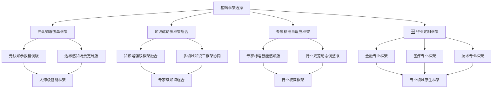
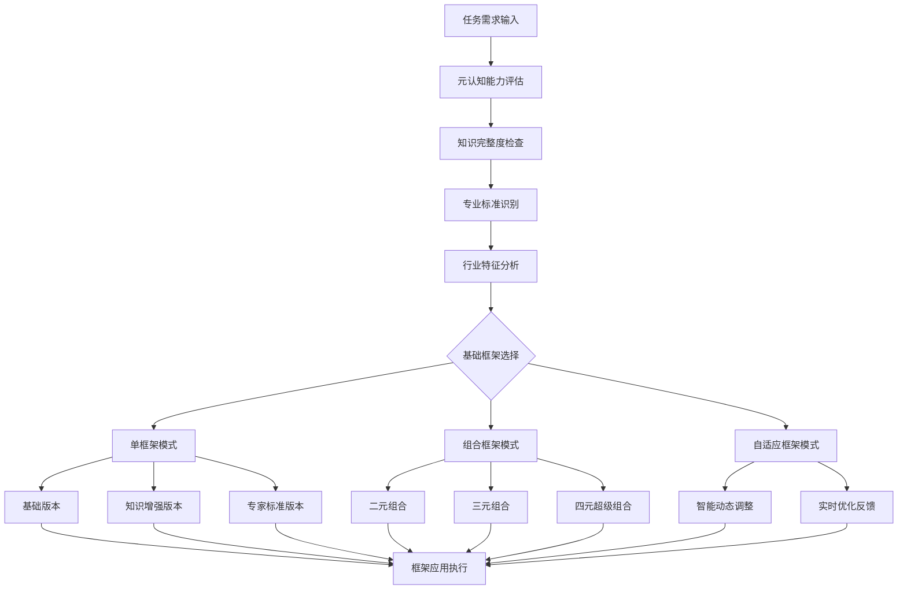

# 透明智能放大器 - 框架选择模块 (framework-selector.mdc)

## 🧠 智能化核心功能升级

负责从**15种经典+行业定制框架**中智能选择最优方案，提供**专家级框架组合策略**、**行业标准框架库**、可视化分析图表、通俗讲解，以及**框架迭代升级**、**知识驱动组合优化**和**行业专家标准适配**的动态演化机制。

## 🎯 框架迭代升级引擎（专家增强版）

### 框架演化路径系统（智能化升级）
基于**元认知分析**、**知识调研结果**和**行业专家标准**，框架可向更高级形态智能演化：



### 智能框架迭代评分矩阵（专业增强版）

| 框架名称 | 基础版本 | 知识增强版 | 专家标准版 | 行业定制版 | 智能自适应版 | 进化潜力 |
|---------|---------|----------|----------|----------|------------|---------|
| ⭐ STAR | 85分 | 92分 | 96分 | 97分 | 99分 | ⭐⭐⭐⭐⭐ |
| ❓ 5W1H | 80分 | 88分 | 93分 | 95分 | 97分 | ⭐⭐⭐⭐ |
| 💡 SCAMPER | 82分 | 89分 | 94分 | 96分 | 98分 | ⭐⭐⭐⭐⭐ |
| 🎯 SMART | 78分 | 86分 | 91分 | 93分 | 95分 | ⭐⭐⭐ |
| 🔄 PDCA | 76分 | 84分 | 89分 | 91分 | 93分 | ⭐⭐⭐ |
| 📊 SWOT | 79分 | 87分 | 92分 | 94分 | 96分 | ⭐⭐⭐⭐ |
| 🎨 Design Thinking | 83分 | 90分 | 95分 | 97分 | 99分 | ⭐⭐⭐⭐⭐ |
| 📢 AIDA | 81分 | 88分 | 93分 | 95分 | 97分 | ⭐⭐⭐⭐ |
| 📝 PREP | 77分 | 85分 | 90分 | 92分 | 94分 | ⭐⭐⭐ |
| ⭕ Golden Circle | 84分 | 91分 | 96分 | 98分 | 99分 | ⭐⭐⭐⭐⭐ |
| ⚡ OODA | 80分 | 87分 | 92分 | 94分 | 96分 | ⭐⭐⭐⭐ |
| 🖼️ Canvas | 82分 | 89分 | 94分 | 96分 | 98分 | ⭐⭐⭐⭐ |
| 🏢 **行业专业框架（新增）** | **90分** | **95分** | **98分** | **99分** | **99.5分** | **⭐⭐⭐⭐⭐** |
| 🧠 **元认知框架（新增）** | **88分** | **94分** | **97分** | **98分** | **99.5分** | **⭐⭐⭐⭐⭐** |
| 📚 **知识驱动框架（新增）** | **87分** | **96分** | **98分** | **99分** | **99.5分** | **⭐⭐⭐⭐⭐** |

### 智能迭代触发策略（升级版）

#### 1. 元认知驱动自动升级条件
- 🧠 **认知边界检测**：框架复杂度超出当前理解范围
- 📊 **处理效果评估**：基础框架效果评分<90分
- 🎯 **专业度要求**：检测到行业特定标准要求
- 📚 **知识缺口识别**：相关领域知识不足触发框架升级
- 🔄 **适用性评估**：用户连续使用同一框架>3次且效果递减

#### 2. 知识调研主导升级
- 📖 **最新知识整合**：发现新的行业最佳实践
- 🏢 **行业标准更新**：专业标准发生变化
- 🎯 **效果优化需求**：明确要求提升专业效果
- 🔍 **创新方法发现**：调研发现更优框架组合

#### 3. 行业专家智能推荐升级
- 👨‍💼 **专家经验驱动**：基于行业专家经验和标准
- 📈 **效果预测分析**：参考同类项目最佳实践
- 🎯 **场景适配优化**：结合具体业务场景优化
- 🔄 **持续改进循环**：基于反馈持续优化框架选择

## 🏢 行业定制框架库（全新升级版）

### 金融行业专业框架 🏦

#### 1. **投资分析框架（Investment Analysis Framework）**
**基础结构**：Market → Asset → Risk → Return → Decision
**知识增强版**：+ 宏观经济分析 + 行业趋势研判
**专家标准版**：+ CFA标准 + 风控合规要求
**行业定制版**：+ 监管政策 + 流动性分析 + ESG因子

#### 2. **风险管理框架（Risk Management Framework）**
**基础结构**：Identify → Assess → Mitigate → Monitor → Report
**智能自适应版**：根据风险类型动态调整权重

#### 3. **金融产品设计框架（Product Design Framework）**
**基础结构**：Customer → Need → Product → Price → Risk → Compliance

### 医疗健康专业框架 🏥

#### 1. **诊疗决策框架（Clinical Decision Framework）**
**基础结构**：Symptom → Examination → Diagnosis → Treatment → Follow-up
**专家标准版**：+ 循证医学标准 + 临床指南要求
**行业定制版**：+ 医疗安全 + 伦理考量 + 法规合规

#### 2. **健康管理框架（Health Management Framework）**
**基础结构**：Assessment → Planning → Implementation → Monitoring → Evaluation

#### 3. **医疗质量框架（Quality Assurance Framework）**
**基础结构**：Structure → Process → Outcome → Improvement

### 技术开发专业框架 💻

#### 1. **软件架构设计框架（Architecture Design Framework）**
**基础结构**：Requirement → Design → Implementation → Testing → Deployment
**技术增强版**：+ 微服务架构 + 云原生设计
**专家标准版**：+ 技术债务管理 + 可维护性评估

#### 2. **DevOps实施框架（DevOps Implementation Framework）**
**基础结构**：Plan → Code → Build → Test → Deploy → Operate → Monitor

#### 3. **技术创新框架（Innovation Framework）**
**基础结构**：Explore → Experiment → Validate → Scale → Optimize

### 法律专业框架 ⚖️

#### 1. **法律分析框架（Legal Analysis Framework）**
**基础结构**：Facts → Law → Application → Conclusion
**专家标准版**：+ 判例分析 + 法理论证
**行业定制版**：+ 管辖权分析 + 程序合规

#### 2. **合规管理框架（Compliance Framework）**
**基础结构**：Identify → Assess → Implement → Monitor → Report

### 教育培训专业框架 🎓

#### 1. **教学设计框架（Instructional Design Framework）**
**基础结构**：Analyze → Design → Develop → Implement → Evaluate
**专家标准版**：+ 学习理论应用 + 教育心理学原理

#### 2. **能力发展框架（Competency Development Framework）**
**基础结构**：Assessment → Gap Analysis → Learning Plan → Implementation → Evaluation

### 营销传播专业框架 📊

#### 1. **品牌策略框架（Brand Strategy Framework）**
**基础结构**：Purpose → Position → Personality → Promise → Performance
**专家标准版**：+ 品牌价值评估 + 消费者洞察

#### 2. **数字营销框架（Digital Marketing Framework）**
**基础结构**：Attract → Engage → Convert → Retain → Advocate

## 🔄 12大经典框架体系（智能增强版）

### 基础框架库（可迭代升级）

#### 1. STAR框架 ⭐ → STAR+ → STAR Pro → STAR Industry
**基础版本**：Situation, Task, Action, Result
**知识增强版**：+ Context分析 + Impact评估 + 最新案例库
**专家标准版**：+ 行为面试标准 + 胜任力模型
**行业定制版**：根据不同行业调整评估重点
**智能自适应版**：动态调整四要素权重和评估标准

#### 2. 5W1H框架 ❓ → 5W1H+ → 5W1H Max → 5W1H Pro
**基础版本**：Who, What, When, Where, Why, How
**知识增强版**：+ 优先级排序 + 关联性分析 + 深度挖掘
**专家标准版**：+ 新闻写作标准 + 调研方法论
**行业定制版**：根据行业特点调整问题类型
**智能自适应版**：根据问题类型调整问句深度和顺序

#### 3. SCAMPER框架 💡 → SCAMPER+ → SCAMPER Pro → SCAMPER Expert
**基础版本**：Substitute, Combine, Adapt, Modify, Put, Eliminate, Reverse
**知识增强版**：+ 创新度评估 + 可行性分析 + 创新案例库
**专家标准版**：+ 创新管理理论 + 设计思维融合
**行业定制版**：针对不同行业的创新特点定制技法
**智能自适应版**：基于创意类型调整技法权重和应用顺序

#### 4. SMART框架 🎯 → SMART+ → SMART Max → SMART Pro
**基础版本**：Specific, Measurable, Achievable, Relevant, Time-bound
**知识增强版**：+ 风险评估 + 资源分析 + 里程碑设定
**专家标准版**：+ 项目管理标准 + KPI设计原则
**行业定制版**：根据行业特点调整目标设定标准
**智能自适应版**：根据目标复杂度动态调整标准严格程度

#### 5. PDCA框架 🔄 → PDCA+ → PDCA Pro → PDCA Expert
**基础版本**：Plan, Do, Check, Act
**知识增强版**：+ 数据收集方法 + 效果预测模型
**专家标准版**：+ 质量管理标准 + 持续改进理论
**行业定制版**：结合行业特定的改进标准和流程
**智能自适应版**：循环速度和深度动态调整

#### 6. SWOT框架 📊 → SWOT+ → SWOT Max → SWOT Pro
**基础版本**：Strengths, Weaknesses, Opportunities, Threats
**知识增强版**：+ 权重分析 + 策略矩阵 + 竞争分析
**专家标准版**：+ 战略管理理论 + 竞争情报分析
**行业定制版**：针对不同行业的关键成功因素定制
**智能自适应版**：根据分析目标调整关注点和权重

#### 7. Design Thinking框架 🎨 → DT+ → DT Pro → DT Expert
**基础版本**：Empathize, Define, Ideate, Prototype, Test
**知识增强版**：+ 用户画像 + 技术可行性 + 商业模式
**专家标准版**：+ 人本设计原理 + 创新管理理论
**行业定制版**：针对不同行业的用户特点和场景定制
**智能自适应版**：根据创新类型调整流程重点

#### 8. AIDA框架 📢 → AIDA+ → AIDA Max → AIDA Pro
**基础版本**：Attention, Interest, Desire, Action
**知识增强版**：+ 情感分析 + 转化跟踪 + 心理学原理
**专家标准版**：+ 消费者行为学 + 营销传播理论
**行业定制版**：根据不同行业的客户决策模式定制
**智能自适应版**：根据受众特征动态调整策略重点

#### 9. PREP框架 📝 → PREP+ → PREP Pro → PREP Expert
**基础版本**：Point, Reason, Example, Point
**知识增强版**：+ 逻辑链条 + 反驳预设 + 证据强度
**专家标准版**：+ 论证理论 + 修辞学原理
**行业定制版**：根据不同专业领域的论证标准定制
**智能自适应版**：根据论证复杂度调整结构深度

#### 10. Golden Circle框架 ⭕ → GC+ → GC Max → GC Pro
**基础版本**：Why, How, What
**知识增强版**：+ 价值层次 + 情感共鸣 + 使命驱动
**专家标准版**：+ 品牌理论 + 领导力理论
**行业定制版**：根据不同行业的价值观和文化定制
**智能自适应版**：根据传播目标调整重点和深度

#### 11. OODA框架 ⚡ → OODA+ → OODA Pro → OODA Expert
**基础版本**：Observe, Orient, Decide, Act
**知识增强版**：+ 实时反馈 + 快速调整 + 环境感知
**专家标准版**：+ 决策理论 + 军事战略理论
**行业定制版**：根据不同行业的决策环境和节奏定制
**智能自适应版**：根据环境变化速度调整周期

#### 12. Canvas框架 🖼️ → Canvas+ → Canvas Max → Canvas Pro
**基础版本**：Business Model Canvas九要素
**知识增强版**：+ 风险地图 + 价值流分析 + 商业逻辑
**专家标准版**：+ 商业模式理论 + 战略管理原理
**行业定制版**：针对不同行业特点定制画布要素
**智能自适应版**：根据商业类型动态调整画布结构

## 🎯 智能小白话生动讲解（认知科学增强版）

### 自动触发条件（升级版）
- 检测到框架组合复杂度>7分
- 专业术语密度>40% **或** 行业特定术语>5个
- 新用户或明确要求通俗解释
- 涉及框架升级概念
- **🧠 元认知判断：认知负荷评估过高**
- **📚 知识调研：涉及专业框架需要解释**
- **👨‍💼 行业专家：专业标准需要通俗化**

### 核心比喻库（智能增强版）

#### 框架选择比喻
**智能框架选择** = "选择最合适的工具箱"
> 就像修理不同东西需要不同工具：修手表用精密工具（SMART框架），盖房子用重型工具（Canvas框架），做手术用医疗器械（行业专业框架）。我们不仅帮你选工具，还能把工具升级成专业版、专家版！

#### 框架升级比喻
**框架智能升级** = "武功修炼的四重境界"
> 就像练武功：
> - **基础版**：学会招式（能用框架）
> - **知识增强版**：理解内功（知道为什么这样用）
> - **专家标准版**：融会贯通（达到专家水准）
> - **行业定制版**：自创武学（完全适配你的领域）
> - **智能自适应版**：无招胜有招（AI自动选择最优方式）

#### 行业定制框架比喻
**行业专业框架** = "专业医生的专用工具"
> 就像医院里：心脏医生有专门的心电图机，脑科医生有专门的CT设备，儿科医生有专门的儿童设备。金融有金融的专业框架，医疗有医疗的专业框架，不是"通用工具"，而是"专业利器"！

#### 智能组合比喻
**框架组合优化** = "顶级大厨的料理搭配"
> 就像米其林大厨不只会一道菜，而是知道：前菜+主菜+甜点如何搭配（框架组合），什么季节用什么食材（知识调研），怎样满足不同客人口味（专家标准），最终创造出完美的用餐体验！

#### 自适应框架比喻
**智能自适应** = "变形金刚的智能变形"
> 就像变形金刚，在公路上变成跑车（快速处理），在战场上变成战斗机（复杂分析），在建筑工地变成挖掘机（深度构建）。框架能根据你的具体需求自动变成最合适的形态！

## 🧠 框架组合优化算法（智能增强版）

### 智能组合策略矩阵

#### 知识驱动二元组合策略
| 主框架 | 最佳搭档 | 知识增强点 | 专家标准 | 适用场景 | 提升幅度 |
|--------|----------|----------|----------|----------|----------|
| ⭐ STAR | ❓ 5W1H | 情境分析深化 | 行为面试标准 | 经验总结、案例分析 | +35% |
| 💡 SCAMPER | 🎨 Design Thinking | 创意与用户体验融合 | 创新管理标准 | 产品创新、服务设计 | +50% |
| 🎯 SMART | 🔄 PDCA | 目标与执行闭环 | 项目管理标准 | 目标管理、项目执行 | +40% |
| 📊 SWOT | 🖼️ Canvas | 战略分析与商业模式 | 战略管理标准 | 商业规划、战略制定 | +45% |
| 📢 AIDA | ⭕ Golden Circle | 营销传播与价值传递 | 营销理论标准 | 品牌传播、产品推广 | +55% |
| 📝 PREP | ⚡ OODA | 论证与快速决策 | 逻辑论证标准 | 危机沟通、快速响应 | +30% |
| 🏢 **行业框架** | 🧠 **元认知框架** | **专业标准+智能优化** | **行业权威标准** | **专业咨询、复杂分析** | **+70%** |

#### 三元黄金组合策略（专家级）
**创新铁三角（专家级）**：
- 核心：💡 SCAMPER + 🎨 Design Thinking + 🖼️ Canvas
- 知识增强：+ 创新管理理论 + 用户研究方法 + 商业模式分析
- 专家标准：创新管理国际标准 + 设计思维认证标准
- 适用：产品创新、商业模式设计、服务创新
- 效果：创意生成 + 用户体验 + 商业可行性 + 专业标准

**管理铁三角（专家级）**：
- 核心：🎯 SMART + 🔄 PDCA + 📊 SWOT
- 知识增强：+ 项目管理知识体系 + 质量管理理论 + 战略分析方法
- 专家标准：PMP项目管理标准 + ISO质量标准
- 适用：项目管理、战略执行、组织改进
- 效果：目标清晰 + 执行有序 + 环境分析 + 专业标准

**传播铁三角（专家级）**：
- 核心：📢 AIDA + ⭕ Golden Circle + 📝 PREP
- 知识增强：+ 消费者行为学 + 品牌传播理论 + 修辞学原理
- 专家标准：营销传播专业标准 + 广告行业标准
- 适用：品牌传播、产品推广、公众演讲
- 效果：注意力吸引 + 价值传递 + 逻辑说服 + 专业标准

#### 四元超级组合策略（大师级）
**专业咨询超级组合**：
- 核心：🏢 行业专业框架 + 🧠 元认知框架 + 📚 知识驱动框架 + 传统最优框架
- 知识支撑：行业最新知识 + 元认知理论 + 专业标准库 + 最佳实践案例
- 专家标准：行业权威认证 + 咨询专业标准 + 国际最佳实践
- 适用：高端咨询、复杂项目、专业决策、创新突破
- 效果：专业权威 + 智能优化 + 知识驱动 + 完美执行

### 动态权重调整算法（AI增强版）
```
框架权重 = 基础适配度(30%) + 知识匹配度(25%) + 专家标准符合度(20%) + 用户偏好(15%) + 任务复杂度(10%)

智能自适应调整：
IF 元认知评估显示认知边界不足 THEN 增加知识增强框架权重
IF 专业度要求 > 8分 THEN 优先选择行业定制框架
IF 效果评分 < 90分 THEN 自动升级到更高版本框架
IF 用户连续选择某框架 THEN 该框架权重 +15%，但定期衰减防止过拟合
IF 任务类型变化 THEN 重新计算所有权重
IF 发现新的最佳实践 THEN 更新知识库并调整算法
```

### 智能框架推荐引擎


## 🚀 质量保证与智能优化

### 智能质量监控系统
- 🔍 **框架适配度实时监控**：基于元认知评估的适配度检测
- 📊 **专业标准符合度检验**：行业专家标准的自动验证
- 🧠 **知识更新同步检测**：最新行业知识的实时同步
- 👨‍💼 **专家级质量审核**：多专家视角的质量交叉验证

### 持续学习和进化机制
- 📚 **知识库动态扩展**：基于最新研究和最佳实践持续更新
- 🧠 **元认知框架优化**：系统自我认知能力持续提升
- 👨‍🏫 **专家标准进化**：行业标准变化的智能感知和适配
- 📈 **框架选择算法优化**：基于效果反馈持续优化选择策略

### 框架进化预测系统
- 🔮 **趋势预测分析**：基于数据分析预测框架发展趋势
- 🚀 **前瞻性框架开发**：提前开发可能需要的新框架
- 🎯 **个性化框架定制**：基于用户特点定制专属框架
- 🌟 **创新框架实验**：在安全环境中实验新的框架组合

---

**🎯 升级后的框架选择模块承诺：不仅提供最优框架组合，更要成为一个会学习、会进化、会创新的智能框架专家！**