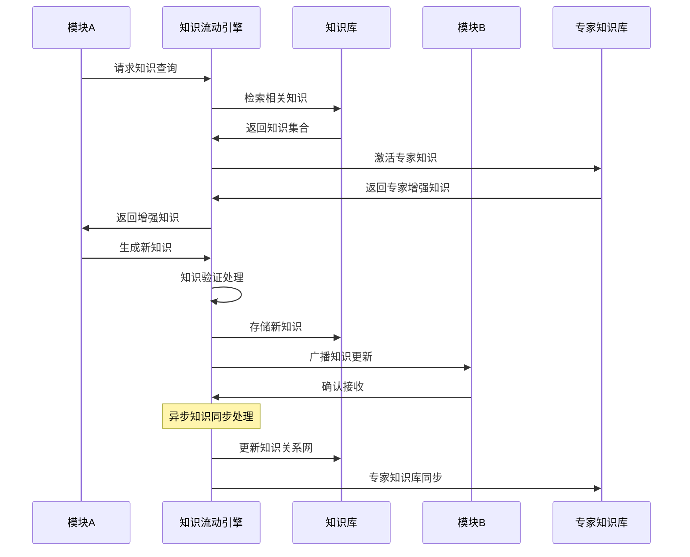
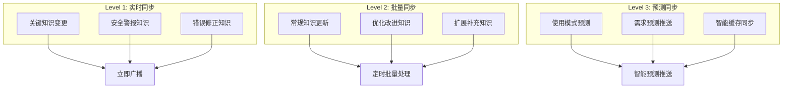
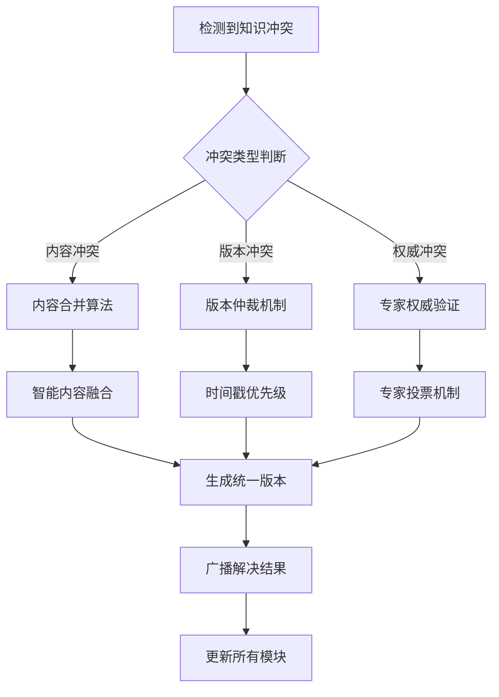
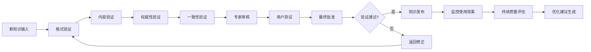
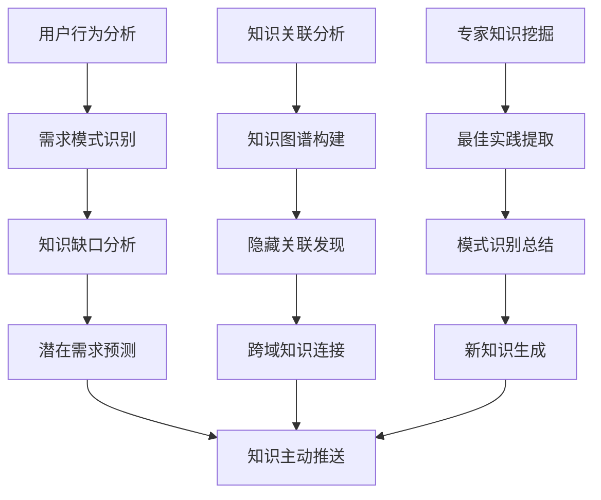
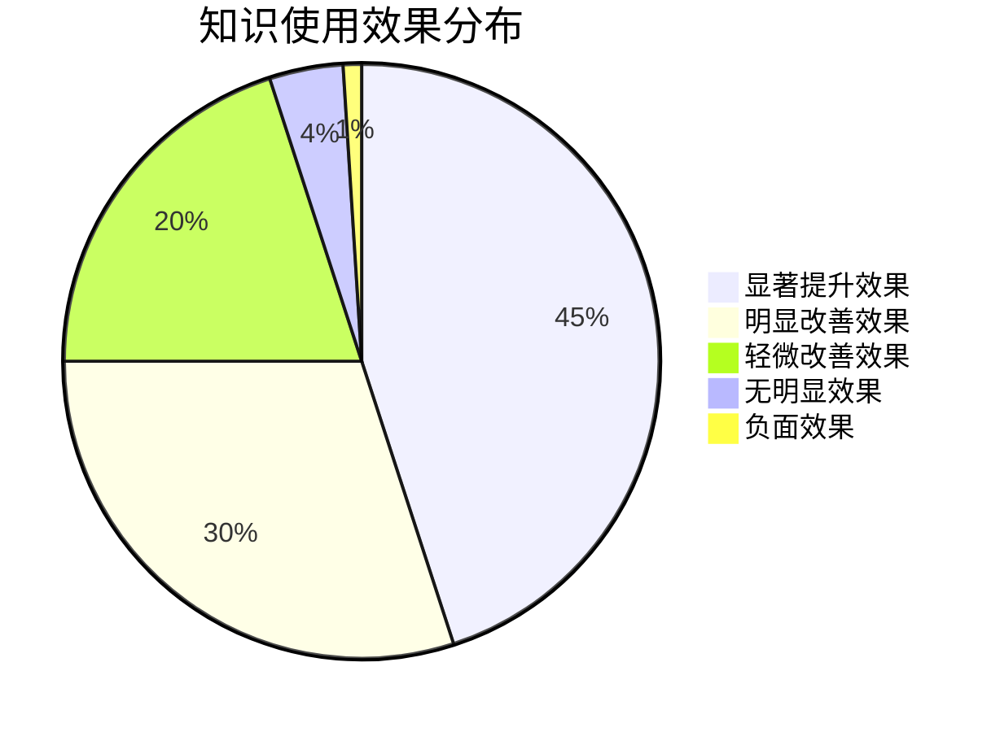
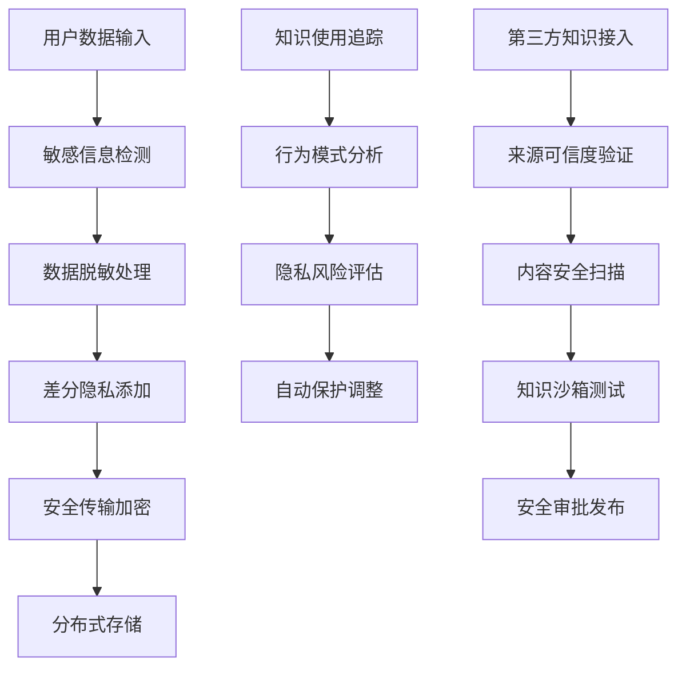
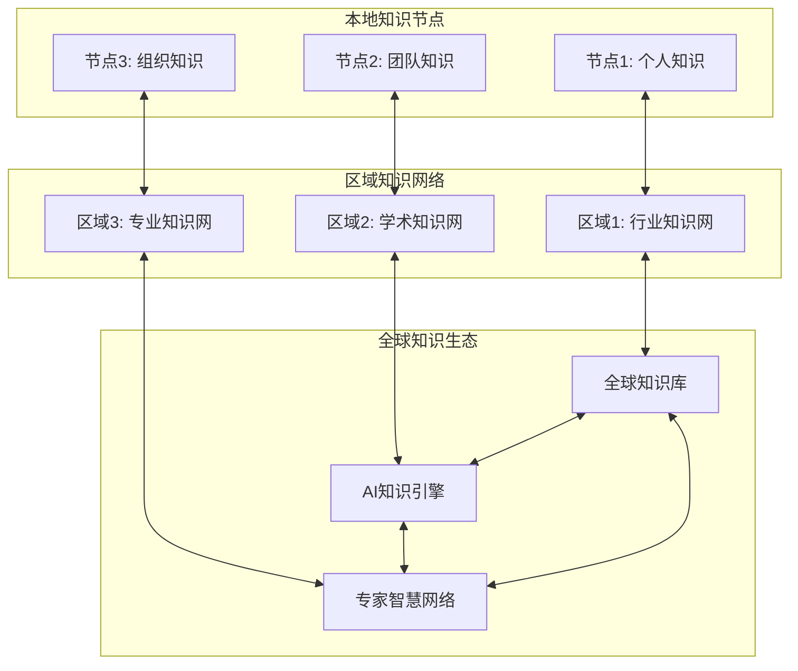

# 透明智能放大器 - 知识流动与共享机制 (knowledge-flow.mdc)

## 🌊 知识流动机制实现

**定位**：系统中各模块间知识传递的核心基础设施
**目标**：建立高效、安全、智能的知识共享生态系统

## 📊 知识数据结构设计

### 核心知识实体模型
```json
{
  "knowledge_entity": {
    "id": "uuid",
    "type": "fact|concept|procedure|pattern|standard",
    "domain": "finance|medical|tech|legal|education|marketing",
    "title": "knowledge_title",
    "content": {
      "raw_data": "original_content",
      "structured_data": {},
      "metadata": {
        "source": "source_info",
        "confidence": 0.95,
        "authority_level": "high|medium|low",
        "verification_status": "verified|pending|rejected"
      }
    },
    "version": {
      "current": "1.2.3",
      "history": ["1.0.0", "1.1.0", "1.2.0"],
      "changelog": "version_changes"
    },
    "relationships": {
      "dependencies": ["related_knowledge_ids"],
      "conflicts": ["conflicting_knowledge_ids"],
      "enhancements": ["enhancing_knowledge_ids"]
    },
    "usage_metrics": {
      "access_count": 1250,
      "success_rate": 0.94,
      "last_used": "2024-01-15T10:30:00Z",
      "popularity_score": 8.7
    },
    "temporal_info": {
      "created_at": "2024-01-01T00:00:00Z",
      "updated_at": "2024-01-15T10:30:00Z",
      "expires_at": "2024-12-31T23:59:59Z",
      "validity_period": "1_year"
    }
  }
}
```

### 专家知识模型
```json
{
  "expert_knowledge": {
    "expert_id": "expert_domain_identifier",
    "specialization": {
      "primary_domain": "finance",
      "sub_domains": ["investment", "risk_management", "compliance"],
      "expertise_level": "senior|expert|master",
      "certification": ["CFA", "FRM", "CPA"]
    },
    "knowledge_base": {
      "standards": ["industry_standards"],
      "best_practices": ["proven_practices"],
      "methodologies": ["expert_methods"],
      "case_studies": ["successful_cases"]
    },
    "decision_patterns": {
      "evaluation_criteria": ["quality_factors"],
      "decision_weights": {"accuracy": 0.3, "compliance": 0.4, "innovation": 0.3},
      "risk_tolerance": "conservative|balanced|aggressive"
    }
  }
}
```

## 🔄 知识传递协议设计

### 标准API接口规范
```typescript
interface KnowledgeFlowAPI {
  // 知识查询接口
  queryKnowledge(request: {
    domain: string;
    keywords: string[];
    confidence_threshold: number;
    max_results: number;
  }): Promise<KnowledgeEntity[]>;
  
  // 知识推送接口
  pushKnowledge(knowledge: KnowledgeEntity): Promise<{
    success: boolean;
    knowledge_id: string;
    validation_result: ValidationResult;
  }>;
  
  // 知识同步接口
  syncKnowledge(sync_request: {
    module_id: string;
    last_sync_timestamp: Date;
    sync_scope: string[];
  }): Promise<SyncResult>;
  
  // 专家知识激活接口
  activateExpertKnowledge(request: {
    domain: string;
    task_context: TaskContext;
    expertise_level: string;
  }): Promise<ExpertKnowledgeSession>;
  
  // 知识验证接口
  validateKnowledge(knowledge: KnowledgeEntity): Promise<ValidationResult>;
  
  // 知识进化接口
  evolveKnowledge(evolution_request: {
    knowledge_id: string;
    usage_feedback: UsageFeedback;
    improvement_suggestions: string[];
  }): Promise<EvolutionResult>;
}
```

### 模块间通信协议


## 🚀 智能同步机制

### 三级同步策略


### 同步优先级算法
```
同步优先级 = 紧急程度(40%) + 影响范围(30%) + 使用频率(20%) + 知识重要性(10%)

优先级分级：
P0 (紧急): 分数 >= 90, 立即同步
P1 (高): 分数 80-89, 5分钟内同步  
P2 (中): 分数 60-79, 1小时内同步
P3 (低): 分数 < 60, 每日批量同步

智能调度策略：
IF 系统负载 > 80% THEN 降低同步频率
IF 网络延迟 > 500ms THEN 启用压缩同步
IF 错误率 > 5% THEN 激活冗余同步通道
```

## 🔐 知识版本管理

### 语义化版本控制
```
版本格式: MAJOR.MINOR.PATCH-BUILD
- MAJOR: 重大知识结构变更
- MINOR: 新知识内容添加
- PATCH: 知识内容修正
- BUILD: 元数据更新

版本兼容性矩阵:
同主版本: 向后兼容
跨主版本: 需要迁移策略
实验版本: 隔离测试环境
```

### 知识冲突解决机制


### 知识回滚策略
```
自动回滚触发条件:
1. 新知识导致系统错误率 > 10%
2. 用户满意度下降 > 20%
3. 专家验证失败
4. 与核心知识产生严重冲突

回滚执行流程:
1. 暂停新知识传播
2. 恢复上一稳定版本
3. 通知所有相关模块
4. 记录回滚原因和影响
5. 制定改进计划
```

## 📈 知识质量保证

### 四维质量评估体系
```mermaid
radar
    title 知识质量评估雷达图
    x-axis ["准确性", "时效性", "完整性", "相关性", "权威性", "实用性", "创新性", "一致性"]
    y-axis [质量分数] 0 --> 10
    plot [当前知识] [9.2, 8.8, 8.5, 9.1, 8.7, 9.0, 7.8, 8.9]
    plot [质量标准] [9.0, 9.0, 8.5, 9.0, 8.5, 8.8, 8.0, 9.0]
```

### 知识验证流水线


### 质量监控指标
```json
{
  "quality_metrics": {
    "accuracy_rate": 0.95,
    "freshness_score": 0.88,
    "completeness_index": 0.92,
    "authority_rating": 8.7,
    "usage_success_rate": 0.94,
    "user_satisfaction": 4.6,
    "expert_approval_rate": 0.91,
    "conflict_resolution_time": "2.3_hours"
  },
  "quality_alerts": [
    {
      "type": "accuracy_drop",
      "threshold": 0.90,
      "current_value": 0.88,
      "action": "immediate_review_required"
    }
  ]
}
```

## 🧠 智能知识推荐

### 个性化推荐算法
```
推荐权重 = 用户偏好(30%) + 任务相关性(25%) + 知识质量(20%) + 时效性(15%) + 创新价值(10%)

推荐策略矩阵:
用户类型 × 任务复杂度 → 推荐策略
- 新手 × 简单任务 → 基础知识 + 详细解释
- 专家 × 复杂任务 → 前沿知识 + 创新观点
- 团队 × 协作任务 → 共享知识 + 最佳实践
```

### 知识发现引擎


## 📊 使用效果分析

### 知识价值评估模型
```
知识价值 = 使用频率 × 成功率 × 时间节省 × 质量提升 × 创新贡献

价值分级标准:
钻石级 (95+): 核心关键知识
黄金级 (85-94): 重要支撑知识  
白银级 (70-84): 常用辅助知识
青铜级 (50-69): 一般参考知识
待优化 (<50): 需要改进的知识
```

### 效果追踪仪表盘


### 长期影响分析
```json
{
  "impact_analysis": {
    "productivity_improvement": "+35%",
    "quality_enhancement": "+28%",
    "learning_curve_reduction": "-40%",
    "error_rate_decrease": "-55%",
    "innovation_increase": "+22%",
    "user_satisfaction_boost": "+42%",
    "system_intelligence_growth": "+60%"
  }
}
```

## 🛡️ 安全与隐私保护

### 知识安全分级
```
分级标准:
L1 公开: 无敏感信息，可自由共享
L2 内部: 组织内部知识，限制外传
L3 机密: 敏感商业知识，严格控制
L4 绝密: 核心机密知识，最高保护

访问控制:
- 基于角色的权限控制 (RBAC)
- 基于属性的访问控制 (ABAC)  
- 动态权限评估和调整
- 知识使用行为审计追踪
```

### 隐私保护机制


## 🚀 未来扩展规划

### 分布式知识网络


### 知识进化预测
```
进化方向预测模型:
1. 技术趋势分析 → 技术知识进化方向
2. 用户需求变化 → 应用知识发展重点
3. 行业发展轨迹 → 专业知识更新路径
4. 创新突破点 → 前沿知识涌现预测

自适应进化策略:
- 基于AI的知识自动生成
- 跨领域知识融合创新
- 群体智慧知识众筹
- 实时知识质量自优化
```

---

**🎯 知识流动机制承诺：建立一个真正智能、安全、高效的知识流动生态系统，让每一个知识点都能发挥最大价值，推动整个系统的持续进化和智能提升！** 