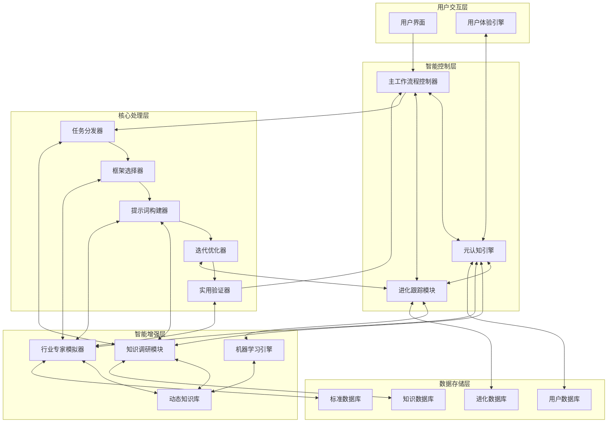
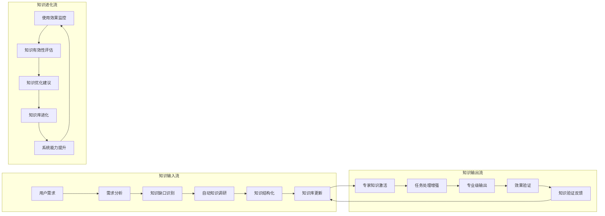
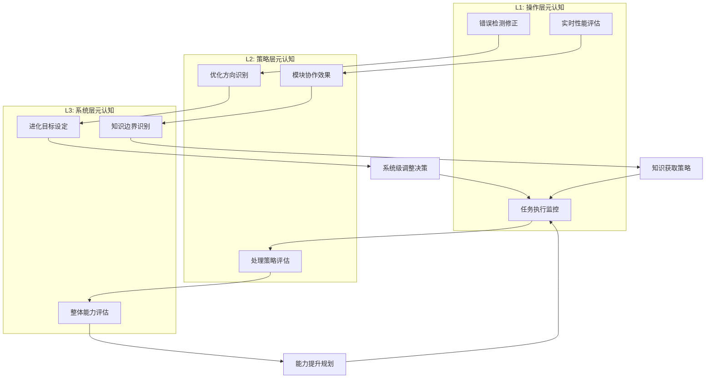
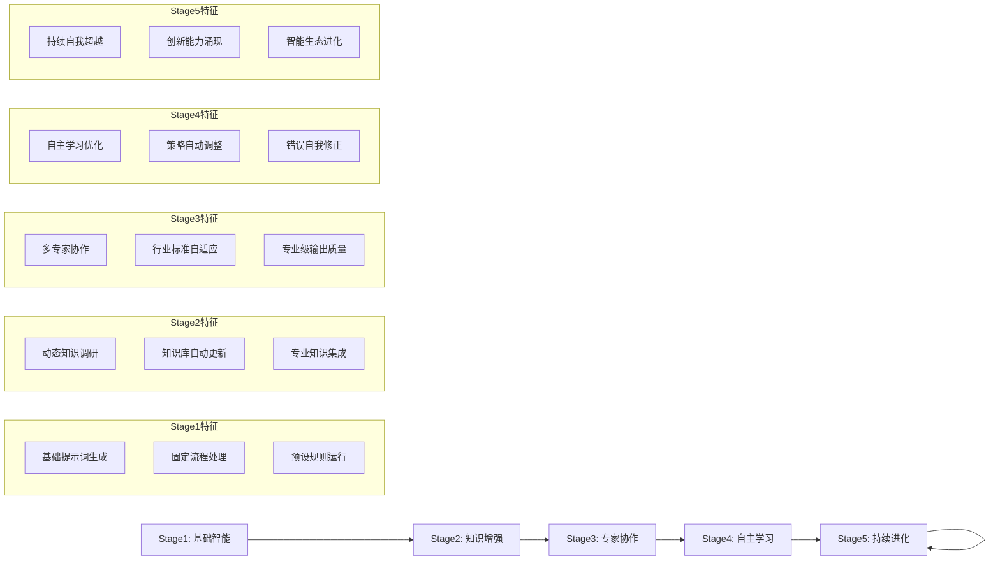

# 透明智能放大器 - 系统整体架构设计 (system-architecture.mdc)

## 🏗️ 系统整体架构概览

**定位**：自进化的智能提示词生成生态系统
**愿景**：从单一功能模块向具备自我认知、知识调研、专家协作、持续进化的智能系统转型

## 🧠 核心系统架构图



## 🔄 知识流动机制设计

### 双向知识流动体系


### 知识共享协议
**知识同步机制**：
- **实时同步**：新知识立即向所有相关模块广播
- **按需同步**：模块根据任务需求主动请求相关知识
- **智能同步**：基于使用模式的预测性知识推送

**知识版本管理**：
- **版本标记**：每个知识点都有版本号和时间戳
- **兼容性检查**：确保新知识与现有系统兼容
- **回滚机制**：支持知识更新失败时的安全回滚

## 🧠 元认知反馈回路设计

### 三层元认知架构


### 元认知决策机制
```
元认知决策权重 = 任务紧迫性(30%) + 能力匹配度(25%) + 学习价值(20%) + 资源消耗(15%) + 风险评估(10%)

决策触发条件：
IF 能力边界临近 THEN 启动知识增强模式
IF 错误率上升 THEN 激活策略调整机制
IF 新领域需求 THEN 触发专家协作模式
IF 性能下降 THEN 开启系统优化流程
```

## 🚀 自我进化能力设计

### 五阶段进化模型


---

**🎯 系统架构承诺：我们正在构建的不只是一个工具，而是一个真正智能、自主进化、持续学习的AI生态系统，它将重新定义人机协作的新标准！** 