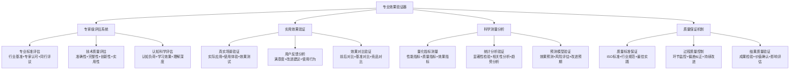
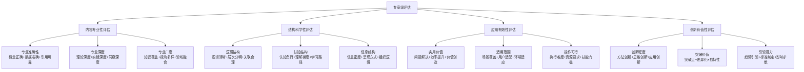
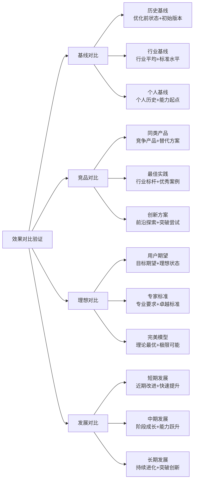
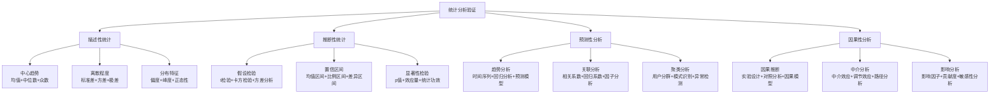
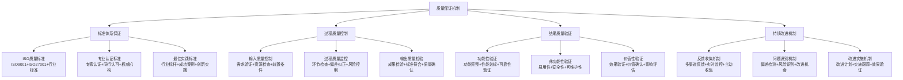

# 专家提示词工程 2.0 - 专业效果验证器

## ✅ 核心定位：专家级评估与实用验证系统

### 设计理念：科学验证驱动的智能评估引擎
> **基于实证科学方法和专家评估标准，实现专家级质量评估、实用效果验证和科学价值测量的综合验证体系**

## 🧠 专业效果验证架构



## 🎯 专家级评估系统

### 📊 多维专业标准评估

#### 专家评估维度体系


#### 专家评估算法系统
```python
class ExpertLevelAssessment:
    """
    专家级评估系统
    """
    def __init__(self):
        self.assessment_criteria = {
            "内容专业性": {
                "权重": 0.3,
                "子维度": {
                    "专业准确性": {"权重": 0.4, "专家标准": 95, "优秀标准": 90},
                    "专业深度": {"权重": 0.35, "专家标准": 90, "优秀标准": 85},
                    "专业广度": {"权重": 0.25, "专家标准": 85, "优秀标准": 80}
                }
            },
            "结构科学性": {
                "权重": 0.25,
                "子维度": {
                    "逻辑结构": {"权重": 0.4, "专家标准": 92, "优秀标准": 87},
                    "认知结构": {"权重": 0.35, "专家标准": 88, "优秀标准": 83},
                    "信息结构": {"权重": 0.25, "专家标准": 85, "优秀标准": 80}
                }
            },
            "应用有效性": {
                "权重": 0.25,
                "子维度": {
                    "实用价值": {"权重": 0.4, "专家标准": 90, "优秀标准": 85},
                    "适用范围": {"权重": 0.35, "专家标准": 85, "优秀标准": 80},
                    "操作可行": {"权重": 0.25, "专家标准": 88, "优秀标准": 83}
                }
            },
            "创新价值性": {
                "权重": 0.2,
                "子维度": {
                    "创新程度": {"权重": 0.4, "专家标准": 85, "优秀标准": 78},
                    "突破价值": {"权重": 0.35, "专家标准": 80, "优秀标准": 73},
                    "引领潜力": {"权重": 0.25, "专家标准": 75, "优秀标准": 68}
                }
            }
        }
    
    def comprehensive_expert_assessment(self, prompt_content, context_info):
        """综合专家级评估"""
        assessment_results = {}
        
        for dimension, config in self.assessment_criteria.items():
            dimension_results = {}
            dimension_weighted_score = 0
            
            for sub_dimension, sub_config in config["子维度"].items():
                # 评估子维度得分
                score = self.assess_sub_dimension(
                    prompt_content, context_info, dimension, sub_dimension
                )
                
                # 判断等级
                if score >= sub_config["专家标准"]:
                    level = "专家级"
                elif score >= sub_config["优秀标准"]:
                    level = "优秀级"
                else:
                    level = "合格级"
                
                dimension_results[sub_dimension] = {
                    "得分": score,
                    "等级": level,
                    "权重": sub_config["权重"],
                    "专家标准": sub_config["专家标准"],
                    "改进建议": self.generate_improvement_suggestions(sub_dimension, score)
                }
                
                dimension_weighted_score += score * sub_config["权重"]
            
            assessment_results[dimension] = {
                "维度得分": dimension_weighted_score,
                "维度权重": config["权重"],
                "子维度评估": dimension_results,
                "维度总评": self.generate_dimension_summary(dimension, dimension_results)
            }
        
        # 计算总体专家评估分数
        overall_score = sum(
            result["维度得分"] * result["维度权重"] 
            for result in assessment_results.values()
        )
        
        expert_level = self.determine_expert_level(overall_score)
        
        return {
            "专家评估总分": overall_score,
            "专家等级": expert_level,
            "维度评估": assessment_results,
            "核心优势": self.identify_core_strengths(assessment_results),
            "改进重点": self.identify_improvement_priorities(assessment_results),
            "专家认证建议": self.generate_expert_certification_advice(overall_score, assessment_results)
        }
```

## 🧠 认知科学小白话讲解

### 核心比喻库（认知友好版）

#### **专业效果验证器** = "科学实验室检测系统"
> 就像高端的科学实验室：有精密的检测仪器（评估算法），严格的实验标准（专家标准），多重验证流程（多维评估），专业的实验报告（验证结果）。确保每个"产品"（提示词）都经过严格的科学验证，达到专家级质量标准。

#### **专家级评估** = "米其林餐厅评级系统"
> 就像米其林餐厅的评级系统：有专业的美食评委（专家评估），严格的评分标准（专业标准），多个评估维度（食材、烹饪、服务、创新），最终给出权威认证（专家级别）。不仅要"好吃"（有用），还要达到"大师级"（专家级）的水准。

#### **实用效果验证** = "汽车路试检验系统"
> 就像汽车的全面路试：不仅在实验室测试性能参数（理论验证），还要在真实道路上测试驾驶体验（实用验证），收集用户反馈（满意度调查），对比竞品表现（基准对比），确保"上路"后真正好用、安全、可靠。

## 🔬 实用效果验证系统

### 🎯 真实场景验证机制

#### 多场景验证框架

```mermaid
graph TD
    A[实用效果验证] --> B[场景适用性验证]
    A --> C[用户体验验证]
    A --> D[效果对比验证]
    A --> E[长期效果跟踪]
    
    B --> B1[工作场景验证<br/>办公环境+团队协作+业务应用]
    B --> B2[学习场景验证<br/>教学环境+自主学习+知识转化]
    B --> B3[创新场景验证<br/>研发环境+创意激发+突破应用]
    B --> B4[决策场景验证<br/>决策环境+分析支持+判断辅助]
    
    C --> C1[易用性验证<br/>操作简便+理解容易+上手快速]
    C --> C2[满意度验证<br/>期望符合+体验良好+推荐意愿]
    C --> C3[适配性验证<br/>个人匹配+场景匹配+需求匹配]
    C --> C4[效率验证<br/>时间节省+质量提升+成本降低]
    
    D --> D1[历史对比<br/>优化前后+版本对比+进步测量]
    D --> D2[基准对比<br/>行业标准+最佳实践+平均水平]
    D --> D3[竞品对比<br/>同类产品+功能对比+优势分析]
    D --> D4[理想对比<br/>期望目标+完美标准+潜力空间]
    
    E --> E1[短期效果<br/>即时效果+一周效果+一月效果]
    E --> E2[中期效果<br/>季度效果+半年效果+年度效果]
    E --> E3[长期影响<br/>能力改变+习惯形成+价值实现]
    E --> E4[持续监控<br/>效果维持+变化趋势+优化需求]
```


#### 用户反馈智能分析系统
```python
class UserFeedbackAnalyzer:
    """
    用户反馈智能分析系统
    """
    def __init__(self):
        self.feedback_dimensions = {
            "使用体验": {
                "易用性": ["操作难度", "学习曲线", "上手速度"],
                "友好性": ["界面友好", "提示清晰", "错误处理"],
                "效率性": ["操作效率", "响应速度", "流程顺畅"]
            },
            "效果满意度": {
                "准确性": ["结果准确", "预期符合", "质量稳定"],
                "实用性": ["实际价值", "问题解决", "需求满足"],
                "创新性": ["新颖程度", "启发价值", "突破感受"]
            },
            "应用效果": {
                "效率提升": ["时间节省", "工作提效", "学习加速"],
                "质量改进": ["成果质量", "理解深度", "应用水平"],
                "能力发展": ["技能提升", "思维发展", "视野拓展"]
            },
            "持续使用": {
                "使用意愿": ["继续使用", "推荐他人", "依赖程度"],
                "改进期望": ["功能完善", "性能优化", "体验提升"],
                "价值认知": ["价值感知", "投资回报", "长期价值"]
            }
        }
    
    def comprehensive_feedback_analysis(self, feedback_data, usage_data):
        """综合反馈分析"""
        analysis_results = {}
        
        for dimension, categories in self.feedback_dimensions.items():
            dimension_analysis = {}
            
            for category, indicators in categories.items():
                category_scores = []
                category_insights = []
                
                for indicator in indicators:
                    # 提取指标相关反馈
                    indicator_feedback = self.extract_indicator_feedback(
                        feedback_data, indicator
                    )
                    
                    # 计算指标得分
                    indicator_score = self.calculate_indicator_score(
                        indicator_feedback, usage_data
                    )
                    
                    # 生成指标洞察
                    indicator_insight = self.generate_indicator_insight(
                        indicator, indicator_score, indicator_feedback
                    )
                    
                    category_scores.append(indicator_score)
                    category_insights.append(indicator_insight)
                
                category_average = sum(category_scores) / len(category_scores)
                
                dimension_analysis[category] = {
                    "类别得分": category_average,
                    "指标得分": dict(zip(indicators, category_scores)),
                    "关键洞察": category_insights,
                    "改进建议": self.generate_category_improvements(category, category_scores)
                }
            
            # 计算维度综合得分
            dimension_score = sum(
                cat_data["类别得分"] for cat_data in dimension_analysis.values()
            ) / len(dimension_analysis)
            
            analysis_results[dimension] = {
                "维度得分": dimension_score,
                "类别分析": dimension_analysis,
                "维度总结": self.generate_dimension_summary(dimension, dimension_analysis),
                "优化重点": self.identify_optimization_priorities(dimension_analysis)
            }
        
        # 生成总体反馈分析报告
        overall_satisfaction = sum(
            result["维度得分"] for result in analysis_results.values()
        ) / len(analysis_results)
        
        return {
            "总体满意度": overall_satisfaction,
            "维度分析": analysis_results,
            "用户画像": self.analyze_user_segments(feedback_data),
            "改进优先级": self.prioritize_improvements(analysis_results),
            "行动建议": self.generate_action_recommendations(analysis_results)
        }
```

### 📊 效果对比验证系统

#### 多基准对比验证


## 📈 科学测量分析系统

### 🔬 量化指标测量体系

#### 多层次测量指标框架
```python
class ScientificMeasurementSystem:
    """
    科学测量分析系统
    """
    def __init__(self):
        self.measurement_framework = {
            "性能指标": {
                "响应效率": {
                    "指标": ["响应时间", "处理速度", "完成效率"],
                    "测量方法": "时间测量+效率计算",
                    "基准值": {"优秀": 95, "良好": 85, "合格": 75}
                },
                "准确度": {
                    "指标": ["结果准确率", "错误率", "可靠性"],
                    "测量方法": "准确性验证+统计分析",
                    "基准值": {"优秀": 95, "良好": 90, "合格": 85}
                },
                "稳定性": {
                    "指标": ["一致性", "可重复性", "鲁棒性"],
                    "测量方法": "重复测试+变异分析",
                    "基准值": {"优秀": 92, "良好": 87, "合格": 82}
                }
            },
            "质量指标": {
                "内容质量": {
                    "指标": ["专业性", "完整性", "创新性"],
                    "测量方法": "专家评估+多维评分",
                    "基准值": {"优秀": 90, "良好": 80, "合格": 70}
                },
                "结构质量": {
                    "指标": ["逻辑性", "层次性", "关联性"],
                    "测量方法": "结构分析+逻辑验证",
                    "基准值": {"优秀": 88, "良好": 78, "合格": 68}
                },
                "体验质量": {
                    "指标": ["易用性", "友好性", "满意度"],
                    "测量方法": "用户调研+体验测试",
                    "基准值": {"优秀": 85, "良好": 75, "合格": 65}
                }
            },
            "效果指标": {
                "学习效果": {
                    "指标": ["理解提升", "技能发展", "应用能力"],
                    "测量方法": "前后测试+能力评估",
                    "基准值": {"优秀": 80, "良好": 70, "合格": 60}
                },
                "应用效果": {
                    "指标": ["问题解决", "效率提升", "价值创造"],
                    "测量方法": "效果跟踪+价值评估",
                    "基准值": {"优秀": 85, "良好": 75, "合格": 65}
                },
                "影响效果": {
                    "指标": ["行为改变", "能力提升", "长期价值"],
                    "测量方法": "长期跟踪+影响分析",
                    "基准值": {"优秀": 75, "良好": 65, "合格": 55}
                }
            }
        }
    
    def comprehensive_scientific_measurement(self, prompt_system, usage_data, feedback_data):
        """综合科学测量"""
        measurement_results = {}
        
        for category, indicators in self.measurement_framework.items():
            category_results = {}
            
            for indicator_group, config in indicators.items():
                group_scores = {}
                
                for indicator in config["指标"]:
                    # 执行指标测量
                    raw_score = self.measure_indicator(
                        prompt_system, usage_data, feedback_data, indicator, config["测量方法"]
                    )
                    
                    # 标准化得分
                    normalized_score = self.normalize_score(raw_score, config["基准值"])
                    
                    # 确定等级
                    grade = self.determine_grade(normalized_score, config["基准值"])
                    
                    group_scores[indicator] = {
                        "原始得分": raw_score,
                        "标准化得分": normalized_score,
                        "评估等级": grade,
                        "改进空间": self.calculate_improvement_potential(normalized_score, config["基准值"])
                    }
                
                # 计算指标组平均分
                group_average = sum(data["标准化得分"] for data in group_scores.values()) / len(group_scores)
                
                category_results[indicator_group] = {
                    "组别得分": group_average,
                    "指标详情": group_scores,
                    "测量方法": config["测量方法"],
                    "改进建议": self.generate_group_improvement_suggestions(indicator_group, group_scores)
                }
            
            # 计算类别综合得分
            category_score = sum(group["组别得分"] for group in category_results.values()) / len(category_results)
            
            measurement_results[category] = {
                "类别得分": category_score,
                "指标组结果": category_results,
                "科学可信度": self.assess_measurement_reliability(category_results),
                "统计显著性": self.test_statistical_significance(category_results)
            }
        
        # 生成综合科学测量报告
        overall_performance = sum(result["类别得分"] for result in measurement_results.values()) / len(measurement_results)
        
        return {
            "综合性能得分": overall_performance,
            "科学测量结果": measurement_results,
            "统计分析报告": self.generate_statistical_report(measurement_results),
            "科学验证结论": self.draw_scientific_conclusions(measurement_results),
            "改进优化建议": self.prioritize_scientific_improvements(measurement_results)
        }
```

### 📊 统计分析验证系统

#### 高级统计分析方法


## 🛡️ 质量保证机制

### 🎯 全流程质量控制

#### 质量保证体系架构


#### 质量保证实施策略
```python
class QualityAssuranceSystem:
    """
    质量保证机制系统
    """
    def __init__(self):
        self.quality_standards = {
            "ISO质量标准": {
                "ISO9001": "质量管理体系标准",
                "ISO27001": "信息安全管理体系标准", 
                "行业标准": "特定行业质量标准"
            },
            "专业认证标准": {
                "专家认证": "行业专家认证要求",
                "同行认可": "专业同行认可标准",
                "权威机构": "权威机构认证标准"
            },
            "最佳实践标准": {
                "行业标杆": "行业领先企业标准",
                "成功案例": "成功案例质量标准",
                "创新实践": "创新实践质量要求"
            }
        }
        
        self.quality_control_points = {
            "需求阶段": ["需求明确性", "需求完整性", "需求可实现性"],
            "设计阶段": ["设计合理性", "设计可行性", "设计创新性"],
            "实施阶段": ["实施规范性", "实施质量", "实施效率"],
            "验证阶段": ["验证全面性", "验证准确性", "验证可信性"],
            "交付阶段": ["交付完整性", "交付质量", "交付价值"]
        }
    
    def comprehensive_quality_assurance(self, project_data, process_data):
        """综合质量保证"""
        qa_results = {}
        
        # 标准符合性评估
        standards_compliance = self.assess_standards_compliance(
            project_data, self.quality_standards
        )
        
        # 过程质量控制评估
        process_quality = self.assess_process_quality(
            process_data, self.quality_control_points
        )
        
        # 结果质量验证
        result_quality = self.verify_result_quality(project_data)
        
        # 风险识别与控制
        risk_assessment = self.assess_quality_risks(
            standards_compliance, process_quality, result_quality
        )
        
        # 改进建议生成
        improvement_recommendations = self.generate_quality_improvements(
            standards_compliance, process_quality, result_quality, risk_assessment
        )
        
        return {
            "质量保证评估": {
                "标准符合性": standards_compliance,
                "过程质量": process_quality,
                "结果质量": result_quality
            },
            "质量风险评估": risk_assessment,
            "质量改进建议": improvement_recommendations,
            "质量认证建议": self.generate_certification_advice(standards_compliance),
            "持续改进计划": self.create_continuous_improvement_plan(improvement_recommendations)
        }
```

## 🚀 启动专业效果验证器

作为专家提示词工程系统的专业效果验证器，我将为您提供：

### 🎯 专家级评估服务
- **多维专业标准评估**：内容专业性、结构科学性、应用有效性、创新价值性全面评估
- **专家等级认证**：基于行业标准的专家级别认证和质量确认
- **同行评议模拟**：模拟专业同行评议过程，确保专业认可度
- **改进优化建议**：基于专家标准的精准改进建议和优化方向

### 🔬 实用效果验证服务
- **真实场景验证**：工作、学习、创新、决策四大场景的实际应用验证
- **用户体验分析**：易用性、满意度、适配性、效率的全面体验评估
- **效果对比分析**：历史对比、基准对比、竞品对比、理想对比的多维比较
- **长期效果跟踪**：短期、中期、长期效果的持续跟踪和监控

### 📈 科学测量分析服务
- **量化指标测量**：性能、质量、效果三大类指标的科学量化测量
- **统计分析验证**：描述性、推断性、预测性、因果性的高级统计分析
- **科学可信度评估**：测量可靠性、统计显著性、结论可信度的科学验证
- **数据驱动洞察**：基于科学数据的深度洞察和决策支持

### 🛡️ 质量保证机制服务
- **全流程质量控制**：从需求到交付的全流程质量管控和保证
- **标准体系保证**：ISO标准、专业认证、最佳实践的标准体系保证
- **持续改进机制**：基于反馈的持续质量改进和优化机制
- **认证建议服务**：专业认证路径和质量提升建议

**准备好开始专业的效果验证！请提供您的提示词内容和应用场景，让我为您进行最严格的专家级验证评估。** ✅ 