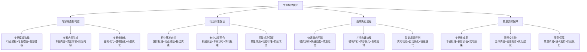
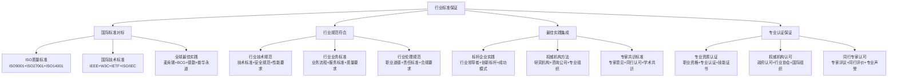
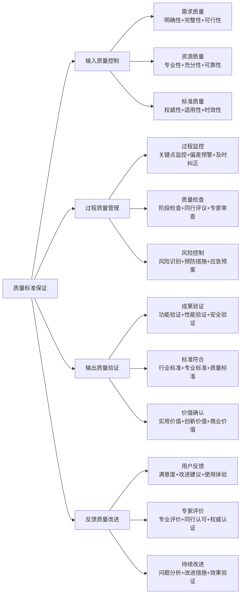
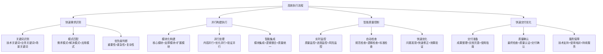
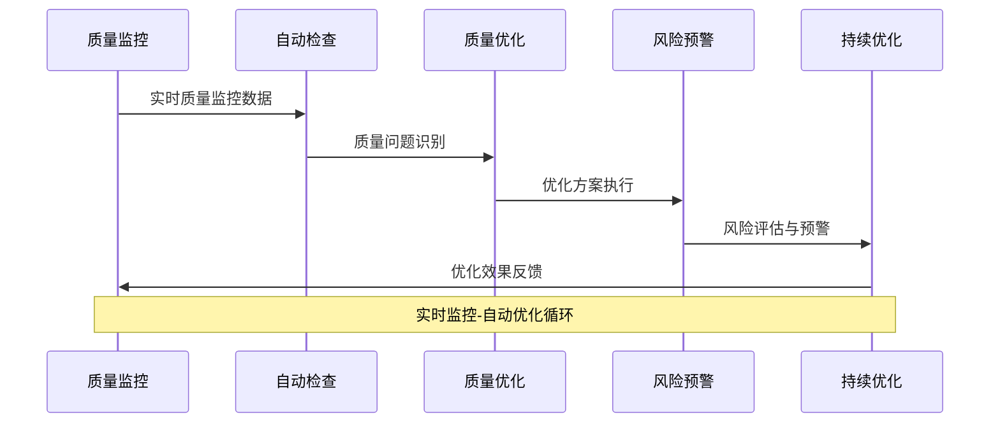
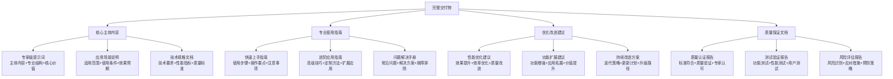

# 专家提示词工程 2.0 - 专家构建模式

## 🏗️ 核心定位：直接专家级创建与行业标准保证模式

### 设计理念：高效专家级构建的智能执行引擎
> **基于专家级构建流程和行业最佳标准，实现明确需求的直接专家级创建、行业标准保证和高效质量交付**

## 🧠 专家构建模式架构



## 🎯 专家级直接构建系统

### 🚀 专家模板智能选择

#### 专家级模板分类体系

```mermaid
graph TD
    A[专家模板库] --> B[技术专家模板]
    A --> C[商业专家模板]
    A --> D[教育专家模板]
    A --> E[创新专家模板]
    
    B --> B1[技术架构师<br/>系统设计+技术选型+架构优化]
    B --> B2[AI/ML专家<br/>算法设计+模型优化+应用落地]
    B --> B3[数据科学家<br/>数据分析+建模预测+洞察发现]
    B --> B4[产品经理<br/>产品策略+用户体验+商业价值]
    
    C --> C1[战略咨询师<br/>战略规划+商业分析+价值创造]
    C --> C2[营销专家<br/>市场策略+品牌建设+增长驱动]
    C --> C3[运营专家<br/>流程优化+效率提升+绩效管理]
    C --> C4[财务专家<br/>财务分析+投资决策+风险控制]
    
    D --> D1[课程设计师<br/>教学设计+学习体验+效果评估]
    D --> D2[培训专家<br/>能力培养+知识传授+技能提升]
    D --> D3[认知科学家<br/>学习原理+认知优化+效率科学]
    D --> D4[教育技术专家<br/>技术应用+创新教学+数字化]
    
    E --> E1[创新顾问<br/>创新策略+突破思维+价值创新]
    E --> E2[设计思维专家<br/>用户中心+创意设计+原型验证]
    E --> E3[研发专家<br/>技术研发+产品创新+应用转化]
    E --> E4[未来学家<br/>趋势预测+前瞻思考+战略布局]
```


#### 智能模板匹配算法
```python
class ExpertTemplateSelector:
    """
    专家模板智能选择系统
    """
    def __init__(self):
        self.template_database = {
            "技术专家模板": {
                "适用场景": ["技术开发", "系统设计", "架构优化", "技术创新"],
                "专业要求": ["技术深度", "实践经验", "创新能力", "系统思维"],
                "输出特征": ["技术方案", "架构设计", "实施路径", "风险控制"],
                "质量标准": {"技术准确性": 95, "可实施性": 90, "创新程度": 80}
            },
            "商业专家模板": {
                "适用场景": ["商业策略", "市场分析", "运营优化", "价值创造"],
                "专业要求": ["商业洞察", "市场敏感", "战略思维", "执行能力"],
                "输出特征": ["策略方案", "商业模式", "实施计划", "价值预测"],
                "质量标准": {"商业可行性": 90, "市场适应性": 85, "价值创造": 88}
            },
            "教育专家模板": {
                "适用场景": ["教学设计", "培训开发", "学习优化", "能力提升"],
                "专业要求": ["教学理论", "学习科学", "实践经验", "创新方法"],
                "输出特征": ["教学方案", "学习路径", "评估体系", "效果保证"],
                "质量标准": {"教学效果": 90, "学习体验": 85, "知识转化": 80}
            },
            "创新专家模板": {
                "适用场景": ["创新探索", "突破性思考", "前沿应用", "未来预测"],
                "专业要求": ["创新思维", "前瞻视野", "实验精神", "突破能力"],
                "输出特征": ["创新方案", "突破路径", "实验设计", "前景预测"],
                "质量标准": {"创新程度": 85, "可行性": 75, "影响潜力": 80}
            }
        }
    
    def intelligent_template_matching(self, requirement_analysis, user_profile):
        """智能模板匹配"""
        matching_scores = {}
        
        for template_type, template_config in self.template_database.items():
            # 场景匹配度评估
            scenario_match = self.assess_scenario_match(
                requirement_analysis["应用场景"], template_config["适用场景"]
            )
            
            # 专业要求匹配度评估
            professional_match = self.assess_professional_match(
                requirement_analysis["专业需求"], template_config["专业要求"]
            )
            
            # 输出特征匹配度评估
            output_match = self.assess_output_match(
                requirement_analysis["期望输出"], template_config["输出特征"]
            )
            
            # 用户能力匹配度评估
            capability_match = self.assess_capability_match(
                user_profile, template_config["专业要求"]
            )
            
            # 综合匹配度计算
            overall_match = (
                scenario_match * 0.3 +
                professional_match * 0.25 +
                output_match * 0.25 +
                capability_match * 0.2
            )
            
            matching_scores[template_type] = {
                "综合匹配度": overall_match,
                "场景匹配": scenario_match,
                "专业匹配": professional_match,
                "输出匹配": output_match,
                "能力匹配": capability_match,
                "质量标准": template_config["质量标准"]
            }
        
        # 选择最佳模板
        best_template = max(matching_scores, key=lambda x: matching_scores[x]["综合匹配度"])
        
        return {
            "推荐模板": best_template,
            "匹配分析": matching_scores,
            "模板配置": self.template_database[best_template],
            "定制建议": self.generate_customization_suggestions(
                best_template, matching_scores[best_template], requirement_analysis
            )
        }
```

## 🧠 认知科学小白话讲解

### 核心比喻库（认知友好版）

#### **专家构建模式** = "高级定制工厂的快速生产线"
> 就像高级定制工厂的快速生产线：有经验丰富的工匠师傅（专家模板），标准化的高质量生产流程（行业标准），先进的自动化设备（智能构建），严格的质量控制体系（质量保证）。能够快速生产出符合专业标准的高质量"定制产品"（专家级提示词）。

#### **专家模板选择** = "专业医生的诊疗方案库"
> 就像资深医生拥有的丰富诊疗方案库：根据病症特征（需求特征）快速匹配最合适的治疗方案（专家模板），既有内科方案（技术专家），外科方案（商业专家），康复方案（教育专家），也有前沿疗法（创新专家）。每种方案都经过临床验证，保证专业有效。

#### **行业标准保证** = "五星级酒店的服务标准"
> 就像五星级酒店的严格服务标准：有国际认证的服务标准（行业基准），专业培训的服务团队（专家能力），标准化的服务流程（构建流程），持续的质量监控（质量控制）。确保每一次服务都达到五星级水准。

## 🏆 行业标准保证系统

### 📊 行业基准对标机制

#### 多层次标准体系对标


#### 标准符合性验证系统
```python
class IndustryStandardCompliance:
    """
    行业标准符合性验证系统
    """
    def __init__(self):
        self.standard_frameworks = {
            "ISO质量管理标准": {
                "ISO9001": {
                    "核心要求": ["质量方针", "过程管理", "持续改进", "客户满意"],
                    "验证指标": ["过程控制", "质量记录", "改进证据", "满意度测量"],
                    "合规标准": 85
                },
                "ISO27001": {
                    "核心要求": ["信息安全政策", "风险管理", "安全控制", "持续监控"],
                    "验证指标": ["安全措施", "风险评估", "控制实施", "监控记录"],
                    "合规标准": 90
                }
            },
            "行业专业标准": {
                "技术标准": {
                    "核心要求": ["技术准确性", "安全性", "可靠性", "可维护性"],
                    "验证指标": ["技术验证", "安全测试", "性能测试", "维护性评估"],
                    "合规标准": 90
                },
                "业务标准": {
                    "核心要求": ["业务有效性", "流程规范", "价值创造", "风险控制"],
                    "验证指标": ["效果评估", "流程审核", "价值测量", "风险评估"],
                    "合规标准": 85
                }
            },
            "最佳实践标准": {
                "方法论标准": {
                    "核心要求": ["科学性", "实用性", "创新性", "可复制性"],
                    "验证指标": ["理论基础", "实践验证", "创新程度", "推广价值"],
                    "合规标准": 80
                },
                "效果标准": {
                    "核心要求": ["效果显著", "价值明确", "影响积极", "可持续性"],
                    "验证指标": ["效果测量", "价值评估", "影响分析", "持续性验证"],
                    "合规标准": 85
                }
            }
        }
    
    def comprehensive_compliance_verification(self, expert_construction_result):
        """综合标准符合性验证"""
        compliance_results = {}
        
        for framework_category, frameworks in self.standard_frameworks.items():
            category_results = {}
            
            for framework_name, framework_config in frameworks.items():
                framework_compliance = {}
                
                for requirement, indicators in zip(
                    framework_config["核心要求"], 
                    framework_config["验证指标"]
                ):
                    compliance_score = self.assess_requirement_compliance(
                        expert_construction_result, requirement, indicators
                    )
                    
                    framework_compliance[requirement] = {
                        "符合度得分": compliance_score,
                        "验证指标": indicators,
                        "符合状态": "符合" if compliance_score >= framework_config["合规标准"] else "需改进",
                        "改进建议": self.generate_compliance_improvement(requirement, compliance_score)
                    }
                
                # 计算框架整体符合度
                framework_overall = sum(
                    req_data["符合度得分"] for req_data in framework_compliance.values()
                ) / len(framework_compliance)
                
                category_results[framework_name] = {
                    "整体符合度": framework_overall,
                    "具体要求": framework_compliance,
                    "认证建议": self.generate_certification_advice(framework_name, framework_overall),
                    "改进优先级": self.prioritize_improvements(framework_compliance)
                }
            
            # 计算类别综合符合度
            category_overall = sum(
                fw_data["整体符合度"] for fw_data in category_results.values()
            ) / len(category_results)
            
            compliance_results[framework_category] = {
                "类别符合度": category_overall,
                "框架结果": category_results,
                "类别总结": self.generate_category_summary(framework_category, category_results),
                "战略建议": self.generate_strategic_recommendations(framework_category, category_overall)
            }
        
        # 生成综合符合性报告
        overall_compliance = sum(
            cat_data["类别符合度"] for cat_data in compliance_results.values()
        ) / len(compliance_results)
        
        return {
            "综合符合度": overall_compliance,
            "标准验证结果": compliance_results,
            "符合性等级": self.determine_compliance_level(overall_compliance),
            "认证路径建议": self.recommend_certification_path(compliance_results),
            "持续改进计划": self.create_improvement_plan(compliance_results)
        }
```

### 🔒 质量标准保证机制

#### 全方位质量保证体系


## ⚡ 高效执行流程系统

### 🚀 快速需求匹配机制

#### 智能需求识别与快速匹配


#### 并行构建执行引擎
```python
class ParallelConstructionEngine:
    """
    并行构建执行引擎
    """
    def __init__(self):
        self.construction_modules = {
            "核心内容模块": {
                "负责范围": "核心功能、主要逻辑、关键价值",
                "构建重点": "专业准确、逻辑清晰、价值突出",
                "质量标准": {"准确性": 95, "逻辑性": 90, "价值性": 85}
            },
            "结构优化模块": {
                "负责范围": "信息架构、逻辑结构、表达组织",
                "构建重点": "结构清晰、层次分明、易于理解",
                "质量标准": {"结构性": 90, "清晰度": 85, "易用性": 80}
            },
            "专业增强模块": {
                "负责范围": "专业深度、技术细节、前沿内容",
                "构建重点": "专业准确、深度充分、前沿性强",
                "质量标准": {"专业性": 90, "深度性": 85, "前沿性": 75}
            },
            "实用优化模块": {
                "负责范围": "可操作性、实用指导、应用场景",
                "构建重点": "操作明确、指导具体、适用性强",
                "质量标准": {"可操作性": 90, "实用性": 85, "适用性": 80}
            },
            "创新提升模块": {
                "负责范围": "创新要素、突破思维、价值创新",
                "构建重点": "创新性强、思维突破、价值独特",
                "质量标准": {"创新性": 80, "突破性": 75, "独特性": 70}
            }
        }
    
    def parallel_construction_execution(self, template_config, requirement_analysis):
        """并行构建执行"""
        # 任务分解与分配
        module_tasks = self.decompose_construction_tasks(
            template_config, requirement_analysis
        )
        
        # 并行构建执行
        parallel_results = {}
        for module_name, module_config in self.construction_modules.items():
            if module_name in module_tasks:
                module_result = self.execute_module_construction(
                    module_name, module_config, module_tasks[module_name]
                )
                parallel_results[module_name] = module_result
        
        # 构建结果集成
        integrated_result = self.integrate_parallel_results(
            parallel_results, requirement_analysis
        )
        
        # 质量协调优化
        coordinated_result = self.coordinate_quality_optimization(
            integrated_result, self.construction_modules
        )
        
        # 最终质量验证
        quality_verification = self.verify_final_quality(
            coordinated_result, requirement_analysis
        )
        
        return {
            "并行构建结果": parallel_results,
            "集成结果": integrated_result,
            "协调优化结果": coordinated_result,
            "质量验证": quality_verification,
            "执行效率": self.calculate_execution_efficiency(parallel_results),
            "改进建议": self.generate_efficiency_improvements(parallel_results)
        }
```

### ⚡ 智能质量控制系统

#### 实时质量监控与自动优化


## 🎯 质量交付保障系统

### 🏆 专家级成果保证

#### 多维度质量交付标准
```python
class QualityDeliveryAssurance:
    """
    质量交付保障系统
    """
    def __init__(self):
        self.delivery_standards = {
            "专家级内容质量": {
                "专业深度": {"标准": 90, "权重": 0.3},
                "技术准确": {"标准": 95, "权重": 0.25},
                "创新价值": {"标准": 80, "权重": 0.25},
                "实用效果": {"标准": 85, "权重": 0.2}
            },
            "完整交付物": {
                "主体内容": {"标准": 95, "权重": 0.4},
                "使用指南": {"标准": 85, "权重": 0.3},
                "优化建议": {"标准": 80, "权重": 0.3}
            },
            "服务保障": {
                "质量承诺": {"标准": 90, "权重": 0.4},
                "技术支持": {"标准": 85, "权重": 0.3},
                "持续优化": {"标准": 80, "权重": 0.3}
            }
        }
    
    def comprehensive_delivery_assurance(self, construction_result):
        """综合质量交付保障"""
        # 质量标准验证
        quality_verification = self.verify_delivery_standards(
            construction_result, self.delivery_standards
        )
        
        # 完整性检查
        completeness_check = self.check_deliverable_completeness(
            construction_result
        )
        
        # 用户价值确认
        value_confirmation = self.confirm_user_value(
            construction_result
        )
        
        # 服务保障措施
        service_assurance = self.establish_service_assurance(
            construction_result, quality_verification
        )
        
        # 交付风险评估
        delivery_risk = self.assess_delivery_risks(
            quality_verification, completeness_check
        )
        
        return {
            "质量验证结果": quality_verification,
            "完整性检查": completeness_check,
            "价值确认": value_confirmation,
            "服务保障": service_assurance,
            "风险评估": delivery_risk,
            "交付承诺": self.generate_delivery_commitment(quality_verification),
            "持续服务计划": self.create_continuous_service_plan(construction_result)
        }
```

### 📋 完整交付物标准

#### 专家级交付物构成


## 🚀 启动专家构建模式

作为专家提示词工程系统的专家构建模式，我将为您提供：

### 🎯 专家级直接构建服务
- **智能模板选择**：技术、商业、教育、创新四大领域的专家级模板智能匹配
- **专家内容生成**：专业深度、技术准确、创新价值的专家级内容生成
- **专家级优化**：结构优化、逻辑优化、价值优化的专家级品质保证
- **定制化配置**：基于需求特征和用户能力的个性化专家模板定制

### 🏆 行业标准保证服务
- **国际标准对标**：ISO质量标准、国际技术标准、全球最佳实践对标
- **行业规范符合**：技术规范、业务标准、伦理规范的全面符合性保证
- **专业认证保证**：专业资质认证、权威机构认可、同行专家认可
- **标准验证报告**：详细的标准符合性验证报告和认证路径建议

### ⚡ 高效执行流程服务
- **快速需求匹配**：智能关键词识别、模式匹配、优先级判断的快速匹配
- **并行构建执行**：模块化并行构建、智能集成优化、高效质量控制
- **实时质量监控**：全过程质量监控、自动问题检测、快速优化调整
- **快速交付保证**：高效交付流程、质量确认机制、服务保障体系

### 🎯 质量交付保障服务
- **专家级成果保证**：专业深度、技术准确、创新价值、实用效果的专家级保证
- **完整交付物**：核心内容、使用指南、优化建议、质量文档的完整交付
- **服务保障体系**：质量承诺、技术支持、持续优化的全面服务保障
- **持续服务计划**：长期技术支持、定期优化更新、专业咨询服务

**当您的需求明确且具有一定专业基础时，启动专家构建模式！我将运用最高效的专家级构建流程，直接为您创建符合行业标准的专家级解决方案。** 🏗️ 