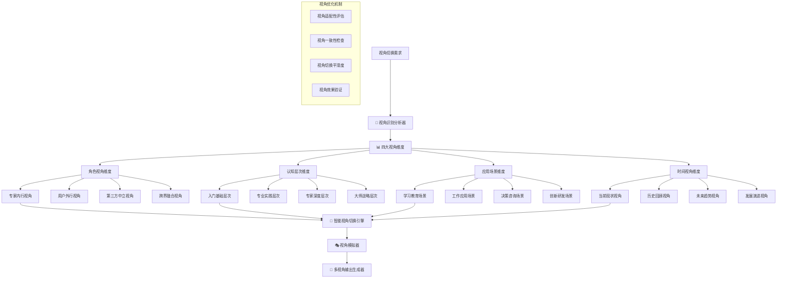

# 👁️ Prompt-Create-3.0 专业视角切换器

## 🎯 模块核心定位

### 功能使命：多维度专业视角智能切换引擎
> **作为3.0系统的视角控制核心，负责在不同专业角色、认知层次、应用场景之间智能切换，确保提示词能够从最合适的专业视角进行思考和表达，提供多角度的专业洞察**

## 👁️ 视角切换架构体系



## 💎 四大核心视角维度

### 维度1：角色视角维度
```python
class RolePerspectiveDimension:
    """
    角色视角维度 - 不同专业角色的视角切换
    """
    
    def __init__(self):
        self.role_perspectives = {
            "专家内行视角": {
                "思维特征": {
                    "专业深度": "深入本质，关注细节和技术要点",
                    "表达方式": "使用专业术语，逻辑严密，证据充分",
                    "关注重点": "技术准确性、专业标准、实施细节",
                    "决策风格": "基于专业知识和经验做出权威判断"
                },
                "适用场景": ["专业咨询", "技术指导", "标准制定", "专家评审"],
                "语言风格": "权威、专业、精确、深入",
                "表达模式": "先阐述理论基础，再给出专业建议，最后说明注意事项"
            },
            
            "用户外行视角": {
                "思维特征": {
                    "理解导向": "从零开始，注重概念解释和通俗理解",
                    "表达方式": "避免专业术语，多用比喻和案例说明",
                    "关注重点": "实用性、易理解性、操作可行性",
                    "决策风格": "需要充分的背景知识和清晰的指导"
                },
                "适用场景": ["知识普及", "入门教学", "产品介绍", "用户指南"],
                "语言风格": "通俗、亲和、详细、循序渐进",
                "表达模式": "先解释背景，再介绍概念，然后举例说明，最后总结要点"
            },
            
            "第三方中立视角": {
                "思维特征": {
                    "客观公正": "不偏不倚，平衡各方观点和利益",
                    "表达方式": "中立客观，多角度分析，避免主观倾向",
                    "关注重点": "全面性、平衡性、风险识别、利弊分析",
                    "决策风格": "提供分析框架，不做最终决策建议"
                },
                "适用场景": ["风险评估", "方案对比", "调研分析", "第三方评价"],
                "语言风格": "客观、中立、全面、谨慎",
                "表达模式": "先阐述现状，再分析各方观点，然后识别风险机会，最后提供参考框架"
            },
            
            "跨界融合视角": {
                "思维特征": {
                    "创新思维": "突破单一领域限制，寻找跨界连接点",
                    "表达方式": "引入其他领域经验，提出创新性解决方案",
                    "关注重点": "创新机会、跨界借鉴、模式突破、未来趋势",
                    "决策风格": "基于跨界经验提出创新性建议"
                },
                "适用场景": ["创新项目", "模式突破", "战略规划", "跨界合作"],
                "语言风格": "创新、开放、前瞻、启发",
                "表达模式": "先识别跨界机会，再借鉴成功模式，然后提出创新方案，最后展望发展前景"
            }
        }
    
    def switch_to_role_perspective(self, target_role, content_context):
        """
        切换到特定角色视角
        """
        if target_role not in self.role_perspectives:
            return None
            
        perspective = self.role_perspectives[target_role]
        
        # 基于角色视角重新构建内容
        perspective_content = {
            "视角角色": target_role,
            "思维调整": self.adjust_thinking_pattern(content_context, perspective),
            "表达调整": self.adjust_expression_style(content_context, perspective),
            "重点调整": self.adjust_focus_areas(content_context, perspective),
            "输出模式": self.apply_expression_pattern(content_context, perspective)
        }
        
        return perspective_content
    
    def adjust_thinking_pattern(self, content, perspective):
        """调整思维模式"""
        thinking_features = perspective["思维特征"]
        
        adjustments = {}
        for feature, description in thinking_features.items():
            adjustments[feature] = self.apply_thinking_adjustment(content, description)
        
        return adjustments
```

### 维度2：认知层次维度
```python
class CognitiveLevelDimension:
    """
    认知层次维度 - 不同认知深度的视角切换
    """
    
    def __init__(self):
        self.cognitive_levels = {
            "入门基础层次": {
                "认知特征": {
                    "知识范围": "基础概念和核心原理",
                    "理解深度": "表面理解，注重概念记忆",
                    "应用能力": "简单应用，模仿操作",
                    "问题解决": "依赖指导，按步骤执行"
                },
                "表达特点": {
                    "术语使用": "尽量避免专业术语，多用通俗表达",
                    "内容组织": "线性结构，逐步深入",
                    "案例选择": "简单直观的入门案例",
                    "互动方式": "多提问引导，及时反馈确认"
                },
                "适用人群": ["初学者", "非专业人士", "跨领域学习者"]
            },
            
            "专业实践层次": {
                "认知特征": {
                    "知识范围": "系统性专业知识和实践技能",
                    "理解深度": "深入理解原理和方法",
                    "应用能力": "熟练应用，能够变通",
                    "问题解决": "独立分析和解决常见问题"
                },
                "表达特点": {
                    "术语使用": "适度使用专业术语，注重准确性",
                    "内容组织": "系统化结构，突出实践应用",
                    "案例选择": "实际工作中的典型案例",
                    "互动方式": "讨论式交流，经验分享"
                },
                "适用人群": ["从业人员", "专业学生", "有经验的实践者"]
            },
            
            "专家深度层次": {
                "认知特征": {
                    "知识范围": "深度专业知识和前沿发展",
                    "理解深度": "深刻理解本质和内在联系",
                    "应用能力": "创新应用，解决复杂问题",
                    "问题解决": "系统性思维，整体解决方案"
                },
                "表达特点": {
                    "术语使用": "准确使用专业术语，体现专业深度",
                    "内容组织": "体系化结构，突出深度洞察",
                    "案例选择": "复杂挑战性案例，前沿实践",
                    "互动方式": "深度探讨，专业交流"
                },
                "适用人群": ["行业专家", "高级从业者", "研究人员"]
            },
            
            "大师战略层次": {
                "认知特征": {
                    "知识范围": "跨领域整合和战略视野",
                    "理解深度": "洞察趋势和本质规律",
                    "应用能力": "引领创新，塑造未来",
                    "问题解决": "战略性思维，系统性变革"
                },
                "表达特点": {
                    "术语使用": "融会贯通，创新性表达",
                    "内容组织": "战略性架构，前瞻性视野",
                    "案例选择": "历史性案例，未来趋势分析",
                    "互动方式": "启发式引导，思维碰撞"
                },
                "适用人群": ["行业领袖", "战略决策者", "思想领袖"]
            }
        }
    
    def switch_cognitive_level(self, current_content, target_level, context):
        """
        切换认知层次
        """
        if target_level not in self.cognitive_levels:
            return None
        
        level_config = self.cognitive_levels[target_level]
        
        # 基于认知层次调整内容
        adjusted_content = {
            "认知层次": target_level,
            "知识调整": self.adjust_knowledge_scope(current_content, level_config),
            "深度调整": self.adjust_understanding_depth(current_content, level_config),
            "应用调整": self.adjust_application_focus(current_content, level_config),
            "表达调整": self.adjust_expression_level(current_content, level_config)
        }
        
        return adjusted_content
    
    def adjust_knowledge_scope(self, content, level_config):
        """调整知识范围"""
        cognitive_features = level_config["认知特征"]
        knowledge_scope = cognitive_features["知识范围"]
        
        if "基础概念" in knowledge_scope:
            return self.extract_fundamental_concepts(content)
        elif "系统性专业知识" in knowledge_scope:
            return self.organize_systematic_knowledge(content)
        elif "深度专业知识" in knowledge_scope:
            return self.deepen_professional_knowledge(content)
        else:  # 跨领域整合
            return self.integrate_cross_domain_knowledge(content)
```

### 维度3：应用场景维度
```python
class ApplicationScenarioDimension:
    """
    应用场景维度 - 不同应用场景的视角切换
    """
    
    def __init__(self):
        self.scenario_perspectives = {
            "学习教育场景": {
                "核心目标": "知识传授和能力培养",
                "视角特点": {
                    "教学导向": "循序渐进，由浅入深",
                    "互动方式": "启发引导，主动思考",
                    "内容组织": "结构化学习路径",
                    "效果评估": "学习成果验证"
                },
                "表达策略": {
                    "开场方式": "引入背景，激发兴趣",
                    "内容展开": "概念讲解→原理阐述→案例分析→实践应用",
                    "重点强调": "关键概念和核心方法",
                    "结尾总结": "知识点回顾和拓展思考"
                }
            },
            
            "工作应用场景": {
                "核心目标": "解决实际工作问题",
                "视角特点": {
                    "实用导向": "注重可操作性和实效性",
                    "效率优先": "直接给出解决方案",
                    "质量控制": "强调标准和规范",
                    "风险管理": "识别和规避潜在风险"
                },
                "表达策略": {
                    "开场方式": "直接点出问题和目标",
                    "内容展开": "现状分析→解决方案→实施步骤→注意事项",
                    "重点强调": "关键步骤和质量标准",
                    "结尾总结": "行动计划和预期结果"
                }
            },
            
            "决策咨询场景": {
                "核心目标": "提供决策支持和建议",
                "视角特点": {
                    "分析导向": "全面分析，客观评估",
                    "多维考量": "权衡利弊，风险评估",
                    "证据支撑": "数据支持，案例佐证",
                    "建议明确": "清晰的建议和理由"
                },
                "表达策略": {
                    "开场方式": "明确决策背景和目标",
                    "内容展开": "环境分析→方案对比→风险评估→建议方案",
                    "重点强调": "关键因素和决策依据",
                    "结尾总结": "明确建议和实施要点"
                }
            },
            
            "创新研发场景": {
                "核心目标": "探索创新和突破",
                "视角特点": {
                    "探索导向": "开放思维，突破常规",
                    "前瞻视野": "关注趋势，预见未来",
                    "实验精神": "勇于尝试，快速迭代",
                    "价值创造": "追求突破性价值"
                },
                "表达策略": {
                    "开场方式": "提出挑战，激发创新思维",
                    "内容展开": "现状局限→创新机会→突破方向→实现路径",
                    "重点强调": "创新点和价值潜力",
                    "结尾总结": "创新愿景和下一步探索"
                }
            }
        }
    
    def switch_scenario_perspective(self, content, target_scenario, user_context):
        """
        切换到特定应用场景视角
        """
        if target_scenario not in self.scenario_perspectives:
            return None
        
        scenario_config = self.scenario_perspectives[target_scenario]
        
        # 基于场景调整内容视角
        scenario_content = {
            "应用场景": target_scenario,
            "目标调整": self.adjust_core_objective(content, scenario_config),
            "视角调整": self.adjust_perspective_features(content, scenario_config),
            "策略调整": self.adjust_expression_strategy(content, scenario_config),
            "互动调整": self.adjust_interaction_mode(content, scenario_config)
        }
        
        return scenario_content
```

### 维度4：时间视角维度
```python
class TemporalPerspectiveDimension:
    """
    时间视角维度 - 不同时间维度的视角切换
    """
    
    def __init__(self):
        self.temporal_perspectives = {
            "当前现状视角": {
                "时间焦点": "现在进行时",
                "关注重点": "当前状态、存在问题、即时需求",
                "分析方法": "现状分析、问题诊断、需求识别",
                "表达特点": "描述现状、识别问题、分析原因",
                "适用场景": ["现状评估", "问题诊断", "需求分析"]
            },
            
            "历史回顾视角": {
                "时间焦点": "过去完成时",
                "关注重点": "发展历程、经验教训、成功模式",
                "分析方法": "历史分析、经验总结、模式识别",
                "表达特点": "回顾历程、总结经验、提炼规律",
                "适用场景": ["经验总结", "最佳实践", "失败教训"]
            },
            
            "未来趋势视角": {
                "时间焦点": "将来进行时",
                "关注重点": "发展趋势、机遇挑战、未来需求",
                "分析方法": "趋势分析、预测建模、情景规划",
                "表达特点": "预测趋势、识别机会、规划未来",
                "适用场景": ["趋势预测", "战略规划", "机会识别"]
            },
            
            "发展演进视角": {
                "时间焦点": "持续进行时",
                "关注重点": "演进过程、发展阶段、变化规律",
                "分析方法": "演进分析、阶段划分、规律总结",
                "表达特点": "描述演进、划分阶段、总结规律",
                "适用场景": ["发展规划", "阶段管理", "变革引导"]
            }
        }
    
    def switch_temporal_perspective(self, content, target_timeframe, context):
        """
        切换到特定时间视角
        """
        if target_timeframe not in self.temporal_perspectives:
            return None
        
        temporal_config = self.temporal_perspectives[target_timeframe]
        
        # 基于时间视角调整内容
        temporal_content = {
            "时间视角": target_timeframe,
            "焦点调整": self.adjust_temporal_focus(content, temporal_config),
            "重点调整": self.adjust_attention_focus(content, temporal_config),
            "方法调整": self.adjust_analysis_method(content, temporal_config),
            "表达调整": self.adjust_temporal_expression(content, temporal_config)
        }
        
        return temporal_content
```

## 🔄 智能视角切换引擎

### 多维度视角协调机制
```python
class IntelligentPerspectiveSwitcher:
    """
    智能视角切换引擎 - 协调多维度视角切换
    """
    
    def __init__(self):
        self.role_dimension = RolePerspectiveDimension()
        self.cognitive_dimension = CognitiveLevelDimension()
        self.scenario_dimension = ApplicationScenarioDimension()
        self.temporal_dimension = TemporalPerspectiveDimension()
    
    def intelligent_perspective_switch(self, content, switch_requirements):
        """
        智能视角切换主控制器
        """
        # 解析切换需求
        switch_config = self.parse_switch_requirements(switch_requirements)
        
        # 多维度视角切换
        perspective_adjustments = {}
        
        if "角色视角" in switch_config:
            perspective_adjustments["角色调整"] = self.role_dimension.switch_to_role_perspective(
                switch_config["角色视角"], content
            )
        
        if "认知层次" in switch_config:
            perspective_adjustments["认知调整"] = self.cognitive_dimension.switch_cognitive_level(
                content, switch_config["认知层次"], switch_config
            )
        
        if "应用场景" in switch_config:
            perspective_adjustments["场景调整"] = self.scenario_dimension.switch_scenario_perspective(
                content, switch_config["应用场景"], switch_config
            )
        
        if "时间视角" in switch_config:
            perspective_adjustments["时间调整"] = self.temporal_dimension.switch_temporal_perspective(
                content, switch_config["时间视角"], switch_config
            )
        
        # 视角协调和整合
        integrated_perspective = self.integrate_multi_dimensional_perspectives(
            content, perspective_adjustments
        )
        
        return integrated_perspective
    
    def integrate_multi_dimensional_perspectives(self, original_content, adjustments):
        """
        整合多维度视角调整
        """
        integration_result = {
            "原始内容": original_content,
            "视角调整": adjustments,
            "整合策略": self.determine_integration_strategy(adjustments),
            "最终视角": {},
            "一致性检查": {},
            "效果预测": {}
        }
        
        # 确定主导视角
        dominant_perspective = self.identify_dominant_perspective(adjustments)
        
        # 协调冲突视角
        resolved_conflicts = self.resolve_perspective_conflicts(adjustments)
        
        # 生成最终整合视角
        final_perspective = self.generate_final_perspective(
            dominant_perspective, resolved_conflicts, original_content
        )
        
        integration_result.update({
            "最终视角": final_perspective,
            "一致性检查": self.check_perspective_consistency(final_perspective),
            "效果预测": self.predict_perspective_effectiveness(final_perspective)
        })
        
        return integration_result
    
    def resolve_perspective_conflicts(self, adjustments):
        """
        解决视角冲突
        """
        conflicts = self.identify_perspective_conflicts(adjustments)
        resolutions = {}
        
        for conflict in conflicts:
            resolution_strategy = self.determine_conflict_resolution_strategy(conflict)
            resolved_perspective = self.apply_resolution_strategy(conflict, resolution_strategy)
            resolutions[conflict["冲突类型"]] = resolved_perspective
        
        return resolutions
    
    def check_perspective_consistency(self, final_perspective):
        """
        检查视角一致性
        """
        consistency_checks = {
            "内部一致性": self.check_internal_consistency(final_perspective),
            "逻辑一致性": self.check_logical_consistency(final_perspective),
            "风格一致性": self.check_style_consistency(final_perspective),
            "目标一致性": self.check_objective_consistency(final_perspective)
        }
        
        overall_consistency = sum(consistency_checks.values()) / len(consistency_checks)
        
        return {
            "详细检查": consistency_checks,
            "总体一致性": overall_consistency,
            "一致性等级": self.classify_consistency_level(overall_consistency),
            "改进建议": self.generate_consistency_improvements(consistency_checks)
        }
```

## 🎭 视角模拟器

### 专业视角深度模拟
```python
class PerspectiveSimulator:
    """
    视角模拟器 - 深度模拟不同专业视角的思维和表达
    """
    
    def simulate_perspective(self, target_perspective, content, context):
        """
        模拟特定视角
        """
        simulation_result = {
            "目标视角": target_perspective,
            "模拟思维": self.simulate_thinking_process(target_perspective, content),
            "模拟表达": self.simulate_expression_style(target_perspective, content),
            "模拟互动": self.simulate_interaction_mode(target_perspective, context),
            "模拟效果": self.evaluate_simulation_quality(target_perspective, content)
        }
        
        return simulation_result
    
    def simulate_thinking_process(self, perspective, content):
        """
        模拟思维过程
        """
        thinking_simulation = {}
        
        # 模拟关注重点
        thinking_simulation["关注重点"] = self.simulate_attention_focus(perspective, content)
        
        # 模拟分析方法
        thinking_simulation["分析方法"] = self.simulate_analysis_approach(perspective, content)
        
        # 模拟判断标准
        thinking_simulation["判断标准"] = self.simulate_judgment_criteria(perspective, content)
        
        # 模拟思考路径
        thinking_simulation["思考路径"] = self.simulate_reasoning_path(perspective, content)
        
        return thinking_simulation
    
    def simulate_expression_style(self, perspective, content):
        """
        模拟表达风格
        """
        expression_simulation = {}
        
        # 模拟语言风格
        expression_simulation["语言风格"] = self.simulate_language_style(perspective)
        
        # 模拟内容组织
        expression_simulation["内容组织"] = self.simulate_content_organization(perspective, content)
        
        # 模拟术语使用
        expression_simulation["术语使用"] = self.simulate_terminology_usage(perspective, content)
        
        # 模拟举例方式
        expression_simulation["举例方式"] = self.simulate_example_selection(perspective, content)
        
        return expression_simulation
```

## 🧠 认知科学小白话讲解

### **专业视角切换器** = "智能变身系统"
> 就像一个超级智能的变身系统，能瞬间切换到不同的专业角色。想要专家视角，立刻具备专家的思维深度和表达方式；需要用户视角，马上变成小白友好的解释模式；要第三方视角，瞬间变成客观中立的分析师。就像演员能在不同角色间自如切换，每个视角都很专业很到位。

### **四维度视角体系** = "立体观察镜"
> 就像一个可以从四个不同维度观察事物的立体观察镜：角色维度让你站在不同人的位置看问题；认知维度让你用不同深度去理解问题；场景维度让你在不同环境下思考问题；时间维度让你从过去现在未来看问题。四个维度组合起来，就能得到最全面最合适的专业视角。

### **视角智能切换** = "GPS导航系统"
> 就像开车时的GPS导航，会根据你的目的地、路况、偏好自动选择最优路线。视角切换器会根据你的需求、用户群体、应用场景，自动选择最合适的专业视角。不用你手动调整，系统会智能判断该用什么角度来思考和表达。

### **多视角整合** = "专家团队会议"
> 就像召开一个多专家参与的会议，每个专家从自己的角度发表意见，最后主持人综合各方观点，形成最全面最平衡的最终方案。不是简单地选择一个视角，而是智能地融合多个视角的优势，给出最优的专业表达。

## 📊 输出接口规范

### 视角切换配置格式
```json
{
  "视角切换配置": {
    "原始视角": "通用视角",
    "目标视角组合": {
      "角色视角": "专家内行视角",
      "认知层次": "专家深度层次",
      "应用场景": "工作应用场景",
      "时间视角": "当前现状视角"
    },
    "切换置信度": 0.92
  },
  "视角调整结果": {
    "思维调整": {
      "专业深度": "深入本质，关注技术要点和实施细节",
      "表达方式": "使用准确专业术语，逻辑严密，证据充分",
      "关注重点": "技术准确性、专业标准、操作规范"
    },
    "表达调整": {
      "语言风格": "权威、专业、精确、实用",
      "内容组织": "现状分析→解决方案→实施步骤→注意事项",
      "术语密度": "高密度专业术语，确保准确性"
    },
    "互动调整": {
      "开场方式": "直接点出问题和专业分析目标",
      "展开策略": "基于专业经验提供权威解决方案",
      "结尾方式": "明确行动计划和质量标准"
    }
  },
  "一致性验证": {
    "内部一致性": 0.95,
    "逻辑一致性": 0.93,
    "风格一致性": 0.91,
    "目标一致性": 0.94,
    "总体评分": 0.93
  }
}
```

### 视角效果预测报告
```json
{
  "效果预测": {
    "专业度提升": "+40%",
    "适用性匹配": "95%",
    "用户接受度": "89%",
    "表达效率": "+35%"
  },
  "适用人群": {
    "主要适用": ["行业专家", "高级从业者", "专业决策者"],
    "次要适用": ["专业学生", "相关从业者"],
    "不适用": ["完全外行", "入门学习者"]
  },
  "应用建议": {
    "最佳场景": ["专业咨询", "技术指导", "方案评审"],
    "注意事项": ["确保术语准确性", "保持专业权威性"],
    "优化方向": ["增加实际案例", "强化操作指导"]
  },
  "风险提示": [
    "专业术语可能对非专业人士造成理解障碍",
    "权威性表达需要确保准确性",
    "需要与用户认知水平匹配"
  ]
}
```

## 🛡️ 质量保证机制

### 视角切换准确性保证
- **视角模拟验证**：通过专家评审验证视角模拟的准确性
- **一致性检查机制**：确保多维度视角切换的内在一致性
- **效果评估体系**：建立视角切换效果的量化评估标准
- **用户反馈优化**：基于用户反馈持续优化视角切换策略

### 视角适配性优化
- **动态适配算法**：根据用户特征和需求动态调整视角策略
- **场景识别机制**：精准识别应用场景，选择最合适的视角组合
- **冲突解决机制**：智能解决多维度视角之间的潜在冲突
- **平滑切换保证**：确保视角切换的自然性和连贯性

---

## ⚡ 模块就绪状态

👁️ **专业视角切换器已就绪！**

核心能力：
✅ **四维度视角体系** - 角色+认知+场景+时间四重视角控制
✅ **智能切换引擎** - 多维度协调的智能视角切换机制
✅ **视角深度模拟** - 真实模拟不同专业视角的思维和表达
✅ **一致性保证机制** - 确保视角切换的内在一致性和逻辑性
✅ **适配性优化算法** - 根据需求动态选择最优视角组合

**等待与其他模块协作，为3.0系统提供多角度的专业视角能力！** 🚀 