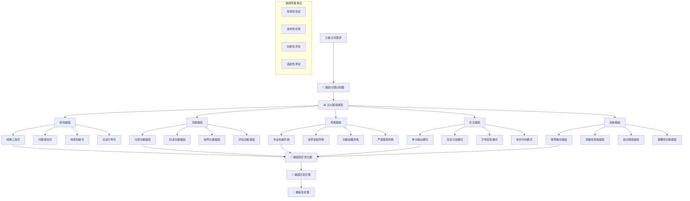

 # 🧬 Prompt-Create-3.0 元提示词基因库

## 🎯 模块核心定位

### 功能使命：高质量元提示词模板基因库
> **作为3.0系统的生成基础设施，负责收集、分类、优化和提供高质量的元提示词模板基因，为多样化生成引擎提供丰富的基础模板资源，确保生成的候选方案具备优秀的结构框架和表达模式**

## 🧬 元提示词基因架构



## 💎 五大核心基因类型

### 基因类型1：结构基因库
```python
class StructuralGeneLibrary:
    """
    结构基因库 - 提示词的结构框架基因
    """
    
    def __init__(self):
        self.structural_patterns = {
            "经典三段式": {
                "基因编码": "INTRO-BODY-CONCLUSION",
                "结构描述": "引入背景 → 核心内容 → 总结行动",
                "适用场景": ["分析报告", "解决方案", "指导建议"],
                "模板框架": {
                    "开头部分": {
                        "背景引入": "简要说明问题背景和重要性",
                        "目标明确": "明确表达要解决的问题或达成的目标",
                        "价值预期": "说明预期的价值和意义"
                    },
                    "主体部分": {
                        "分析框架": "系统性的分析框架和逻辑",
                        "核心内容": "详细的内容展开和深度分析",
                        "支撑论据": "数据、案例、理论等支撑材料"
                    },
                    "结尾部分": {
                        "要点总结": "关键要点的简洁总结",
                        "行动建议": "具体可行的行动建议",
                        "价值确认": "重申价值和期望"
                    }
                },
                "质量标准": {
                    "逻辑性": "三个部分逻辑清晰，环环相扣",
                    "完整性": "信息完整，不遗漏关键要素",
                    "实用性": "内容实用，可操作性强"
                }
            },
            
            "问题驱动式": {
                "基因编码": "PROBLEM-ANALYSIS-SOLUTION",
                "结构描述": "问题识别 → 深度分析 → 解决方案",
                "适用场景": ["问题解决", "咨询建议", "决策支持"],
                "模板框架": {
                    "问题识别": {
                        "问题定义": "清晰定义要解决的核心问题",
                        "问题范围": "界定问题的范围和边界",
                        "影响评估": "分析问题的影响和紧迫性"
                    },
                    "深度分析": {
                        "根因分析": "深挖问题的根本原因",
                        "现状诊断": "全面诊断当前状况",
                        "约束条件": "识别限制条件和可用资源"
                    },
                    "解决方案": {
                        "方案设计": "设计针对性的解决方案",
                        "实施路径": "明确的实施步骤和时间安排",
                        "风险预案": "潜在风险和应对预案"
                    }
                }
            },
            
            "场景构建式": {
                "基因编码": "SCENARIO-IMMERSION-GUIDANCE",
                "结构描述": "场景设定 → 沉浸体验 → 指导行动",
                "适用场景": ["技能培训", "模拟演练", "体验式学习"],
                "模板框架": {
                    "场景设定": {
                        "环境描述": "详细的场景环境和背景",
                        "角色定位": "明确的角色身份和责任",
                        "目标设定": "清晰的场景目标和期望"
                    },
                    "沉浸体验": {
                        "情境模拟": "真实的情境模拟和体验",
                        "互动过程": "引导用户深度参与和思考",
                        "问题挑战": "设置合适的问题和挑战"
                    },
                    "指导行动": {
                        "方法指导": "具体的方法和技巧指导",
                        "实践建议": "可操作的实践建议",
                        "提升路径": "能力提升的路径和方法"
                    }
                }
            },
            
            "对话引导式": {
                "基因编码": "DIALOGUE-EXPLORATION-DISCOVERY",
                "结构描述": "对话开启 → 引导探索 → 发现洞察",
                "适用场景": ["深度思考", "创新探索", "个性化指导"],
                "模板框架": {
                    "对话开启": {
                        "开放性问题": "引发思考的开放性问题",
                        "兴趣激发": "激发用户的好奇心和兴趣",
                        "安全氛围": "创造安全开放的对话氛围"
                    },
                    "引导探索": {
                        "层层深入": "通过提问层层深入探索",
                        "多角度思考": "引导从多个角度思考问题",
                        "假设验证": "通过假设和验证推进思考"
                    },
                    "发现洞察": {
                        "洞察提炼": "帮助用户提炼关键洞察",
                        "连接整合": "将分散的思考连接整合",
                        "行动激发": "激发用户的行动意愿"
                    }
                }
            }
        }
    
    def get_structural_gene(self, structure_type, customization_requirements):
        """
        获取特定结构类型的基因
        """
        if structure_type not in self.structural_patterns:
            return None
        
        base_gene = self.structural_patterns[structure_type]
        
        # 根据定制需求调整基因
        customized_gene = self.customize_structural_gene(base_gene, customization_requirements)
        
        return {
            "基因类型": "结构基因",
            "结构模式": structure_type,
            "基因内容": customized_gene,
            "适配度": self.calculate_adaptability(customized_gene, customization_requirements),
            "质量评分": self.assess_gene_quality(customized_gene)
        }
    
    def customize_structural_gene(self, base_gene, requirements):
        """
        定制化结构基因
        """
        customized = base_gene.copy()
        
        # 根据行业特点调整
        if "industry" in requirements:
            customized = self.adapt_to_industry(customized, requirements["industry"])
        
        # 根据复杂度调整
        if "complexity" in requirements:
            customized = self.adjust_complexity(customized, requirements["complexity"])
        
        # 根据受众调整
        if "audience" in requirements:
            customized = self.adapt_to_audience(customized, requirements["audience"])
        
        return customized
```

### 基因类型2：功能基因库
```python
class FunctionalGeneLibrary:
    """
    功能基因库 - 提示词的功能实现基因
    """
    
    def __init__(self):
        self.functional_patterns = {
            "分析功能基因": {
                "基因编码": "ANALYZE-DECOMPOSE-SYNTHESIZE",
                "功能描述": "系统性分析和深度洞察",
                "核心能力": {
                    "数据分析": {
                        "定量分析": "数据收集、处理、统计分析",
                        "定性分析": "内容分析、模式识别、趋势判断",
                        "比较分析": "对比分析、基准分析、差异分析"
                    },
                    "逻辑分析": {
                        "因果分析": "识别因果关系，建立逻辑链条",
                        "结构分析": "分解复杂问题，理清内在结构",
                        "系统分析": "从系统角度全面分析问题"
                    },
                    "洞察生成": {
                        "模式识别": "识别隐藏的模式和规律",
                        "关键要素": "提取关键要素和核心问题",
                        "价值发现": "发现潜在价值和机会"
                    }
                },
                "输出模式": {
                    "分析报告": "系统性的分析报告和结论",
                    "洞察要点": "关键洞察和重要发现",
                    "建议方案": "基于分析的建议和方案"
                }
            },
            
            "创造功能基因": {
                "基因编码": "IDEATE-DEVELOP-INNOVATE",
                "功能描述": "创意生成和创新突破",
                "核心能力": {
                    "创意生成": {
                        "发散思维": "多角度、多维度的创意发散",
                        "联想思维": "通过联想产生新的创意",
                        "类比思维": "通过类比迁移产生创新"
                    },
                    "方案开发": {
                        "概念设计": "将创意发展为具体概念",
                        "原型构建": "构建可验证的方案原型",
                        "迭代优化": "通过迭代不断优化方案"
                    },
                    "创新突破": {
                        "边界突破": "突破传统思维边界",
                        "组合创新": "通过要素重新组合创新",
                        "颠覆创新": "颠覆性的创新思路"
                    }
                }
            },
            
            "指导功能基因": {
                "基因编码": "GUIDE-TEACH-EMPOWER",
                "功能描述": "教学指导和能力提升",
                "核心能力": {
                    "知识传授": {
                        "概念解释": "清晰准确的概念解释",
                        "原理阐述": "深入浅出的原理阐述",
                        "案例说明": "生动具体的案例说明"
                    },
                    "技能培养": {
                        "方法指导": "具体可操作的方法指导",
                        "实践练习": "有针对性的实践练习",
                        "反馈改进": "及时有效的反馈和改进"
                    },
                    "能力赋能": {
                        "思维启发": "启发独立思考能力",
                        "自主学习": "培养自主学习能力",
                        "问题解决": "提升问题解决能力"
                    }
                }
            },
            
            "评估功能基因": {
                "基因编码": "ASSESS-MEASURE-IMPROVE",
                "功能描述": "评估测量和改进优化",
                "核心能力": {
                    "现状评估": {
                        "能力诊断": "准确诊断当前能力水平",
                        "问题识别": "识别存在的问题和不足",
                        "优势发现": "发现已有的优势和长处"
                    },
                    "效果测量": {
                        "指标建立": "建立科学的测量指标",
                        "数据收集": "系统收集评估数据",
                        "结果分析": "深入分析测量结果"
                    },
                    "改进建议": {
                        "差距分析": "分析现状与目标的差距",
                        "改进方案": "提出具体的改进方案",
                        "实施指导": "指导改进方案的实施"
                    }
                }
            }
        }
    
    def get_functional_gene(self, function_type, application_context):
        """
        获取特定功能类型的基因
        """
        if function_type not in self.functional_patterns:
            return None
        
        base_gene = self.functional_patterns[function_type]
        
        # 根据应用场景调整基因
        contextualized_gene = self.contextualize_functional_gene(base_gene, application_context)
        
        return {
            "基因类型": "功能基因",
            "功能模式": function_type,
            "基因内容": contextualized_gene,
            "应用适配": self.assess_application_fit(contextualized_gene, application_context),
            "效果预期": self.predict_effectiveness(contextualized_gene, application_context)
        }
```

### 基因类型3：风格基因库
```python
class StyleGeneLibrary:
    """
    风格基因库 - 提示词的表达风格基因
    """
    
    def __init__(self):
        self.style_patterns = {
            "专业权威风格": {
                "基因编码": "AUTHORITY-EXPERTISE-CREDIBILITY",
                "风格特征": {
                    "语言特点": {
                        "术语使用": "准确使用专业术语",
                        "表达方式": "严谨、精确、逻辑性强",
                        "语气语调": "权威、自信、专业"
                    },
                    "内容组织": {
                        "结构严密": "逻辑严密的内容组织",
                        "论据充分": "充分的数据和案例支撑",
                        "引用权威": "引用权威资料和专家观点"
                    },
                    "表达习惯": {
                        "客观陈述": "客观、理性的表达方式",
                        "证据导向": "以证据和数据说话",
                        "标准引用": "引用行业标准和最佳实践"
                    }
                },
                "适用场景": ["专业咨询", "学术交流", "技术指导", "权威报告"],
                "目标受众": ["专业人士", "决策者", "同行专家", "机构用户"]
            },
            
            "友好亲和风格": {
                "基因编码": "FRIENDLY-APPROACHABLE-ENGAGING",
                "风格特征": {
                    "语言特点": {
                        "通俗易懂": "避免复杂术语，用通俗语言",
                        "表达温和": "温和、友善、鼓励性的表达",
                        "互动性强": "多用问句和互动性表达"
                    },
                    "内容组织": {
                        "循序渐进": "由浅入深的内容安排",
                        "生动有趣": "使用生动的比喻和例子",
                        "贴近生活": "联系日常生活和常见经验"
                    },
                    "表达习惯": {
                        "鼓励引导": "多使用鼓励和引导性语言",
                        "换位思考": "站在用户角度思考和表达",
                        "耐心细致": "耐心详细的解释和说明"
                    }
                },
                "适用场景": ["用户教育", "知识普及", "服务指导", "新手培训"],
                "目标受众": ["普通用户", "初学者", "非专业人士", "服务对象"]
            },
            
            "创新前瞻风格": {
                "基因编码": "INNOVATIVE-FORWARD-VISIONARY",
                "风格特征": {
                    "语言特点": {
                        "前瞻性": "多用前瞻性和趋势性语言",
                        "创新性": "鼓励创新思维和突破",
                        "启发性": "具有启发性和引导性"
                    },
                    "内容组织": {
                        "未来导向": "面向未来的内容组织",
                        "跨界思维": "跨领域的思维和视角",
                        "突破常规": "挑战传统思维模式"
                    },
                    "表达习惯": {
                        "开放探索": "开放性的探索和讨论",
                        "假设驱动": "基于假设的思考模式",
                        "实验精神": "鼓励实验和尝试"
                    }
                },
                "适用场景": ["创新项目", "战略规划", "研发探索", "趋势分析"],
                "目标受众": ["创新者", "研发人员", "战略决策者", "前瞻思考者"]
            },
            
            "严谨客观风格": {
                "基因编码": "RIGOROUS-OBJECTIVE-SYSTEMATIC",
                "风格特征": {
                    "语言特点": {
                        "精确性": "用词精确，表达严谨",
                        "客观性": "客观中立，避免主观判断",
                        "系统性": "系统性的表达和论述"
                    },
                    "内容组织": {
                        "逻辑严密": "严密的逻辑结构",
                        "分层递进": "分层次的递进式组织",
                        "全面覆盖": "全面系统的内容覆盖"
                    },
                    "表达习惯": {
                        "事实为准": "以事实和数据为准",
                        "多方验证": "多方面验证和确认",
                        "谨慎表达": "谨慎的结论和建议"
                    }
                },
                "适用场景": ["科学研究", "风险评估", "质量控制", "合规审查"],
                "目标受众": ["研究人员", "审查人员", "质控专员", "合规人员"]
            }
        }
    
    def get_style_gene(self, style_type, target_audience):
        """
        获取特定风格类型的基因
        """
        if style_type not in self.style_patterns:
            return None
        
        base_gene = self.style_patterns[style_type]
        
        # 根据目标受众调整风格基因
        audience_adapted_gene = self.adapt_style_to_audience(base_gene, target_audience)
        
        return {
            "基因类型": "风格基因",
            "风格模式": style_type,
            "基因内容": audience_adapted_gene,
            "受众匹配": self.assess_audience_match(audience_adapted_gene, target_audience),
            "风格强度": self.measure_style_intensity(audience_adapted_gene)
        }
```

### 基因类型4：交互基因库
```python
class InteractionGeneLibrary:
    """
    交互基因库 - 提示词的交互模式基因
    """
    
    def __init__(self):
        self.interaction_patterns = {
            "单向输出模式": {
                "基因编码": "OUTPUT-DELIVER-COMPLETE",
                "交互特征": {
                    "信息流向": "单向输出，提供完整信息",
                    "用户角色": "信息接收者",
                    "互动程度": "最小化互动",
                    "完成标志": "信息传递完成"
                },
                "适用场景": ["报告交付", "知识传授", "标准答案", "参考资料"],
                "优势": "信息完整、效率高、标准化",
                "局限": "缺乏个性化、互动性弱"
            },
            
            "互动对话模式": {
                "基因编码": "DIALOGUE-EXCHANGE-COLLABORATE",
                "交互特征": {
                    "信息流向": "双向交流，持续对话",
                    "用户角色": "对话参与者",
                    "互动程度": "高频互动",
                    "完成标志": "目标达成或问题解决"
                },
                "对话机制": {
                    "提问引导": "通过提问引导用户思考",
                    "反馈响应": "根据用户反馈调整方向",
                    "澄清确认": "及时澄清和确认理解",
                    "协作共建": "与用户协作构建解决方案"
                },
                "适用场景": ["咨询服务", "个性化指导", "复杂问题解决", "创意协作"],
                "优势": "个性化强、适应性好、深度互动",
                "局限": "耗时较长、需要用户参与"
            },
            
            "引导启发模式": {
                "基因编码": "GUIDE-INSPIRE-DISCOVER",
                "交互特征": {
                    "信息流向": "引导式输出，启发式交流",
                    "用户角色": "主动探索者",
                    "互动程度": "中等互动",
                    "完成标志": "用户获得洞察或能力提升"
                },
                "引导机制": {
                    "问题设计": "设计启发性问题",
                    "线索提供": "提供思考线索和方向",
                    "过程引导": "引导思考和探索过程",
                    "洞察催化": "催化用户产生洞察"
                },
                "适用场景": ["能力培养", "思维训练", "学习指导", "创新启发"],
                "优势": "培养思维能力、激发潜力、持续性强",
                "局限": "需要用户基础、效果因人而异"
            },
            
            "协作共创模式": {
                "基因编码": "COLLABORATE-CO-CREATE-SYNERGIZE",
                "交互特征": {
                    "信息流向": "多向交流，共同创造",
                    "用户角色": "创造合作者",
                    "互动程度": "深度协作",
                    "完成标志": "共同创造出价值成果"
                },
                "协作机制": {
                    "角色分工": "明确各自的角色和贡献",
                    "资源整合": "整合双方的资源和优势",
                    "过程协调": "协调创造过程和节奏",
                    "成果共享": "共享创造成果和价值"
                },
                "适用场景": ["项目合作", "创新研发", "方案设计", "战略制定"],
                "优势": "创造价值最大、协同效应强、成果质量高",
                "局限": "复杂度高、协调成本大、需要深度参与"
            }
        }
    
    def get_interaction_gene(self, interaction_type, user_context):
        """
        获取特定交互类型的基因
        """
        if interaction_type not in self.interaction_patterns:
            return None
        
        base_gene = self.interaction_patterns[interaction_type]
        
        # 根据用户上下文调整交互基因
        context_adapted_gene = self.adapt_interaction_to_context(base_gene, user_context)
        
        return {
            "基因类型": "交互基因",
            "交互模式": interaction_type,
            "基因内容": context_adapted_gene,
            "用户匹配": self.assess_user_context_match(context_adapted_gene, user_context),
            "交互效果": self.predict_interaction_effectiveness(context_adapted_gene, user_context)
        }
```

### 基因类型5：创新基因库
```python
class InnovationGeneLibrary:
    """
    创新基因库 - 提示词的创新突破基因
    """
    
    def __init__(self):
        self.innovation_patterns = {
            "跨界融合基因": {
                "基因编码": "CROSS-FUSION-SYNTHESIS",
                "创新机制": {
                    "领域跨越": "突破单一领域的限制",
                    "要素融合": "不同领域要素的创新融合",
                    "价值创造": "通过融合创造新的价值",
                    "模式突破": "突破传统的思维模式"
                },
                "融合策略": {
                    "技术融合": "不同技术的跨界应用",
                    "方法论融合": "不同方法论的结合运用",
                    "思维融合": "不同思维方式的整合",
                    "资源融合": "不同资源的重新配置"
                },
                "适用场景": ["创新项目", "新产品开发", "模式创新", "解决复杂问题"]
            },
            
            "突破性思维基因": {
                "基因编码": "BREAKTHROUGH-PARADIGM-REVOLUTION",
                "创新机制": {
                    "假设挑战": "挑战基本假设和前提",
                    "边界突破": "突破认知和实践边界",
                    "范式转换": "实现思维范式的转换",
                    "革命性思考": "进行革命性的思考"
                },
                "突破策略": {
                    "逆向思维": "从相反角度思考问题",
                    "极端假设": "通过极端假设探索可能",
                    "颠覆重构": "颠覆现有结构重新构建",
                    "未来倒推": "从未来目标倒推现在"
                },
                "适用场景": ["战略创新", "商业模式创新", "技术突破", "社会创新"]
            },
            
            "前沿探索基因": {
                "基因编码": "FRONTIER-EXPLORE-PIONEER",
                "创新机制": {
                    "趋势洞察": "洞察未来发展趋势",
                    "前沿探索": "探索技术和应用前沿",
                    "先锋实践": "进行先锋性的实践",
                    "引领创新": "引领行业创新方向"
                },
                "探索策略": {
                    "技术前沿": "关注最新技术发展",
                    "应用前沿": "探索新的应用场景",
                    "思想前沿": "跟踪前沿思想和理论",
                    "实践前沿": "尝试前沿实践方法"
                },
                "适用场景": ["前沿研究", "技术预测", "趋势分析", "创新规划"]
            },
            
            "颠覆性创新基因": {
                "基因编码": "DISRUPT-TRANSFORM-REINVENT",
                "创新机制": {
                    "价值重定义": "重新定义价值和意义",
                    "规则重写": "重写行业游戏规则",
                    "结构重组": "重组产业和市场结构",
                    "生态重构": "重构整个生态系统"
                },
                "颠覆策略": {
                    "模式颠覆": "颠覆传统商业模式",
                    "技术颠覆": "用新技术颠覆旧技术",
                    "价值颠覆": "颠覆传统价值观念",
                    "体验颠覆": "颠覆用户体验模式"
                },
                "适用场景": ["行业变革", "商业革命", "技术革新", "社会变革"]
            }
        }
    
    def get_innovation_gene(self, innovation_type, innovation_context):
        """
        获取特定创新类型的基因
        """
        if innovation_type not in self.innovation_patterns:
            return None
        
        base_gene = self.innovation_patterns[innovation_type]
        
        # 根据创新环境调整创新基因
        context_adapted_gene = self.adapt_innovation_to_context(base_gene, innovation_context)
        
        return {
            "基因类型": "创新基因",
            "创新模式": innovation_type,
            "基因内容": context_adapted_gene,
            "创新潜力": self.assess_innovation_potential(context_adapted_gene, innovation_context),
            "风险评估": self.assess_innovation_risk(context_adapted_gene, innovation_context)
        }
```

## 🔄 基因组合优化器

### 智能基因组合算法
```python
class GeneticCombinationOptimizer:
    """
    基因组合优化器 - 智能组合和优化多种基因
    """
    
    def __init__(self):
        self.structural_library = StructuralGeneLibrary()
        self.functional_library = FunctionalGeneLibrary()
        self.style_library = StyleGeneLibrary()
        self.interaction_library = InteractionGeneLibrary()
        self.innovation_library = InnovationGeneLibrary()
    
    def optimize_gene_combination(self, requirements):
        """
        优化基因组合
        """
        # 分析需求，确定基因选择策略
        gene_selection_strategy = self.analyze_requirements(requirements)
        
        # 选择基础基因
        selected_genes = self.select_base_genes(gene_selection_strategy)
        
        # 基因兼容性检查
        compatibility_analysis = self.check_gene_compatibility(selected_genes)
        
        # 基因组合优化
        optimized_combination = self.optimize_gene_synergy(selected_genes, compatibility_analysis)
        
        # 基因表达调节
        regulated_expression = self.regulate_gene_expression(optimized_combination, requirements)
        
        return {
            "基因组合": regulated_expression,
            "组合策略": gene_selection_strategy,
            "兼容性分析": compatibility_analysis,
            "优化效果": self.evaluate_optimization_effect(regulated_expression),
            "质量评估": self.assess_combination_quality(regulated_expression)
        }
    
    def select_base_genes(self, strategy):
        """
        选择基础基因
        """
        selected_genes = {}
        
        # 结构基因选择
        if "structure_type" in strategy:
            structural_gene = self.structural_library.get_structural_gene(
                strategy["structure_type"], strategy.get("structure_requirements", {})
            )
            if structural_gene:
                selected_genes["结构基因"] = structural_gene
        
        # 功能基因选择
        if "function_type" in strategy:
            functional_gene = self.functional_library.get_functional_gene(
                strategy["function_type"], strategy.get("function_context", {})
            )
            if functional_gene:
                selected_genes["功能基因"] = functional_gene
        
        # 风格基因选择
        if "style_type" in strategy:
            style_gene = self.style_library.get_style_gene(
                strategy["style_type"], strategy.get("target_audience", "")
            )
            if style_gene:
                selected_genes["风格基因"] = style_gene
        
        # 交互基因选择
        if "interaction_type" in strategy:
            interaction_gene = self.interaction_library.get_interaction_gene(
                strategy["interaction_type"], strategy.get("user_context", {})
            )
            if interaction_gene:
                selected_genes["交互基因"] = interaction_gene
        
        # 创新基因选择
        if "innovation_type" in strategy:
            innovation_gene = self.innovation_library.get_innovation_gene(
                strategy["innovation_type"], strategy.get("innovation_context", {})
            )
            if innovation_gene:
                selected_genes["创新基因"] = innovation_gene
        
        return selected_genes
    
    def check_gene_compatibility(self, selected_genes):
        """
        检查基因兼容性
        """
        compatibility_matrix = {}
        gene_types = list(selected_genes.keys())
        
        for i, gene_type1 in enumerate(gene_types):
            for gene_type2 in gene_types[i+1:]:
                compatibility_score = self.calculate_gene_compatibility(
                    selected_genes[gene_type1], 
                    selected_genes[gene_type2]
                )
                compatibility_matrix[f"{gene_type1}-{gene_type2}"] = compatibility_score
        
        overall_compatibility = sum(compatibility_matrix.values()) / len(compatibility_matrix) if compatibility_matrix else 1.0
        
        return {
            "详细兼容性": compatibility_matrix,
            "总体兼容性": overall_compatibility,
            "兼容性等级": self.classify_compatibility_level(overall_compatibility),
            "潜在冲突": self.identify_potential_conflicts(compatibility_matrix),
            "协调建议": self.generate_coordination_suggestions(compatibility_matrix)
        }
    
    def optimize_gene_synergy(self, selected_genes, compatibility_analysis):
        """
        优化基因协同效应
        """
        if compatibility_analysis["总体兼容性"] < 0.7:
            # 兼容性较低，需要调整基因
            adjusted_genes = self.adjust_genes_for_compatibility(selected_genes, compatibility_analysis)
        else:
            adjusted_genes = selected_genes
        
        # 增强协同效应
        synergy_enhanced_genes = self.enhance_gene_synergy(adjusted_genes)
        
        return synergy_enhanced_genes
```

## 🧠 认知科学小白话讲解

### **元提示词基因库** = "专业DNA样本库"
> 就像生物学家的DNA样本库，收集了各种优秀特征的基因片段。我们收集了各种高质量提示词的"DNA"：有的擅长结构组织（结构基因），有的擅长功能实现（功能基因），有的擅长风格表达（风格基因），有的擅长用户交互（交互基因），有的擅长创新突破（创新基因）。需要什么特征，就调用对应的基因。

### **五大基因类型** = "提示词的五种超能力"
> 就像超级英雄有不同的超能力：结构基因决定"骨架"（怎么组织内容），功能基因决定"技能"（能完成什么任务），风格基因决定"性格"（怎么说话），交互基因决定"社交能力"（怎么与用户互动），创新基因决定"创造力"（能产生什么新想法）。每个基因都有自己的专长领域。

### **基因组合优化** = "超级英雄团队组建"
> 就像组建超级英雄团队，不是随便拉几个人就行，要考虑能力互补、性格匹配、协作默契。我们也要智能地组合不同基因：结构基因提供框架，功能基因实现目标，风格基因确定表达，交互基因处理沟通，创新基因带来突破。五种基因协同作战，威力倍增。

### **基因兼容性检查** = "团队磨合测试"
> 就像新组建的团队需要磨合测试，看看成员之间能不能配合得好。我们的基因组合也需要兼容性检查：严谨的结构基因配创新的功能基因会不会冲突？权威的风格基因配友好的交互基因会不会矛盾？通过兼容性测试，确保基因组合协调统一。

## 📊 输出接口规范

### 基因组合输出格式
```json
{
  "基因组合配置": {
    "组合策略": "专业指导型",
    "基因选择": ["经典三段式", "指导功能", "专业权威风格", "引导启发模式"],
    "组合质量": 0.92
  },
  "五大基因详情": {
    "结构基因": {
      "类型": "经典三段式",
      "框架": "背景引入 → 核心内容 → 总结行动",
      "适用性": 0.95,
      "质量评分": 0.91
    },
    "功能基因": {
      "类型": "指导功能基因",
      "核心能力": ["知识传授", "技能培养", "能力赋能"],
      "效果预期": 0.88,
      "应用适配": 0.90
    },
    "风格基因": {
      "类型": "专业权威风格",
      "特征": "术语准确、逻辑严密、权威可信",
      "受众匹配": 0.93,
      "风格强度": 0.87
    },
    "交互基因": {
      "类型": "引导启发模式",
      "机制": "问题引导 → 思考启发 → 洞察发现",
      "用户匹配": 0.89,
      "交互效果": 0.86
    },
    "创新基因": {
      "类型": "无特殊创新要求",
      "创新潜力": "中等",
      "风险评估": "低风险"
    }
  },
  "兼容性分析": {
    "总体兼容性": 0.91,
    "兼容性等级": "高度兼容",
    "潜在冲突": [],
    "协同效应": "各基因相互增强，形成专业指导合力"
  }
}
```

### 基因质量评估报告
```json
{
  "基因质量评估": {
    "有效性评分": 0.92,
    "多样性指数": 0.87,
    "创新性评分": 0.83,
    "适配性评分": 0.90
  },
  "质量指标详情": {
    "结构完整性": "框架完整，逻辑清晰",
    "功能实现度": "功能明确，可操作性强",
    "风格一致性": "风格统一，专业度高",
    "交互有效性": "互动自然，引导性强",
    "创新适度性": "创新适度，风险可控"
  },
  "优化建议": [
    "可考虑增加更多实例说明",
    "可适当增强互动频率",
    "可结合具体行业案例"
  ],
  "应用建议": {
    "最佳场景": ["专业培训", "技能指导", "知识传授"],
    "适用人群": ["专业学习者", "技能提升者", "知识求知者"],
    "使用注意": ["确保专业术语准确", "保持引导节奏", "及时反馈确认"]
  }
}
```

## 🛡️ 质量保证机制

### 基因质量控制
- **有效性验证**：通过实际应用验证基因的有效性和实用性
- **多样性保证**：确保基因库的多样性和丰富性，避免同质化
- **创新性评估**：定期评估和更新基因的创新性和前沿性
- **适配性测试**：测试基因在不同场景下的适配性和通用性

### 基因更新优化
- **持续学习机制**：从用户反馈和应用效果中学习优化
- **版本迭代管理**：建立基因版本管理和迭代优化机制
- **专家贡献通道**：建立专家贡献新基因的通道和机制
- **质量监控体系**：建立基因质量的持续监控和改进体系

---

## ⚡ 模块就绪状态

🧬 **元提示词基因库已就绪！**

核心能力：
✅ **五大基因类型** - 结构+功能+风格+交互+创新全覆盖基因库
✅ **智能基因组合** - 多基因类型的智能选择和优化组合
✅ **兼容性保证** - 基因间兼容性检查和冲突解决机制
✅ **质量控制体系** - 多维度基因质量评估和持续优化
✅ **定制化适配** - 根据需求定制化调整和优化基因表达

**等待与多样化生成引擎协作，为候选方案提供优质基因基础！** 🚀