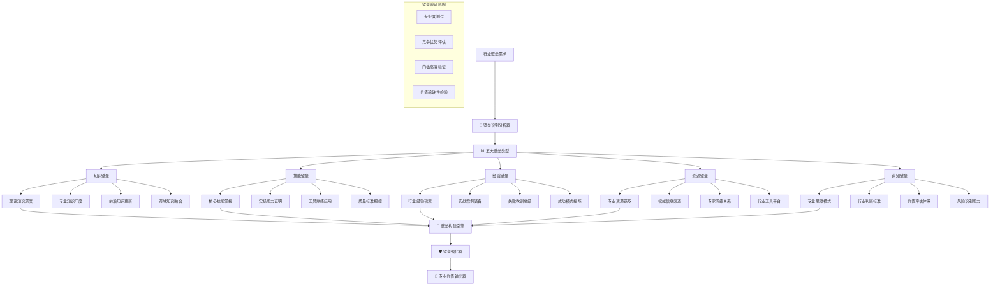

 # 🚧 Prompt-Create-3.0 垂直壁垒构建器

## 🎯 模块核心定位

### 功能使命：行业专业壁垒构建引擎
> **作为3.0系统的专业壁垒构建核心，负责识别、构建和强化特定行业的专业门槛和竞争壁垒，确保生成的提示词具备该行业真正的专业深度和不可替代的价值**

## 🚧 垂直壁垒架构体系



## 💎 五大核心壁垒类型

### 壁垒1：知识壁垒构建
```python
class KnowledgeBarrierBuilder:
    """
    知识壁垒构建器 - 构建深度和广度的知识门槛
    """
    
    def __init__(self, industry):
        self.industry = industry
        self.knowledge_depth_levels = self.define_knowledge_depth_levels()
        self.knowledge_breadth_domains = self.define_knowledge_breadth_domains()
        self.cutting_edge_knowledge = self.load_cutting_edge_knowledge()
    
    def build_knowledge_barriers(self, target_level, expertise_domain):
        """
        构建知识壁垒
        """
        knowledge_barriers = {
            "理论深度壁垒": self.build_theoretical_depth_barrier(target_level),
            "知识广度壁垒": self.build_knowledge_breadth_barrier(expertise_domain),
            "前沿知识壁垒": self.build_cutting_edge_barrier(expertise_domain),
            "跨域融合壁垒": self.build_cross_domain_barrier(expertise_domain)
        }
        
        return {
            "知识壁垒配置": knowledge_barriers,
            "壁垒高度评估": self.assess_barrier_height(knowledge_barriers),
            "准入门槛": self.define_entry_threshold(knowledge_barriers),
            "竞争优势": self.identify_competitive_advantages(knowledge_barriers)
        }
    
    def build_theoretical_depth_barrier(self, target_level):
        """
        构建理论深度壁垒
        """
        if self.industry == "金融投资":
            return {
                "基础理论要求": {
                    "现代金融理论": ["投资组合理论", "资本资产定价模型", "套利定价理论"],
                    "行为金融学": ["市场异象", "投资者心理", "决策偏差"],
                    "风险管理理论": ["VaR模型", "极值理论", "信用风险模型"]
                },
                "高级理论要求": {
                    "量化金融": ["期权定价理论", "随机过程", "金融工程"],
                    "宏观金融": ["货币理论", "金融政策", "国际金融"],
                    "公司金融": ["资本结构", "估值理论", "并购重组"]
                },
                "前沿理论": {
                    "机器学习金融": ["算法交易", "智能投顾", "风险预测"],
                    "区块链金融": ["数字货币", "DeFi", "智能合约"],
                    "ESG投资": ["可持续金融", "绿色金融", "影响力投资"]
                }
            }
        
        elif self.industry == "医疗健康":
            return {
                "基础医学理论": {
                    "基础医学": ["解剖学", "生理学", "病理学", "药理学"],
                    "临床医学": ["内科学", "外科学", "诊断学", "治疗学"],
                    "预防医学": ["流行病学", "卫生统计学", "环境卫生学"]
                },
                "专科深度理论": {
                    "专科医学": ["心血管", "神经系统", "消化系统", "呼吸系统"],
                    "检验医学": ["临床检验", "病理诊断", "影像诊断"],
                    "药学理论": ["药物化学", "药剂学", "临床药学"]
                },
                "前沿医学理论": {
                    "精准医学": ["基因组学", "蛋白组学", "个体化治疗"],
                    "再生医学": ["干细胞", "组织工程", "基因治疗"],
                    "数字医学": ["AI诊断", "远程医疗", "健康大数据"]
                }
            }
        
        # 可以继续扩展其他行业
        return {}
    
    def build_knowledge_breadth_barrier(self, expertise_domain):
        """
        构建知识广度壁垒
        """
        breadth_requirements = {
            "核心领域知识": self.get_core_domain_knowledge(expertise_domain),
            "相关领域知识": self.get_related_domain_knowledge(expertise_domain),
            "支撑学科知识": self.get_supporting_discipline_knowledge(expertise_domain),
            "交叉学科知识": self.get_interdisciplinary_knowledge(expertise_domain)
        }
        
        return breadth_requirements
    
    def assess_knowledge_barrier_strength(self, knowledge_barriers):
        """
        评估知识壁垒强度
        """
        strength_metrics = {
            "深度强度": self.calculate_depth_strength(knowledge_barriers),
            "广度强度": self.calculate_breadth_strength(knowledge_barriers),
            "稀缺性强度": self.calculate_scarcity_strength(knowledge_barriers),
            "更新难度": self.calculate_update_difficulty(knowledge_barriers)
        }
        
        overall_strength = sum(strength_metrics.values()) / len(strength_metrics)
        
        return {
            "强度评分": strength_metrics,
            "总体强度": overall_strength,
            "强度等级": self.classify_barrier_strength(overall_strength),
            "竞争优势": self.evaluate_competitive_advantage(overall_strength)
        }
```

### 壁垒2：技能壁垒构建
```python
class SkillBarrierBuilder:
    """
    技能壁垒构建器 - 构建实操技能和应用能力门槛
    """
    
    def __init__(self, industry):
        self.industry = industry
        self.core_skills = self.load_core_skills()
        self.advanced_skills = self.load_advanced_skills()
        self.tool_proficiency = self.load_tool_requirements()
    
    def build_skill_barriers(self, skill_level, application_context):
        """
        构建技能壁垒
        """
        skill_barriers = {
            "核心技能壁垒": self.build_core_skill_barrier(skill_level),
            "工具熟练度壁垒": self.build_tool_proficiency_barrier(skill_level),
            "质量标准壁垒": self.build_quality_standard_barrier(application_context),
            "效率要求壁垒": self.build_efficiency_requirement_barrier(skill_level)
        }
        
        return {
            "技能壁垒配置": skill_barriers,
            "技能门槛评估": self.assess_skill_threshold(skill_barriers),
            "实操要求": self.define_practical_requirements(skill_barriers),
            "认证标准": self.define_certification_standards(skill_barriers)
        }
    
    def build_core_skill_barrier(self, skill_level):
        """
        构建核心技能壁垒
        """
        if self.industry == "金融投资":
            core_skills = {
                "分析技能": {
                    "财务分析": {
                        "入门要求": ["基础财务报表阅读", "简单比率计算"],
                        "专业要求": ["深度财务分析", "现金流建模", "同业对比"],
                        "专家要求": ["复杂估值模型", "并购分析", "信用分析"],
                        "大师要求": ["创新分析框架", "行业重构分析", "宏观链接"]
                    },
                    "市场分析": {
                        "技术分析": ["图表分析", "指标运用", "趋势判断"],
                        "基本面分析": ["宏观分析", "行业分析", "公司分析"],
                        "量化分析": ["数据建模", "回测验证", "风险度量"]
                    }
                },
                "投资技能": {
                    "组合管理": ["资产配置", "风险控制", "业绩归因"],
                    "交易执行": ["订单管理", "成本控制", "流动性管理"],
                    "风险管理": ["风险识别", "对冲策略", "压力测试"]
                }
            }
        
        elif self.industry == "医疗健康":
            core_skills = {
                "诊断技能": {
                    "临床诊断": {
                        "病史采集": ["问诊技巧", "信息整理", "关键点识别"],
                        "体格检查": ["检查手法", "异常识别", "结果判读"],
                        "辅助诊断": ["检验解读", "影像分析", "综合判断"]
                    }
                },
                "治疗技能": {
                    "药物治疗": ["药物选择", "剂量计算", "不良反应处理"],
                    "手术技能": ["操作技术", "并发症处理", "术后管理"],
                    "康复指导": ["康复计划", "功能评估", "预后判断"]
                }
            }
        
        return core_skills.get(skill_level, core_skills)
    
    def define_skill_proficiency_levels(self, skill_category):
        """
        定义技能熟练度等级
        """
        proficiency_levels = {
            "初级熟练": {
                "掌握程度": "基本操作，需要指导",
                "执行质量": "能完成基础任务，偶有错误",
                "应用范围": "标准场景，简单问题",
                "独立性": "需要监督和指导"
            },
            "中级熟练": {
                "掌握程度": "熟练操作，独立执行",
                "执行质量": "质量稳定，错误率低",
                "应用范围": "常见场景，一般问题",
                "独立性": "独立工作，偶需咨询"
            },
            "高级熟练": {
                "掌握程度": "专家级操作，优化改进",
                "执行质量": "高质量输出，持续改进",
                "应用范围": "复杂场景，疑难问题",
                "独立性": "完全独立，指导他人"
            },
            "大师级熟练": {
                "掌握程度": "创新性操作，引领发展",
                "执行质量": "卓越质量，树立标杆",
                "应用范围": "全场景，创新突破",
                "独立性": "行业引领，培养专家"
            }
        }
        
        return proficiency_levels
```

### 壁垒3：经验壁垒构建
```python
class ExperienceBarrierBuilder:
    """
    经验壁垒构建器 - 构建实战经验和案例储备门槛
    """
    
    def __init__(self, industry):
        self.industry = industry
        self.experience_dimensions = self.define_experience_dimensions()
        self.case_categories = self.load_case_categories()
        self.experience_depth_levels = self.define_experience_depth_levels()
    
    def build_experience_barriers(self, experience_level, specialization_area):
        """
        构建经验壁垒
        """
        experience_barriers = {
            "实战经验壁垒": self.build_practical_experience_barrier(experience_level),
            "案例储备壁垒": self.build_case_repository_barrier(specialization_area),
            "失败经验壁垒": self.build_failure_experience_barrier(experience_level),
            "成功模式壁垒": self.build_success_pattern_barrier(specialization_area)
        }
        
        return {
            "经验壁垒配置": experience_barriers,
            "经验门槛评估": self.assess_experience_threshold(experience_barriers),
            "积累路径": self.define_experience_accumulation_path(experience_barriers),
            "验证方式": self.define_experience_verification_methods(experience_barriers)
        }
    
    def build_practical_experience_barrier(self, experience_level):
        """
        构建实战经验壁垒
        """
        if self.industry == "金融投资":
            experience_requirements = {
                "投资经验": {
                    "市场周期经验": {
                        "要求": "至少经历2-3个完整市场周期",
                        "价值": "理解市场规律，预判市场转折",
                        "验证": "能准确描述历史重要市场事件及应对"
                    },
                    "不同市场环境": {
                        "牛市经验": "成长股选择，估值控制，获利了结",
                        "熊市经验": "防守策略，价值发现，逆向投资",
                        "震荡市经验": "波段操作，结构性机会，风险控制"
                    }
                },
                "行业研究经验": {
                    "深度研究案例": {
                        "要求": "至少深度研究过5-10个不同行业",
                        "内容": "行业周期、竞争格局、商业模式、投资逻辑",
                        "验证": "能提供深度行业分析报告和投资建议"
                    }
                },
                "风险管理经验": {
                    "风险事件处理": {
                        "要求": "处理过至少3-5次重大风险事件",
                        "内容": "风险识别、应急处理、损失控制、经验总结",
                        "验证": "能详细描述风险处理过程和改进措施"
                    }
                }
            }
        
        return experience_requirements
    
    def build_case_repository_barrier(self, specialization_area):
        """
        构建案例储备壁垒
        """
        case_requirements = {
            "成功案例库": {
                "数量要求": "至少50-100个不同类型的成功案例",
                "质量要求": "案例完整性、可验证性、可复制性",
                "分类要求": "按行业、规模、类型、难度等维度分类",
                "更新要求": "定期更新，保持案例库的时效性"
            },
            "失败案例库": {
                "数量要求": "至少20-50个深度分析的失败案例",
                "分析深度": "失败原因、决策过程、教训总结、改进措施",
                "学习价值": "从失败中提炼的经验和预警机制",
                "应用价值": "用于风险识别和决策优化"
            },
            "创新案例库": {
                "创新实践": "亲自参与或主导的创新项目案例",
                "创新成果": "创新方法、工具、模式的实际应用",
                "创新影响": "创新对行业或组织的影响和价值",
                "创新传播": "创新经验的分享和推广"
            }
        }
        
        return case_requirements
```

### 壁垒4：资源壁垒构建
```python
class ResourceBarrierBuilder:
    """
    资源壁垒构建器 - 构建专业资源和信息渠道门槛
    """
    
    def __init__(self, industry):
        self.industry = industry
        self.resource_categories = self.define_resource_categories()
        self.access_levels = self.define_access_levels()
        self.resource_value_assessment = self.define_resource_value_assessment()
    
    def build_resource_barriers(self, access_level, resource_needs):
        """
        构建资源壁垒
        """
        resource_barriers = {
            "信息资源壁垒": self.build_information_resource_barrier(access_level),
            "专家网络壁垒": self.build_expert_network_barrier(access_level),
            "工具平台壁垒": self.build_tool_platform_barrier(resource_needs),
            "数据资源壁垒": self.build_data_resource_barrier(access_level)
        }
        
        return {
            "资源壁垒配置": resource_barriers,
            "资源门槛评估": self.assess_resource_threshold(resource_barriers),
            "获取路径": self.define_resource_acquisition_paths(resource_barriers),
            "成本分析": self.analyze_resource_costs(resource_barriers)
        }
    
    def build_information_resource_barrier(self, access_level):
        """
        构建信息资源壁垒
        """
        if self.industry == "金融投资":
            information_resources = {
                "实时市场数据": {
                    "一级数据源": {
                        "Bloomberg": "全球金融数据终端",
                        "Wind": "中国金融数据库",
                        "Reuters": "路透社金融数据",
                        "FactSet": "投资研究平台"
                    },
                    "成本门槛": "年费10万-100万人民币不等",
                    "技能门槛": "需要专业培训才能熟练使用",
                    "价值": "获得第一手、最及时的市场信息"
                },
                "研究报告资源": {
                    "投行研报": "高盛、摩根士丹利等顶级投行研究",
                    "咨询报告": "麦肯锡、波士顿咨询等管理咨询",
                    "行业报告": "专业行业研究机构深度报告",
                    "学术研究": "顶级期刊和学术会议最新研究"
                },
                "内部信息渠道": {
                    "监管信息": "证监会、央行等监管机构内部信息",
                    "公司调研": "上市公司管理层直接沟通渠道",
                    "行业会议": "闭门会议、高端论坛、专业峰会",
                    "专家访谈": "行业专家、学者、实践者深度交流"
                }
            }
        
        return information_resources
    
    def build_expert_network_barrier(self, access_level):
        """
        构建专家网络壁垒
        """
        expert_network = {
            "行业专家网络": {
                "顶级专家": {
                    "数量要求": "至少认识5-10位行业顶级专家",
                    "关系深度": "能够进行深度专业交流和咨询",
                    "互动频率": "定期保持联系，获得最新观点",
                    "价值贡献": "获得独家见解和前瞻性判断"
                },
                "同行网络": {
                    "专业同行": "同级别专业人士的交流圈子",
                    "跨机构网络": "不同机构间的专业关系网",
                    "国际联系": "海外专业人士和机构的联系",
                    "学术联系": "学术界和产业界的桥梁关系"
                }
            },
            "决策影响者网络": {
                "监管层关系": "监管机构相关人员的专业关系",
                "政策制定者": "政策研究和制定参与者的联系",
                "市场意见领袖": "在市场中具有影响力的关键人物",
                "媒体关系": "专业财经媒体和知名分析师"
            }
        }
        
        return expert_network
```

### 壁垒5：认知壁垒构建
```python
class CognitiveBarrierBuilder:
    """
    认知壁垒构建器 - 构建专业思维和判断标准门槛
    """
    
    def __init__(self, industry):
        self.industry = industry
        self.cognitive_frameworks = self.load_cognitive_frameworks()
        self.judgment_systems = self.load_judgment_systems()
        self.thinking_patterns = self.load_thinking_patterns()
    
    def build_cognitive_barriers(self, cognitive_level, domain_focus):
        """
        构建认知壁垒
        """
        cognitive_barriers = {
            "思维模式壁垒": self.build_thinking_pattern_barrier(cognitive_level),
            "判断标准壁垒": self.build_judgment_standard_barrier(domain_focus),
            "价值体系壁垒": self.build_value_system_barrier(cognitive_level),
            "直觉能力壁垒": self.build_intuition_capability_barrier(cognitive_level)
        }
        
        return {
            "认知壁垒配置": cognitive_barriers,
            "认知门槛评估": self.assess_cognitive_threshold(cognitive_barriers),
            "培养路径": self.define_cognitive_development_path(cognitive_barriers),
            "验证机制": self.define_cognitive_verification_mechanism(cognitive_barriers)
        }
    
    def build_thinking_pattern_barrier(self, cognitive_level):
        """
        构建思维模式壁垒
        """
        if self.industry == "金融投资":
            thinking_patterns = {
                "投资思维模式": {
                    "长期思维": {
                        "时间维度": "能够进行5-10年的长期思考",
                        "价值判断": "关注长期价值而非短期波动",
                        "复利思维": "理解复利的力量和时间价值",
                        "验证标准": "投资决策能体现长期战略思考"
                    },
                    "概率思维": {
                        "不确定性": "在不确定中做出最优决策",
                        "风险收益": "准确评估风险收益的概率分布",
                        "期望值": "基于期望值进行决策优化",
                        "验证标准": "能用概率语言描述投资机会"
                    },
                    "逆向思维": {
                        "反向验证": "从失败角度验证投资逻辑",
                        "逆向选择": "在市场悲观时发现价值",
                        "反共识": "敢于挑战市场主流观点",
                        "验证标准": "有成功的逆向投资案例"
                    }
                },
                "系统性思维": {
                    "宏观视野": "将投资置于宏观经济环境中考虑",
                    "产业链思维": "理解产业链上下游的关联影响",
                    "生态思维": "考虑商业生态系统的复杂关系",
                    "动态思维": "理解市场和企业的动态变化"
                }
            }
        
        return thinking_patterns
    
    def build_judgment_standard_barrier(self, domain_focus):
        """
        构建判断标准壁垒
        """
        judgment_standards = {
            "质量判断标准": {
                "投资质量": {
                    "企业质量": ["商业模式", "竞争优势", "管理团队", "财务质量"],
                    "行业质量": ["成长性", "竞争格局", "政策环境", "技术趋势"],
                    "估值质量": ["估值方法", "估值水平", "估值逻辑", "安全边际"]
                }
            },
            "风险判断标准": {
                "风险识别": ["系统性风险", "个股风险", "流动性风险", "操作风险"],
                "风险评估": ["风险概率", "风险影响", "风险相关性", "风险传导"],
                "风险控制": ["风险预警", "风险对冲", "风险分散", "风险监控"]
            },
            "时机判断标准": {
                "买入时机": ["估值水平", "基本面拐点", "政策催化", "技术信号"],
                "卖出时机": ["估值过高", "基本面恶化", "更好机会", "风险上升"],
                "持有时机": ["长期价值", "短期波动", "机会成本", "组合平衡"]
            }
        }
        
        return judgment_standards
```

## 🔧 壁垒构建引擎

### 综合壁垒构建算法
```python
class ComprehensiveBarrierBuilder:
    """
    综合壁垒构建引擎 - 整合五大壁垒类型的综合构建
    """
    
    def __init__(self, industry):
        self.industry = industry
        self.knowledge_builder = KnowledgeBarrierBuilder(industry)
        self.skill_builder = SkillBarrierBuilder(industry)
        self.experience_builder = ExperienceBarrierBuilder(industry)
        self.resource_builder = ResourceBarrierBuilder(industry)
        self.cognitive_builder = CognitiveBarrierBuilder(industry)
    
    def build_comprehensive_barriers(self, barrier_requirements):
        """
        构建综合专业壁垒
        """
        # 分别构建五大壁垒
        barriers = {
            "知识壁垒": self.knowledge_builder.build_knowledge_barriers(
                barrier_requirements.get("target_level", "专家级"),
                barrier_requirements.get("domain", "")
            ),
            "技能壁垒": self.skill_builder.build_skill_barriers(
                barrier_requirements.get("skill_level", "高级"),
                barrier_requirements.get("context", "")
            ),
            "经验壁垒": self.experience_builder.build_experience_barriers(
                barrier_requirements.get("experience_level", "资深"),
                barrier_requirements.get("specialization", "")
            ),
            "资源壁垒": self.resource_builder.build_resource_barriers(
                barrier_requirements.get("access_level", "专业级"),
                barrier_requirements.get("resource_needs", [])
            ),
            "认知壁垒": self.cognitive_builder.build_cognitive_barriers(
                barrier_requirements.get("cognitive_level", "专家级"),
                barrier_requirements.get("domain_focus", "")
            )
        }
        
        # 壁垒整合和优化
        integrated_barriers = self.integrate_barriers(barriers)
        
        return {
            "分类壁垒": barriers,
            "整合壁垒": integrated_barriers,
            "壁垒评估": self.assess_overall_barrier_strength(integrated_barriers),
            "竞争优势": self.identify_competitive_advantages(integrated_barriers),
            "构建建议": self.generate_barrier_building_recommendations(integrated_barriers)
        }
    
    def integrate_barriers(self, barriers):
        """
        整合多类型壁垒
        """
        integration_strategy = self.determine_integration_strategy(barriers)
        
        integrated_barriers = {
            "核心壁垒组合": self.identify_core_barrier_combination(barriers),
            "协同效应": self.analyze_barrier_synergies(barriers),
            "强化重点": self.identify_strengthening_priorities(barriers),
            "整合策略": integration_strategy
        }
        
        return integrated_barriers
    
    def assess_overall_barrier_strength(self, integrated_barriers):
        """
        评估整体壁垒强度
        """
        strength_assessment = {
            "壁垒高度": self.calculate_barrier_height(integrated_barriers),
            "壁垒宽度": self.calculate_barrier_width(integrated_barriers),
            "壁垒深度": self.calculate_barrier_depth(integrated_barriers),
            "壁垒稳定性": self.calculate_barrier_stability(integrated_barriers)
        }
        
        overall_strength = self.calculate_overall_strength(strength_assessment)
        
        return {
            "强度指标": strength_assessment,
            "总体强度": overall_strength,
            "强度等级": self.classify_overall_strength(overall_strength),
            "市场地位": self.evaluate_market_position(overall_strength),
            "竞争优势": self.evaluate_competitive_advantage(overall_strength)
        }
```

## 🧠 认知科学小白话讲解

### **垂直壁垒构建器** = "专业护城河工程师"
> 就像古代城池的护城河工程师，要设计多重防御体系：知识壁垒是护城河的宽度（别人学不会），技能壁垒是护城河的深度（别人做不到），经验壁垒是护城河的水质（别人没经历过），资源壁垒是护城河的地理优势（别人没渠道），认知壁垒是护城河的战略高度（别人想不到）。五重护城河构成不可攻破的专业堡垒。

### **五大壁垒类型** = "专业竞争力的五重防护"
> 就像一个超级英雄的五重防护装备：知识壁垒是盔甲（理论防护），技能壁垒是武器（实战能力），经验壁垒是战斗经验（见过大场面），资源壁垒是后勤补给（有强大支持），认知壁垒是战略眼光（看得更远更深）。五重防护叠加，形成无法复制的专业优势。

### **壁垒强度评估** = "专业实力体检系统"
> 就像全面的身体检查，不是只看一个指标，而是从高度（有多专业）、宽度（覆盖多广）、深度（有多深入）、稳定性（能保持多久）四个维度全面评估。就像医生通过各项指标综合判断你的健康水平，我们通过多重指标评估专业壁垒的强度。

### **综合壁垒构建** = "专业优势建筑师"
> 就像设计摩天大楼的建筑师，不是简单地把材料堆叠，而是要考虑结构设计、材料配比、协同效应。知识、技能、经验、资源、认知五种"材料"要巧妙组合，形成1+1>5的协同效应，建成别人无法复制的专业"摩天大楼"。

## 📊 输出接口规范

### 壁垒构建配置格式
```json
{
  "壁垒构建配置": {
    "目标行业": "金融投资",
    "专业等级": "专家级",
    "壁垒强度": "高强度"
  },
  "五大壁垒详情": {
    "知识壁垒": {
      "理论深度": "现代金融理论+行为金融学+量化金融",
      "知识广度": "宏观+行业+公司+政策四维覆盖",
      "前沿更新": "机器学习金融+区块链+ESG投资",
      "壁垒强度": 0.92
    },
    "技能壁垒": {
      "核心技能": "财务分析+投资分析+风险管理",
      "工具熟练": "Bloomberg+Wind+Python+Excel高级应用",
      "质量标准": "投行级分析质量+合规标准",
      "壁垒强度": 0.88
    },
    "经验壁垒": {
      "实战经验": "3个完整市场周期+50+投资案例",
      "失败教训": "20+深度分析失败案例储备",
      "成功模式": "多种投资策略成功实践",
      "壁垒强度": 0.85
    },
    "资源壁垒": {
      "信息渠道": "Bloomberg+一级投行研报+内部调研",
      "专家网络": "10+顶级专家+同行网络+监管关系",
      "工具平台": "专业金融终端+量化平台+数据库",
      "壁垒强度": 0.78
    },
    "认知壁垒": {
      "思维模式": "长期思维+概率思维+逆向思维+系统思维",
      "判断标准": "专业质量+风险+时机判断体系",
      "价值体系": "价值投资+风险控制+长期主义",
      "壁垒强度": 0.90
    }
  },
  "综合壁垒评估": {
    "总体强度": 0.87,
    "强度等级": "高强度专业壁垒",
    "市场地位": "行业前10%专业水准",
    "竞争优势": "难以复制的综合专业能力",
    "护城河宽度": "3-5年专业积累门槛"
  }
}
```

### 壁垒构建建议报告
```json
{
  "壁垒强化建议": {
    "短期优化(1-6个月)": [
      "补强量化分析工具使用技能",
      "扩充ESG投资理论知识",
      "建立系统性案例分析方法"
    ],
    "中期建设(6-18个月)": [
      "深度参与2-3个重大投资项目",
      "建立行业专家网络关系",
      "开发独特的投资分析框架"
    ],
    "长期构建(18个月以上)": [
      "形成个人投资哲学体系",
      "建立行业影响力和声誉",
      "培养下一代专业人才"
    ]
  },
  "关键突破点": [
    "将理论知识转化为实战能力",
    "从跟随者转变为思想领导者",
    "从个人能力转向平台影响力"
  ],
  "风险提示": [
    "技术发展可能颠覆传统壁垒",
    "监管变化影响专业要求",
    "市场环境变化考验适应能力"
  ]
}
```

## 🛡️ 质量保证机制

### 壁垒有效性验证
- **专业权威验证**：邀请行业权威专家验证壁垒设计的合理性
- **实战效果检验**：通过实际应用检验壁垒的有效性和价值
- **竞争对比分析**：与行业标杆进行对比，确保壁垒的竞争力
- **动态调整机制**：根据行业发展和技术变化动态调整壁垒标准

### 壁垒可达性保证
- **构建路径设计**：为每种壁垒设计可行的构建路径和方法
- **阶段性目标**：将长期壁垒建设分解为可实现的阶段性目标
- **资源需求分析**：明确构建各类壁垒所需的时间、精力和资源投入
- **进度监控机制**：建立壁垒构建进度的监控和评估体系

---

## ⚡ 模块就绪状态

🚧 **垂直壁垒构建器已就绪！**

核心能力：
✅ **五大壁垒体系** - 知识+技能+经验+资源+认知全方位壁垒
✅ **综合构建引擎** - 多类型壁垒的智能整合和协同优化
✅ **强度评估体系** - 多维度壁垒强度科学评估和分级
✅ **竞争优势分析** - 基于壁垒强度的市场地位和优势评估
✅ **构建路径指导** - 阶段性壁垒建设的具体路径和方法

**等待与其他模块协作，为3.0系统构建不可逾越的专业护城河！** 🚀