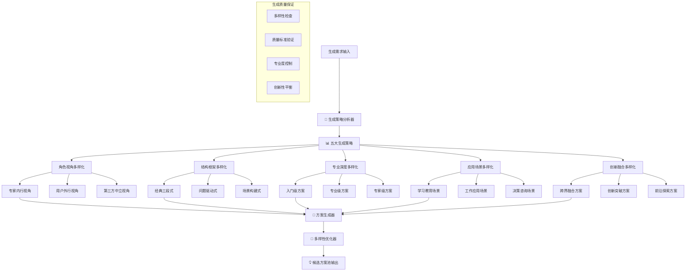

# 🎲 Prompt-Create-3.0 多样化生成引擎

## 🎯 模块核心定位

### 功能使命：10+候选方案多样化生成引擎
> **作为3.0系统的核心生成引擎，负责基于元提示词基因和注入的专业知识，运用五大生成策略智能生成10+多样化候选方案，确保每个方案都具备独特价值和专业水准**

## 🎲 多样化生成架构



## 💎 五大核心生成策略

### 策略1：角色视角多样化生成
```python
class RolePerspectiveDiversification:
    """角色视角多样化生成策略"""
    
    def generate_perspective_variants(self, base_prompt_gene, knowledge_injection):
        variants = []
        
        # 专家内行视角方案
        expert_variant = self.generate_expert_perspective(base_prompt_gene, knowledge_injection)
        variants.append({
            "方案ID": "EXPERT_001",
            "生成策略": "角色视角多样化",
            "具体视角": "专家内行视角",
            "方案特色": "专业权威、技术深度、行业标准",
            "目标用户": "专业人士、行业专家、决策者",
            "提示词内容": expert_variant,
            "预期效果": "专业可信、权威指导、深度洞察"
        })
        
        # 用户外行视角方案
        user_variant = self.generate_user_perspective(base_prompt_gene, knowledge_injection)
        variants.append({
            "方案ID": "USER_001", 
            "生成策略": "角色视角多样化",
            "具体视角": "用户外行视角",
            "方案特色": "通俗易懂、循序渐进、贴近用户",
            "目标用户": "初学者、非专业人士、普通用户",
            "提示词内容": user_variant,
            "预期效果": "易于理解、降低门槛、友好引导"
        })
        
        # 第三方中立视角方案
        neutral_variant = self.generate_neutral_perspective(base_prompt_gene, knowledge_injection)
        variants.append({
            "方案ID": "NEUTRAL_001",
            "生成策略": "角色视角多样化", 
            "具体视角": "第三方中立视角",
            "方案特色": "客观公正、全面平衡、风险提示",
            "目标用户": "决策者、评估者、审查者",
            "提示词内容": neutral_variant,
            "预期效果": "客观分析、平衡观点、风险意识"
        })
        
        return variants
```

### 策略2：结构框架多样化生成
```python
class StructuralFrameworkDiversification:
    """结构框架多样化生成策略"""
    
    def generate_structural_variants(self, base_prompt_gene, knowledge_injection):
        variants = []
        
        # 经典三段式结构
        classic_variant = self.apply_classic_structure(base_prompt_gene, knowledge_injection)
        variants.append({
            "方案ID": "STRUCT_001",
            "生成策略": "结构框架多样化",
            "结构模式": "经典三段式",
            "结构特点": "背景-内容-总结，逻辑清晰",
            "适用场景": "正式报告、学术分析、专业建议",
            "提示词内容": classic_variant
        })
        
        # 问题驱动式结构
        problem_variant = self.apply_problem_driven_structure(base_prompt_gene, knowledge_injection)
        variants.append({
            "方案ID": "STRUCT_002",
            "生成策略": "结构框架多样化",
            "结构模式": "问题驱动式", 
            "结构特点": "问题-分析-解决，目标导向",
            "适用场景": "问题解决、咨询服务、方案设计",
            "提示词内容": problem_variant
        })
        
        # 场景构建式结构
        scenario_variant = self.apply_scenario_structure(base_prompt_gene, knowledge_injection)
        variants.append({
            "方案ID": "STRUCT_003",
            "生成策略": "结构框架多样化",
            "结构模式": "场景构建式",
            "结构特点": "场景-体验-指导，沉浸式学习",
            "适用场景": "技能培训、模拟演练、体验学习",
            "提示词内容": scenario_variant
        })
        
        return variants
```

### 策略3：专业深度多样化生成
```python
class ProfessionalDepthDiversification:
    """专业深度多样化生成策略"""
    
    def generate_depth_variants(self, base_prompt_gene, knowledge_injection):
        variants = []
        
        # 入门级深度方案
        beginner_variant = self.generate_beginner_level(base_prompt_gene, knowledge_injection)
        variants.append({
            "方案ID": "DEPTH_001",
            "生成策略": "专业深度多样化",
            "专业等级": "入门级",
            "深度特征": "基础概念、简单应用、入门指导",
            "复杂度": "低复杂度，重点理解",
            "提示词内容": beginner_variant
        })
        
        # 专业级深度方案 
        professional_variant = self.generate_professional_level(base_prompt_gene, knowledge_injection)
        variants.append({
            "方案ID": "DEPTH_002",
            "生成策略": "专业深度多样化",
            "专业等级": "专业级",
            "深度特征": "系统知识、实践技能、专业应用",
            "复杂度": "中等复杂度，重点应用",
            "提示词内容": professional_variant
        })
        
        # 专家级深度方案
        expert_variant = self.generate_expert_level(base_prompt_gene, knowledge_injection)
        variants.append({
            "方案ID": "DEPTH_003", 
            "生成策略": "专业深度多样化",
            "专业等级": "专家级",
            "深度特征": "深度洞察、复杂应用、创新思维",
            "复杂度": "高复杂度，重点创新",
            "提示词内容": expert_variant
        })
        
        return variants
```

### 策略4：应用场景多样化生成
```python
class ApplicationScenarioDiversification:
    """应用场景多样化生成策略"""
    
    def generate_scenario_variants(self, base_prompt_gene, knowledge_injection):
        variants = []
        
        # 学习教育场景
        learning_variant = self.generate_learning_scenario(base_prompt_gene, knowledge_injection)
        variants.append({
            "方案ID": "SCENE_001",
            "生成策略": "应用场景多样化",
            "应用场景": "学习教育",
            "场景特点": "知识传授、能力培养、循序渐进",
            "交互模式": "引导启发、互动学习",
            "提示词内容": learning_variant
        })
        
        # 工作应用场景
        work_variant = self.generate_work_scenario(base_prompt_gene, knowledge_injection)
        variants.append({
            "方案ID": "SCENE_002",
            "生成策略": "应用场景多样化", 
            "应用场景": "工作应用",
            "场景特点": "实用导向、效率优先、结果明确",
            "交互模式": "直接指导、快速解决",
            "提示词内容": work_variant
        })
        
        # 决策咨询场景
        consulting_variant = self.generate_consulting_scenario(base_prompt_gene, knowledge_injection)
        variants.append({
            "方案ID": "SCENE_003",
            "生成策略": "应用场景多样化",
            "应用场景": "决策咨询", 
            "场景特点": "分析导向、证据支撑、风险评估",
            "交互模式": "专业分析、建议提供",
            "提示词内容": consulting_variant
        })
        
        return variants
```

### 策略5：创新融合多样化生成
```python
class InnovativeFusionDiversification:
    """创新融合多样化生成策略"""
    
    def generate_innovation_variants(self, base_prompt_gene, knowledge_injection):
        variants = []
        
        # 跨界融合方案
        crossover_variant = self.generate_crossover_fusion(base_prompt_gene, knowledge_injection)
        variants.append({
            "方案ID": "INNOV_001",
            "生成策略": "创新融合多样化",
            "创新类型": "跨界融合",
            "创新特点": "跨领域思维、要素重组、价值创新",
            "风险评估": "中等风险，高创新价值",
            "提示词内容": crossover_variant
        })
        
        # 前沿探索方案
        frontier_variant = self.generate_frontier_exploration(base_prompt_gene, knowledge_injection)
        variants.append({
            "方案ID": "INNOV_002", 
            "生成策略": "创新融合多样化",
            "创新类型": "前沿探索",
            "创新特点": "趋势洞察、前沿技术、未来导向",
            "风险评估": "高风险，高前瞻价值",
            "提示词内容": frontier_variant
        })
        
        return variants
```

## 🧬 方案生成器

### 智能方案生成核心算法
```python
class DiversifiedPromptGenerator:
    """多样化提示词生成器核心"""
    
    def generate_diverse_candidates(self, user_requirement, vertical_config):
        """生成多样化候选方案主控制器"""
        
        # 加载基础资源
        meta_gene = self.load_meta_prompt_gene(user_requirement)
        knowledge_injection = self.prepare_knowledge_injection(vertical_config)
        
        # 执行五大生成策略
        all_variants = []
        
        # 策略1：角色视角多样化
        role_variants = RolePerspectiveDiversification().generate_perspective_variants(
            meta_gene, knowledge_injection
        )
        all_variants.extend(role_variants)
        
        # 策略2：结构框架多样化  
        structural_variants = StructuralFrameworkDiversification().generate_structural_variants(
            meta_gene, knowledge_injection
        )
        all_variants.extend(structural_variants)
        
        # 策略3：专业深度多样化
        depth_variants = ProfessionalDepthDiversification().generate_depth_variants(
            meta_gene, knowledge_injection
        )
        all_variants.extend(depth_variants)
        
        # 策略4：应用场景多样化
        scenario_variants = ApplicationScenarioDiversification().generate_scenario_variants(
            meta_gene, knowledge_injection
        )
        all_variants.extend(scenario_variants)
        
        # 策略5：创新融合多样化
        innovation_variants = InnovativeFusionDiversification().generate_innovation_variants(
            meta_gene, knowledge_injection
        )
        all_variants.extend(innovation_variants)
        
        # 多样性优化和筛选
        optimized_candidates = self.optimize_diversity(all_variants)
        
        # 确保至少10个候选方案
        final_candidates = self.ensure_minimum_candidates(optimized_candidates, 10)
        
        return {
            "候选方案总数": len(final_candidates),
            "生成策略覆盖": self.analyze_strategy_coverage(final_candidates),
            "多样性评分": self.calculate_diversity_score(final_candidates),
            "候选方案池": final_candidates[:12]  # 返回最优12个
        }
    
    def optimize_diversity(self, all_variants):
        """优化候选方案的多样性"""
        
        # 多样性评估
        diversity_matrix = self.calculate_diversity_matrix(all_variants)
        
        # 质量评估
        quality_scores = self.assess_variant_quality(all_variants)
        
        # 多目标优化：平衡多样性和质量
        optimized_selection = self.multi_objective_optimization(
            all_variants, diversity_matrix, quality_scores
        )
        
        return optimized_selection
    
    def calculate_diversity_score(self, candidates):
        """计算候选方案池的多样性得分"""
        
        diversity_dimensions = {
            "角色视角多样性": self.measure_role_diversity(candidates),
            "结构框架多样性": self.measure_structural_diversity(candidates), 
            "专业深度多样性": self.measure_depth_diversity(candidates),
            "应用场景多样性": self.measure_scenario_diversity(candidates),
            "创新程度多样性": self.measure_innovation_diversity(candidates)
        }
        
        overall_diversity = sum(diversity_dimensions.values()) / len(diversity_dimensions)
        
        return {
            "维度多样性": diversity_dimensions,
            "总体多样性": overall_diversity,
            "多样性等级": self.classify_diversity_level(overall_diversity)
        }
```

## 🧠 认知科学小白话讲解

### **多样化生成引擎** = "专业方案设计工作室"
> 就像一个拥有五个不同风格设计师的工作室，每个设计师都有自己的专长：有的擅长从不同角色角度设计（专家风格vs用户友好风格），有的擅长不同结构框架（经典式vs创新式），有的专注不同专业深度（入门版vs专家版），有的关注不同应用场景（学习版vs工作版），有的追求创新融合（跨界版vs前沿版）。五个设计师协作，确保给你10+个风格迥异但都很专业的方案。

### **五大生成策略** = "烹饪的五种不同做法"
> 就像同一道菜可以有五种不同的做法：川菜麻辣（专家视角），粤菜清淡（用户视角），西餐精致（第三方视角）；可以做汤（经典结构），可以爆炒（问题驱动），可以蒸煮（场景构建）；可以做简单版（入门级），可以做复杂版（专家级）；可以家常做法（学习场景），可以宴客做法（工作场景）；还可以创新融合（跨界创新）。每种做法都有独特风味。

### **智能多样性优化** = "音乐会的和谐编排"
> 就像组织一场音乐会，不是随便找12个节目就行，要考虑风格搭配、节奏变化、高潮安排。我们的候选方案也要智能编排：既要有专业深度的"交响乐"，也要有通俗易懂的"流行歌"；既要有严谨的"古典音乐"，也要有创新的"现代音乐"。12个方案形成完美的"专业音乐会"。

## 📊 输出接口规范

### 候选方案池输出格式
```json
{
  "生成结果概览": {
    "候选方案总数": 12,
    "生成策略覆盖": "五大策略全覆盖",
    "多样性评分": 0.89,
    "平均质量分": 0.91
  },
  "候选方案池": [
    {
      "方案ID": "EXPERT_001",
      "排序": 1,
      "生成策略": "角色视角多样化",
      "方案特色": "专家权威视角，技术深度分析",
      "目标用户": "专业人士、行业专家",
      "专业度评估": 0.95,
      "创新度评估": 0.72,
      "实用性评估": 0.88,
      "提示词内容": "...",
      "预期满意度": 0.92
    }
  ],
  "多样性分析": {
    "角色视角覆盖": ["专家视角", "用户视角", "第三方视角"],
    "结构框架覆盖": ["三段式", "问题驱动", "场景构建"],
    "专业深度覆盖": ["入门级", "专业级", "专家级"], 
    "应用场景覆盖": ["学习", "工作", "决策", "创新"],
    "创新程度分布": "保守30% + 适中40% + 创新30%"
  }
}
```

## 🛡️ 质量保证机制

### 生成质量控制
- **多样性保证**：确保五大策略全覆盖，避免方案同质化
- **质量标准验证**：每个候选方案都要达到专业质量标准
- **专业度控制**：保证所有方案的专业水准和行业深度
- **创新性平衡**：在专业性和创新性之间找到最佳平衡

### 候选方案优化
- **智能去重机制**：自动识别和去除重复或相似度过高的方案
- **质量排序算法**：基于多维度指标智能排序候选方案
- **用户匹配度评估**：评估方案与用户需求的匹配程度
- **效果预测模型**：预测每个方案的用户满意度和应用效果

---

## ⚡ 模块就绪状态

🎲 **多样化生成引擎已就绪！**

核心能力：
✅ **五大生成策略** - 角色+结构+深度+场景+创新全维度多样化
✅ **10+候选方案** - 确保生成至少10个高质量多样化方案
✅ **智能优化算法** - 多样性与质量的平衡优化
✅ **质量控制体系** - 专业度、创新性、实用性全方位保证
✅ **个性化适配** - 根据用户需求和行业特点定制化生成

**等待与科学验证器协作，为用户提供丰富的专业选择！** 🚀 