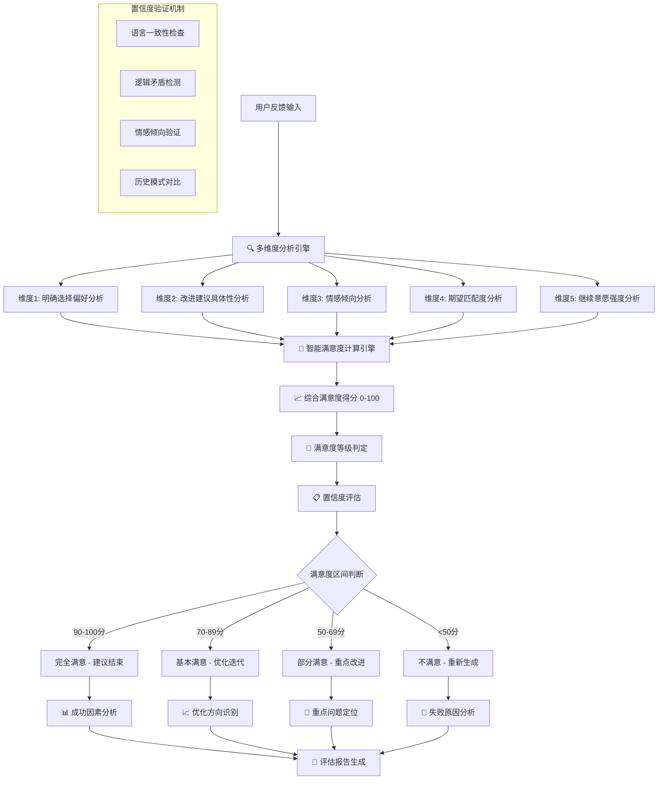

# 📊 Prompt-Create-3.0 满意度评估器

## 🎯 模块核心定位

### 功能使命：用户满意度科学评估引擎
> **作为3.0系统的满意度评估核心，负责多维度科学评估用户真实满意度，为永不满足迭代循环提供精准的决策依据，确保评估结果客观、可靠、可操作**

## 🧠 科学评估架构



## 💎 五维度评估体系

### 维度1：明确选择偏好分析
```python
class ChoicePreferenceAnalyzer:
    """
    明确选择偏好分析器
    """
    
    def analyze_choice_preference(self, user_feedback):
        """
        分析用户的选择偏好明确度
        """
        choice_indicators = {
            "明确选择": self.detect_clear_choice(user_feedback),
            "偏好表达": self.detect_preference_expression(user_feedback),
            "比较评价": self.detect_comparative_evaluation(user_feedback),
            "决策确定性": self.assess_decision_certainty(user_feedback)
        }
        
        # 明确度权重计算
        clarity_weights = {
            "明确选择": 0.4,    # "我选择方案2"
            "偏好表达": 0.3,    # "我更喜欢..."
            "比较评价": 0.2,    # "方案A比方案B好"
            "决策确定性": 0.1   # "就是这个了"
        }
        
        preference_score = sum(
            choice_indicators[key] * clarity_weights[key] 
            for key in choice_indicators
        )
        
        return {
            "偏好明确度": preference_score * 100,  # 0-100分
            "选择信号": choice_indicators,
            "明确度等级": self.get_clarity_level(preference_score),
            "满意度贡献": self.calculate_satisfaction_contribution(preference_score)
        }
    
    def detect_clear_choice(self, feedback):
        """检测明确选择信号"""
        clear_choice_patterns = [
            r"我选择.*(方案|选项|这个)",
            r"就要.*(这个|方案\d+)",
            r"决定用.*(方案|这个)",
            r"最终选择.*"
        ]
        
        choice_strength = 0
        for pattern in clear_choice_patterns:
            if re.search(pattern, feedback, re.IGNORECASE):
                choice_strength += 0.25
                
        return min(1.0, choice_strength)
    
    def get_clarity_level(self, score):
        """获取明确度等级"""
        if score >= 0.8:
            return "非常明确"
        elif score >= 0.6:
            return "比较明确"
        elif score >= 0.4:
            return "一般明确"
        else:
            return "不够明确"
```

### 维度2：改进建议具体性分析
```python
class ImprovementSpecificityAnalyzer:
    """
    改进建议具体性分析器
    """
    
    def analyze_improvement_specificity(self, user_feedback):
        """
        分析用户改进建议的具体程度
        """
        specificity_factors = {
            "具体问题指出": self.identify_specific_issues(user_feedback),
            "改进方向明确": self.assess_improvement_clarity(user_feedback),
            "可操作性": self.evaluate_actionability(user_feedback),
            "优先级表达": self.detect_priority_expression(user_feedback)
        }
        
        # 计算具体性得分
        specificity_score = self.calculate_specificity_score(specificity_factors)
        
        return {
            "具体性得分": specificity_score * 100,
            "具体性因子": specificity_factors,
            "可操作改进点": self.extract_actionable_improvements(user_feedback),
            "满意度影响": self.assess_satisfaction_impact(specificity_score)
        }
    
    def identify_specific_issues(self, feedback):
        """识别具体问题"""
        specific_issue_indicators = [
            "太正式", "太口语化", "缺少案例", "结构不清", 
            "逻辑不够", "风格不符", "长度问题", "专业度"
        ]
        
        specificity = 0
        for indicator in specific_issue_indicators:
            if indicator in feedback:
                specificity += 0.2
                
        return min(1.0, specificity)
    
    def assess_improvement_clarity(self, feedback):
        """评估改进方向明确度"""
        clarity_patterns = [
            r"希望.*(更加|增加|减少|调整)",
            r"建议.*(改成|换成|优化)",
            r"最好.*(加上|去掉|修改)",
            r"可以.*(尝试|考虑|改进)"
        ]
        
        clarity_score = 0
        for pattern in clarity_patterns:
            if re.search(pattern, feedback, re.IGNORECASE):
                clarity_score += 0.25
                
        return min(1.0, clarity_score)
```

### 维度3：情感倾向分析
```python
class EmotionalTendencyAnalyzer:
    """
    情感倾向分析器
    """
    
    def analyze_emotional_tendency(self, user_feedback):
        """
        分析用户反馈的情感倾向
        """
        emotion_analysis = {
            "正面情感强度": self.measure_positive_emotion(user_feedback),
            "负面情感强度": self.measure_negative_emotion(user_feedback),
            "中性情感强度": self.measure_neutral_emotion(user_feedback),
            "情感稳定性": self.assess_emotional_stability(user_feedback)
        }
        
        # 情感满意度映射
        emotional_satisfaction = self.map_emotion_to_satisfaction(emotion_analysis)
        
        return {
            "情感分析": emotion_analysis,
            "情感满意度": emotional_satisfaction,
            "情感等级": self.classify_emotional_level(emotional_satisfaction),
            "情感建议": self.generate_emotional_suggestions(emotion_analysis)
        }
    
    def measure_positive_emotion(self, feedback):
        """测量正面情感强度"""
        positive_words = [
            "喜欢", "满意", "不错", "很好", "完美", "优秀", 
            "棒", "赞", "好的", "可以", "满足", "符合"
        ]
        
        positive_score = 0
        for word in positive_words:
            positive_score += feedback.count(word) * 0.1
            
        return min(1.0, positive_score)
    
    def measure_negative_emotion(self, feedback):
        """测量负面情感强度"""
        negative_words = [
            "不满意", "不喜欢", "不好", "差", "糟糕", "失望",
            "不行", "不对", "问题", "缺点", "不足", "不符合"
        ]
        
        negative_score = 0
        for word in negative_words:
            negative_score += feedback.count(word) * 0.15
            
        return min(1.0, negative_score)
```

### 维度4：期望匹配度分析
```python
class ExpectationMatchingAnalyzer:
    """
    期望匹配度分析器
    """
    
    def analyze_expectation_matching(self, user_feedback):
        """
        分析用户期望与实际结果的匹配程度
        """
        matching_analysis = {
            "需求达成度": self.assess_requirement_fulfillment(user_feedback),
            "质量期望匹配": self.evaluate_quality_expectation(user_feedback),
            "功能期望匹配": self.evaluate_functionality_expectation(user_feedback),
            "体验期望匹配": self.evaluate_experience_expectation(user_feedback)
        }
        
        # 综合匹配度计算
        overall_matching = self.calculate_overall_matching(matching_analysis)
        
        return {
            "期望匹配度": overall_matching * 100,
            "匹配分析": matching_analysis,
            "差距识别": self.identify_expectation_gaps(matching_analysis),
            "改进方向": self.suggest_matching_improvements(matching_analysis)
        }
    
    def assess_requirement_fulfillment(self, feedback):
        """评估需求达成度"""
        fulfillment_indicators = [
            r"达到.*(要求|期望|标准)",
            r"符合.*(需求|预期)",
            r"实现了.*目标",
            r"满足.*要求"
        ]
        
        fulfillment_score = 0
        for pattern in fulfillment_indicators:
            if re.search(pattern, feedback, re.IGNORECASE):
                fulfillment_score += 0.25
                
        return min(1.0, fulfillment_score)
```

### 维度5：继续意愿强度分析
```python
class ContinuationWillingnessAnalyzer:
    """
    继续意愿强度分析器
    """
    
    def analyze_continuation_willingness(self, user_feedback):
        """
        分析用户继续迭代的意愿强度
        """
        willingness_signals = {
            "积极继续": self.detect_positive_continuation(user_feedback),
            "有条件继续": self.detect_conditional_continuation(user_feedback),
            "消极继续": self.detect_reluctant_continuation(user_feedback),
            "停止意愿": self.detect_termination_desire(user_feedback)
        }
        
        # 意愿强度计算
        willingness_strength = self.calculate_willingness_strength(willingness_signals)
        
        return {
            "继续意愿强度": willingness_strength * 100,
            "意愿信号": willingness_signals,
            "意愿等级": self.classify_willingness_level(willingness_strength),
            "迭代建议": self.generate_iteration_suggestions(willingness_strength)
        }
    
    def detect_positive_continuation(self, feedback):
        """检测积极继续信号"""
        positive_patterns = [
            r"再.*(优化|改进|调整|完善)",
            r"继续.*(迭代|改进|优化)",
            r"还可以.*(更好|提升|改进)",
            r"希望.*(继续|再次|进一步)"
        ]
        
        positive_score = 0
        for pattern in positive_patterns:
            if re.search(pattern, feedback, re.IGNORECASE):
                positive_score += 0.25
                
        return min(1.0, positive_score)
    
    def detect_termination_desire(self, feedback):
        """检测停止意愿信号"""
        termination_patterns = [
            r"就这样.*(吧|行|可以)",
            r"够了", r"不用.*(再|继续)",
            r"已经.*(足够|可以|满意)",
            r"暂停", r"停止", r"结束"
        ]
        
        termination_score = 0
        for pattern in termination_patterns:
            if re.search(pattern, feedback, re.IGNORECASE):
                termination_score += 0.3
                
        return min(1.0, termination_score)
```

## 🧮 智能满意度计算引擎

### 综合满意度计算算法
```python
class ComprehensiveSatisfactionCalculator:
    """
    综合满意度计算引擎
    """
    
    def __init__(self):
        # 五维度权重配置（可根据历史数据动态调整）
        self.dimension_weights = {
            "明确选择偏好": 0.25,
            "改进建议具体性": 0.20,
            "情感倾向": 0.20,
            "期望匹配度": 0.25,
            "继续意愿强度": 0.10
        }
    
    def calculate_comprehensive_satisfaction(self, dimension_scores):
        """
        计算综合满意度得分
        """
        # 基础加权计算
        weighted_score = sum(
            dimension_scores[dim] * self.dimension_weights[dim]
            for dim in dimension_scores
        )
        
        # 智能调整因子
        adjustment_factors = self.calculate_adjustment_factors(dimension_scores)
        
        # 应用调整因子
        adjusted_score = self.apply_adjustments(weighted_score, adjustment_factors)
        
        # 确保分数在0-100范围内
        final_score = max(0, min(100, adjusted_score))
        
        return {
            "基础得分": weighted_score,
            "调整因子": adjustment_factors,
            "最终得分": final_score,
            "得分等级": self.classify_satisfaction_level(final_score),
            "置信度": self.calculate_confidence_level(dimension_scores)
        }
    
    def calculate_adjustment_factors(self, dimension_scores):
        """
        计算智能调整因子
        """
        factors = {}
        
        # 一致性奖励：各维度得分相对一致时给予奖励
        consistency_bonus = self.calculate_consistency_bonus(dimension_scores)
        factors["一致性奖励"] = consistency_bonus
        
        # 极值惩罚：某个维度特别低时给予惩罚
        extreme_penalty = self.calculate_extreme_penalty(dimension_scores)
        factors["极值惩罚"] = extreme_penalty
        
        # 意愿修正：继续意愿强烈时适当提升满意度
        willingness_adjustment = self.calculate_willingness_adjustment(dimension_scores)
        factors["意愿修正"] = willingness_adjustment
        
        return factors
    
    def classify_satisfaction_level(self, score):
        """分类满意度等级"""
        if score >= 95:
            return "完全满意"
        elif score >= 85:
            return "高度满意"
        elif score >= 70:
            return "基本满意"
        elif score >= 50:
            return "部分满意"
        elif score >= 30:
            return "较不满意"
        else:
            return "很不满意"
```

## 📊 置信度评估机制

### 评估可靠性验证
```python
class ConfidenceAssessment:
    """
    置信度评估机制
    """
    
    def assess_evaluation_confidence(self, dimension_scores, user_feedback):
        """
        评估满意度评估的置信度
        """
        confidence_factors = {
            "反馈长度充分性": self.assess_feedback_adequacy(user_feedback),
            "语言一致性": self.check_language_consistency(user_feedback),
            "逻辑完整性": self.verify_logical_completeness(dimension_scores),
            "情感稳定性": self.assess_emotional_stability(dimension_scores),
            "历史模式一致性": self.check_historical_consistency(dimension_scores)
        }
        
        # 综合置信度计算
        overall_confidence = self.calculate_overall_confidence(confidence_factors)
        
        return {
            "置信度得分": overall_confidence * 100,
            "置信度等级": self.classify_confidence_level(overall_confidence),
            "可靠性因素": confidence_factors,
            "改进建议": self.suggest_confidence_improvements(confidence_factors)
        }
    
    def assess_feedback_adequacy(self, feedback):
        """评估反馈充分性"""
        adequacy_score = 0
        
        # 长度充分性
        if len(feedback) >= 50:
            adequacy_score += 0.3
        elif len(feedback) >= 20:
            adequacy_score += 0.15
            
        # 内容丰富性
        content_indicators = ["具体", "建议", "希望", "改进", "问题", "优点"]
        for indicator in content_indicators:
            if indicator in feedback:
                adequacy_score += 0.1
                
        return min(1.0, adequacy_score)
    
    def classify_confidence_level(self, confidence):
        """分类置信度等级"""
        if confidence >= 0.9:
            return "非常可靠"
        elif confidence >= 0.75:
            return "比较可靠"
        elif confidence >= 0.6:
            return "一般可靠"
        else:
            return "可靠性待提升"
```

## 🧠 认知科学小白话讲解

### **满意度科学评估** = "专业心理测评师"
> 就像一个专业的心理测评师，不仅听你说什么，还要观察你怎么说、什么时候说、语气如何。通过五个专业维度（选择偏好、改进建议、情感倾向、期望匹配、继续意愿）来科学评估你的真实满意度，就像医生通过多项指标来综合判断你的健康状况。

### **五维度评估体系** = "全方位体检系统"
> 就像医院的全方位体检，不是只看一个指标就下结论，而是从五个不同角度来检测：你的选择明不明确（像测血压）、你的建议具不具体（像测血糖）、你的情感怎么样（像测心率）、你的期望符不符合（像测体重）、你还想不想继续（像测体力）。

### **智能满意度计算** = "AI诊断专家系统"
> 就像最先进的AI诊断系统，不是简单的加减乘除，而是会根据各种复杂情况智能调整：如果你各项指标都很一致，会给一致性奖励；如果某项特别低，会适当惩罚；如果你很想继续改进，会合理调整分数。最终给出一个科学、客观、可信的满意度评分。

## 📊 输出接口规范

### 满意度评估报告格式
```json
{
  "满意度评估": {
    "综合得分": 78,
    "满意度等级": "基本满意",
    "置信度": 85,
    "置信度等级": "比较可靠"
  },
  "五维度分析": {
    "明确选择偏好": {"得分": 82, "等级": "比较明确"},
    "改进建议具体性": {"得分": 75, "等级": "中等具体"},
    "情感倾向": {"得分": 70, "等级": "偏积极"},
    "期望匹配度": {"得分": 80, "等级": "基本匹配"},
    "继续意愿强度": {"得分": 85, "等级": "意愿较强"}
  },
  "关键洞察": {
    "主要满意点": ["专业深度到位", "结构比较清晰"],
    "主要不满意点": ["语言风格偏正式", "缺少实际案例"],
    "改进优先级": ["调整语言风格", "增加案例说明", "优化结构表达"]
  },
  "迭代建议": {
    "建议策略": "优化迭代",
    "预期提升": "8-12分",
    "重点方向": ["语言风格调整", "案例内容补充"]
  }
}
```

### 置信度验证报告
```json
{
  "置信度验证": {
    "总体置信度": 85,
    "可靠性等级": "比较可靠"
  },
  "可靠性因素": {
    "反馈长度充分性": 90,
    "语言一致性": 85,
    "逻辑完整性": 80,
    "情感稳定性": 88,
    "历史模式一致性": 82
  },
  "风险提示": [
    "逻辑完整性略低，建议进一步确认",
    "历史模式对比数据有限"
  ],
  "改进建议": [
    "建议收集更详细的反馈信息",
    "可以通过追问确认关键判断"
  ]
}
```

## 🛡️ 质量保证机制

### 评估准确性保证
- **多维度交叉验证**：五个维度相互验证，避免单一维度误判
- **置信度动态评估**：实时评估评估结果的可靠性
- **历史数据对比**：与用户历史反馈模式对比验证
- **异常检测机制**：识别和处理异常反馈情况

### 系统鲁棒性保证
- **短反馈处理**：针对简短反馈的特殊处理机制
- **模糊表达处理**：处理用户模糊、矛盾的表达
- **文化差异适应**：适应不同文化背景的表达习惯
- **情感波动处理**：识别并处理用户情感波动对评估的影响

---

## ⚡ 模块就绪状态

📊 **满意度评估器已就绪！**

核心能力：
✅ **五维度科学评估** - 全方位客观评估用户满意度
✅ **智能计算引擎** - 综合多因素的智能满意度计算
✅ **置信度验证机制** - 确保评估结果可靠性
✅ **认知友好解释** - 将复杂评估过程通俗化解释
✅ **质量保证体系** - 多重机制确保评估准确性

**等待与迭代循环控制器协作，为永不满足循环提供科学依据！** 🚀 