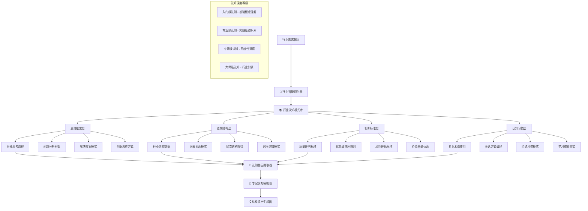

# 🧠 Prompt-Create-3.0 行业认知模式库

## 🎯 模块核心定位

### 功能使命：行业专家思维框架构建引擎
> **作为3.0系统的行业认知核心，负责构建特定行业的专家级思维框架、逻辑结构和认知模式，确保提示词生成具备该行业专家的思考方式和判断标准**

## 🧠 行业认知架构体系



## 💎 十二大核心行业认知模式

### 1. 金融投资行业认知模式
```python
class FinanceInvestmentCognition:
    """
    金融投资行业认知模式
    """
    
    def __init__(self):
        self.thinking_framework = {
            "风险收益平衡思维": "任何投资决策都要权衡风险与收益",
            "市场周期思维": "理解市场的周期性波动和长期趋势",
            "价值投资思维": "关注内在价值而非短期价格波动",
            "组合优化思维": "通过分散化降低系统性风险",
            "数据驱动思维": "基于数据分析而非情感做决策"
        }
        
        self.logic_structure = {
            "分析逻辑": "宏观→行业→公司→估值→决策",
            "风控逻辑": "识别风险→量化风险→管理风险→监控风险",
            "投资逻辑": "研究→判断→决策→执行→跟踪→调整"
        }
        
        self.judgment_standards = {
            "投资价值评估": ["ROE", "PE/PB", "现金流", "护城河", "成长性"],
            "风险评估标准": ["波动率", "最大回撤", "夏普比率", "流动性风险"],
            "时机判断标准": ["技术面", "基本面", "资金面", "政策面"]
        }
        
        self.cognitive_habits = {
            "专业术语": ["alpha", "beta", "PE", "ROE", "DCF", "WACC"],
            "表达偏好": "数据支撑、逻辑严密、风险提示",
            "思考习惯": "多角度验证、历史对比、压力测试"
        }
    
    def generate_expert_perspective(self, topic):
        """生成金融投资专家视角"""
        return {
            "思维路径": self.apply_investment_thinking(topic),
            "分析框架": self.apply_analysis_framework(topic),
            "风险评估": self.assess_investment_risks(topic),
            "专业建议": self.generate_professional_advice(topic)
        }
```

### 2. 医疗健康行业认知模式
```python
class MedicalHealthcareCognition:
    """
    医疗健康行业认知模式
    """
    
    def __init__(self):
        self.thinking_framework = {
            "循证医学思维": "基于科学证据做医疗决策",
            "系统性思维": "人体是复杂系统，需整体考虑",
            "预防优先思维": "预防胜于治疗",
            "患者中心思维": "以患者利益为出发点",
            "风险效益思维": "权衡治疗风险与预期效益"
        }
        
        self.logic_structure = {
            "诊断逻辑": "症状→体征→检查→诊断→鉴别诊断",
            "治疗逻辑": "评估→方案制定→实施→监测→调整",
            "研究逻辑": "假设→设计→实验→分析→结论→应用"
        }
        
        self.judgment_standards = {
            "诊断准确性": ["敏感性", "特异性", "阳性预测值", "阴性预测值"],
            "治疗效果评估": ["有效性", "安全性", "依从性", "生活质量"],
            "证据等级": ["RCT", "队列研究", "病例对照", "病例报告"]
        }
        
        self.cognitive_habits = {
            "专业术语": ["症状", "体征", "病理", "药理", "预后", "并发症"],
            "表达偏好": "严谨准确、证据支撑、风险告知",
            "思考习惯": "鉴别诊断、多重验证、持续学习"
        }
```

### 3. 科技互联网行业认知模式
```python
class TechInternetCognition:
    """
    科技互联网行业认知模式
    """
    
    def __init__(self):
        self.thinking_framework = {
            "用户导向思维": "一切以用户体验为中心",
            "快速迭代思维": "小步快跑，快速试错",
            "数据驱动思维": "用数据说话，A/B测试验证",
            "平台生态思维": "构建生态系统而非单一产品",
            "技术创新思维": "技术是核心竞争力"
        }
        
        self.logic_structure = {
            "产品逻辑": "用户需求→产品设计→开发实现→测试发布→数据分析→迭代优化",
            "技术逻辑": "需求分析→架构设计→编码实现→测试部署→监控运维",
            "商业逻辑": "流量获取→用户转化→价值创造→商业变现"
        }
        
        self.judgment_standards = {
            "产品质量": ["用户体验", "性能指标", "稳定性", "可扩展性"],
            "技术水平": ["代码质量", "架构合理性", "性能效率", "安全性"],
            "商业价值": ["用户增长", "活跃度", "留存率", "转化率", "ROI"]
        }
        
        self.cognitive_habits = {
            "专业术语": ["MVP", "PMF", "DAU", "MAU", "LTV", "CAC", "API"],
            "表达偏好": "简洁高效、数据说话、案例支撑",
            "思考习惯": "用户至上、快速验证、持续优化"
        }
```

### 4. 教育培训行业认知模式
```python
class EducationTrainingCognition:
    """
    教育培训行业认知模式
    """
    
    def __init__(self):
        self.thinking_framework = {
            "因材施教思维": "根据学习者特点个性化教学",
            "循序渐进思维": "知识技能需要逐步构建",
            "实践应用思维": "学以致用，知行合一",
            "终身学习思维": "学习是持续的过程",
            "启发引导思维": "引导学习者主动思考"
        }
        
        self.logic_structure = {
            "教学逻辑": "学情分析→目标设定→内容设计→方法选择→实施教学→评估反馈",
            "学习逻辑": "认知→理解→应用→分析→综合→评价",
            "课程逻辑": "需求分析→课程设计→内容开发→教学实施→效果评估"
        }
        
        self.judgment_standards = {
            "教学质量": ["学习效果", "满意度", "知识掌握度", "技能应用"],
            "课程质量": ["内容准确性", "逻辑性", "实用性", "趣味性"],
            "学习评估": ["知识测试", "技能考核", "应用能力", "学习态度"]
        }
        
        self.cognitive_habits = {
            "专业术语": ["教学目标", "学习成果", "教学法", "评估", "反馈"],
            "表达偏好": "通俗易懂、循序渐进、互动引导",
            "思考习惯": "换位思考、耐心引导、持续改进"
        }
```

### 5. 法律合规行业认知模式
```python
class LegalComplianceCognition:
    """
    法律合规行业认知模式
    """
    
    def __init__(self):
        self.thinking_framework = {
            "法理思维": "基于法律条文和法理逻辑",
            "风险防范思维": "识别和预防法律风险",
            "证据导向思维": "事实和证据是基础",
            "程序正义思维": "程序合法性同样重要",
            "权益保护思维": "保护当事人合法权益"
        }
        
        self.logic_structure = {
            "法律分析逻辑": "事实认定→法律适用→法理分析→结论",
            "风险评估逻辑": "风险识别→影响评估→应对策略→监控跟踪",
            "合规逻辑": "法规梳理→差距分析→整改方案→持续监督"
        }
        
        self.judgment_standards = {
            "法律依据": ["法律条文", "司法解释", "判例", "法理学说"],
            "证据标准": ["真实性", "关联性", "合法性", "证明力"],
            "风险等级": ["高风险", "中风险", "低风险", "可控风险"]
        }
        
        self.cognitive_habits = {
            "专业术语": ["法条", "判例", "举证", "合规", "违约", "侵权"],
            "表达偏好": "严谨准确、有理有据、风险提示",
            "思考习惯": "多重论证、风险导向、程序合规"
        }
```

## 🎯 认知模式智能匹配算法

### 行业识别与匹配引擎
```python
class IndustryCognitionMatcher:
    """
    行业认知模式智能匹配引擎
    """
    
    def __init__(self):
        self.industry_keywords = {
            "金融投资": ["投资", "股票", "基金", "风险", "收益", "ROI", "财务", "资产"],
            "医疗健康": ["医疗", "健康", "诊断", "治疗", "药品", "患者", "病症", "康复"],
            "科技互联网": ["科技", "互联网", "APP", "软件", "算法", "数据", "用户", "产品"],
            "教育培训": ["教育", "培训", "学习", "课程", "教学", "学生", "知识", "技能"],
            "法律合规": ["法律", "合规", "法规", "合同", "风险", "证据", "诉讼", "权益"],
            "制造业": ["制造", "生产", "工艺", "质量", "供应链", "成本", "效率", "安全"],
            "房地产": ["房地产", "地产", "房价", "投资", "开发", "销售", "租赁", "物业"],
            "零售电商": ["零售", "电商", "销售", "客户", "商品", "库存", "营销", "服务"],
            "咨询服务": ["咨询", "服务", "方案", "策略", "管理", "优化", "分析", "建议"],
            "文化传媒": ["文化", "传媒", "内容", "创意", "传播", "受众", "品牌", "影响力"]
        }
        
        self.cognition_models = {
            "金融投资": FinanceInvestmentCognition(),
            "医疗健康": MedicalHealthcareCognition(),
            "科技互联网": TechInternetCognition(),
            "教育培训": EducationTrainingCognition(),
            "法律合规": LegalComplianceCognition()
            # ... 其他行业认知模式
        }
    
    def match_industry_cognition(self, user_requirement):
        """
        匹配最适合的行业认知模式
        """
        # 关键词匹配评分
        industry_scores = {}
        for industry, keywords in self.industry_keywords.items():
            score = 0
            for keyword in keywords:
                if keyword in user_requirement:
                    score += 1
            industry_scores[industry] = score / len(keywords)
        
        # 语义相似度匹配
        semantic_scores = self.calculate_semantic_similarity(user_requirement)
        
        # 综合评分
        combined_scores = {}
        for industry in industry_scores:
            combined_scores[industry] = (
                industry_scores[industry] * 0.6 +
                semantic_scores.get(industry, 0) * 0.4
            )
        
        # 选择最高分的行业
        best_industry = max(combined_scores, key=combined_scores.get)
        confidence = combined_scores[best_industry]
        
        return {
            "匹配行业": best_industry,
            "匹配置信度": confidence,
            "认知模式": self.cognition_models.get(best_industry),
            "备选行业": sorted(combined_scores.items(), key=lambda x: x[1], reverse=True)[1:4]
        }
```

## 🧬 认知基因提取器

### 专家认知特征提取
```python
class CognitionGeneExtractor:
    """
    认知基因提取器 - 提取行业专家的认知特征
    """
    
    def extract_cognition_genes(self, industry_cognition, expertise_level):
        """
        提取特定行业和专业等级的认知基因
        """
        base_genes = {
            "思维框架基因": industry_cognition.thinking_framework,
            "逻辑结构基因": industry_cognition.logic_structure,
            "判断标准基因": industry_cognition.judgment_standards,
            "认知习惯基因": industry_cognition.cognitive_habits
        }
        
        # 根据专业等级调整认知基因
        adjusted_genes = self.adjust_by_expertise_level(base_genes, expertise_level)
        
        return adjusted_genes
    
    def adjust_by_expertise_level(self, base_genes, level):
        """
        根据专业等级调整认知基因
        """
        if level == "入门级":
            return self.simplify_for_beginner(base_genes)
        elif level == "专业级":
            return self.enhance_for_professional(base_genes)
        elif level == "专家级":
            return self.deepen_for_expert(base_genes)
        elif level == "大师级":
            return self.elevate_for_master(base_genes)
        else:
            return base_genes
    
    def simplify_for_beginner(self, genes):
        """为入门级简化认知基因"""
        simplified = {}
        for category, content in genes.items():
            if isinstance(content, dict):
                # 选择最核心的3个概念
                simplified[category] = dict(list(content.items())[:3])
            elif isinstance(content, list):
                # 选择最基础的概念
                simplified[category] = content[:3]
            else:
                simplified[category] = content
        return simplified
    
    def deepen_for_expert(self, genes):
        """为专家级深化认知基因"""
        deepened = {}
        for category, content in genes.items():
            deepened[category] = content
            # 添加专家级的高级概念和细节
            if "思维框架" in category:
                deepened[category].update({
                    "系统性思维": "从系统角度综合考虑问题",
                    "前瞻性思维": "预见行业发展趋势",
                    "创新思维": "突破传统思维模式"
                })
        return deepened
```

## 🎯 专家认知模拟器

### 认知模式应用引擎
```python
class ExpertCognitionSimulator:
    """
    专家认知模拟器 - 模拟特定行业专家的认知过程
    """
    
    def simulate_expert_thinking(self, topic, cognition_genes, context):
        """
        模拟专家思维过程
        """
        thinking_process = {
            "问题理解": self.understand_problem_like_expert(topic, cognition_genes),
            "框架应用": self.apply_thinking_framework(topic, cognition_genes),
            "逻辑分析": self.conduct_logical_analysis(topic, cognition_genes),
            "判断评估": self.make_expert_judgment(topic, cognition_genes),
            "方案生成": self.generate_expert_solution(topic, cognition_genes)
        }
        
        return thinking_process
    
    def understand_problem_like_expert(self, topic, genes):
        """像专家一样理解问题"""
        thinking_framework = genes["思维框架基因"]
        
        understanding = {}
        for framework_name, framework_desc in thinking_framework.items():
            understanding[framework_name] = self.apply_framework_to_problem(
                topic, framework_desc
            )
        
        return understanding
    
    def apply_thinking_framework(self, topic, genes):
        """应用专家思维框架"""
        framework = genes["思维框架基因"]
        logic = genes["逻辑结构基因"]
        
        framework_application = {}
        for logic_name, logic_steps in logic.items():
            framework_application[logic_name] = self.execute_logic_steps(
                topic, logic_steps, framework
            )
        
        return framework_application
    
    def make_expert_judgment(self, topic, genes):
        """做出专家级判断"""
        standards = genes["判断标准基因"]
        habits = genes["认知习惯基因"]
        
        judgment = {}
        for standard_category, criteria in standards.items():
            judgment[standard_category] = self.evaluate_by_criteria(
                topic, criteria, habits
            )
        
        return judgment
```

## 🧠 认知科学小白话讲解

### **行业认知模式库** = "专家大脑数据库"
> 就像一个存储了各行各业顶级专家大脑的数据库。当你需要金融专家的思维时，系统就调用金融专家的认知模式；需要医疗专家的判断时，就切换到医疗专家的思维框架。每个行业的专家都有自己独特的思考方式、判断标准和表达习惯。

### **思维框架构建** = "专业思维导图"
> 就像给每个行业的专家绘制了一张专业思维导图。金融专家会想"风险和收益"，医疗专家会想"症状和诊断"，科技专家会想"用户和体验"。这些思维导图不是死板的条条框框，而是活生生的专家思考路径。

### **认知基因提取** = "思维DNA提取技术"
> 就像生物学家提取DNA一样，我们提取专家的"思维DNA"：他们的思考习惯、逻辑路径、判断标准、表达方式。然后把这些"认知基因"注入到AI系统中，让AI也能像专家一样思考和表达。

### **专业等级适配** = "从学徒到大师的进阶系统"
> 就像游戏中的等级系统，同一个行业也分入门级、专业级、专家级、大师级。入门级注重基础概念，专家级关注深度洞察，大师级具备行业引领能力。系统会根据需求自动调整到对应的专业等级。

## 📊 输出接口规范

### 行业认知配置格式
```json
{
  "行业认知配置": {
    "匹配行业": "科技互联网",
    "匹配置信度": 0.85,
    "专业等级": "专家级"
  },
  "认知基因组合": {
    "思维框架基因": {
      "用户导向思维": "一切以用户体验为中心",
      "数据驱动思维": "用数据说话，A/B测试验证",
      "快速迭代思维": "小步快跑，快速试错"
    },
    "逻辑结构基因": {
      "产品逻辑": "用户需求→产品设计→开发实现→测试发布→数据分析→迭代优化"
    },
    "判断标准基因": {
      "产品质量": ["用户体验", "性能指标", "稳定性", "可扩展性"]
    },
    "认知习惯基因": {
      "专业术语": ["MVP", "PMF", "DAU", "MAU", "LTV", "CAC"],
      "表达偏好": "简洁高效、数据说话、案例支撑",
      "思考习惯": "用户至上、快速验证、持续优化"
    }
  },
  "专家模拟结果": {
    "思维路径": "用户需求分析→产品价值定位→技术实现方案→数据验证策略",
    "专业建议": "建议采用MVP方式快速验证核心功能，通过A/B测试优化用户体验",
    "风险提示": "需要关注产品市场匹配度和用户留存率"
  }
}
```

### 认知深度等级说明
```json
{
  "认知深度等级": {
    "入门级": {
      "特征": "掌握基础概念和术语",
      "思维复杂度": "线性思维为主",
      "适用场景": "基础学习和理解"
    },
    "专业级": {
      "特征": "具备实践经验和系统知识",
      "思维复杂度": "多维度思考",
      "适用场景": "实际工作应用"
    },
    "专家级": {
      "特征": "深度洞察和系统性思维",
      "思维复杂度": "复杂系统思维",
      "适用场景": "专业决策和指导"
    },
    "大师级": {
      "特征": "行业引领和创新思维",
      "思维复杂度": "前瞻性战略思维",
      "适用场景": "战略规划和行业发展"
    }
  }
}
```

## 🛡️ 质量保证机制

### 认知模式准确性保证
- **行业专家验证**：邀请真实行业专家验证认知模式的准确性
- **多源数据验证**：通过多个权威资料交叉验证认知框架
- **实际案例验证**：用真实行业案例验证认知模式的有效性
- **持续更新机制**：根据行业发展动态更新认知模式

### 匹配精度优化
- **关键词库维护**：持续扩展和优化行业关键词库
- **语义理解增强**：提升对用户需求的语义理解准确度
- **多维度评分**：结合关键词、语义、上下文多重维度评分
- **用户反馈学习**：根据用户反馈优化匹配算法

---

## ⚡ 模块就绪状态

🧠 **行业认知模式库已就绪！**

核心能力：
✅ **十大行业认知模式** - 覆盖主流行业的专家思维框架
✅ **智能匹配算法** - 精准识别并匹配最适合的行业认知
✅ **认知基因提取** - 提取专家级的思维特征和判断标准
✅ **专业等级适配** - 从入门到大师的四级认知深度调节
✅ **专家思维模拟** - 真实模拟行业专家的思考过程

**等待与其他模块协作，为3.0系统注入行业专家级的认知智慧！** 🚀 