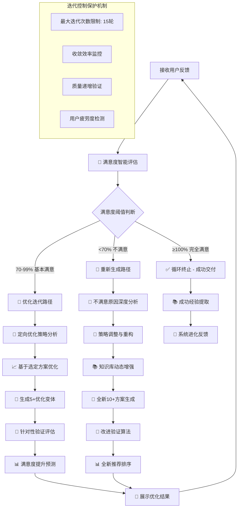

# 🔄 Prompt-Create-3.0 迭代循环控制器

## 🎯 模块核心定位

### 功能使命：永不满足的智能迭代循环机制
> **作为3.0系统的迭代控制核心，负责管理"永不满足"的循环机制，确保持续迭代直到用户100%满意，同时智能控制迭代策略和收敛效率**

## 🧠 永不满足循环架构



## 💎 核心功能模块

### 1. 满意度智能评估引擎
```python
class SatisfactionEvaluationEngine:
    """
    用户满意度智能评估引擎
    """
    
    def evaluate_user_satisfaction(self, user_feedback):
        """
        综合评估用户满意度
        """
        satisfaction_factors = {
            "明确选择偏好": self.analyze_choice_preference(user_feedback),
            "改进建议具体性": self.analyze_improvement_specificity(user_feedback),
            "情感倾向分析": self.analyze_emotional_tendency(user_feedback),
            "期望匹配度": self.analyze_expectation_matching(user_feedback),
            "继续意愿强度": self.analyze_continuation_willingness(user_feedback)
        }
        
        # 智能满意度计算
        satisfaction_score = self.calculate_comprehensive_satisfaction(satisfaction_factors)
        
        # 满意度置信度评估
        confidence_level = self.assess_evaluation_confidence(satisfaction_factors)
        
        return {
            "满意度得分": satisfaction_score,  # 0-100分
            "置信度": confidence_level,      # 0-100%
            "评估依据": satisfaction_factors,
            "满意度等级": self.get_satisfaction_level(satisfaction_score),
            "后续建议": self.generate_next_step_suggestions(satisfaction_score, satisfaction_factors)
        }
    
    def get_satisfaction_level(self, score):
        """获取满意度等级"""
        if score >= 100:
            return "完全满意"
        elif score >= 85:
            return "高度满意"
        elif score >= 70:
            return "基本满意"
        elif score >= 50:
            return "部分满意"
        else:
            return "不满意"
```

### 2. 迭代策略智能选择器
```python
class IterationStrategySelector:
    """
    迭代策略智能选择器
    """
    
    def select_optimal_iteration_strategy(self, satisfaction_analysis, iteration_history):
        """
        基于满意度分析和历史迭代选择最优策略
        """
        satisfaction_score = satisfaction_analysis["满意度得分"]
        iteration_count = len(iteration_history)
        
        if satisfaction_score >= 100:
            return self.create_termination_strategy(satisfaction_analysis)
        elif satisfaction_score >= 70:
            return self.create_optimization_strategy(satisfaction_analysis, iteration_history)
        else:
            return self.create_regeneration_strategy(satisfaction_analysis, iteration_history)
    
    def create_optimization_strategy(self, satisfaction_analysis, iteration_history):
        """
        创建优化迭代策略
        """
        return {
            "策略类型": "优化迭代",
            "优化目标": self.identify_optimization_targets(satisfaction_analysis),
            "预期提升": self.predict_satisfaction_improvement(satisfaction_analysis),
            "变体数量": self.calculate_optimal_variants_count(satisfaction_analysis),
            "优化重点": self.determine_optimization_focus(satisfaction_analysis),
            "验证重点": self.determine_validation_focus(satisfaction_analysis)
        }
    
    def create_regeneration_strategy(self, satisfaction_analysis, iteration_history):
        """
        创建重新生成策略
        """
        failure_analysis = self.analyze_failure_patterns(iteration_history)
        
        return {
            "策略类型": "重新生成",
            "失败原因": failure_analysis["主要问题"],
            "调整方向": self.determine_adjustment_directions(failure_analysis),
            "生成策略变更": self.suggest_generation_changes(failure_analysis),
            "验证算法改进": self.suggest_validation_improvements(failure_analysis),
            "知识库增强": self.suggest_knowledge_enhancements(failure_analysis)
        }
```

### 3. 迭代进度监控器
```python
class IterationProgressMonitor:
    """
    迭代进度智能监控器
    """
    
    def monitor_iteration_progress(self, iteration_history, current_satisfaction):
        """
        监控迭代进度和收敛效率
        """
        progress_analysis = {
            "迭代效率": self.calculate_iteration_efficiency(iteration_history),
            "满意度趋势": self.analyze_satisfaction_trend(iteration_history),
            "收敛预测": self.predict_convergence(iteration_history),
            "质量递增验证": self.verify_quality_improvement(iteration_history),
            "用户疲劳度": self.assess_user_fatigue(iteration_history)
        }
        
        # 生成进度报告
        progress_report = self.generate_progress_report(progress_analysis)
        
        # 预警机制
        warnings = self.check_iteration_warnings(progress_analysis)
        
        return {
            "进度分析": progress_analysis,
            "进度报告": progress_report,
            "预警信息": warnings,
            "优化建议": self.generate_optimization_suggestions(progress_analysis)
        }
    
    def predict_convergence(self, iteration_history):
        """预测收敛情况"""
        if len(iteration_history) < 2:
            return {"预测": "数据不足", "预计剩余轮次": "未知"}
        
        satisfaction_progression = [item["满意度"] for item in iteration_history]
        improvement_rate = self.calculate_improvement_rate(satisfaction_progression)
        
        if improvement_rate > 5:
            estimated_rounds = max(1, (100 - satisfaction_progression[-1]) / improvement_rate)
            return {
                "预测": "良好收敛",
                "预计剩余轮次": int(estimated_rounds),
                "改进速度": improvement_rate
            }
        elif improvement_rate > 0:
            return {
                "预测": "缓慢收敛", 
                "预计剩余轮次": "5-8轮",
                "改进速度": improvement_rate
            }
        else:
            return {
                "预测": "收敛困难",
                "预计剩余轮次": "需要策略调整",
                "改进速度": improvement_rate
            }
```

### 4. 循环终止决策器
```python
class LoopTerminationDecider:
    """
    循环终止智能决策器
    """
    
    def should_terminate_loop(self, satisfaction_analysis, iteration_history):
        """
        判断是否应该终止迭代循环
        """
        termination_factors = {
            "满意度达标": satisfaction_analysis["满意度得分"] >= 100,
            "最大轮次": len(iteration_history) >= 15,
            "收敛停滞": self.detect_convergence_stagnation(iteration_history),
            "用户疲劳": self.detect_user_fatigue(iteration_history),
            "质量平台期": self.detect_quality_plateau(iteration_history)
        }
        
        # 终止决策逻辑
        if termination_factors["满意度达标"]:
            return {
                "应该终止": True,
                "终止原因": "用户完全满意",
                "终止类型": "成功终止"
            }
        elif termination_factors["最大轮次"]:
            return {
                "应该终止": True,
                "终止原因": "达到最大迭代次数",
                "终止类型": "保护性终止",
                "后续建议": self.suggest_alternative_approaches(iteration_history)
            }
        elif termination_factors["收敛停滞"] or termination_factors["用户疲劳"]:
            return {
                "应该终止": False,
                "建议操作": "策略重大调整",
                "调整建议": self.suggest_major_strategy_changes(termination_factors)
            }
        else:
            return {
                "应该终止": False,
                "继续迭代": True,
                "当前状态": "正常迭代中"
            }
```

## 🔄 永不满足循环执行流程

### 主循环控制逻辑
```python
def execute_never_satisfied_loop(initial_candidates, user_requirement, vertical_config):
    """
    执行永不满足迭代循环主流程
    """
    # 初始化
    iteration_count = 0
    iteration_history = []
    current_context = {
        "candidates": initial_candidates,
        "user_requirement": user_requirement,
        "vertical_config": vertical_config,
        "last_feedback": None
    }
    
    satisfaction_evaluator = SatisfactionEvaluationEngine()
    strategy_selector = IterationStrategySelector()
    progress_monitor = IterationProgressMonitor()
    termination_decider = LoopTerminationDecider()
    
    print("🎯 启动永不满足迭代循环系统...")
    print("🔄 目标：持续迭代直到您100%满意！")
    
    while iteration_count < 15:  # 最大保护轮次
        iteration_count += 1
        print(f"\n🔄 === 第{iteration_count}轮迭代开始 ===")
        
        # 展示当前最优方案
        display_current_recommendations(current_context["candidates"])
        
        # 收集用户反馈
        user_feedback = collect_detailed_user_feedback()
        
        # 智能满意度评估
        satisfaction_analysis = satisfaction_evaluator.evaluate_user_satisfaction(user_feedback)
        print(f"📊 当前满意度：{satisfaction_analysis['满意度得分']}% ({satisfaction_analysis['满意度等级']})")
        
        # 记录迭代历史
        iteration_record = {
            "轮次": iteration_count,
            "满意度": satisfaction_analysis["满意度得分"],
            "用户反馈": user_feedback,
            "改进方向": user_feedback.get("improvement_directions", [])
        }
        iteration_history.append(iteration_record)
        
        # 终止条件判断
        termination_decision = termination_decider.should_terminate_loop(
            satisfaction_analysis, iteration_history
        )
        
        if termination_decision["应该终止"]:
            if termination_decision["终止类型"] == "成功终止":
                print(f"✅ 恭喜！经过{iteration_count}轮迭代，您已100%满意！")
                return create_success_result(user_feedback, iteration_history)
            else:
                print(f"⚠️ 达到最大迭代次数({iteration_count}轮)，建议采用替代方案")
                return create_alternative_result(iteration_history, termination_decision)
        
        # 进度监控
        progress_info = progress_monitor.monitor_iteration_progress(
            iteration_history, satisfaction_analysis["满意度得分"]
        )
        display_progress_info(progress_info)
        
        # 选择迭代策略
        iteration_strategy = strategy_selector.select_optimal_iteration_strategy(
            satisfaction_analysis, iteration_history
        )
        
        print(f"🎯 采用策略：{iteration_strategy['策略类型']}")
        
        # 执行对应的迭代策略
        if iteration_strategy["策略类型"] == "优化迭代":
            current_context = execute_optimization_iteration(
                current_context, user_feedback, iteration_strategy
            )
        else:  # 重新生成
            current_context = execute_regeneration_iteration(
                current_context, user_feedback, iteration_strategy
            )
        
        print(f"🔄 第{iteration_count}轮迭代完成，准备下一轮...\n")
    
    # 如果到这里说明超出了最大轮次
    return create_maximum_iteration_result(iteration_history)
```

## 🧠 认知科学小白话讲解

### **永不满足迭代循环** = "完美主义私人助理"
> 就像一个永远追求完美的私人助理，绝不会因为"差不多就行了"而停下来。他会持续问你："还有什么不满意的地方吗？"、"这里可以再改进一下吗？"，直到你说"这就是完美的！"为止。而且他很聪明，能分析你的不满意是小问题（优化一下就好）还是大问题（需要重新开始）。

### **智能满意度评估** = "心理医生+数据分析师"
> 就像一个既懂心理学又懂数据分析的专家，不仅听你说什么，还能从你的语气、用词、反馈详细程度等多个维度科学评估你的真实满意度。比如你说"还行吧"，他能分析出这其实只有60分满意度，远未达到你内心的期望。

### **迭代策略智能选择** = "经验丰富的项目经理"
> 就像一个做过无数项目的资深经理，能根据你的反馈类型快速判断：这是需要微调优化，还是需要推倒重来？如果是微调，重点改哪里？如果是重来，哪些策略需要调整？每次都能选择最高效的改进路径。

## 📊 输出接口规范

### 迭代状态报告格式
```json
{
  "迭代轮次": 3,
  "当前满意度": 78,
  "满意度等级": "基本满意",
  "迭代策略": "优化迭代",
  "进度评估": {
    "收敛趋势": "良好",
    "预计剩余轮次": "2-3轮",
    "改进速度": "每轮提升8-12分"
  },
  "用户反馈摘要": {
    "主要满意点": ["专业深度到位", "结构清晰"],
    "主要改进点": ["语言风格偏正式", "缺少实际案例"]
  },
  "下轮优化重点": ["调整语言风格", "增加案例说明"],
  "满意度提升预期": "预计提升10-15分"
}
```

### 终止决策报告格式
```json
{
  "终止决策": true,
  "终止类型": "成功终止",
  "终止原因": "用户完全满意",
  "最终满意度": 100,
  "总迭代轮次": 4,
  "成功因素": [
    "精准的需求理解",
    "有效的优化策略",
    "高质量的候选方案"
  ],
  "学习收获": [
    "该用户偏好简洁实用的风格",
    "行业案例对满意度提升明显",
    "第3轮后满意度提升加速"
  ]
}
```

## 🛡️ 质量保证机制

### 迭代循环质量控制
- **收敛效率监控**：确保每轮迭代都有实质性进步
- **质量递增验证**：验证迭代确实在提升质量而非原地踏步
- **用户疲劳检测**：避免过度迭代导致用户体验下降
- **循环死锁预防**：防止陷入无效迭代循环

### 异常情况处理
- **满意度评估异常**：多种方式交叉验证用户满意度
- **收敛停滞处理**：及时调整策略避免效率低下
- **最大轮次保护**：防止无限循环，保护用户时间
- **替代方案提供**：在无法收敛时提供有效替代路径

---

## ⚡ 模块就绪状态

🔄 **迭代循环控制器已就绪！**

核心能力：
✅ **永不满足循环机制** - 直到100%满意才停止
✅ **智能满意度评估** - 科学评估用户真实满意度  
✅ **策略智能选择** - 自动选择最优迭代策略
✅ **进度监控预警** - 实时监控迭代效率和收敛情况
✅ **质量递增保证** - 确保每轮迭代都有实质提升

**等待与其他模块协作，共同实现永不满足的专业迭代体验！** 🚀 