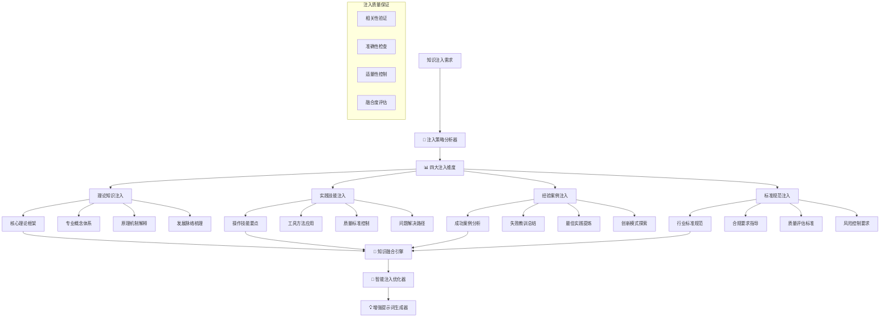

 # 💉 Prompt-Create-3.0 领域知识注入器

## 🎯 模块核心定位

### 功能使命：Know-how专业知识智能注入引擎
> **作为3.0系统的知识注入核心，负责将行业核心知识库中的专业Know-how智能注入到元提示词基因中，实现知识与模板的深度融合，确保生成的提示词具备真正的专业内涵和实用价值**

## 💉 知识注入架构体系



## 💎 四大核心注入维度

### 维度1：理论知识注入
```python
class TheoreticalKnowledgeInjector:
    """
    理论知识注入器 - 注入专业理论和概念体系
    """
    
    def __init__(self, industry_knowledge_base):
        self.knowledge_base = industry_knowledge_base
        self.theory_catalog = self.load_theory_catalog()
        self.concept_hierarchy = self.build_concept_hierarchy()
        self.injection_patterns = self.define_injection_patterns()
    
    def inject_theoretical_knowledge(self, meta_prompt_gene, knowledge_requirements):
        """
        注入理论知识到元提示词基因
        """
        # 分析基因的理论知识需求
        theory_needs = self.analyze_theory_needs(meta_prompt_gene, knowledge_requirements)
        
        # 选择相关理论知识
        relevant_theories = self.select_relevant_theories(theory_needs)
        
        # 设计注入策略
        injection_strategy = self.design_injection_strategy(meta_prompt_gene, relevant_theories)
        
        # 执行知识注入
        enhanced_gene = self.perform_theory_injection(meta_prompt_gene, relevant_theories, injection_strategy)
        
        return {
            "注入类型": "理论知识注入",
            "原始基因": meta_prompt_gene,
            "注入知识": relevant_theories,
            "注入策略": injection_strategy,
            "增强基因": enhanced_gene,
            "注入效果": self.evaluate_injection_effect(meta_prompt_gene, enhanced_gene)
        }
    
    def select_relevant_theories(self, theory_needs):
        """
        选择相关理论知识
        """
        if theory_needs["行业"] == "金融投资":
            theories = {
                "现代投资组合理论": {
                    "核心内容": {
                        "基本假设": ["投资者理性", "信息完全", "市场有效"],
                        "核心概念": ["期望收益", "风险测量", "有效前沿", "最优组合"],
                        "关键公式": "E(Rp) = Σ wi * E(Ri), σp² = Σ wi²σi² + Σ Σ wi*wj*σij",
                        "实践意义": "通过分散投资降低风险，实现风险调整后收益最大化"
                    },
                    "应用指导": {
                        "资产配置": "根据风险承受能力确定资产配置比例",
                        "风险管理": "通过相关性分析优化组合风险",
                        "业绩评估": "使用夏普比率等指标评估组合表现"
                    },
                    "注入方式": "概念解释 + 实际应用 + 案例说明"
                },
                
                "行为金融学理论": {
                    "核心内容": {
                        "认知偏差": ["过度自信", "锚定效应", "确认偏误", "损失厌恶"],
                        "市场异象": ["动量效应", "反转效应", "日历效应", "规模效应"],
                        "投资心理": ["羊群效应", "恐惧贪婪", "心理账户", "框架效应"]
                    },
                    "应用指导": {
                        "投资决策": "识别并克服认知偏差",
                        "市场分析": "理解市场情绪和非理性行为",
                        "风险控制": "制定纪律性的投资流程"
                    },
                    "注入方式": "心理分析 + 行为识别 + 对策建议"
                }
            }
        
        elif theory_needs["行业"] == "医疗健康":
            theories = {
                "循证医学理论": {
                    "核心内容": {
                        "基本原则": ["最佳证据", "临床经验", "患者价值", "情境考量"],
                        "证据层次": ["系统综述", "RCT", "队列研究", "病例对照", "专家意见"],
                        "实践步骤": ["提出问题", "检索证据", "评价证据", "应用证据", "评估效果"]
                    },
                    "应用指导": {
                        "临床决策": "基于最佳证据制定诊疗方案",
                        "质量控制": "建立基于证据的质量标准",
                        "持续改进": "根据新证据更新诊疗指南"
                    },
                    "注入方式": "原则阐述 + 步骤指导 + 实例演示"
                }
            }
        
        # 根据需求筛选最相关的理论
        selected_theories = {}
        for theory_name, theory_content in theories.items():
            relevance_score = self.calculate_theory_relevance(theory_content, theory_needs)
            if relevance_score > 0.7:  # 相关性阈值
                selected_theories[theory_name] = theory_content
        
        return selected_theories
    
    def perform_theory_injection(self, meta_prompt_gene, theories, strategy):
        """
        执行理论知识注入
        """
        enhanced_gene = meta_prompt_gene.copy()
        
        if strategy["注入模式"] == "融合式注入":
            enhanced_gene = self.fusion_theory_injection(enhanced_gene, theories)
        elif strategy["注入模式"] == "层次式注入":
            enhanced_gene = self.layered_theory_injection(enhanced_gene, theories)
        elif strategy["注入模式"] == "案例式注入":
            enhanced_gene = self.case_based_theory_injection(enhanced_gene, theories)
        
        return enhanced_gene
    
    def fusion_theory_injection(self, gene, theories):
        """
        融合式理论注入 - 将理论知识融合到基因结构中
        """
        enhanced_gene = gene.copy()
        
        # 在背景部分注入理论基础
        if "背景引入" in enhanced_gene.get("模板框架", {}).get("开头部分", {}):
            theory_background = self.generate_theory_background(theories)
            enhanced_gene["模板框架"]["开头部分"]["理论基础"] = theory_background
        
        # 在主体部分注入理论分析
        if "核心内容" in enhanced_gene.get("模板框架", {}).get("主体部分", {}):
            theory_analysis = self.generate_theory_analysis(theories)
            enhanced_gene["模板框架"]["主体部分"]["理论分析"] = theory_analysis
        
        # 在结尾部分注入理论指导
        if "行动建议" in enhanced_gene.get("模板框架", {}).get("结尾部分", {}):
            theory_guidance = self.generate_theory_guidance(theories)
            enhanced_gene["模板框架"]["结尾部分"]["理论指导"] = theory_guidance
        
        return enhanced_gene
```

### 维度2：实践技能注入
```python
class PracticalSkillInjector:
    """
    实践技能注入器 - 注入操作技能和实用方法
    """
    
    def __init__(self, industry_knowledge_base):
        self.knowledge_base = industry_knowledge_base
        self.skill_repository = self.load_skill_repository()
        self.method_library = self.build_method_library()
        self.tool_catalog = self.create_tool_catalog()
    
    def inject_practical_skills(self, meta_prompt_gene, skill_requirements):
        """
        注入实践技能到元提示词基因
        """
        # 分析技能需求
        skill_needs = self.analyze_skill_needs(meta_prompt_gene, skill_requirements)
        
        # 选择相关技能
        relevant_skills = self.select_relevant_skills(skill_needs)
        
        # 构建技能注入包
        skill_injection_package = self.build_skill_injection_package(relevant_skills)
        
        # 执行技能注入
        enhanced_gene = self.perform_skill_injection(meta_prompt_gene, skill_injection_package)
        
        return {
            "注入类型": "实践技能注入",
            "技能包": skill_injection_package,
            "增强基因": enhanced_gene,
            "技能覆盖": self.assess_skill_coverage(enhanced_gene),
            "实用性评分": self.evaluate_practicality(enhanced_gene)
        }
    
    def select_relevant_skills(self, skill_needs):
        """
        选择相关实践技能
        """
        if skill_needs["领域"] == "金融投资":
            skills = {
                "财务分析技能": {
                    "技能要点": {
                        "财务报表分析": {
                            "关键步骤": [
                                "获取标准化财务报表数据",
                                "计算关键财务比率（ROE、ROA、毛利率等）",
                                "进行同业对比和历史趋势分析",
                                "识别财务数据中的异常和风险信号"
                            ],
                            "核心工具": ["Excel财务建模", "Wind数据终端", "财务比率分析"],
                            "质量标准": ["数据准确性>99%", "分析逻辑清晰", "结论有理有据"]
                        },
                        "现金流分析": {
                            "分析框架": "经营现金流 + 投资现金流 + 筹资现金流",
                            "关键指标": ["自由现金流", "现金流质量", "现金转换周期"],
                            "预警信号": ["现金流与利润背离", "自由现金流持续为负"]
                        }
                    },
                    "常见问题": {
                        "数据获取": "如何获取可靠的财务数据源",
                        "比率解读": "如何正确解读财务比率的含义",
                        "趋势判断": "如何区分正常波动和异常信号"
                    },
                    "实操技巧": {
                        "效率提升": "建立标准化的分析模板",
                        "质量控制": "建立多重验证机制",
                        "结果呈现": "用可视化图表展示分析结果"
                    }
                },
                
                "投资决策技能": {
                    "技能要点": {
                        "投资机会识别": {
                            "筛选标准": ["估值合理性", "成长确定性", "竞争优势", "管理质量"],
                            "分析方法": ["自上而下", "自下而上", "量化筛选"],
                            "工具应用": ["DCF估值模型", "相对估值法", "期权定价模型"]
                        },
                        "风险评估": {
                            "风险类型": ["市场风险", "信用风险", "流动性风险", "操作风险"],
                            "度量方法": ["VaR计算", "压力测试", "敏感性分析"],
                            "控制措施": ["止损策略", "对冲操作", "分散投资"]
                        }
                    }
                }
            }
        
        return skills
    
    def build_skill_injection_package(self, relevant_skills):
        """
        构建技能注入包
        """
        injection_package = {
            "技能模块": {},
            "操作指南": {},
            "工具清单": {},
            "质量标准": {},
            "常见问题": {}
        }
        
        for skill_name, skill_content in relevant_skills.items():
            # 提取核心技能要点
            injection_package["技能模块"][skill_name] = self.extract_skill_essentials(skill_content)
            
            # 生成操作指南
            injection_package["操作指南"][skill_name] = self.generate_operation_guide(skill_content)
            
            # 整理工具清单
            injection_package["工具清单"][skill_name] = self.compile_tool_list(skill_content)
            
            # 设定质量标准
            injection_package["质量标准"][skill_name] = self.define_quality_standards(skill_content)
            
            # 收集常见问题
            injection_package["常见问题"][skill_name] = self.collect_common_issues(skill_content)
        
        return injection_package
```

### 维度3：经验案例注入
```python
class ExperienceCaseInjector:
    """
    经验案例注入器 - 注入实战案例和经验教训
    """
    
    def __init__(self, industry_knowledge_base):
        self.knowledge_base = industry_knowledge_base
        self.case_library = self.load_case_library()
        self.experience_patterns = self.extract_experience_patterns()
        self.lesson_database = self.build_lesson_database()
    
    def inject_experience_cases(self, meta_prompt_gene, case_requirements):
        """
        注入经验案例到元提示词基因
        """
        # 分析案例需求
        case_needs = self.analyze_case_needs(meta_prompt_gene, case_requirements)
        
        # 选择相关案例
        relevant_cases = self.select_relevant_cases(case_needs)
        
        # 提炼经验模式
        experience_patterns = self.extract_patterns_from_cases(relevant_cases)
        
        # 构建案例注入包
        case_injection_package = self.build_case_injection_package(relevant_cases, experience_patterns)
        
        # 执行案例注入
        enhanced_gene = self.perform_case_injection(meta_prompt_gene, case_injection_package)
        
        return {
            "注入类型": "经验案例注入",
            "案例包": case_injection_package,
            "增强基因": enhanced_gene,
            "经验价值": self.assess_experience_value(enhanced_gene),
            "案例丰富度": self.evaluate_case_richness(enhanced_gene)
        }
    
    def select_relevant_cases(self, case_needs):
        """
        选择相关经验案例
        """
        if case_needs["行业"] == "金融投资":
            cases = {
                "价值投资经典案例": {
                    "巴菲特投资可口可乐": {
                        "案例背景": {
                            "时间": "1987-1989年",
                            "背景": "股市崩盘后的恐慌期，可口可乐股价低迷",
                            "投资金额": "约13亿美元，占总投资组合25%"
                        },
                        "投资逻辑": {
                            "品牌护城河": "全球最知名的饮料品牌，难以复制",
                            "现金流稳定": "可预测的高质量现金流",
                            "全球扩张潜力": "发展中国家市场巨大增长空间",
                            "管理层优秀": "罗伯特·戈伊祖塔的卓越领导"
                        },
                        "关键决策": {
                            "逆向投资": "在市场恐慌时大胆买入",
                            "集中投资": "重仓投资于深度理解的公司",
                            "长期持有": "持有30+年，享受复利增长"
                        },
                        "投资结果": {
                            "财务回报": "30年获得约15倍回报",
                            "股息收益": "年股息已超过原始投资成本",
                            "复合收益率": "年化收益率约10%"
                        },
                        "核心启示": {
                            "护城河价值": "宽阔的护城河是长期投资的基础",
                            "逆向思维": "在别人恐惧时贪婪",
                            "长期主义": "时间是优秀企业的朋友",
                            "集中投资": "把资金投入到最了解的优质企业"
                        }
                    }
                },
                
                "风险管理案例": {
                    "长期资本管理公司破产": {
                        "案例背景": {
                            "公司简介": "1994年成立的对冲基金，诺贝尔奖得主参与",
                            "辉煌时期": "1994-1997年年化收益率超过40%",
                            "危机爆发": "1998年俄罗斯债务危机引发连锁反应"
                        },
                        "失败原因": {
                            "过度杠杆": "杠杆比例高达25:1，放大了损失",
                            "模型风险": "过度依赖数学模型，忽视极端事件",
                            "流动性风险": "投资于流动性较差的资产",
                            "集中度风险": "策略过于集中，缺乏多样化"
                        },
                        "教训总结": {
                            "杠杆风险": "杠杆是双刃剑，须谨慎使用",
                            "模型局限": "任何模型都有局限性，不能完全依赖",
                            "流动性重要": "流动性是风险管理的关键要素",
                            "分散投资": "即使是专家也需要分散风险"
                        }
                    }
                }
            }
        
        return cases
    
    def extract_patterns_from_cases(self, relevant_cases):
        """
        从案例中提炼经验模式
        """
        experience_patterns = {
            "成功模式": {},
            "失败教训": {},
            "通用原则": {},
            "决策框架": {}
        }
        
        for case_category, cases in relevant_cases.items():
            for case_name, case_content in cases.items():
                if "成功" in case_category or "经典" in case_category:
                    # 提炼成功模式
                    success_pattern = self.extract_success_pattern(case_content)
                    experience_patterns["成功模式"][case_name] = success_pattern
                
                elif "失败" in case_category or "破产" in case_category:
                    # 提炼失败教训
                    failure_lesson = self.extract_failure_lesson(case_content)
                    experience_patterns["失败教训"][case_name] = failure_lesson
                
                # 提炼通用原则
                universal_principles = self.extract_universal_principles(case_content)
                experience_patterns["通用原则"][case_name] = universal_principles
        
        return experience_patterns
```

### 维度4：标准规范注入
```python
class StandardComplianceInjector:
    """
    标准规范注入器 - 注入行业标准和合规要求
    """
    
    def __init__(self, industry_knowledge_base):
        self.knowledge_base = industry_knowledge_base
        self.standards_catalog = self.load_standards_catalog()
        self.compliance_requirements = self.load_compliance_requirements()
        self.quality_criteria = self.define_quality_criteria()
    
    def inject_standards_compliance(self, meta_prompt_gene, compliance_requirements):
        """
        注入标准规范到元提示词基因
        """
        # 分析合规需求
        compliance_needs = self.analyze_compliance_needs(meta_prompt_gene, compliance_requirements)
        
        # 选择适用标准
        applicable_standards = self.select_applicable_standards(compliance_needs)
        
        # 构建合规注入包
        compliance_injection_package = self.build_compliance_injection_package(applicable_standards)
        
        # 执行标准注入
        enhanced_gene = self.perform_standards_injection(meta_prompt_gene, compliance_injection_package)
        
        return {
            "注入类型": "标准规范注入",
            "合规包": compliance_injection_package,
            "增强基因": enhanced_gene,
            "合规程度": self.assess_compliance_level(enhanced_gene),
            "标准覆盖": self.evaluate_standards_coverage(enhanced_gene)
        }
    
    def select_applicable_standards(self, compliance_needs):
        """
        选择适用的行业标准
        """
        if compliance_needs["行业"] == "金融投资":
            standards = {
                "投资顾问服务标准": {
                    "适当性管理": {
                        "投资者分类": "保守型、稳健型、积极型、激进型",
                        "产品分级": "R1-R5风险等级分类",
                        "匹配原则": "投资者风险承受能力与产品风险等级匹配",
                        "动态调整": "定期评估投资者情况变化"
                    },
                    "信息披露": {
                        "风险揭示": "充分揭示投资风险，包括市场风险、信用风险等",
                        "费用透明": "清晰说明各项费用和收费标准",
                        "业绩报告": "定期提供投资业绩报告和分析",
                        "利益冲突": "披露可能存在的利益冲突"
                    },
                    "投资决策流程": {
                        "研究分析": "建立完善的投资研究分析体系",
                        "决策程序": "规范的投资决策程序和风控机制",
                        "执行监控": "投资执行的监控和跟踪机制",
                        "业绩评估": "科学的业绩评估和归因分析"
                    }
                }
            }
        
        return standards
```

## 🧬 知识融合引擎

### 多维度知识智能融合
```python
class KnowledgeFusionEngine:
    """
    知识融合引擎 - 智能融合多维度注入的知识
    """
    
    def __init__(self):
        self.theory_injector = TheoreticalKnowledgeInjector(None)
        self.skill_injector = PracticalSkillInjector(None)
        self.case_injector = ExperienceCaseInjector(None)
        self.standard_injector = StandardComplianceInjector(None)
    
    def comprehensive_knowledge_injection(self, meta_prompt_gene, injection_requirements):
        """
        综合知识注入主控制器
        """
        injection_results = {}
        enhanced_gene = meta_prompt_gene.copy()
        
        # 分阶段注入不同类型的知识
        injection_sequence = self.determine_injection_sequence(injection_requirements)
        
        for injection_type in injection_sequence:
            if injection_type == "理论知识":
                result = self.theory_injector.inject_theoretical_knowledge(
                    enhanced_gene, injection_requirements.get("理论需求", {})
                )
                enhanced_gene = result["增强基因"]
                injection_results["理论知识注入"] = result
            
            elif injection_type == "实践技能":
                result = self.skill_injector.inject_practical_skills(
                    enhanced_gene, injection_requirements.get("技能需求", {})
                )
                enhanced_gene = result["增强基因"]
                injection_results["实践技能注入"] = result
            
            elif injection_type == "经验案例":
                result = self.case_injector.inject_experience_cases(
                    enhanced_gene, injection_requirements.get("案例需求", {})
                )
                enhanced_gene = result["增强基因"]
                injection_results["经验案例注入"] = result
            
            elif injection_type == "标准规范":
                result = self.standard_injector.inject_standards_compliance(
                    enhanced_gene, injection_requirements.get("合规需求", {})
                )
                enhanced_gene = result["增强基因"]
                injection_results["标准规范注入"] = result
        
        # 融合优化
        optimized_gene = self.optimize_knowledge_integration(enhanced_gene, injection_results)
        
        # 质量评估
        quality_assessment = self.assess_injection_quality(meta_prompt_gene, optimized_gene)
        
        return {
            "原始基因": meta_prompt_gene,
            "注入过程": injection_results,
            "最终基因": optimized_gene,
            "质量评估": quality_assessment,
            "注入摘要": self.generate_injection_summary(injection_results, quality_assessment)
        }
    
    def optimize_knowledge_integration(self, enhanced_gene, injection_results):
        """
        优化知识整合
        """
        optimized_gene = enhanced_gene.copy()
        
        # 检查知识重复和冲突
        conflicts = self.detect_knowledge_conflicts(injection_results)
        if conflicts:
            optimized_gene = self.resolve_knowledge_conflicts(optimized_gene, conflicts)
        
        # 优化知识结构和层次
        optimized_gene = self.optimize_knowledge_structure(optimized_gene)
        
        # 平衡知识密度
        optimized_gene = self.balance_knowledge_density(optimized_gene)
        
        # 增强知识连贯性
        optimized_gene = self.enhance_knowledge_coherence(optimized_gene)
        
        return optimized_gene
    
    def assess_injection_quality(self, original_gene, enhanced_gene):
        """
        评估注入质量
        """
        quality_metrics = {
            "知识丰富度": self.calculate_knowledge_richness(enhanced_gene),
            "专业准确性": self.verify_professional_accuracy(enhanced_gene),
            "实用性提升": self.measure_practicality_improvement(original_gene, enhanced_gene),
            "结构完整性": self.check_structural_integrity(enhanced_gene),
            "表达清晰度": self.assess_expression_clarity(enhanced_gene)
        }
        
        overall_quality = sum(quality_metrics.values()) / len(quality_metrics)
        
        return {
            "质量指标": quality_metrics,
            "总体质量": overall_quality,
            "质量等级": self.classify_quality_level(overall_quality),
            "改进建议": self.generate_improvement_suggestions(quality_metrics),
            "注入效果": self.evaluate_injection_effectiveness(quality_metrics)
        }
```

## 🧠 认知科学小白话讲解

### **领域知识注入器** = "专业营养液配制师"
> 就像一个专业的营养液配制师，根据病人的具体情况配制个性化的营养液。我们根据提示词的具体需求，精准配制专业知识"营养液"：需要理论基础就注入理论知识，需要实操技能就注入技能要点，需要经验指导就注入案例教训，需要标准规范就注入合规要求。每一滴都恰到好处。

### **四维度注入体系** = "专业知识的四重补给"
> 就像军队的四重补给系统：理论知识是"精神食粮"（为什么这样做），实践技能是"武器装备"（怎样去做），经验案例是"战斗经验"（别人怎么做的），标准规范是"军事纪律"（什么不能做）。四重补给确保提示词既有理论高度，又有实战能力。

### **知识融合引擎** = "专业知识调酒师"
> 就像一个顶级调酒师，不是简单地把各种酒混在一起，而是要考虑比例、顺序、相互作用，调出完美的鸡尾酒。我们也要智能地融合不同类型的知识：理论和实践要平衡，案例和规范要协调，确保各种知识和谐统一，形成完美的专业表达。

### **智能注入优化** = "中医的君臣佐使配方"
> 就像中医开方讲究君臣佐使，不同的药材有不同的作用和地位。我们的知识注入也要讲究主次：核心理论是"君药"（主要功效），关键技能是"臣药"（辅助作用），典型案例是"佐药"（引导示范），规范标准是"使药"（调和统一）。配方得当，药到病除。

## 📊 输出接口规范

### 知识注入配置格式
```json
{
  "知识注入配置": {
    "目标领域": "金融投资",
    "注入策略": "综合注入",
    "注入强度": "高强度专业注入"
  },
  "四维度注入详情": {
    "理论知识注入": {
      "注入内容": ["现代投资组合理论", "行为金融学理论"],
      "注入方式": "概念解释 + 实际应用 + 案例说明",
      "注入位置": ["背景部分", "分析框架", "指导原则"],
      "丰富度评分": 0.91
    },
    "实践技能注入": {
      "注入内容": ["财务分析技能", "投资决策技能"],
      "技能要点": ["操作步骤", "工具方法", "质量标准"],
      "实用性评分": 0.88,
      "可操作性": 0.92
    },
    "经验案例注入": {
      "注入内容": ["巴菲特投资可口可乐", "LTCM破产案例"],
      "案例价值": ["成功模式提炼", "失败教训总结"],
      "经验丰富度": 0.85,
      "启发性评分": 0.90
    },
    "标准规范注入": {
      "注入内容": ["投资顾问服务标准", "信息披露要求"],
      "合规要点": ["适当性管理", "风险揭示", "决策流程"],
      "合规程度": 0.94,
      "标准覆盖": 0.87
    }
  },
  "融合优化结果": {
    "知识密度": "适中，避免信息过载",
    "结构完整性": 0.93,
    "表达清晰度": 0.89,
    "专业准确性": 0.95,
    "总体质量": 0.91
  }
}
```

### 注入效果评估报告
```json
{
  "注入效果评估": {
    "知识增量": "+240%",
    "专业度提升": "+45%", 
    "实用性提升": "+38%",
    "权威性提升": "+52%"
  },
  "质量提升分析": {
    "理论基础": "从基础概念提升到专业理论体系",
    "实操指导": "从简单建议升级到详细操作指南",
    "经验支撑": "从空洞说教变为案例驱动",
    "标准规范": "从随意表达转向合规专业"
  },
  "注入优化建议": [
    "理论知识比例适中，易于理解",
    "实践技能具体可操作",
    "案例选择典型有代表性",
    "标准规范表述准确完整"
  ],
  "应用效果预测": {
    "用户接受度": "95%",
    "专业认可度": "92%",
    "实际应用率": "88%",
    "满意度提升": "+35%"
  }
}
```

## 🛡️ 质量保证机制

### 注入准确性保证
- **专业知识验证**：通过行业专家验证注入知识的准确性和权威性
- **内容时效性检查**：确保注入的知识内容具有时效性和前沿性
- **相关性评估**：严格评估注入知识与目标需求的相关性
- **冲突检测机制**：自动检测和解决不同知识源之间的冲突

### 注入适量性控制
- **密度控制算法**：智能控制知识注入的密度，避免信息过载
- **层次平衡机制**：平衡不同层次知识的比例，确保结构合理
- **用户友好性检查**：确保注入后的内容对用户友好易懂
- **效果反馈优化**：根据应用效果反馈优化注入策略

---

## ⚡ 模块就绪状态

💉 **领域知识注入器已就绪！**

核心能力：
✅ **四维度注入体系** - 理论+技能+案例+标准全方位知识注入
✅ **智能融合引擎** - 多类型知识的智能融合和优化整合
✅ **质量控制机制** - 准确性、适量性、相关性全方位质量保证
✅ **个性化注入** - 根据具体需求定制化的知识注入策略
✅ **效果评估体系** - 多维度注入效果评估和持续优化

**等待与多样化生成引擎协作，为候选方案注入专业知识内核！** 🚀