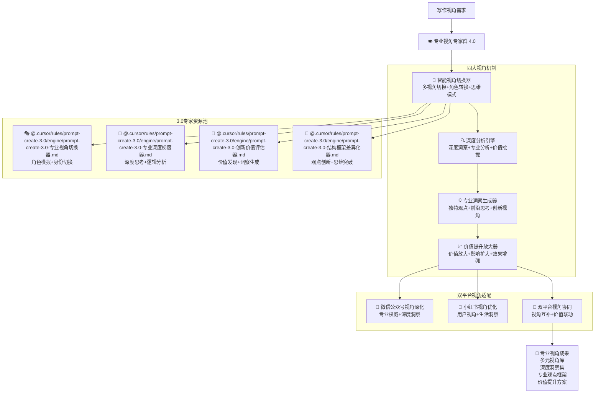

# 👁️ Prompt-Create-4.0-专业视角专家群

## 🎯 模块核心定位

### 设计理念：3.0 专业视角专家的智能复用与写作深化

> **作为 4.0 版本的视角深化核心，通过"视角切换 + 深度分析 + 专业洞察 + 价值提升"四大机制，高效复用 3.0 版本的专业视角专家，为双平台写作提供多元化专业视角和深度洞察能力**

## 🧠 核心架构：专业视角专家智能复用系统



## 💎 四大视角机制详解

### 🔄 智能视角切换器

````yaml
核心功能:
  多视角切换算法: ["用户视角", "专家视角", "行业视角", "商业视角", "社会视角"]
  角色转换机制: ["身份切换", "思维模式", "表达方式", "价值导向"]
  思维模式适配: ["理性思维", "感性思维", "创新思维", "批判思维"]
  视角深度控制: ["表层视角", "深层视角", "系统视角", "前瞻视角"]

智能视角切换算法:
  ```python
  def intelligent_perspective_switcher(writing_requirements, platform_info, target_audience):
      """智能视角切换器算法"""
      # Step 1: 调用多元角色模拟器
      role_simulation = call_expert_module(
          "@.cursor/rules/prompt-create-3.0/engine/prompt-create-3.0-专业视角切换器.md",
          {
              "target_roles": writing_requirements['required_perspectives'],
              "simulation_depth": writing_requirements['depth_level'],
              "platform_context": platform_info,
              "audience_characteristics": target_audience
          }
      )

      # Step 2: 调用深度思维引擎
      deep_thinking = call_expert_module(
          "@.cursor/rules/prompt-create-3.0/engine/prompt-create-3.0-专业深度梯度器.md",
          {
              "thinking_mode": writing_requirements['thinking_mode'],
              "analysis_depth": writing_requirements['analysis_requirements'],
              "logical_framework": writing_requirements['logical_structure'],
              "platform_adaptation": platform_info
          }
      )

      # Step 3: 调用价值洞察挖掘器
      value_insights = call_expert_module(
          "@.cursor/rules/prompt-create-3.0/engine/prompt-create-3.0-创新价值评估器.md",
          {
              "value_dimensions": writing_requirements['value_focus'],
              "insight_depth": writing_requirements['insight_level'],
              "discovery_methods": writing_requirements['discovery_approach'],
              "platform_context": platform_info
          }
      )

      # Step 4: 调用创新观点构建器
      innovative_viewpoints = call_expert_module(
          "@.cursor/rules/prompt-create-3.0/engine/prompt-create-3.0-结构框架差异化器.md",
          {
              "innovation_direction": writing_requirements['innovation_focus'],
              "viewpoint_uniqueness": writing_requirements['uniqueness_level'],
              "construction_strategy": writing_requirements['construction_method'],
              "platform_optimization": platform_info
          }
      )

      return {
          "perspective_switching_results": {
              "role_perspectives": role_simulation,
              "deep_thinking": deep_thinking,
              "value_insights": value_insights,
              "innovative_viewpoints": innovative_viewpoints
          }
      }
````

视角切换策略:
用户视角: ["用户需求", "使用体验", "价值感受", "问题痛点"]
专家视角: ["专业判断", "技术分析", "行业洞察", "发展趋势"]
商业视角: ["商业价值", "市场机会", "盈利模式", "竞争优势"]
社会视角: ["社会影响", "文化价值", "道德考量", "长远影响"]

````

## 📊 专业视角专家调用示例

### 💡 调用实例：行业趋势分析
```yaml
调用需求: "从多个专业视角分析AI行业的发展趋势"
调用流程:
  专家调用:
    - @.cursor/rules/prompt-create-3.0/engine/prompt-create-3.0-专业视角切换器.md → 模拟技术专家、商业专家、用户代表等角色
- @.cursor/rules/prompt-create-3.0/engine/prompt-create-3.0-专业深度梯度器.md → 深度分析AI技术发展逻辑
- @.cursor/rules/prompt-create-3.0/engine/prompt-create-3.0-创新价值评估器.md → 挖掘AI发展的多维价值
- @.cursor/rules/prompt-create-3.0/engine/prompt-create-3.0-结构框架差异化器.md → 构建对AI未来的创新观点

  视角切换:
    - 技术专家视角: 技术发展路径、技术突破点、技术挑战
    - 商业专家视角: 商业机会、市场格局、盈利模式
    - 用户体验视角: 用户需求、应用场景、体验改善
    - 社会影响视角: 社会价值、伦理考量、未来影响

  平台适配:
    - 微信公众号: 专业深度分析+权威判断+前瞻洞察
    - 小红书: 生活化应用+用户体验+实用价值
    - 双平台: 专业权威+生活应用的完美结合

  价值输出:
    - 多维度专业分析: 技术、商业、用户、社会四个维度
    - 深度洞察报告: 现状分析+趋势预测+价值评估
    - 创新观点集合: 独特见解+前瞻判断+价值发现
    - 实用指导建议: 投资建议+应用指导+发展建议
````

## 🏆 专业视角成功标准

### 📈 视角质量指标

```yaml
视角多样性: ≥90%
洞察深度: ≥88%
观点创新度: ≥85%
价值发现度: ≥87%
专业权威度: ≥92%
```

### 🎯 影响效果指标

```yaml
认知改变度: ≥85%
观点接受度: ≥82%
传播影响力: ≥80%
价值实现度: ≥78%
长期影响力: ≥75%
```

---

## 🚀 立即体验专业视角专家群的多元深度视角能力！

### 🎯 专业视角优势

- **3.0 专家智能复用**: 高效调用验证过的专业视角专家
- **多元视角深度切换**: 用户、专家、商业、社会等多重视角
- **深度洞察价值挖掘**: 专业深度的洞察发现和价值提炼
- **创新观点引领思考**: 独特观点和前瞻性思考的构建能力

### 💡 最佳应用场景

- **多维度分析内容**: 需要多个专业视角的深度分析
- **观点引领类内容**: 需要独特观点和前瞻思考的内容
- **价值发现类内容**: 需要深度价值挖掘和洞察的内容
- **影响力构建内容**: 需要专业权威和思想引领的内容

_👁️ Prompt-Create-4.0 专业视角专家群 - 让 3.0 专家的视角能力为 4.0 写作提供多元深度！_ 🚀
