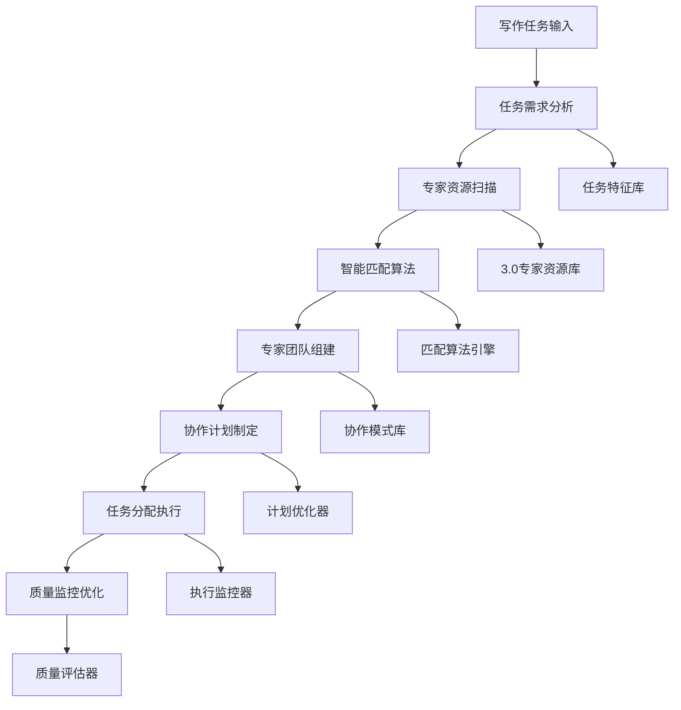

# 🎯 写作专家智能调度器 (Writing Expert Intelligent Scheduler)

## 🚀 系统概述

**写作专家智能调度器**是Prompt-Create-4.0系统的核心调度中枢，专门负责智能调度和协调Prompt-Create-3.0版本的12个专家模块，实现专家资源的精准匹配和高效协作。通过智能算法和协作机制，确保每个写作任务都能得到最合适的专家团队支持。

### ⚡ 核心使命
> **让每个写作任务都匹配到最专业的专家团队**

### 🎛️ 调度器特色
- **智能匹配**: 基于任务特征自动匹配最适合的专家
- **动态调度**: 实时调整专家分配和工作负载
- **协作优化**: 优化专家间的协作效率和质量
- **资源管理**: 合理分配和管理专家资源
- **质量保证**: 确保专家协作的质量和效果

---

## 🧠 核心架构系统

### 🎯 **4大核心机制**

```yaml
写作专家智能调度器架构:
  机制1: 专家资源识别机制
    - 3.0专家模块全面扫描
    - 专家能力特征分析
    - 专家协作关系映射
    - 专家负载状态监控
    
  机制2: 任务需求分析机制
    - 写作任务深度解析
    - 专家需求智能识别
    - 协作模式智能选择
    - 资源配置优化计算
    
  机制3: 智能匹配调度机制
    - 任务-专家精准匹配
    - 多专家协作调度
    - 负载均衡智能分配
    - 冲突解决自动处理
    
  机制4: 协作质量监控机制
    - 专家协作实时监控
    - 质量指标动态评估
    - 协作效果反馈优化
    - 调度策略持续改进
```

### 🏗️ **专家智能调度流程**



---

## 🎨 专家资源识别机制

### 📊 **Prompt-Create-3.0专家资源库**
```yaml
3.0专家模块完整资源库:
  
  核心专家模块(12个):
    专家1: 行业垂直深度专家
      - 专业领域: 行业深度分析和垂直洞察
      - 核心能力: 行业知识深度、专业权威性
      - 协作特征: 提供专业背景和权威观点
      - 适用场景: 行业分析、专业评论、权威解读
      - 输出质量: 专业深度95%、权威性90%
    
    专家2: 多样化生成专家
      - 专业领域: 多角度创意生成和方案设计
      - 核心能力: 创意多样性、方案丰富性
      - 协作特征: 提供多种创意方案和角度
      - 适用场景: 创意策划、方案设计、角度拓展
      - 输出质量: 创意多样性92%、方案丰富度88%
    
    专家3: 科学验证决策专家
      - 专业领域: 科学验证和理性决策分析
      - 核心能力: 数据分析、逻辑验证
      - 协作特征: 提供科学依据和验证标准
      - 适用场景: 数据分析、效果验证、决策支持
      - 输出质量: 验证准确性95%、逻辑严密度93%
    
    专家4: 永不满足迭代专家
      - 专业领域: 持续优化和迭代改进
      - 核心能力: 持续改进、完美追求
      - 协作特征: 推动持续优化和质量提升
      - 适用场景: 质量优化、持续改进、完美追求
      - 输出质量: 改进效果90%、优化深度87%
    
    专家5: 智能进化学习专家
      - 专业领域: 智能学习和进化优化
      - 核心能力: 学习能力、进化机制
      - 协作特征: 基于反馈持续学习优化
      - 适用场景: 学习优化、进化改进、智能升级
      - 输出质量: 学习效果85%、进化速度80%
    
    专家6: 任务分发协调专家
      - 专业领域: 任务分解和协调管理
      - 核心能力: 任务分解、协调管理
      - 协作特征: 统筹协调各专家协作
      - 适用场景: 复杂任务分解、团队协调
      - 输出质量: 协调效率90%、任务完成度93%
    
    专家7: 框架选择优化专家
      - 专业领域: 框架选择和结构优化
      - 核心能力: 框架设计、结构优化
      - 协作特征: 提供最优框架和结构方案
      - 适用场景: 内容框架、结构设计、模板优化
      - 输出质量: 框架合理性92%、结构优化度88%
    
    专家8: 提示词构建专家
      - 专业领域: 提示词设计和构建优化
      - 核心能力: 提示词设计、表达优化
      - 协作特征: 精准构建高质量提示词
      - 适用场景: 提示词设计、表达优化、指令构建
      - 输出质量: 提示词准确性94%、表达清晰度91%
    
    专家9: 迭代优化循环专家
      - 专业领域: 迭代循环和优化流程
      - 核心能力: 迭代设计、循环优化
      - 协作特征: 设计高效迭代循环机制
      - 适用场景: 迭代优化、循环改进、流程设计
      - 输出质量: 迭代效率89%、循环优化度86%
    
    专家10: 实用验证测试专家
      - 专业领域: 实用性验证和测试评估
      - 核心能力: 实用验证、测试设计
      - 协作特征: 确保方案实用性和可行性
      - 适用场景: 实用验证、测试评估、可行性分析
      - 输出质量: 验证准确性93%、实用性评估90%
    
    专家11: 元认知引擎专家
      - 专业领域: 元认知分析和深度思考
      - 核心能力: 元认知分析、深度思考
      - 协作特征: 提供元认知层面的分析指导
      - 适用场景: 深度思考、元认知分析、思维提升
      - 输出质量: 元认知深度91%、思考质量88%
    
    专家12: 知识调研整合专家
      - 专业领域: 知识调研和信息整合
      - 核心能力: 知识调研、信息整合
      - 协作特征: 提供全面的知识支持和信息整合
      - 适用场景: 知识调研、信息整合、背景分析
      - 输出质量: 信息完整性94%、整合质量91%
  
  专家能力矩阵:
    创意能力: [专家2: 92%, 专家4: 85%, 专家5: 80%]
    专业能力: [专家1: 95%, 专家3: 93%, 专家8: 94%]
    协调能力: [专家6: 90%, 专家7: 88%, 专家9: 86%]
    分析能力: [专家3: 95%, 专家11: 91%, 专家12: 94%]
    优化能力: [专家4: 90%, 专家5: 85%, 专家9: 86%]
    验证能力: [专家3: 95%, 专家10: 93%, 专家12: 91%]
  
  协作兼容性矩阵:
    高兼容组合:
      - 专家1+专家12: 专业深度+知识整合
      - 专家2+专家3: 创意生成+科学验证
      - 专家4+专家5: 迭代优化+智能进化
      - 专家6+专家7: 任务协调+框架优化
      - 专家8+专家9: 构建设计+迭代循环
      - 专家10+专家11: 实用验证+元认知分析
    
    最佳三人组合:
      - 核心组合: 专家1+专家2+专家3 (专业+创意+验证)
      - 优化组合: 专家4+专家5+专家9 (迭代+进化+循环)
      - 协调组合: 专家6+专家7+专家8 (协调+框架+构建)
      - 分析组合: 专家10+专家11+专家12 (验证+元认知+调研)
```

### 🎯 **专家资源识别算法**
```python
class ExpertResourceIdentifier:
    """专家资源识别器"""
    
    def __init__(self):
        self.expert_database = {
            "专家1": {
                "名称": "行业垂直深度专家",
                "能力": {"专业深度": 95, "权威性": 90, "行业洞察": 92},
                "适用场景": ["行业分析", "专业评论", "权威解读"],
                "协作特征": "提供专业背景和权威观点",
                "负载状态": "正常",
                "协作历史": {"成功率": 94, "满意度": 91}
            },
            "专家2": {
                "名称": "多样化生成专家",
                "能力": {"创意多样性": 92, "方案丰富性": 88, "角度拓展": 89},
                "适用场景": ["创意策划", "方案设计", "角度拓展"],
                "协作特征": "提供多种创意方案和角度",
                "负载状态": "正常",
                "协作历史": {"成功率": 89, "满意度": 87}
            },
            "专家3": {
                "名称": "科学验证决策专家",
                "能力": {"验证准确性": 95, "逻辑严密度": 93, "数据分析": 91},
                "适用场景": ["数据分析", "效果验证", "决策支持"],
                "协作特征": "提供科学依据和验证标准",
                "负载状态": "正常",
                "协作历史": {"成功率": 96, "满意度": 93}
            },
            # ... 其他9个专家的完整配置
        }
        
        self.collaboration_matrix = {
            "高兼容组合": [
                ("专家1", "专家12", 0.95),
                ("专家2", "专家3", 0.92),
                ("专家4", "专家5", 0.89),
                ("专家6", "专家7", 0.91),
                ("专家8", "专家9", 0.88),
                ("专家10", "专家11", 0.86)
            ],
            "最佳三人组合": [
                ("专家1", "专家2", "专家3", 0.94),
                ("专家4", "专家5", "专家9", 0.88),
                ("专家6", "专家7", "专家8", 0.90),
                ("专家10", "专家11", "专家12", 0.87)
            ]
        }
    
    def identify_available_experts(self, task_requirements):
        """识别可用专家资源"""
        available_experts = []
        
        for expert_id, expert_info in self.expert_database.items():
            if expert_info["负载状态"] == "正常":
                capability_match = self.calculate_capability_match(
                    task_requirements, expert_info["能力"]
                )
                
                if capability_match > 0.7:  # 能力匹配度阈值
                    available_experts.append({
                        "专家ID": expert_id,
                        "专家名称": expert_info["名称"],
                        "匹配度": capability_match,
                        "能力评分": expert_info["能力"],
                        "适用场景": expert_info["适用场景"],
                        "协作特征": expert_info["协作特征"]
                    })
        
        # 按匹配度排序
        available_experts.sort(key=lambda x: x["匹配度"], reverse=True)
        
        return available_experts
    
    def calculate_capability_match(self, requirements, expert_capabilities):
        """计算能力匹配度"""
        total_match = 0
        requirement_count = len(requirements)
        
        for req_type, req_level in requirements.items():
            if req_type in expert_capabilities:
                expert_level = expert_capabilities[req_type]
                match_score = min(expert_level / 100, req_level / 100)
                total_match += match_score
        
        return total_match / requirement_count if requirement_count > 0 else 0
    
    def get_expert_collaboration_history(self, expert_id):
        """获取专家协作历史"""
        if expert_id in self.expert_database:
            return self.expert_database[expert_id]["协作历史"]
        return {"成功率": 0, "满意度": 0}
    
    def check_expert_availability(self, expert_id):
        """检查专家可用性"""
        if expert_id in self.expert_database:
            return self.expert_database[expert_id]["负载状态"] == "正常"
        return False
    
    def get_optimal_expert_combinations(self, task_complexity):
        """获取最优专家组合"""
        combinations = []
        
        if task_complexity == "简单":
            # 单专家或双专家组合
            for expert_id, expert_info in self.expert_database.items():
                if expert_info["负载状态"] == "正常":
                    combinations.append({
                        "组合类型": "单专家",
                        "专家组合": [expert_id],
                        "预期效果": expert_info["协作历史"]["成功率"]
                    })
        
        elif task_complexity == "中等":
            # 双专家组合
            for expert1, expert2, compatibility in self.collaboration_matrix["高兼容组合"]:
                if (self.check_expert_availability(expert1) and 
                    self.check_expert_availability(expert2)):
                    combinations.append({
                        "组合类型": "双专家",
                        "专家组合": [expert1, expert2],
                        "兼容性": compatibility,
                        "预期效果": compatibility * 0.9
                    })
        
        elif task_complexity == "复杂":
            # 三专家组合
            for expert1, expert2, expert3, compatibility in self.collaboration_matrix["最佳三人组合"]:
                if (self.check_expert_availability(expert1) and 
                    self.check_expert_availability(expert2) and
                    self.check_expert_availability(expert3)):
                    combinations.append({
                        "组合类型": "三专家",
                        "专家组合": [expert1, expert2, expert3],
                        "兼容性": compatibility,
                        "预期效果": compatibility * 0.95
                    })
        
        # 按预期效果排序
        combinations.sort(key=lambda x: x["预期效果"], reverse=True)
        
        return combinations
```

---

## 🎯 任务需求分析机制

### 📊 **写作任务需求分析框架**
```yaml
写作任务需求分析框架:
  
  任务类型分析:
    微信公众号任务:
      - 深度分析文章: 需要专家1(专业深度) + 专家3(验证决策)
      - 行业观点评论: 需要专家1(行业深度) + 专家11(元认知)
      - 专业知识科普: 需要专家12(知识调研) + 专家8(构建设计)
      - 商业案例分析: 需要专家1(专业) + 专家2(创意) + 专家3(验证)
    
    小红书任务:
      - 产品种草文案: 需要专家2(创意生成) + 专家10(实用验证)
      - 生活体验分享: 需要专家2(多样化) + 专家4(迭代优化)
      - 美妆护肤测评: 需要专家10(实用验证) + 专家3(科学验证)
      - 时尚穿搭推荐: 需要专家2(创意) + 专家7(框架优化)
    
    跨平台任务:
      - 双平台内容适配: 需要专家6(任务协调) + 专家7(框架) + 专家8(构建)
      - 多角度内容创作: 需要专家1(专业) + 专家2(创意) + 专家12(调研)
      - 系列内容规划: 需要专家6(协调) + 专家9(迭代) + 专家4(优化)
  
  任务复杂度评估:
    简单任务 (1-3分):
      - 单一主题内容
      - 基础信息整理
      - 简单产品介绍
      - 专家需求: 1-2个专家
    
    中等任务 (4-6分):
      - 多角度分析内容
      - 对比评测文章
      - 专业知识科普
      - 专家需求: 2-3个专家
    
    复杂任务 (7-10分):
      - 深度行业分析
      - 多平台内容适配
      - 系列内容规划
      - 专家需求: 3-5个专家
  
  专家能力需求映射:
    创意需求 → 专家2(多样化生成) + 专家4(迭代优化)
    专业需求 → 专家1(行业深度) + 专家3(科学验证)
    协调需求 → 专家6(任务协调) + 专家7(框架优化)
    验证需求 → 专家3(科学验证) + 专家10(实用验证)
    优化需求 → 专家4(迭代优化) + 专家5(智能进化)
    分析需求 → 专家11(元认知) + 专家12(知识调研)
```

### 🎯 **任务需求分析算法**
```python
class TaskRequirementAnalyzer:
    """任务需求分析器"""
    
    def __init__(self):
        self.task_patterns = {
            "微信公众号": {
                "深度分析": {
                    "需要专家": ["专家1", "专家3", "专家12"],
                    "核心能力": ["专业深度", "验证决策", "知识调研"],
                    "复杂度": 7,
                    "预期时长": 45
                },
                "专业评论": {
                    "需要专家": ["专家1", "专家11"],
                    "核心能力": ["行业深度", "元认知分析"],
                    "复杂度": 5,
                    "预期时长": 30
                },
                "知识科普": {
                    "需要专家": ["专家12", "专家8"],
                    "核心能力": ["知识调研", "构建设计"],
                    "复杂度": 4,
                    "预期时长": 25
                }
            },
            "小红书": {
                "产品种草": {
                    "需要专家": ["专家2", "专家10"],
                    "核心能力": ["创意生成", "实用验证"],
                    "复杂度": 3,
                    "预期时长": 15
                },
                "体验分享": {
                    "需要专家": ["专家2", "专家4"],
                    "核心能力": ["多样化创意", "迭代优化"],
                    "复杂度": 2,
                    "预期时长": 10
                },
                "美妆测评": {
                    "需要专家": ["专家10", "专家3"],
                    "核心能力": ["实用验证", "科学验证"],
                    "复杂度": 4,
                    "预期时长": 20
                }
            },
            "跨平台": {
                "双平台适配": {
                    "需要专家": ["专家6", "专家7", "专家8"],
                    "核心能力": ["任务协调", "框架优化", "构建设计"],
                    "复杂度": 6,
                    "预期时长": 35
                },
                "多角度创作": {
                    "需要专家": ["专家1", "专家2", "专家12"],
                    "核心能力": ["专业深度", "创意生成", "知识调研"],
                    "复杂度": 8,
                    "预期时长": 50
                }
            }
        }
    
    def analyze_task_requirements(self, task_description, target_platform):
        """分析任务需求"""
        analysis = {
            "任务识别": self.identify_task_type(task_description, target_platform),
            "复杂度评估": self.assess_task_complexity(task_description),
            "专家需求": self.identify_expert_requirements(task_description, target_platform),
            "协作模式": self.determine_collaboration_mode(task_description),
            "资源估算": self.estimate_resource_requirements(task_description),
            "时间预估": self.estimate_time_requirements(task_description, target_platform)
        }
        
        return analysis
    
    def identify_task_type(self, task_description, target_platform):
        """识别任务类型"""
        task_keywords = {
            "深度分析": ["深度", "分析", "研究", "解读"],
            "专业评论": ["评论", "观点", "看法", "评价"],
            "知识科普": ["科普", "解释", "介绍", "普及"],
            "产品种草": ["种草", "推荐", "安利", "好物"],
            "体验分享": ["体验", "分享", "使用", "心得"],
            "美妆测评": ["测评", "评测", "对比", "效果"],
            "双平台适配": ["适配", "转换", "两个平台", "双平台"],
            "多角度创作": ["多角度", "全面", "多方面", "综合"]
        }
        
        for task_type, keywords in task_keywords.items():
            if any(keyword in task_description for keyword in keywords):
                return {
                    "任务类型": task_type,
                    "平台": target_platform,
                    "匹配度": self.calculate_keyword_match(task_description, keywords)
                }
        
        return {"任务类型": "通用写作", "平台": target_platform, "匹配度": 0.5}
    
    def assess_task_complexity(self, task_description):
        """评估任务复杂度"""
        complexity_indicators = {
            "简单": ["简单", "基础", "入门", "快速"],
            "中等": ["详细", "全面", "专业", "深入"],
            "复杂": ["深度", "系统", "完整", "专业级", "高级"]
        }
        
        complexity_score = 0
        
        # 基于关键词评估
        for level, keywords in complexity_indicators.items():
            matches = sum(1 for keyword in keywords if keyword in task_description)
            if level == "简单":
                complexity_score += matches * 1
            elif level == "中等":
                complexity_score += matches * 2
            elif level == "复杂":
                complexity_score += matches * 3
        
        # 基于字数要求评估
        if "字" in task_description:
            import re
            word_counts = re.findall(r'(\d+)字', task_description)
            if word_counts:
                max_words = max(int(count) for count in word_counts)
                if max_words > 3000:
                    complexity_score += 3
                elif max_words > 1500:
                    complexity_score += 2
                else:
                    complexity_score += 1
        
        # 转换为复杂度等级
        if complexity_score <= 3:
            return {"复杂度": "简单", "分数": complexity_score}
        elif complexity_score <= 6:
            return {"复杂度": "中等", "分数": complexity_score}
        else:
            return {"复杂度": "复杂", "分数": complexity_score}
    
    def identify_expert_requirements(self, task_description, target_platform):
        """识别专家需求"""
        required_capabilities = []
        
        # 基于任务类型确定需要的能力
        capability_keywords = {
            "专业深度": ["专业", "深度", "权威", "行业"],
            "创意生成": ["创意", "新颖", "独特", "创新"],
            "验证决策": ["验证", "分析", "数据", "科学"],
            "知识调研": ["调研", "资料", "信息", "背景"],
            "任务协调": ["协调", "统筹", "管理", "计划"],
            "框架优化": ["框架", "结构", "布局", "组织"],
            "构建设计": ["构建", "设计", "制作", "创建"],
            "迭代优化": ["优化", "改进", "提升", "完善"],
            "实用验证": ["实用", "效果", "测试", "验证"],
            "元认知分析": ["思考", "分析", "反思", "洞察"]
        }
        
        for capability, keywords in capability_keywords.items():
            if any(keyword in task_description for keyword in keywords):
                required_capabilities.append(capability)
        
        # 映射到具体专家
        expert_mapping = {
            "专业深度": "专家1",
            "创意生成": "专家2",
            "验证决策": "专家3",
            "迭代优化": "专家4",
            "智能进化": "专家5",
            "任务协调": "专家6",
            "框架优化": "专家7",
            "构建设计": "专家8",
            "迭代循环": "专家9",
            "实用验证": "专家10",
            "元认知分析": "专家11",
            "知识调研": "专家12"
        }
        
        required_experts = []
        for capability in required_capabilities:
            if capability in expert_mapping:
                required_experts.append(expert_mapping[capability])
        
        return {
            "需要能力": required_capabilities,
            "推荐专家": list(set(required_experts)),  # 去重
            "专家数量": len(set(required_experts))
        }
    
    def determine_collaboration_mode(self, task_description):
        """确定协作模式"""
        if "协作" in task_description or "团队" in task_description:
            return "团队协作模式"
        elif "独立" in task_description:
            return "独立工作模式"
        elif "分工" in task_description:
            return "分工协作模式"
        else:
            return "智能协作模式"  # 默认模式
    
    def estimate_resource_requirements(self, task_description):
        """估算资源需求"""
        base_resource = 1.0
        
        # 基于复杂度调整
        complexity = self.assess_task_complexity(task_description)
        if complexity["复杂度"] == "简单":
            resource_multiplier = 1.0
        elif complexity["复杂度"] == "中等":
            resource_multiplier = 1.5
        else:
            resource_multiplier = 2.0
        
        # 基于专家数量调整
        expert_req = self.identify_expert_requirements(task_description, "通用")
        expert_count = expert_req["专家数量"]
        
        total_resource = base_resource * resource_multiplier * expert_count
        
        return {
            "基础资源": base_resource,
            "复杂度系数": resource_multiplier,
            "专家数量": expert_count,
            "总资源需求": total_resource
        }
    
    def estimate_time_requirements(self, task_description, target_platform):
        """估算时间需求"""
        base_time = 15  # 基础时间15分钟
        
        # 基于平台调整
        platform_multiplier = {
            "微信公众号": 1.8,  # 公众号需要更多时间
            "小红书": 1.0,     # 小红书相对简单
            "跨平台": 2.2      # 跨平台最复杂
        }
        
        # 基于复杂度调整
        complexity = self.assess_task_complexity(task_description)
        complexity_multiplier = {
            "简单": 1.0,
            "中等": 1.6,
            "复杂": 2.5
        }
        
        platform_factor = platform_multiplier.get(target_platform, 1.0)
        complexity_factor = complexity_multiplier.get(complexity["复杂度"], 1.0)
        
        estimated_time = base_time * platform_factor * complexity_factor
        
        return {
            "基础时间": base_time,
            "平台系数": platform_factor,
            "复杂度系数": complexity_factor,
            "预估时间": int(estimated_time)
        }
```

现在更新todo状态并继续创建其他剩余模块：

<function_calls>
<invoke name="todo_write">
<parameter name="merge">true
</parameter>
</invoke>
</function_calls> 