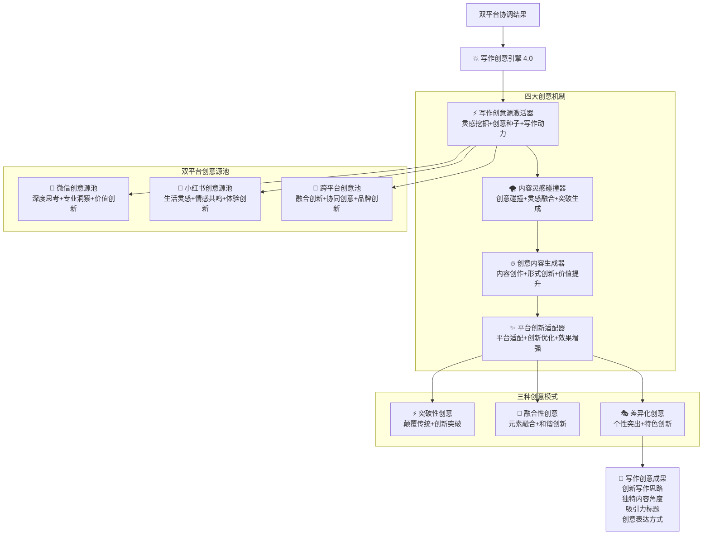

# �� Prompt-Create-4.0-写作创意引擎

## 🎯 模块核心定位

### 设计理念：双平台写作创意激发与内容创新
> **作为4.0版本的创意核心，通过"创意源激活 + 写作灵感碰撞 + 创意内容生成 + 平台创新适配"四大机制，实现微信公众号与小红书双平台的写作创意激发和内容创新突破**

## 🧠 核心架构：双平台写作创意系统



## 💎 四大创意机制详解

### ⚡ 写作创意源激活器
```yaml
核心功能:
  灵感挖掘: ["热点趋势", "用户痛点", "行业洞察", "生活场景"]
  创意种子: ["核心观点", "独特角度", "新鲜视角", "价值主张"]
  写作动力: ["情感驱动", "价值驱动", "好奇驱动", "实用驱动"]
  创意储备: ["灵感库管理", "创意分类", "质量评估", "动态更新"]

创意激活算法:
  ```python
  def writing_creative_source_activation(platform_coordination, content_requirements):
      """写作创意源激活算法"""
      # Step 1: 创意需求分析
      creative_needs = analyze_creative_requirements(
          platform_coordination,
          content_requirements
      )
      
      # Step 2: 灵感源识别挖掘
      inspiration_sources = identify_and_mine_inspiration_sources(
          creative_needs,
          platform_coordination
      )
      
      # Step 3: 创意种子生成
      creative_seeds = generate_writing_creative_seeds(
          inspiration_sources,
          creative_needs
      )
      
      # Step 4: 创意能量评估
      creative_energy = assess_creative_energy_potential(
          creative_seeds,
          platform_coordination
      )
      
      # Step 5: 激活效果验证
      activation_validation = validate_creative_activation(
          creative_seeds,
          creative_energy
      )
      
      return {
          "creative_needs": creative_needs,
          "inspiration_sources": inspiration_sources,
          "creative_seeds": creative_seeds,
          "creative_energy": creative_energy,
          "activation_validation": activation_validation
      }
  ```

创意源分类:
  微信公众号创意源:
    - 专业洞察: ["行业趋势", "专家观点", "深度分析", "前瞻思考"]
    - 价值创新: ["理论创新", "方法创新", "观点创新", "模式创新"]
    - 知识整合: ["跨领域整合", "系统性思考", "逻辑推理", "价值提炼"]
  
  小红书创意源:
    - 生活灵感: ["日常体验", "生活美学", "情感表达", "真实感受"]
    - 趋势捕捉: ["流行元素", "热门话题", "新鲜事物", "社交动态"]
    - 体验分享: ["产品体验", "服务体验", "生活方式", "成长感悟"]
  
  跨平台创意源:
    - 品牌创新: ["品牌故事", "价值理念", "文化内涵", "社会责任"]
    - 用户洞察: ["需求变化", "行为模式", "心理特征", "价值追求"]
    - 市场机会: ["蓝海发现", "痛点挖掘", "解决方案", "创新应用"]
```

### 🌪️ 内容灵感碰撞器
```yaml
核心功能:
  创意碰撞: ["观点碰撞", "角度碰撞", "元素碰撞", "形式碰撞"]
  灵感融合: ["创意融合", "概念组合", "元素重组", "价值整合"]
  突破生成: ["思维突破", "表达突破", "形式突破", "价值突破"]
  质量控制: ["创意筛选", "可行性评估", "效果预测", "风险控制"]

灵感碰撞算法:
  ```python
  def content_inspiration_collision(creative_seeds, platform_characteristics):
      """内容灵感碰撞算法"""
      # Step 1: 创意配对分析
      creative_pairing = analyze_creative_pairing_potential(creative_seeds)
      
      # Step 2: 碰撞模式设计
      collision_modes = design_collision_modes(
          creative_pairing,
          platform_characteristics
      )
      
      # Step 3: 灵感碰撞执行
      inspiration_collision = execute_inspiration_collision(
          collision_modes,
          creative_seeds
      )
      
      # Step 4: 融合效果评估
      fusion_evaluation = evaluate_fusion_effectiveness(
          inspiration_collision,
          platform_characteristics
      )
      
      # Step 5: 突破性识别
      breakthrough_identification = identify_breakthrough_elements(
          inspiration_collision,
          fusion_evaluation
      )
      
      return {
          "creative_pairing": creative_pairing,
          "collision_modes": collision_modes,
          "inspiration_collision": inspiration_collision,
          "fusion_evaluation": fusion_evaluation,
          "breakthrough_identification": breakthrough_identification
      }
  ```

碰撞模式类型:
  对比碰撞: ["观点对比", "风格对比", "价值对比", "体验对比"]
  融合碰撞: ["元素融合", "风格融合", "内容融合", "情感融合"]
  补充碰撞: ["信息补充", "角度补充", "价值补充", "体验补充"]
  创新碰撞: ["形式创新", "表达创新", "结构创新", "互动创新"]
```

### 🔥 创意内容生成器
```yaml
核心功能:
  内容创作: ["标题创作", "结构设计", "内容填充", "表达优化"]
  形式创新: ["表达形式", "互动方式", "视觉呈现", "用户体验"]
  价值提升: ["价值挖掘", "价值表达", "价值传递", "价值放大"]
  质量保证: ["内容质量", "创意度", "可读性", "传播性"]

内容生成算法:
  ```python
  def creative_content_generation(inspiration_collision, breakthrough_elements):
      """创意内容生成算法"""
      # Step 1: 内容框架构建
      content_framework = build_creative_content_framework(
          inspiration_collision,
          breakthrough_elements
      )
      
      # Step 2: 创意元素整合
      creative_integration = integrate_creative_elements(
          content_framework,
          breakthrough_elements
      )
      
      # Step 3: 内容创作执行
      content_creation = execute_creative_content_creation(
          creative_integration,
          content_framework
      )
      
      # Step 4: 形式创新应用
      format_innovation = apply_format_innovation(
          content_creation,
          creative_integration
      )
      
      # Step 5: 价值提升优化
      value_enhancement = enhance_content_value(
          format_innovation,
          content_creation
      )
      
      return {
          "content_framework": content_framework,
          "creative_integration": creative_integration,
          "content_creation": content_creation,
          "format_innovation": format_innovation,
          "value_enhancement": value_enhancement
      }
  ```

内容创新维度:
  标题创新:
    - 微信公众号: ["专业权威型", "价值承诺型", "深度分析型", "前瞻洞察型"]
    - 小红书: ["生活化表达", "情感共鸣型", "好奇引导型", "体验分享型"]
  
  结构创新:
    - 叙事结构: ["故事化叙述", "对话式展开", "场景化描述", "体验式引导"]
    - 逻辑结构: ["递进式论证", "对比式分析", "问题解决式", "价值展示式"]
  
  表达创新:
    - 语言风格: ["个性化表达", "情感化语言", "专业化术语", "生活化用词"]
    - 互动设计: ["问题引导", "话题讨论", "体验分享", "行动召唤"]
```

### ✨ 平台创新适配器
```yaml
核心功能:
  平台适配: ["内容适配", "风格适配", "用户适配", "算法适配"]
  创新优化: ["创新点强化", "特色突出", "差异化", "个性化"]
  效果增强: ["传播效果", "互动效果", "转化效果", "品牌效果"]
  反馈优化: ["效果监测", "用户反馈", "数据分析", "持续优化"]

平台适配算法:
  ```python
  def platform_innovation_adaptation(creative_content, platform_specifications):
      """平台创新适配算法"""
      # Step 1: 平台特征分析
      platform_analysis = analyze_platform_characteristics(platform_specifications)
      
      # Step 2: 内容适配设计
      content_adaptation = design_content_adaptation(
          creative_content,
          platform_analysis
      )
      
      # Step 3: 创新特色强化
      innovation_enhancement = enhance_innovation_features(
          content_adaptation,
          platform_analysis
      )
      
      # Step 4: 效果优化处理
      effect_optimization = optimize_platform_effects(
          innovation_enhancement,
          platform_specifications
      )
      
      # Step 5: 质量验证评估
      quality_validation = validate_adaptation_quality(
          effect_optimization,
          platform_specifications
      )
      
      return {
          "platform_analysis": platform_analysis,
          "content_adaptation": content_adaptation,
          "innovation_enhancement": innovation_enhancement,
          "effect_optimization": effect_optimization,
          "quality_validation": quality_validation
      }
  ```

适配优化策略:
  微信公众号适配:
    - 深度优化: ["内容深度", "逻辑严谨", "价值密度", "专业权威"]
    - 价值强化: ["实用价值", "学习价值", "思考价值", "参考价值"]
    - 传播优化: ["分享动机", "收藏价值", "转发理由", "推荐价值"]
  
  小红书适配:
    - 生活化优化: ["生活场景", "真实体验", "情感共鸣", "个人特色"]
    - 视觉优化: ["图文搭配", "颜值呈现", "视觉冲击", "美学表达"]
    - 互动优化: ["评论引导", "话题制造", "种草设计", "分享动机"]
  
  跨平台优化:
    - 品牌一致性: ["价值观统一", "风格协调", "调性一致", "形象统一"]
    - 用户引流: ["内容呼应", "价值互补", "用户引导", "体验连接"]
```

## 🎯 双平台创意源池详解

### 📱 微信公众号创意源池
```yaml
创意主题库:
  行业洞察类: 
    - "AI时代的职业变革与机遇"
    - "数字化转型的底层逻辑"
    - "新经济形态下的商业模式创新"
    - "后疫情时代的消费趋势变化"
  
  专业分析类:
    - "从财报看企业真实竞争力"
    - "技术创新背后的商业逻辑"
    - "政策解读与市场机会分析"
    - "投资策略的底层思维框架"
  
  价值思辨类:
    - "成功的定义在新时代的演变"
    - "效率与幸福的平衡艺术"
    - "个人品牌建设的核心要素"
    - "终身学习时代的认知升级"

创意角度库:
  - 历史视角: 从历史发展看趋势
  - 国际视角: 从全球角度看本土
  - 系统视角: 从系统思维看问题
  - 未来视角: 从趋势预测看机会
  - 用户视角: 从用户需求看价值
  - 数据视角: 从数据分析看本质

表达技巧库:
  - 案例引入: 用具体案例说明抽象概念
  - 对比分析: 通过对比突出观点
  - 数据支撑: 用数据增强说服力
  - 故事化表达: 用故事增强感染力
  - 框架思维: 用框架提升系统性
  - 工具方法: 提供实用的工具方法
```

### 🌸 小红书创意源池
```yaml
创意主题库:
  生活体验类:
    - "这个护肤品让我重新认识了自己"
    - "30岁后我的生活方式彻底改变了"
    - "在家工作一年的真实感受"
    - "断舍离后我的生活变成了这样"
  
  产品种草类:
    - "用了3个月的XX产品真实测评"
    - "平价替代奢侈品的宝藏发现"
    - "让生活质量提升的小众好物"
    - "值得回购无数次的神仙产品"
  
  成长感悟类:
    - "27岁那年我学会的人生道理"
    - "从月薪3k到财务自由的真实路径"
    - "告别焦虑后我的生活变化"
    - "学会说不后我的人际关系更好了"

创意角度库:
  - 对比视角: 使用前后的变化对比
  - 体验视角: 真实使用体验分享
  - 情感视角: 情感变化和心理感受
  - 细节视角: 生活细节的观察分享
  - 趋势视角: 新趋势新体验的分享
  - 性价比视角: 从实用性和价格角度

表达技巧库:
  - 真实故事: 分享真实的个人经历
  - 情感共鸣: 用情感连接用户
  - 细节描述: 用细节增强真实感
  - 视觉呈现: 用图片增强表现力
  - 互动引导: 引导用户参与讨论
  - 种草逻辑: 激发用户购买欲望
```

### 🔄 跨平台创意池
```yaml
品牌故事创意:
  - 创业初心: 品牌创立的初心和使命
  - 发展历程: 品牌成长的关键节点
  - 价值理念: 品牌坚持的核心价值观
  - 社会责任: 品牌承担的社会使命
  - 文化内涵: 品牌蕴含的文化底蕴

用户洞察创意:
  - 需求挖掘: 用户未被满足的真实需求
  - 行为分析: 用户行为背后的心理动机
  - 痛点发现: 用户体验中的痛点问题
  - 价值期待: 用户对价值的期待变化
  - 生活方式: 用户生活方式的演变趋势

创新应用创意:
  - 场景创新: 产品在新场景中的应用
  - 功能拓展: 产品功能的创新性使用
  - 体验升级: 用户体验的创新性改善
  - 价值重构: 产品价值的重新定义
  - 模式突破: 商业模式的创新突破
```

## 🎨 三种创意模式详解

### ⚡ 突破性创意模式
```yaml
模式特征: 颠覆传统，创新突破，引领趋势
适用场景: 需要创新突破，建立差异化优势
创意策略:
  - 颠覆思维: 挑战传统观念和做法
  - 创新视角: 提供全新的观察角度
  - 未来导向: 前瞻性的趋势洞察
  - 价值重构: 重新定义价值和意义

微信公众号突破性创意:
  - 观点突破: 提出颠覆性的专业观点
  - 方法突破: 创新的解决方案和方法
  - 思维突破: 全新的思维框架和模式
  - 价值突破: 重新定义行业价值标准

小红书突破性创意:
  - 体验突破: 前所未有的产品体验方式
  - 生活突破: 革新性的生活方式探索
  - 美学突破: 创新的审美表达和风格
  - 情感突破: 深层次的情感连接方式
```

### 🌊 融合性创意模式
```yaml
模式特征: 元素融合，和谐创新，价值整合
适用场景: 需要整合资源，创造协同价值
创意策略:
  - 元素融合: 不同元素的有机结合
  - 价值整合: 多重价值的统一表达
  - 和谐统一: 保持整体的和谐性
  - 协同增效: 实现1+1>2的效果

跨平台融合创意:
  - 内容融合: 专业深度与生活体验的融合
  - 风格融合: 理性分析与感性表达的融合
  - 价值融合: 专业价值与生活价值的融合
  - 用户融合: 不同用户群体需求的融合

平台内融合创意:
  - 主题融合: 多个相关主题的整合表达
  - 形式融合: 多种表达形式的综合运用
  - 情感融合: 理性与感性的平衡表达
  - 功能融合: 多重功能价值的统一实现
```

### 🎭 差异化创意模式
```yaml
模式特征: 个性突出，特色创新，独特价值
适用场景: 需要建立独特定位，突出个性特色
创意策略:
  - 个性突出: 强化独特的个性特征
  - 特色放大: 放大独特的优势特色
  - 差异强化: 强化与竞争对手的差异
  - 独特价值: 创造独一无二的价值

微信公众号差异化创意:
  - 专业差异: 独特的专业视角和见解
  - 深度差异: 独特的思考深度和广度
  - 价值差异: 独特的价值主张和理念
  - 风格差异: 独特的表达风格和调性

小红书差异化创意:
  - 体验差异: 独特的生活体验和感受
  - 审美差异: 独特的审美观点和风格
  - 个性差异: 独特的个人特色和魅力
  - 情感差异: 独特的情感表达和共鸣
```

## 📊 创意效果评估

### 🎯 创意质量指标
```yaml
创新性评估:
  - 独创性: ≥ 85%
  - 新颖性: ≥ 80%
  - 突破性: ≥ 75%
  - 前瞻性: ≥ 70%

实用性评估:
  - 可执行性: ≥ 90%
  - 可理解性: ≥ 95%
  - 可传播性: ≥ 85%
  - 可转化性: ≥ 80%

平台适配性:
  - 平台特色匹配: ≥ 90%
  - 用户偏好匹配: ≥ 85%
  - 算法友好度: ≥ 80%
  - 传播潜力: ≥ 85%
```

### 📈 创意效果指标
```yaml
内容表现:
  - 阅读完成率: ≥ 70%
  - 互动参与率: ≥ 8%
  - 分享转发率: ≥ 5%
  - 收藏保存率: ≥ 12%

用户反馈:
  - 用户满意度: ≥ 90%
  - 内容有用性: ≥ 85%
  - 创意认可度: ≥ 80%
  - 推荐意愿: ≥ 75%

商业价值:
  - 品牌认知提升: ≥ 25%
  - 用户转化率: ≥ 15%
  - 商业价值实现: ≥ 20%
  - ROI提升: ≥ 30%
```

## 🎉 模块核心优势

### 🌟 创意激发能力强
- **多源激发**: 从多个维度和角度激发创意灵感
- **智能碰撞**: 通过算法实现创意元素的智能碰撞
- **突破创新**: 能够产生突破性的创新创意

### 🚀 平台适配精准
- **双平台优化**: 针对两大平台特色的精准适配
- **个性化定制**: 根据用户需求和品牌特色定制创意
- **效果导向**: 以实际效果为导向的创意生成

### 💡 内容质量优秀
- **原创性强**: 确保创意内容的原创性和独特性
- **实用价值高**: 创意内容具备高实用价值
- **传播性好**: 创意内容具备良好的传播潜力

---

*💥 写作创意引擎 - 让每篇内容都充满创意火花，在双平台上闪闪发光！* 🚀 