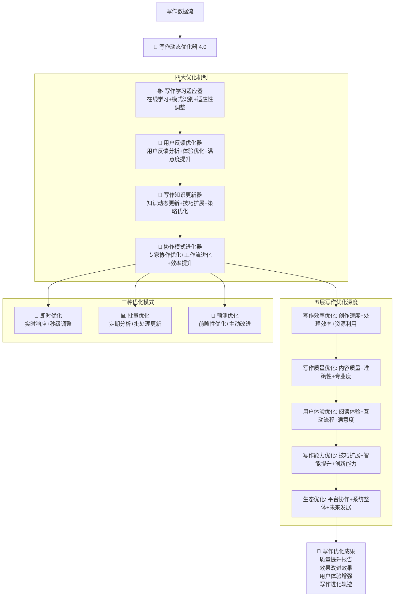

# 🔄 写作动态优化器 (Writing Dynamic Optimizer)

## 🚀 系统概述

**写作动态优化器**是Prompt-Create-4.0系统的核心优化模块，专门负责微信公众号和小红书写作能力的实时优化和动态调整。该优化器通过实时学习写作效果、分析用户反馈、优化写作策略等机制，实现写作质量的持续提升和智能进化。

### ⚡ 核心使命
> **实现写作能力的实时优化和动态进化，让每次写作都比上一次更好**

### 🎛️ 优化器特色
- **实时写作优化**: 基于写作效果的实时调整和优化
- **用户反馈驱动**: 根据用户反馈持续改进写作策略
- **平台适配优化**: 针对不同平台特色的动态优化
- **智能质量提升**: 自动识别和提升写作质量问题
- **预测性优化**: 前瞻性的写作趋势适应和优化

## 🧠 核心架构：四维写作优化系统



## 💎 四大写作优化机制详解

### 📚 写作学习适应器
```yaml
核心功能:
  写作行为学习: ["用户写作习惯", "写作模式识别", "风格偏好适应", "个性化调整"]
  成功模式识别: ["爆款文章特征", "高转化内容", "用户喜爱模式", "平台热点规律"]
  写作策略调整: ["写作策略动态调整", "内容结构优化", "表达方式改进", "效果提升"]
  持续写作进化: ["写作能力递增", "技巧积累", "经验沉淀", "创作智能提升"]

写作学习算法:
  ```python
  def writing_learning_adaptation(writing_data, content_performance):
      """写作学习适应算法"""
      # Step 1: 写作行为模式分析
      writing_patterns = analyze_writing_behavior_patterns(writing_data)
      
      # Step 2: 内容表现监控
      performance_analysis = monitor_content_performance(content_performance)
      
      # Step 3: 学习目标识别
      learning_objectives = identify_writing_learning_objectives(
          writing_patterns, 
          performance_analysis
      )
      
      # Step 4: 写作技巧在线学习
      writing_improvements = execute_writing_online_learning(
          learning_objectives,
          writing_data,
          content_performance
      )
      
      # Step 5: 写作策略适应性调整
      adaptation_adjustments = apply_writing_adaptive_adjustments(writing_improvements)
      
      return {
          "writing_patterns": writing_patterns,
          "performance_analysis": performance_analysis,
          "writing_improvements": writing_improvements,
          "adaptation_adjustments": adaptation_adjustments,
          "learning_effectiveness": evaluate_writing_learning_effectiveness(adaptation_adjustments)
      }
  ```

写作学习维度:
  用户写作偏好学习: ["写作风格", "内容偏好", "质量标准", "效率要求"]
  平台表现学习: ["阅读量", "互动率", "分享率", "转化效果"]
  内容质量学习: ["内容深度", "专业准确性", "用户价值", "创新程度"]
  写作技巧学习: ["标题技巧", "结构优化", "表达方式", "情感共鸣"]
```

### 📊 **写作学习数据库**
```yaml
写作学习数据库:
  
  微信公众号学习指标:
    深度内容学习:
      - 成功指标: 阅读完成率>70%、分享率>15%、收藏率>20%
      - 失败指标: 跳出率>60%、停留时间<2分钟、互动率<5%
      - 学习要点: 逻辑结构、专业深度、价值输出
      - 优化方向: 增强论证力度、提升实用价值、优化阅读体验
    
    专业观点学习:
      - 成功指标: 评论质量高、专业认可度高、引用率高
      - 失败指标: 争议过大、专业性不足、观点模糊
      - 学习要点: 观点鲜明、论证有力、专业权威
      - 优化方向: 增强专业性、提升论证质量、明确立场
  
  小红书学习指标:
    种草内容学习:
      - 成功指标: 购买转化率>8%、收藏率>25%、分享率>12%
      - 失败指标: 互动率<10%、评论负面、转化率<3%
      - 学习要点: 真实体验、效果展示、购买引导
      - 优化方向: 增强真实感、突出效果、优化引导
    
    生活分享学习:
      - 成功指标: 点赞率>20%、评论互动高、关注转化高
      - 失败指标: 互动率<8%、内容重复、缺乏新意
      - 学习要点: 生活真实、情感共鸣、分享价值
      - 优化方向: 增强真实性、提升共鸣度、创新表达
  
  跨平台学习要点:
    语言风格学习:
      - 微信公众号: 理性专业、逻辑清晰、权威可信
      - 小红书: 感性真实、生活化、互动性强
      - 适配学习: 平台特色把握、风格切换、效果保持
    
    内容结构学习:
      - 微信公众号: 完整逻辑、层次分明、深度分析
      - 小红书: 快速抓取、视觉冲击、情感触发
      - 结构优化: 平台适配、用户习惯、阅读体验
```

### 🎯 **写作学习算法**
```python
class WritingLearningAdapter:
    """写作学习适应器"""
    
    def __init__(self):
        self.learning_metrics = {
            "微信公众号": {
                "阅读完成率": {"目标": 70, "权重": 0.3},
                "分享率": {"目标": 15, "权重": 0.25},
                "收藏率": {"目标": 20, "权重": 0.2},
                "评论质量": {"目标": 80, "权重": 0.15},
                "专业认可度": {"目标": 85, "权重": 0.1}
            },
            "小红书": {
                "购买转化率": {"目标": 8, "权重": 0.3},
                "收藏率": {"目标": 25, "权重": 0.25},
                "点赞率": {"目标": 20, "权重": 0.2},
                "评论互动": {"目标": 15, "权重": 0.15},
                "关注转化": {"目标": 5, "权重": 0.1}
            }
        }
    
    def learn_from_writing_performance(self, writing_data, performance_metrics):
        """从写作表现中学习"""
        learning_results = {}
        
        for platform, metrics in self.learning_metrics.items():
            if platform in performance_metrics:
                platform_learning = {}
                
                for metric, config in metrics.items():
                    if metric in performance_metrics[platform]:
                        actual_value = performance_metrics[platform][metric]
                        target_value = config["目标"]
                        weight = config["权重"]
                        
                        # 计算学习效果
                        learning_score = self.calculate_learning_score(
                            actual_value, target_value, weight
                        )
                        
                        # 生成学习建议
                        learning_suggestions = self.generate_learning_suggestions(
                            metric, actual_value, target_value, platform
                        )
                        
                        platform_learning[metric] = {
                            "实际值": actual_value,
                            "目标值": target_value,
                            "学习得分": learning_score,
                            "学习建议": learning_suggestions
                        }
                
                learning_results[platform] = platform_learning
        
        return learning_results
    
    def calculate_learning_score(self, actual_value, target_value, weight):
        """计算学习得分"""
        if actual_value >= target_value:
            return weight * 100  # 满分
        else:
            return weight * (actual_value / target_value) * 100
    
    def generate_learning_suggestions(self, metric, actual_value, target_value, platform):
        """生成学习建议"""
        gap = target_value - actual_value
        
        if gap <= 0:
            return "表现优秀，继续保持"
        
        suggestions = []
        
        if metric == "阅读完成率" and platform == "微信公众号":
            if gap > 20:
                suggestions.append("内容结构需要重大调整，增强开头吸引力")
                suggestions.append("简化语言表达，提高可读性")
            elif gap > 10:
                suggestions.append("优化段落结构，增加小标题")
                suggestions.append("增强内容价值感，减少冗余信息")
            else:
                suggestions.append("微调内容节奏，优化阅读体验")
        
        elif metric == "购买转化率" and platform == "小红书":
            if gap > 5:
                suggestions.append("增强产品体验描述的真实性")
                suggestions.append("优化购买引导的时机和方式")
            elif gap > 3:
                suggestions.append("强化产品效果展示")
                suggestions.append("增加使用场景的生活化描述")
            else:
                suggestions.append("微调种草语言，增强说服力")
        
        return suggestions
    
    def adapt_writing_strategy(self, learning_results):
        """适应写作策略"""
        adaptation_strategies = {}
        
        for platform, platform_learning in learning_results.items():
            platform_strategies = []
            
            # 分析整体表现
            overall_score = sum(item["学习得分"] for item in platform_learning.values())
            
            if overall_score < 60:
                platform_strategies.append("需要全面改进写作策略")
            elif overall_score < 80:
                platform_strategies.append("写作策略需要重点优化")
            else:
                platform_strategies.append("写作策略表现良好，继续精进")
            
            # 生成具体策略
            for metric, learning_data in platform_learning.items():
                if learning_data["学习得分"] < 80:
                    platform_strategies.extend(learning_data["学习建议"])
            
            adaptation_strategies[platform] = platform_strategies
        
        return adaptation_strategies
```

### 💬 使用反馈优化器
```yaml
核心功能:
  反馈收集: ["用户评分", "使用体验", "改进建议", "满意度调查"]
  反馈分析: ["情感分析", "需求提取", "问题识别", "优化方向"]
  体验优化: ["交互优化", "流程改进", "界面优化", "功能增强"]
  满意度提升: ["痛点解决", "期望满足", "体验升级", "价值提升"]

反馈处理算法:
  ```python
  def user_feedback_optimization(feedback_data, user_satisfaction_metrics):
      """用户反馈优化算法"""
      # Step 1: 反馈数据预处理
      processed_feedback = preprocess_feedback_data(feedback_data)
      
      # Step 2: 情感和需求分析
      sentiment_analysis = analyze_feedback_sentiment(processed_feedback)
      needs_analysis = extract_user_needs(processed_feedback)
      
      # Step 3: 问题和机会识别
      problems_identified = identify_problems(sentiment_analysis, needs_analysis)
      optimization_opportunities = discover_optimization_opportunities(problems_identified)
      
      # Step 4: 优化策略制定
      optimization_strategies = develop_optimization_strategies(optimization_opportunities)
      
      # Step 5: 效果预测和实施
      optimization_implementation = implement_optimizations(optimization_strategies)
      
      return {
          "feedback_analysis": sentiment_analysis,
          "user_needs": needs_analysis,
          "identified_problems": problems_identified,
          "optimization_strategies": optimization_strategies,
          "implementation_results": optimization_implementation
      }
  ```

反馈分类处理:
  正面反馈: ["成功要素提取", "优势强化", "经验复制", "模式推广"]
  负面反馈: ["问题根因分析", "解决方案设计", "改进实施", "效果验证"]
  建议反馈: ["需求评估", "可行性分析", "优先级排序", "开发规划"]
  中性反馈: ["潜在需求挖掘", "改进机会识别", "用户期望分析", "功能完善"]
```

### 🧠 知识图谱更新器
```yaml
核心功能:
  知识动态更新: ["新知识获取", "过时知识更新", "知识验证", "准确性保证"]
  图谱扩展: ["新领域添加", "关联扩展", "深度增强", "覆盖面扩大"]
  关联优化: ["关系强化", "连接优化", "路径简化", "检索效率"]
  质量控制: ["知识去重", "准确性验证", "权威性检查", "时效性更新"]

更新算法:
  ```python
  def knowledge_graph_updater(current_knowledge_graph, new_information_sources):
      """知识图谱动态更新算法"""
      # Step 1: 新知识识别和提取
      new_knowledge = extract_new_knowledge(new_information_sources)
      
      # Step 2: 知识冲突检测
      conflicts = detect_knowledge_conflicts(current_knowledge_graph, new_knowledge)
      
      # Step 3: 知识融合策略
      fusion_strategy = develop_knowledge_fusion_strategy(conflicts, new_knowledge)
      
      # Step 4: 图谱结构优化
      graph_optimization = optimize_graph_structure(
          current_knowledge_graph, 
          fusion_strategy
      )
      
      # Step 5: 更新效果验证
      update_validation = validate_knowledge_updates(graph_optimization)
      
      return {
          "new_knowledge_extracted": new_knowledge,
          "conflicts_resolved": conflicts,
          "fusion_strategy": fusion_strategy,
          "optimized_graph": graph_optimization,
          "validation_results": update_validation
      }
  ```

更新策略:
  增量更新: ["新知识点添加", "关联关系扩展", "属性信息补充", "层次结构优化"]
  替换更新: ["过时信息替换", "错误纠正", "精度提升", "标准统一"]
  结构更新: ["图谱重组", "分类优化", "层次调整", "模块化重构"]
  智能更新: ["自动识别更新需求", "智能冲突解决", "质量自动验证", "效果自动评估"]
```

### 🤝 协作模式进化器
```yaml
核心功能:
  协作效果监控: ["模块间协作", "数据流分析", "性能瓶颈", "协作质量"]
  工作流优化: ["流程简化", "并行优化", "依赖关系", "效率提升"]
  协作策略进化: ["协作模式创新", "新协作方式", "智能调度", "自适应协作"]
  整体性能提升: ["系统级优化", "全局协调", "资源平衡", "能力最大化"]

进化算法:
  ```python
  def collaboration_evolution(collaboration_data, performance_metrics):
      """协作模式进化算法"""
      # Step 1: 协作模式分析
      collaboration_patterns = analyze_collaboration_patterns(collaboration_data)
      
      # Step 2: 性能瓶颈识别
      bottlenecks = identify_performance_bottlenecks(
          collaboration_patterns, 
          performance_metrics
      )
      
      # Step 3: 进化策略设计
      evolution_strategies = design_evolution_strategies(bottlenecks)
      
      # Step 4: 协作模式优化
      optimized_collaboration = optimize_collaboration_modes(evolution_strategies)
      
      # Step 5: 进化效果评估
      evolution_effectiveness = evaluate_evolution_effectiveness(optimized_collaboration)
      
      return {
          "collaboration_analysis": collaboration_patterns,
          "identified_bottlenecks": bottlenecks,
          "evolution_strategies": evolution_strategies,
          "optimized_modes": optimized_collaboration,
          "evolution_effectiveness": evolution_effectiveness
      }
  ```

进化方向:
  效率进化: ["处理速度提升", "并发能力增强", "资源利用优化", "响应时间缩短"]
  质量进化: ["输出质量提升", "错误率降低", "准确性增强", "专业度提高"]
  智能进化: ["自动化程度提升", "智能决策增强", "自适应能力", "学习能力"]
  创新进化: ["新协作模式", "创新工作流", "突破性改进", "未来发展"]
```

## 🚀 五层优化深度

### 第一层：性能优化 - 响应速度与处理效率
```yaml
优化目标:
  响应速度: ["毫秒级响应", "快速启动", "即时反馈", "无延迟体验"]
  处理效率: ["高并发处理", "批量优化", "算法效率", "计算优化"]
  资源利用: ["内存优化", "CPU优化", "网络优化", "存储优化"]
  稳定性: ["系统稳定", "容错能力", "恢复能力", "持续可用"]

优化策略:
  缓存优化: ["智能缓存", "热数据预加载", "缓存更新策略", "缓存命中率提升"]
  算法优化: ["时间复杂度优化", "空间复杂度优化", "并行算法", "分布式处理"]
  架构优化: ["微服务架构", "负载均衡", "异步处理", "流水线处理"]
```

### 第二层：质量优化 - 输出质量与准确性
```yaml
优化目标:
  输出质量: ["内容准确性", "逻辑一致性", "表达清晰度", "专业水准"]
  准确性: ["信息准确", "计算精确", "推理正确", "预测准确"]
  专业度: ["领域专业性", "技术深度", "方法专业性", "标准符合性"]
  可靠性: ["结果可信", "过程可控", "质量稳定", "持续可靠"]

优化策略:
  质量检测: ["自动质量检查", "多维度验证", "专业标准对比", "质量评分"]
  错误预防: ["错误模式识别", "风险预警", "预防机制", "纠错算法"]
  持续改进: ["质量反馈循环", "改进措施跟踪", "效果监控", "标准提升"]
```

### 第三层：体验优化 - 用户体验与交互流程
```yaml
优化目标:
  用户体验: ["界面友好", "操作简单", "体验流畅", "满意度高"]
  交互流程: ["流程简化", "步骤优化", "引导清晰", "错误处理"]
  个性化: ["个人偏好", "定制化服务", "智能推荐", "适应性调整"]
  可访问性: ["多设备支持", "无障碍设计", "多语言支持", "包容性设计"]

优化策略:
  用户研究: ["用户行为分析", "需求调研", "痛点识别", "期望管理"]
  设计优化: ["界面设计优化", "交互设计改进", "信息架构优化", "视觉设计提升"]
  个性化算法: ["用户画像构建", "推荐算法优化", "个性化内容", "自适应界面"]
```

### 第四层：能力优化 - 功能扩展与智能提升
```yaml
优化目标:
  功能扩展: ["新功能开发", "能力边界扩展", "应用场景拓展", "服务范围扩大"]
  智能提升: ["AI能力增强", "自动化程度提高", "智能决策改进", "学习能力提升"]
  创新能力: ["创新算法", "新方法探索", "突破性功能", "前沿技术应用"]
  适应能力: ["环境适应", "需求适应", "技术适应", "变化响应"]

优化策略:
  能力评估: ["现有能力盘点", "能力缺口分析", "提升潜力评估", "发展路径规划"]
  技术升级: ["算法升级", "模型优化", "架构演进", "技术栈更新"]
  创新研发: ["前沿技术研究", "创新概念验证", "试点项目", "渐进式创新"]
```

### 第五层：生态优化 - 模块协作与系统整体
```yaml
优化目标:
  模块协作: ["协作效率", "协作质量", "协作创新", "协作智能"]
  系统整体: ["整体性能", "系统稳定", "可扩展性", "可维护性"]
  生态健康: ["生态平衡", "可持续发展", "创新活力", "进化能力"]
  未来发展: ["技术前瞻", "趋势适应", "战略布局", "持续进化"]

优化策略:
  生态设计: ["模块化设计", "接口标准化", "协作协议", "生态规则"]
  整体优化: ["系统级调优", "全局资源调度", "整体性能提升", "协同效应"]
  可持续发展: ["技术债务管理", "架构演进规划", "持续集成", "持续部署"]
```

## 📊 输出标准

### 🎯 实时优化信息输出
```yaml
学习适应报告:
  - 用户行为模式分析结果
  - 系统性能学习效果
  - 适应性调整实施情况
  - 学习效果评估和改进建议

反馈优化报告:
  - 用户反馈分析和分类
  - 问题识别和解决方案
  - 体验优化实施效果
  - 满意度提升成果

知识更新报告:
  - 知识图谱更新内容
  - 新知识整合效果
  - 图谱质量提升情况
  - 检索效率改进成果

协作进化报告:
  - 协作模式分析和优化
  - 工作流程改进效果
  - 协作效率提升成果
  - 系统整体性能改善
```

### 🚀 优化成果输出
```yaml
五层优化成果:
  性能优化: 响应速度提升X%，处理效率提升Y%，资源利用率优化Z%
  质量优化: 输出质量提升A%，准确性提升B%，专业度提升C%
  体验优化: 用户满意度提升D%，操作效率提升E%，个性化程度提升F%
  能力优化: 功能扩展G项，智能化程度提升H%，创新能力提升I%
  生态优化: 协作效率提升J%，系统稳定性提升K%，可扩展性提升L%

三种优化模式成果:
  即时优化: 实时响应优化，秒级调整效果，用户体验即时改善
  批量优化: 定期性能提升，系统级优化效果，整体质量改进
  预测优化: 前瞻性改进，主动问题预防，未来需求满足

持续改进轨迹:
  短期改进: 1-7天内的即时优化效果
  中期改进: 1-4周的系统性优化成果
  长期改进: 1-3个月的整体进化效果
  战略改进: 3-12个月的生态级优化愿景
```

## 🔄 与其他模块协作

### 上游模块协作
```yaml
接收来自:
  - @prompt-create-4.0-创新融合算法器: 创新优化方向指导
  - @prompt-create-4.0-多模态协作引擎: 多模态效果监控数据
  - @.cursor/rules/prompt-create-3.0/engine/prompt-create-3.0-满意度评估器.md: 传统满意度评估基准

协作方式:
  - 根据创新融合结果优化系统创新能力
  - 监控多模态协作效果并实时优化
  - 结合传统满意度评估优化用户体验
```

### 下游模块协作
```yaml
输出给:
  - @prompt-create-4.0-自适应学习引擎: 优化策略和学习方向
  - @.cursor/rules/prompt-create-3.0/engine/prompt-create-3.0-迭代循环控制器.md: 优化的迭代策略
  - 所有系统模块: 性能优化和质量改进建议

协作效果:
  - 为自适应学习提供优化的学习策略
  - 增强迭代循环的优化效果
  - 提升整个系统的运行效率和质量
```

## 🧠 认知科学小白话讲解

### 核心概念通俗化

#### **实时学习适应器** = "聪明的学习机器"
> 就像一个很聪明的学生，不仅能从老师那里学习，还能从每次考试、每次作业中学习。系统会观察你怎么使用它，什么时候满意，什么时候不满意，然后自动调整自己的"学习方法"，变得越来越适合你的需求。

#### **使用反馈优化器** = "贴心的服务员"
> 就像五星级酒店的金牌服务员，特别善于观察客人的表情和反应。如果发现客人皱眉，会立即询问原因并改进服务；如果看到客人满意的笑容，会记住是什么让客人开心，下次提供更好的服务。

#### **知识图谱更新器** = "勤奋的图书管理员"
> 就像一个永不疲倦的图书管理员，不断地更新图书馆的书籍，添加新书，更新过时的信息，重新整理分类，确保每个人都能快速找到最新最准确的知识。

#### **协作模式进化器** = "智能的团队教练"
> 就像一个优秀的团队教练，观察团队成员的配合情况，发现配合中的问题和亮点，然后调整战术，让团队合作更默契，效率更高，创造出1+1>2的协作效果。

## 🎊 模块启动

### **🔄 实时动态优化器 4.0 已就绪！**

**核心能力**：
- 📚 实时学习用户需求和使用模式
- 💬 智能分析反馈并持续改进体验
- 🧠 动态更新知识图谱保持前沿性
- 🤝 优化模块协作提升整体效能

**立即启动持续优化之旅：**
- 监控系统运行和用户使用情况
- 实时学习和适应用户需求变化
- 持续优化性能、质量和体验
- 推动系统智能进化和能力提升

*让系统像生命体一样持续学习、成长和进化！* ✨ 