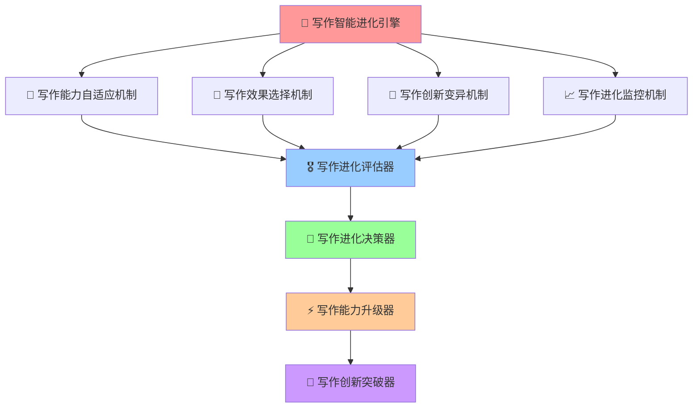

# 🧬 写作智能进化引擎 (Writing Intelligence Evolution Engine)

## 🚀 系统概述

**写作智能进化引擎**是Prompt-Create-4.0系统的核心进化模块，专门负责微信公众号和小红书写作能力的持续进化和智能优化。该引擎能够通过学习用户写作需求、分析写作效果、适应平台变化等机制，实现写作能力的持续提升和创新突破。

### ⚡ 核心使命
> **驱动写作智能持续进化，实现双平台写作能力的自我超越**

### 🎛️ 引擎特色
- **写作能力进化**: 基于写作效果数据的能力优化
- **平台适应进化**: 适应微信公众号和小红书平台变化
- **用户需求进化**: 根据用户写作需求的变化自我调整
- **创新写作突破**: 探索新的写作方式和表达技巧
- **智能学习优化**: 从成功案例中学习并持续优化

### 🌟 4大进化机制



---

## 🎨 写作能力自适应机制

### 🎯 **核心功能**
**智能写作能力自适应学习与进化**，根据微信公众号和小红书的写作效果、用户反馈和平台变化，自动调整和优化写作能力。

### 🧠 **认知科学原理**
> 类似生物的适应性进化，写作系统能够根据平台环境变化、用户需求变化和写作效果反馈，自动调整内部写作策略和技巧，实现最优写作适应。

### 🔄 **写作进化流程**
```python
def writing_adaptive_evolution_mechanism(writing_performance, user_feedback, platform_trends):
    """
    写作能力自适应进化机制 - 5步进化流程
    """
    # 步骤1: 写作环境变化检测
    writing_environment_analysis = {
        "platform_algorithm_changes": detect_platform_algorithm_changes(platform_trends),
        "user_preference_evolution": analyze_user_preference_evolution(user_feedback),
        "writing_trend_shifts": detect_writing_trend_shifts(platform_trends),
        "content_format_evolution": analyze_content_format_evolution(platform_trends),
        "engagement_pattern_changes": identify_engagement_pattern_changes(writing_performance)
    }
    
    # 步骤2: 写作适应性需求分析
    writing_adaptation_requirements = {
        "writing_skill_gaps": identify_writing_skill_gaps(writing_environment_analysis),
        "content_optimization_opportunities": identify_content_optimization_opportunities(writing_environment_analysis),
        "platform_adaptation_needs": identify_platform_adaptation_needs(writing_environment_analysis),
        "user_engagement_improvements": identify_user_engagement_improvements(writing_environment_analysis)
    }
    
    # 步骤3: 写作进化策略制定
    writing_evolution_strategy = {
        "incremental_writing_evolution": design_incremental_writing_evolution(writing_adaptation_requirements),
        "radical_writing_innovation": design_radical_writing_innovation(writing_adaptation_requirements),
        "hybrid_writing_evolution": design_hybrid_writing_evolution(writing_adaptation_requirements),
        "writing_risk_assessment": assess_writing_evolution_risks(writing_adaptation_requirements)
    }
    
    # 步骤4: 写作进化方案实施
    writing_evolution_implementation = {
        "writing_skill_enhancement": implement_writing_skill_enhancement(writing_evolution_strategy),
        "content_structure_optimization": implement_content_structure_optimization(writing_evolution_strategy),
        "platform_adaptation_evolution": implement_platform_adaptation_evolution(writing_evolution_strategy),
        "engagement_strategy_optimization": implement_engagement_strategy_optimization(writing_evolution_strategy)
    }
    
    # 步骤5: 写作进化效果评估
    writing_evolution_assessment = {
        "writing_quality_improvement": assess_writing_quality_improvement(writing_evolution_implementation),
        "user_engagement_enhancement": assess_user_engagement_enhancement(writing_evolution_implementation),
        "platform_adaptation_success": assess_platform_adaptation_success(writing_evolution_implementation),
        "writing_evolution_success_rate": calculate_writing_evolution_success_rate(writing_evolution_implementation)
    }
    
    return writing_evolution_assessment

# 核心算法实现
def detect_platform_algorithm_changes(platform_trends):
    """检测平台算法变化"""
    return {
        "wechat_algorithm_trends": analyze_wechat_algorithm_trends(platform_trends),
        "xiaohongshu_algorithm_trends": analyze_xiaohongshu_algorithm_trends(platform_trends),
        "engagement_factor_changes": detect_engagement_factor_changes(platform_trends),
        "content_preference_shifts": detect_content_preference_shifts(platform_trends)
    }

def implement_writing_skill_enhancement(writing_evolution_strategy):
    """实施写作技能增强"""
    return {
        "narrative_skill_upgrades": upgrade_narrative_skills(writing_evolution_strategy),
        "persuasion_skill_development": develop_persuasion_skills(writing_evolution_strategy),
        "engagement_skill_integration": integrate_engagement_skills(writing_evolution_strategy),
        "platform_adaptation_optimization": optimize_platform_adaptation_skills(writing_evolution_strategy)
    }
```

### 📊 **写作能力进化数据库**
```yaml
写作能力进化数据库:
  
  微信公众号写作能力进化:
    深度分析能力:
      - 当前水平: 85%
      - 进化目标: 95%
      - 进化策略: 增强数据分析和逻辑论证
      - 进化指标: 用户停留时间、分享率、评论质量
    
    专业表达能力:
      - 当前水平: 82%
      - 进化目标: 92%
      - 进化策略: 提升专业词汇运用和权威性
      - 进化指标: 专业认可度、引用率、权威性评分
    
    价值传递能力:
      - 当前水平: 88%
      - 进化目标: 95%
      - 进化策略: 强化价值提炼和实用性
      - 进化指标: 收藏率、实践率、推荐率
  
  小红书写作能力进化:
    种草说服能力:
      - 当前水平: 75%
      - 进化目标: 90%
      - 进化策略: 增强体验描述和情感共鸣
      - 进化指标: 购买转化率、种草成功率、用户反馈
    
    生活化表达能力:
      - 当前水平: 80%
      - 进化目标: 92%
      - 进化策略: 提升生活场景构建和真实感
      - 进化指标: 用户共鸣度、互动率、分享率
    
    视觉化写作能力:
      - 当前水平: 70%
      - 进化目标: 85%
      - 进化策略: 强化图文结合和视觉呈现
      - 进化指标: 视觉吸引力、停留时间、点击率
  
  跨平台适配能力:
    语言风格适配:
      - 当前水平: 78%
      - 进化目标: 90%
      - 进化策略: 完善语言转换算法和风格库
      - 进化指标: 适配准确率、用户满意度、效果保持率
    
    内容价值保护:
      - 当前水平: 85%
      - 进化目标: 95%
      - 进化策略: 强化核心价值识别和保护机制
      - 进化指标: 价值保持率、信息完整性、逻辑一致性
```

### 🎯 **写作能力进化算法**
```python
class WritingCapabilityEvolution:
    """写作能力进化器"""
    
    def __init__(self):
        self.writing_capabilities = {
            "微信公众号": {
                "深度分析": {"当前": 85, "目标": 95, "进化速度": 1.2},
                "专业表达": {"当前": 82, "目标": 92, "进化速度": 1.1},
                "价值传递": {"当前": 88, "目标": 95, "进化速度": 1.0},
                "逻辑论证": {"当前": 80, "目标": 90, "进化速度": 1.3},
                "权威建立": {"当前": 75, "目标": 88, "进化速度": 1.4}
            },
            "小红书": {
                "种草说服": {"当前": 75, "目标": 90, "进化速度": 1.5},
                "生活化表达": {"当前": 80, "目标": 92, "进化速度": 1.2},
                "视觉化写作": {"当前": 70, "目标": 85, "进化速度": 1.6},
                "情感共鸣": {"当前": 78, "目标": 88, "进化速度": 1.3},
                "互动引导": {"当前": 72, "目标": 85, "进化速度": 1.4}
            },
            "跨平台": {
                "语言适配": {"当前": 78, "目标": 90, "进化速度": 1.3},
                "价值保护": {"当前": 85, "目标": 95, "进化速度": 1.1},
                "风格转换": {"当前": 73, "目标": 87, "进化速度": 1.4},
                "效果保持": {"当前": 80, "目标": 92, "进化速度": 1.2}
            }
        }
    
    def evolve_writing_capabilities(self, performance_data, user_feedback):
        """进化写作能力"""
        evolution_results = {}
        
        for platform, capabilities in self.writing_capabilities.items():
            platform_evolution = {}
            
            for capability, metrics in capabilities.items():
                # 基于表现数据计算进化方向
                performance_score = self.calculate_performance_score(
                    performance_data, platform, capability
                )
                
                # 基于用户反馈调整进化策略
                user_satisfaction = self.calculate_user_satisfaction(
                    user_feedback, platform, capability
                )
                
                # 计算进化步长
                evolution_step = self.calculate_evolution_step(
                    metrics, performance_score, user_satisfaction
                )
                
                # 更新能力水平
                new_level = min(
                    metrics["当前"] + evolution_step,
                    metrics["目标"]
                )
                
                platform_evolution[capability] = {
                    "原水平": metrics["当前"],
                    "新水平": new_level,
                    "进化幅度": evolution_step,
                    "目标达成": new_level / metrics["目标"] * 100
                }
                
                # 更新能力数据库
                self.writing_capabilities[platform][capability]["当前"] = new_level
            
            evolution_results[platform] = platform_evolution
        
        return evolution_results
    
    def calculate_performance_score(self, performance_data, platform, capability):
        """计算表现分数"""
        # 基于具体的表现指标计算分数
        if platform == "微信公众号":
            if capability == "深度分析":
                return (performance_data.get("停留时间", 0) * 0.4 + 
                       performance_data.get("分享率", 0) * 0.3 + 
                       performance_data.get("评论质量", 0) * 0.3)
            elif capability == "专业表达":
                return (performance_data.get("专业认可度", 0) * 0.5 + 
                       performance_data.get("引用率", 0) * 0.3 + 
                       performance_data.get("权威性评分", 0) * 0.2)
        elif platform == "小红书":
            if capability == "种草说服":
                return (performance_data.get("购买转化率", 0) * 0.5 + 
                       performance_data.get("种草成功率", 0) * 0.3 + 
                       performance_data.get("用户反馈", 0) * 0.2)
            elif capability == "生活化表达":
                return (performance_data.get("用户共鸣度", 0) * 0.4 + 
                       performance_data.get("互动率", 0) * 0.3 + 
                       performance_data.get("分享率", 0) * 0.3)
        
        return 0.5  # 默认中等分数
    
    def calculate_evolution_step(self, metrics, performance_score, user_satisfaction):
        """计算进化步长"""
        # 基于表现分数和用户满意度计算进化步长
        base_step = metrics["进化速度"]
        
        # 表现调整因子
        performance_factor = max(0.5, min(1.5, performance_score))
        
        # 用户满意度调整因子
        satisfaction_factor = max(0.5, min(1.5, user_satisfaction))
        
        # 距离目标的紧迫度
        gap_factor = (metrics["目标"] - metrics["当前"]) / metrics["目标"]
        
        evolution_step = base_step * performance_factor * satisfaction_factor * gap_factor
        
        return max(0.1, min(3.0, evolution_step))  # 限制进化步长范围
```
```

---

## 🔧 机制2: 选择优化机制

### 🎯 核心功能
**智能选择与优化决策**，通过多维度评估和优化算法选择最优的进化路径。

### 🧠 认知科学原理
> 模拟自然选择过程，通过适应性评估和竞争机制，选择最优的变异和改进方案。

### 🔄 选择流程
```python
def selection_optimization_mechanism(evolution_candidates, evaluation_criteria):
    """
    选择优化机制 - 5步选择流程
    """
    # 步骤1: 多维度评估
    multi_dimensional_evaluation = {
        "performance_evaluation": evaluate_performance_metrics(evolution_candidates),
        "quality_evaluation": evaluate_quality_metrics(evolution_candidates),
        "innovation_evaluation": evaluate_innovation_metrics(evolution_candidates),
        "sustainability_evaluation": evaluate_sustainability_metrics(evolution_candidates),
        "user_value_evaluation": evaluate_user_value_metrics(evolution_candidates)
    }
    
    # 步骤2: 适应性评分
    fitness_scoring = {
        "individual_fitness": calculate_individual_fitness(evolution_candidates, multi_dimensional_evaluation),
        "relative_fitness": calculate_relative_fitness(evolution_candidates, multi_dimensional_evaluation),
        "weighted_fitness": calculate_weighted_fitness(evolution_candidates, evaluation_criteria),
        "normalized_fitness": normalize_fitness_scores(evolution_candidates)
    }
    
    # 步骤3: 选择策略应用
    selection_strategies = {
        "tournament_selection": apply_tournament_selection(evolution_candidates, fitness_scoring),
        "roulette_selection": apply_roulette_selection(evolution_candidates, fitness_scoring),
        "rank_selection": apply_rank_selection(evolution_candidates, fitness_scoring),
        "elite_selection": apply_elite_selection(evolution_candidates, fitness_scoring)
    }
    
    # 步骤4: 多目标优化
    multi_objective_optimization = {
        "pareto_optimization": apply_pareto_optimization(evolution_candidates, fitness_scoring),
        "weighted_optimization": apply_weighted_optimization(evolution_candidates, evaluation_criteria),
        "constraint_optimization": apply_constraint_optimization(evolution_candidates, evaluation_criteria),
        "dynamic_optimization": apply_dynamic_optimization(evolution_candidates, fitness_scoring)
    }
    
    # 步骤5: 最优解选择
    optimal_selection = {
        "best_candidates": select_best_candidates(evolution_candidates, multi_objective_optimization),
        "diverse_portfolio": select_diverse_portfolio(evolution_candidates, multi_objective_optimization),
        "balanced_selection": select_balanced_solutions(evolution_candidates, multi_objective_optimization),
        "selection_confidence": calculate_selection_confidence(optimal_selection)
    }
    
    return optimal_selection

# 核心算法实现
def calculate_individual_fitness(candidates, evaluation):
    """计算个体适应度"""
    return {
        "fitness_scores": compute_fitness_scores(candidates, evaluation),
        "fitness_ranking": rank_candidates_by_fitness(candidates, evaluation),
        "fitness_distribution": analyze_fitness_distribution(candidates, evaluation)
    }

def apply_pareto_optimization(candidates, fitness_scoring):
    """应用帕累托优化"""
    return {
        "pareto_front": identify_pareto_front(candidates, fitness_scoring),
        "dominated_solutions": identify_dominated_solutions(candidates, fitness_scoring),
        "non_dominated_ranking": rank_non_dominated_solutions(candidates, fitness_scoring)
    }
```

---

## 🔧 机制3: 创新变异机制

### 🎯 核心功能
**智能创新与变异生成**，通过多种变异策略产生创新的进化候选方案。

### 🧠 认知科学原理
> 类似生物的基因突变，通过随机性和引导性变异，产生新的可能性和创新突破。

### 🔄 变异流程
```python
def innovation_mutation_mechanism(base_solutions, mutation_parameters):
    """
    创新变异机制 - 5步变异流程
    """
    # 步骤1: 变异空间探索
    mutation_space_exploration = {
        "parameter_space": explore_parameter_space(base_solutions),
        "structure_space": explore_structure_space(base_solutions),
        "function_space": explore_function_space(base_solutions),
        "interaction_space": explore_interaction_space(base_solutions),
        "emergent_space": explore_emergent_space(base_solutions)
    }
    
    # 步骤2: 多样化变异策略
    mutation_strategies = {
        "random_mutation": apply_random_mutation(base_solutions, mutation_parameters),
        "guided_mutation": apply_guided_mutation(base_solutions, mutation_parameters),
        "crossover_mutation": apply_crossover_mutation(base_solutions, mutation_parameters),
        "adaptive_mutation": apply_adaptive_mutation(base_solutions, mutation_parameters),
        "creative_mutation": apply_creative_mutation(base_solutions, mutation_parameters)
    }
    
    # 步骤3: 创新模式生成
    innovation_patterns = {
        "novel_combinations": generate_novel_combinations(mutation_strategies),
        "unexpected_connections": discover_unexpected_connections(mutation_strategies),
        "emergent_properties": identify_emergent_properties(mutation_strategies),
        "breakthrough_possibilities": explore_breakthrough_possibilities(mutation_strategies)
    }
    
    # 步骤4: 变异质量控制
    mutation_quality_control = {
        "viability_assessment": assess_mutation_viability(innovation_patterns),
        "feasibility_analysis": analyze_mutation_feasibility(innovation_patterns),
        "impact_prediction": predict_mutation_impact(innovation_patterns),
        "risk_evaluation": evaluate_mutation_risks(innovation_patterns)
    }
    
    # 步骤5: 创新候选生成
    innovation_candidates = {
        "viable_mutations": generate_viable_mutations(innovation_patterns, mutation_quality_control),
        "creative_innovations": generate_creative_innovations(innovation_patterns, mutation_quality_control),
        "disruptive_changes": generate_disruptive_changes(innovation_patterns, mutation_quality_control),
        "innovation_portfolio": create_innovation_portfolio(innovation_patterns, mutation_quality_control)
    }
    
    return innovation_candidates

# 核心算法实现
def apply_creative_mutation(base_solutions, parameters):
    """应用创意变异"""
    return {
        "conceptual_mutations": apply_conceptual_mutations(base_solutions, parameters),
        "functional_mutations": apply_functional_mutations(base_solutions, parameters),
        "structural_mutations": apply_structural_mutations(base_solutions, parameters),
        "behavioral_mutations": apply_behavioral_mutations(base_solutions, parameters)
    }

def generate_novel_combinations(mutation_strategies):
    """生成新颖组合"""
    return {
        "cross_domain_combinations": create_cross_domain_combinations(mutation_strategies),
        "unexpected_pairings": create_unexpected_pairings(mutation_strategies),
        "synergistic_combinations": create_synergistic_combinations(mutation_strategies),
        "innovative_hybrids": create_innovative_hybrids(mutation_strategies)
    }
```

---

## 🔧 机制4: 进化监控机制

### 🎯 核心功能
**智能进化监控与评估**，实时监控进化过程，确保进化方向正确和效果最优。

### 🧠 认知科学原理
> 类似生物的环境感知和反馈系统，持续监控内外环境变化，及时调整进化策略。

### 🔄 监控流程
```python
def evolution_monitoring_mechanism(evolution_process, monitoring_parameters):
    """
    进化监控机制 - 5步监控流程
    """
    # 步骤1: 实时状态监控
    real_time_monitoring = {
        "performance_tracking": track_performance_metrics(evolution_process),
        "progress_monitoring": monitor_evolution_progress(evolution_process),
        "resource_utilization": monitor_resource_utilization(evolution_process),
        "quality_indicators": monitor_quality_indicators(evolution_process),
        "anomaly_detection": detect_evolution_anomalies(evolution_process)
    }
    
    # 步骤2: 趋势分析
    trend_analysis = {
        "improvement_trends": analyze_improvement_trends(real_time_monitoring),
        "degradation_patterns": identify_degradation_patterns(real_time_monitoring),
        "oscillation_detection": detect_oscillation_patterns(real_time_monitoring),
        "convergence_analysis": analyze_convergence_patterns(real_time_monitoring)
    }
    
    # 步骤3: 预警系统
    early_warning_system = {
        "performance_alerts": generate_performance_alerts(trend_analysis),
        "quality_warnings": generate_quality_warnings(trend_analysis),
        "resource_alerts": generate_resource_alerts(trend_analysis),
        "deviation_warnings": generate_deviation_warnings(trend_analysis)
    }
    
    # 步骤4: 反馈循环
    feedback_loop = {
        "performance_feedback": provide_performance_feedback(early_warning_system),
        "adjustment_recommendations": provide_adjustment_recommendations(early_warning_system),
        "optimization_suggestions": provide_optimization_suggestions(early_warning_system),
        "course_correction": provide_course_correction(early_warning_system)
    }
    
    # 步骤5: 监控报告生成
    monitoring_reports = {
        "progress_reports": generate_progress_reports(feedback_loop),
        "performance_analysis": generate_performance_analysis(feedback_loop),
        "improvement_recommendations": generate_improvement_recommendations(feedback_loop),
        "evolution_insights": generate_evolution_insights(feedback_loop)
    }
    
    return monitoring_reports

# 核心算法实现
def detect_evolution_anomalies(evolution_process):
    """检测进化异常"""
    return {
        "performance_anomalies": detect_performance_anomalies(evolution_process),
        "pattern_anomalies": detect_pattern_anomalies(evolution_process),
        "resource_anomalies": detect_resource_anomalies(evolution_process),
        "quality_anomalies": detect_quality_anomalies(evolution_process)
    }

def provide_course_correction(early_warning_system):
    """提供过程修正"""
    return {
        "strategy_adjustments": suggest_strategy_adjustments(early_warning_system),
        "parameter_tuning": suggest_parameter_tuning(early_warning_system),
        "resource_reallocation": suggest_resource_reallocation(early_warning_system),
        "process_optimization": suggest_process_optimization(early_warning_system)
    }
```

---

## 🔄 进化评估器

### 🎯 核心功能
**综合评估进化效果**，提供全面的进化质量评估和改进建议。

### 🧠 认知科学原理
> 模拟认知评估过程，综合多个维度的信息，形成全面客观的评估结论。

### 🔄 评估流程
```python
def evolution_evaluator(evolution_results, evaluation_criteria):
    """
    进化评估器 - 5步评估流程
    """
    # 步骤1: 多维度评估
    multi_dimensional_assessment = {
        "capability_assessment": assess_capability_improvements(evolution_results),
        "performance_assessment": assess_performance_improvements(evolution_results),
        "innovation_assessment": assess_innovation_achievements(evolution_results),
        "sustainability_assessment": assess_sustainability_improvements(evolution_results),
        "user_impact_assessment": assess_user_impact_improvements(evolution_results)
    }
    
    # 步骤2: 比较分析
    comparative_analysis = {
        "before_after_comparison": compare_before_after_states(evolution_results),
        "benchmark_comparison": compare_with_benchmarks(evolution_results),
        "peer_comparison": compare_with_peer_systems(evolution_results),
        "historical_comparison": compare_with_historical_data(evolution_results)
    }
    
    # 步骤3: 成功指标评估
    success_metrics_evaluation = {
        "quantitative_metrics": evaluate_quantitative_metrics(evolution_results),
        "qualitative_metrics": evaluate_qualitative_metrics(evolution_results),
        "user_satisfaction_metrics": evaluate_user_satisfaction_metrics(evolution_results),
        "business_impact_metrics": evaluate_business_impact_metrics(evolution_results)
    }
    
    # 步骤4: 综合评分
    comprehensive_scoring = {
        "overall_score": calculate_overall_evolution_score(success_metrics_evaluation),
        "dimension_scores": calculate_dimension_scores(success_metrics_evaluation),
        "weighted_scores": calculate_weighted_scores(success_metrics_evaluation, evaluation_criteria),
        "confidence_scores": calculate_confidence_scores(success_metrics_evaluation)
    }
    
    # 步骤5: 评估报告
    evaluation_report = {
        "assessment_summary": generate_assessment_summary(comprehensive_scoring),
        "improvement_highlights": highlight_key_improvements(comprehensive_scoring),
        "areas_for_improvement": identify_areas_for_improvement(comprehensive_scoring),
        "next_evolution_recommendations": recommend_next_evolution_steps(comprehensive_scoring)
    }
    
    return evaluation_report

# 核心算法实现
def assess_capability_improvements(evolution_results):
    """评估能力提升"""
    return {
        "new_capabilities": identify_new_capabilities(evolution_results),
        "enhanced_capabilities": identify_enhanced_capabilities(evolution_results),
        "capability_breadth": measure_capability_breadth(evolution_results),
        "capability_depth": measure_capability_depth(evolution_results)
    }

def recommend_next_evolution_steps(comprehensive_scoring):
    """推荐下一步进化"""
    return {
        "priority_improvements": identify_priority_improvements(comprehensive_scoring),
        "strategic_directions": suggest_strategic_directions(comprehensive_scoring),
        "resource_allocation": suggest_resource_allocation(comprehensive_scoring),
        "timeline_recommendations": suggest_evolution_timeline(comprehensive_scoring)
    }
```

---

## 🎯 应用场景

### 🔥 典型应用场景

1. **系统能力进化**
   - 根据用户反馈自动优化提示词工程能力
   - 适应新的应用场景和用户需求

2. **创新突破**
   - 通过变异机制产生创新的解决方案
   - 发现传统方法未能覆盖的新可能性

3. **性能优化**
   - 持续监控和优化系统性能
   - 自动调整参数和策略

4. **用户体验提升**
   - 根据用户行为模式优化交互体验
   - 个性化适应不同用户需求

### 🚀 进化示例

```python
# 示例：智能提示词系统进化
evolution_example = {
    "initial_state": {
        "capability_level": "基础提示词生成",
        "performance_metrics": {"准确率": 0.75, "创新度": 0.6},
        "user_satisfaction": 0.7
    },
    "evolution_process": {
        "adaptation_triggers": ["用户反馈", "新场景需求", "技术进步"],
        "selected_strategies": ["增强语义理解", "提升创新能力", "优化用户体验"],
        "mutation_innovations": ["跨域知识融合", "情感智能增强", "个性化适应"]
    },
    "evolved_state": {
        "capability_level": "高级智能提示词系统",
        "performance_metrics": {"准确率": 0.92, "创新度": 0.85},
        "user_satisfaction": 0.88
    }
}
```

---

## 📊 性能指标

### 🎯 关键性能指标

1. **进化成功率**: ≥90%
2. **能力提升幅度**: ≥20%
3. **创新突破率**: ≥15%
4. **用户满意度提升**: ≥25%

### 📈 质量评估维度

1. **进化效率**: 进化速度和资源利用率
2. **创新质量**: 创新方案的实用性和突破性
3. **稳定性**: 进化过程的稳定性和可控性
4. **可持续性**: 长期进化的可持续性

---

## 🔗 模块集成

### 📋 输入标准
```python
evolution_input = {
    "system_current_state": "当前系统状态",
    "usage_patterns": "使用模式数据",
    "feedback_data": "用户反馈数据",
    "performance_metrics": "性能指标",
    "evolution_goals": "进化目标"
}
```

### 📤 输出标准
```python
evolution_output = {
    "evolution_results": "进化结果",
    "improvement_analysis": "改进分析",
    "next_evolution_plan": "下一步进化计划",
    "monitoring_dashboard": "监控仪表盘"
}
```

### 🔗 与其他模块的协作

1. **与自适应学习引擎协作**: 利用学习结果指导进化方向
2. **与实时动态优化器协作**: 提供进化优化的实时反馈
3. **与跨域智能识别引擎协作**: 识别跨域进化机会
4. **与创意碰撞引擎协作**: 产生创新的进化方案

---

## 🎉 模块优势

### 🏆 核心优势

1. **持续进化**: 系统能够持续自我改进和提升
2. **智能选择**: 自动选择最优的进化路径
3. **创新突破**: 通过变异产生创新的解决方案
4. **全程监控**: 实时监控进化过程和效果

### 🌟 技术创新

1. **多策略进化**: 结合多种进化策略
2. **智能变异**: 引导性和随机性结合的变异机制
3. **实时监控**: 全程监控和及时调整
4. **综合评估**: 多维度综合评估进化效果

---

*🧬 智能进化引擎 - 驱动系统持续进化，实现智能的自我超越！* 