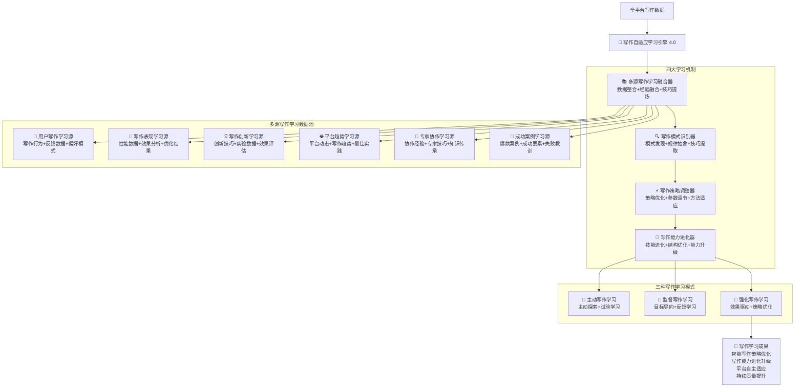

# 🧠 写作自适应学习引擎 (Writing Adaptive Learning Engine)

## 🚀 系统概述

**写作自适应学习引擎**是Prompt-Create-4.0系统的核心学习模块，专门负责微信公众号和小红书写作技能的自适应学习与智能进化。该引擎通过多源写作数据融合、写作模式识别、写作策略自适应调整等机制，实现写作能力的持续学习和智能提升。

### ⚡ 核心使命
> **作为写作智能的学习大脑，实现写作技能的持续学习、智能适应和自主进化**

### 🎛️ 引擎特色
- **多源写作学习**: 从多个数据源学习写作技巧和策略
- **写作模式识别**: 智能识别成功写作的模式和规律
- **自适应策略调整**: 根据学习结果自动调整写作策略
- **平台差异学习**: 针对不同平台特色的差异化学习
- **持续能力进化**: 写作能力的持续进化和提升

## 🧠 核心架构：四维写作学习系统



## 💎 四大写作学习机制详解

### 📚 多源写作学习融合器
```yaml
核心功能:
  写作数据整合: ["多平台写作数据统一", "写作数据清洗标准化", "数据质量评估", "写作数据融合算法"]
  写作经验融合: ["成功写作经验提取", "失败案例分析", "写作技巧归纳", "写作智慧沉淀"]
  写作技巧提炼: ["专家写作技巧提取", "隐性技巧显化", "技巧结构化", "技巧传承机制"]
  学习协调: ["学习优先级", "写作资源分配", "学习冲突解决", "学习效果评估"]

多源写作融合算法:
  ```python
  def multi_source_writing_learning_fusion(writing_sources, platform_context):
      """多源写作学习融合算法"""
      # Step 1: 多源写作数据预处理
      processed_writing_sources = preprocess_writing_data_sources(writing_sources)
      
      # Step 2: 写作数据质量评估和权重分配
      source_weights = assess_and_weight_writing_sources(
          processed_writing_sources,
          platform_context
      )
      
      # Step 3: 跨源写作模式识别
      cross_source_writing_patterns = identify_cross_source_writing_patterns(
          processed_writing_sources,
          source_weights
      )
      
      # Step 4: 写作技巧融合和提炼
      fused_writing_knowledge = fuse_and_distill_writing_knowledge(
          cross_source_writing_patterns,
          processed_writing_sources
      )
      
      # Step 5: 融合效果验证
      fusion_validation = validate_writing_fusion_effectiveness(
          fused_writing_knowledge,
          writing_sources
      )
      
      return {
          "processed_writing_sources": processed_writing_sources,
          "source_weights": source_weights,
          "cross_source_writing_patterns": cross_source_writing_patterns,
          "fused_writing_knowledge": fused_writing_knowledge,
          "fusion_validation": fusion_validation
      }
  ```

写作融合策略类型:
  平台融合: ["微信公众号数据整合", "小红书数据整合", "跨平台模式发现", "平台差异分析"]
  内容融合: ["深度内容分析", "种草内容分析", "生活分享分析", "专业观点分析"]
  技巧融合: ["标题技巧对齐", "结构技巧融合", "表达技巧整合", "互动技巧统一"]
  效果融合: ["阅读效果权重", "互动效果融合", "转化效果分析", "传播效果评估"]
```

### 📊 **写作学习数据源管理**
```yaml
写作学习数据源管理:
  
  用户写作学习源:
    数据类型: ["用户写作行为", "用户反馈数据", "用户偏好模式", "用户成长轨迹"]
    学习重点: ["写作习惯", "风格偏好", "质量要求", "效率需求"]
    数据权重: 30%
    更新频率: 实时更新
    质量标准: 真实性95%、完整性90%、时效性95%
  
  写作表现学习源:
    数据类型: ["内容表现数据", "效果分析数据", "优化结果数据", "A/B测试数据"]
    学习重点: ["阅读量", "互动率", "分享率", "转化效果"]
    数据权重: 25%
    更新频率: 每日更新
    质量标准: 准确性98%、完整性95%、一致性90%
  
  写作创新学习源:
    数据类型: ["创新技巧数据", "实验数据", "效果评估", "创新成功率"]
    学习重点: ["新技巧验证", "创新效果", "用户接受度", "推广价值"]
    数据权重: 15%
    更新频率: 每周更新
    质量标准: 创新性85%、实用性80%、可验证性90%
  
  平台趋势学习源:
    数据类型: ["平台算法变化", "用户行为趋势", "内容流行趋势", "行业最佳实践"]
    学习重点: ["算法适应", "趋势跟进", "用户喜好", "竞品分析"]
    数据权重: 15%
    更新频率: 每周更新
    质量标准: 时效性95%、相关性85%、权威性90%
  
  专家协作学习源:
    数据类型: ["专家协作经验", "专家技巧传授", "知识传承记录", "协作效果数据"]
    学习重点: ["专家技巧", "协作模式", "知识传承", "效果优化"]
    数据权重: 10%
    更新频率: 每月更新
    质量标准: 专业性95%、实用性90%、传承性85%
  
  成功案例学习源:
    数据类型: ["爆款案例分析", "成功要素提取", "失败教训总结", "改进机会识别"]
    学习重点: ["成功模式", "关键要素", "失败原因", "改进方向"]
    数据权重: 5%
    更新频率: 每月更新
    质量标准: 典型性90%、分析深度85%、借鉴价值90%
```

### 🎯 **多源融合算法**
```python
class MultiSourceWritingLearningFusion:
    """多源写作学习融合器"""
    
    def __init__(self):
        self.data_sources = {
            "用户写作学习源": {"权重": 0.30, "质量阈值": 90},
            "写作表现学习源": {"权重": 0.25, "质量阈值": 95},
            "写作创新学习源": {"权重": 0.15, "质量阈值": 85},
            "平台趋势学习源": {"权重": 0.15, "质量阈值": 90},
            "专家协作学习源": {"权重": 0.10, "质量阈值": 90},
            "成功案例学习源": {"权重": 0.05, "质量阈值": 88}
        }
        
        self.fusion_strategies = {
            "平台融合": self.fuse_platform_data,
            "内容融合": self.fuse_content_data,
            "技巧融合": self.fuse_technique_data,
            "效果融合": self.fuse_effect_data
        }
    
    def fuse_multi_source_data(self, writing_sources):
        """融合多源写作数据"""
        fusion_results = {}
        
        # Step 1: 数据质量验证
        validated_sources = self.validate_data_quality(writing_sources)
        
        # Step 2: 数据权重分配
        weighted_sources = self.assign_data_weights(validated_sources)
        
        # Step 3: 跨源模式识别
        cross_patterns = self.identify_cross_source_patterns(weighted_sources)
        
        # Step 4: 技巧融合提炼
        fused_techniques = self.fuse_writing_techniques(cross_patterns)
        
        # Step 5: 知识结构化
        structured_knowledge = self.structure_writing_knowledge(fused_techniques)
        
        return {
            "融合数据": structured_knowledge,
            "跨源模式": cross_patterns,
            "技巧库": fused_techniques,
            "质量评分": self.evaluate_fusion_quality(structured_knowledge)
        }
    
    def validate_data_quality(self, writing_sources):
        """验证写作数据质量"""
        validated_sources = {}
        
        for source_name, source_data in writing_sources.items():
            if source_name in self.data_sources:
                quality_threshold = self.data_sources[source_name]["质量阈值"]
                quality_score = self.calculate_data_quality(source_data)
                
                if quality_score >= quality_threshold:
                    validated_sources[source_name] = {
                        "数据": source_data,
                        "质量分数": quality_score,
                        "验证状态": "通过"
                    }
                else:
                    validated_sources[source_name] = {
                        "数据": self.clean_low_quality_data(source_data),
                        "质量分数": quality_score,
                        "验证状态": "需清洗"
                    }
        
        return validated_sources
    
    def fuse_platform_data(self, platform_data):
        """融合平台数据"""
        wechat_patterns = self.extract_wechat_patterns(platform_data)
        xiaohongshu_patterns = self.extract_xiaohongshu_patterns(platform_data)
        
        fusion_result = {
            "共同模式": self.find_common_patterns(wechat_patterns, xiaohongshu_patterns),
            "差异模式": self.find_different_patterns(wechat_patterns, xiaohongshu_patterns),
            "互补模式": self.find_complementary_patterns(wechat_patterns, xiaohongshu_patterns),
            "适配策略": self.design_adaptation_strategies(wechat_patterns, xiaohongshu_patterns)
        }
        
        return fusion_result
    
    def fuse_technique_data(self, technique_data):
        """融合技巧数据"""
        technique_categories = {
            "标题技巧": self.categorize_title_techniques(technique_data),
            "结构技巧": self.categorize_structure_techniques(technique_data),
            "表达技巧": self.categorize_expression_techniques(technique_data),
            "互动技巧": self.categorize_interaction_techniques(technique_data)
        }
        
        fused_techniques = {}
        for category, techniques in technique_categories.items():
            fused_techniques[category] = {
                "核心技巧": self.extract_core_techniques(techniques),
                "高级技巧": self.extract_advanced_techniques(techniques),
                "创新技巧": self.extract_innovative_techniques(techniques),
                "适用场景": self.map_technique_scenarios(techniques)
            }
        
        return fused_techniques
    
    def identify_cross_source_patterns(self, weighted_sources):
        """识别跨源模式"""
        patterns = {
            "一致性模式": [],
            "互补性模式": [],
            "冲突性模式": [],
            "演化性模式": []
        }
        
        # 分析数据源之间的关系
        for source1_name, source1_data in weighted_sources.items():
            for source2_name, source2_data in weighted_sources.items():
                if source1_name != source2_name:
                    relationship = self.analyze_source_relationship(
                        source1_data, source2_data
                    )
                    
                    if relationship["类型"] == "一致":
                        patterns["一致性模式"].append(relationship)
                    elif relationship["类型"] == "互补":
                        patterns["互补性模式"].append(relationship)
                    elif relationship["类型"] == "冲突":
                        patterns["冲突性模式"].append(relationship)
                    elif relationship["类型"] == "演化":
                        patterns["演化性模式"].append(relationship)
        
        return patterns
```

### 🔍 模式识别抽象器
```yaml
核心功能:
  模式发现: ["数据模式挖掘", "行为模式识别", "关联模式发现", "异常模式检测"]
  规律抽象: ["因果关系推断", "规律层次抽象", "通用规律提取", "预测规律建立"]
  知识提取: ["显性知识提取", "隐性知识挖掘", "专家知识捕获", "集体智慧萃取"]
  抽象层次: ["具体事实层", "一般规律层", "抽象原理层", "元认知层"]

模式抽象算法:
  ```python
  def pattern_recognition_abstraction(fused_knowledge, abstraction_criteria):
      """模式识别抽象算法"""
      # Step 1: 多层次模式发现
      patterns_by_level = discover_multi_level_patterns(fused_knowledge)
      
      # Step 2: 模式关联分析
      pattern_relationships = analyze_pattern_relationships(
          patterns_by_level,
          abstraction_criteria
      )
      
      # Step 3: 规律抽象和泛化
      abstracted_rules = abstract_and_generalize_rules(
          pattern_relationships,
          fused_knowledge
      )
      
      # Step 4: 知识结构化组织
      structured_knowledge = structure_and_organize_knowledge(
          abstracted_rules,
          patterns_by_level
      )
      
      # Step 5: 抽象质量评估
      abstraction_quality = assess_abstraction_quality(
          structured_knowledge,
          fused_knowledge
      )
      
      return {
          "patterns_by_level": patterns_by_level,
          "pattern_relationships": pattern_relationships,
          "abstracted_rules": abstracted_rules,
          "structured_knowledge": structured_knowledge,
          "abstraction_quality": abstraction_quality
      }
  ```

抽象层次结构:
  事实层抽象: ["具体事件记录", "数据点收集", "观察结果整理", "现象描述"]
  模式层抽象: ["重复模式识别", "相关性发现", "趋势模式", "异常模式"]
  规律层抽象: ["因果关系", "条件规律", "概率规律", "优化规律"]
  原理层抽象: ["基本原理", "核心机制", "系统原理", "设计原则"]
  元层抽象: ["学习原理", "认知模式", "思维框架", "哲学理念"]
```

### ⚡ 自适应策略调整器
```yaml
核心功能:
  策略优化: ["策略效果评估", "优化目标设定", "策略参数调整", "策略组合优化"]
  参数调节: ["动态参数调整", "自适应阈值", "权重动态分配", "超参数优化"]
  行为适应: ["行为模式调整", "响应策略变更", "交互方式优化", "服务方式改进"]
  环境适应: ["环境变化感知", "适应策略制定", "快速响应机制", "鲁棒性增强"]

自适应调整算法:
  ```python
  def adaptive_strategy_adjustment(structured_knowledge, current_performance):
      """自适应策略调整算法"""
      # Step 1: 当前状态评估
      current_state_assessment = assess_current_system_state(
          current_performance,
          structured_knowledge
      )
      
      # Step 2: 优化机会识别
      optimization_opportunities = identify_optimization_opportunities(
          current_state_assessment,
          structured_knowledge
      )
      
      # Step 3: 调整策略生成
      adjustment_strategies = generate_adjustment_strategies(
          optimization_opportunities,
          current_state_assessment
      )
      
      # Step 4: 策略选择和实施
      selected_strategy = select_and_implement_strategy(
          adjustment_strategies,
          current_performance
      )
      
      # Step 5: 调整效果监控
      adjustment_monitoring = monitor_adjustment_effects(
          selected_strategy,
          current_state_assessment
      )
      
      return {
          "current_state_assessment": current_state_assessment,
          "optimization_opportunities": optimization_opportunities,
          "adjustment_strategies": adjustment_strategies,
          "selected_strategy": selected_strategy,
          "adjustment_monitoring": adjustment_monitoring
      }
  ```

调整策略类型:
  渐进式调整: ["小步迭代", "稳定改进", "风险控制", "连续优化"]
  跳跃式调整: ["大步突破", "范式转换", "革命性改变", "颠覆性创新"]
  适应式调整: ["环境响应", "动态适配", "实时调节", "弹性应对"]
  预测式调整: ["前瞻性调整", "趋势预判", "主动优化", "预防性改进"]
```

### 🌟 智能进化驱动器
```yaml
核心功能:
  能力进化: ["能力边界扩展", "新能力发展", "能力质量提升", "能力整合优化"]
  结构优化: ["架构演进", "模块重组", "连接优化", "系统简化"]
  系统升级: ["版本迭代", "功能增强", "性能提升", "体验改进"]
  进化方向: ["进化路径规划", "目标设定", "里程碑管理", "进化评估"]

智能进化算法:
  ```python
  def intelligent_evolution_driver(adjustment_results, evolution_objectives):
      """智能进化驱动算法"""
      # Step 1: 进化机会评估
      evolution_opportunities = assess_evolution_opportunities(
          adjustment_results,
          evolution_objectives
      )
      
      # Step 2: 进化方向确定
      evolution_direction = determine_evolution_direction(
          evolution_opportunities,
          adjustment_results
      )
      
      # Step 3: 进化策略设计
      evolution_strategies = design_evolution_strategies(
          evolution_direction,
          evolution_opportunities
      )
      
      # Step 4: 进化实施管理
      evolution_implementation = manage_evolution_implementation(
          evolution_strategies,
          evolution_objectives
      )
      
      # Step 5: 进化效果评估
      evolution_evaluation = evaluate_evolution_effects(
          evolution_implementation,
          evolution_direction
      )
      
      return {
          "evolution_opportunities": evolution_opportunities,
          "evolution_direction": evolution_direction,
          "evolution_strategies": evolution_strategies,
          "evolution_implementation": evolution_implementation,
          "evolution_evaluation": evolution_evaluation
      }
  ```

进化驱动类型:
  内在驱动: ["性能压力", "效率需求", "质量追求", "能力渴望"]
  外在驱动: ["环境变化", "用户需求", "竞争压力", "技术发展"]
  目标驱动: ["愿景牵引", "目标导向", "使命推动", "价值追求"]
  创新驱动: ["创新欲望", "突破渴望", "探索精神", "变革冲动"]
```

## 🚀 多源学习数据池

### 💭 用户交互学习源
```yaml
使用行为数据:
  交互模式: ["点击路径", "使用频率", "功能偏好", "时间分布"]
  操作习惯: ["操作序列", "快捷键使用", "界面定制", "工作流程"]
  问题模式: ["常见问题", "错误模式", "求助行为", "学习路径"]
  成功模式: ["高效操作", "最佳实践", "优化方法", "创新用法"]

反馈数据分析:
  显性反馈: ["评分数据", "文字评论", "建议意见", "投诉问题"]
  隐性反馈: ["使用时长", "重复使用", "推荐行为", "分享频率"]
  情感反馈: ["满意度", "情感倾向", "体验感受", "情绪变化"]
  行为反馈: ["继续使用", "功能探索", "学习投入", "创新尝试"]

偏好模式识别:
  功能偏好: 用户最常用和最看重的功能
  风格偏好: 用户喜欢的交互风格和界面设计
  内容偏好: 用户感兴趣的内容类型和主题
  服务偏好: 用户期望的服务方式和响应模式
```

### 🔄 系统运行学习源
```yaml
性能数据监控:
  响应性能: ["响应时间", "处理速度", "并发能力", "稳定性指标"]
  资源使用: ["CPU使用率", "内存占用", "存储空间", "网络带宽"]
  错误统计: ["错误类型", "错误频率", "错误影响", "恢复时间"]
  优化效果: ["优化前后对比", "改进成果", "性能提升", "效率改善"]

协作效果评估:
  模块协作: ["协作效率", "数据传递", "功能整合", "协同质量"]
  跨域协作: ["领域融合", "知识整合", "价值创造", "创新产出"]
  人机协作: ["交互质量", "理解准确性", "响应适配性", "满意度"]
  团队协作: ["多用户协作", "权限管理", "冲突解决", "集体智慧"]

系统健康指标:
  稳定性: 系统运行稳定性和可靠性
  可扩展性: 系统扩展能力和适应性
  可维护性: 系统维护便利性和升级能力
  安全性: 系统安全防护和风险控制
```

### 💡 创新实验学习源
```yaml
创新成果数据:
  成功创新: ["突破性成果", "创新价值", "应用效果", "影响范围"]
  失败尝试: ["失败原因", "教训总结", "改进方向", "风险识别"]
  实验过程: ["实验设计", "过程记录", "变量控制", "结果分析"]
  创新模式: ["创新类型", "创新方法", "创新路径", "成功要素"]

效果评估指标:
  创新质量: 创新的新颖性、实用性和影响力
  实施效果: 创新实施的成功率和效果
  用户接受度: 用户对创新的接受和使用情况
  市场反响: 市场对创新的反应和评价

实验学习机制:
  假设验证: 通过实验验证假设和理论
  迭代改进: 基于实验结果持续改进
  风险控制: 控制实验风险，降低负面影响
  知识积累: 将实验结果转化为系统知识
```

### 🌐 外部知识学习源
```yaml
行业动态追踪:
  技术趋势: ["新技术出现", "技术演进", "技术融合", "技术成熟度"]
  市场变化: ["市场需求", "竞争格局", "商业模式", "用户行为"]
  法规政策: ["政策变化", "合规要求", "行业标准", "监管趋势"]
  学术研究: ["最新研究", "理论突破", "方法创新", "学术共识"]

最佳实践学习:
  成功案例: 行业内外的成功案例和经验
  失败教训: 其他企业和项目的失败教训
  标杆对比: 与行业领先者的对比分析
  创新方法: 新的方法论和工具技术

知识图谱更新:
  概念更新: 新概念和定义的引入
  关系更新: 概念间关系的更新和优化
  知识扩展: 知识领域的扩展和深化
  质量提升: 知识准确性和可靠性提升
```

### 🤝 跨域协作学习源
```yaml
协作经验积累:
  成功协作: ["协作模式", "成功要素", "协作收益", "价值创造"]
  协作挑战: ["冲突类型", "解决方案", "协调机制", "改进建议"]
  桥接效果: ["连接质量", "信息传递", "价值转换", "协同效应"]
  创新产出: ["跨域创新", "融合创新", "协作创新", "集体创新"]

协作模式学习:
  协作类型: 不同类型协作的特点和适用场景
  协作流程: 有效协作的流程和步骤
  协作工具: 支持协作的工具和方法
  协作文化: 促进协作的文化和氛围

跨域知识融合:
  知识转移: 知识在不同领域间的转移
  概念映射: 不同领域概念的对应关系
  方法迁移: 方法在不同领域的应用
  价值创造: 跨域融合创造的新价值
```

### 🎯 目标达成学习源
```yaml
成功案例分析:
  目标设定: ["目标明确性", "可实现性", "挑战性", "时效性"]
  执行过程: ["执行策略", "资源配置", "进度控制", "质量管理"]
  成功要素: ["关键成功因素", "核心能力", "外部支持", "运气因素"]
  结果评估: ["目标达成度", "质量水平", "效率指标", "满意度"]

失败教训总结:
  失败原因: ["根本原因", "直接原因", "系统性原因", "偶然性原因"]
  预警信号: ["早期警告", "风险信号", "问题征象", "趋势变化"]
  改进机会: ["改进点识别", "优化方向", "能力提升", "流程改进"]
  预防措施: ["风险预防", "错误避免", "质量保证", "应急预案"]

目标优化学习:
  目标调整: 基于学习调整目标设定
  策略优化: 优化目标达成策略
  资源配置: 优化资源配置和使用
  过程改进: 改进目标达成过程
```

## 📊 输出标准

### 🎯 自适应学习信息输出
```yaml
多源融合结果:
  - 多源数据整合和质量评估
  - 跨源模式识别和知识融合
  - 融合效果验证和优化建议
  - 学习资源配置和协调策略

模式抽象结果:
  - 多层次模式发现和关联分析
  - 规律抽象和知识结构化
  - 抽象质量评估和改进方向
  - 知识层次和应用指导

策略调整结果:
  - 当前状态评估和优化机会
  - 调整策略生成和选择实施
  - 调整效果监控和反馈分析
  - 持续改进计划和实施建议

进化驱动结果:
  - 进化机会评估和方向确定
  - 进化策略设计和实施管理
  - 进化效果评估和里程碑达成
  - 未来进化规划和发展路径
```

### 🚀 自适应学习成果输出
```yaml
智能策略优化:
  策略精准度: 策略制定的精准性和有效性提升
  策略适应性: 策略对环境变化的适应能力增强
  策略创新性: 策略的创新程度和突破性提升
  策略执行力: 策略执行的效率和质量改善

能力进化升级:
  核心能力提升: 系统核心能力的显著提升
  新能力涌现: 全新能力的出现和发展
  能力整合优化: 各项能力的协调和整合
  能力边界扩展: 能力应用范围的扩大

系统自主适应:
  环境感知能力: 对环境变化的敏感性和准确性
  自主决策能力: 独立做出正确决策的能力
  快速响应能力: 对变化的快速响应和调整
  鲁棒性增强: 系统稳定性和抗干扰能力

持续性能提升:
  效率持续改善: 各项效率指标的持续提升
  质量稳定提高: 输出质量的稳定和提高
  用户满意度提升: 用户体验和满意度的改善
  创新能力增强: 创新频率和质量的提升
```

## 🔄 与其他模块协作

### 上游模块协作
```yaml
接收来自:
  - @prompt-create-4.0-创意碰撞引擎: 创意碰撞经验和创新模式
  - @prompt-create-4.0-实时动态优化器: 优化经验和改进数据
  - @prompt-create-4.0-领域桥接协调器: 协调经验和学习样本
  - 所有4.0新增模块: 各模块的运行数据和效果反馈

协作方式:
  - 收集所有模块的运行数据和经验教训
  - 分析跨模块协作效果和优化机会
  - 学习用户交互模式和满意度反馈
  - 整合外部知识和行业最佳实践
```

### 下游模块协作
```yaml
输出给:
  - 所有系统模块: 学习成果和优化建议
  - @prompt-create-4.0-实时动态优化器: 学习策略和改进方向
  - @prompt-create-3.0-元认知引擎: 元认知能力提升
  - 主控制器: 系统进化和升级建议

协作效果:
  - 为所有模块提供智能化的学习指导
  - 推动整个系统的持续进化和优化
  - 增强系统的自适应和自主学习能力
  - 促进系统整体性能的螺旋式上升
```

## 🧠 认知科学小白话讲解

### 核心概念通俗化

#### **自适应学习引擎** = "系统的超级大脑"
> 就像人类的大脑一样，不断从各种经验中学习，不仅能记住过去发生的事情，还能从中提取规律，预测未来，并且根据新情况自动调整自己的思维方式和行为模式。它让整个系统变得越来越聪明。

#### **多源学习融合器** = "知识海绵"
> 就像超级吸水的海绵，能同时从用户反馈、系统运行、创新实验、外部资讯等各个"水源"吸收知识，然后把这些不同来源的知识巧妙地融合在一起，形成更丰富、更全面的智慧。

#### **模式识别抽象器** = "侦探+哲学家"
> 就像夏洛克·福尔摩斯一样善于从细节中发现模式，同时又像哲学家一样能从具体事件中抽象出普遍规律。它能从大量数据中发现隐藏的规律，然后提升到更高的理论层次。

#### **智能进化驱动器** = "生物进化引擎"
> 就像自然界的进化一样，但速度更快、方向更明确。它不断推动系统向更高级、更智能的形态进化，就像从单细胞生物进化到复杂生物一样，让系统的能力不断跃升。

## 🎊 模块启动

### **🧠 自适应学习引擎 4.0 已就绪！**

**核心能力**：
- 📚 融合多源学习数据，构建全面知识体系
- 🔍 识别深层模式规律，抽象高级知识结构
- ⚡ 自适应调整策略，实现智能优化升级
- 🌟 驱动系统进化，推动能力持续跃升

**立即启动自适应学习之旅：**
- 收集全系统运行数据和用户反馈
- 融合多源知识并抽象深层规律
- 自适应调整策略和参数配置
- 驱动系统智能进化和能力跃升

*让系统像生命体一样不断学习、适应和进化，向着更高的智能境界螺旋上升！* ✨ 