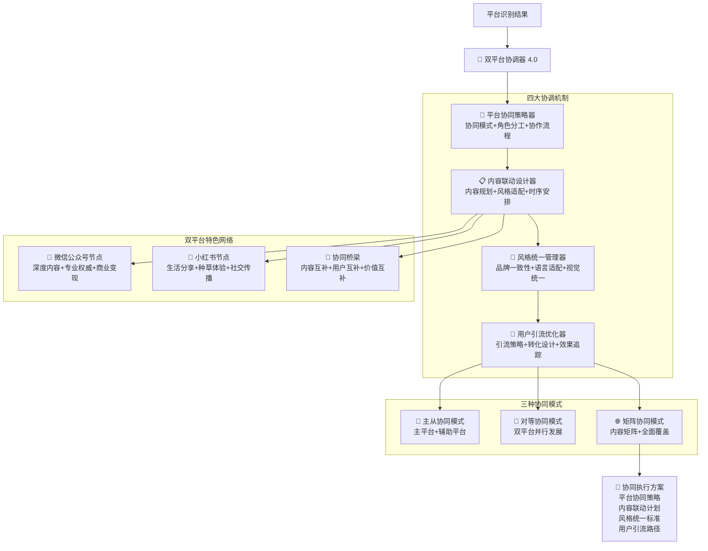

# �� Prompt-Create-4.0-双平台协调器

## 🎯 模块核心定位

### 设计理念：微信公众号+小红书双平台智能协同
> **作为4.0版本的协调枢纽，通过"平台协同策略 + 内容联动设计 + 风格统一管理 + 用户引流优化"四大机制，实现微信公众号与小红书平台间的完美协同创作**

## 🧠 核心架构：双平台协同系统



## 💎 四大协调机制详解

### 🔗 平台协同策略器
```yaml
核心功能:
  协同模式分析: ["主从模式", "对等模式", "矩阵模式", "混合模式"]
  角色分工设计: ["内容角色", "传播角色", "转化角色", "品牌角色"]
  协作流程优化: ["创作流程", "发布流程", "互动流程", "优化流程"]
  效果评估机制: ["协同效果", "用户反馈", "数据分析", "持续优化"]

协同策略算法:
  ```python
  def platform_coordination_strategy(platform_requirements, business_objectives):
      """平台协同策略算法"""
      # Step 1: 协同需求分析
      coordination_needs = analyze_coordination_needs(platform_requirements)
      
      # Step 2: 协同模式选择
      coordination_mode = select_coordination_mode(
          coordination_needs,
          business_objectives
      )
      
      # Step 3: 角色分工设计
      role_allocation = design_role_allocation(
          coordination_mode,
          platform_requirements
      )
      
      # Step 4: 协作流程制定
      collaboration_process = create_collaboration_process(
          coordination_mode,
          role_allocation
      )
      
      # Step 5: 效果评估机制
      evaluation_mechanism = establish_evaluation_mechanism(
          coordination_mode,
          collaboration_process
      )
      
      return {
          "coordination_needs": coordination_needs,
          "coordination_mode": coordination_mode,
          "role_allocation": role_allocation,
          "collaboration_process": collaboration_process,
          "evaluation_mechanism": evaluation_mechanism
      }
  ```

协同策略类型:
  微信主导模式: ["微信深度内容", "小红书引流", "专业权威建设", "知识付费变现"]
  小红书主导模式: ["小红书种草", "微信转化", "社交传播", "产品销售"]
  双平台并行模式: ["各自发挥优势", "内容互补", "用户互补", "价值最大化"]
  矩阵协同模式: ["内容矩阵", "全面覆盖", "系统性建设", "品牌生态"]
```

### 📋 内容联动设计器
```yaml
核心功能:
  内容规划设计: ["主题规划", "内容布局", "发布计划", "互动设计"]
  风格适配转换: ["语言风格", "结构调整", "视觉适配", "互动方式"]
  时序安排优化: ["发布时序", "互动时序", "优化时序", "反馈时序"]
  效果监控评估: ["传播效果", "互动效果", "转化效果", "品牌效果"]

内容联动算法:
  ```python
  def content_coordination_design(coordination_strategy, content_requirements):
      """内容联动设计算法"""
      # Step 1: 内容主题规划
      content_planning = plan_content_themes(
          coordination_strategy,
          content_requirements
      )
      
      # Step 2: 平台适配设计
      platform_adaptation = design_platform_adaptation(
          content_planning,
          coordination_strategy
      )
      
      # Step 3: 发布时序安排
      publication_timing = arrange_publication_timing(
          platform_adaptation,
          coordination_strategy
      )
      
      # Step 4: 互动联动设计
      interaction_design = design_interaction_coordination(
          publication_timing,
          platform_adaptation
      )
      
      # Step 5: 效果监控设置
      monitoring_setup = setup_effect_monitoring(
          interaction_design,
          coordination_strategy
      )
      
      return {
          "content_planning": content_planning,
          "platform_adaptation": platform_adaptation,
          "publication_timing": publication_timing,
          "interaction_design": interaction_design,
          "monitoring_setup": monitoring_setup
      }
  ```

内容联动类型:
  主题联动: ["同一主题", "不同角度", "互相补充", "深度拓展"]
  时间联动: ["同步发布", "递进发布", "呼应发布", "持续发布"]
  形式联动: ["图文互补", "长短结合", "深浅搭配", "专业生活化"]
  互动联动: ["引导关注", "跨平台讨论", "内容推荐", "用户引流"]
```

### 🎨 风格统一管理器
```yaml
核心功能:
  品牌一致性: ["品牌调性", "价值观", "个性特征", "专业形象"]
  语言适配: ["语言风格", "表达方式", "术语使用", "情感色彩"]
  视觉统一: ["视觉风格", "色彩搭配", "字体选择", "排版风格"]
  体验一致性: ["用户体验", "互动体验", "服务体验", "品牌体验"]

风格管理算法:
  ```python
  def style_unification_management(brand_guidelines, platform_characteristics):
      """风格统一管理算法"""
      # Step 1: 品牌基调分析
      brand_tone_analysis = analyze_brand_tone(brand_guidelines)
      
      # Step 2: 平台适配方案
      platform_adaptation_plan = create_platform_adaptation_plan(
          brand_tone_analysis,
          platform_characteristics
      )
      
      # Step 3: 语言风格转换
      language_style_conversion = convert_language_style(
          platform_adaptation_plan,
          brand_tone_analysis
      )
      
      # Step 4: 视觉风格统一
      visual_style_unification = unify_visual_style(
          platform_adaptation_plan,
          brand_tone_analysis
      )
      
      # Step 5: 体验一致性保证
      experience_consistency = ensure_experience_consistency(
          language_style_conversion,
          visual_style_unification
      )
      
      return {
          "brand_tone_analysis": brand_tone_analysis,
          "platform_adaptation_plan": platform_adaptation_plan,
          "language_style_conversion": language_style_conversion,
          "visual_style_unification": visual_style_unification,
          "experience_consistency": experience_consistency
      }
  ```

风格管理维度:
  微信公众号风格:
    - 语言: ["专业理性", "逻辑严谨", "价值导向", "权威表达"]
    - 视觉: ["简洁专业", "重点突出", "信息密度高", "商务感强"]
    - 互动: ["深度互动", "专业讨论", "价值认同", "知识分享"]
  
  小红书风格:
    - 语言: ["亲和自然", "真实诚恳", "生活化", "情感丰富"]
    - 视觉: ["精美时尚", "生活场景", "颜值导向", "视觉冲击"]
    - 互动: ["轻松互动", "情感共鸣", "种草分享", "社交传播"]
  
  统一元素:
    - 品牌: ["核心价值观", "品牌个性", "专业领域", "服务理念"]
    - 内容: ["内容质量", "专业标准", "用户价值", "创新精神"]
```

### 🚀 用户引流优化器
```yaml
核心功能:
  引流策略设计: ["引流路径", "引流内容", "引流机制", "引流效果"]
  转化设计优化: ["转化路径", "转化内容", "转化机制", "转化效果"]
  用户体验优化: ["无缝体验", "价值递进", "兴趣维持", "忠诚度建设"]
  效果追踪分析: ["引流数据", "转化数据", "留存数据", "价值数据"]

引流优化算法:
  ```python
  def user_flow_optimization(content_coordination, style_management):
      """用户引流优化算法"""
      # Step 1: 引流路径设计
      flow_path_design = design_user_flow_paths(
          content_coordination,
          style_management
      )
      
      # Step 2: 引流内容优化
      flow_content_optimization = optimize_flow_content(
          flow_path_design,
          content_coordination
      )
      
      # Step 3: 转化机制设计
      conversion_mechanism_design = design_conversion_mechanisms(
          flow_content_optimization,
          flow_path_design
      )
      
      # Step 4: 用户体验优化
      user_experience_optimization = optimize_user_experience(
          conversion_mechanism_design,
          flow_content_optimization
      )
      
      # Step 5: 效果追踪系统
      tracking_system = establish_tracking_system(
          user_experience_optimization,
          conversion_mechanism_design
      )
      
      return {
          "flow_path_design": flow_path_design,
          "flow_content_optimization": flow_content_optimization,
          "conversion_mechanism_design": conversion_mechanism_design,
          "user_experience_optimization": user_experience_optimization,
          "tracking_system": tracking_system
      }
  ```

引流优化策略:
  小红书→微信引流:
    - 内容钩子: ["深度内容预告", "专业资源分享", "专家观点", "独家内容"]
    - 引流方式: ["简介引导", "评论引导", "私信引导", "内容暗示"]
    - 转化设计: ["关注奖励", "资源获取", "专家咨询", "社群邀请"]
  
  微信→小红书引流:
    - 内容钩子: ["生活化案例", "实用技巧", "体验分享", "趋势洞察"]
    - 引流方式: ["文末引导", "二维码", "推荐阅读", "互动话题"]
    - 转化设计: ["生活化内容", "实用价值", "互动体验", "社交分享"]
  
  双向引流:
    - 互补价值: ["专业+生活", "深度+体验", "理性+感性", "权威+亲和"]
    - 用户旅程: ["兴趣激发", "需求确认", "价值体验", "深度转化"]
```

## 🎯 双平台特色网络详解

### 📱 微信公众号节点
```yaml
平台角色: 专业内容中心，深度价值输出
核心优势:
  - 深度内容: 3000-8000字专业文章
  - 专业权威: 行业洞察和专家观点
  - 商业变现: 知识付费和服务转化
  - 用户粘性: 高质量内容的长期关注

协同职能:
  - 内容深度化: 将小红书的生活化内容深度化
  - 价值专业化: 提供专业的理论支撑和深度分析
  - 商业转化: 承接小红书引流的商业转化
  - 品牌建设: 建立专业权威的品牌形象

协同优势:
  - 专业深度: 满足用户深度学习需求
  - 商业价值: 实现知识变现和服务变现
  - 用户留存: 高价值内容的长期用户留存
  - 影响力: 建立行业影响力和话语权
```

### 🌸 小红书节点
```yaml
平台角色: 生活体验分享，社交传播中心
核心优势:
  - 生活化表达: 真实体验和情感共鸣
  - 社交传播: 强大的社交传播能力
  - 种草转化: 高效的消费决策影响
  - 用户活跃: 高频互动和参与度

协同职能:
  - 内容生活化: 将微信的专业内容生活化
  - 用户引流: 通过种草和分享引流到微信
  - 品牌亲和: 建立亲和力和用户好感
  - 市场验证: 验证内容和产品的市场接受度

协同优势:
  - 传播力强: 社交传播的病毒式效应
  - 用户基础: 年轻活跃的用户群体
  - 转化效率: 高效的消费决策转化
  - 创新敏感: 对新趋势和新产品的敏感度
```

### 🔄 协同桥梁
```yaml
桥梁功能:
  内容互补: ["专业+生活", "深度+体验", "理性+感性", "权威+亲和"]
  用户互补: ["专业人士+年轻用户", "深度需求+体验需求", "决策者+影响者"]
  价值互补: ["知识价值+体验价值", "专业价值+社交价值", "商业价值+传播价值"]
  时间互补: ["碎片时间+深度时间", "日常浏览+专业学习", "即时互动+深度思考"]

桥梁机制:
  - 内容转换: 同一主题的不同平台表达
  - 用户引导: 平台间的用户流动和转化
  - 价值传递: 不同平台价值的相互传递
  - 体验连接: 用户在不同平台的体验连接
```

## 🎨 三种协同模式详解

### 🎯 主从协同模式
```yaml
模式特征: 一个平台为主导，另一个平台为辅助
适用场景: 明确的主要目标和次要目标
协同策略:
  - 主导平台: 承担主要的内容输出和用户服务
  - 辅助平台: 提供引流、验证、补充功能
  - 协同效应: 主导平台的效果最大化

微信主导模式:
  - 微信公众号: 专业内容输出，知识付费，品牌建设
  - 小红书: 引流获客，市场验证，品牌亲和
  - 适用场景: 知识付费、专业服务、B2B业务

小红书主导模式:
  - 小红书: 产品种草，用户互动，传播推广
  - 微信公众号: 深度转化，专业支撑，服务承接
  - 适用场景: 产品销售、品牌推广、B2C业务
```

### 🔄 对等协同模式
```yaml
模式特征: 两个平台地位相等，各自发挥优势
适用场景: 多元化目标，均衡发展
协同策略:
  - 平等地位: 两个平台同等重要
  - 优势互补: 各自发挥平台特色优势
  - 协同效应: 1+1>2的协同效果

协同策略:
  - 内容并行: 同时在两个平台发布适配内容
  - 用户并行: 同时服务两个平台的用户群体
  - 价值并行: 同时实现两个平台的价值目标
  - 适用场景: 品牌建设、影响力扩大、多元变现
```

### 🌐 矩阵协同模式
```yaml
模式特征: 系统性的内容矩阵和全面覆盖
适用场景: 复杂业务，系统建设
协同策略:
  - 内容矩阵: 系统性的内容规划和布局
  - 全面覆盖: 覆盖用户的全生命周期
  - 生态建设: 构建完整的内容生态系统

矩阵设计:
  - 垂直矩阵: 同一主题的不同深度内容
  - 水平矩阵: 不同主题的同一深度内容
  - 时间矩阵: 不同时间的内容规划
  - 用户矩阵: 不同用户群体的内容定制
  - 适用场景: 品牌生态建设、行业影响力、系统性服务
```

## 📊 协同效果评估

### 🎯 协同效果指标
```yaml
内容协同效果:
  - 内容互补度: ≥ 85%
  - 风格一致性: ≥ 90%
  - 用户认知统一: ≥ 88%
  - 品牌识别度: ≥ 92%

用户协同效果:
  - 跨平台认知率: ≥ 70%
  - 用户流转率: ≥ 15%
  - 用户留存率: ≥ 80%
  - 用户价值提升: ≥ 25%

商业协同效果:
  - 总体转化率提升: ≥ 30%
  - 用户生命周期价值: ≥ 40%
  - 品牌影响力指数: ≥ 35%
  - 商业变现能力: ≥ 50%
```

### 📈 优化建议机制
```yaml
持续优化策略:
  - 数据驱动: 基于数据分析的优化建议
  - 用户反馈: 基于用户反馈的改进方案
  - 效果跟踪: 持续跟踪和评估协同效果
  - 策略调整: 根据效果动态调整协同策略

改进方向:
  - 内容优化: 提升内容质量和适配度
  - 流程优化: 优化协同流程和效率
  - 体验优化: 提升用户体验和满意度
  - 效果优化: 提升协同效果和商业价值
```

## 🎉 模块核心优势

### 🌟 协同效果显著
- **价值放大**: 1+1>2的协同效应
- **用户覆盖**: 全面覆盖不同用户群体
- **商业增值**: 显著提升商业价值和转化效果

### 🚀 策略灵活智能
- **模式多样**: 支持多种协同模式选择
- **策略灵活**: 根据需求灵活调整协同策略
- **智能优化**: 基于数据和反馈的智能优化

### 💡 执行简单高效
- **操作简单**: 清晰的协同流程和执行标准
- **效率高**: 优化的协同机制和工作流程
- **效果可控**: 完善的监控和评估体系

---

*🌉 双平台协调器 - 让微信公众号和小红书完美协同，实现1+1>2的协同效应！* 🚀 