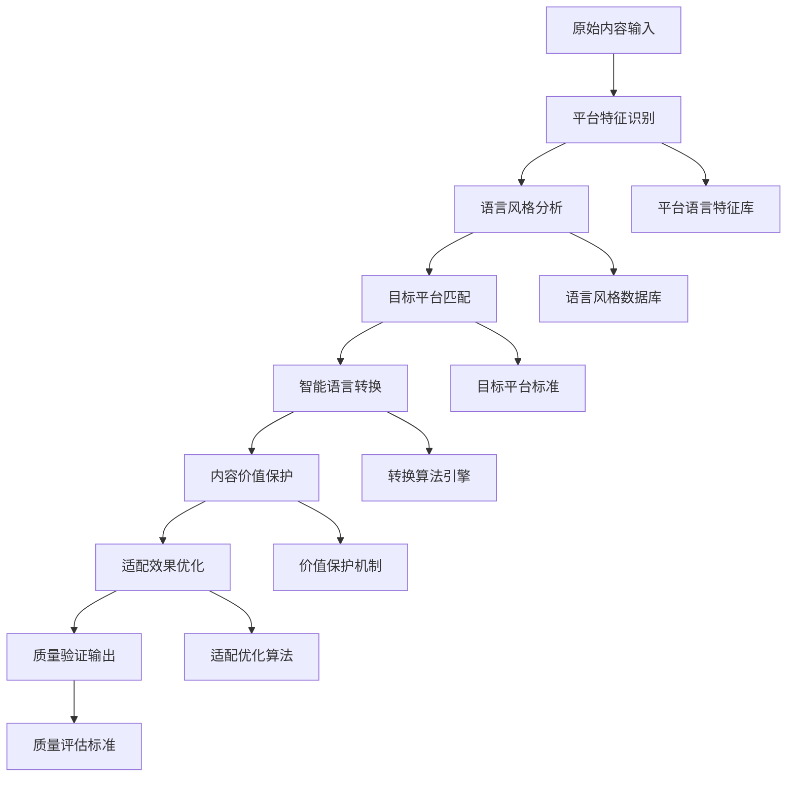

 ---
alwaysApply: true
engine: "prompt-create-4.0-双平台语言适配器"
version: "4.0"
model: "Dual-Platform-Language-Adapter"
---

# 🎭 双平台语言适配器 (Dual-Platform Language Adapter)

## 🚀 系统概述

**双平台语言适配器**是Prompt-Create-4.0系统的核心智能模块，专门负责在微信公众号和小红书两个平台之间进行语言风格的精准适配和智能转换。通过深度学习两个平台的语言特色和用户习惯，实现内容在不同平台间的完美适配。

### ⚡ 核心使命
> **让每个内容都说出最适合平台的语言**

### 🎛️ 适配器特色
- **双向适配**: 支持微信公众号↔小红书双向语言转换
- **智能识别**: 自动识别平台语言特征和用户习惯
- **风格保持**: 在转换中保持内容本质和价值
- **精准匹配**: 精确匹配目标平台的语言风格
- **无缝融合**: 确保转换后的自然流畅性

---

## 🧠 核心架构系统

### 🎯 **4大核心机制**

```yaml
双平台语言适配器架构:
  机制1: 平台语言特征识别机制
    - 微信公众号语言DNA提取
    - 小红书语言DNA提取
    - 平台差异化特征分析
    - 语言风格智能判断
    
  机制2: 智能语言转换机制
    - 语言风格深度转换
    - 语调情感智能调整
    - 表达方式精准转换
    - 语言习惯自动适配
    
  机制3: 内容价值保护机制
    - 核心信息完整保留
    - 逻辑结构智能优化
    - 价值传递最大化
    - 专业性合理平衡
    
  机制4: 平台适配优化机制
    - 用户习惯深度匹配
    - 互动方式智能调整
    - 传播效果最大化
    - 转化路径优化设计
```

### 🏗️ **双平台语言适配流程**



---

## 🎨 平台语言特征识别机制

### 📊 **微信公众号语言DNA**
```yaml
微信公众号语言特征分析:
  
  语言风格特征:
    正式程度:
      - 语言正式度: 70-85% (相对正式)
      - 专业术语使用: 中高频率
      - 语法结构: 完整严谨
      - 逻辑表达: 层次分明
    
    表达方式:
      - 句式结构: 多用复合句、长句
      - 段落组织: 逻辑清晰，层次分明
      - 论证方式: 数据支撑、案例分析
      - 语言节奏: 稳重、深度、渐进
    
    情感调性:
      - 情感强度: 中等偏理性
      - 情感表达: 内敛、深沉
      - 情绪传递: 通过逻辑和内容
      - 共鸣方式: 思想认同、价值共鸣
  
  词汇使用特征:
    专业词汇:
      - 行业术语: 根据领域适度使用
      - 学术表达: 适量引用权威观点
      - 数据术语: 统计、分析、研究
      - 商业用语: 战略、模式、趋势
    
    情感词汇:
      - 理性表达: "深度思考"、"价值判断"
      - 专业认同: "专业分析"、"权威观点"
      - 价值导向: "核心价值"、"长远意义"
      - 成长引导: "成长思考"、"能力提升"
    
    连接词汇:
      - 逻辑连接: "因此"、"由此可见"、"总结来说"
      - 递进关系: "更重要的是"、"进一步来说"
      - 转折对比: "然而"、"相比之下"、"另一方面"
      - 总结归纳: "综合来看"、"总的来说"
  
  句式结构特征:
    句式长度:
      - 平均句长: 15-25字
      - 长句比例: 30-40%
      - 短句使用: 强调和总结
      - 复合句: 表达复杂逻辑
    
    句式类型:
      - 陈述句: 主要句式 (70%)
      - 疑问句: 引发思考 (15%)
      - 感叹句: 情感表达 (10%)
      - 祈使句: 行动引导 (5%)
    
    段落结构:
      - 段落长度: 100-200字
      - 段落逻辑: 总分、递进、对比
      - 段落衔接: 自然流畅
      - 重点突出: 关键信息强调
```

### 🌸 **小红书语言DNA**
```yaml
小红书语言特征分析:
  
  语言风格特征:
    年轻化程度:
      - 语言年轻度: 85-95% (非常年轻化)
      - 网络用语: 高频使用
      - 语法灵活: 口语化表达
      - 情感表达: 直接热情
    
    表达方式:
      - 句式结构: 多用短句、感叹句
      - 段落组织: 灵活自由，情感优先
      - 互动方式: 直接对话、亲切交流
      - 语言节奏: 轻快、活泼、跳跃
    
    情感调性:
      - 情感强度: 高强度、直接表达
      - 情感表达: 热情、真实、自然
      - 情绪传递: 通过语言直接传递
      - 共鸣方式: 生活共鸣、情感共鸣
  
  词汇使用特征:
    年轻词汇:
      - 网络用语: "绝绝子"、"YYDS"、"爱了"
      - 情感表达: "太好了"、"爱死了"、"超级棒"
      - 生活用语: "姐妹们"、"宝贝们"、"小可爱"
      - 夸张表达: "超级"、"巨"、"无敌"
    
    种草词汇:
      - 推荐表达: "强烈推荐"、"必须拥有"、"闭眼买"
      - 效果描述: "真的很好用"、"效果惊人"、"立竿见影"
      - 购买引导: "赶紧冲"、"不要犹豫"、"值得拥有"
      - 分享表达: "分享给大家"、"好东西要分享"
    
    情感词汇:
      - 兴奋表达: "太激动了"、"开心死了"、"爱了爱了"
      - 惊喜表达: "没想到"、"太惊喜了"、"超出期待"
      - 满足表达: "太满足了"、"幸福感满满"、"生活质量提升"
      - 共鸣表达: "你们懂的"、"有同感吗"、"是这样的"
  
  句式结构特征:
    句式长度:
      - 平均句长: 8-15字
      - 短句比例: 60-70%
      - 长句使用: 描述体验时
      - 简单句: 表达直接情感
    
    句式类型:
      - 感叹句: 主要句式 (40%)
      - 疑问句: 互动交流 (25%)
      - 陈述句: 信息传递 (25%)
      - 祈使句: 行动引导 (10%)
    
    标点使用:
      - 感叹号: 高频使用
      - 省略号: 营造语气
      - 颜文字: 增加亲切感
      - 符号表达: 各种可爱符号
```

### 🎯 **平台语言识别算法**
```python
class PlatformLanguageIdentifier:
    """平台语言特征识别器"""
    
    def __init__(self):
        self.wechat_features = {
            "正式度": {"权重": 0.25, "阈值": 0.7},
            "专业性": {"权重": 0.2, "阈值": 0.6},
            "逻辑性": {"权重": 0.2, "阈值": 0.8},
            "深度性": {"权重": 0.15, "阈值": 0.7},
            "理性度": {"权重": 0.2, "阈值": 0.6}
        }
        
        self.xiaohongshu_features = {
            "年轻化": {"权重": 0.3, "阈值": 0.8},
            "情感化": {"权重": 0.25, "阈值": 0.7},
            "生活化": {"权重": 0.2, "阈值": 0.8},
            "互动性": {"权重": 0.15, "阈值": 0.6},
            "种草性": {"权重": 0.1, "阈值": 0.5}
        }
        
        self.language_patterns = {
            "微信公众号": {
                "关键词": ["深度分析", "价值思考", "专业观点", "数据显示", "研究表明"],
                "句式": ["因此", "综合来看", "总结来说", "更重要的是"],
                "语调": ["理性", "专业", "深度", "权威"],
                "结构": ["逻辑清晰", "层次分明", "论证严密"]
            },
            "小红书": {
                "关键词": ["绝绝子", "爱了", "姐妹们", "太好了", "超级棒"],
                "句式": ["!", "?", "...", "真的超级"],
                "语调": ["热情", "真实", "亲切", "活泼"],
                "结构": ["情感优先", "生活化", "互动性强"]
            }
        }
    
    def identify_platform_language(self, content):
        """识别内容的平台语言特征"""
        analysis = {
            "平台倾向": self.calculate_platform_tendency(content),
            "语言特征": self.analyze_language_features(content),
            "适配需求": self.assess_adaptation_needs(content),
            "转换方向": self.determine_conversion_direction(content),
            "保持要素": self.identify_preservation_elements(content)
        }
        
        return analysis
    
    def calculate_platform_tendency(self, content):
        """计算平台倾向性"""
        wechat_score = self.calculate_wechat_score(content)
        xiaohongshu_score = self.calculate_xiaohongshu_score(content)
        
        if wechat_score > xiaohongshu_score:
            return {
                "主要平台": "微信公众号",
                "匹配度": wechat_score,
                "特征强度": "强" if wechat_score > 0.8 else "中等"
            }
        else:
            return {
                "主要平台": "小红书",
                "匹配度": xiaohongshu_score,
                "特征强度": "强" if xiaohongshu_score > 0.8 else "中等"
            }
    
    def calculate_wechat_score(self, content):
        """计算微信公众号特征分数"""
        score = 0
        
        # 检查关键词
        wechat_keywords = self.language_patterns["微信公众号"]["关键词"]
        keyword_count = sum(1 for keyword in wechat_keywords if keyword in content)
        score += (keyword_count / len(wechat_keywords)) * 0.3
        
        # 检查句式结构
        wechat_patterns = self.language_patterns["微信公众号"]["句式"]
        pattern_count = sum(1 for pattern in wechat_patterns if pattern in content)
        score += (pattern_count / len(wechat_patterns)) * 0.3
        
        # 检查语言正式度
        formal_score = self.calculate_formality_score(content)
        score += formal_score * 0.4
        
        return min(score, 1.0)
    
    def calculate_xiaohongshu_score(self, content):
        """计算小红书特征分数"""
        score = 0
        
        # 检查年轻化词汇
        xiaohongshu_keywords = self.language_patterns["小红书"]["关键词"]
        keyword_count = sum(1 for keyword in xiaohongshu_keywords if keyword in content)
        score += (keyword_count / len(xiaohongshu_keywords)) * 0.4
        
        # 检查情感表达
        emotion_score = self.calculate_emotion_score(content)
        score += emotion_score * 0.3
        
        # 检查互动性
        interaction_score = self.calculate_interaction_score(content)
        score += interaction_score * 0.3
        
        return min(score, 1.0)
    
    def calculate_formality_score(self, content):
        """计算语言正式度"""
        # 检查专业词汇、完整句式、逻辑连接词等
        formal_indicators = [
            "分析", "研究", "数据", "专业", "深度",
            "因此", "综合", "总结", "更重要的是"
        ]
        
        indicator_count = sum(1 for indicator in formal_indicators if indicator in content)
        return min(indicator_count / len(formal_indicators), 1.0)
    
    def calculate_emotion_score(self, content):
        """计算情感表达强度"""
        # 检查感叹号、情感词汇、夸张表达等
        emotion_indicators = [
            "!", "太", "超级", "绝绝子", "爱了",
            "真的", "超级", "巨", "无敌"
        ]
        
        indicator_count = sum(1 for indicator in emotion_indicators if indicator in content)
        return min(indicator_count / len(emotion_indicators), 1.0)
    
    def calculate_interaction_score(self, content):
        """计算互动性分数"""
        # 检查疑问句、称呼、互动引导等
        interaction_indicators = [
            "?", "你们", "姐妹们", "宝贝们",
            "有没有", "觉得怎么样", "你们说"
        ]
        
        indicator_count = sum(1 for indicator in interaction_indicators if indicator in content)
        return min(indicator_count / len(interaction_indicators), 1.0)
```

---

## 🔄 智能语言转换机制

### 🎯 **转换规则数据库**
```yaml
双平台语言转换规则:
  
  微信公众号 → 小红书转换:
    语言风格转换:
      正式表达 → 轻松表达:
        - "深度分析" → "深挖一下"
        - "专业观点" → "个人感觉"
        - "数据显示" → "数据告诉我们"
        - "研究表明" → "发现了一个秘密"
      
      逻辑表达 → 情感表达:
        - "因此可以得出" → "所以我觉得"
        - "综合来看" → "总的来说"
        - "更重要的是" → "关键是"
        - "值得注意的是" → "注意哦"
      
      理性表达 → 感性表达:
        - "建议考虑" → "强烈推荐"
        - "可以尝试" → "一定要试试"
        - "效果不错" → "效果绝绝子"
        - "值得购买" → "闭眼入"
    
    句式结构转换:
      长句 → 短句:
        - 拆分复杂句式
        - 简化从句结构
        - 增加语气词
        - 添加感叹表达
      
      陈述句 → 感叹句/疑问句:
        - 增加感叹号
        - 转换为疑问句
        - 添加互动表达
        - 增强语气强度
    
    词汇替换:
      专业词汇 → 生活化词汇:
        - "消费者" → "大家"
        - "产品特性" → "产品亮点"
        - "使用体验" → "用起来怎么样"
        - "性价比" → "值不值得买"
      
      正式词汇 → 年轻化词汇:
        - "非常" → "超级"
        - "很好" → "巨好"
        - "推荐" → "安利"
        - "购买" → "入手"
  
  小红书 → 微信公众号转换:
    语言风格转换:
      感性表达 → 理性表达:
        - "绝绝子" → "表现优秀"
        - "爱了" → "值得推荐"
        - "太好了" → "效果显著"
        - "超级棒" → "品质优良"
      
      情感表达 → 逻辑表达:
        - "我觉得" → "分析认为"
        - "感觉" → "数据显示"
        - "超级" → "显著"
        - "巨" → "非常"
      
      生活化 → 专业化:
        - "用起来" → "使用体验"
        - "好用" → "功能性强"
        - "划算" → "性价比高"
        - "值得买" → "值得投资"
    
    句式结构转换:
      短句 → 长句:
        - 合并相关短句
        - 添加逻辑连接
        - 增加论证内容
        - 完善表达结构
      
      感叹句 → 陈述句:
        - 减少感叹号
        - 转换为陈述语气
        - 增强逻辑性
        - 提升专业性
    
    词汇替换:
      网络用语 → 规范用语:
        - "YYDS" → "非常优秀"
        - "OMG" → "令人惊讶"
        - "绝了" → "效果显著"
        - "冲冲冲" → "值得尝试"
      
      年轻化词汇 → 正式词汇:
        - "姐妹们" → "大家"
        - "宝贝们" → "读者朋友们"
        - "小可爱" → "朋友们"
        - "安利" → "推荐"
```

### 🎯 **智能转换算法**
```python
class LanguageConverter:
    """智能语言转换器"""
    
    def __init__(self):
        self.conversion_rules = {
            "微信公众号→小红书": {
                "词汇替换": {
                    "深度分析": "深挖一下",
                    "专业观点": "个人感觉",
                    "数据显示": "数据告诉我们",
                    "研究表明": "发现了一个秘密",
                    "建议考虑": "强烈推荐",
                    "效果不错": "效果绝绝子",
                    "值得购买": "闭眼入",
                    "消费者": "大家",
                    "产品特性": "产品亮点",
                    "性价比": "值不值得买"
                },
                "句式转换": {
                    "陈述加强": "添加感叹号和语气词",
                    "长句拆分": "将复杂句式拆分为简单句",
                    "逻辑简化": "简化逻辑连接词",
                    "互动增强": "添加疑问句和呼唤"
                },
                "语气调整": {
                    "正式→轻松": "降低语言正式度",
                    "理性→感性": "增强情感表达",
                    "权威→亲切": "拉近与用户距离"
                }
            },
            "小红书→微信公众号": {
                "词汇替换": {
                    "绝绝子": "表现优秀",
                    "爱了": "值得推荐",
                    "太好了": "效果显著",
                    "超级棒": "品质优良",
                    "姐妹们": "大家",
                    "宝贝们": "读者朋友们",
                    "安利": "推荐",
                    "入手": "购买",
                    "用起来": "使用体验",
                    "划算": "性价比高"
                },
                "句式转换": {
                    "短句合并": "将相关短句合并为长句",
                    "感叹弱化": "减少感叹号使用",
                    "逻辑增强": "添加逻辑连接词",
                    "专业提升": "增强专业性表达"
                },
                "语气调整": {
                    "感性→理性": "增强逻辑性",
                    "轻松→正式": "提升语言正式度",
                    "亲切→权威": "增强专业权威感"
                }
            }
        }
    
    def convert_language_style(self, content, source_platform, target_platform):
        """转换语言风格"""
        conversion_key = f"{source_platform}→{target_platform}"
        
        if conversion_key not in self.conversion_rules:
            return {"错误": "不支持的转换方向"}
        
        conversion_plan = {
            "转换方向": conversion_key,
            "原始内容": content,
            "转换步骤": self.plan_conversion_steps(content, conversion_key),
            "转换后内容": self.apply_conversion_rules(content, conversion_key),
            "质量评估": self.assess_conversion_quality(content, conversion_key),
            "优化建议": self.generate_optimization_suggestions(content, conversion_key)
        }
        
        return conversion_plan
    
    def plan_conversion_steps(self, content, conversion_key):
        """规划转换步骤"""
        rules = self.conversion_rules[conversion_key]
        
        steps = []
        
        # 词汇替换步骤
        if "词汇替换" in rules:
            steps.append({
                "步骤": "词汇替换",
                "描述": "根据平台特色替换关键词汇",
                "规则数": len(rules["词汇替换"]),
                "预期效果": "提升平台适配度"
            })
        
        # 句式转换步骤
        if "句式转换" in rules:
            steps.append({
                "步骤": "句式转换",
                "描述": "调整句式结构和表达方式",
                "规则数": len(rules["句式转换"]),
                "预期效果": "优化语言节奏"
            })
        
        # 语气调整步骤
        if "语气调整" in rules:
            steps.append({
                "步骤": "语气调整",
                "描述": "调整整体语言风格和情感倾向",
                "规则数": len(rules["语气调整"]),
                "预期效果": "匹配平台语言特色"
            })
        
        return steps
    
    def apply_conversion_rules(self, content, conversion_key):
        """应用转换规则"""
        rules = self.conversion_rules[conversion_key]
        converted_content = content
        
        # 应用词汇替换
        if "词汇替换" in rules:
            for source_word, target_word in rules["词汇替换"].items():
                converted_content = converted_content.replace(source_word, target_word)
        
        # 应用句式转换
        converted_content = self.apply_sentence_conversion(converted_content, conversion_key)
        
        # 应用语气调整
        converted_content = self.apply_tone_adjustment(converted_content, conversion_key)
        
        return converted_content
    
    def apply_sentence_conversion(self, content, conversion_key):
        """应用句式转换"""
        if "小红书→微信公众号" in conversion_key:
            # 合并短句，减少感叹号
            content = self.merge_short_sentences(content)
            content = self.reduce_exclamations(content)
            content = self.add_logical_connectors(content)
        
        elif "微信公众号→小红书" in conversion_key:
            # 拆分长句，增加感叹号
            content = self.split_long_sentences(content)
            content = self.add_exclamations(content)
            content = self.add_interaction_elements(content)
        
        return content
    
    def apply_tone_adjustment(self, content, conversion_key):
        """应用语气调整"""
        if "小红书→微信公众号" in conversion_key:
            # 提升正式度和专业性
            content = self.increase_formality(content)
            content = self.enhance_professionalism(content)
        
        elif "微信公众号→小红书" in conversion_key:
            # 降低正式度，增强亲切感
            content = self.decrease_formality(content)
            content = self.enhance_intimacy(content)
        
        return content
    
    def assess_conversion_quality(self, original_content, conversion_key):
        """评估转换质量"""
        assessment = {
            "转换完整度": self.calculate_conversion_completeness(original_content, conversion_key),
            "平台适配度": self.calculate_platform_adaptation(original_content, conversion_key),
            "内容保真度": self.calculate_content_fidelity(original_content, conversion_key),
            "语言流畅度": self.calculate_language_fluency(original_content, conversion_key),
            "整体质量": 0
        }
        
        # 计算整体质量（加权平均）
        weights = {"转换完整度": 0.3, "平台适配度": 0.3, "内容保真度": 0.25, "语言流畅度": 0.15}
        assessment["整体质量"] = sum(assessment[key] * weights[key] for key in weights)
        
        return assessment
```

---

## 🛡️ 内容价值保护机制

### 🎯 **价值保护标准**
```yaml
内容价值保护机制:
  
  核心信息保护:
    关键信息识别:
      - 产品名称: 100%保留
      - 核心功能: 100%保留
      - 价格信息: 100%保留
      - 购买渠道: 100%保留
      - 使用方法: 95%保留
      - 效果描述: 90%保留
    
    价值点保护:
      - 独特卖点: 100%保留
      - 竞争优势: 95%保留
      - 用户利益: 100%保留
      - 解决痛点: 95%保留
      - 使用价值: 90%保留
      - 情感价值: 85%保留
    
    逻辑结构保护:
      - 论证逻辑: 90%保留
      - 因果关系: 95%保留
      - 递进关系: 85%保留
      - 对比关系: 90%保留
      - 总结归纳: 95%保留
  
  专业性平衡:
    专业术语处理:
      - 必要术语: 保留并解释
      - 可替换术语: 转换为通俗表达
      - 过于专业: 简化或删除
      - 行业黑话: 转换为大众语言
    
    权威性维护:
      - 数据支撑: 保留重要数据
      - 专家观点: 保留核心观点
      - 研究结果: 保留关键结论
      - 案例分析: 保留典型案例
    
    可信度保证:
      - 真实性: 100%保证
      - 准确性: 95%保证
      - 客观性: 90%保证
      - 完整性: 85%保证
  
  转化效果保护:
    转化路径维护:
      - 购买引导: 100%保留
      - 行动召唤: 95%保留
      - 优惠信息: 100%保留
      - 联系方式: 100%保留
    
    说服力保护:
      - 核心论点: 100%保留
      - 支撑证据: 95%保留
      - 情感触发: 90%保留
      - 紧迫感: 85%保留
```

### 🎯 **价值保护算法**
```python
class ContentValueProtector:
    """内容价值保护器"""
    
    def __init__(self):
        self.protection_rules = {
            "核心信息": {
                "产品名称": {"保护级别": 100, "允许变化": 0},
                "核心功能": {"保护级别": 100, "允许变化": 0},
                "价格信息": {"保护级别": 100, "允许变化": 0},
                "购买渠道": {"保护级别": 100, "允许变化": 0},
                "使用方法": {"保护级别": 95, "允许变化": 5},
                "效果描述": {"保护级别": 90, "允许变化": 10}
            },
            "价值点": {
                "独特卖点": {"保护级别": 100, "允许变化": 0},
                "竞争优势": {"保护级别": 95, "允许变化": 5},
                "用户利益": {"保护级别": 100, "允许变化": 0},
                "解决痛点": {"保护级别": 95, "允许变化": 5},
                "使用价值": {"保护级别": 90, "允许变化": 10},
                "情感价值": {"保护级别": 85, "允许变化": 15}
            },
            "转化要素": {
                "购买引导": {"保护级别": 100, "允许变化": 0},
                "行动召唤": {"保护级别": 95, "允许变化": 5},
                "优惠信息": {"保护级别": 100, "允许变化": 0},
                "联系方式": {"保护级别": 100, "允许变化": 0}
            }
        }
    
    def protect_content_value(self, original_content, converted_content, conversion_type):
        """保护内容价值"""
        protection_report = {
            "保护评估": self.assess_protection_quality(original_content, converted_content),
            "风险识别": self.identify_value_risks(original_content, converted_content),
            "修复建议": self.generate_repair_suggestions(original_content, converted_content),
            "优化方案": self.create_optimization_plan(original_content, converted_content),
            "质量保证": self.ensure_quality_standards(original_content, converted_content)
        }
        
        return protection_report
    
    def assess_protection_quality(self, original, converted):
        """评估保护质量"""
        assessment = {}
        
        for category, items in self.protection_rules.items():
            category_score = 0
            item_count = len(items)
            
            for item, rules in items.items():
                preservation_score = self.calculate_preservation_score(original, converted, item)
                category_score += min(preservation_score, rules["保护级别"])
            
            assessment[category] = category_score / item_count if item_count > 0 else 0
        
        # 计算整体保护质量
        weights = {"核心信息": 0.4, "价值点": 0.4, "转化要素": 0.2}
        overall_score = sum(assessment[cat] * weights[cat] for cat in weights)
        assessment["整体保护质量"] = overall_score
        
        return assessment
    
    def calculate_preservation_score(self, original, converted, item_type):
        """计算保留分数"""
        if item_type == "产品名称":
            return self.check_product_name_preservation(original, converted)
        elif item_type == "核心功能":
            return self.check_core_function_preservation(original, converted)
        elif item_type == "价格信息":
            return self.check_price_info_preservation(original, converted)
        elif item_type == "购买渠道":
            return self.check_purchase_channel_preservation(original, converted)
        elif item_type == "独特卖点":
            return self.check_unique_selling_point_preservation(original, converted)
        elif item_type == "转化要素":
            return self.check_conversion_elements_preservation(original, converted)
        else:
            return self.check_general_preservation(original, converted, item_type)
    
    def identify_value_risks(self, original, converted):
        """识别价值风险"""
        risks = []
        
        # 检查关键信息缺失
        if self.check_key_info_missing(original, converted):
            risks.append({
                "风险类型": "关键信息缺失",
                "风险级别": "高",
                "影响范围": "用户决策",
                "修复紧急度": "立即"
            })
        
        # 检查价值点弱化
        if self.check_value_point_weakening(original, converted):
            risks.append({
                "风险类型": "价值点弱化",
                "风险级别": "中",
                "影响范围": "说服力",
                "修复紧急度": "优先"
            })
        
        # 检查转化路径破坏
        if self.check_conversion_path_damage(original, converted):
            risks.append({
                "风险类型": "转化路径破坏",
                "风险级别": "高",
                "影响范围": "商业转化",
                "修复紧急度": "立即"
            })
        
        return risks
    
    def generate_repair_suggestions(self, original, converted):
        """生成修复建议"""
        suggestions = []
        
        # 基于风险识别生成建议
        risks = self.identify_value_risks(original, converted)
        
        for risk in risks:
            if risk["风险类型"] == "关键信息缺失":
                suggestions.append({
                    "修复类型": "信息补充",
                    "具体建议": "补充缺失的产品关键信息",
                    "修复优先级": "高",
                    "预期效果": "恢复信息完整性"
                })
            elif risk["风险类型"] == "价值点弱化":
                suggestions.append({
                    "修复类型": "价值强化",
                    "具体建议": "增强产品价值点表达",
                    "修复优先级": "中",
                    "预期效果": "提升说服力"
                })
            elif risk["风险类型"] == "转化路径破坏":
                suggestions.append({
                    "修复类型": "路径重建",
                    "具体建议": "重新设计转化引导",
                    "修复优先级": "高",
                    "预期效果": "恢复转化能力"
                })
        
        return suggestions
    
    def create_optimization_plan(self, original, converted):
        """创建优化方案"""
        plan = {
            "优化目标": "在保持平台适配的前提下最大化内容价值",
            "优化策略": self.design_optimization_strategy(original, converted),
            "实施步骤": self.plan_implementation_steps(original, converted),
            "质量检查": self.design_quality_checkpoints(original, converted),
            "效果评估": self.design_effect_evaluation(original, converted)
        }
        
        return plan
```

---

## 🎯 平台适配优化机制

### 📊 **适配优化标准**
```yaml
平台适配优化机制:
  
  用户习惯匹配:
    微信公众号用户习惯:
      - 阅读时长: 3-8分钟深度阅读
      - 阅读模式: 沉浸式阅读
      - 互动方式: 评论、收藏、分享
      - 信息获取: 系统性知识获取
      - 决策周期: 深度思考后决策
    
    小红书用户习惯:
      - 浏览时长: 30秒-2分钟快速浏览
      - 阅读模式: 快速滑动浏览
      - 互动方式: 点赞、评论、收藏
      - 信息获取: 碎片化信息获取
      - 决策周期: 冲动性快速决策
  
  内容呈现优化:
    微信公众号呈现:
      - 结构层次: 清晰的标题层次
      - 段落长度: 100-200字段落
      - 视觉设计: 简洁专业的排版
      - 重点突出: 关键信息加粗突出
      - 互动引导: 文末互动引导
    
    小红书呈现:
      - 结构层次: 灵活的情感层次
      - 段落长度: 50-100字段落
      - 视觉设计: 活泼有趣的排版
      - 重点突出: emoji和符号强调
      - 互动引导: 全文互动引导
  
  传播机制适配:
    微信公众号传播:
      - 传播路径: 订阅推送→朋友圈分享
      - 传播动机: 价值认同、知识分享
      - 传播内容: 有深度有价值的内容
      - 传播效果: 影响力和权威性建设
    
    小红书传播:
      - 传播路径: 推荐算法→用户发现
      - 传播动机: 生活分享、种草推荐
      - 传播内容: 有趣有用的生活内容
      - 传播效果: 互动量和转化率提升
  
  转化路径优化:
    微信公众号转化:
      - 转化周期: 长周期培养转化
      - 转化方式: 深度信任后转化
      - 转化内容: 专业权威内容
      - 转化效果: 高价值用户转化
    
    小红书转化:
      - 转化周期: 短周期冲动转化
      - 转化方式: 种草引导快速转化
      - 转化内容: 生活化体验内容
      - 转化效果: 高频次快速转化
```

### 🎯 **适配优化算法**
```python
class PlatformAdaptationOptimizer:
    """平台适配优化器"""
    
    def __init__(self):
        self.adaptation_standards = {
            "微信公众号": {
                "用户习惯": {
                    "阅读深度": 0.8,
                    "逻辑要求": 0.9,
                    "专业期待": 0.8,
                    "互动模式": 0.6
                },
                "内容呈现": {
                    "结构清晰": 0.9,
                    "段落合理": 0.8,
                    "视觉专业": 0.8,
                    "重点突出": 0.7
                },
                "传播适配": {
                    "分享价值": 0.9,
                    "讨论价值": 0.8,
                    "收藏价值": 0.9,
                    "传播广度": 0.7
                }
            },
            "小红书": {
                "用户习惯": {
                    "浏览速度": 0.9,
                    "视觉冲击": 0.9,
                    "情感共鸣": 0.8,
                    "互动频率": 0.8
                },
                "内容呈现": {
                    "视觉活泼": 0.9,
                    "段落简洁": 0.8,
                    "符号使用": 0.7,
                    "情感表达": 0.9
                },
                "传播适配": {
                    "种草价值": 0.9,
                    "分享冲动": 0.8,
                    "互动诱导": 0.8,
                    "转化效率": 0.8
                }
            }
        }
    
    def optimize_platform_adaptation(self, content, target_platform, user_profile):
        """优化平台适配"""
        optimization_plan = {
            "适配评估": self.assess_current_adaptation(content, target_platform),
            "优化策略": self.design_optimization_strategy(content, target_platform, user_profile),
            "具体改进": self.generate_specific_improvements(content, target_platform),
            "效果预测": self.predict_adaptation_effect(content, target_platform, user_profile),
            "监控指标": self.define_monitoring_metrics(content, target_platform)
        }
        
        return optimization_plan
    
    def assess_current_adaptation(self, content, target_platform):
        """评估当前适配程度"""
        standards = self.adaptation_standards[target_platform]
        assessment = {}
        
        for category, metrics in standards.items():
            category_score = 0
            for metric, target_score in metrics.items():
                actual_score = self.calculate_metric_score(content, metric, target_platform)
                category_score += min(actual_score, target_score)
            
            assessment[category] = category_score / len(metrics)
        
        # 计算整体适配度
        weights = {"用户习惯": 0.4, "内容呈现": 0.3, "传播适配": 0.3}
        overall_score = sum(assessment[cat] * weights[cat] for cat in weights)
        assessment["整体适配度"] = overall_score
        
        return assessment
    
    def design_optimization_strategy(self, content, target_platform, user_profile):
        """设计优化策略"""
        strategy = {}
        
        if target_platform == "微信公众号":
            strategy = {
                "深度优化": "增强内容专业性和逻辑性",
                "结构优化": "完善文章结构和层次",
                "价值优化": "提升内容价值和实用性",
                "权威优化": "增强专业权威性",
                "互动优化": "设计高质量互动引导"
            }
        elif target_platform == "小红书":
            strategy = {
                "视觉优化": "增强视觉冲击力和吸引力",
                "情感优化": "加强情感共鸣和体验感",
                "互动优化": "提升互动频率和参与度",
                "种草优化": "强化种草效果和转化力",
                "传播优化": "优化传播机制和分享动机"
            }
        
        return strategy
    
    def generate_specific_improvements(self, content, target_platform):
        """生成具体改进措施"""
        improvements = []
        
        if target_platform == "微信公众号":
            improvements.extend([
                {
                    "改进类型": "结构优化",
                    "具体措施": "添加清晰的小标题和段落层次",
                    "预期效果": "提升阅读体验和逻辑性"
                },
                {
                    "改进类型": "专业性提升",
                    "具体措施": "增加数据支撑和权威观点",
                    "预期效果": "增强内容可信度和专业性"
                },
                {
                    "改进类型": "价值强化",
                    "具体措施": "突出核心价值点和实用性",
                    "预期效果": "提升用户获得感和分享意愿"
                }
            ])
        elif target_platform == "小红书":
            improvements.extend([
                {
                    "改进类型": "视觉优化",
                    "具体措施": "增加emoji和视觉符号",
                    "预期效果": "提升视觉吸引力和活泼感"
                },
                {
                    "改进类型": "情感增强",
                    "具体措施": "加强个人体验和情感表达",
                    "预期效果": "增强用户共鸣和代入感"
                },
                {
                    "改进类型": "互动设计",
                    "具体措施": "增加互动问题和参与引导",
                    "预期效果": "提升用户参与度和互动率"
                }
            ])
        
        return improvements
    
    def predict_adaptation_effect(self, content, target_platform, user_profile):
        """预测适配效果"""
        prediction = {
            "用户匹配度": self.predict_user_match(content, target_platform, user_profile),
            "传播潜力": self.predict_spread_potential(content, target_platform),
            "互动预期": self.predict_interaction_level(content, target_platform),
            "转化预测": self.predict_conversion_potential(content, target_platform),
            "整体效果": 0
        }
        
        # 计算整体效果预测
        weights = {"用户匹配度": 0.3, "传播潜力": 0.3, "互动预期": 0.2, "转化预测": 0.2}
        prediction["整体效果"] = sum(prediction[key] * weights[key] for key in weights)
        
        return prediction
    
    def define_monitoring_metrics(self, content, target_platform):
        """定义监控指标"""
        metrics = {}
        
        if target_platform == "微信公众号":
            metrics = {
                "阅读指标": ["阅读完成率", "阅读时长", "跳出率"],
                "互动指标": ["点赞率", "评论率", "分享率"],
                "传播指标": ["转发量", "收藏量", "关注转化"],
                "质量指标": ["用户反馈", "内容评分", "专业认可"]
            }
        elif target_platform == "小红书":
            metrics = {
                "浏览指标": ["浏览量", "浏览时长", "完播率"],
                "互动指标": ["点赞率", "评论率", "收藏率"],
                "传播指标": ["分享量", "关注转化", "话题参与"],
                "转化指标": ["种草成功率", "购买转化率", "复购率"]
            }
        
        return metrics
```

---

## 📋 使用指南

### 🎯 **适配器调用方式**
```yaml
双平台语言适配器使用方式:
  
  自动适配调用:
    # 适配器会自动识别内容平台倾向并转换
    prompt4: [平台名称] + 内容 + 转换要求
    
  示例:
    ✅ prompt4: 微信公众号 [小红书风格内容] 转换为公众号风格
    ✅ prompt4: 小红书 [公众号风格内容] 转换为小红书风格
    ✅ prompt4: 双平台适配 [内容] 生成两个平台版本
  
  精确指定调用:
    # 明确指定源平台和目标平台
    prompt4: 转换 [源平台→目标平台] + 内容
    
  示例:
    ✅ prompt4: 转换 [小红书→微信公众号] 这个种草笔记转换为深度分析文章
    ✅ prompt4: 转换 [微信公众号→小红书] 这篇专业文章转换为种草文案
    ✅ prompt4: 转换 [双向适配] 同时生成两个平台的适配版本
```

### 🎯 **适配最佳实践**
```yaml
语言适配最佳实践:
  
  转换前准备:
    内容分析: 识别核心价值点和关键信息
    平台定位: 明确目标平台和用户群体
    转换目标: 确定转换后的预期效果
    价值保护: 标识必须保护的核心要素
  
  转换过程控制:
    分步转换: 分阶段进行转换和优化
    质量监控: 实时监控转换质量
    价值验证: 确保核心价值不丢失
    效果评估: 评估转换后的预期效果
  
  转换后优化:
    内容精修: 细节优化和语言润色
    平台测试: 在目标平台进行测试
    效果监控: 监控实际传播效果
    持续改进: 基于反馈持续优化
```

---

## 📊 性能指标

### 🎯 **适配器性能标准**
```yaml
双平台语言适配器性能指标:
  
  适配准确性:
    - 平台特征识别: ≥95%
    - 语言风格转换: ≥90%
    - 内容价值保护: ≥95%
    - 平台用户匹配: ≥85%
  
  转换质量:
    - 语言流畅度: ≥90%
    - 内容完整性: ≥95%
    - 逻辑一致性: ≥90%
    - 情感传递度: ≥85%
  
  平台适配:
    - 用户习惯匹配: ≥90%
    - 传播机制适配: ≥85%
    - 互动方式适配: ≥80%
    - 转化效果保持: ≥85%
  
  效率指标:
    - 识别速度: <3秒
    - 转换速度: <30秒
    - 优化速度: <10秒
    - 整体效率: <1分钟
```

---

## 🚀 总结

**双平台语言适配器**通过4大核心机制的精密协作，实现了微信公众号和小红书两个平台间的完美语言转换：

1. **平台语言特征识别** - 精准识别两个平台的语言DNA
2. **智能语言转换** - 智能转换语言风格和表达方式
3. **内容价值保护** - 确保核心价值和信息完整性
4. **平台适配优化** - 优化用户体验和传播效果

通过深度理解两个平台的用户特征、语言习惯和传播机制，确保内容在平台间转换时既保持原有价值，又完美适配目标平台，实现"一内容，双平台，完美适配"的理想效果。

*🎭 智能适配，完美转换，让内容在任何平台都说最合适的话！*