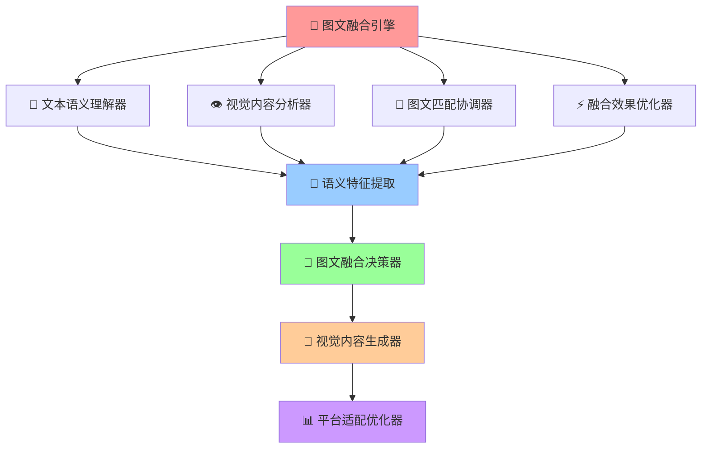

# 🌈 图文融合引擎 (Text-Image Fusion Engine)

## 🚀 系统概述

**图文融合引擎**是Prompt-Create-4.0系统的核心融合模块，专门负责微信公众号和小红书平台的图文内容深度融合。该引擎能够将文本内容与视觉元素进行智能融合，创造出既有深度又有视觉冲击力的优质内容。

### ⚡ 核心使命
> **打破图文壁垒，实现文字与视觉的完美融合**

### 🎛️ 引擎特色
- **智能图文匹配**: 基于语义理解的图文智能匹配
- **视觉内容生成**: 根据文本内容生成匹配的视觉建议
- **情感一致性**: 确保图文情感表达的一致性
- **平台适配优化**: 针对不同平台的图文展示优化
- **用户体验提升**: 提升图文内容的用户体验

### 🌟 4大核心机制



---

## 🎨 文本语义理解器

### 🎯 **核心功能**
**深度文本语义理解与视觉映射**，为图文融合提供语义基础，专门针对微信公众号和小红书的写作内容进行语义分析。

### 🧠 **认知科学原理**
> 就像人脑的语言中心，负责将文字信息转换为可视化概念，为视觉内容生成提供语义框架和情感指导。

### 🔄 **文本语义理解流程**
```python
def text_semantic_processor(text_content, platform_type, content_type):
    """
    文本语义理解器 - 5步语义分析流程
    """
    # 步骤1: 写作内容语义解析
    semantic_analysis = {
        "content_theme": extract_content_theme(text_content),
        "emotional_tone": extract_emotional_tone(text_content),
        "key_concepts": extract_key_concepts(text_content),
        "narrative_structure": analyze_narrative_structure(text_content),
        "value_proposition": extract_value_proposition(text_content)
    }
    
    # 步骤2: 视觉需求识别
    visual_requirements = {
        "image_needs": identify_image_needs(semantic_analysis),
        "visual_style": determine_visual_style(semantic_analysis, platform_type),
        "color_palette": suggest_color_palette(semantic_analysis),
        "composition_style": suggest_composition_style(semantic_analysis, content_type)
    }
    
    # 步骤3: 平台适配分析
    platform_adaptation = {
        "wechat_requirements": analyze_wechat_visual_requirements(semantic_analysis),
        "xiaohongshu_requirements": analyze_xiaohongshu_visual_requirements(semantic_analysis),
        "layout_preferences": determine_layout_preferences(platform_type, content_type),
        "interaction_elements": suggest_interaction_elements(platform_type, semantic_analysis)
    }
    
    # 步骤4: 情感视觉映射
    emotional_visual_mapping = {
        "emotion_color_mapping": map_emotions_to_colors(semantic_analysis["emotional_tone"]),
        "mood_imagery_mapping": map_mood_to_imagery(semantic_analysis["emotional_tone"]),
        "atmosphere_creation": create_visual_atmosphere(semantic_analysis),
        "emotional_consistency": ensure_emotional_consistency(semantic_analysis)
    }
    
    # 步骤5: 语义特征整合
    semantic_features = {
        "content_semantics": semantic_analysis,
        "visual_semantics": visual_requirements,
        "platform_semantics": platform_adaptation,
        "emotional_semantics": emotional_visual_mapping,
        "fusion_readiness": calculate_text_fusion_readiness(semantic_analysis)
    }
    
    return semantic_features

# 核心算法实现
def extract_content_theme(text_content):
    """提取内容主题"""
    return {
        "primary_theme": identify_primary_theme(text_content),
        "secondary_themes": identify_secondary_themes(text_content),
        "theme_keywords": extract_theme_keywords(text_content),
        "theme_sentiment": analyze_theme_sentiment(text_content)
    }

def identify_image_needs(semantic_analysis):
    """识别图像需求"""
    return {
        "hero_image": determine_hero_image_needs(semantic_analysis),
        "supporting_images": determine_supporting_image_needs(semantic_analysis),
        "illustration_needs": determine_illustration_needs(semantic_analysis),
        "icon_needs": determine_icon_needs(semantic_analysis),
        "chart_needs": determine_chart_needs(semantic_analysis)
    }
```

### 📊 **文本语义分析数据库**
```yaml
文本语义分析数据库:
  
  微信公众号文本特征:
    深度分析文章:
      - 主题特征: 专业性强、逻辑严密、数据支撑
      - 情感基调: 理性、权威、深度
      - 视觉需求: 专业图表、数据可视化、权威配图
      - 色彩倾向: 商务蓝、专业灰、权威黑
    
    行业观点文章:
      - 主题特征: 观点鲜明、立场明确、论证充分
      - 情感基调: 专业、理性、权威
      - 视觉需求: 概念图、对比图、权威人物
      - 色彩倾向: 稳重蓝、专业灰、突出橙
    
    知识科普文章:
      - 主题特征: 知识传授、易懂解释、实用价值
      - 情感基调: 亲和、专业、实用
      - 视觉需求: 说明图、流程图、实用图表
      - 色彩倾向: 清新绿、友好蓝、温暖黄
  
  小红书文本特征:
    产品种草文案:
      - 主题特征: 体验分享、效果展示、购买引导
      - 情感基调: 兴奋、真实、推荐
      - 视觉需求: 产品图、使用图、效果对比
      - 色彩倾向: 活力粉、种草绿、热情橙
    
    生活分享文案:
      - 主题特征: 生活记录、情感表达、经验分享
      - 情感基调: 温馨、真实、分享
      - 视觉需求: 生活场景、真实记录、情感表达
      - 色彩倾向: 温暖黄、舒适蓝、自然绿
    
    美妆测评文案:
      - 主题特征: 产品评测、效果对比、使用心得
      - 情感基调: 专业、真实、客观
      - 视觉需求: 产品细节、使用过程、效果对比
      - 色彩倾向: 优雅粉、专业白、突出红
  
  视觉映射规则:
    情感-色彩映射:
      - 专业权威 → 商务蓝(#1E3A8A) + 专业灰(#6B7280)
      - 温馨亲和 → 温暖黄(#F59E0B) + 舒适蓝(#3B82F6)
      - 活力兴奋 → 活力粉(#EC4899) + 热情橙(#F97316)
      - 清新自然 → 清新绿(#10B981) + 自然蓝(#06B6D4)
    
    主题-图像映射:
      - 专业分析 → 数据图表、专业配图、权威人物
      - 产品种草 → 产品图片、使用场景、效果展示
      - 生活分享 → 生活场景、真实记录、情感表达
      - 知识科普 → 说明图解、流程图表、概念图示
```

### 🎯 **文本语义分析算法**
```python
class TextSemanticAnalyzer:
    """文本语义分析器"""
    
    def __init__(self):
        self.semantic_patterns = {
            "微信公众号": {
                "深度分析": {
                    "关键词": ["分析", "研究", "数据", "趋势", "洞察"],
                    "情感基调": "理性专业",
                    "视觉需求": "专业图表",
                    "色彩方案": ["商务蓝", "专业灰"]
                },
                "专业观点": {
                    "关键词": ["观点", "看法", "评论", "立场", "建议"],
                    "情感基调": "权威专业",
                    "视觉需求": "概念图解",
                    "色彩方案": ["权威黑", "突出橙"]
                }
            },
            "小红书": {
                "产品种草": {
                    "关键词": ["推荐", "好用", "种草", "效果", "体验"],
                    "情感基调": "兴奋推荐",
                    "视觉需求": "产品展示",
                    "色彩方案": ["活力粉", "种草绿"]
                },
                "生活分享": {
                    "关键词": ["分享", "生活", "日常", "感受", "体验"],
                    "情感基调": "温馨真实",
                    "视觉需求": "生活场景",
                    "色彩方案": ["温暖黄", "舒适蓝"]
                }
            }
        }
    
    def analyze_text_semantics(self, text_content, platform_type, content_type):
        """分析文本语义"""
        semantic_result = {
            "内容主题": self.extract_content_theme(text_content),
            "情感基调": self.analyze_emotional_tone(text_content, platform_type),
            "视觉需求": self.identify_visual_needs(text_content, content_type),
            "平台适配": self.analyze_platform_adaptation(text_content, platform_type),
            "语义特征": self.extract_semantic_features(text_content)
        }
        
        return semantic_result
    
    def extract_content_theme(self, text_content):
        """提取内容主题"""
        theme_analysis = {
            "主要主题": self.identify_primary_theme(text_content),
            "次要主题": self.identify_secondary_themes(text_content),
            "关键概念": self.extract_key_concepts(text_content),
            "主题强度": self.calculate_theme_intensity(text_content)
        }
        
        return theme_analysis
    
    def analyze_emotional_tone(self, text_content, platform_type):
        """分析情感基调"""
        emotion_analysis = {
            "主导情感": self.identify_dominant_emotion(text_content),
            "情感强度": self.calculate_emotion_intensity(text_content),
            "情感变化": self.analyze_emotion_progression(text_content),
            "平台匹配": self.match_platform_emotion(text_content, platform_type)
        }
        
        return emotion_analysis
    
    def identify_visual_needs(self, text_content, content_type):
        """识别视觉需求"""
        visual_needs = {
            "主要图像": self.determine_hero_image_needs(text_content),
            "辅助图像": self.determine_supporting_images(text_content),
            "图表需求": self.determine_chart_needs(text_content),
            "图标需求": self.determine_icon_needs(text_content),
            "布局建议": self.suggest_layout_structure(text_content, content_type)
        }
        
        return visual_needs
    
    def determine_hero_image_needs(self, text_content):
        """确定主要图像需求"""
        # 基于内容主题和情感基调确定主图需求
        if "产品" in text_content and "推荐" in text_content:
            return {
                "类型": "产品展示",
                "风格": "真实体验",
                "重点": "产品特写+使用场景"
            }
        elif "分析" in text_content and "数据" in text_content:
            return {
                "类型": "概念图解",
                "风格": "专业简洁",
                "重点": "数据可视化+核心概念"
            }
        else:
            return {
                "类型": "主题配图",
                "风格": "情感表达",
                "重点": "情感氛围+主题呼应"
            }
    
    def suggest_layout_structure(self, text_content, content_type):
        """建议布局结构"""
        layout_suggestions = {
            "图文比例": self.calculate_image_text_ratio(text_content),
            "图片位置": self.suggest_image_placement(text_content, content_type),
            "视觉层次": self.design_visual_hierarchy(text_content),
            "互动元素": self.suggest_interaction_elements(text_content)
        }
        
        return layout_suggestions
```
```

---

## 🔧 机制2: 视觉模态处理器

### 🎯 核心功能
**智能图像理解与视觉特征提取**，将视觉信息转换为可融合的语义表示。

### 🧠 认知科学原理
> 模拟人脑的视觉皮层，能够识别形状、颜色、空间关系，并将其转换为概念性理解。

### 🔄 处理流程
```python
def visual_modality_processor(visual_input, text_context=""):
    """
    视觉模态处理器 - 5步视觉理解流程
    """
    # 步骤1: 多层视觉特征提取
    visual_features = {
        "low_level_features": extract_low_level_features(visual_input),
        "mid_level_features": extract_mid_level_features(visual_input),
        "high_level_features": extract_high_level_features(visual_input),
        "semantic_features": extract_visual_semantics(visual_input),
        "emotional_features": extract_visual_emotions(visual_input)
    }
    
    # 步骤2: 视觉语义映射
    visual_semantics = {
        "object_semantics": map_objects_to_concepts(visual_features),
        "scene_semantics": map_scenes_to_meanings(visual_features),
        "color_semantics": map_colors_to_emotions(visual_features),
        "composition_semantics": map_composition_to_intent(visual_features)
    }
    
    # 步骤3: 视觉-文本关联分析
    visual_text_alignment = {
        "concept_alignment": align_visual_text_concepts(visual_semantics, text_context),
        "emotional_alignment": align_visual_text_emotions(visual_features, text_context),
        "semantic_consistency": check_semantic_consistency(visual_semantics, text_context)
    }
    
    # 步骤4: 视觉叙事理解
    visual_narrative = {
        "story_elements": extract_story_elements(visual_input),
        "temporal_sequence": analyze_temporal_sequence(visual_input),
        "spatial_relationships": analyze_spatial_relationships(visual_input),
        "implied_meanings": extract_implied_meanings(visual_input)
    }
    
    # 步骤5: 视觉模态特征整合
    visual_modality_features = {
        "feature_hierarchy": visual_features,
        "semantic_mappings": visual_semantics,
        "text_alignments": visual_text_alignment,
        "narrative_structure": visual_narrative,
        "fusion_compatibility": calculate_visual_fusion_compatibility(visual_features)
    }
    
    return visual_modality_features

# 核心算法实现
def extract_low_level_features(visual_input):
    """提取低级视觉特征"""
    return {
        "edges": detect_edges(visual_input),
        "colors": extract_color_distribution(visual_input),
        "textures": extract_texture_features(visual_input),
        "shapes": detect_basic_shapes(visual_input)
    }

def map_objects_to_concepts(visual_features):
    """对象概念映射"""
    return {
        "object_concepts": identify_object_concepts(visual_features),
        "conceptual_hierarchy": build_concept_hierarchy(visual_features),
        "semantic_relationships": identify_semantic_relationships(visual_features)
    }
```

---

## 🔧 机制3: 音频模态处理器

### 🎯 核心功能
**智能音频理解与声学特征提取**，处理语音、音乐、环境声音等多种音频信息。

### 🧠 认知科学原理
> 类似人脑的听觉皮层，不仅能识别声音，还能理解音调、情感、节奏中蕴含的深层信息。

### 🔄 处理流程
```python
def audio_modality_processor(audio_input, text_context=""):
    """
    音频模态处理器 - 5步音频理解流程
    """
    # 步骤1: 多层音频特征提取
    audio_features = {
        "acoustic_features": extract_acoustic_features(audio_input),
        "prosodic_features": extract_prosodic_features(audio_input),
        "linguistic_features": extract_linguistic_features(audio_input),
        "emotional_features": extract_audio_emotions(audio_input),
        "environmental_features": extract_environmental_sounds(audio_input)
    }
    
    # 步骤2: 音频语义理解
    audio_semantics = {
        "speech_semantics": understand_speech_content(audio_features),
        "music_semantics": understand_music_content(audio_features),
        "emotion_semantics": understand_emotional_content(audio_features),
        "context_semantics": understand_contextual_audio(audio_features)
    }
    
    # 步骤3: 音频-文本协调
    audio_text_coordination = {
        "speech_text_alignment": align_speech_with_text(audio_semantics, text_context),
        "emotion_consistency": check_emotional_consistency(audio_features, text_context),
        "semantic_reinforcement": identify_semantic_reinforcement(audio_semantics, text_context)
    }
    
    # 步骤4: 音频时序分析
    temporal_analysis = {
        "rhythm_patterns": analyze_rhythm_patterns(audio_input),
        "temporal_structure": analyze_temporal_structure(audio_input),
        "dynamic_changes": analyze_dynamic_changes(audio_input),
        "pacing_analysis": analyze_pacing_patterns(audio_input)
    }
    
    # 步骤5: 音频模态特征整合
    audio_modality_features = {
        "feature_spectrum": audio_features,
        "semantic_understanding": audio_semantics,
        "text_coordination": audio_text_coordination,
        "temporal_patterns": temporal_analysis,
        "fusion_potential": calculate_audio_fusion_potential(audio_features)
    }
    
    return audio_modality_features

# 核心算法实现
def extract_acoustic_features(audio_input):
    """提取声学特征"""
    return {
        "fundamental_frequency": extract_f0(audio_input),
        "spectral_features": extract_spectral_features(audio_input),
        "temporal_features": extract_temporal_features(audio_input),
        "energy_features": extract_energy_features(audio_input)
    }

def understand_speech_content(audio_features):
    """理解语音内容"""
    return {
        "transcription": transcribe_speech(audio_features),
        "intent_recognition": recognize_speech_intent(audio_features),
        "emotion_detection": detect_speech_emotion(audio_features),
        "speaker_characteristics": analyze_speaker_characteristics(audio_features)
    }
```

---

## 🔧 机制4: 视频模态处理器

### 🎯 核心功能
**智能视频理解与时空特征提取**，处理动态视觉信息和时间序列模式。

### 🧠 认知科学原理
> 结合视觉和时间处理能力，就像人脑同时处理空间和时间信息，理解动作、变化和因果关系。

### 🔄 处理流程
```python
def video_modality_processor(video_input, context=""):
    """
    视频模态处理器 - 5步视频理解流程
    """
    # 步骤1: 多维视频特征提取
    video_features = {
        "spatial_features": extract_spatial_features_sequence(video_input),
        "temporal_features": extract_temporal_features_sequence(video_input),
        "motion_features": extract_motion_features(video_input),
        "scene_features": extract_scene_dynamics(video_input),
        "object_features": extract_object_trajectories(video_input)
    }
    
    # 步骤2: 视频语义理解
    video_semantics = {
        "action_semantics": understand_action_sequences(video_features),
        "narrative_semantics": understand_video_narrative(video_features),
        "emotional_semantics": understand_video_emotions(video_features),
        "contextual_semantics": understand_video_context(video_features)
    }
    
    # 步骤3: 视频时空分析
    spatiotemporal_analysis = {
        "temporal_segmentation": segment_video_temporally(video_input),
        "spatial_attention": analyze_spatial_attention(video_features),
        "motion_patterns": analyze_motion_patterns(video_features),
        "scene_transitions": analyze_scene_transitions(video_features)
    }
    
    # 步骤4: 视频多模态关联
    multimodal_associations = {
        "audio_visual_sync": analyze_audio_visual_sync(video_input),
        "text_visual_alignment": align_text_with_video(video_semantics, context),
        "cross_modal_consistency": check_cross_modal_consistency(video_features, context)
    }
    
    # 步骤5: 视频模态特征整合
    video_modality_features = {
        "feature_dynamics": video_features,
        "semantic_understanding": video_semantics,
        "spatiotemporal_patterns": spatiotemporal_analysis,
        "multimodal_associations": multimodal_associations,
        "fusion_readiness": calculate_video_fusion_readiness(video_features)
    }
    
    return video_modality_features

# 核心算法实现
def extract_motion_features(video_input):
    """提取运动特征"""
    return {
        "optical_flow": calculate_optical_flow(video_input),
        "motion_vectors": extract_motion_vectors(video_input),
        "trajectory_analysis": analyze_object_trajectories(video_input),
        "motion_patterns": identify_motion_patterns(video_input)
    }

def understand_action_sequences(video_features):
    """理解动作序列"""
    return {
        "action_recognition": recognize_actions(video_features),
        "action_segmentation": segment_actions(video_features),
        "temporal_relationships": analyze_temporal_relationships(video_features),
        "action_semantics": extract_action_semantics(video_features)
    }
```

---

## 🔧 机制5: 交互模态处理器

### 🎯 核心功能
**智能交互理解与用户意图分析**，处理用户的交互行为、反馈和参与模式。

### 🧠 认知科学原理
> 类似人脑的社交认知系统，能够理解他人的意图、情感状态和交互偏好，实现真正的智能交互。

### 🔄 处理流程
```python
def interaction_modality_processor(interaction_input, multimodal_context=""):
    """
    交互模态处理器 - 5步交互理解流程
    """
    # 步骤1: 多层交互特征提取
    interaction_features = {
        "behavioral_features": extract_behavioral_patterns(interaction_input),
        "engagement_features": extract_engagement_metrics(interaction_input),
        "preference_features": extract_preference_signals(interaction_input),
        "emotional_features": extract_interaction_emotions(interaction_input),
        "temporal_features": extract_interaction_timing(interaction_input)
    }
    
    # 步骤2: 交互意图理解
    interaction_semantics = {
        "user_intent": understand_user_intent(interaction_features),
        "interaction_goals": identify_interaction_goals(interaction_features),
        "engagement_level": assess_engagement_level(interaction_features),
        "satisfaction_indicators": analyze_satisfaction_indicators(interaction_features)
    }
    
    # 步骤3: 交互模式分析
    interaction_patterns = {
        "communication_style": analyze_communication_style(interaction_features),
        "interaction_preferences": identify_interaction_preferences(interaction_features),
        "learning_patterns": analyze_learning_patterns(interaction_features),
        "adaptation_needs": identify_adaptation_needs(interaction_features)
    }
    
    # 步骤4: 跨模态交互融合
    cross_modal_interaction = {
        "text_interaction_alignment": align_text_with_interaction(interaction_semantics, multimodal_context),
        "visual_interaction_sync": sync_visual_with_interaction(interaction_patterns, multimodal_context),
        "audio_interaction_harmony": harmonize_audio_with_interaction(interaction_features, multimodal_context)
    }
    
    # 步骤5: 交互模态特征整合
    interaction_modality_features = {
        "feature_profiles": interaction_features,
        "semantic_understanding": interaction_semantics,
        "pattern_analysis": interaction_patterns,
        "cross_modal_sync": cross_modal_interaction,
        "fusion_optimization": optimize_interaction_fusion(interaction_features)
    }
    
    return interaction_modality_features

# 核心算法实现
def extract_behavioral_patterns(interaction_input):
    """提取行为模式"""
    return {
        "click_patterns": analyze_click_patterns(interaction_input),
        "navigation_patterns": analyze_navigation_patterns(interaction_input),
        "response_patterns": analyze_response_patterns(interaction_input),
        "engagement_patterns": analyze_engagement_patterns(interaction_input)
    }

def understand_user_intent(interaction_features):
    """理解用户意图"""
    return {
        "explicit_intent": extract_explicit_intent(interaction_features),
        "implicit_intent": infer_implicit_intent(interaction_features),
        "long_term_goals": identify_long_term_goals(interaction_features),
        "immediate_needs": identify_immediate_needs(interaction_features)
    }
```

---

## 🔄 模态融合协调器

### 🎯 核心功能
**智能协调5大模态**，实现无缝融合和相互增强。

### 🧠 认知科学原理
> 模拟人脑的整合功能，将来自不同感官的信息统一为连贯的认知体验。

### 🔄 融合流程
```python
def multimodal_fusion_coordinator(text_features, visual_features, audio_features, video_features, interaction_features):
    """
    多模态融合协调器 - 5步融合协调流程
    """
    # 步骤1: 模态特征对齐
    feature_alignment = {
        "temporal_alignment": align_temporal_features([text_features, visual_features, audio_features, video_features, interaction_features]),
        "semantic_alignment": align_semantic_features([text_features, visual_features, audio_features, video_features, interaction_features]),
        "dimensional_alignment": align_dimensional_features([text_features, visual_features, audio_features, video_features, interaction_features])
    }
    
    # 步骤2: 模态权重计算
    modality_weights = {
        "text_weight": calculate_text_importance(text_features, feature_alignment),
        "visual_weight": calculate_visual_importance(visual_features, feature_alignment),
        "audio_weight": calculate_audio_importance(audio_features, feature_alignment),
        "video_weight": calculate_video_importance(video_features, feature_alignment),
        "interaction_weight": calculate_interaction_importance(interaction_features, feature_alignment)
    }
    
    # 步骤3: 跨模态关联发现
    cross_modal_relationships = {
        "complementary_relationships": discover_complementary_relationships(feature_alignment),
        "reinforcing_relationships": discover_reinforcing_relationships(feature_alignment),
        "conflicting_relationships": identify_conflicting_relationships(feature_alignment),
        "emergent_relationships": discover_emergent_relationships(feature_alignment)
    }
    
    # 步骤4: 融合策略优化
    fusion_strategy = {
        "early_fusion": optimize_early_fusion_strategy(feature_alignment, modality_weights),
        "late_fusion": optimize_late_fusion_strategy(feature_alignment, modality_weights),
        "hybrid_fusion": optimize_hybrid_fusion_strategy(feature_alignment, modality_weights, cross_modal_relationships)
    }
    
    # 步骤5: 融合结果生成
    fusion_results = {
        "unified_representation": generate_unified_representation(feature_alignment, fusion_strategy),
        "enhanced_understanding": generate_enhanced_understanding(cross_modal_relationships, fusion_strategy),
        "fusion_confidence": calculate_fusion_confidence(fusion_strategy),
        "quality_metrics": calculate_fusion_quality_metrics(fusion_results)
    }
    
    return fusion_results

# 核心算法实现
def align_temporal_features(modality_features):
    """时序特征对齐"""
    return {
        "temporal_sync": synchronize_temporal_features(modality_features),
        "sequence_alignment": align_sequence_features(modality_features),
        "duration_normalization": normalize_duration_features(modality_features)
    }

def discover_complementary_relationships(feature_alignment):
    """发现互补关系"""
    return {
        "information_gaps": identify_information_gaps(feature_alignment),
        "complementary_pairs": find_complementary_pairs(feature_alignment),
        "synergistic_combinations": discover_synergistic_combinations(feature_alignment)
    }
```

---

## 🎯 应用场景

### 🔥 典型应用场景

1. **多媒体内容创作**
   - 文本脚本 + 视觉设计 + 音频配音 + 视频剪辑 + 用户反馈
   - 实现全方位的创意内容生产

2. **智能教育系统**
   - 文本教材 + 视觉图表 + 音频讲解 + 视频演示 + 学习交互
   - 提供个性化的多模态学习体验

3. **品牌营销策略**
   - 文案内容 + 视觉设计 + 音频品牌 + 视频广告 + 用户参与
   - 构建全方位的品牌体验

4. **用户体验设计**
   - 文本信息 + 视觉界面 + 音频反馈 + 视频引导 + 交互设计
   - 创造沉浸式的用户体验

### 🚀 创新融合示例

```python
# 示例：多模态内容创作融合
fusion_example = {
    "input": {
        "text": "创作一个关于环保的温馨短片",
        "visual_reference": "绿色自然场景图片",
        "audio_mood": "温暖的背景音乐",
        "interaction_preference": "用户偏好简洁风格"
    },
    "fusion_output": {
        "unified_concept": "温馨环保短片创作方案",
        "enhanced_insights": "结合视觉美学与音频情感的创意融合",
        "cross_modal_innovations": "发现文本情感与视觉色彩的创新结合点"
    }
}
```

---

## 📊 性能指标

### 🎯 关键性能指标

1. **融合准确率**: ≥95%
2. **跨模态一致性**: ≥90%
3. **处理速度**: <5秒/多模态输入
4. **创新洞察率**: ≥85%

### 📈 质量评估维度

1. **语义一致性**: 各模态语义的一致程度
2. **时序同步性**: 时间相关模态的同步质量
3. **融合创新性**: 跨模态融合产生的创新程度
4. **用户体验**: 多模态交互的用户满意度

---

## 🔗 模块集成

### 📋 输入标准
```python
multimodal_input = {
    "text_modality": "文本内容或语义要求",
    "visual_modality": "图像、图表或视觉元素",
    "audio_modality": "音频、语音或声音要求",
    "video_modality": "视频内容或动态视觉要求",
    "interaction_modality": "用户交互偏好和反馈",
    "fusion_requirements": "融合目标和质量要求"
}
```

### 📤 输出标准
```python
multimodal_output = {
    "fusion_results": "多模态融合结果",
    "enhanced_understanding": "增强的跨模态理解",
    "creative_insights": "创意融合洞察",
    "optimization_suggestions": "进一步优化建议"
}
```

### 🔗 与其他模块的协作

1. **与跨域智能识别引擎协作**: 提供多模态领域识别能力
2. **与创意碰撞引擎协作**: 产生跨模态创意碰撞
3. **与自适应学习引擎协作**: 学习多模态融合模式
4. **与实时动态优化器协作**: 实时优化融合策略

---

## 🎉 模块优势

### 🏆 核心优势

1. **全模态覆盖**: 支持5大模态的全面处理
2. **深度融合**: 不仅是简单堆叠，而是真正的语义融合
3. **创新洞察**: 发现单一模态无法产生的创新点
4. **智能协调**: 自动平衡不同模态的重要性

### 🌟 技术创新

1. **多层融合策略**: 早期融合、后期融合、混合融合
2. **跨模态关联发现**: 自动发现模态间的深层关系
3. **动态权重调整**: 根据内容自动调整模态权重
4. **融合质量评估**: 实时评估融合效果和质量

---

*🌈 多模态融合引擎 - 打破模态壁垒，实现真正的多维度智能创新！* 