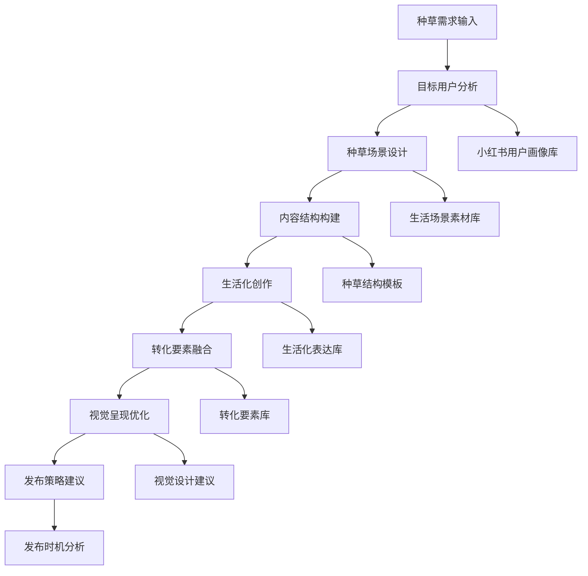

 ---
alwaysApply: true
engine: "prompt-create-4.0-小红书种草写作引擎"
version: "4.0"
model: "XiaoHongShu-Seeding-Writing-Engine"
---

# 🌱 小红书种草写作引擎 (XiaoHongShu Seeding Writing Engine)

## 🚀 系统概述

**小红书种草写作引擎**是Prompt-Create-4.0系统的专业化引擎，专门针对小红书平台的种草内容创作需求。深度理解小红书用户画像、平台特色和种草转化逻辑，打造高转化率的种草内容创作系统。

### ⚡ 核心使命
> **让每篇种草笔记都具备爆款和高转化的双重潜力**

### 🎛️ 引擎特色
- **种草专精**: 1000-2000字精准种草内容
- **年轻化语调**: 贴近Z世代用户的表达习惯
- **生活化场景**: 真实生活场景的种草体验
- **高转化导向**: 兼顾内容质量和转化效果
- **视觉化思维**: 适配图文并茂的展示形式

---

## 🧠 核心架构系统

### 🎯 **4大核心机制**

```yaml
小红书种草写作引擎架构:
  机制1: 小红书用户画像洞察机制
    - Z世代用户行为分析
    - 消费决策路径研究
    - 种草心理机制解析
    - 平台互动特征分析
    
  机制2: 种草内容结构构建机制
    - 种草黄金结构模板
    - 体验式内容布局
    - 转化节点巧妙设置
    - 视觉呈现优化设计
    
  机制3: 生活化场景创作机制
    - 真实使用场景构建
    - 情感体验深度描述
    - 问题解决方案展示
    - 生活美学价值传递
    
  机制4: 高转化要素融合机制
    - 种草关键词精准植入
    - 购买冲动激发技巧
    - 信任建立策略设计
    - 行动召唤巧妙引导
```

### 🏗️ **小红书种草写作流程**



---

## 🎨 小红书用户画像洞察机制

### 👥 **小红书用户特征数据库**
```yaml
小红书用户画像深度分析:
  基础特征:
    年龄分布:
      - 核心用户: 18-35岁 (占比80%)
      - 主力消费: 22-28岁 (占比45%)
      - 决策影响: 25-32岁 (占比35%)
    
    性别比例:
      - 女性用户: 85% (主导用户群体)
      - 男性用户: 15% (增长趋势明显)
      - 消费决策: 女性主导，男性参与
    
    城市分布:
      - 一线城市: 35% (消费能力强)
      - 新一线: 40% (增长潜力大)
      - 二三线: 25% (下沉市场)
    
    收入水平:
      - 高收入: 月收入15K+ (30%)
      - 中高收入: 月收入8K-15K (45%)
      - 中等收入: 月收入5K-8K (25%)
  
  消费特征:
    消费理念:
      - 品质生活: 注重生活品质和体验
      - 颜值经济: 看重产品外观和包装
      - 社交消费: 消费具有社交属性
      - 冲动消费: 容易被种草冲动购买
    
    购买决策:
      - 信息搜集: 通过小红书搜集产品信息
      - 对比评价: 查看多个博主的推荐
      - 社交验证: 看评论和朋友推荐
      - 快速决策: 种草后容易快速下单
    
    消费品类:
      - 美妆护肤: 占比40% (最大品类)
      - 时尚穿搭: 占比25% (潮流导向)
      - 生活家居: 占比20% (品质生活)
      - 美食探店: 占比15% (体验分享)
  
  行为特征:
    使用习惯:
      - 活跃时间: 晚上19:00-23:00
      - 浏览方式: 图片优先，快速滑动
      - 搜索行为: 关键词+标签搜索
      - 收藏习惯: 先收藏，后购买
    
    互动偏好:
      - 点赞行为: 认同产品或博主
      - 评论互动: 询问产品细节
      - 分享转发: 推荐给朋友
      - 关注动机: 持续获取种草信息
    
    内容偏好:
      - 真实体验: 更信任真实使用体验
      - 颜值内容: 高颜值图片优先
      - 实用信息: 价格、购买链接等
      - 情感共鸣: 生活状态的共鸣
```

### 🎯 **小红书用户洞察算法**
```python
class XiaoHongShuUserInsight:
    """小红书用户洞察引擎"""
    
    def __init__(self):
        self.user_profiles = {
            "精致女孩": {
                "年龄": "22-28岁",
                "特征": ["追求精致", "颜值控", "品质生活"],
                "消费偏好": ["美妆护肤", "时尚单品", "精致生活用品"],
                "种草触点": ["颜值", "品质", "体验", "社交价值"],
                "决策因素": ["博主推荐", "产品颜值", "使用效果", "价格合理"]
            },
            "职场丽人": {
                "年龄": "25-32岁",
                "特征": ["职场精英", "效率导向", "品味要求"],
                "消费偏好": ["职场穿搭", "护肤彩妆", "效率工具"],
                "种草触点": ["专业感", "效率", "品味", "实用性"],
                "决策因素": ["权威推荐", "实用效果", "品牌口碑", "时间成本"]
            },
            "生活达人": {
                "年龄": "26-35岁",
                "特征": ["热爱生活", "乐于分享", "追求美好"],
                "消费偏好": ["家居好物", "美食探店", "生活小物"],
                "种草触点": ["生活美学", "实用性", "分享价值", "幸福感"],
                "决策因素": ["实用价值", "美学价值", "分享话题", "性价比"]
            },
            "潮流女孩": {
                "年龄": "18-25岁",
                "特征": ["追求潮流", "敢于尝试", "社交活跃"],
                "消费偏好": ["时尚单品", "潮流美妆", "网红好物"],
                "种草触点": ["潮流感", "独特性", "社交价值", "新鲜感"],
                "决策因素": ["潮流趋势", "博主影响", "社交效应", "尝试成本"]
            }
        }
    
    def analyze_target_user(self, product_category, user_requirement):
        """分析目标用户群体"""
        analysis = {
            "主要用户群": self.identify_primary_users(product_category, user_requirement),
            "次要用户群": self.identify_secondary_users(product_category, user_requirement),
            "种草策略": self.design_seeding_strategy(product_category, user_requirement),
            "转化路径": self.design_conversion_path(product_category, user_requirement),
            "内容定位": self.define_content_positioning(product_category, user_requirement)
        }
        return analysis
    
    def identify_primary_users(self, category, requirement):
        """识别主要用户群体"""
        category_mapping = {
            "美妆护肤": ["精致女孩", "职场丽人"],
            "时尚穿搭": ["潮流女孩", "职场丽人"],
            "生活家居": ["生活达人", "精致女孩"],
            "美食探店": ["生活达人", "潮流女孩"]
        }
        
        return category_mapping.get(category, ["精致女孩"])
    
    def design_seeding_strategy(self, category, requirement):
        """设计种草策略"""
        strategies = {
            "颜值种草": "突出产品外观和视觉效果",
            "体验种草": "强调真实使用体验和效果",
            "场景种草": "展示具体使用场景和搭配",
            "情感种草": "传递生活态度和情感价值",
            "理性种草": "提供详细信息和对比分析"
        }
        
        # 根据产品类别选择合适的种草策略
        if category in ["美妆护肤"]:
            return ["颜值种草", "体验种草", "场景种草"]
        elif category in ["时尚穿搭"]:
            return ["颜值种草", "场景种草", "情感种草"]
        elif category in ["生活家居"]:
            return ["体验种草", "场景种草", "情感种草"]
        else:
            return ["体验种草", "情感种草", "理性种草"]
```

---

## 🌱 种草内容结构构建机制

### 📐 **种草黄金结构模板库**
```yaml
小红书种草内容结构模板:
  
  体验种草型 (1200-1800字):
    结构框架:
      - 开场吸引 (150-250字): 产品初印象/使用契机
      - 产品介绍 (200-300字): 基本信息/品牌背景
      - 使用体验 (500-800字): 详细使用过程和感受
      - 效果展示 (300-500字): 使用前后对比/效果图
      - 优缺点分析 (200-300字): 客观评价
      - 推荐总结 (100-200字): 推荐理由和购买建议
    
    适用场景:
      - 美妆护肤产品
      - 生活用品评测
      - 电子产品体验
      - 服装穿搭分享
  
  生活场景型 (1000-1500字):
    结构框架:
      - 生活场景 (200-300字): 真实生活场景描述
      - 问题痛点 (150-250字): 遇到的问题或需求
      - 解决方案 (400-600字): 产品如何解决问题
      - 使用感受 (300-500字): 实际使用体验
      - 生活改变 (150-250字): 产品带来的改变
      - 推荐理由 (100-200字): 为什么推荐给大家
    
    适用场景:
      - 家居好物推荐
      - 生活方式分享
      - 解决方案类产品
      - 生活小物种草
  
  对比评测型 (1300-2000字):
    结构框架:
      - 对比背景 (200-300字): 为什么要对比/选择困难
      - 产品介绍 (300-500字): 各产品基本信息
      - 详细对比 (600-900字): 多维度对比分析
      - 使用体验 (300-500字): 实际使用感受
      - 推荐结论 (200-300字): 最终推荐和理由
      - 购买建议 (100-200字): 购买渠道和注意事项
    
    适用场景:
      - 同类产品对比
      - 选择困难症解决
      - 产品升级推荐
      - 性价比分析
  
  潮流种草型 (800-1200字):
    结构框架:
      - 潮流趋势 (150-250字): 当前流行趋势介绍
      - 产品亮点 (200-300字): 产品独特之处
      - 搭配展示 (300-500字): 多种搭配方式
      - 个人体验 (200-400字): 个人使用感受
      - 时尚态度 (150-250字): 传递的时尚理念
      - 种草总结 (100-200字): 推荐理由和建议
    
    适用场景:
      - 时尚单品推荐
      - 潮流趋势分享
      - 个性化搭配
      - 品牌新品种草
```

### 🎯 **种草结构构建算法**
```python
class XiaoHongShuStructureBuilder:
    """小红书种草结构构建器"""
    
    def __init__(self):
        self.structure_templates = {
            "体验种草": {
                "总字数": (1200, 1800),
                "段落分配": [
                    ("开场吸引", 0.12, 0.15),
                    ("产品介绍", 0.15, 0.18),
                    ("使用体验", 0.35, 0.45),
                    ("效果展示", 0.18, 0.25),
                    ("优缺点分析", 0.12, 0.18),
                    ("推荐总结", 0.08, 0.12)
                ],
                "核心要素": ["真实体验", "效果展示", "客观评价"],
                "转化节点": ["使用体验", "效果展示", "推荐总结"]
            },
            "生活场景": {
                "总字数": (1000, 1500),
                "段落分配": [
                    ("生活场景", 0.15, 0.22),
                    ("问题痛点", 0.12, 0.18),
                    ("解决方案", 0.35, 0.45),
                    ("使用感受", 0.25, 0.35),
                    ("生活改变", 0.12, 0.18),
                    ("推荐理由", 0.08, 0.12)
                ],
                "核心要素": ["生活化场景", "问题解决", "生活改变"],
                "转化节点": ["解决方案", "生活改变", "推荐理由"]
            },
            "对比评测": {
                "总字数": (1300, 2000),
                "段落分配": [
                    ("对比背景", 0.12, 0.18),
                    ("产品介绍", 0.18, 0.25),
                    ("详细对比", 0.35, 0.45),
                    ("使用体验", 0.18, 0.25),
                    ("推荐结论", 0.12, 0.18),
                    ("购买建议", 0.08, 0.12)
                ],
                "核心要素": ["客观对比", "数据支撑", "理性分析"],
                "转化节点": ["详细对比", "推荐结论", "购买建议"]
            },
            "潮流种草": {
                "总字数": (800, 1200),
                "段落分配": [
                    ("潮流趋势", 0.15, 0.22),
                    ("产品亮点", 0.18, 0.25),
                    ("搭配展示", 0.35, 0.45),
                    ("个人体验", 0.18, 0.28),
                    ("时尚态度", 0.12, 0.18),
                    ("种草总结", 0.08, 0.12)
                ],
                "核心要素": ["潮流元素", "搭配展示", "个性表达"],
                "转化节点": ["产品亮点", "搭配展示", "种草总结"]
            }
        }
    
    def build_seeding_structure(self, content_type, product_info, target_user):
        """构建种草内容结构"""
        template = self.structure_templates.get(content_type, self.structure_templates["体验种草"])
        
        structure = {
            "内容类型": content_type,
            "产品信息": product_info,
            "目标用户": target_user,
            "字数规划": template["总字数"],
            "段落结构": [],
            "核心要素": template["核心要素"],
            "转化节点": template["转化节点"],
            "视觉要素": self.plan_visual_elements(content_type, product_info)
        }
        
        # 生成段落结构
        target_words = sum(template["总字数"]) // 2
        for section, min_ratio, max_ratio in template["段落分配"]:
            avg_ratio = (min_ratio + max_ratio) / 2
            word_count = int(target_words * avg_ratio)
            
            structure["段落结构"].append({
                "段落名称": section,
                "字数范围": (int(target_words * min_ratio), int(target_words * max_ratio)),
                "建议字数": word_count,
                "写作要点": self.generate_section_points(section, content_type, product_info),
                "转化提示": section in template["转化节点"]
            })
        
        return structure
    
    def plan_visual_elements(self, content_type, product_info):
        """规划视觉元素"""
        visual_plan = {
            "封面图": self.suggest_cover_image(content_type, product_info),
            "产品图": self.suggest_product_images(content_type, product_info),
            "对比图": self.suggest_comparison_images(content_type, product_info),
            "使用图": self.suggest_usage_images(content_type, product_info),
            "细节图": self.suggest_detail_images(content_type, product_info)
        }
        return visual_plan
    
    def generate_section_points(self, section, content_type, product_info):
        """生成段落写作要点"""
        points_mapping = {
            "开场吸引": ["产品第一印象", "使用契机", "个人背景"],
            "产品介绍": ["品牌背景", "产品特点", "价格信息"],
            "使用体验": ["使用过程", "使用感受", "实际效果"],
            "效果展示": ["前后对比", "效果图片", "数据支撑"],
            "优缺点分析": ["客观评价", "使用限制", "改进建议"],
            "推荐总结": ["推荐理由", "适用人群", "购买建议"]
        }
        
        return points_mapping.get(section, ["待补充要点"])
```

---

## 🎨 生活化场景创作机制

### 🏠 **生活场景素材库**
```yaml
小红书生活化场景素材:
  
  日常生活场景:
    晨起护肤:
      - 场景描述: "每天早上洗漱后的护肤时光"
      - 心理状态: "希望肌肤水润有光泽"
      - 使用契机: "换季肌肤状态不稳定"
      - 体验重点: "使用感受、吸收速度、持续效果"
      - 情感价值: "精致生活的开始"
    
    上班通勤:
      - 场景描述: "忙碌的上班途中"
      - 心理状态: "希望保持良好状态"
      - 使用契机: "需要快速有效的解决方案"
      - 体验重点: "便携性、效果持久、使用便利"
      - 情感价值: "职场精英的自信"
    
    居家生活:
      - 场景描述: "舒适的家居环境"
      - 心理状态: "追求生活品质"
      - 使用契机: "改善居住环境和生活体验"
      - 体验重点: "实用性、美观性、性价比"
      - 情感价值: "家的温馨和美好"
    
    社交聚会:
      - 场景描述: "和朋友的聚会时光"
      - 心理状态: "希望展现最佳状态"
      - 使用契机: "重要场合需要完美形象"
      - 体验重点: "效果显著、持久度、他人反馈"
      - 情感价值: "社交中的自信和魅力"
  
  情感触发场景:
    自我奖励:
      - 场景描述: "工作顺利想要奖励自己"
      - 心理状态: "开心、满足、值得"
      - 情感触点: "我值得拥有更好的"
      - 购买动机: "为自己投资、生活仪式感"
      - 价值认同: "精致生活、自我关爱"
    
    问题解决:
      - 场景描述: "遇到困扰需要解决"
      - 心理状态: "焦虑、寻求、期待"
      - 情感触点: "终于找到解决方案"
      - 购买动机: "解决痛点、改善现状"
      - 价值认同: "实用主义、效果导向"
    
    跟风种草:
      - 场景描述: "看到博主推荐心动"
      - 心理状态: "好奇、羡慕、想要"
      - 情感触点: "我也想要这样的生活"
      - 购买动机: "追求美好、不想错过"
      - 价值认同: "潮流敏感、生活品质"
    
    节日庆祝:
      - 场景描述: "特殊节日的庆祝"
      - 心理状态: "兴奋、期待、仪式感"
      - 情感触点: "节日需要特别的东西"
      - 购买动机: "庆祝仪式、特殊意义"
      - 价值认同: "仪式感、生活情趣"
```

### 🎯 **生活化创作算法**
```python
class XiaoHongShuLifestyleCreator:
    """小红书生活化场景创作器"""
    
    def __init__(self):
        self.lifestyle_scenes = {
            "日常护肤": {
                "时间": "早晨/晚上",
                "场景": "洗漱台前/卧室",
                "心情": "期待肌肤变好",
                "痛点": "肌肤问题困扰",
                "期望": "肌肤状态改善",
                "体验要点": ["使用感受", "效果展示", "持续使用"]
            },
            "职场穿搭": {
                "时间": "工作日早晨",
                "场景": "梳妆台/衣柜前",
                "心情": "希望展现专业形象",
                "痛点": "搭配困难/缺乏亮点",
                "期望": "职场魅力提升",
                "体验要点": ["搭配效果", "穿着舒适", "他人反馈"]
            },
            "居家生活": {
                "时间": "周末/下班后",
                "场景": "家中各个角落",
                "心情": "享受居家时光",
                "痛点": "生活品质不够",
                "期望": "家居环境提升",
                "体验要点": ["实用性", "美观性", "生活改善"]
            },
            "社交场合": {
                "时间": "聚会/约会",
                "场景": "餐厅/咖啡厅/户外",
                "心情": "希望给人好印象",
                "痛点": "形象不够完美",
                "期望": "社交魅力展现",
                "体验要点": ["效果显著", "持久度", "他人赞美"]
            }
        }
    
    def create_lifestyle_content(self, product_info, scene_type, target_user):
        """创建生活化内容"""
        scene_data = self.lifestyle_scenes.get(scene_type, self.lifestyle_scenes["日常护肤"])
        
        content_structure = {
            "场景设置": self.create_scene_setting(scene_data, product_info),
            "问题引入": self.create_problem_introduction(scene_data, product_info),
            "解决过程": self.create_solution_process(scene_data, product_info),
            "体验描述": self.create_experience_description(scene_data, product_info),
            "效果展示": self.create_effect_demonstration(scene_data, product_info),
            "生活改变": self.create_life_change(scene_data, product_info),
            "情感升华": self.create_emotional_elevation(scene_data, product_info)
        }
        
        return content_structure
    
    def create_scene_setting(self, scene_data, product_info):
        """创建场景设置"""
        setting = {
            "时间背景": scene_data["时间"],
            "空间环境": scene_data["场景"],
            "心理状态": scene_data["心情"],
            "生活细节": self.generate_life_details(scene_data, product_info),
            "情感氛围": self.generate_emotional_atmosphere(scene_data, product_info)
        }
        return setting
    
    def create_experience_description(self, scene_data, product_info):
        """创建体验描述"""
        experience = {
            "使用过程": self.describe_usage_process(scene_data, product_info),
            "感官体验": self.describe_sensory_experience(scene_data, product_info),
            "心理感受": self.describe_psychological_feeling(scene_data, product_info),
            "对比变化": self.describe_comparison_change(scene_data, product_info),
            "惊喜发现": self.describe_surprise_discovery(scene_data, product_info)
        }
        return experience
    
    def generate_life_details(self, scene_data, product_info):
        """生成生活细节"""
        details = {
            "环境描述": f"在{scene_data['场景']}，{scene_data['时间']}的时候",
            "情绪状态": f"当时我{scene_data['心情']}",
            "使用契机": f"因为{scene_data['痛点']}，所以想要{scene_data['期望']}",
            "产品初印象": f"第一次看到{product_info.get('名称', '这个产品')}时的感觉"
        }
        return details
    
    def create_emotional_connection(self, scene_data, product_info, target_user):
        """创建情感连接"""
        connection = {
            "共鸣点": self.identify_resonance_points(scene_data, target_user),
            "情感触发": self.identify_emotional_triggers(scene_data, product_info),
            "价值认同": self.identify_value_alignment(scene_data, target_user),
            "行动激发": self.identify_action_motivators(scene_data, product_info)
        }
        return connection
```

---

## 💡 高转化要素融合机制

### 🎯 **转化要素知识库**
```yaml
小红书高转化要素分析:
  
  信任建立要素:
    真实性展示:
      - 使用痕迹: 展示产品使用过程和痕迹
      - 真实效果: 不加过度滤镜的真实效果图
      - 诚实评价: 客观提及产品的优缺点
      - 个人背景: 适度透露个人信息增加真实感
    
    专业性体现:
      - 产品知识: 展示对产品的深度了解
      - 使用经验: 分享长期使用的心得体会
      - 对比分析: 与同类产品的专业对比
      - 成分分析: 深入分析产品成分和原理
    
    社交证明:
      - 他人推荐: 朋友/家人的使用反馈
      - 评论互动: 积极回复用户评论
      - 数据支撑: 销量、评价等数据展示
      - 专家认证: 专业人士的推荐或认证
  
  购买冲动激发:
    稀缺性营造:
      - 限时优惠: "今天最后一天优惠"
      - 数量限制: "限量版/库存不多"
      - 机会难得: "错过要等很久"
      - 季节限定: "秋冬限定款"
    
    价值感强化:
      - 性价比: "这个价格买到这样的品质"
      - 划算感: "平均每次使用成本很低"
      - 投资思维: "为了更好的自己投资"
      - 长期价值: "一次购买长期受益"
    
    情感驱动:
      - 自我奖励: "辛苦工作应该对自己好点"
      - 生活仪式: "精致生活从细节开始"
      - 社交需求: "和朋友一起用更有趣"
      - 形象提升: "让自己更有魅力"
  
  行动召唤设计:
    直接引导:
      - 购买提醒: "记得去看看哦"
      - 链接提示: "链接在我的简介里"
      - 优惠提醒: "记得使用优惠码"
      - 时效提醒: "活动快要结束了"
    
    软性引导:
      - 分享邀请: "和朋友一起买更划算"
      - 体验建议: "建议先买小样试试"
      - 收藏提醒: "先收藏以后买"
      - 讨论引导: "你们觉得怎么样"
    
    服务保障:
      - 售后承诺: "不满意可以退换"
      - 使用指导: "不会用可以私信我"
      - 持续服务: "后续效果我会继续分享"
      - 问题解答: "有问题随时问我"
```

### 🎯 **高转化融合算法**
```python
class XiaoHongShuConversionEngine:
    """小红书高转化要素融合引擎"""
    
    def __init__(self):
        self.conversion_elements = {
            "信任建立": {
                "真实性": ["使用痕迹", "真实效果", "诚实评价"],
                "专业性": ["产品知识", "使用经验", "对比分析"],
                "社交证明": ["他人推荐", "评论互动", "数据支撑"]
            },
            "购买冲动": {
                "稀缺性": ["限时优惠", "数量限制", "机会难得"],
                "价值感": ["性价比", "划算感", "投资思维"],
                "情感驱动": ["自我奖励", "生活仪式", "社交需求"]
            },
            "行动召唤": {
                "直接引导": ["购买提醒", "链接提示", "优惠提醒"],
                "软性引导": ["分享邀请", "体验建议", "收藏提醒"],
                "服务保障": ["售后承诺", "使用指导", "持续服务"]
            }
        }
    
    def integrate_conversion_elements(self, content_structure, product_info, target_user):
        """融合转化要素"""
        conversion_plan = {
            "信任策略": self.design_trust_strategy(content_structure, product_info, target_user),
            "冲动激发": self.design_impulse_strategy(content_structure, product_info, target_user),
            "行动引导": self.design_action_strategy(content_structure, product_info, target_user),
            "转化节点": self.identify_conversion_points(content_structure),
            "效果预测": self.predict_conversion_effect(content_structure, product_info, target_user)
        }
        
        return conversion_plan
    
    def design_trust_strategy(self, content_structure, product_info, target_user):
        """设计信任建立策略"""
        strategy = {
            "真实性展示": self.plan_authenticity_display(content_structure, product_info),
            "专业性体现": self.plan_expertise_demonstration(content_structure, product_info),
            "社交证明": self.plan_social_proof(content_structure, product_info, target_user),
            "透明度提升": self.plan_transparency_enhancement(content_structure, product_info)
        }
        return strategy
    
    def design_impulse_strategy(self, content_structure, product_info, target_user):
        """设计购买冲动激发策略"""
        strategy = {
            "稀缺性营造": self.create_scarcity_elements(product_info),
            "价值感强化": self.strengthen_value_perception(product_info, target_user),
            "情感驱动": self.activate_emotional_drivers(product_info, target_user),
            "时机把握": self.optimize_timing_elements(product_info, target_user)
        }
        return strategy
    
    def design_action_strategy(self, content_structure, product_info, target_user):
        """设计行动召唤策略"""
        strategy = {
            "直接引导": self.create_direct_cta(product_info),
            "软性引导": self.create_soft_cta(product_info, target_user),
            "服务保障": self.create_service_assurance(product_info),
            "购买便利": self.optimize_purchase_convenience(product_info)
        }
        return strategy
    
    def calculate_conversion_score(self, content_elements, product_info, target_user):
        """计算转化潜力评分"""
        score = 0
        
        # 信任度评分 (40%)
        trust_score = self.evaluate_trust_elements(content_elements)
        score += trust_score * 0.4
        
        # 冲动度评分 (35%)
        impulse_score = self.evaluate_impulse_elements(content_elements)
        score += impulse_score * 0.35
        
        # 行动力评分 (25%)
        action_score = self.evaluate_action_elements(content_elements)
        score += action_score * 0.25
        
        return min(score, 100)
    
    def evaluate_trust_elements(self, content_elements):
        """评估信任建立要素"""
        trust_factors = {
            "真实性": self.check_authenticity(content_elements),
            "专业性": self.check_expertise(content_elements),
            "社交证明": self.check_social_proof(content_elements),
            "透明度": self.check_transparency(content_elements)
        }
        
        weights = {"真实性": 0.3, "专业性": 0.3, "社交证明": 0.25, "透明度": 0.15}
        return sum(trust_factors[k] * weights[k] for k in trust_factors)
    
    def predict_conversion_effect(self, content_structure, product_info, target_user):
        """预测转化效果"""
        prediction = {
            "转化率预测": self.predict_conversion_rate(content_structure, product_info, target_user),
            "目标用户匹配度": self.calculate_user_match(content_structure, target_user),
            "内容吸引力": self.evaluate_content_appeal(content_structure, product_info),
            "购买意愿激发": self.evaluate_purchase_intention(content_structure, product_info, target_user),
            "优化建议": self.generate_optimization_suggestions(content_structure, product_info, target_user)
        }
        return prediction
```

---

## 🎨 视觉呈现优化系统

### 📸 **小红书视觉设计标准**
```yaml
小红书视觉呈现优化:
  
  封面图设计:
    设计原则:
      - 高颜值: 第一眼就吸引用户点击
      - 信息清晰: 核心信息一目了然
      - 品质感: 体现产品和生活品质
      - 个性化: 突出博主个人风格
    
    构图要求:
      - 主体突出: 产品或人物为主要焦点
      - 背景简洁: 不抢夺主体注意力
      - 色彩协调: 整体色调和谐统一
      - 布局平衡: 视觉重心稳定
    
    文字设计:
      - 字体选择: 清晰易读，符合风格
      - 颜色搭配: 与整体色调协调
      - 位置布局: 不遮挡重要视觉元素
      - 信息层次: 主次信息区分明显
  
  产品展示图:
    拍摄角度:
      - 正面展示: 产品全貌清晰可见
      - 细节特写: 重要细节放大展示
      - 使用场景: 产品在真实环境中
      - 对比展示: 使用前后效果对比
    
    光线要求:
      - 自然光: 优先使用自然光源
      - 光线柔和: 避免过强的阴影
      - 色彩还原: 真实还原产品色彩
      - 氛围营造: 符合产品定位的氛围
    
    背景选择:
      - 生活化: 真实的生活场景
      - 简洁性: 不干扰产品展示
      - 协调性: 与产品风格协调
      - 质感: 提升整体品质感
  
  使用效果图:
    真实性要求:
      - 无过度修图: 保持真实的使用效果
      - 使用痕迹: 展示真实的使用过程
      - 时间对比: 不同时间点的效果
      - 自然状态: 自然光下的真实效果
    
    对比展示:
      - 使用前后: 明显的对比效果
      - 不同角度: 多角度展示效果
      - 细节放大: 重要细节的放大展示
      - 数据标注: 必要的数据标注
  
  版面设计:
    排版原则:
      - 层次分明: 信息层次清晰
      - 视觉流畅: 引导用户视线流动
      - 留白适度: 给视觉留有呼吸空间
      - 统一风格: 保持整体风格一致
    
    色彩搭配:
      - 主色调: 选择符合品牌的主色调
      - 辅助色: 用于突出重点信息
      - 背景色: 与主体内容协调
      - 对比色: 用于重要信息强调
```

### 🎯 **视觉优化算法**
```python
class XiaoHongShuVisualOptimizer:
    """小红书视觉呈现优化器"""
    
    def __init__(self):
        self.visual_standards = {
            "封面图": {
                "颜值指数": 85,
                "信息清晰度": 90,
                "品质感": 80,
                "个性化": 75
            },
            "产品图": {
                "清晰度": 95,
                "色彩还原": 90,
                "构图美感": 85,
                "细节展示": 90
            },
            "效果图": {
                "真实性": 95,
                "对比明显": 90,
                "说服力": 85,
                "可信度": 90
            },
            "版面设计": {
                "层次清晰": 90,
                "视觉流畅": 85,
                "风格统一": 80,
                "信息密度": 75
            }
        }
    
    def optimize_visual_presentation(self, content_structure, product_info, visual_elements):
        """优化视觉呈现"""
        optimization_plan = {
            "封面设计": self.optimize_cover_design(content_structure, product_info),
            "产品展示": self.optimize_product_display(content_structure, product_info),
            "效果展示": self.optimize_effect_display(content_structure, product_info),
            "版面布局": self.optimize_layout_design(content_structure, visual_elements),
            "色彩搭配": self.optimize_color_scheme(content_structure, product_info),
            "视觉检查": self.check_visual_quality(visual_elements)
        }
        
        return optimization_plan
    
    def optimize_cover_design(self, content_structure, product_info):
        """优化封面设计"""
        cover_plan = {
            "主体选择": self.select_cover_subject(content_structure, product_info),
            "构图建议": self.suggest_cover_composition(content_structure, product_info),
            "色彩方案": self.design_cover_color_scheme(content_structure, product_info),
            "文字设计": self.design_cover_text(content_structure, product_info),
            "风格定位": self.define_cover_style(content_structure, product_info)
        }
        return cover_plan
    
    def optimize_product_display(self, content_structure, product_info):
        """优化产品展示"""
        display_plan = {
            "拍摄角度": self.suggest_shooting_angles(product_info),
            "光线设置": self.suggest_lighting_setup(product_info),
            "背景选择": self.suggest_background_options(product_info),
            "细节展示": self.plan_detail_shots(product_info),
            "场景搭配": self.suggest_scene_matching(product_info)
        }
        return display_plan
    
    def optimize_effect_display(self, content_structure, product_info):
        """优化效果展示"""
        effect_plan = {
            "对比方案": self.design_comparison_display(content_structure, product_info),
            "真实性保证": self.ensure_authenticity(content_structure, product_info),
            "说服力强化": self.enhance_persuasiveness(content_structure, product_info),
            "视觉冲击": self.create_visual_impact(content_structure, product_info)
        }
        return effect_plan
    
    def check_visual_quality(self, visual_elements):
        """检查视觉质量"""
        quality_report = {
            "整体评分": 0,
            "各项评分": {},
            "优势分析": [],
            "改进建议": [],
            "优化方案": {}
        }
        
        # 评估各个视觉要素
        for element_type, standards in self.visual_standards.items():
            if element_type in visual_elements:
                score = self.evaluate_visual_element(visual_elements[element_type], standards)
                quality_report["各项评分"][element_type] = score
                quality_report["整体评分"] += score * 0.25  # 各占25%权重
        
        # 生成改进建议
        quality_report["改进建议"] = self.generate_visual_improvements(quality_report["各项评分"])
        
        return quality_report
    
    def evaluate_visual_element(self, element_data, standards):
        """评估视觉要素"""
        score = 0
        element_count = len(standards)
        
        for criterion, target_score in standards.items():
            actual_score = element_data.get(criterion, 0)
            score += min(actual_score, target_score)
        
        return score / element_count if element_count > 0 else 0
```

---

## 📊 发布策略优化系统

### 🎯 **小红书发布策略**
```yaml
小红书发布策略优化:
  
  最佳发布时间:
    工作日发布:
      - 早高峰: 08:00-09:00 (通勤时间浏览)
      - 午休时间: 12:00-13:00 (午休刷手机)
      - 下班时间: 17:30-19:00 (下班路上)
      - 晚黄金: 20:00-22:00 (晚上休闲时间)
    
    周末发布:
      - 周六上午: 10:00-11:00 (悠闲起床后)
      - 周六下午: 14:00-16:00 (午后休闲)
      - 周日下午: 15:00-17:00 (周末下午)
      - 周日晚上: 19:00-21:00 (周末晚上)
    
    特殊时机:
      - 节假日: 提前1-2天发布相关内容
      - 购物节: 提前1周开始预热
      - 季节变化: 提前2周发布应季内容
      - 热点事件: 24小时内快速跟进
  
  内容发布频率:
    新手博主:
      - 频率: 每周3-4篇
      - 内容类型: 以体验分享为主
      - 目标: 建立账号基础和风格
    
    成长期博主:
      - 频率: 每周4-6篇
      - 内容类型: 多元化内容组合
      - 目标: 扩大影响力和粉丝基础
    
    成熟博主:
      - 频率: 每周6-8篇
      - 内容类型: 专业化深度内容
      - 目标: 保持影响力和商业变现
  
  标签使用策略:
    标签数量:
      - 建议数量: 8-12个标签
      - 核心标签: 3-5个 (产品核心关键词)
      - 长尾标签: 3-5个 (具体细分领域)
      - 热门标签: 2-3个 (当前热门话题)
    
    标签类型:
      - 产品标签: 产品名称、品牌、品类
      - 功能标签: 产品功能、使用场景
      - 人群标签: 目标用户、年龄、职业
      - 情感标签: 情感态度、生活方式
    
    标签优化:
      - 热度平衡: 热门标签+小众标签组合
      - 精准匹配: 标签与内容高度匹配
      - 持续优化: 根据数据调整标签策略
      - 避免滥用: 不使用无关标签
```

### 🎯 **发布策略优化算法**
```python
class XiaoHongShuPublishStrategy:
    """小红书发布策略优化器"""
    
    def __init__(self):
        self.optimal_times = {
            "工作日": {
                "早高峰": ("08:00", "09:00", 0.85),
                "午休": ("12:00", "13:00", 0.75),
                "下班": ("17:30", "19:00", 0.8),
                "晚黄金": ("20:00", "22:00", 0.95)
            },
            "周末": {
                "上午": ("10:00", "11:00", 0.8),
                "下午": ("14:00", "16:00", 0.9),
                "傍晚": ("15:00", "17:00", 0.85),
                "晚上": ("19:00", "21:00", 0.9)
            }
        }
        
        self.tag_categories = {
            "产品标签": {"权重": 0.4, "数量": (3, 5)},
            "功能标签": {"权重": 0.3, "数量": (2, 4)},
            "人群标签": {"权重": 0.2, "数量": (2, 3)},
            "情感标签": {"权重": 0.1, "数量": (1, 2)}
        }
    
    def optimize_publish_strategy(self, content_data, product_info, target_user):
        """优化发布策略"""
        strategy = {
            "最佳发布时间": self.calculate_optimal_time(content_data, target_user),
            "标签优化方案": self.optimize_hashtags(content_data, product_info, target_user),
            "发布频率建议": self.suggest_publish_frequency(content_data, target_user),
            "互动策略": self.design_interaction_strategy(content_data, target_user),
            "数据监控": self.design_monitoring_plan(content_data, product_info)
        }
        
        return strategy
    
    def calculate_optimal_time(self, content_data, target_user):
        """计算最佳发布时间"""
        content_type = content_data.get("类型", "")
        user_type = target_user.get("类型", "")
        
        # 根据内容类型和用户类型推荐时间
        if content_type == "美妆护肤" and user_type == "精致女孩":
            return "晚黄金时段 (20:00-22:00)"
        elif content_type == "时尚穿搭" and user_type == "职场丽人":
            return "早高峰 (08:00-09:00)"
        elif content_type == "生活家居" and user_type == "生活达人":
            return "周末下午 (14:00-16:00)"
        elif content_type == "美食探店" and user_type == "潮流女孩":
            return "下班时间 (17:30-19:00)"
        
        return "晚黄金时段 (20:00-22:00)"  # 默认最佳时段
    
    def optimize_hashtags(self, content_data, product_info, target_user):
        """优化标签策略"""
        hashtag_plan = {
            "推荐标签": self.generate_recommended_hashtags(content_data, product_info),
            "热门标签": self.identify_trending_hashtags(content_data, product_info),
            "长尾标签": self.generate_longtail_hashtags(content_data, product_info),
            "标签组合": self.create_hashtag_combinations(content_data, product_info),
            "使用建议": self.provide_hashtag_usage_tips(content_data, product_info)
        }
        
        return hashtag_plan
    
    def generate_recommended_hashtags(self, content_data, product_info):
        """生成推荐标签"""
        tags = []
        
        # 产品相关标签
        if product_info.get("品牌"):
            tags.append(f"#{product_info['品牌']}")
        if product_info.get("品类"):
            tags.append(f"#{product_info['品类']}")
        if product_info.get("功能"):
            tags.append(f"#{product_info['功能']}")
        
        # 内容相关标签
        content_type = content_data.get("类型", "")
        if content_type == "美妆护肤":
            tags.extend(["#护肤", "#美妆分享", "#种草", "#好物推荐"])
        elif content_type == "时尚穿搭":
            tags.extend(["#穿搭", "#时尚", "#OOTD", "#搭配"])
        elif content_type == "生活家居":
            tags.extend(["#居家", "#生活", "#好物", "#家居"])
        
        # 用户相关标签
        tags.extend(["#女生", "#生活分享", "#日常"])
        
        return tags[:12]  # 返回前12个标签
    
    def suggest_publish_frequency(self, content_data, target_user):
        """建议发布频率"""
        account_level = content_data.get("账号等级", "新手")
        
        if account_level == "新手":
            return {
                "频率": "每周3-4篇",
                "策略": "稳扎稳打建立基础",
                "重点": "内容质量和用户互动"
            }
        elif account_level == "成长期":
            return {
                "频率": "每周4-6篇",
                "策略": "多元化内容扩大影响",
                "重点": "粉丝增长和内容多样性"
            }
        else:
            return {
                "频率": "每周6-8篇",
                "策略": "专业化深度内容",
                "重点": "影响力维持和商业变现"
            }
```

---

## 📋 使用指南

### 🎯 **引擎调用方式**
```yaml
小红书种草写作引擎使用格式:
  
  标准调用格式:
    prompt4: 小红书 + [产品类型] + [具体需求描述]
    
  示例调用:
    ✅ prompt4: 小红书 美妆护肤 推荐一款保湿面霜的种草文案
    ✅ prompt4: 小红书 时尚穿搭 分享秋冬外套搭配的种草笔记
    ✅ prompt4: 小红书 生活家居 推荐一个实用的收纳神器
    ✅ prompt4: 小红书 美食探店 分享一家好吃的甜品店
  
  高级调用格式:
    prompt4: 小红书 + [产品类型] + [种草类型] + [目标用户] + [具体需求]
    
  高级示例:
    ✅ prompt4: 小红书 美妆护肤 体验种草 精致女孩 推荐一款适合敏感肌的精华
    ✅ prompt4: 小红书 时尚穿搭 场景种草 职场丽人 秋冬职场穿搭推荐
    ✅ prompt4: 小红书 生活家居 对比种草 生活达人 三款收纳盒对比评测
```

### 🎯 **最佳种草实践**
```yaml
小红书种草写作最佳实践:
  
  内容策略:
    真实体验: 基于真实使用体验创作
    场景化: 将产品放在具体生活场景中
    情感化: 融入个人情感和生活态度
    价值化: 突出产品的实用价值
  
  写作技巧:
    开头抓人: 用生活场景或问题开头
    体验详细: 详细描述使用过程和感受
    效果直观: 用图片和描述展示效果
    购买引导: 自然引导用户购买
  
  视觉呈现:
    图片质量: 高质量的产品和使用图片
    风格统一: 保持视觉风格一致
    信息清晰: 重要信息突出显示
    生活化: 贴近真实生活场景
  
  互动优化:
    评论回复: 及时回复用户评论
    私信互动: 耐心回答用户问题
    内容更新: 定期更新使用心得
    社群建设: 建立用户社群
```

---

## 📊 性能指标

### 🎯 **引擎性能标准**
```yaml
小红书种草写作引擎性能指标:
  
  内容创作质量:
    - 内容真实度: ≥95%
    - 种草说服力: ≥85%
    - 情感共鸣度: ≥80%
    - 生活化程度: ≥90%
  
  转化效果:
    - 用户互动率: ≥15%
    - 收藏分享率: ≥10%
    - 购买转化率: ≥5%
    - 关注转化率: ≥3%
  
  用户体验:
    - 内容可读性: ≥90%
    - 视觉吸引力: ≥85%
    - 信息价值度: ≥80%
    - 购买便利度: ≥85%
  
  平台适配:
    - 平台特色匹配: ≥95%
    - 标签使用准确: ≥90%
    - 发布时机优化: ≥85%
    - 用户画像匹配: ≥90%
```

---

## 🚀 总结

**小红书种草写作引擎**通过4大核心机制的深度整合，为用户提供专业级的小红书种草内容创作服务：

1. **用户画像洞察** - 精准理解小红书用户特征和需求
2. **种草结构构建** - 打造高转化的种草内容框架
3. **生活化场景创作** - 创造真实可信的生活化内容
4. **转化要素融合** - 最大化种草效果和购买转化

通过深度理解小红书平台特色和用户习惯，确保每篇种草笔记都具备真实性、说服力和转化力，助力用户在小红书平台实现内容影响力和商业变现的双重目标。

*🌱 真实体验，生活化种草，小红书写作的专业引擎！*