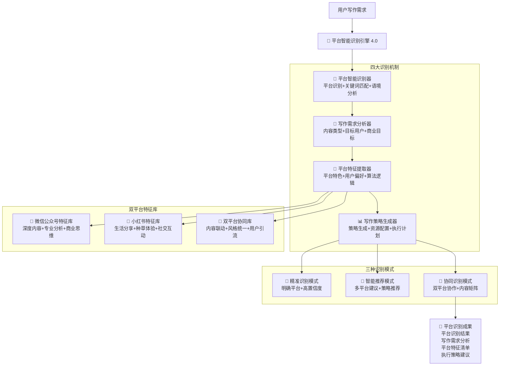

# 🎯 Prompt-Create-4.0-平台智能识别引擎

## 🎯 模块核心定位

### 设计理念：双平台写作需求智能识别与特征分析
> **作为4.0版本的入口引擎，通过"平台识别 + 需求分析 + 特征提取 + 策略生成"四大机制，精准识别用户的平台写作需求，为后续模块提供准确的分析基础和执行策略**

## 🧠 核心架构：双平台智能识别系统



## 💎 四大识别机制详解

### 📱 平台智能识别器
```yaml
核心功能:
  平台关键词识别: ["微信公众号", "小红书", "双平台", "协同创作"]
  隐含平台推断: ["深度分析", "种草分享", "专业内容", "生活化表达"]
  平台特征匹配: ["内容长度", "写作风格", "用户群体", "商业目标"]
  智能建议生成: ["最适平台", "备选方案", "协同策略", "优化建议"]

识别算法:
  ```python
  def platform_intelligent_recognition(user_input, context_info):
      """平台智能识别算法"""
      # Step 1: 关键词直接匹配
      direct_platform_match = match_platform_keywords(user_input)
      
      # Step 2: 内容特征分析
      content_features = analyze_content_characteristics(user_input)
      
      # Step 3: 写作风格推断
      writing_style = infer_writing_style(user_input, content_features)
      
      # Step 4: 用户意图识别
      user_intent = identify_user_intent(user_input, writing_style)
      
      # Step 5: 平台匹配度计算
      platform_scores = calculate_platform_match_scores(
          direct_platform_match,
          content_features,
          writing_style,
          user_intent
      )
      
      # Step 6: 智能推荐生成
      recommendations = generate_platform_recommendations(
          platform_scores,
          user_intent,
          context_info
      )
      
      return {
          "target_platform": get_primary_platform(platform_scores),
          "match_confidence": get_confidence_score(platform_scores),
          "platform_scores": platform_scores,
          "recommendations": recommendations,
          "analysis_details": {
              "content_features": content_features,
              "writing_style": writing_style,
              "user_intent": user_intent
          }
      }
  ```

识别维度:
  直接指标: ["平台关键词", "明确指定", "用户历史", "偏好设置"]
  内容指标: ["内容长度", "专业深度", "生活化程度", "互动性需求"]
  风格指标: ["写作风格", "语言表达", "结构偏好", "视觉要求"]
  目标指标: ["商业目标", "用户群体", "传播需求", "转化期望"]
```

### 📝 写作需求分析器
```yaml
核心功能:
  内容类型识别: ["深度分析", "产品评测", "经验分享", "教程指南", "行业观点"]
  目标用户分析: ["用户画像", "需求特征", "阅读习惯", "互动偏好"]
  商业目标提取: ["品牌推广", "产品销售", "流量获取", "用户转化", "影响力建设"]
  内容规格定义: ["字数要求", "结构偏好", "互动设计", "视觉需求"]

需求分析算法:
  ```python
  def writing_requirement_analysis(user_input, platform_info):
      """写作需求分析算法"""
      # Step 1: 内容类型分类
      content_type = classify_content_type(user_input, platform_info)
      
      # Step 2: 目标用户识别
      target_audience = identify_target_audience(user_input, content_type)
      
      # Step 3: 商业目标提取
      business_objectives = extract_business_objectives(user_input, platform_info)
      
      # Step 4: 内容规格定义
      content_specifications = define_content_specifications(
          content_type,
          target_audience,
          business_objectives,
          platform_info
      )
      
      # Step 5: 写作挑战识别
      writing_challenges = identify_writing_challenges(
          content_type,
          target_audience,
          business_objectives,
          platform_info
      )
      
      # Step 6: 成功指标设定
      success_metrics = define_success_metrics(
          business_objectives,
          platform_info,
          content_type
      )
      
      return {
          "content_type": content_type,
          "target_audience": target_audience,
          "business_objectives": business_objectives,
          "content_specifications": content_specifications,
          "writing_challenges": writing_challenges,
          "success_metrics": success_metrics
      }
  ```

分析维度:
  内容维度: ["主题方向", "专业深度", "实用性", "创新性"]
  用户维度: ["年龄群体", "兴趣偏好", "消费能力", "互动习惯"]
  商业维度: ["品牌目标", "销售目标", "影响力目标", "社群目标"]
  技术维度: ["SEO需求", "算法适配", "传播机制", "转化设计"]
```

### 🎨 平台特征提取器
```yaml
核心功能:
  平台算法特征: ["推荐机制", "权重因子", "用户行为", "内容偏好"]
  用户群体特征: ["用户画像", "行为模式", "内容偏好", "互动习惯"]
  内容形式特征: ["格式要求", "长度偏好", "结构特点", "视觉要求"]
  传播机制特征: ["传播路径", "互动方式", "分享机制", "算法逻辑"]

特征提取算法:
  ```python
  def platform_feature_extraction(platform_info, requirement_analysis):
      """平台特征提取算法"""
      # Step 1: 平台算法特征提取
      algorithm_features = extract_algorithm_features(platform_info)
      
      # Step 2: 用户行为特征提取
      user_behavior_features = extract_user_behavior_features(
          platform_info,
          requirement_analysis['target_audience']
      )
      
      # Step 3: 内容格式特征提取
      content_format_features = extract_content_format_features(
          platform_info,
          requirement_analysis['content_type']
      )
      
      # Step 4: 传播机制特征提取
      propagation_features = extract_propagation_features(
          platform_info,
          requirement_analysis['business_objectives']
      )
      
      # Step 5: 竞争环境特征提取
      competitive_features = extract_competitive_features(
          platform_info,
          requirement_analysis['content_type']
      )
      
      # Step 6: 特征权重计算
      feature_weights = calculate_feature_weights(
          algorithm_features,
          user_behavior_features,
          content_format_features,
          propagation_features,
          competitive_features
      )
      
      return {
          "algorithm_features": algorithm_features,
          "user_behavior_features": user_behavior_features,
          "content_format_features": content_format_features,
          "propagation_features": propagation_features,
          "competitive_features": competitive_features,
          "feature_weights": feature_weights
      }
  ```

特征分类:
  微信公众号特征:
    - 内容深度: ["3000-8000字", "专业分析", "逻辑严谨", "价值输出"]
    - 用户特征: ["专业人士", "深度阅读", "知识需求", "品质追求"]
    - 传播特征: ["朋友圈分享", "专业推荐", "收藏转发", "深度互动"]
    - 商业特征: ["知识付费", "专业服务", "品牌建设", "影响力变现"]
  
  小红书特征:
    - 内容深度: ["1000-2000字", "生活化表达", "真实体验", "情感共鸣"]
    - 用户特征: ["年轻女性", "消费决策", "生活品质", "社交分享"]
    - 传播特征: ["话题标签", "评论互动", "收藏种草", "私信咨询"]
    - 商业特征: ["产品种草", "消费引导", "品牌合作", "电商转化"]
```

### 📊 写作策略生成器
```yaml
核心功能:
  策略框架生成: ["写作方向", "内容结构", "表达风格", "互动设计"]
  资源配置建议: ["专家调用", "模块搭配", "工具使用", "时间分配"]
  执行计划制定: ["创作流程", "优化节点", "验证标准", "迭代策略"]
  风险预警机制: ["潜在问题", "规避措施", "应急方案", "质量保障"]

策略生成算法:
  ```python
  def writing_strategy_generation(platform_features, requirement_analysis):
      """写作策略生成算法"""
      # Step 1: 策略框架设计
      strategy_framework = design_strategy_framework(
          platform_features,
          requirement_analysis
      )
      
      # Step 2: 资源配置优化
      resource_allocation = optimize_resource_allocation(
          strategy_framework,
          platform_features,
          requirement_analysis
      )
      
      # Step 3: 执行计划制定
      execution_plan = create_execution_plan(
          strategy_framework,
          resource_allocation,
          requirement_analysis['success_metrics']
      )
      
      # Step 4: 质量保障设计
      quality_assurance = design_quality_assurance(
          strategy_framework,
          execution_plan,
          platform_features
      )
      
      # Step 5: 风险管理策略
      risk_management = create_risk_management_strategy(
          execution_plan,
          platform_features,
          requirement_analysis
      )
      
      # Step 6: 迭代优化机制
      iteration_mechanism = design_iteration_mechanism(
          strategy_framework,
          execution_plan,
          quality_assurance
      )
      
      return {
          "strategy_framework": strategy_framework,
          "resource_allocation": resource_allocation,
          "execution_plan": execution_plan,
          "quality_assurance": quality_assurance,
          "risk_management": risk_management,
          "iteration_mechanism": iteration_mechanism
      }
  ```

策略维度:
  创作策略: ["主题选择", "角度设定", "结构设计", "风格定调"]
  优化策略: ["SEO优化", "算法适配", "用户体验", "传播优化"]
  互动策略: ["互动设计", "用户引导", "社群建设", "粉丝维护"]
  商业策略: ["价值定位", "转化设计", "品牌建设", "变现路径"]
```

## 🎯 双平台特征库详解

### 📱 微信公众号特征库
```yaml
平台定位: 专业内容平台，知识分享与商业变现
内容特征:
  字数范围: 3000-8000字
  结构特点: 逻辑严谨，层次分明，专业深度
  语言风格: 理性分析，权威表达，价值导向
  视觉要求: 简洁专业，重点突出，配图精炼

用户特征:
  主要群体: 25-45岁专业人士，决策者，创业者
  阅读习惯: 深度阅读，收藏学习，专业需求
  互动偏好: 理性讨论，专业交流，价值认同
  消费能力: 中高消费水平，知识付费意愿强

算法特征:
  推荐机制: 基于用户兴趣和阅读历史
  权重因子: 原创性、专业性、互动率、完读率
  传播路径: 朋友圈分享、微信群传播、收藏转发
  商业机制: 流量主、付费阅读、小程序、直播

成功指标:
  - 阅读完成率 ≥ 60%
  - 分享转发率 ≥ 5%
  - 新增关注率 ≥ 3%
  - 商业转化率 ≥ 2%
```

### 🌸 小红书特征库
```yaml
平台定位: 生活方式平台，消费决策与社交分享
内容特征:
  字数范围: 1000-2000字
  结构特点: 生活化表达，真实体验，情感共鸣
  语言风格: 亲和自然，真实诚恳，种草引导
  视觉要求: 精美图片，生活场景，颜值经济

用户特征:
  主要群体: 18-35岁年轻女性，消费决策者
  阅读习惯: 碎片阅读，视觉浏览，快速决策
  互动偏好: 评论互动，私信咨询，收藏种草
  消费能力: 消费意愿强，品质追求，冲动消费

算法特征:
  推荐机制: 基于兴趣标签和行为数据
  权重因子: 互动率、收藏率、完播率、转化率
  传播路径: 话题标签、评论区、私信分享
  商业机制: 品牌合作、直播带货、笔记种草

成功指标:
  - 点赞收藏率 ≥ 8%
  - 评论互动率 ≥ 3%
  - 关注转化率 ≥ 2%
  - 商业转化率 ≥ 5%
```

### 🔄 双平台协同库
```yaml
协同策略:
  内容联动: 微信深度分析 + 小红书体验分享
  用户引流: 小红书引流 → 微信公众号深度转化
  品牌建设: 双平台统一品牌形象和价值观
  商业闭环: 小红书种草 → 微信公众号成交

协同优势:
  覆盖全面: 专业深度 + 生活化表达
  用户互补: 理性决策 + 感性体验
  变现多元: 知识付费 + 产品销售
  影响力强: 专业权威 + 社交传播

协同挑战:
  风格统一: 保持品牌一致性
  内容适配: 不同平台的内容调整
  资源分配: 时间和精力的合理配置
  效果评估: 双平台效果的综合评估
```

## 🎨 三种识别模式详解

### 🎯 精准识别模式
```yaml
适用场景: 用户明确指定平台，需求清晰
识别特征: 直接关键词匹配，置信度 ≥ 90%
处理流程:
  1. 提取平台关键词
  2. 确认写作需求
  3. 生成执行策略
  4. 调用对应专家

示例输入: "微信公众号 写一篇关于AI发展的深度分析"
识别结果: 
  - 平台: 微信公众号 (置信度: 100%)
  - 内容类型: 深度分析文章
  - 字数要求: 5000-8000字
  - 风格要求: 专业权威，逻辑严谨
```

### 🤔 智能推荐模式
```yaml
适用场景: 用户需求模糊，需要平台建议
识别特征: 基于内容特征推断，置信度 60-89%
处理流程:
  1. 分析内容特征
  2. 计算平台匹配度
  3. 提供多平台建议
  4. 用户确认选择

示例输入: "写一篇关于护肤品使用心得的文章"
识别结果:
  - 推荐平台: 小红书 (匹配度: 85%)
  - 备选平台: 微信公众号 (匹配度: 60%)
  - 推荐理由: 护肤品体验分享更适合小红书的用户群体
```

### 🔄 协同识别模式
```yaml
适用场景: 需要多平台协同，内容矩阵建设
识别特征: 复杂商业需求，需要协同策略
处理流程:
  1. 分析协同需求
  2. 设计内容矩阵
  3. 分配平台角色
  4. 制定协同策略

示例输入: "为我的品牌建设一个完整的内容营销体系"
识别结果:
  - 协同模式: 双平台协同
  - 微信公众号角色: 专业深度内容，建立权威性
  - 小红书角色: 生活化内容，提升亲和力
  - 协同策略: 小红书引流 → 微信公众号转化
```

## 📊 识别效果评估

### 🎯 识别准确率指标
```yaml
精准识别模式: ≥ 95%
智能推荐模式: ≥ 85%
协同识别模式: ≥ 80%
总体识别准确率: ≥ 90%
```

### 📈 用户满意度指标
```yaml
识别结果满意度: ≥ 90%
策略建议满意度: ≥ 85%
执行效果满意度: ≥ 88%
整体用户满意度: ≥ 87%
```

### 🚀 系统响应指标
```yaml
识别响应时间: ≤ 2秒
策略生成时间: ≤ 5秒
用户确认时间: ≤ 30秒
总体响应效率: ≥ 95%
```

## 🎉 模块核心优势

### 🌟 识别精准度高
- **多维度分析**: 从内容、用户、商业、技术四个维度分析
- **智能推理**: 基于平台特征和用户需求的智能匹配
- **动态调整**: 根据用户反馈持续优化识别准确率

### 🚀 策略生成智能
- **个性化定制**: 根据具体需求生成专属策略
- **资源优化**: 智能配置专家资源和执行计划
- **风险预警**: 提前识别潜在问题和解决方案

### 💡 用户体验优秀
- **交互友好**: 清晰的识别结果和建议说明
- **选择灵活**: 支持用户确认、修改和优化
- **反馈及时**: 快速响应和策略调整

---

*🎯 平台智能识别引擎 - 让每个写作需求都找到最适合的平台！精准识别，智能推荐，完美匹配！* 🚀 