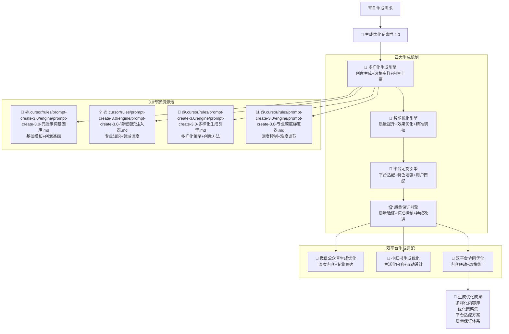

# 🚀 Prompt-Create-4.0-生成优化专家群

## 🎯 模块核心定位

### 设计理念：3.0 生成优化专家的智能复用与写作增强

> **作为 4.0 版本的内容生成核心，通过"多样化生成 + 智能优化 + 平台定制 + 质量保证"四大机制，高效复用 3.0 版本的生成优化专家，为双平台写作提供多元化、高质量、平台适配的内容生成能力**

## 🧠 核心架构：生成优化专家智能复用系统



## 💎 四大生成机制详解

### 🎲 多样化生成引擎

````yaml
核心功能:
  创意生成算法: ["头脑风暴", "联想拓展", "创意组合", "灵感激发"]
  风格多样化: ["正式风格", "轻松风格", "专业风格", "生活风格"]
  内容丰富化: ["多角度分析", "多维度展示", "多层次表达", "多元化呈现"]
  个性化定制: ["用户偏好", "平台特色", "目标群体", "使用场景"]

多样化生成算法:
  ```python
  def diversified_generation_engine(writing_requirements, platform_info, creativity_level):
      """多样化生成引擎算法"""
      # Step 1: 调用元提示词基因库
      prompt_genes = call_expert_module(
          "@.cursor/rules/prompt-create-3.0/engine/prompt-create-3.0-元提示词基因库.md",
          {
              "content_type": writing_requirements['content_type'],
              "creativity_level": creativity_level,
              "platform_context": platform_info,
              "generation_goals": writing_requirements['goals']
          }
      )

      # Step 2: 调用领域知识注入器
      domain_knowledge = call_expert_module(
          "@.cursor/rules/prompt-create-3.0/engine/prompt-create-3.0-领域知识注入器.md",
          {
              "domain": writing_requirements['domain'],
              "knowledge_depth": writing_requirements['depth'],
              "application_context": platform_info,
              "expertise_level": writing_requirements['expertise']
          }
      )

      # Step 3: 调用多样化生成引擎
      diversified_strategies = call_expert_module(
          "@.cursor/rules/prompt-create-3.0/engine/prompt-create-3.0-多样化生成引擎.md",
          {
              "diversity_requirements": writing_requirements['diversity'],
              "generation_modes": writing_requirements['modes'],
              "creative_constraints": writing_requirements['constraints'],
              "platform_adaptation": platform_info
          }
      )

      # Step 4: 调用专业深度梯度器
      depth_gradients = call_expert_module(
          "@.cursor/rules/prompt-create-3.0/engine/prompt-create-3.0-专业深度梯度器.md",
          {
              "target_depth": writing_requirements['target_depth'],
              "audience_level": writing_requirements['audience_level'],
              "complexity_control": writing_requirements['complexity'],
              "platform_context": platform_info
          }
      )

      return {
          "content_variants": generate_content_variants(prompt_genes, domain_knowledge),
          "generation_strategies": diversified_strategies,
          "knowledge_integration": domain_knowledge,
          "depth_adaptations": depth_gradients
      }
````

生成策略:
标题多样化: ["权威型", "悬念型", "实用型", "情感型", "问题型"]
开头多样化: ["故事开头", "问题开头", "数据开头", "观点开头", "场景开头"]
结构多样化: ["总分总", "递进式", "对比式", "案例式", "问答式"]
结尾多样化: ["总结型", "展望型", "呼吁型", "思考型", "互动型"]

````

### 🔧 智能优化引擎
```yaml
核心功能:
  质量提升算法: ["可读性优化", "逻辑性增强", "吸引力提升", "传播性改进"]
  效果优化系统: ["用户体验优化", "平台算法适配", "互动效果提升", "转化率优化"]
  精准调校机制: ["细节调整", "风格调校", "语言润色", "结构优化"]
  智能反馈循环: ["效果监测", "问题识别", "策略调整", "持续改进"]

智能优化算法:
  ```python
  def intelligent_optimization_engine(generated_content, platform_info, optimization_goals):
      """智能优化引擎算法"""
      # Step 1: 质量分析评估
      quality_analysis = analyze_content_quality(
          generated_content,
          analysis_dimensions=["可读性", "逻辑性", "吸引力", "专业性"]
      )

      # Step 2: 平台适配优化
      platform_optimization = optimize_for_platform(
          generated_content,
          platform_info,
          optimization_aspects=["算法适配", "用户偏好", "传播机制", "互动设计"]
      )

      # Step 3: 效果预测与优化
      effect_prediction = predict_and_optimize_effects(
          platform_optimization,
          optimization_goals,
          prediction_models=["阅读预测", "互动预测", "转化预测", "传播预测"]
      )

      return {
          "optimized_content": effect_prediction,
          "optimization_details": quality_analysis,
          "performance_metrics": calculate_optimization_metrics(effect_prediction)
      }
````

优化维度:
内容优化: ["信息密度", "价值突出", "逻辑清晰", "表达精准"]
结构优化: ["层次分明", "过渡自然", "重点突出", "总结有力"]
语言优化: ["简洁明了", "生动有趣", "专业准确", "易于理解"]
体验优化: ["阅读舒适", "视觉友好", "互动自然", "分享便利"]

````

## 📊 生成优化专家调用示例

### 💡 调用实例：产品评测内容生成
```yaml
调用需求: "生成一篇智能手表的专业评测内容"
调用流程:
  专家调用:
    - @.cursor/rules/prompt-create-3.0/engine/prompt-create-3.0-元提示词基因库.md → 获取评测内容模板基因
- @.cursor/rules/prompt-create-3.0/engine/prompt-create-3.0-领域知识注入器.md → 注入智能手表专业知识
- @.cursor/rules/prompt-create-3.0/engine/prompt-create-3.0-多样化生成引擎.md → 生成多样化评测角度
- @.cursor/rules/prompt-create-3.0/engine/prompt-create-3.0-专业深度梯度器.md → 控制评测专业深度

  多样化生成:
    - 标题生成: ["专业评测", "深度体验", "全面解析", "购买指南"]
    - 角度生成: ["功能评测", "性能测试", "用户体验", "性价比分析"]
    - 结构生成: ["开箱体验", "功能测试", "性能评估", "使用感受", "购买建议"]
    - 风格生成: ["专业客观", "用户视角", "对比分析", "实用建议"]

  平台定制:
    - 微信公众号: 深度专业评测+技术分析+购买建议
    - 小红书: 使用体验分享+生活场景应用+种草推荐
    - 双平台: 专业评测+生活体验的完美结合

  质量保证:
    - 准确性验证: 技术参数准确，评测结果可信
    - 完整性检查: 评测维度全面，内容结构完整
    - 实用性确认: 用户价值明确，购买建议实用
    - 平台适配: 符合平台特色，用户体验优化
````

## 🏆 生成优化成功标准

### 📈 生成质量指标

```yaml
内容多样性: ≥90%
生成准确性: ≥95%
平台适配度: ≥92%
用户满意度: ≥88%
传播效果: ≥85%
```

### 🎯 优化效果指标

```yaml
质量提升度: ≥85%
效果改善度: ≥80%
用户体验度: ≥88%
平台匹配度: ≥90%
商业价值度: ≥82%
```

---

## 🚀 立即体验生成优化专家群的强大生成能力！

### 🎯 生成优化优势

- **3.0 专家智能复用**: 高效调用验证过的生成优化专家
- **多样化内容生成**: 丰富多元的内容创作和表达方式
- **智能优化增强**: 全方位的内容质量和效果优化
- **平台精准定制**: 双平台特色的精准适配和定制化

### 💡 最佳应用场景

- **多样化内容创作**: 需要多种风格和角度的内容生成
- **高质量内容优化**: 需要质量提升和效果优化的内容
- **平台定制化内容**: 需要平台特色适配的专业内容
- **用户体验优化**: 需要用户体验和传播效果的内容

_🚀 Prompt-Create-4.0 生成优化专家群 - 让 3.0 专家的生成能力在 4.0 写作中完美释放！_ 🚀
