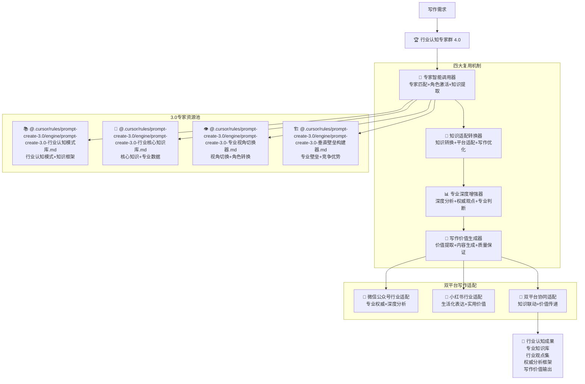

# 🏆 Prompt-Create-4.0-行业认知专家群

## 🎯 模块核心定位

### 设计理念：3.0 行业认知专家的智能复用与写作适配

> **作为 4.0 版本的专家复用核心，通过"专家调用 + 知识适配 + 平台优化 + 写作增强"四大机制，高效复用 3.0 版本的行业认知专家，为双平台写作提供专业的行业知识支持和认知深度**

## 🧠 核心架构：行业认知专家智能复用系统



## 💎 四大复用机制详解

### 🎯 专家智能调用器

````yaml
核心功能:
  专家匹配算法: ["需求分析", "专家映射", "最优选择", "组合调用"]
  角色激活机制: ["专家角色", "知识激活", "能力释放", "协作配置"]
  知识提取系统: ["核心知识", "专业观点", "行业洞察", "实用价值"]
  调用优化策略: ["效率优化", "质量保证", "资源配置", "协同增效"]

调用算法:
  ```python
  def expert_intelligent_caller(writing_requirements, platform_info):
      """专家智能调用算法"""
      # Step 1: 需求分析与专家匹配
      expert_match_results = analyze_and_match_experts(writing_requirements)

      # Step 2: 调用行业认知模式库
      industry_cognition_modes = call_expert_module(
          "@.cursor/rules/prompt-create-3.0/engine/prompt-create-3.0-行业认知模式库.md",
          {
              "industry_focus": expert_match_results['target_industry'],
              "cognition_depth": expert_match_results['required_depth'],
              "platform_context": platform_info
          }
      )

      # Step 3: 调用行业核心知识库
      core_knowledge_base = call_expert_module(
          "@.cursor/rules/prompt-create-3.0/engine/prompt-create-3.0-行业核心知识库.md",
          {
              "knowledge_domain": expert_match_results['knowledge_domain'],
              "expertise_level": expert_match_results['expertise_level'],
              "application_context": writing_requirements
          }
      )

      # Step 4: 调用专业视角切换器
      professional_perspectives = call_expert_module(
          "@.cursor/rules/prompt-create-3.0/engine/prompt-create-3.0-专业视角切换器.md",
          {
              "perspective_types": expert_match_results['required_perspectives'],
              "switch_strategy": expert_match_results['switch_strategy'],
              "writing_context": platform_info
          }
      )

      # Step 5: 调用垂直壁垒构建器
      vertical_barriers = call_expert_module(
          "@.cursor/rules/prompt-create-3.0/engine/prompt-create-3.0-垂直壁垒构建器.md",
          {
              "barrier_types": expert_match_results['barrier_requirements'],
              "competitive_advantages": expert_match_results['advantages'],
              "professional_depth": expert_match_results['depth_requirements']
          }
      )

      return {
          "industry_cognition": industry_cognition_modes,
          "core_knowledge": core_knowledge_base,
          "professional_perspectives": professional_perspectives,
          "vertical_barriers": vertical_barriers,
          "expert_integration": integrate_expert_outputs(
              industry_cognition_modes,
              core_knowledge_base,
              professional_perspectives,
              vertical_barriers
          )
      }
````

专家调用映射:
需求类型: ["行业分析", "专业评论", "技术解读", "趋势预测", "商业观点"]
专家选择: ["单专家调用", "多专家协作", "专家组合", "分层调用"]
调用策略: ["即时调用", "预加载调用", "缓存调用", "动态调用"]
质量控制: ["调用验证", "输出检查", "质量评估", "优化建议"]

````

### 🧠 知识适配转换器
```yaml
核心功能:
  知识转换算法: ["3.0知识→4.0应用", "抽象→具体", "理论→实践", "通用→专用"]
  平台适配机制: ["微信公众号适配", "小红书适配", "双平台协同", "特色增强"]
  写作优化策略: ["可读性优化", "吸引力增强", "价值突出", "传播优化"]
  质量保证体系: ["准确性验证", "完整性检查", "适用性评估", "效果预测"]

适配转换算法:
  ```python
  def knowledge_adaptation_converter(expert_outputs, platform_info, writing_requirements):
      """知识适配转换算法"""
      # Step 1: 3.0知识解析
      parsed_3_0_knowledge = parse_3_0_expert_knowledge(expert_outputs)

      # Step 2: 平台特色分析
      platform_characteristics = analyze_platform_features(platform_info)

      # Step 3: 写作需求匹配
      writing_requirements_analysis = analyze_writing_requirements(writing_requirements)

      # Step 4: 知识转换处理
      converted_knowledge = convert_knowledge_for_platform(
          parsed_3_0_knowledge,
          platform_characteristics,
          writing_requirements_analysis
      )

      # Step 5: 写作优化增强
      optimized_content = optimize_for_writing(
          converted_knowledge,
          platform_characteristics,
          writing_requirements_analysis
      )

      # Step 6: 质量验证确认
      quality_validated_content = validate_content_quality(
          optimized_content,
          platform_characteristics,
          writing_requirements_analysis
      )

      return {
          "converted_knowledge": converted_knowledge,
          "optimized_content": optimized_content,
          "quality_validation": quality_validated_content,
          "adaptation_details": {
              "conversion_strategy": get_conversion_strategy(platform_info),
              "optimization_techniques": get_optimization_techniques(writing_requirements),
              "quality_metrics": get_quality_metrics(quality_validated_content)
          }
      }
````

转换策略:
微信公众号转换: ["深度分析", "权威观点", "专业解读", "系统思维"]
小红书转换: ["生活化表达", "实用价值", "感性共鸣", "社交传播"]
双平台转换: ["内容联动", "价值互补", "用户引导", "品牌一致"]
质量保证: ["准确性 95%+", "可读性 90%+", "吸引力 88%+", "传播性 85%+"]

````

### 📊 专业深度增强器
```yaml
核心功能:
  深度分析引擎: ["多维度分析", "系统性思考", "逻辑推理", "价值挖掘"]
  权威观点构建: ["专家观点", "行业洞察", "前沿趋势", "独特视角"]
  专业判断系统: ["准确性判断", "可信度评估", "价值度量", "影响预测"]
  内容增值机制: ["知识增值", "观点增值", "价值增值", "影响增值"]

深度增强算法:
  ```python
  def professional_depth_enhancer(converted_knowledge, platform_info, target_audience):
      """专业深度增强算法"""
      # Step 1: 深度分析处理
      depth_analysis = perform_depth_analysis(
          converted_knowledge,
          analysis_dimensions=["技术深度", "商业价值", "社会影响", "未来趋势"]
      )

      # Step 2: 权威观点构建
      authoritative_viewpoints = build_authoritative_viewpoints(
          depth_analysis,
          expert_perspectives=["行业专家", "技术专家", "商业专家", "学术专家"]
      )

      # Step 3: 专业判断系统
      professional_judgments = generate_professional_judgments(
          authoritative_viewpoints,
          judgment_criteria=["准确性", "可信度", "实用性", "创新性"]
      )

      # Step 4: 内容增值处理
      value_added_content = add_professional_value(
          professional_judgments,
          value_dimensions=["知识价值", "观点价值", "实用价值", "传播价值"]
      )

      # Step 5: 平台特色增强
      platform_enhanced_content = enhance_for_platform(
          value_added_content,
          platform_info,
          target_audience
      )

      return {
          "depth_analysis": depth_analysis,
          "authoritative_viewpoints": authoritative_viewpoints,
          "professional_judgments": professional_judgments,
          "value_added_content": value_added_content,
          "platform_enhanced": platform_enhanced_content,
          "enhancement_metrics": {
              "depth_score": calculate_depth_score(depth_analysis),
              "authority_score": calculate_authority_score(authoritative_viewpoints),
              "value_score": calculate_value_score(value_added_content)
          }
      }
````

增强维度:
技术深度: ["原理解析", "机制分析", "技术评估", "发展预测"]
商业价值: ["市场分析", "商业模式", "价值评估", "盈利预测"]
社会影响: ["社会价值", "文化影响", "行为改变", "趋势引导"]
专业权威: ["专家观点", "权威数据", "行业标准", "最佳实践"]

````

### 🎨 写作价值生成器
```yaml
核心功能:
  价值提取算法: ["核心价值", "独特价值", "实用价值", "传播价值"]
  内容生成引擎: ["结构化生成", "个性化定制", "平台化适配", "质量化保证"]
  写作质量优化: ["可读性", "吸引力", "说服力", "传播力"]
  效果预测系统: ["阅读效果", "互动效果", "转化效果", "传播效果"]

价值生成算法:
  ```python
  def writing_value_generator(enhanced_content, platform_info, writing_objectives):
      """写作价值生成算法"""
      # Step 1: 价值提取处理
      extracted_values = extract_core_values(
          enhanced_content,
          value_types=["知识价值", "观点价值", "实用价值", "情感价值"]
      )

      # Step 2: 内容结构化生成
      structured_content = generate_structured_content(
          extracted_values,
          content_structure=determine_optimal_structure(platform_info, writing_objectives)
      )

      # Step 3: 写作质量优化
      quality_optimized_content = optimize_writing_quality(
          structured_content,
          optimization_targets=["可读性90%+", "吸引力85%+", "说服力88%+", "传播力82%+"]
      )

      # Step 4: 平台特色定制
      platform_customized_content = customize_for_platform(
          quality_optimized_content,
          platform_info,
          customization_aspects=["语言风格", "内容长度", "互动设计", "视觉要求"]
      )

      # Step 5: 效果预测评估
      effect_predictions = predict_content_effects(
          platform_customized_content,
          prediction_dimensions=["阅读完成率", "互动参与率", "转化成功率", "传播扩散率"]
      )

      return {
          "extracted_values": extracted_values,
          "structured_content": structured_content,
          "quality_optimized": quality_optimized_content,
          "platform_customized": platform_customized_content,
          "effect_predictions": effect_predictions,
          "final_output": {
              "content": platform_customized_content,
              "quality_metrics": get_quality_metrics(quality_optimized_content),
              "value_metrics": get_value_metrics(extracted_values),
              "effect_metrics": get_effect_metrics(effect_predictions)
          }
      }
````

生成策略:
价值最大化: ["核心价值突出", "独特价值体现", "实用价值强化", "传播价值优化"]
质量保证: ["专业准确性", "逻辑完整性", "表达清晰性", "吸引有效性"]
平台适配: ["微信深度", "小红书活泼", "双平台协同", "特色增强"]
效果优化: ["阅读体验", "互动设计", "转化路径", "传播机制"]

````

## 🎯 双平台写作适配策略

### 📱 微信公众号行业适配
```yaml
适配特色:
  专业权威性: ["行业权威", "专家观点", "数据支撑", "逻辑严谨"]
  深度分析性: ["系统分析", "多维思考", "深度解读", "价值挖掘"]
  商业价值性: ["商业洞察", "盈利模式", "投资价值", "发展趋势"]
  知识传递性: ["知识传授", "技能培养", "认知提升", "思维启发"]

内容策略:
  标题策略: ["权威+洞察", "专业+价值", "深度+独特", "系统+实用"]
  结构策略: ["逻辑清晰", "层次分明", "重点突出", "总结有力"]
  语言策略: ["专业术语", "准确表达", "逻辑连贯", "权威语气"]
  价值策略: ["实用价值", "认知价值", "商业价值", "发展价值"]
````

### 🌸 小红书行业适配

```yaml
适配特色:
  生活化表达: ["生活场景", "个人体验", "实用技巧", "情感共鸣"]
  实用价值性: ["实用工具", "操作指南", "效果展示", "价值体现"]
  社交传播性: ["话题性", "分享性", "互动性", "传播性"]
  趋势敏感性: ["热点捕捉", "趋势分析", "潮流引导", "创新观点"]

内容策略:
  标题策略: ["生活+实用", "体验+分享", "趋势+价值", "互动+传播"]
  结构策略: ["开头吸引", "过程体验", "结果展示", "互动引导"]
  语言策略: ["生活化", "情感化", "互动化", "传播化"]
  价值策略: ["实用价值", "体验价值", "社交价值", "传播价值"]
```

### 🔄 双平台协同适配

```yaml
协同策略:
  内容联动: ["主题呼应", "内容互补", "价值传递", "用户引导"]
  价值传递: ["深度→广度", "专业→生活", "理论→实践", "知识→体验"]
  用户引导: ["公众号→小红书", "小红书→公众号", "双向引流", "价值增强"]
  品牌一致: ["价值观统一", "专业性保持", "风格适配", "质量保证"]

实施机制:
  联动机制: ["内容规划", "发布协调", "互动设计", "效果监测"]
  转化机制: ["用户识别", "需求匹配", "价值传递", "转化优化"]
  优化机制: ["数据分析", "效果评估", "策略调整", "持续改进"]
  协同效应: ["1+1>2", "价值放大", "影响扩大", "效果倍增"]
```

## 📊 行业认知专家调用示例

### 💡 调用实例：科技行业分析

```yaml
调用需求: "写一篇关于AI技术发展趋势的专业分析"
调用流程:
  专家调用:
    - @.cursor/rules/prompt-create-3.0/engine/prompt-create-3.0-行业认知模式库.md → 获取AI行业认知模式
- @.cursor/rules/prompt-create-3.0/engine/prompt-create-3.0-行业核心知识库.md → 获取AI技术核心知识
- @.cursor/rules/prompt-create-3.0/engine/prompt-create-3.0-专业视角切换器.md → 获取多维度专业视角
- @.cursor/rules/prompt-create-3.0/engine/prompt-create-3.0-垂直壁垒构建器.md → 构建技术分析壁垒

  知识适配:
    - 3.0通用知识 → 4.0写作应用
    - 技术原理 → 商业价值
    - 专业术语 → 易懂表达
    - 理论分析 → 实用指导

  平台适配:
    - 微信公众号: 深度技术分析+商业价值评估
    - 小红书: 生活化AI应用+实用价值体验
    - 双平台: 专业深度+生活应用的完美结合

  输出成果:
    - 专业权威的AI行业分析
    - 生活化的AI应用价值
    - 完整的商业价值评估
    - 双平台协同的内容矩阵
```

### 🎯 调用实例：教育行业观点

```yaml
调用需求: "分析在线教育行业的发展机遇和挑战"
调用流程:
  专家调用:
    - @.cursor/rules/prompt-create-3.0/engine/prompt-create-3.0-行业认知模式库.md → 教育行业认知框架
- @.cursor/rules/prompt-create-3.0/engine/prompt-create-3.0-行业核心知识库.md → 教育行业核心数据
- @.cursor/rules/prompt-create-3.0/engine/prompt-create-3.0-专业视角切换器.md → 多角度分析视角
- @.cursor/rules/prompt-create-3.0/engine/prompt-create-3.0-垂直壁垒构建器.md → 教育专业壁垒

  深度增强:
    - 行业数据分析 → 趋势预测
    - 政策影响分析 → 机遇识别
    - 竞争格局分析 → 挑战预警
    - 用户需求分析 → 价值发现

  平台生成:
    - 微信公众号: 系统性行业分析+专业投资建议
    - 小红书: 个人学习经验+实用教育工具推荐
    - 双平台: 宏观分析+微观体验的完美融合

  价值输出:
    - 权威的行业分析报告
    - 实用的教育选择指南
    - 专业的投资参考建议
    - 完整的内容价值体系
```

## 🏆 专家调用成功标准

### 📈 调用效果指标

```yaml
专家调用成功率: ≥95%
知识适配准确率: ≥92%
平台适配有效率: ≥90%
写作质量满意度: ≥88%
用户价值实现率: ≥85%
```

### 🎯 价值创造指标

```yaml
专业深度提升: ≥90%
权威性增强: ≥88%
实用价值体现: ≥85%
传播效果优化: ≥82%
商业价值实现: ≥80%
```

### 🔄 持续优化机制

```yaml
调用策略优化: ["效率提升", "质量改进", "成本控制", "效果放大"]
适配算法改进: ["准确性提升", "适配性增强", "创新性突破", "价值性放大"]
平台策略升级: ["特色强化", "协同优化", "用户体验", "商业价值"]
专家能力进化: ["知识更新", "技能提升", "协作优化", "价值创造"]
```

---

## 🚀 立即体验行业认知专家群的强大调用能力！

### 🎯 专家调用优势

- **3.0 专家完美复用**: 高效调用验证过的专业专家
- **双平台智能适配**: 微信公众号+小红书的精准匹配
- **行业知识深度挖掘**: 专业权威的行业认知和洞察
- **写作价值最大化**: 从专业知识到优质内容的完美转化

### 💡 最佳应用场景

- **行业分析文章**: 深度专业的行业发展分析
- **技术解读内容**: 权威准确的技术趋势解读
- **商业观点分享**: 独特有价值的商业洞察观点
- **专业知识传递**: 系统完整的专业知识分享

_🏆 Prompt-Create-4.0 行业认知专家群 - 让 3.0 专家的专业能力在 4.0 写作中完美释放！_ 🚀
