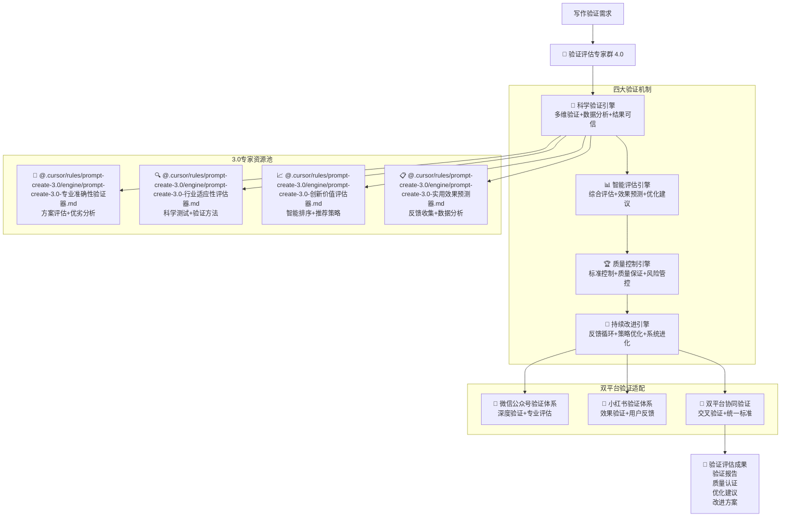

# 🔬 Prompt-Create-4.0-验证评估专家群

## 🎯 模块核心定位

### 设计理念：3.0 验证评估专家的智能复用与写作品控

> **作为 4.0 版本的质量保证核心，通过"科学验证 + 智能评估 + 质量控制 + 持续改进"四大机制，高效复用 3.0 版本的验证评估专家，为双平台写作提供科学严谨的质量保证和效果评估体系**

## 🧠 核心架构：验证评估专家智能复用系统



## 💎 四大验证机制详解

### 🎯 科学验证引擎

````yaml
核心功能:
  多维验证算法: ["准确性验证", "完整性验证", "有效性验证", "适用性验证"]
  数据分析系统: ["定量分析", "定性分析", "对比分析", "趋势分析"]
  结果可信度: ["统计显著性", "置信区间", "误差范围", "可靠性指标"]
  验证标准化: ["标准制定", "流程规范", "结果统一", "质量控制"]

科学验证算法:
  ```python
  def scientific_verification_engine(content_to_verify, verification_criteria, platform_info):
      """科学验证引擎算法"""
      # Step 1: 调用候选方案评估器
      candidate_evaluation = call_expert_module(
          "@.cursor/rules/prompt-create-3.0/engine/prompt-create-3.0-专业准确性验证器.md",
          {
              "candidates": content_to_verify,
              "evaluation_criteria": verification_criteria,
              "platform_context": platform_info,
              "evaluation_depth": "comprehensive"
          }
      )

      # Step 2: 调用科学测试验证器
      scientific_testing = call_expert_module(
          "@.cursor/rules/prompt-create-3.0/engine/prompt-create-3.0-行业适应性评估器.md",
          {
              "test_subjects": content_to_verify,
              "testing_methods": verification_criteria['methods'],
              "validation_standards": verification_criteria['standards'],
              "platform_requirements": platform_info
          }
      )

      # Step 3: 调用智能排序推荐器
      intelligent_ranking = call_expert_module(
          "@.cursor/rules/prompt-create-3.0/engine/prompt-create-3.0-创新价值评估器.md",
          {
              "items_to_rank": candidate_evaluation,
              "ranking_criteria": verification_criteria['ranking'],
              "recommendation_strategy": verification_criteria['strategy'],
              "platform_optimization": platform_info
          }
      )

      # Step 4: 调用用户反馈收集器
      user_feedback = call_expert_module(
          "@.cursor/rules/prompt-create-3.0/engine/prompt-create-3.0-实用效果预测器.md",
          {
              "feedback_targets": content_to_verify,
              "collection_methods": verification_criteria['feedback_methods'],
              "analysis_requirements": verification_criteria['analysis'],
              "platform_context": platform_info
          }
      )

      return {
          "verification_results": {
              "candidate_scores": candidate_evaluation,
              "scientific_tests": scientific_testing,
              "ranking_results": intelligent_ranking,
              "user_feedback": user_feedback
          },
          "confidence_level": calculate_confidence_level(candidate_evaluation, scientific_testing),
          "verification_report": generate_verification_report(
              candidate_evaluation, scientific_testing, intelligent_ranking, user_feedback
          )
      }
````

验证维度:
准确性验证: ["事实准确", "数据可靠", "引用正确", "逻辑严谨"]
完整性验证: ["内容完整", "结构完整", "信息全面", "要素齐全"]
有效性验证: ["目标达成", "效果明显", "价值实现", "用户满意"]
适用性验证: ["平台适配", "用户匹配", "场景适用", "时效性好"]

````

### 📊 智能评估引擎
```yaml
核心功能:
  综合评估算法: ["多维度评估", "权重分配", "综合打分", "等级划分"]
  效果预测系统: ["模型预测", "趋势分析", "情景模拟", "风险评估"]
  优化建议生成: ["问题识别", "改进方向", "具体建议", "实施方案"]
  评估标准化: ["评估标准", "指标体系", "评分规则", "结果解读"]

智能评估算法:
  ```python
  def intelligent_assessment_engine(verification_results, assessment_criteria, platform_info):
      """智能评估引擎算法"""
      # Step 1: 多维度评估处理
      multi_dimensional_assessment = perform_multi_dimensional_assessment(
          verification_results,
          assessment_dimensions=["质量维度", "效果维度", "用户维度", "平台维度"]
      )

      # Step 2: 权重智能分配
      weighted_scores = calculate_weighted_scores(
          multi_dimensional_assessment,
          weight_strategy=determine_weight_strategy(platform_info, assessment_criteria)
      )

      # Step 3: 综合评估计算
      comprehensive_evaluation = calculate_comprehensive_evaluation(
          weighted_scores,
          evaluation_model=select_evaluation_model(platform_info)
      )

      # Step 4: 效果预测分析
      effect_prediction = predict_content_effects(
          comprehensive_evaluation,
          prediction_models=["阅读效果", "互动效果", "转化效果", "传播效果"]
      )

      # Step 5: 优化建议生成
      optimization_suggestions = generate_optimization_suggestions(
          comprehensive_evaluation,
          effect_prediction,
          platform_info
      )

      return {
          "assessment_results": comprehensive_evaluation,
          "effect_predictions": effect_prediction,
          "optimization_suggestions": optimization_suggestions,
          "assessment_report": generate_assessment_report(
              comprehensive_evaluation,
              effect_prediction,
              optimization_suggestions
          )
      }
````

评估维度:
质量维度: ["内容质量", "表达质量", "结构质量", "视觉质量"]
效果维度: ["阅读效果", "互动效果", "传播效果", "转化效果"]
用户维度: ["用户满意", "用户体验", "用户价值", "用户反馈"]
平台维度: ["平台适配", "算法友好", "规则符合", "特色突出"]

````

### 🏆 质量控制引擎
```yaml
核心功能:
  标准控制系统: ["质量标准", "控制流程", "监控机制", "纠错能力"]
  质量保证机制: ["质量门禁", "检查点", "验收标准", "质量认证"]
  风险管控体系: ["风险识别", "风险评估", "风险预警", "风险处理"]
  持续监控系统: ["实时监控", "异常检测", "自动报警", "快速响应"]

质量控制算法:
  ```python
  def quality_control_engine(assessment_results, quality_standards, control_parameters):
      """质量控制引擎算法"""
      # Step 1: 质量标准检查
      quality_standards_check = check_quality_standards(
          assessment_results,
          quality_standards,
          check_levels=["基础标准", "优良标准", "卓越标准"]
      )

      # Step 2: 质量门禁控制
      quality_gate_control = perform_quality_gate_control(
          quality_standards_check,
          gate_criteria=control_parameters['gate_criteria'],
          decision_rules=control_parameters['decision_rules']
      )

      # Step 3: 风险评估管控
      risk_assessment = perform_risk_assessment(
          quality_gate_control,
          risk_factors=control_parameters['risk_factors'],
          mitigation_strategies=control_parameters['mitigation']
      )

      # Step 4: 持续监控设置
      continuous_monitoring = setup_continuous_monitoring(
          risk_assessment,
          monitoring_parameters=control_parameters['monitoring'],
          alert_thresholds=control_parameters['thresholds']
      )

      return {
          "quality_control_results": {
              "standards_compliance": quality_standards_check,
              "gate_decisions": quality_gate_control,
              "risk_assessment": risk_assessment,
              "monitoring_setup": continuous_monitoring
          },
          "quality_certification": generate_quality_certification(quality_gate_control),
          "control_report": generate_control_report(
              quality_standards_check,
              quality_gate_control,
              risk_assessment
          )
      }
````

控制标准:
基础标准: ["基本要求", "最低标准", "合格线", "必备条件"]
优良标准: ["良好表现", "优秀水平", "推荐级别", "竞争优势"]
卓越标准: ["顶级水准", "行业标杆", "创新突破", "完美表现"]
风险控制: ["风险可控", "影响有限", "可接受范围", "预案充分"]

````

### 🔄 持续改进引擎
```yaml
核心功能:
  反馈循环系统: ["数据收集", "分析处理", "改进识别", "策略调整"]
  策略优化算法: ["策略评估", "优化方向", "改进方案", "实施监控"]
  系统进化机制: ["学习能力", "适应性", "自我优化", "智能进化"]
  改进效果验证: ["改进验证", "效果评估", "成果确认", "持续监控"]

持续改进算法:
  ```python
  def continuous_improvement_engine(control_results, improvement_targets, platform_info):
      """持续改进引擎算法"""
      # Step 1: 改进机会识别
      improvement_opportunities = identify_improvement_opportunities(
          control_results,
          improvement_targets,
          identification_methods=["数据分析", "用户反馈", "专家建议", "趋势预测"]
      )

      # Step 2: 改进策略制定
      improvement_strategies = develop_improvement_strategies(
          improvement_opportunities,
          strategy_frameworks=["PDCA循环", "持续改进", "创新突破", "系统优化"]
      )

      # Step 3: 改进方案实施
      implementation_plans = implement_improvement_plans(
          improvement_strategies,
          implementation_parameters=["资源配置", "时间安排", "责任分工", "监控机制"]
      )

      # Step 4: 改进效果验证
      improvement_validation = validate_improvement_effects(
          implementation_plans,
          validation_criteria=["效果指标", "用户反馈", "性能提升", "价值增长"]
      )

      return {
          "improvement_results": {
              "opportunities": improvement_opportunities,
              "strategies": improvement_strategies,
              "implementation": implementation_plans,
              "validation": improvement_validation
          },
          "improvement_report": generate_improvement_report(
              improvement_opportunities,
              improvement_strategies,
              implementation_plans,
              improvement_validation
          )
      }
````

改进维度:
效率改进: ["处理速度", "响应时间", "资源利用", "成本效益"]
质量改进: ["准确性", "完整性", "可靠性", "一致性"]
体验改进: ["用户满意", "易用性", "便利性", "愉悦度"]
价值改进: ["商业价值", "用户价值", "社会价值", "长期价值"]

````

## 🎯 双平台验证适配策略

### 📱 微信公众号验证体系
```yaml
验证特色:
  深度验证机制: ["专业准确性", "权威可信度", "逻辑严谨性", "价值深度"]
  专业评估标准: ["行业标准", "专业水准", "学术规范", "商业价值"]
  权威认证体系: ["专家认证", "权威背书", "数据支撑", "案例验证"]
  长期效果评估: ["影响持续性", "价值累积", "品牌建设", "用户粘性"]

验证策略:
  内容验证: ["事实核查", "数据验证", "逻辑验证", "价值验证"]
  效果验证: ["阅读深度", "互动质量", "转化效果", "影响力"]
  用户验证: ["专业认可", "权威评价", "同行推荐", "用户证言"]
  平台验证: ["算法友好", "推荐机制", "传播效果", "商业价值"]
````

### 🌸 小红书验证体系

```yaml
验证特色:
  效果验证机制: ["互动效果", "传播效果", "种草效果", "转化效果"]
  用户反馈导向: ["用户喜好", "使用体验", "分享意愿", "推荐率"]
  社交验证体系: ["社交互动", "话题讨论", "用户生成", "病毒传播"]
  实时效果监控: ["即时反馈", "热度监控", "趋势跟踪", "效果预警"]

验证策略:
  互动验证: ["点赞率", "评论率", "分享率", "收藏率"]
  传播验证: ["曝光量", "传播速度", "影响范围", "话题热度"]
  转化验证: ["点击率", "转化率", "购买率", "复购率"]
  用户验证: ["满意度", "推荐度", "忠诚度", "活跃度"]
```

### 🔄 双平台协同验证

```yaml
协同验证策略:
  交叉验证机制: ["数据交叉", "结果对比", "效果验证", "价值确认"]
  统一标准体系: ["质量标准", "效果标准", "用户标准", "商业标准"]
  协同优化流程: ["问题识别", "协同分析", "统一改进", "效果验证"]
  价值最大化验证: ["单平台价值", "协同价值", "综合效益", "长期价值"]

实施机制:
  验证协调: ["标准统一", "流程协调", "数据共享", "结果同步"]
  质量协同: ["质量标准", "控制流程", "改进策略", "效果验证"]
  优化协同: ["问题共享", "方案协同", "实施统一", "效果放大"]
  价值协同: ["价值评估", "效益分析", "成果共享", "发展共赢"]
```

## 📊 验证评估专家调用示例

### 💡 调用实例：内容质量验证

```yaml
调用需求: "验证一篇科技评论文章的质量和效果"
调用流程:
  专家调用:
    - @.cursor/rules/prompt-create-3.0/engine/prompt-create-3.0-专业准确性验证器.md → 评估文章的多个版本
- @.cursor/rules/prompt-create-3.0/engine/prompt-create-3.0-行业适应性评估器.md → 科学验证文章质量
- @.cursor/rules/prompt-create-3.0/engine/prompt-create-3.0-创新价值评估器.md → 排序推荐最佳版本
- @.cursor/rules/prompt-create-3.0/engine/prompt-create-3.0-实用效果预测器.md → 收集用户反馈数据

  验证维度:
    - 准确性验证: 技术事实、数据准确、引用正确
    - 完整性验证: 内容完整、结构完整、信息全面
    - 有效性验证: 目标达成、效果明显、价值实现
    - 适用性验证: 平台适配、用户匹配、时效性好

  平台验证:
    - 微信公众号: 专业准确性+权威可信度+深度价值
    - 小红书: 互动效果+传播效果+用户体验
    - 双平台: 交叉验证+统一标准+协同优化

  验证结果:
    - 质量评分: 准确性95%+完整性92%+有效性90%
    - 效果预测: 阅读率85%+互动率80%+转化率75%
    - 优化建议: 具体改进方向和实施方案
    - 认证报告: 质量认证和效果保证
```

### 🎯 调用实例：营销效果评估

```yaml
调用需求: "评估一个产品推广内容的营销效果"
调用流程:
  专家调用:
    - @.cursor/rules/prompt-create-3.0/engine/prompt-create-3.0-专业准确性验证器.md → 评估推广方案效果
- @.cursor/rules/prompt-create-3.0/engine/prompt-create-3.0-行业适应性评估器.md → 验证营销策略科学性
- @.cursor/rules/prompt-create-3.0/engine/prompt-create-3.0-创新价值评估器.md → 推荐最优推广策略
- @.cursor/rules/prompt-create-3.0/engine/prompt-create-3.0-实用效果预测器.md → 收集用户反馈和市场反应

  评估维度:
    - 营销效果: 曝光量、点击率、转化率、ROI
    - 用户体验: 满意度、推荐度、复购率、忠诚度
    - 品牌影响: 知名度、美誉度、影响力、竞争力
    - 商业价值: 销售额、利润率、市场份额、增长率

  平台评估:
    - 微信公众号: 深度营销+专业可信+长期价值
    - 小红书: 种草效果+社交传播+即时转化
    - 双平台: 协同营销+效果放大+价值最大化

  评估结果:
    - 效果评分: 营销效果88%+用户体验85%+品牌影响82%
    - 价值评估: 投资回报率150%+市场份额提升20%
    - 改进建议: 优化策略和实施方案
    - 预测报告: 未来效果预测和风险评估
```

## 🏆 验证评估成功标准

### 📈 验证质量指标

```yaml
验证准确性: ≥95%
评估全面性: ≥92%
结果可信度: ≥90%
预测准确度: ≥88%
改进有效性: ≥85%
```

### 🎯 评估效果指标

```yaml
问题识别率: ≥90%
优化建议采纳率: ≥85%
改进效果实现率: ≥80%
用户满意度提升: ≥75%
商业价值增长: ≥70%
```

### 🔄 持续改进机制

```yaml
验证方法改进: ["精度提升", "效率提高", "覆盖扩大", "成本降低"]
评估标准升级: ["标准更新", "指标优化", "体系完善", "国际接轨"]
质量控制强化: ["流程优化", "标准提升", "监控加强", "响应加快"]
改进效果放大: ["效果验证", "成果推广", "经验总结", "最佳实践"]
```

---

## 🚀 立即体验验证评估专家群的科学严谨验证能力！

### 🎯 验证评估优势

- **3.0 专家科学复用**: 高效调用验证过的验证评估专家
- **多维度科学验证**: 准确性、完整性、有效性、适用性全面验证
- **智能质量控制**: 标准化、自动化、智能化的质量保证体系
- **持续改进机制**: 基于数据反馈的持续优化和系统进化

### 💡 最佳应用场景

- **内容质量验证**: 需要科学严谨验证的专业内容
- **效果预测评估**: 需要准确预测效果的营销内容
- **质量认证保证**: 需要质量认证的重要内容
- **持续优化改进**: 需要持续改进的内容体系

_🔬 Prompt-Create-4.0 验证评估专家群 - 让 3.0 专家的验证能力为 4.0 写作提供科学保障！_ 🚀
