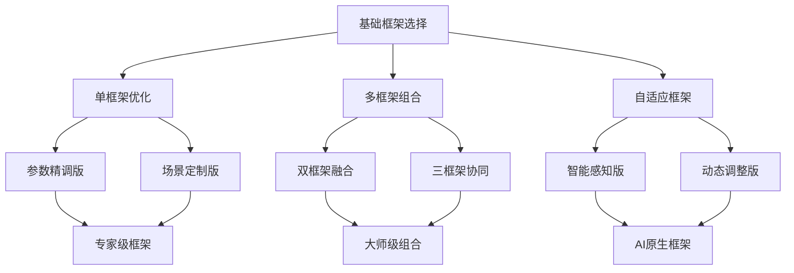
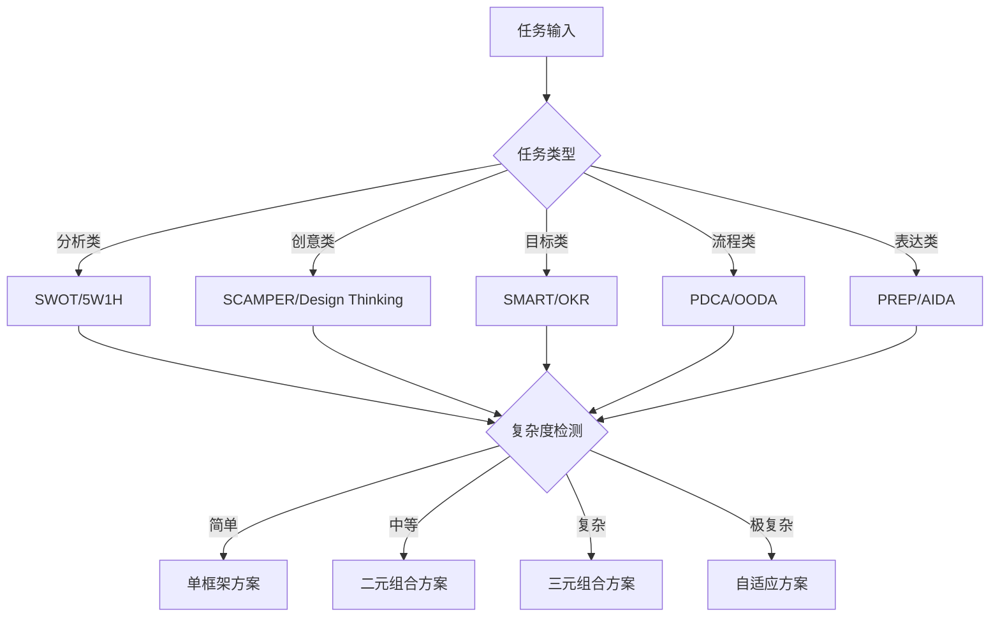
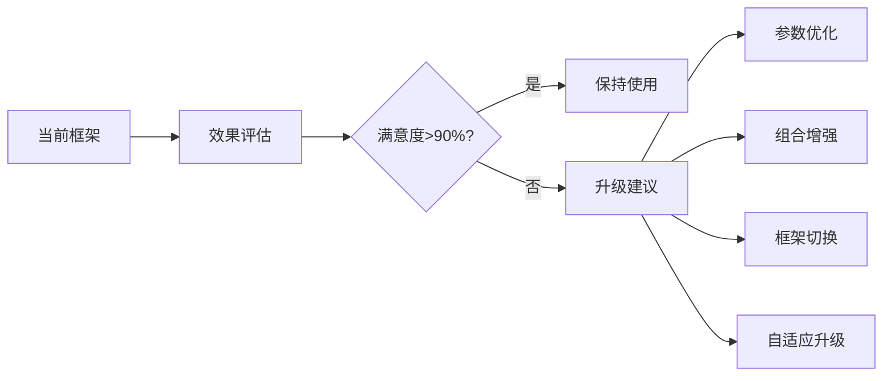

# 透明智能放大器 - 框架选择模块 (framework-selector.mdc)

## 核心功能
负责从12种经典提示词框架中智能选择最优方案，提供框架组合策略、可视化分析图表、通俗讲解，以及**框架迭代升级**和组合优化的动态演化机制。

## 框架迭代升级引擎 🔄

### 框架演化路径系统
基于使用效果和用户反馈，框架可向更高级形态演化：



### 框架迭代评分矩阵

| 框架名称 | 基础版本 | 优化版本 | 组合版本 | 自适应版本 | 进化潜力 |
|---------|---------|---------|---------|-----------|---------|
| STAR | 85分 | 92分 | 96分 | 98分 | ⭐⭐⭐⭐⭐ |
| 5W1H | 80分 | 88分 | 93分 | 95分 | ⭐⭐⭐⭐ |
| SCAMPER | 82分 | 89分 | 94分 | 96分 | ⭐⭐⭐⭐⭐ |
| SMART | 78分 | 86分 | 91分 | 93分 | ⭐⭐⭐ |
| PDCA | 76分 | 84分 | 89分 | 91分 | ⭐⭐⭐ |
| SWOT | 79分 | 87分 | 92分 | 94分 | ⭐⭐⭐⭐ |

### 迭代触发策略

#### 1. 自动升级条件
- 基础框架效果评分<90分
- 用户连续使用同一框架>3次
- 检测到更复杂的使用场景
- 系统发现更优组合方案

#### 2. 用户主导升级
- 明确要求提升效果
- 需要处理更复杂任务
- 寻求创新突破
- 对现有结果不满意

#### 3. 智能推荐升级
- 基于历史使用数据分析
- 参考同类用户偏好
- 结合任务复杂度变化
- 考虑行业最佳实践

## 12大经典框架体系

### 基础框架库（可迭代升级）

#### 1. STAR框架 ⭐ → STAR+ → STAR Pro
**基础版本**：Situation, Task, Action, Result
**优化版本**：+ Context分析 + Impact评估
**组合版本**：STAR + 5W1H深度分析
**自适应版本**：动态调整四要素权重

#### 2. 5W1H框架 ❓ → 5W1H+ → 5W1H Max  
**基础版本**：Who, What, When, Where, Why, How
**优化版本**：+ 优先级排序 + 关联性分析
**组合版本**：5W1H + SMART目标设定
**自适应版本**：根据问题类型调整问句深度

#### 3. SCAMPER框架 💡 → SCAMPER+ → SCAMPER Pro
**基础版本**：Substitute, Combine, Adapt, Modify, Put, Eliminate, Reverse
**优化版本**：+ 创新度评估 + 可行性分析
**组合版本**：SCAMPER + Design Thinking
**自适应版本**：基于创意类型调整技法权重

#### 4. SMART框架 🎯 → SMART+ → SMART Max
**基础版本**：Specific, Measurable, Achievable, Relevant, Time-bound
**优化版本**：+ 风险评估 + 资源分析
**组合版本**：SMART + OKR目标管理
**自适应版本**：根据目标复杂度调整标准

#### 5. PDCA框架 🔄 → PDCA+ → PDCA Pro
**基础版本**：Plan, Do, Check, Act
**优化版本**：+ 数据收集 + 效果预测
**组合版本**：PDCA + Lean思维
**自适应版本**：循环速度动态调整

#### 6. SWOT框架 📊 → SWOT+ → SWOT Max
**基础版本**：Strengths, Weaknesses, Opportunities, Threats
**优化版本**：+ 权重分析 + 策略矩阵
**组合版本**：SWOT + PEST环境分析
**自适应版本**：根据分析目标调整关注点

#### 7. Design Thinking框架 🎨 → DT+ → DT Pro
**基础版本**：Empathize, Define, Ideate, Prototype, Test
**优化版本**：+ 用户画像 + 技术可行性
**组合版本**：DT + Agile开发
**自适应版本**：根据创新类型调整流程

#### 8. AIDA框架 📢 → AIDA+ → AIDA Max
**基础版本**：Attention, Interest, Desire, Action
**优化版本**：+ 情感分析 + 转化跟踪
**组合版本**：AIDA + Customer Journey
**自适应版本**：根据受众特征调整策略

#### 9. PREP框架 📝 → PREP+ → PREP Pro
**基础版本**：Point, Reason, Example, Point
**优化版本**：+ 逻辑链条 + 反驳预设
**组合版本**：PREP + 金字塔原理
**自适应版本**：根据论证复杂度调整结构

#### 10. Golden Circle框架 ⭕ → GC+ → GC Max
**基础版本**：Why, How, What
**优化版本**：+ 价值层次 + 情感共鸣
**组合版本**：Golden Circle + Brand Story
**自适应版本**：根据传播目标调整重点

#### 11. OODA框架 ⚡ → OODA+ → OODA Pro
**基础版本**：Observe, Orient, Decide, Act
**优化版本**：+ 实时反馈 + 快速调整
**组合版本**：OODA + Agile决策
**自适应版本**：根据环境变化速度调整周期

#### 12. Canvas框架 🖼️ → Canvas+ → Canvas Max
**基础版本**：Business Model Canvas九要素
**优化版本**：+ 风险地图 + 价值流分析
**组合版本**：Canvas + Lean Canvas
**自适应版本**：根据商业类型定制画布

## 智能小白话生动讲解 🎯

### 自动触发条件
- 检测到框架组合复杂度>7分
- 专业术语密度>40%
- 新用户或明确要求通俗解释
- 涉及框架升级概念

### 核心比喻库

#### 框架选择比喻
**框架选择** = "选择烹饪方法"
> 就像做菜，炒菜适合快速处理（OODA框架），炖汤适合深度分析（5W1H框架），烘焙适合精确控制（SMART框架）。不同的任务需要不同的"烹饪方法"，我们帮你选最合适的"厨艺"！

#### 框架迭代比喻
**框架升级** = "武功修炼进阶"
> 就像学武功，先练基础招式（基础框架），然后改良技法（优化版本），再融合门派（组合版本），最后开创自己的武学（自适应版本）。每个阶段都比前一个更厉害！

**框架组合** = "调制鸡尾酒"
> 就像调酒师，单一酒精有特定味道（单框架），但把威士忌+柠檬汁+糖浆混合（多框架组合），就能调出美味的威士忌酸。不同框架的组合能创造出意想不到的效果！

#### 自适应框架比喻
**智能调整** = "智能空调"
> 就像智能空调，会根据室温（任务复杂度）、人数（用户需求）、天气（使用场景）自动调节温度和风速。我们的自适应框架也会根据情况自动优化！

## 框架组合优化算法

### 组合策略矩阵

#### 二元组合策略
| 主框架 | 最佳搭档 | 协同效果 | 适用场景 | 提升幅度 |
|--------|----------|----------|----------|----------|
| STAR | 5W1H | 细节补强 | 经验总结 | +25% |
| SCAMPER | Design Thinking | 创意放大 | 产品创新 | +40% |
| SMART | PDCA | 执行保障 | 目标管理 | +30% |
| SWOT | Canvas | 战略具象 | 商业规划 | +35% |
| AIDA | Golden Circle | 说服增强 | 营销传播 | +45% |
| PREP | OODA | 快速响应 | 危机沟通 | +20% |

#### 三元组合策略
**黄金三角组合**：
1. **创新铁三角**：SCAMPER + Design Thinking + Canvas
   - 适用：产品创新、商业模式设计
   - 效果：创意 + 用户体验 + 商业可行性

2. **管理铁三角**：SMART + PDCA + SWOT
   - 适用：项目管理、战略执行
   - 效果：目标清晰 + 执行有序 + 环境分析

3. **传播铁三角**：AIDA + Golden Circle + PREP
   - 适用：营销推广、演讲表达
   - 效果：吸引注意 + 价值传递 + 逻辑清晰

### 动态权重调整算法
```
框架权重 = 基础适配度 × 50% + 用户偏好 × 30% + 任务复杂度 × 20%

自适应调整：
IF 效果评分 < 90分 THEN 权重重新分配
IF 用户连续选择某框架 THEN 该框架权重 +10%
IF 任务类型变化 THEN 重新计算基础适配度
```

## 可视化分析系统

### 框架选择决策树


### 框架效果雷达图
```mermaid
radar
    title 框架综合能力雷达图
    
    "逻辑性": [9, 6, 8, 10, 7, 8]
    "创新性": [5, 10, 9, 4, 6, 7]
    "实用性": [8, 7, 6, 9, 10, 8]
    "易用性": [7, 8, 7, 8, 9, 6]
    "适应性": [6, 9, 8, 7, 8, 10]
```

### 框架组合效果表
| 组合类型 | 逻辑性 | 创新性 | 实用性 | 完整性 | 推荐指数 |
|---------|--------|--------|--------|--------|----------|
| STAR+5W1H | 95% | 70% | 90% | 95% | ⭐⭐⭐⭐⭐ |
| SCAMPER+DT | 80% | 98% | 85% | 92% | ⭐⭐⭐⭐⭐ |
| SMART+PDCA | 92% | 65% | 96% | 88% | ⭐⭐⭐⭐ |
| SWOT+Canvas | 88% | 75% | 94% | 96% | ⭐⭐⭐⭐⭐ |

## 智能推荐引擎

### 个性化推荐算法
1. **用户画像分析**
   - 历史使用偏好
   - 任务类型倾向
   - 复杂度接受度
   - 创新开放程度

2. **场景匹配度计算**
   - 任务类型匹配（40%权重）
   - 复杂度匹配（30%权重）
   - 用户偏好匹配（20%权重）
   - 效果预期匹配（10%权重）

3. **动态学习机制**
   - 收集使用效果反馈
   - 调整推荐权重参数
   - 优化匹配算法
   - 更新框架评分

### 框架进化建议系统

#### 升级路径推荐


#### 实时优化建议
- **参数微调**：调整框架内部权重
- **结构优化**：增减框架要素
- **流程改进**：调整执行顺序
- **输出增强**：丰富输出内容

## 输出标准

### 基础框架信息
- 推荐框架名称及理由
- 框架详细使用指南
- 预期效果和质量评估
- 可能的风险和注意事项

### 迭代升级信息
- 当前框架版本评估
- 可用升级路径分析
- 组合优化建议
- 自适应调整方案

### 可视化输出
- 框架选择决策树
- 效果预测雷达图
- 组合策略对比表
- 升级路径流程图

### 通俗讲解输出
- 框架核心理念的生动比喻
- 使用场景的具体例子
- 预期效果的直观描述
- 注意事项的友善提醒

## 质量保证机制

### 框架选择验证
- 任务匹配度>85%
- 用户接受度>90%
- 预期效果可达成性验证

### 迭代效果监控
- 每轮迭代必须有明确提升
- 组合效果>单框架效果
- 用户满意度持续改善

### 持续学习优化
- 收集框架使用效果数据
- 优化推荐算法参数
- 更新框架能力评估
- 开发新的框架组合