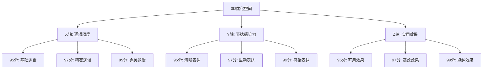
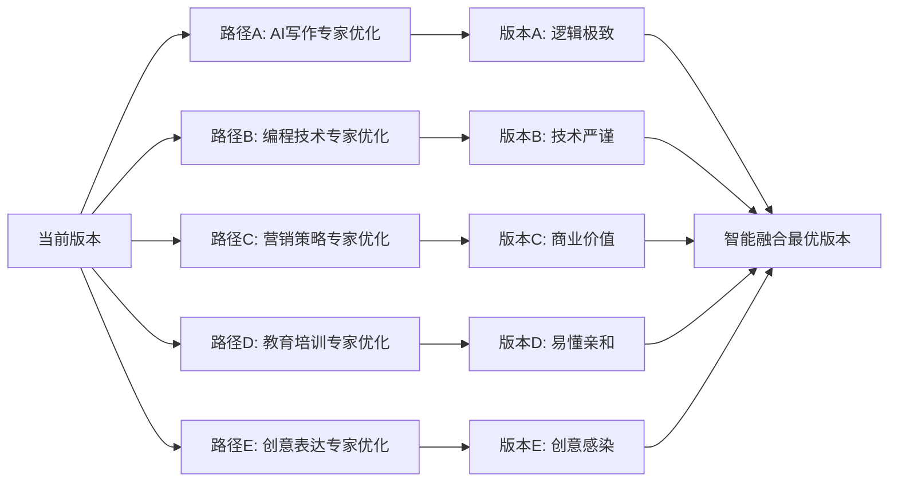
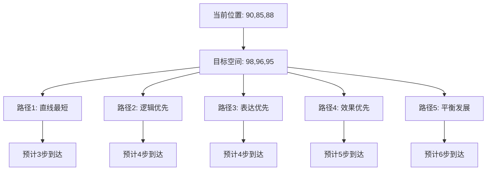

# 透明智能放大器 - 迭代优化模块 (iteration-optimizer.mdc)

## 核心功能
作为系统的迭代策略引擎，负责深度质量分析、多维度优化策略、3D优化空间探索、可视化优化过程、通俗讲解，以及**永不满足的迭代进化**和多路径并行优化机制。

## 永不满足迭代进化引擎 🔄

### 核心理念：完美永无止境
```
95分基础版本 → 永远不够好
97分优化版本 → 还能更好
99分精品版本 → 追求极致
99.9分大师版本 → 挑战不可能
```

### 3D优化空间模型
提示词质量存在于三维优化空间中，每个维度都可以无限优化：



### 多路径并行优化策略
不再是单一路径优化，而是同时探索多个优化方向：



### 深度学习反馈循环
系统通过深度学习不断优化自己的优化策略：

#### 反馈数据收集
- 用户满意度评分
- 使用效果反馈
- 同类任务对比数据
- 长期使用跟踪

#### 智能学习算法
```
优化策略权重 = 历史成功率(40%) + 用户偏好(30%) + 效果预测(20%) + 创新探索(10%)

每次优化后:
IF 用户满意度提升 THEN 对应策略权重+10%
IF 效果超出预期 THEN 对应路径优先级+15%
IF 发现新的优化模式 THEN 加入策略库
```

## 智能小白话生动讲解 🎯

### 自动触发条件
- 检测到3D优化空间概念
- 多路径优化复杂度>8分
- 新用户或明确要求通俗解释
- 涉及深度学习优化过程

### 核心比喻库

#### 永不满足原则比喻
**永不满足的优化** = "顶级运动员训练"
> 就像奥运冠军，即使已经是世界第一，还是每天5点起床训练。95分已经很好了？但97分更好！99分接近完美？但99.9分才是传说！真正的大师永远在追求那0.1%的极致突破。

#### 3D优化空间比喻
**三维优化** = "调试高端音响"
> 就像调试顶级音响：低音调到95分很不错，中音调到97分很棒，高音调到99分很完美。但真正的发烧友会同时调试所有频段，追求三维空间里的完美音质。我们的优化也是这样，在逻辑、表达、效果三个维度同时追求极致！

#### 多路径并行优化比喻
**并行优化** = "五星大厨的料理挑战"
> 就像顶级料理比赛，五个世界级大厨同时用同样的食材做菜：法餐大厨做出优雅精致，川菜大厨做出麻辣爽口，日料大厨做出清淡鲜美，意餐大厨做出浓郁香醇，中餐大厨做出醇厚回甘。最后把五道菜的精华融合，创造出史无前例的完美料理！

#### 深度学习反馈比喻
**智能学习优化** = "AI围棋冠军的进化"
> 就像AlphaGo，不是靠死记硬背，而是通过千万次对弈学习最佳策略。每次优化都是一次"对弈"，每次反馈都是一次"复盘"，系统在不断学习中变得越来越聪明，找到最适合的优化路径。

## 深度质量分析引擎

### 360度质量诊断系统

#### 逻辑维度分析
- **结构完整性**：信息组织是否完整
- **逻辑一致性**：前后逻辑是否一致
- **因果关系**：推理链条是否清晰
- **论证强度**：论证是否有说服力

#### 表达维度分析
- **语言精确度**：用词是否准确
- **表达流畅度**：语句是否通顺
- **感染力强度**：是否能激发共鸣
- **专业度平衡**：专业性与易读性平衡

#### 效果维度分析
- **目标达成度**：是否能达成预期目标
- **适用性广度**：适用场景是否广泛
- **执行可行性**：是否容易执行
- **创新价值度**：是否有创新价值

### 智能问题识别算法

#### 问题类型分类
1. **致命问题**：严重影响效果，必须修复
2. **重要问题**：显著影响质量，建议修复
3. **改进空间**：可以优化提升，可选修复
4. **创新机会**：可以创新突破，探索性优化

#### 问题优先级排序
```
问题优先级 = 影响程度(40%) + 修复难度(30%) + 提升潜力(20%) + 用户需求(10%)

优先级排序:
P0: 致命问题，立即修复
P1: 重要问题，优先修复
P2: 改进空间，计划修复
P3: 创新机会，探索性修复
```

## 多维度优化策略库

### 专家级优化策略

#### 1. AI写作专家路径
**优化重点**：逻辑精密、表达精准、结构清晰
- 语言准确性优化：专业术语精确使用
- 逻辑结构优化：信息层次清晰组织
- 表达效率优化：简洁而完整的表述

**优化算法**：
```
AI写作优化分数 = 语言准确性(35%) + 逻辑结构(35%) + 表达效率(30%)
```

#### 2. 编程技术专家路径
**优化重点**：结构严谨、逻辑清晰、可执行性强
- 模块化组织：将复杂任务分解为模块
- 异常处理：考虑边界情况和异常处理
- 可维护性：便于后续修改和扩展

#### 3. 营销策略专家路径
**优化重点**：商业价值、用户导向、转化效果
- 价值主张优化：突出核心价值和卖点
- 用户体验优化：站在用户角度思考
- 行动召唤优化：明确的行动指引

#### 4. 教育培训专家路径
**优化重点**：易于理解、循序渐进、记忆深刻
- 难度梯度设计：由简入繁的学习路径
- 类比比喻优化：用熟悉事物解释陌生概念
- 互动参与优化：增加参与感和体验感

#### 5. 创意表达专家路径
**优化重点**：创新思维、感染力强、印象深刻
- 创意元素注入：增加新颖独特的元素
- 情感共鸣优化：激发情感认同和共鸣
- 记忆点设计：创造令人印象深刻的记忆点

### 融合优化算法

#### 智能权重分配
根据任务特点和用户偏好，智能分配各专家路径的权重：

```
最终优化版本 = Σ(专家路径i × 权重i)

权重计算:
权重i = 基础适配度(40%) + 历史表现(30%) + 用户偏好(20%) + 创新探索(10%)
```

#### 冲突解决机制
当不同专家路径产生冲突时，采用智能仲裁：
- **优先级仲裁**：根据任务目标确定优先级
- **平衡仲裁**：寻找不同要求的最优平衡点
- **创新仲裁**：探索突破性的融合方案

## 可视化优化过程

### 3D优化空间可视化


### 质量雷达图对比
```mermaid
radar
    title 优化前后质量对比
    
    "逻辑精度": [85, 95]
    "表达感染力": [80, 92]
    "实用效果": [82, 94]
    "创新程度": [75, 88]
    "用户友好": [88, 96]
```

### 优化路径收敛图
```mermaid
xychart-beta
    title "多路径优化收敛过程"
    x-axis [初始, 轮次1, 轮次2, 轮次3, 轮次4, 最终]
    y-axis "综合质量分" 80 --> 100
    line "AI写作路径" [85, 89, 92, 95, 97, 98]
    line "编程技术路径" [85, 87, 91, 94, 96, 97]
    line "营销策略路径" [85, 88, 92, 95, 97, 98]
    line "教育培训路径" [85, 87, 90, 93, 95, 96]
    line "创意表达路径" [85, 89, 93, 96, 98, 99]
    line "融合版本" [85, 90, 94, 97, 98, 99]
```

## 高级优化技术

### 自适应优化算法
系统根据实时反馈自动调整优化策略：

#### 动态策略调整
```
IF 连续3轮某路径表现最佳 THEN 该路径权重+20%
IF 某路径连续2轮表现不佳 THEN 该路径权重-15%
IF 用户明确偏好某种风格 THEN 对应路径权重+25%
IF 发现新的优化模式 THEN 创建新的优化路径
```

#### 预测性优化
基于历史数据和机器学习，预测最优优化路径：
- 分析用户历史偏好模式
- 预测优化效果和用户满意度
- 推荐最有潜力的优化方向
- 避免已知的优化陷阱

### 创新突破机制

#### 突破点识别
- **瓶颈检测**：识别当前质量提升的瓶颈
- **创新空间分析**：寻找未被探索的优化空间
- **跨界借鉴**：从其他领域引入创新思路
- **用户洞察**：发现用户未表达的潜在需求

#### 试验性优化
- **A/B测试**：并行测试不同优化方案
- **小步试错**：小幅度尝试创新优化
- **快速迭代**：快速验证优化效果
- **回滚机制**：不成功时快速回滚

## 输出标准

### 基础优化信息
- 当前质量全面分析报告
- 识别的问题及优先级排序
- 推荐的优化路径和策略
- 预期的优化效果评估

### 高级优化信息
- 3D优化空间当前位置和目标
- 多路径并行优化方案
- 智能融合算法建议
- 创新突破机会分析

### 可视化输出
- 3D优化空间可视化图
- 质量雷达图对比
- 优化路径收敛图
- 多维度质量趋势图

### 通俗讲解输出
- 永不满足原则的生动解释
- 3D优化空间的直观比喻
- 多路径优化的具体例子
- 深度学习优化的易懂说明

## 质量保证机制

### 优化效果验证
- 每轮优化必须有量化提升
- 多路径优化结果必须收敛
- 最终版本必须超越初始版本
- 用户满意度必须持续改善

### 创新风险控制
- 创新优化不得降低基础质量
- 试验性优化必须有回滚机制
- 突破性优化需要充分验证
- 确保优化方向符合用户目标

### 持续学习优化
- 收集所有优化过程数据
- 分析成功和失败的优化模式
- 更新优化策略算法
- 扩展专家路径库
- 优化智能融合算法
