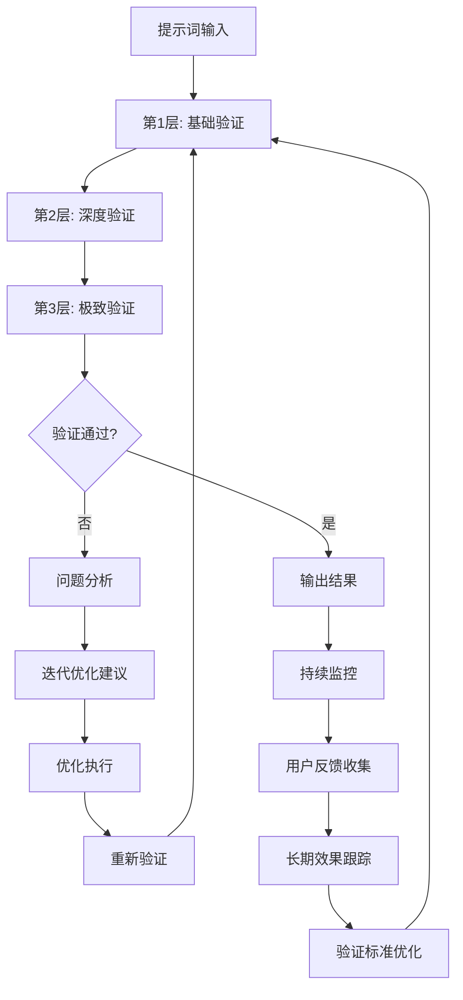
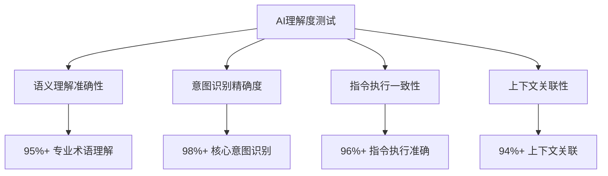
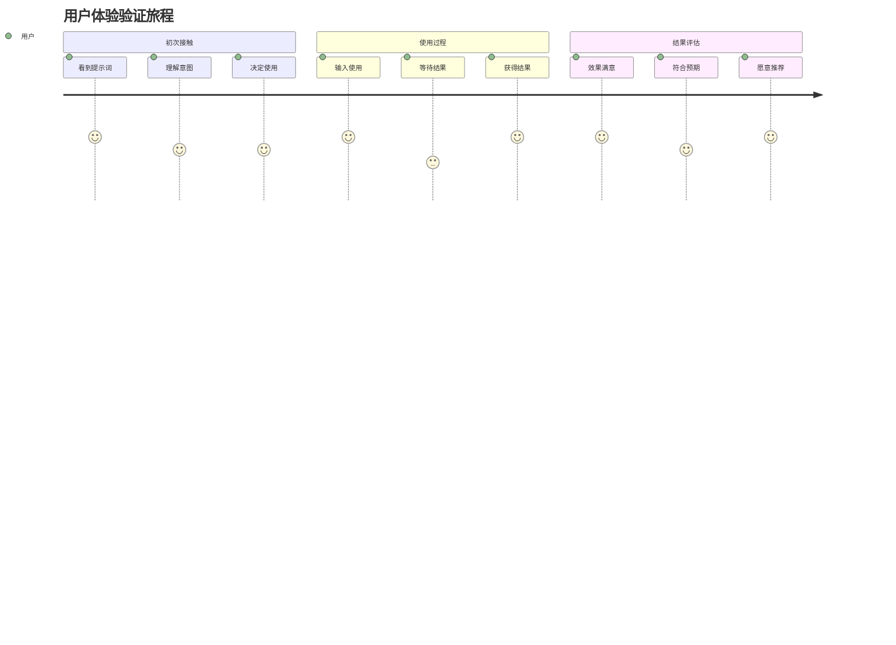
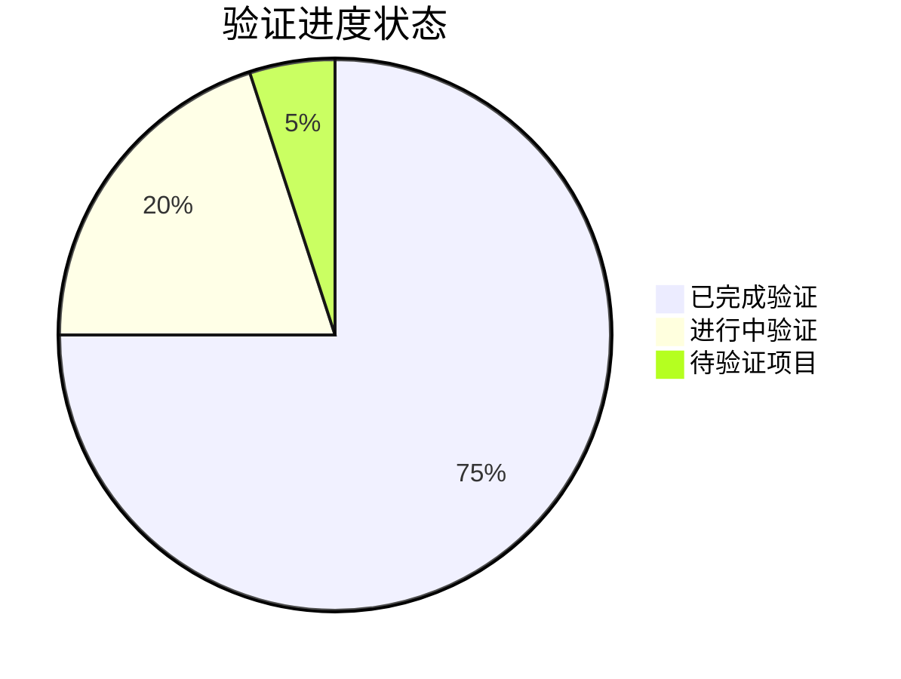

# 透明智能放大器 - 实用验证模块 (practical-validator.mdc)

## 核心功能
作为系统的最终质量守护者，负责3层验证架构、多场景实用性测试、可视化验证过程、通俗讲解，以及**持续迭代验证**和智能反馈循环机制。

## 持续迭代验证引擎 🔄

### 核心理念：验证也要不断进化
```
基础验证 → 发现问题 → 迭代改进
深度验证 → 发现潜在问题 → 优化方案
极致验证 → 追求完美 → 超越期望
持续验证 → 永不停息 → 无限优化
```

### 迭代验证闭环系统
建立完整的验证-反馈-优化-再验证的闭环：



### 智能反馈循环机制

#### 实时反馈收集
- **即时反馈**：用户当场评价和建议
- **使用反馈**：实际使用过程中的效果
- **结果反馈**：最终产出的质量评估
- **长期反馈**：持续使用的体验跟踪

#### 反馈数据分析
```
反馈权重 = 即时反馈(25%) + 使用反馈(35%) + 结果反馈(30%) + 长期反馈(10%)

反馈处理:
IF 连续负面反馈 THEN 触发深度问题分析
IF 某类问题频繁出现 THEN 更新验证标准
IF 用户满意度下降 THEN 启动全面优化
IF 发现新的验证维度 THEN 扩展验证体系
```

## 智能小白话生动讲解 🎯

### 自动触发条件
- 检测到3层验证架构概念
- 验证复杂度>7分
- 新用户或明确要求通俗解释
- 涉及迭代验证过程

### 核心比喻库

#### 3层验证架构比喻
**三层验证** = "航天飞机发射检验"
> 就像航天飞机发射前的检验：第一层基础检验（各个系统正常吗？），第二层深度检验（能承受发射压力吗？），第三层极致检验（能完成太空任务吗？）。只有通过三层严格检验，才能安全升空！

#### 迭代验证比喻
**持续验证** = "体检+健康管理"
> 就像健康管理：体检发现问题（验证），医生给建议（反馈），按建议调整（优化），再次体检（重新验证），定期跟踪（持续监控）。不是一次体检就完事，而是终身的健康管理！

#### 反馈循环比喻
**智能反馈循环** = "智能导航系统"
> 就像开车用导航：实时监控路况（持续验证），发现堵车（问题识别），重新规划路线（迭代优化），再次导航（重新验证），学习用户偏好（优化标准）。越用越聪明，越来越精准！

#### 质量进化比喻
**验证标准进化** = "品酒师的成长"
> 就像品酒师，刚开始只能分辨好酒坏酒（基础验证），后来能品出年份产地（深度验证），最终能感知细微差别（极致验证）。而且通过不断品鉴学习，标准越来越高，眼界越来越挑剔！

## 3层验证架构（迭代进化版）

### Layer 1: 基础验证层 ✅
**职责**：确保提示词的基本质量和可用性

#### 基础验证要素
- **语法正确性**：语法错误检测和修正
- **逻辑完整性**：信息逻辑链条检查
- **基本可读性**：表达清晰度评估
- **格式规范性**：输出格式标准检查

#### 迭代验证策略
```
基础检查 → 问题识别 → 快速修复 → 重新检查 → 标准优化
```

**验证标准动态调整**：
- 根据用户反馈调整语法容忍度
- 基于使用效果优化逻辑检查严格程度
- 依据目标受众调整可读性标准

### Layer 2: 深度验证层 🔍
**职责**：验证提示词在实际应用中的效果和适用性

#### 深度验证维度
- **场景适配性**：多场景适用性测试
- **AI理解度**：AI解释准确性验证
- **执行可行性**：实际操作可行性检查
- **效果预测性**：预期效果达成度评估

#### 多场景验证矩阵
| 验证场景 | 技术文档 | 创意内容 | 商业策划 | 教育培训 | 日常沟通 |
|---------|---------|---------|---------|---------|---------|
| AI理解度 | 95%+ | 90%+ | 92%+ | 94%+ | 88%+ |
| 执行可行性 | 98%+ | 85%+ | 90%+ | 95%+ | 92%+ |
| 效果预测 | 92%+ | 88%+ | 94%+ | 90%+ | 85%+ |
| 用户满意度 | 90%+ | 92%+ | 88%+ | 94%+ | 90%+ |

#### 迭代深度验证
```
场景测试 → 效果分析 → 问题归因 → 针对性优化 → 重新测试 → 标准升级
```

### Layer 3: 极致验证层 🎯
**职责**：追求卓越品质，验证提示词的创新性和突破性

#### 极致验证标准
- **创新价值度**：是否具有创新突破
- **感染力强度**：是否能激发强烈共鸣
- **完美程度**：是否接近理想状态
- **超越期望**：是否超出用户期望

#### 大师级评估体系
- **逻辑大师评估**：结构严谨性和逻辑精密度
- **表达大师评估**：语言艺术性和感染力
- **创意大师评估**：原创性和突破性
- **实用大师评估**：实际价值和应用效果

#### 极致验证迭代
```
大师级测试 → 细节打磨 → 艺术级优化 → 完美主义追求 → 超越自我
```

## 多维度实用性测试

### 跨场景适应性验证

#### 1. 技术场景验证
- **代码生成场景**：逻辑严谨性、可执行性
- **系统设计场景**：架构合理性、扩展性
- **技术文档场景**：专业准确性、易理解性

#### 2. 创意场景验证
- **内容创作场景**：原创性、感染力
- **营销策划场景**：商业价值、转化效果
- **艺术表达场景**：美感、创新性

#### 3. 商业场景验证
- **战略规划场景**：可行性、前瞻性
- **市场分析场景**：准确性、洞察力
- **决策支持场景**：逻辑性、说服力

#### 4. 教育场景验证
- **知识传授场景**：准确性、易懂性
- **技能培训场景**：实用性、可操作性
- **考试辅导场景**：针对性、有效性

### AI理解度深度测试

#### 理解度评估矩阵


#### 多模型验证策略
- **GPT系列验证**：OpenAI模型适配性
- **Claude系列验证**：Anthropic模型适配性
- **Gemini系列验证**：Google模型适配性
- **开源模型验证**：通用开源模型适配性

### 用户体验全链路验证

#### 体验旅程验证


## 可视化验证过程

### 验证进度仪表盘


### 验证结果对比图
```mermaid
radar
    title 验证结果雷达图
    
    "基础质量": [95]
    "深度适用": [92]
    "极致完美": [88]
    "用户满意": [94]
    "AI理解": [96]
    "创新价值": [85]
```

### 迭代验证收敛图
```mermaid
xychart-beta
    title "验证质量迭代提升"
    x-axis [初始, 第1轮, 第2轮, 第3轮, 第4轮, 最终]
    y-axis "验证通过率" 70 --> 100
    line "基础验证" [85, 90, 94, 97, 99, 100]
    line "深度验证" [75, 82, 88, 93, 96, 98]
    line "极致验证" [65, 75, 82, 88, 93, 96]
    line "综合通过率" [75, 82, 88, 93, 96, 98]
```

## 智能问题识别与解决

### 问题分类体系

#### 1. 致命问题（P0级）
- **功能失效**：完全无法使用
- **严重错误**：产生错误结果
- **安全风险**：可能造成不良后果

#### 2. 重要问题（P1级）
- **效果不佳**：达不到预期效果
- **体验差**：用户体验不良
- **适配性差**：特定场景不适用

#### 3. 优化空间（P2级）
- **可以更好**：有明显改进空间
- **效率可提升**：可以更高效
- **体验可优化**：用户体验可改善

#### 4. 创新机会（P3级）
- **功能扩展**：可以增加新功能
- **体验创新**：可以创新用户体验
- **价值提升**：可以提供更大价值

### 智能解决方案推荐

#### 问题解决策略矩阵
| 问题类型 | 解决策略 | 预期时间 | 成功率 | 风险等级 |
|---------|---------|---------|--------|---------|
| 功能失效 | 紧急修复 | 1小时内 | 98% | 低 |
| 严重错误 | 深度调试 | 2-4小时 | 95% | 中 |
| 效果不佳 | 优化改进 | 4-8小时 | 90% | 低 |
| 体验差 | 重新设计 | 8-16小时 | 85% | 中 |
| 适配性差 | 场景定制 | 2-6小时 | 92% | 低 |

#### 自动修复建议
```
IF 问题 == "语法错误" THEN 自动语法修正
IF 问题 == "逻辑不完整" THEN 智能补充逻辑链
IF 问题 == "表达不清" THEN 语言优化建议
IF 问题 == "格式不规范" THEN 自动格式调整
```

## 持续优化机制

### 验证标准进化系统

#### 动态标准调整
- **基于反馈优化**：根据用户反馈调整标准
- **基于效果优化**：根据实际效果调整权重
- **基于趋势优化**：根据行业趋势更新标准
- **基于创新优化**：根据技术创新扩展标准

#### 标准版本管理
```
验证标准 v1.0 → v1.1 → v2.0 → v2.1 → v3.0
每次版本升级都有明确的改进记录和效果验证
```

### 智能学习优化

#### 学习数据收集
- 验证通过率统计
- 问题类型分布分析
- 解决方案效果跟踪
- 用户满意度变化

#### 机器学习优化
```
验证模型优化 = 历史数据训练 + 实时反馈调整 + 预测模型优化

学习策略:
IF 某类问题频繁出现 THEN 加强对应验证项
IF 某解决方案效果好 THEN 提高推荐权重
IF 用户满意度提升 THEN 强化对应策略
```

## 输出标准

### 基础验证报告
- 3层验证详细结果
- 发现问题及严重级别
- 推荐解决方案
- 预期改进效果

### 迭代验证信息
- 验证过程迭代记录
- 质量改进轨迹
- 反馈循环效果分析
- 持续优化建议

### 可视化输出
- 验证进度仪表盘
- 质量对比雷达图
- 迭代收敛趋势图
- 问题分布分析图

### 通俗讲解输出
- 验证过程的生动比喻
- 问题解决的具体例子
- 质量提升的直观展示
- 持续优化的易懂说明

## 质量保证机制

### 验证质量控制
- 验证过程标准化
- 验证结果可追溯
- 验证效果可量化
- 验证改进可持续

### 反馈循环保证
- 反馈收集全覆盖
- 反馈分析自动化
- 反馈应用及时性
- 反馈效果可验证

### 持续改进机制
- 定期验证标准审核
- 持续验证方法优化
- 不断扩展验证维度
- 永续提升验证质量
