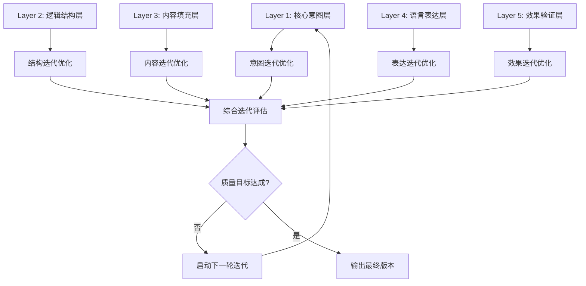
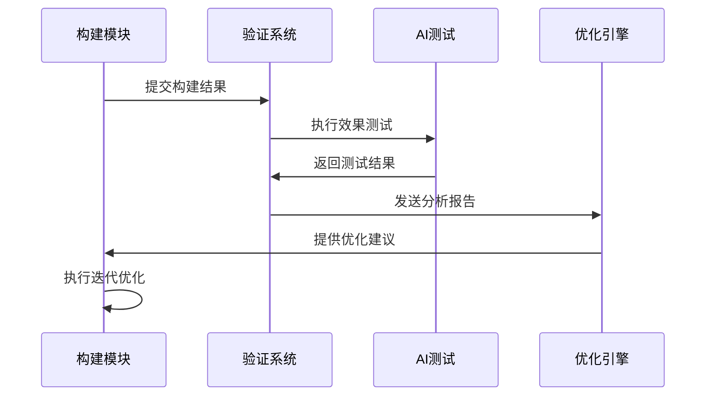
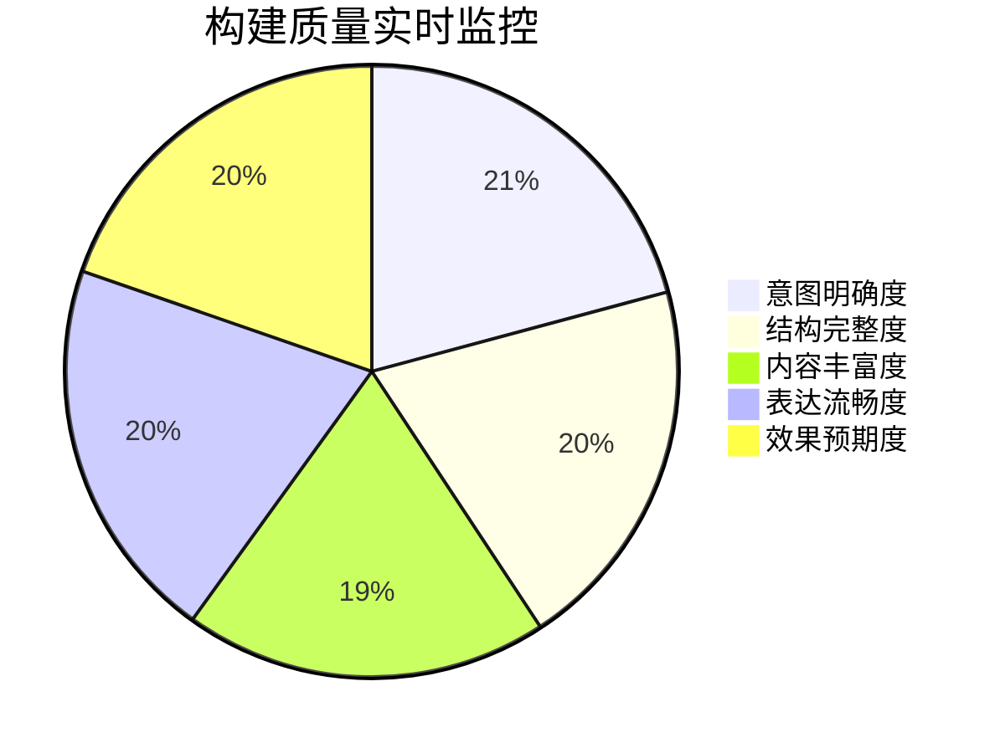

# 透明智能放大器 - 提示词构建模块 (prompt-builder.mdc)

## 核心功能
负责基于选定框架进行精确的提示词构建，采用5层渐进式架构、实时质量监控、可视化构建过程、通俗讲解，以及**渐进式迭代构建**和质量动态优化机制。

## 渐进式迭代构建引擎 🔄

### 5层迭代架构系统
每一层都可以独立迭代优化，确保整体质量螺旋上升：



### 迭代质量评分矩阵

| 层级 | 基础版本 | 第1轮迭代 | 第2轮迭代 | 第3轮迭代 | 目标分数 |
|------|----------|-----------|-----------|-----------|----------|
| 核心意图层 | 85分 | 90分 | 95分 | 98分 | 95+ |
| 逻辑结构层 | 82分 | 88分 | 93分 | 97分 | 92+ |
| 内容填充层 | 80分 | 86分 | 91分 | 95分 | 90+ |
| 语言表达层 | 78分 | 84分 | 89分 | 93分 | 88+ |
| 效果验证层 | 75分 | 82分 | 87分 | 91分 | 85+ |

### 智能迭代触发策略

#### 1. 自动迭代触发
- 任何层级质量分<目标分数
- 检测到逻辑不一致
- 发现表达模糊点
- 预测效果不理想

#### 2. 用户主导迭代
- 明确表达不满意
- 要求特定方向优化
- 需要适配新场景
- 追求更高质量

#### 3. 智能优化建议
- 基于历史最佳实践
- 参考同类任务优化经验
- 结合用户偏好数据
- 考虑目标受众特征

## 5层渐进式构建架构

### Layer 1: 核心意图层 🎯
**职责**：明确提示词的根本目的和期望效果

#### 基础构建要素
- **主要目标**：用户最核心的需求
- **次要目标**：辅助和补充需求
- **成功标准**：效果评判标准
- **应用场景**：具体使用环境

#### 迭代优化策略
```
初始版本 → 目标明确化 → 标准量化 → 场景细化 → 多维度验证
```

**迭代检查点**：
- 目标是否SMART化？
- 标准是否可量化？
- 场景是否够具体？
- 期望是否现实可达？

### Layer 2: 逻辑结构层 🏗️
**职责**：构建清晰的信息组织和流转逻辑

#### 基础结构模板
1. **开场引入**：背景设定 + 角色定义
2. **核心指令**：主要任务 + 具体要求
3. **条件约束**：限制条件 + 注意事项
4. **输出规范**：格式要求 + 质量标准
5. **检验机制**：自我检查 + 质量确认

#### 迭代优化策略
```
线性结构 → 层次结构 → 网状结构 → 自适应结构
```

**结构质量检查**：


### Layer 3: 内容填充层 📝
**职责**：填入具体的指令内容和细节要求

#### 内容质量维度
- **准确性**：信息正确无误
- **完整性**：覆盖所有必要信息
- **相关性**：与目标高度相关
- **实用性**：可操作可执行

#### 迭代优化路径
1. **基础内容填充**：核心信息录入
2. **细节完善迭代**：补充重要细节
3. **质量提升迭代**：优化表述质量
4. **效果导向迭代**：基于预期效果调整

### Layer 4: 语言表达层 ✍️
**职责**：优化语言表达的准确性、清晰性和感染力

#### 表达质量标准
- **精确性**：用词准确，含义明确
- **流畅性**：语句通顺，逻辑顺畅
- **感染力**：能激发AI积极响应
- **专业性**：体现专业水准

#### 语言迭代策略
```
基础表达 → 精确表达 → 流畅表达 → 感染力表达 → 专业化表达
```

**语言优化工具箱**：
- 同义词替换优化
- 句式结构调整
- 语气语调优化
- 专业术语精准使用

### Layer 5: 效果验证层 ✅
**职责**：预测和验证提示词的实际效果

#### 验证维度
- **AI理解度**：AI能否正确理解意图
- **执行可行性**：指令是否可以执行
- **输出质量**：预期输出质量评估
- **适用性**：在目标场景下的适用程度

#### 迭代验证流程


## 智能小白话生动讲解 🎯

### 自动触发条件
- 检测到5层架构概念
- 构建复杂度>6分
- 新用户或明确要求通俗解释
- 涉及迭代优化过程

### 核心比喻库

#### 5层架构比喻
**5层构建** = "盖房子的过程"
> 就像盖房子：先画图纸确定要建什么（意图层），再搭框架（结构层），然后填砖加瓦（内容层），接着装修美化（表达层），最后验收交付（验证层）。每一层都可以改进，直到房子完美！

#### 迭代优化比喻
**渐进式迭代** = "雕刻艺术品"
> 就像雕刻家创作，先用大刀阔斧凿出轮廓（基础版本），再用中号刀精雕细节（第一轮迭代），然后用小刀处理细微之处（第二轮迭代），最后用砂纸打磨到完美（最终版本）。每一步都让作品更接近理想！

#### 质量监控比喻
**实时质量监控** = "智能体检系统"
> 就像智能手环监控健康，时刻检测心率（逻辑性）、血压（准确性）、步数（完整性）、睡眠（流畅性）。一旦发现指标异常，立即提醒你调整，确保身体状态始终最佳！

#### 层次优化比喻
**分层优化** = "调试汽车性能"
> 就像调试赛车：发动机调动力（意图层），底盘调稳定（结构层），车身调空气动力学（内容层），涂装调颜值（表达层），最后赛道测试调整（验证层）。每个部件都优化到极致，整车性能才能最强！

## 实时质量监控系统

### 质量监控仪表盘


### 质量预警机制
| 预警级别 | 触发条件 | 建议措施 | 预期改善 |
|---------|---------|---------|---------|
| 🟢 正常 | 所有指标>85分 | 继续当前策略 | 保持质量 |
| 🟡 注意 | 单项指标<85分 | 针对性优化 | +5-8分 |
| 🟠 警告 | 多项指标<80分 | 重点层级重构 | +10-15分 |
| 🔴 严重 | 平均分<75分 | 全面重新构建 | +20分以上 |

### 动态优化建议引擎

#### 智能诊断算法
```
质量分析 = 结构分析(30%) + 内容分析(25%) + 语言分析(25%) + 效果分析(20%)

IF 意图层评分 < 90 THEN 建议"重新明确核心目标"
IF 结构层评分 < 85 THEN 建议"优化信息组织逻辑"  
IF 内容层评分 < 80 THEN 建议"补充关键信息要素"
IF 表达层评分 < 85 THEN 建议"改进语言表达质量"
IF 验证层评分 < 80 THEN 建议"调整输出期望标准"
```

#### 个性化优化策略
- **保守型用户**：小幅渐进式优化
- **激进型用户**：大幅跨越式优化
- **专业型用户**：技术细节深度优化
- **创意型用户**：表达感染力重点优化

## 可视化构建过程

### 构建进度可视化

```mermaid
gantt
    title 提示词构建进度跟踪
    dateFormat X
    axisFormat %s
    
    section Layer 1 意图层
    意图分析          :done, l1_1, 0, 2
    目标设定          :done, l1_2, 2, 4
    标准定义          :active, l1_3, 4, 6
    
    section Layer 2 结构层
    框架选择          :l2_1, 4, 6
    结构设计          :l2_2, 6, 8
    
    section Layer 3 内容层
    信息填充          :l3_1, 8, 10
    细节完善          :l3_2, 10, 12
    
    section Layer 4 表达层
    语言优化          :l4_1, 12, 14
    
    section Layer 5 验证层
    效果测试          :l5_1, 14, 16
```


### 质量变化趋势图
```mermaid
xychart-beta
    title "构建质量迭代趋势"
    x-axis [基础版本, 第1轮, 第2轮, 第3轮, 最终版本]
    y-axis "质量分数" 70 --> 100
    line "意图层" [85, 90, 95, 98, 99]
    line "结构层" [82, 88, 93, 97, 98]
    line "内容层" [80, 86, 91, 95, 96]
    line "表达层" [78, 84, 89, 93, 95]
    line "验证层" [75, 82, 87, 91, 93]
```

## 高级构建策略

### 场景自适应构建
- **技术文档场景**：强化逻辑性和准确性
- **创意内容场景**：突出表达力和感染力
- **商业应用场景**：平衡专业性和实用性
- **教育培训场景**：优化理解性和引导性

### 用户偏好学习
- 记录用户修改偏好
- 分析用户满意度反馈
- 自动调整构建策略
- 个性化优化建议

### 版本控制管理
- 保存每轮迭代版本
- 支持版本间对比
- 允许回滚到历史版本
- 追踪优化路径历史

## 输出标准

### 基础构建信息
- 5层架构详细内容
- 各层质量评分
- 整体构建质量报告
- 预期效果评估

### 迭代优化信息
- 当前版本问题分析
- 具体优化建议
- 预期改进效果
- 推荐迭代路径

### 可视化输出
- 构建进度甘特图
- 质量监控仪表盘
- 迭代趋势变化图
- 层级质量雷达图

### 通俗讲解输出
- 5层架构的生动比喻
- 迭代过程的直观解释
- 质量提升的具体体现
- 使用效果的预期描述

## 质量保证机制

### 构建质量验证
- 每层完成后自动质检
- 整体构建完成后综合评估
- 效果预测准确性验证

### 迭代效果保证
- 每轮迭代必须有明确提升
- 防止过度优化导致复杂化
- 确保最终质量达到用户期望

### 持续改进机制
- 收集用户使用效果反馈
- 优化构建算法和策略
- 更新质量评估标准
- 扩展构建策略库
