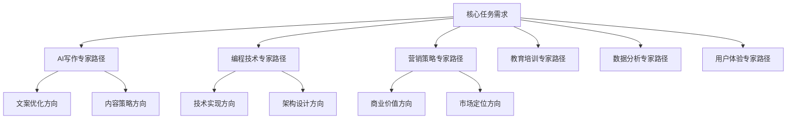
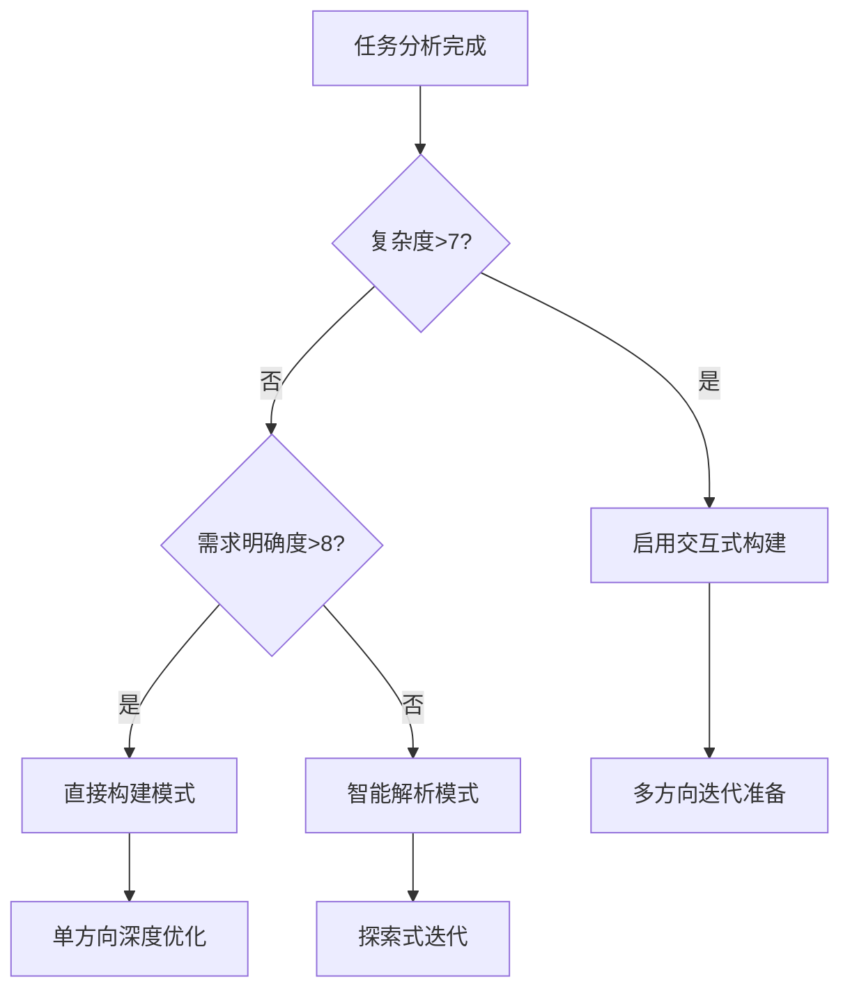
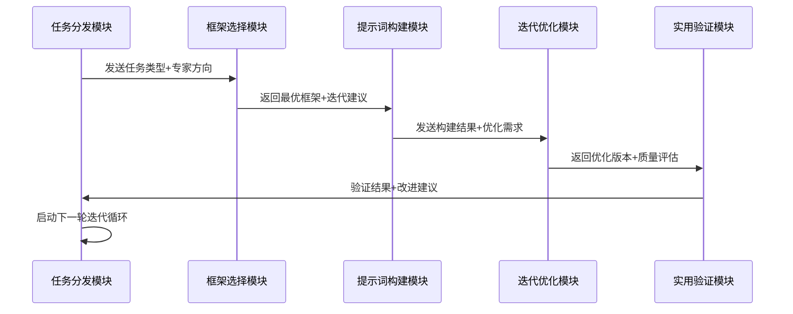
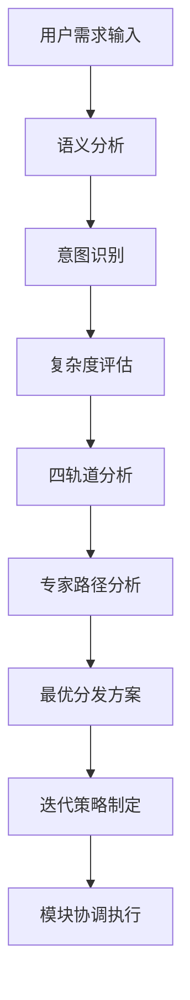

# 透明智能放大器 - 任务分发模块 (task-dispatcher.mdc)

## 核心功能
负责深度分析用户需求，进行精准的任务分类和智能分发，提供4轨道评估体系、可视化分析图表、通俗讲解，以及**多方向迭代路径分析**和专家级演化策略。

## 迭代路径分析引擎 🔄

### 任务演化矩阵
基于同一核心需求，分析向不同专家方向演化的可能性：



### 专家路径特征分析表

| 专家类型 | 优势特征 | 适用场景 | 预期提升点 | 风险评估 |
|---------|---------|---------|-----------|---------|
| AI写作专家 | 精准表达、逻辑清晰 | 内容创作、文案优化 | 语言质量+25% | 可能过于规范化 |
| 编程技术专家 | 逻辑严谨、结构化强 | 技术文档、系统设计 | 逻辑性+30% | 可能过于技术化 |
| 营销策略专家 | 商业敏锐、用户导向 | 推广文案、商业计划 | 转化率+40% | 可能过于商业化 |
| 教育培训专家 | 易于理解、循序渐进 | 教学内容、知识传授 | 理解度+35% | 可能过于简化 |
| 数据分析专家 | 数据驱动、量化思维 | 分析报告、决策支持 | 精确度+45% | 可能缺乏感性 |
| 用户体验专家 | 用户友好、体验优先 | 产品文档、交互设计 | 易用性+50% | 可能牺牲功能性 |

### 迭代方向选择策略

#### 1. 智能推荐算法
```
IF 任务类型 == "内容创作" THEN
    推荐权重: AI写作专家(40%) > 营销策略专家(30%) > 教育培训专家(20%) > 其他(10%)
    
IF 任务类型 == "技术文档" THEN  
    推荐权重: 编程技术专家(50%) > 用户体验专家(25%) > 教育培训专家(15%) > 其他(10%)
    
IF 任务类型 == "商业策划" THEN
    推荐权重: 营销策略专家(45%) > 数据分析专家(25%) > AI写作专家(20%) > 其他(10%)
```

#### 2. A/B测试路径设计
- **路径A**: 选择最高权重专家方向深度优化
- **路径B**: 选择次高权重专家方向对比优化  
- **路径C**: 混合型专家路径（融合2-3个专家优势）

## 深度任务分析引擎

### 四轨道评估体系

#### 轨道1：需求复杂度分析 📊
**评估维度**：
- 任务层次性（1-10分）
- 技术难度（1-10分）  
- 创意要求（1-10分）
- 时效性要求（1-10分）

**可视化输出**：
```mermaid
radar
    title 需求复杂度雷达图
    
    "任务层次性": [8]
    "技术难度": [6]
    "创意要求": [9]
    "时效性要求": [7]
```

#### 轨道2：资源匹配度分析 🎯
**评估内容**：
- 框架选择匹配度
- 模块调用优先级
- 处理时间预估
- 质量目标设定

**四象限分析表**：
| 高匹配度+简单任务 | 高匹配度+复杂任务 |
|------------------|------------------|
| 快速直接构建 | 分步精确构建 |
| **低匹配度+简单任务** | **低匹配度+复杂任务** |
| 轻量化调整后构建 | 深度定制化构建 |

#### 轨道3：用户期望值分析 💡  
**分析重点**：
- 质量期望水平
- 个性化程度要求
- 使用场景特殊性
- 后续迭代期望

#### 轨道4：最优路径规划 🚀
**路径选择决策树**：


## 智能小白话生动讲解 🎯

### 自动触发机制
- 检测到专业术语>5个
- 任务分析复杂度>6分
- 新用户或明确要求通俗解释

### 核心比喻库

#### 任务分发比喻
**四轨道评估** = "全面体检"
> 就像去医院体检，要做血常规（需求分析）、心电图（资源匹配）、X光（期望分析）、CT扫描（路径规划）。只有全面检查，才能制定最合适的治疗方案。

#### 迭代路径比喻  
**多方向探索** = "烹饪同一道菜的不同大师"
> 同样是做鱼，日料大师会做成刺身（AI写作的精准），川菜大师会做成水煮鱼（营销的热烈），法餐大师会做成香煎鲈鱼（技术的精致），家常大师会做成红烧鱼（教育的亲切）。每种做法都有独特的美味！

**A/B测试路径** = "试穿不同风格的衣服"
> 就像买衣服，同样一个人，穿商务装显得专业（技术专家路径），穿休闲装显得亲和（教育专家路径），穿时尚装显得有活力（营销专家路径）。我们让你试穿不同"专家风格"，选择最适合的那一套！

#### 资源匹配比喻
**四象限分析** = "选择交通工具"
> 去目的地有很多方式：走路（简单+低匹配）、骑车（简单+高匹配）、开车（复杂+高匹配）、坐飞机（复杂+低匹配但要到很远的地方）。我们帮你选最合适的"交通工具"到达你的目标！

## 任务分类决策引擎

### 基础分类体系
1. **内容创作类**
   - 文章写作
   - 创意策划  
   - 剧本对话
   - 营销文案

2. **技术支持类**
   - 代码生成
   - 技术文档
   - 系统设计
   - 问题诊断

3. **分析决策类**
   - 数据分析
   - 市场研究
   - 战略规划
   - 风险评估

4. **教育培训类**
   - 课程设计
   - 知识讲解
   - 技能培训
   - 考试准备

### 动态分类调整
- 根据用户反馈优化分类精度
- 基于历史数据改进分类算法
- 支持自定义分类标准

### 迭代分类优化
- **初始分类**：基于关键词和语义分析
- **深度分类**：结合用户画像和使用场景
- **精准分类**：融合反馈数据和效果评估

## 智能分发策略

### 模块优先级算法
```
优先级分数 = 任务匹配度 × 40% + 模块性能 × 30% + 预期效果 × 20% + 资源成本 × 10%
```

### 分发决策表
| 任务类型 | 主要模块 | 辅助模块 | 迭代重点 | 期望提升 |
|---------|---------|---------|---------|---------|
| 创意写作 | prompt-builder | framework-selector | 创意+逻辑平衡 | 原创性+40% |
| 技术文档 | framework-selector | iteration-optimizer | 准确性+易读性 | 专业度+35% |
| 营销策划 | task-dispatcher | practical-validator | 商业价值突出 | 转化率+50% |
| 教育内容 | prompt-builder | practical-validator | 易懂+深度兼顾 | 理解度+45% |

### 协同工作流程


## 可视化分析图表

### 任务分析流程图


### 专家路径对比表
| 评估指标 | AI写作 | 编程技术 | 营销策略 | 教育培训 | 数据分析 | 用户体验 |
|---------|--------|----------|----------|----------|----------|----------|
| 逻辑严谨性 | 8/10 | 10/10 | 7/10 | 8/10 | 9/10 | 6/10 |
| 创意表达 | 9/10 | 5/10 | 10/10 | 7/10 | 4/10 | 8/10 |
| 用户友好 | 7/10 | 4/10 | 8/10 | 10/10 | 5/10 | 10/10 |
| 商业价值 | 6/10 | 7/10 | 10/10 | 6/10 | 8/10 | 7/10 |
| 技术深度 | 5/10 | 10/10 | 4/10 | 6/10 | 9/10 | 6/10 |

## 输出标准

### 基础分发信息
- 任务分类结果及置信度
- 四轨道评估详细分数
- 推荐的模块调用序列
- 预计处理时间和质量目标

### 迭代路径信息
- 6个专家方向的适用性分析
- 推荐的前3个迭代方向
- 每个方向的预期效果和风险
- A/B测试对比方案

### 可视化内容
- 需求复杂度雷达图
- 任务分发流程图  
- 专家路径对比表
- 资源匹配四象限图

### 通俗讲解内容
- 根据复杂度自动提供比喻解释
- 确保技术概念的易理解性
- 提供具体的应用场景例子

## 质量保证机制

### 分发准确性验证
- 任务分类准确率>95%
- 模块匹配度>90%
- 用户满意度反馈跟踪

### 迭代路径质量控制
- 确保每个专家方向的独特性
- 验证预期提升的可实现性
- 监控迭代收敛效果

### 持续优化机制
- 收集用户选择偏好数据
- 优化专家路径推荐算法
- 更新任务分类模型
description:
globs:
alwaysApply: false
---
