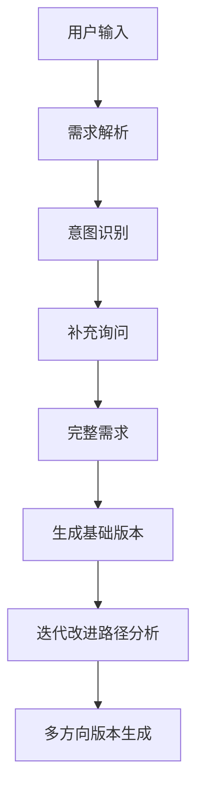
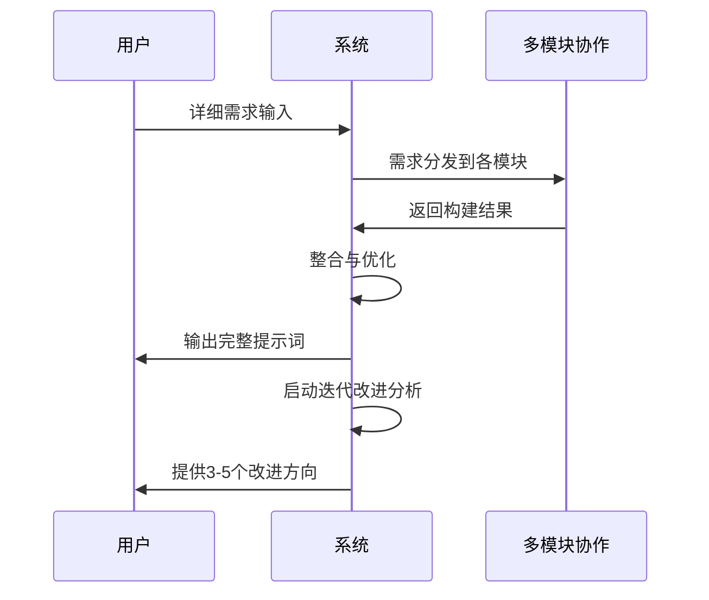
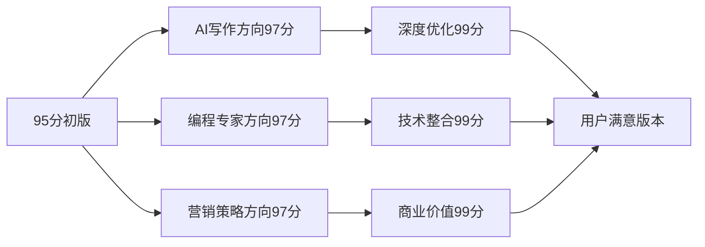

# 透明智能放大器 - 提示词创建模块 (prompt-create-workflow.mdc)

## 核心功能
作为智能提示词生成系统的核心入口，负责理解用户需求、智能模式选择、自动图表生成、通俗讲解和**迭代改进策略**的统一调度。

## 迭代改进策略核心 🔄
### 核心理念："完美来自迭代，而非一次性创造"

#### 1. 永不满足原则
```
初始创建 → 95分基础版本
第一轮迭代 → 97分专业版本  
第二轮迭代 → 99分精品版本
持续迭代 → 用户完全满意
```

#### 2. 多方向探索机制
- **方向分岔策略**：同一需求演化出不同专家路径
  - AI写作专家方向 ↗️
  - 编程技术专家方向 ↘️  
  - 营销策略专家方向 ↙️
  - 教育培训专家方向 ↖️

#### 3. 迭代触发条件
- 自动触发：初始结果≤98分
- 用户触发：明确表达需要改进
- 智能触发：检测到使用场景变化
- 主动触发：系统推荐更优路径

## 智能模式选择引擎

### 模式一：智能解析模式（默认推荐）
**触发条件**：
- 用户描述较为简洁（<100字）
- 需求表述不够具体
- 首次使用系统

**处理流程**：


**可视化配置**：
- 自动生成需求分析流程图
- 创建意图识别决策树
- 输出补充问题表格

### 模式二：直接构建模式
**触发条件**：
- 用户需求描述详细（>200字）
- 包含明确的使用场景
- 技术用户偏好

**处理流程**：


**迭代改进自动分析**：
- 分析当前版本可改进点
- 生成不同专家角度的优化建议
- 提供A/B测试方案

### 模式三：交互式构建模式
**触发条件**：
- 复杂多层次需求
- 用户偏好逐步完善
- 创意类项目

**特色功能**：
- 逐步引导式对话
- 实时可视化需求构建
- 动态调整构建策略

## 智能小白话生动讲解 🎯

### 自动触发条件
- 检测到复杂度≥7分的内容
- 术语密度>30%
- 新用户标识
- 用户明确要求通俗解释

### 核心比喻库

#### 模式选择比喻
**智能解析模式** = "医生问诊"
> 就像看病一样，医生先问症状，再做检查，最后开药方。我们先了解你的需求症状，再深入诊断，最后给出最适合的提示词药方。而且，好医生会跟踪治疗效果，不断调整药方直到完全康复！

**直接构建模式** = "专业定制"  
> 就像找裁缝做衣服，你已经知道要什么款式、颜色、尺寸，直接告诉裁缝就行。我们根据你的详细要求，直接制作专属提示词。然后像好裁缝一样，会主动建议"这里改一下会更合身"。

**交互式构建模式** = "盖房子"
> 就像盖房子，先确定地基（核心需求），再建框架（主要功能），最后装修（细节优化）。每一步都可以调整，确保最终的房子完全符合你的期望。而且，好建筑师会持续关注房子的使用情况，提出改进建议。

#### 迭代改进比喻
**永不满足原则** = "追求完美的厨师"
> 就像一个顶级厨师，即使菜品已经很好吃了，但还会想：调料再加一点点会不会更香？火候再精确一点会不会更嫩？真正的大师永远在追求那最后的1%完美。

**多方向探索** = "同一道菜的不同做法"
> 就像番茄炒蛋，川菜师傅做得香辣，粤菜师傅做得清淡，西餐师傅加了芝士。同一个需求，AI写作专家有AI的精准，编程专家有技术的严谨，营销专家有商业的敏锐。我们让你看到所有可能性！

## 自动可视化生成

### 流程图自动生成
- 根据选择的模式自动生成对应流程图
- 支持Mermaid格式输出
- 可根据复杂度调整图表详细程度

### 数据表格自动生成  
- 需求分析对比表
- 模式选择决策表
- 预期效果评估表

### 迭代改进可视化


## 输出标准

### 基础信息输出
- 选定模式及原因说明
- 预计处理时间和步骤
- 后续模块调用计划

### 迭代改进输出
- 当前版本评分分析
- 3-5个具体改进方向
- 每个方向的预期提升点
- 建议的迭代顺序

### 可视化输出
- 处理流程图（Mermaid格式）
- 需求分析表格
- 模式对比表格

### 通俗讲解输出
- 自动检测是否需要通俗解释
- 提供生动比喻和例子
- 确保技术内容的易理解性

## 与其他模块协作

### 数据传递格式
```json
{
  "user_input": "用户原始输入",
  "selected_mode": "选定模式",
  "complexity_score": "复杂度评分",
  "need_explanation": "是否需要通俗讲解",
  "visualization_config": "可视化配置",
  "iteration_strategy": {
    "current_score": "当前版本评分",
    "improvement_directions": ["改进方向1", "改进方向2"],
    "target_expertise": "目标专家类型"
  }
}
```

### 模块调用顺序
1. @.cursor/rules/prompt-create/prompt-create-task-dispatcher.md（任务分发）
2. @.cursor/rules/prompt-create/prompt-create-framework-selector.md（框架选择）
3. @.cursor/rules/prompt-create/prompt-create-prompt-builder.md（提示词构建）
4. @.cursor/rules/prompt-create/prompt-create-iteration-optimizer.md（迭代优化）
5. @.cursor/rules/prompt-create/prompt-create-practical-validator.md（实用验证）

### 迭代循环调用
- 完成一轮构建后，自动分析改进空间
- 提供多个专家方向的迭代选项
- 支持用户选择特定方向进行深度迭代
- 每轮迭代都包含可视化进度展示

## 质量保证

### 自动质量检测
- 模式选择准确性验证
- 输出格式标准化检查
- 可视化内容完整性验证

### 迭代质量控制
- 每轮迭代必须有明确提升
- 保证不同方向的差异化
- 确保最终收敛到用户满意

### 用户反馈机制
- 实时收集用户满意度
- 根据反馈调整迭代策略
- 优化后续相似需求的处理