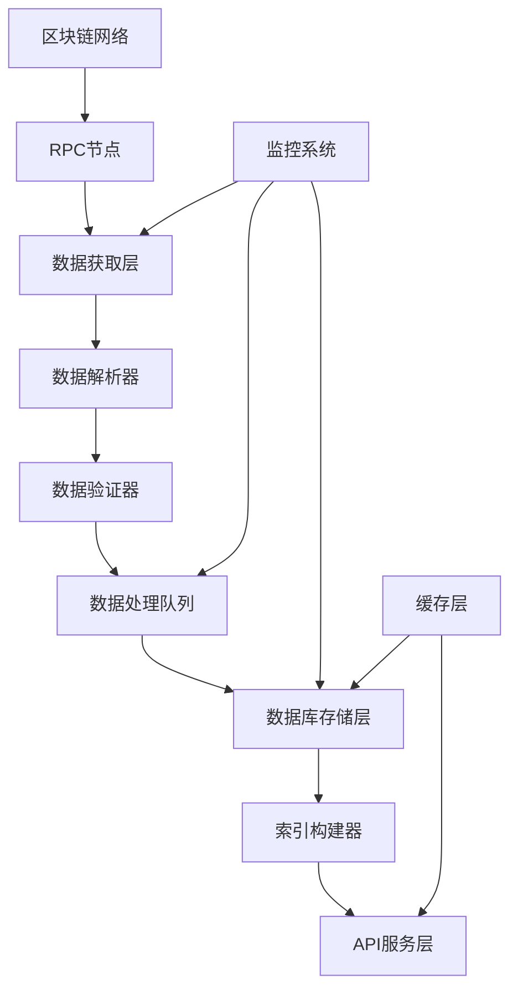

# 🔄 区块链数据同步指南

## 📋 概述

区块链数据同步是 Web3 应用的核心功能之一，本指南详细介绍如何使用 Go 语言构建高性能、可靠的区块链数据同步系统，包括实时数据同步、历史数据回填、数据完整性检查等关键技术。

## 🏗️ 同步架构设计

### 系统架构图



### 核心组件

| 组件 | 职责 | 技术选型 |
|------|------|----------|
| 数据获取层 | 从RPC节点获取原始区块数据 | go-ethereum, WebSocket |
| 数据解析器 | 解析区块、交易、事件数据 | ABI解析, 事件过滤 |
| 数据验证器 | 验证数据完整性和一致性 | 哈希验证, 链式验证 |
| 处理队列 | 异步处理和批量操作 | Channel, Worker Pool |
| 存储层 | 持久化存储和索引 | MySQL, 分区表 |

## 🔧 同步器实现

### 1. 基础同步器

```go
package sync

import (
    "context"
    "fmt"
    "math/big"
    "sync"
    "time"
    
    "github.com/ethereum/go-ethereum/core/types"
    "go.uber.org/zap"
)

// 同步器状态
type SyncStatus int

const (
    StatusStopped SyncStatus = iota
    StatusStarting
    StatusSyncing
    StatusCaughtUp
    StatusError
)

// 同步器接口
type Synchronizer interface {
    Start(ctx context.Context) error
    Stop() error
    GetStatus() SyncStatus
    GetProgress() *SyncProgress
}

// 同步进度
type SyncProgress struct {
    CurrentBlock   uint64    `json:"current_block"`
    LatestBlock    uint64    `json:"latest_block"`
    SyncedBlocks   uint64    `json:"synced_blocks"`
    StartTime      time.Time `json:"start_time"`
    BlocksPerSec   float64   `json:"blocks_per_sec"`
    EstimatedTime  string    `json:"estimated_time"`
}

// 主同步器
type MainSynchronizer struct {
    client       EthereumClient
    storage      StorageInterface
    config       *SyncConfig
    logger       *zap.Logger
    
    // 状态管理
    mu           sync.RWMutex
    status       SyncStatus
    progress     *SyncProgress
    
    // 控制通道
    stopCh       chan struct{}
    errorCh      chan error
    
    // 工作队列
    blockQueue   chan uint64
    resultQueue  chan *BlockResult
    
    // Worker 池
    workers      []*SyncWorker
    workerWg     sync.WaitGroup
}

type SyncConfig struct {
    StartBlock     uint64        `yaml:"start_block"`
    EndBlock       uint64        `yaml:"end_block"`       // 0 表示持续同步
    BatchSize      int           `yaml:"batch_size"`
    WorkerCount    int           `yaml:"worker_count"`
    QueueSize      int           `yaml:"queue_size"`
    SyncInterval   time.Duration `yaml:"sync_interval"`
    RetryLimit     int           `yaml:"retry_limit"`
    RetryDelay     time.Duration `yaml:"retry_delay"`
    ProgressReport time.Duration `yaml:"progress_report"`
}

func NewMainSynchronizer(
    client EthereumClient,
    storage StorageInterface,
    config *SyncConfig,
    logger *zap.Logger,
) *MainSynchronizer {
    return &MainSynchronizer{
        client:      client,
        storage:     storage,
        config:      config,
        logger:      logger,
        status:      StatusStopped,
        stopCh:      make(chan struct{}),
        errorCh:     make(chan error, 10),
        blockQueue:  make(chan uint64, config.QueueSize),
        resultQueue: make(chan *BlockResult, config.QueueSize),
        progress: &SyncProgress{
            StartTime: time.Now(),
        },
    }
}

func (s *MainSynchronizer) Start(ctx context.Context) error {
    s.mu.Lock()
    if s.status != StatusStopped {
        s.mu.Unlock()
        return fmt.Errorf("同步器已在运行，当前状态: %v", s.status)
    }
    s.status = StatusStarting
    s.mu.Unlock()
    
    s.logger.Info("启动区块链数据同步器", 
        zap.Uint64("start_block", s.config.StartBlock),
        zap.Int("worker_count", s.config.WorkerCount),
    )
    
    // 获取当前同步进度
    if err := s.loadProgress(ctx); err != nil {
        s.setStatus(StatusError)
        return fmt.Errorf("加载同步进度失败: %w", err)
    }
    
    // 启动工作协程
    s.startWorkers(ctx)
    
    // 启动结果处理协程
    go s.resultProcessor(ctx)
    
    // 启动进度报告协程
    go s.progressReporter(ctx)
    
    // 启动主同步循环
    go s.syncLoop(ctx)
    
    s.setStatus(StatusSyncing)
    return nil
}

func (s *MainSynchronizer) Stop() error {
    s.mu.Lock()
    if s.status == StatusStopped {
        s.mu.Unlock()
        return nil
    }
    s.mu.Unlock()
    
    s.logger.Info("停止区块链数据同步器")
    
    // 发送停止信号
    close(s.stopCh)
    
    // 等待所有工作协程结束
    s.workerWg.Wait()
    
    // 关闭通道
    close(s.blockQueue)
    close(s.resultQueue)
    
    s.setStatus(StatusStopped)
    s.logger.Info("区块链数据同步器已停止")
    
    return nil
}

func (s *MainSynchronizer) setStatus(status SyncStatus) {
    s.mu.Lock()
    s.status = status
    s.mu.Unlock()
}

func (s *MainSynchronizer) GetStatus() SyncStatus {
    s.mu.RLock()
    defer s.mu.RUnlock()
    return s.status
}

func (s *MainSynchronizer) GetProgress() *SyncProgress {
    s.mu.RLock()
    defer s.mu.RUnlock()
    
    // 复制进度信息
    progress := *s.progress
    return &progress
}

// 加载同步进度
func (s *MainSynchronizer) loadProgress(ctx context.Context) error {
    lastBlock, err := s.storage.GetLastSyncedBlock(ctx)
    if err != nil {
        // 如果没有同步记录，从配置的起始块开始
        s.progress.CurrentBlock = s.config.StartBlock
        s.logger.Info("从配置的起始块开始同步", zap.Uint64("start_block", s.config.StartBlock))
        return nil
    }
    
    s.progress.CurrentBlock = lastBlock + 1
    s.logger.Info("从上次同步位置继续", zap.Uint64("last_synced", lastBlock))
    return nil
}

// 启动工作协程
func (s *MainSynchronizer) startWorkers(ctx context.Context) {
    s.workers = make([]*SyncWorker, s.config.WorkerCount)
    
    for i := 0; i < s.config.WorkerCount; i++ {
        worker := NewSyncWorker(
            i,
            s.client,
            s.blockQueue,
            s.resultQueue,
            s.logger,
        )
        
        s.workers[i] = worker
        s.workerWg.Add(1)
        go worker.Start(ctx, &s.workerWg)
    }
    
    s.logger.Info("启动同步工作协程", zap.Int("worker_count", s.config.WorkerCount))
}

// 主同步循环
func (s *MainSynchronizer) syncLoop(ctx context.Context) {
    ticker := time.NewTicker(s.config.SyncInterval)
    defer ticker.Stop()
    
    for {
        select {
        case <-ctx.Done():
            return
        case <-s.stopCh:
            return
        case <-ticker.C:
            if err := s.scheduleSyncBlocks(ctx); err != nil {
                s.logger.Error("调度同步块失败", zap.Error(err))
                s.errorCh <- err
            }
        case err := <-s.errorCh:
            s.logger.Error("同步过程中出现错误", zap.Error(err))
            // 根据错误类型决定是否继续同步
            if s.isFatalError(err) {
                s.setStatus(StatusError)
                return
            }
        }
    }
}

// 调度同步块
func (s *MainSynchronizer) scheduleSyncBlocks(ctx context.Context) error {
    // 获取最新区块号
    latestBlock, err := s.client.GetLatestBlockNumber(ctx)
    if err != nil {
        return fmt.Errorf("获取最新区块号失败: %w", err)
    }
    
    s.mu.Lock()
    s.progress.LatestBlock = latestBlock
    currentBlock := s.progress.CurrentBlock
    s.mu.Unlock()
    
    // 检查是否已经同步到最新
    if currentBlock >= latestBlock {
        if s.status != StatusCaughtUp {
            s.setStatus(StatusCaughtUp)
            s.logger.Info("已同步到最新区块", zap.Uint64("latest_block", latestBlock))
        }
        return nil
    }
    
    // 计算需要同步的区块范围
    endBlock := currentBlock + uint64(s.config.BatchSize) - 1
    if endBlock > latestBlock {
        endBlock = latestBlock
    }
    
    // 如果设置了结束区块，不超过该区块
    if s.config.EndBlock > 0 && endBlock > s.config.EndBlock {
        endBlock = s.config.EndBlock
    }
    
    // 将区块号添加到队列
    for blockNum := currentBlock; blockNum <= endBlock; blockNum++ {
        select {
        case s.blockQueue <- blockNum:
        case <-ctx.Done():
            return ctx.Err()
        case <-s.stopCh:
            return nil
        }
    }
    
    s.logger.Debug("调度同步块",
        zap.Uint64("from", currentBlock),
        zap.Uint64("to", endBlock),
        zap.Uint64("latest", latestBlock),
    )
    
    return nil
}

// 结果处理器
func (s *MainSynchronizer) resultProcessor(ctx context.Context) {
    batchResults := make([]*BlockResult, 0, s.config.BatchSize)
    batchTimer := time.NewTicker(time.Second * 5) // 批量处理间隔
    defer batchTimer.Stop()
    
    for {
        select {
        case <-ctx.Done():
            return
        case <-s.stopCh:
            return
        case result := <-s.resultQueue:
            if result.Error != nil {
                s.logger.Error("区块处理失败",
                    zap.Uint64("block_number", result.BlockNumber),
                    zap.Error(result.Error),
                )
                // 重新加入队列进行重试
                s.requeueBlock(result.BlockNumber)
                continue
            }
            
            batchResults = append(batchResults, result)
            
            // 批量达到限制或定时触发
            if len(batchResults) >= s.config.BatchSize {
                s.processBatch(ctx, batchResults)
                batchResults = batchResults[:0] // 重置切片
            }
            
        case <-batchTimer.C:
            if len(batchResults) > 0 {
                s.processBatch(ctx, batchResults)
                batchResults = batchResults[:0]
            }
        }
    }
}

// 处理批量结果
func (s *MainSynchronizer) processBatch(ctx context.Context, results []*BlockResult) {
    if len(results) == 0 {
        return
    }
    
    start := time.Now()
    
    // 批量保存到数据库
    if err := s.storage.BatchSave(ctx, results); err != nil {
        s.logger.Error("批量保存失败", zap.Error(err))
        // 单独处理每个结果
        for _, result := range results {
            if err := s.storage.Save(ctx, result); err != nil {
                s.logger.Error("保存区块失败",
                    zap.Uint64("block_number", result.BlockNumber),
                    zap.Error(err),
                )
                s.requeueBlock(result.BlockNumber)
            }
        }
        return
    }
    
    // 更新同步进度
    s.updateProgress(results)
    
    s.logger.Debug("批量处理完成",
        zap.Int("batch_size", len(results)),
        zap.Duration("duration", time.Since(start)),
    )
}

// 更新同步进度
func (s *MainSynchronizer) updateProgress(results []*BlockResult) {
    if len(results) == 0 {
        return
    }
    
    s.mu.Lock()
    defer s.mu.Unlock()
    
    // 找到最大的区块号
    maxBlock := uint64(0)
    for _, result := range results {
        if result.BlockNumber > maxBlock {
            maxBlock = result.BlockNumber
        }
    }
    
    s.progress.CurrentBlock = maxBlock + 1
    s.progress.SyncedBlocks += uint64(len(results))
    
    // 计算同步速度
    elapsed := time.Since(s.progress.StartTime)
    if elapsed > 0 {
        s.progress.BlocksPerSec = float64(s.progress.SyncedBlocks) / elapsed.Seconds()
    }
    
    // 估算剩余时间
    if s.progress.LatestBlock > s.progress.CurrentBlock && s.progress.BlocksPerSec > 0 {
        remainingBlocks := s.progress.LatestBlock - s.progress.CurrentBlock
        estimatedSeconds := float64(remainingBlocks) / s.progress.BlocksPerSec
        s.progress.EstimatedTime = time.Duration(estimatedSeconds * float64(time.Second)).String()
    }
}

// 进度报告器
func (s *MainSynchronizer) progressReporter(ctx context.Context) {
    ticker := time.NewTicker(s.config.ProgressReport)
    defer ticker.Stop()
    
    for {
        select {
        case <-ctx.Done():
            return
        case <-s.stopCh:
            return
        case <-ticker.C:
            progress := s.GetProgress()
            s.logger.Info("同步进度报告",
                zap.Uint64("current_block", progress.CurrentBlock),
                zap.Uint64("latest_block", progress.LatestBlock),
                zap.Uint64("synced_blocks", progress.SyncedBlocks),
                zap.Float64("blocks_per_sec", progress.BlocksPerSec),
                zap.String("estimated_time", progress.EstimatedTime),
            )
        }
    }
}

// 重新排队区块
func (s *MainSynchronizer) requeueBlock(blockNumber uint64) {
    // 简单的重试机制，可以扩展为更复杂的退避策略
    go func() {
        time.Sleep(s.config.RetryDelay)
        select {
        case s.blockQueue <- blockNumber:
        case <-s.stopCh:
        }
    }()
}

// 判断是否为致命错误
func (s *MainSynchronizer) isFatalError(err error) bool {
    // 根据错误类型判断是否为致命错误
    // 例如：网络连接错误通常不是致命的，可以重试
    // 但是数据库连接错误可能是致命的
    return false // 简化实现
}
```

### 2. 同步工作者

```go
package sync

import (
    "context"
    "fmt"
    "math/big"
    "sync"
    "time"
    
    "github.com/ethereum/go-ethereum/core/types"
    "go.uber.org/zap"
)

// 区块结果
type BlockResult struct {
    BlockNumber  uint64            `json:"block_number"`
    Block        *ProcessedBlock   `json:"block"`
    Transactions []*ProcessedTx    `json:"transactions"`
    Events       []*ProcessedEvent `json:"events"`
    Error        error             `json:"error,omitempty"`
    ProcessTime  time.Duration     `json:"process_time"`
}

// 处理后的区块数据
type ProcessedBlock struct {
    Number       uint64    `json:"number"`
    Hash         string    `json:"hash"`
    ParentHash   string    `json:"parent_hash"`
    Timestamp    time.Time `json:"timestamp"`
    Miner        string    `json:"miner"`
    GasUsed      uint64    `json:"gas_used"`
    GasLimit     uint64    `json:"gas_limit"`
    Difficulty   string    `json:"difficulty"`
    TotalTxs     int       `json:"total_txs"`
}

// 处理后的交易数据
type ProcessedTx struct {
    Hash             string  `json:"hash"`
    BlockNumber      uint64  `json:"block_number"`
    TransactionIndex uint    `json:"transaction_index"`
    FromAddress      string  `json:"from_address"`
    ToAddress        *string `json:"to_address"`
    Value            string  `json:"value"`
    GasPrice         uint64  `json:"gas_price"`
    Gas              uint64  `json:"gas"`
    GasUsed          *uint64 `json:"gas_used"`
    Status           uint    `json:"status"`
    Input            string  `json:"input"`
    Nonce            uint64  `json:"nonce"`
}

// 处理后的事件数据
type ProcessedEvent struct {
    TransactionHash  string      `json:"transaction_hash"`
    Address          string      `json:"address"`
    Topics           []string    `json:"topics"`
    Data             string      `json:"data"`
    LogIndex         uint        `json:"log_index"`
    EventType        string      `json:"event_type"`
    DecodedData      interface{} `json:"decoded_data,omitempty"`
}

// 同步工作者
type SyncWorker struct {
    id          int
    client      EthereumClient
    blockQueue  <-chan uint64
    resultQueue chan<- *BlockResult
    logger      *zap.Logger
    
    // 事件解析器
    eventParsers map[string]EventParser
}

func NewSyncWorker(
    id int,
    client EthereumClient,
    blockQueue <-chan uint64,
    resultQueue chan<- *BlockResult,
    logger *zap.Logger,
) *SyncWorker {
    return &SyncWorker{
        id:           id,
        client:       client,
        blockQueue:   blockQueue,
        resultQueue:  resultQueue,
        logger:       logger,
        eventParsers: make(map[string]EventParser),
    }
}

func (w *SyncWorker) Start(ctx context.Context, wg *sync.WaitGroup) {
    defer wg.Done()
    
    w.logger.Debug("启动同步工作者", zap.Int("worker_id", w.id))
    
    for {
        select {
        case <-ctx.Done():
            w.logger.Debug("工作者收到取消信号", zap.Int("worker_id", w.id))
            return
        case blockNumber, ok := <-w.blockQueue:
            if !ok {
                w.logger.Debug("区块队列已关闭", zap.Int("worker_id", w.id))
                return
            }
            
            result := w.processBlock(ctx, blockNumber)
            
            select {
            case w.resultQueue <- result:
            case <-ctx.Done():
                return
            }
        }
    }
}

// 处理单个区块
func (w *SyncWorker) processBlock(ctx context.Context, blockNumber uint64) *BlockResult {
    start := time.Now()
    
    result := &BlockResult{
        BlockNumber: blockNumber,
        ProcessTime: 0,
    }
    
    // 获取区块数据
    block, err := w.client.GetBlockByNumber(ctx, big.NewInt(int64(blockNumber)))
    if err != nil {
        result.Error = fmt.Errorf("获取区块 %d 失败: %w", blockNumber, err)
        return result
    }
    
    // 处理区块基础信息
    result.Block = w.processBlockHeader(block)
    
    // 处理交易
    transactions := make([]*ProcessedTx, 0, len(block.Transactions()))
    events := make([]*ProcessedEvent, 0)
    
    for _, tx := range block.Transactions() {
        processedTx, txEvents, err := w.processTransaction(ctx, tx, block)
        if err != nil {
            w.logger.Warn("处理交易失败",
                zap.String("tx_hash", tx.Hash().Hex()),
                zap.Error(err),
            )
            continue
        }
        
        transactions = append(transactions, processedTx)
        events = append(events, txEvents...)
    }
    
    result.Transactions = transactions
    result.Events = events
    result.ProcessTime = time.Since(start)
    
    w.logger.Debug("区块处理完成",
        zap.Int("worker_id", w.id),
        zap.Uint64("block_number", blockNumber),
        zap.Int("tx_count", len(transactions)),
        zap.Int("event_count", len(events)),
        zap.Duration("process_time", result.ProcessTime),
    )
    
    return result
}

// 处理区块头信息
func (w *SyncWorker) processBlockHeader(block *types.Block) *ProcessedBlock {
    return &ProcessedBlock{
        Number:     block.NumberU64(),
        Hash:       block.Hash().Hex(),
        ParentHash: block.ParentHash().Hex(),
        Timestamp:  time.Unix(int64(block.Time()), 0),
        Miner:      block.Coinbase().Hex(),
        GasUsed:    block.GasUsed(),
        GasLimit:   block.GasLimit(),
        Difficulty: block.Difficulty().String(),
        TotalTxs:   len(block.Transactions()),
    }
}

// 处理单个交易
func (w *SyncWorker) processTransaction(
    ctx context.Context,
    tx *types.Transaction,
    block *types.Block,
) (*ProcessedTx, []*ProcessedEvent, error) {
    // 获取交易收据
    receipt, err := w.client.GetTransactionReceipt(ctx, tx.Hash())
    if err != nil {
        return nil, nil, fmt.Errorf("获取交易收据失败: %w", err)
    }
    
    // 获取发送方地址
    from, err := types.Sender(types.NewEIP155Signer(tx.ChainId()), tx)
    if err != nil {
        return nil, nil, fmt.Errorf("获取发送方地址失败: %w", err)
    }
    
    // 构造交易数据
    var toAddress *string
    if tx.To() != nil {
        addr := tx.To().Hex()
        toAddress = &addr
    }
    
    processedTx := &ProcessedTx{
        Hash:             tx.Hash().Hex(),
        BlockNumber:      block.NumberU64(),
        TransactionIndex: w.getTransactionIndex(tx, block),
        FromAddress:      from.Hex(),
        ToAddress:        toAddress,
        Value:            tx.Value().String(),
        GasPrice:         tx.GasPrice().Uint64(),
        Gas:              tx.Gas(),
        GasUsed:          &receipt.GasUsed,
        Status:           uint(receipt.Status),
        Input:            fmt.Sprintf("0x%x", tx.Data()),
        Nonce:            tx.Nonce(),
    }
    
    // 处理事件日志
    events := make([]*ProcessedEvent, 0, len(receipt.Logs))
    for _, log := range receipt.Logs {
        event := w.processEventLog(log)
        events = append(events, event)
    }
    
    return processedTx, events, nil
}

// 处理事件日志
func (w *SyncWorker) processEventLog(log *types.Log) *ProcessedEvent {
    topics := make([]string, len(log.Topics))
    for i, topic := range log.Topics {
        topics[i] = topic.Hex()
    }
    
    event := &ProcessedEvent{
        TransactionHash: log.TxHash.Hex(),
        Address:         log.Address.Hex(),
        Topics:          topics,
        Data:            fmt.Sprintf("0x%x", log.Data),
        LogIndex:        log.Index,
        EventType:       "unknown",
    }
    
    // 尝试解析已知事件
    if parser, exists := w.eventParsers[log.Address.Hex()]; exists {
        if decoded, eventType := parser.Parse(log); decoded != nil {
            event.DecodedData = decoded
            event.EventType = eventType
        }
    }
    
    return event
}

// 获取交易在区块中的索引
func (w *SyncWorker) getTransactionIndex(target *types.Transaction, block *types.Block) uint {
    for i, tx := range block.Transactions() {
        if tx.Hash() == target.Hash() {
            return uint(i)
        }
    }
    return 0
}

// 注册事件解析器
func (w *SyncWorker) RegisterEventParser(address string, parser EventParser) {
    w.eventParsers[address] = parser
}

// 事件解析器接口
type EventParser interface {
    Parse(log *types.Log) (interface{}, string)
}

// ERC20 转账事件解析器示例
type ERC20TransferParser struct{}

func (p *ERC20TransferParser) Parse(log *types.Log) (interface{}, string) {
    // 检查是否为 Transfer 事件
    if len(log.Topics) != 3 || log.Topics[0].Hex() != "0xddf252ad1be2c89b69c2b068fc378daa952ba7f163c4a11628f55a4df523b3ef" {
        return nil, "unknown"
    }
    
    return map[string]interface{}{
        "from":   log.Topics[1].Hex(),
        "to":     log.Topics[2].Hex(),
        "amount": new(big.Int).SetBytes(log.Data).String(),
    }, "Transfer"
}
```

## 📊 监控和告警

### 同步监控系统

```go
package monitor

import (
    "context"
    "time"
    
    "github.com/prometheus/client_golang/prometheus"
    "go.uber.org/zap"
)

// 同步监控器
type SyncMonitor struct {
    metrics *SyncMetrics
    logger  *zap.Logger
    
    // 告警配置
    alertConfig *AlertConfig
}

type SyncMetrics struct {
    // 同步进度指标
    currentBlock     prometheus.Gauge
    latestBlock      prometheus.Gauge
    blocksPerSecond  prometheus.Gauge
    syncLag          prometheus.Gauge
    
    // 性能指标
    blockProcessTime prometheus.Histogram
    batchSize        prometheus.Gauge
    queueSize        prometheus.Gauge
    workerCount      prometheus.Gauge
    
    // 错误指标
    syncErrors       prometheus.CounterVec
    retryCount       prometheus.CounterVec
    
    // 数据质量指标
    missedBlocks     prometheus.Counter
    duplicateBlocks  prometheus.Counter
    dataInconsistency prometheus.Counter
}

type AlertConfig struct {
    MaxSyncLag        time.Duration `yaml:"max_sync_lag"`
    MaxBlockTime      time.Duration `yaml:"max_block_time"`
    MaxErrorRate      float64       `yaml:"max_error_rate"`
    AlertWebhook      string        `yaml:"alert_webhook"`
}

func NewSyncMonitor(alertConfig *AlertConfig, logger *zap.Logger) *SyncMonitor {
    metrics := &SyncMetrics{
        currentBlock: prometheus.NewGauge(prometheus.GaugeOpts{
            Name: "sync_current_block",
            Help: "Current synced block number",
        }),
        latestBlock: prometheus.NewGauge(prometheus.GaugeOpts{
            Name: "sync_latest_block",
            Help: "Latest block number from blockchain",
        }),
        blocksPerSecond: prometheus.NewGauge(prometheus.GaugeOpts{
            Name: "sync_blocks_per_second",
            Help: "Blocks processed per second",
        }),
        syncLag: prometheus.NewGauge(prometheus.GaugeOpts{
            Name: "sync_lag_blocks",
            Help: "Number of blocks behind latest",
        }),
        blockProcessTime: prometheus.NewHistogram(prometheus.HistogramOpts{
            Name: "sync_block_process_duration_seconds",
            Help: "Time spent processing each block",
        }),
        batchSize: prometheus.NewGauge(prometheus.GaugeOpts{
            Name: "sync_batch_size",
            Help: "Current batch size for processing",
        }),
        queueSize: prometheus.NewGauge(prometheus.GaugeOpts{
            Name: "sync_queue_size",
            Help: "Current queue size",
        }),
        workerCount: prometheus.NewGauge(prometheus.GaugeOpts{
            Name: "sync_worker_count",
            Help: "Number of active sync workers",
        }),
        syncErrors: *prometheus.NewCounterVec(prometheus.CounterOpts{
            Name: "sync_errors_total",
            Help: "Total sync errors by type",
        }, []string{"error_type"}),
        retryCount: *prometheus.NewCounterVec(prometheus.CounterOpts{
            Name: "sync_retries_total",
            Help: "Total retry attempts by reason",
        }, []string{"reason"}),
        missedBlocks: prometheus.NewCounter(prometheus.CounterOpts{
            Name: "sync_missed_blocks_total",
            Help: "Total number of missed blocks",
        }),
        duplicateBlocks: prometheus.NewCounter(prometheus.CounterOpts{
            Name: "sync_duplicate_blocks_total",
            Help: "Total number of duplicate blocks",
        }),
        dataInconsistency: prometheus.NewCounter(prometheus.CounterOpts{
            Name: "sync_data_inconsistency_total",
            Help: "Total number of data inconsistencies detected",
        }),
    }
    
    // 注册指标
    prometheus.MustRegister(
        metrics.currentBlock,
        metrics.latestBlock,
        metrics.blocksPerSecond,
        metrics.syncLag,
        metrics.blockProcessTime,
        metrics.batchSize,
        metrics.queueSize,
        metrics.workerCount,
        metrics.syncErrors,
        metrics.retryCount,
        metrics.missedBlocks,
        metrics.duplicateBlocks,
        metrics.dataInconsistency,
    )
    
    return &SyncMonitor{
        metrics:     metrics,
        logger:      logger,
        alertConfig: alertConfig,
    }
}

// 更新同步指标
func (sm *SyncMonitor) UpdateSyncProgress(progress *SyncProgress) {
    sm.metrics.currentBlock.Set(float64(progress.CurrentBlock))
    sm.metrics.latestBlock.Set(float64(progress.LatestBlock))
    sm.metrics.blocksPerSecond.Set(progress.BlocksPerSec)
    
    lag := int64(progress.LatestBlock) - int64(progress.CurrentBlock)
    if lag < 0 {
        lag = 0
    }
    sm.metrics.syncLag.Set(float64(lag))
    
    // 检查告警条件
    sm.checkAlerts(progress)
}

// 记录区块处理时间
func (sm *SyncMonitor) RecordBlockProcessTime(duration time.Duration) {
    sm.metrics.blockProcessTime.Observe(duration.Seconds())
}

// 记录同步错误
func (sm *SyncMonitor) RecordSyncError(errorType string) {
    sm.metrics.syncErrors.WithLabelValues(errorType).Inc()
}

// 记录重试
func (sm *SyncMonitor) RecordRetry(reason string) {
    sm.metrics.retryCount.WithLabelValues(reason).Inc()
}

// 检查告警条件
func (sm *SyncMonitor) checkAlerts(progress *SyncProgress) {
    // 检查同步延迟
    lag := int64(progress.LatestBlock) - int64(progress.CurrentBlock)
    if time.Duration(lag)*time.Second*12 > sm.alertConfig.MaxSyncLag { // 假设12秒出一个块
        sm.sendAlert("sync_lag", fmt.Sprintf("同步延迟过大: %d 个区块", lag))
    }
    
    // 检查区块处理速度
    if progress.BlocksPerSec > 0 && time.Duration(1/progress.BlocksPerSec*float64(time.Second)) > sm.alertConfig.MaxBlockTime {
        sm.sendAlert("slow_processing", fmt.Sprintf("区块处理速度过慢: %.2f blocks/sec", progress.BlocksPerSec))
    }
}

// 发送告警
func (sm *SyncMonitor) sendAlert(alertType, message string) {
    sm.logger.Warn("触发同步告警",
        zap.String("alert_type", alertType),
        zap.String("message", message),
    )
    
    // 实际实现中可以发送到 Slack、钉钉等
    if sm.alertConfig.AlertWebhook != "" {
        go sm.sendWebhookAlert(alertType, message)
    }
}

// 发送 Webhook 告警
func (sm *SyncMonitor) sendWebhookAlert(alertType, message string) {
    // 实现 webhook 告警逻辑
    // 这里是示例实现
    sm.logger.Info("发送webhook告警", 
        zap.String("webhook", sm.alertConfig.AlertWebhook),
        zap.String("alert_type", alertType),
        zap.String("message", message),
    )
}
```

## 🔧 配置示例

### 完整配置文件

```yaml
# config/sync_config.yaml
sync:
  # 基础配置
  start_block: 18000000
  end_block: 0  # 0 表示持续同步
  batch_size: 100
  worker_count: 5
  queue_size: 1000
  
  # 时间间隔
  sync_interval: "5s"
  progress_report: "30s"
  
  # 重试配置
  retry_limit: 3
  retry_delay: "1s"

# 区块链客户端配置
blockchain:
  rpc_url: "https://eth-mainnet.alchemyapi.io/v2/YOUR_API_KEY"
  retry_count: 3
  retry_delay: "1s"
  request_timeout: "30s"
  max_concurrency: 10

# 数据库配置
database:
  host: "localhost"
  port: 3306
  username: "web3_user"
  password: "secure_password_123"
  database: "awesome_trade_blockchain"
  max_open_conns: 100
  max_idle_conns: 10
  conn_max_lifetime: "1h"
  conn_max_idle_time: "10m"

# 监控告警配置
alerts:
  max_sync_lag: "5m"      # 最大同步延迟
  max_block_time: "10s"   # 最大区块处理时间
  max_error_rate: 0.05    # 最大错误率 5%
  alert_webhook: "https://hooks.slack.com/services/YOUR/WEBHOOK/URL"

# 日志配置
logging:
  level: "info"
  format: "json"
  output: ["stdout", "file"]
  file_path: "/var/log/web3-sync/sync.log"
  max_size: 100    # MB
  max_backups: 10
  max_age: 30      # days
```

## 📈 性能优化

### 批量处理优化

```go
// 优化的批量处理器
type OptimizedBatchProcessor struct {
    batchSize     int
    flushInterval time.Duration
    buffer        []*BlockResult
    mu            sync.Mutex
    flushCh       chan struct{}
}

func (bp *OptimizedBatchProcessor) Add(result *BlockResult) {
    bp.mu.Lock()
    bp.buffer = append(bp.buffer, result)
    shouldFlush := len(bp.buffer) >= bp.batchSize
    bp.mu.Unlock()
    
    if shouldFlush {
        select {
        case bp.flushCh <- struct{}{}:
        default:
            // 非阻塞发送
        }
    }
}

func (bp *OptimizedBatchProcessor) Start(ctx context.Context) {
    ticker := time.NewTicker(bp.flushInterval)
    defer ticker.Stop()
    
    for {
        select {
        case <-ctx.Done():
            bp.flushAll()
            return
        case <-bp.flushCh:
            bp.flushBatch()
        case <-ticker.C:
            bp.flushBatch()
        }
    }
}
```

### 内存优化

```go
// 对象池优化内存分配
var blockResultPool = sync.Pool{
    New: func() interface{} {
        return &BlockResult{
            Transactions: make([]*ProcessedTx, 0, 100),
            Events:       make([]*ProcessedEvent, 0, 200),
        }
    },
}

func (w *SyncWorker) getBlockResult() *BlockResult {
    result := blockResultPool.Get().(*BlockResult)
    result.BlockNumber = 0
    result.Block = nil
    result.Transactions = result.Transactions[:0]
    result.Events = result.Events[:0]
    result.Error = nil
    result.ProcessTime = 0
    return result
}

func (w *SyncWorker) putBlockResult(result *BlockResult) {
    blockResultPool.Put(result)
}
```

## 🚨 故障排除

### 常见问题

1. **同步速度慢**
   - 增加工作协程数量
   - 优化批量大小
   - 检查网络延迟
   - 使用更快的RPC节点

2. **内存使用过高**
   - 减少批量大小
   - 使用对象池
   - 及时释放资源
   - 检查内存泄漏

3. **数据不一致**
   - 实现数据校验
   - 检查区块链重组
   - 确保事务完整性

4. **连接超时**
   - 增加重试次数
   - 使用连接池
   - 检查网络稳定性

---

**最后更新**: 2025-01-13  
**维护团队**: Awesome Trade 开发团队
