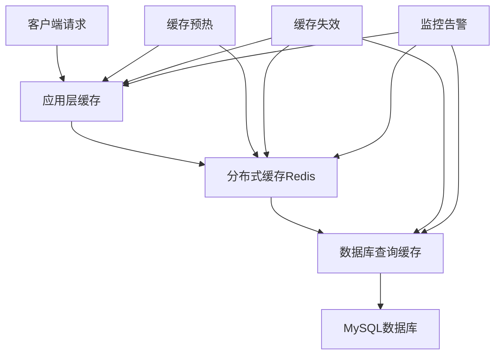

# 🚀 Web3 缓存策略指南

## 📋 概述

缓存是 Web3 应用性能优化的关键技术，本指南详细介绍如何在区块链应用中设计和实施多层缓存架构，包括内存缓存、分布式缓存、查询缓存等策略，以提供毫秒级的数据访问性能。

## 🏗️ 缓存架构设计

### 多层缓存架构



### 缓存层级设计

| 缓存层级 | 技术方案 | 容量 | 响应时间 | 适用场景 |
|----------|----------|------|----------|----------|
| L1 - 应用缓存 | sync.Map/BigCache | 100MB-1GB | <1ms | 热点数据、计算结果 |
| L2 - 分布式缓存 | Redis Cluster | 10GB-100GB | 1-5ms | 会话数据、查询结果 |
| L3 - 数据库缓存 | MySQL Query Cache | 1GB-10GB | 10-50ms | SQL查询结果 |
| L4 - CDN缓存 | CloudFlare/AWS | 1TB+ | 50-200ms | 静态资源、API响应 |

## 🔧 缓存实现

### 1. 应用层内存缓存

```go
package cache

import (
    "context"
    "fmt"
    "sync"
    "time"
    "unsafe"
    
    "github.com/allegro/bigcache/v3"
)

// 缓存接口
type Cache interface {
    Get(ctx context.Context, key string) ([]byte, error)
    Set(ctx context.Context, key string, value []byte, ttl time.Duration) error
    Delete(ctx context.Context, key string) error
    Clear(ctx context.Context) error
    Stats() *CacheStats
}

// 缓存统计
type CacheStats struct {
    Hits         int64   `json:"hits"`
    Misses       int64   `json:"misses"`
    HitRate      float64 `json:"hit_rate"`
    Size         int64   `json:"size"`
    Entries      int64   `json:"entries"`
    Memory       int64   `json:"memory_bytes"`
    Evictions    int64   `json:"evictions"`
}

// 内存缓存配置
type MemoryCacheConfig struct {
    MaxSize      int           `yaml:"max_size"`      // 最大条目数
    TTL          time.Duration `yaml:"ttl"`           // 默认TTL
    CleanupRate  time.Duration `yaml:"cleanup_rate"`  // 清理频率
    MaxMemoryMB  int           `yaml:"max_memory_mb"` // 最大内存MB
}

// 内存缓存实现
type MemoryCache struct {
    config    *MemoryCacheConfig
    bigCache  *bigcache.BigCache
    
    // 统计信息
    mu        sync.RWMutex
    stats     *CacheStats
    
    // 监控
    monitor   *CacheMonitor
}

func NewMemoryCache(config *MemoryCacheConfig) (*MemoryCache, error) {
    bigCacheConfig := bigcache.DefaultConfig(config.TTL)
    bigCacheConfig.Shards = 1024
    bigCacheConfig.MaxEntriesInWindow = config.MaxSize
    bigCacheConfig.MaxEntrySize = 500
    bigCacheConfig.Verbose = false
    bigCacheConfig.HardMaxCacheSize = config.MaxMemoryMB
    
    bc, err := bigcache.NewBigCache(bigCacheConfig)
    if err != nil {
        return nil, fmt.Errorf("创建BigCache失败: %w", err)
    }
    
    mc := &MemoryCache{
        config:   config,
        bigCache: bc,
        stats: &CacheStats{},
        monitor:  NewCacheMonitor("memory"),
    }
    
    // 启动统计更新
    go mc.updateStats()
    
    return mc, nil
}

func (mc *MemoryCache) Get(ctx context.Context, key string) ([]byte, error) {
    start := time.Now()
    defer func() {
        mc.monitor.RecordLatency("get", time.Since(start))
    }()
    
    data, err := mc.bigCache.Get(key)
    
    mc.mu.Lock()
    if err == nil {
        mc.stats.Hits++
        mc.monitor.RecordHit()
    } else {
        mc.stats.Misses++
        mc.monitor.RecordMiss()
    }
    mc.mu.Unlock()
    
    if err != nil {
        if err == bigcache.ErrEntryNotFound {
            return nil, ErrCacheKeyNotFound
        }
        return nil, fmt.Errorf("获取缓存失败: %w", err)
    }
    
    return data, nil
}

func (mc *MemoryCache) Set(ctx context.Context, key string, value []byte, ttl time.Duration) error {
    start := time.Now()
    defer func() {
        mc.monitor.RecordLatency("set", time.Since(start))
    }()
    
    if err := mc.bigCache.Set(key, value); err != nil {
        mc.monitor.RecordError("set")
        return fmt.Errorf("设置缓存失败: %w", err)
    }
    
    return nil
}

func (mc *MemoryCache) Delete(ctx context.Context, key string) error {
    start := time.Now()
    defer func() {
        mc.monitor.RecordLatency("delete", time.Since(start))
    }()
    
    if err := mc.bigCache.Delete(key); err != nil {
        return fmt.Errorf("删除缓存失败: %w", err)
    }
    
    return nil
}

func (mc *MemoryCache) Clear(ctx context.Context) error {
    mc.bigCache.Reset()
    
    mc.mu.Lock()
    mc.stats = &CacheStats{}
    mc.mu.Unlock()
    
    return nil
}

func (mc *MemoryCache) Stats() *CacheStats {
    mc.mu.RLock()
    defer mc.mu.RUnlock()
    
    stats := *mc.stats
    if stats.Hits+stats.Misses > 0 {
        stats.HitRate = float64(stats.Hits) / float64(stats.Hits+stats.Misses)
    }
    
    // 从 BigCache 获取实时统计
    bcStats := mc.bigCache.Stats()
    stats.Entries = int64(bcStats.Hits + bcStats.Misses) // 近似值
    
    return &stats
}

// 定期更新统计信息
func (mc *MemoryCache) updateStats() {
    ticker := time.NewTicker(time.Minute)
    defer ticker.Stop()
    
    for range ticker.C {
        bcStats := mc.bigCache.Stats()
        
        mc.mu.Lock()
        mc.stats.Size = int64(mc.bigCache.Len())
        mc.stats.Memory = int64(unsafe.Sizeof(mc.bigCache)) + int64(mc.bigCache.Capacity())
        mc.mu.Unlock()
        
        // 更新监控指标
        mc.monitor.UpdateStats(mc.Stats())
    }
}

// 缓存错误定义
var (
    ErrCacheKeyNotFound = fmt.Errorf("缓存键不存在")
    ErrCacheExpired     = fmt.Errorf("缓存已过期")
)
```

### 2. Redis 分布式缓存

```go
package cache

import (
    "context"
    "encoding/json"
    "fmt"
    "time"
    
    "github.com/go-redis/redis/v8"
    "go.uber.org/zap"
)

// Redis缓存配置
type RedisConfig struct {
    Addr         string        `yaml:"addr"`
    Password     string        `yaml:"password"`
    DB           int           `yaml:"db"`
    PoolSize     int           `yaml:"pool_size"`
    MinIdleConns int           `yaml:"min_idle_conns"`
    MaxRetries   int           `yaml:"max_retries"`
    DialTimeout  time.Duration `yaml:"dial_timeout"`
    ReadTimeout  time.Duration `yaml:"read_timeout"`
    WriteTimeout time.Duration `yaml:"write_timeout"`
}

// Redis分布式缓存
type RedisCache struct {
    client  *redis.Client
    config  *RedisConfig
    logger  *zap.Logger
    monitor *CacheMonitor
    
    // 序列化器
    serializer Serializer
}

func NewRedisCache(config *RedisConfig, logger *zap.Logger) (*RedisCache, error) {
    client := redis.NewClient(&redis.Options{
        Addr:         config.Addr,
        Password:     config.Password,
        DB:           config.DB,
        PoolSize:     config.PoolSize,
        MinIdleConns: config.MinIdleConns,
        MaxRetries:   config.MaxRetries,
        DialTimeout:  config.DialTimeout,
        ReadTimeout:  config.ReadTimeout,
        WriteTimeout: config.WriteTimeout,
    })
    
    // 测试连接
    ctx, cancel := context.WithTimeout(context.Background(), 5*time.Second)
    defer cancel()
    
    if err := client.Ping(ctx).Err(); err != nil {
        return nil, fmt.Errorf("Redis连接测试失败: %w", err)
    }
    
    rc := &RedisCache{
        client:     client,
        config:     config,
        logger:     logger,
        monitor:    NewCacheMonitor("redis"),
        serializer: &JSONSerializer{},
    }
    
    logger.Info("Redis缓存初始化成功", zap.String("addr", config.Addr))
    return rc, nil
}

func (rc *RedisCache) Get(ctx context.Context, key string) ([]byte, error) {
    start := time.Now()
    defer func() {
        rc.monitor.RecordLatency("get", time.Since(start))
    }()
    
    result, err := rc.client.Get(ctx, key).Result()
    if err != nil {
        if err == redis.Nil {
            rc.monitor.RecordMiss()
            return nil, ErrCacheKeyNotFound
        }
        rc.monitor.RecordError("get")
        return nil, fmt.Errorf("Redis GET失败: %w", err)
    }
    
    rc.monitor.RecordHit()
    return []byte(result), nil
}

func (rc *RedisCache) Set(ctx context.Context, key string, value []byte, ttl time.Duration) error {
    start := time.Now()
    defer func() {
        rc.monitor.RecordLatency("set", time.Since(start))
    }()
    
    err := rc.client.Set(ctx, key, value, ttl).Err()
    if err != nil {
        rc.monitor.RecordError("set")
        return fmt.Errorf("Redis SET失败: %w", err)
    }
    
    return nil
}

func (rc *RedisCache) Delete(ctx context.Context, key string) error {
    start := time.Now()
    defer func() {
        rc.monitor.RecordLatency("delete", time.Since(start))
    }()
    
    err := rc.client.Del(ctx, key).Err()
    if err != nil {
        rc.monitor.RecordError("delete")
        return fmt.Errorf("Redis DEL失败: %w", err)
    }
    
    return nil
}

func (rc *RedisCache) Clear(ctx context.Context) error {
    start := time.Now()
    defer func() {
        rc.monitor.RecordLatency("clear", time.Since(start))
    }()
    
    err := rc.client.FlushDB(ctx).Err()
    if err != nil {
        rc.monitor.RecordError("clear")
        return fmt.Errorf("Redis FLUSHDB失败: %w", err)
    }
    
    return nil
}

// 批量操作
func (rc *RedisCache) MGet(ctx context.Context, keys []string) ([][]byte, error) {
    start := time.Now()
    defer func() {
        rc.monitor.RecordLatency("mget", time.Since(start))
    }()
    
    results, err := rc.client.MGet(ctx, keys...).Result()
    if err != nil {
        rc.monitor.RecordError("mget")
        return nil, fmt.Errorf("Redis MGET失败: %w", err)
    }
    
    values := make([][]byte, len(results))
    for i, result := range results {
        if result != nil {
            if str, ok := result.(string); ok {
                values[i] = []byte(str)
                rc.monitor.RecordHit()
            }
        } else {
            rc.monitor.RecordMiss()
        }
    }
    
    return values, nil
}

func (rc *RedisCache) MSet(ctx context.Context, pairs map[string]interface{}, ttl time.Duration) error {
    start := time.Now()
    defer func() {
        rc.monitor.RecordLatency("mset", time.Since(start))
    }()
    
    pipe := rc.client.Pipeline()
    
    for key, value := range pairs {
        pipe.Set(ctx, key, value, ttl)
    }
    
    _, err := pipe.Exec(ctx)
    if err != nil {
        rc.monitor.RecordError("mset")
        return fmt.Errorf("Redis Pipeline MSET失败: %w", err)
    }
    
    return nil
}

// 高级功能：分布式锁
func (rc *RedisCache) Lock(ctx context.Context, key string, expiration time.Duration) (bool, error) {
    return rc.client.SetNX(ctx, key, "locked", expiration).Result()
}

func (rc *RedisCache) Unlock(ctx context.Context, key string) error {
    return rc.client.Del(ctx, key).Err()
}

// 发布订阅
func (rc *RedisCache) Publish(ctx context.Context, channel string, message interface{}) error {
    data, err := rc.serializer.Serialize(message)
    if err != nil {
        return fmt.Errorf("序列化消息失败: %w", err)
    }
    
    return rc.client.Publish(ctx, channel, data).Err()
}

func (rc *RedisCache) Subscribe(ctx context.Context, channels ...string) *redis.PubSub {
    return rc.client.Subscribe(ctx, channels...)
}

// 获取Redis统计信息
func (rc *RedisCache) Stats() *CacheStats {
    ctx, cancel := context.WithTimeout(context.Background(), 5*time.Second)
    defer cancel()
    
    info, err := rc.client.Info(ctx).Result()
    if err != nil {
        rc.logger.Error("获取Redis统计信息失败", zap.Error(err))
        return &CacheStats{}
    }
    
    stats := &CacheStats{}
    
    // 解析Redis INFO输出
    // 这里简化实现，实际需要解析完整的INFO输出
    poolStats := rc.client.PoolStats()
    stats.Entries = int64(poolStats.TotalConns)
    
    return stats
}

// 序列化接口
type Serializer interface {
    Serialize(v interface{}) ([]byte, error)
    Deserialize(data []byte, v interface{}) error
}

// JSON序列化器
type JSONSerializer struct{}

func (j *JSONSerializer) Serialize(v interface{}) ([]byte, error) {
    return json.Marshal(v)
}

func (j *JSONSerializer) Deserialize(data []byte, v interface{}) error {
    return json.Unmarshal(data, v)
}
```

### 3. 智能缓存管理器

```go
package cache

import (
    "context"
    "fmt"
    "strings"
    "time"
    
    "go.uber.org/zap"
)

// 缓存管理器配置
type ManagerConfig struct {
    L1Config    *MemoryCacheConfig `yaml:"l1_config"`
    L2Config    *RedisConfig       `yaml:"l2_config"`
    DefaultTTL  time.Duration      `yaml:"default_ttl"`
    WriteThrough bool              `yaml:"write_through"`
    WriteBack    bool              `yaml:"write_back"`
}

// 智能缓存管理器
type SmartCacheManager struct {
    l1Cache  Cache  // 内存缓存
    l2Cache  Cache  // Redis缓存
    config   *ManagerConfig
    logger   *zap.Logger
    
    // 缓存策略
    strategies map[string]*CacheStrategy
}

// 缓存策略
type CacheStrategy struct {
    TTL          time.Duration `json:"ttl"`
    UseL1        bool         `json:"use_l1"`
    UseL2        bool         `json:"use_l2"`
    WriteThrough bool         `json:"write_through"`
    WriteBack    bool         `json:"write_back"`
    Priority     int          `json:"priority"`  // 缓存优先级
}

func NewSmartCacheManager(config *ManagerConfig, logger *zap.Logger) (*SmartCacheManager, error) {
    // 初始化L1缓存
    l1Cache, err := NewMemoryCache(config.L1Config)
    if err != nil {
        return nil, fmt.Errorf("初始化L1缓存失败: %w", err)
    }
    
    // 初始化L2缓存
    l2Cache, err := NewRedisCache(config.L2Config, logger)
    if err != nil {
        return nil, fmt.Errorf("初始化L2缓存失败: %w", err)
    }
    
    scm := &SmartCacheManager{
        l1Cache:    l1Cache,
        l2Cache:    l2Cache,
        config:     config,
        logger:     logger,
        strategies: make(map[string]*CacheStrategy),
    }
    
    // 初始化默认策略
    scm.initDefaultStrategies()
    
    logger.Info("智能缓存管理器初始化成功")
    return scm, nil
}

// 初始化默认缓存策略
func (scm *SmartCacheManager) initDefaultStrategies() {
    // 区块数据：长期缓存，使用双层
    scm.strategies["block:*"] = &CacheStrategy{
        TTL:          24 * time.Hour,
        UseL1:        true,
        UseL2:        true,
        WriteThrough: true,
        WriteBack:    false,
        Priority:     1,
    }
    
    // 交易数据：中期缓存，优先L2
    scm.strategies["tx:*"] = &CacheStrategy{
        TTL:          6 * time.Hour,
        UseL1:        false,
        UseL2:        true,
        WriteThrough: true,
        WriteBack:    false,
        Priority:     2,
    }
    
    // 用户会话：短期缓存，优先L1
    scm.strategies["session:*"] = &CacheStrategy{
        TTL:          30 * time.Minute,
        UseL1:        true,
        UseL2:        false,
        WriteThrough: false,
        WriteBack:    true,
        Priority:     3,
    }
    
    // API响应：短期缓存，双层
    scm.strategies["api:*"] = &CacheStrategy{
        TTL:          5 * time.Minute,
        UseL1:        true,
        UseL2:        true,
        WriteThrough: false,
        WriteBack:    true,
        Priority:     2,
    }
    
    // 计算结果：长期缓存，双层
    scm.strategies["compute:*"] = &CacheStrategy{
        TTL:          12 * time.Hour,
        UseL1:        true,
        UseL2:        true,
        WriteThrough: true,
        WriteBack:    false,
        Priority:     1,
    }
}

// 智能获取
func (scm *SmartCacheManager) Get(ctx context.Context, key string) ([]byte, error) {
    strategy := scm.getStrategy(key)
    
    // 尝试L1缓存
    if strategy.UseL1 {
        if data, err := scm.l1Cache.Get(ctx, key); err == nil {
            scm.logger.Debug("L1缓存命中", zap.String("key", key))
            return data, nil
        }
    }
    
    // 尝试L2缓存
    if strategy.UseL2 {
        if data, err := scm.l2Cache.Get(ctx, key); err == nil {
            scm.logger.Debug("L2缓存命中", zap.String("key", key))
            
            // 回写到L1缓存
            if strategy.UseL1 {
                go func() {
                    if err := scm.l1Cache.Set(ctx, key, data, strategy.TTL); err != nil {
                        scm.logger.Warn("L1缓存回写失败", zap.String("key", key), zap.Error(err))
                    }
                }()
            }
            
            return data, nil
        }
    }
    
    return nil, ErrCacheKeyNotFound
}

// 智能设置
func (scm *SmartCacheManager) Set(ctx context.Context, key string, value []byte, ttl time.Duration) error {
    strategy := scm.getStrategy(key)
    
    if ttl == 0 {
        ttl = strategy.TTL
    }
    
    var l1Err, l2Err error
    
    // 写入L1缓存
    if strategy.UseL1 {
        l1Err = scm.l1Cache.Set(ctx, key, value, ttl)
        if l1Err != nil {
            scm.logger.Warn("L1缓存写入失败", zap.String("key", key), zap.Error(l1Err))
        }
    }
    
    // 写入L2缓存
    if strategy.UseL2 {
        l2Err = scm.l2Cache.Set(ctx, key, value, ttl)
        if l2Err != nil {
            scm.logger.Warn("L2缓存写入失败", zap.String("key", key), zap.Error(l2Err))
        }
    }
    
    // 根据策略决定错误处理
    if strategy.WriteThrough {
        // 写穿模式：任何层失败都返回错误
        if l1Err != nil || l2Err != nil {
            return fmt.Errorf("缓存写入失败: L1=%v, L2=%v", l1Err, l2Err)
        }
    }
    
    return nil
}

// 智能删除
func (scm *SmartCacheManager) Delete(ctx context.Context, key string) error {
    strategy := scm.getStrategy(key)
    
    var errors []error
    
    if strategy.UseL1 {
        if err := scm.l1Cache.Delete(ctx, key); err != nil {
            errors = append(errors, fmt.Errorf("L1删除失败: %w", err))
        }
    }
    
    if strategy.UseL2 {
        if err := scm.l2Cache.Delete(ctx, key); err != nil {
            errors = append(errors, fmt.Errorf("L2删除失败: %w", err))
        }
    }
    
    if len(errors) > 0 {
        return fmt.Errorf("缓存删除失败: %v", errors)
    }
    
    return nil
}

// 获取缓存策略
func (scm *SmartCacheManager) getStrategy(key string) *CacheStrategy {
    // 按照优先级匹配策略
    for pattern, strategy := range scm.strategies {
        if scm.matchPattern(pattern, key) {
            return strategy
        }
    }
    
    // 返回默认策略
    return &CacheStrategy{
        TTL:          scm.config.DefaultTTL,
        UseL1:        true,
        UseL2:        true,
        WriteThrough: scm.config.WriteThrough,
        WriteBack:    scm.config.WriteBack,
        Priority:     5,
    }
}

// 简单模式匹配
func (scm *SmartCacheManager) matchPattern(pattern, key string) bool {
    if pattern == "*" {
        return true
    }
    
    if strings.HasSuffix(pattern, "*") {
        prefix := pattern[:len(pattern)-1]
        return strings.HasPrefix(key, prefix)
    }
    
    if strings.HasPrefix(pattern, "*") {
        suffix := pattern[1:]
        return strings.HasSuffix(key, suffix)
    }
    
    return pattern == key
}

// 注册自定义策略
func (scm *SmartCacheManager) RegisterStrategy(pattern string, strategy *CacheStrategy) {
    scm.strategies[pattern] = strategy
    scm.logger.Info("注册缓存策略", 
        zap.String("pattern", pattern),
        zap.Duration("ttl", strategy.TTL),
        zap.Bool("use_l1", strategy.UseL1),
        zap.Bool("use_l2", strategy.UseL2),
    )
}

// 预热缓存
func (scm *SmartCacheManager) Warmup(ctx context.Context, warmupData map[string]interface{}) error {
    scm.logger.Info("开始缓存预热", zap.Int("items", len(warmupData)))
    
    for key, value := range warmupData {
        data, err := scm.serialize(value)
        if err != nil {
            scm.logger.Warn("序列化预热数据失败", zap.String("key", key), zap.Error(err))
            continue
        }
        
        if err := scm.Set(ctx, key, data, 0); err != nil {
            scm.logger.Warn("预热缓存失败", zap.String("key", key), zap.Error(err))
        }
    }
    
    scm.logger.Info("缓存预热完成")
    return nil
}

// 缓存统计
func (scm *SmartCacheManager) Stats() map[string]*CacheStats {
    return map[string]*CacheStats{
        "l1": scm.l1Cache.Stats(),
        "l2": scm.l2Cache.Stats(),
    }
}

// 健康检查
func (scm *SmartCacheManager) HealthCheck(ctx context.Context) error {
    // 测试L1缓存
    testKey := "health_check"
    testValue := []byte("ok")
    
    if err := scm.l1Cache.Set(ctx, testKey, testValue, time.Minute); err != nil {
        return fmt.Errorf("L1缓存健康检查失败: %w", err)
    }
    
    if _, err := scm.l1Cache.Get(ctx, testKey); err != nil {
        return fmt.Errorf("L1缓存读取检查失败: %w", err)
    }
    
    scm.l1Cache.Delete(ctx, testKey)
    
    // 测试L2缓存
    if err := scm.l2Cache.Set(ctx, testKey, testValue, time.Minute); err != nil {
        return fmt.Errorf("L2缓存健康检查失败: %w", err)
    }
    
    if _, err := scm.l2Cache.Get(ctx, testKey); err != nil {
        return fmt.Errorf("L2缓存读取检查失败: %w", err)
    }
    
    scm.l2Cache.Delete(ctx, testKey)
    
    return nil
}

func (scm *SmartCacheManager) serialize(v interface{}) ([]byte, error) {
    serializer := &JSONSerializer{}
    return serializer.Serialize(v)
}
```

### 4. 缓存监控

```go
package cache

import (
    "time"
    
    "github.com/prometheus/client_golang/prometheus"
)

// 缓存监控器
type CacheMonitor struct {
    name string
    
    // Prometheus指标
    hitCount     prometheus.Counter
    missCount    prometheus.Counter
    errorCount   prometheus.CounterVec
    latency      prometheus.HistogramVec
    memoryUsage  prometheus.Gauge
    entryCount   prometheus.Gauge
}

func NewCacheMonitor(cacheName string) *CacheMonitor {
    monitor := &CacheMonitor{
        name: cacheName,
        hitCount: prometheus.NewCounter(prometheus.CounterOpts{
            Name: cacheName + "_hits_total",
            Help: "Total number of cache hits",
        }),
        missCount: prometheus.NewCounter(prometheus.CounterOpts{
            Name: cacheName + "_misses_total", 
            Help: "Total number of cache misses",
        }),
        errorCount: *prometheus.NewCounterVec(prometheus.CounterOpts{
            Name: cacheName + "_errors_total",
            Help: "Total number of cache errors",
        }, []string{"operation"}),
        latency: *prometheus.NewHistogramVec(prometheus.HistogramOpts{
            Name: cacheName + "_operation_duration_seconds",
            Help: "Cache operation duration in seconds",
        }, []string{"operation"}),
        memoryUsage: prometheus.NewGauge(prometheus.GaugeOpts{
            Name: cacheName + "_memory_usage_bytes",
            Help: "Cache memory usage in bytes",
        }),
        entryCount: prometheus.NewGauge(prometheus.GaugeOpts{
            Name: cacheName + "_entries_total",
            Help: "Total number of cache entries",
        }),
    }
    
    // 注册指标
    prometheus.MustRegister(
        monitor.hitCount,
        monitor.missCount,
        monitor.errorCount,
        monitor.latency,
        monitor.memoryUsage,
        monitor.entryCount,
    )
    
    return monitor
}

func (cm *CacheMonitor) RecordHit() {
    cm.hitCount.Inc()
}

func (cm *CacheMonitor) RecordMiss() {
    cm.missCount.Inc()
}

func (cm *CacheMonitor) RecordError(operation string) {
    cm.errorCount.WithLabelValues(operation).Inc()
}

func (cm *CacheMonitor) RecordLatency(operation string, duration time.Duration) {
    cm.latency.WithLabelValues(operation).Observe(duration.Seconds())
}

func (cm *CacheMonitor) UpdateStats(stats *CacheStats) {
    cm.memoryUsage.Set(float64(stats.Memory))
    cm.entryCount.Set(float64(stats.Entries))
}
```

## 🎯 Web3 特定缓存策略

### 区块链数据缓存

```go
// 区块链数据缓存专用包装器
type Web3CacheWrapper struct {
    cache  *SmartCacheManager
    logger *zap.Logger
}

// 缓存区块数据
func (w *Web3CacheWrapper) CacheBlock(ctx context.Context, block *models.Block) error {
    key := fmt.Sprintf("block:%d", block.Number)
    data, err := json.Marshal(block)
    if err != nil {
        return fmt.Errorf("序列化区块失败: %w", err)
    }
    
    // 区块数据永久缓存（除非手动清理）
    return w.cache.Set(ctx, key, data, 0)
}

// 缓存交易数据
func (w *Web3CacheWrapper) CacheTransaction(ctx context.Context, tx *models.Transaction) error {
    key := fmt.Sprintf("tx:%s", tx.Hash)
    data, err := json.Marshal(tx)
    if err != nil {
        return fmt.Errorf("序列化交易失败: %w", err)
    }
    
    // 交易数据缓存6小时
    return w.cache.Set(ctx, key, data, 6*time.Hour)
}

// 缓存代币价格
func (w *Web3CacheWrapper) CacheTokenPrice(ctx context.Context, tokenAddr string, price *TokenPrice) error {
    key := fmt.Sprintf("price:%s", tokenAddr)
    data, err := json.Marshal(price)
    if err != nil {
        return fmt.Errorf("序列化价格失败: %w", err)
    }
    
    // 价格数据缓存5分钟
    return w.cache.Set(ctx, key, data, 5*time.Minute)
}

// 缓存DeFi协议数据
func (w *Web3CacheWrapper) CacheProtocolData(ctx context.Context, protocol string, data interface{}) error {
    key := fmt.Sprintf("protocol:%s", protocol)
    jsonData, err := json.Marshal(data)
    if err != nil {
        return fmt.Errorf("序列化协议数据失败: %w", err)
    }
    
    // 协议数据缓存30分钟
    return w.cache.Set(ctx, key, jsonData, 30*time.Minute)
}

type TokenPrice struct {
    Address   string    `json:"address"`
    Symbol    string    `json:"symbol"`
    PriceUSD  float64   `json:"price_usd"`
    Timestamp time.Time `json:"timestamp"`
    Source    string    `json:"source"`
}
```

## 📊 性能基准测试

### 缓存性能测试

```go
package cache

import (
    "context"
    "fmt"
    "testing"
    "time"
)

func BenchmarkCacheOperations(b *testing.B) {
    ctx := context.Background()
    
    // 测试数据
    testData := make([]byte, 1024) // 1KB测试数据
    for i := range testData {
        testData[i] = byte(i % 256)
    }
    
    // 内存缓存基准测试
    b.Run("MemoryCache", func(b *testing.B) {
        memCache, _ := NewMemoryCache(&MemoryCacheConfig{
            MaxSize:     10000,
            TTL:         time.Hour,
            CleanupRate: time.Minute,
            MaxMemoryMB: 100,
        })
        
        b.ResetTimer()
        b.RunParallel(func(pb *testing.PB) {
            i := 0
            for pb.Next() {
                key := fmt.Sprintf("key_%d", i%1000)
                
                // 写入
                memCache.Set(ctx, key, testData, time.Hour)
                
                // 读取
                memCache.Get(ctx, key)
                
                i++
            }
        })
    })
    
    // Redis缓存基准测试
    b.Run("RedisCache", func(b *testing.B) {
        redisCache, _ := NewRedisCache(&RedisConfig{
            Addr:     "localhost:6379",
            PoolSize: 100,
        }, nil)
        
        b.ResetTimer()
        b.RunParallel(func(pb *testing.PB) {
            i := 0
            for pb.Next() {
                key := fmt.Sprintf("key_%d", i%1000)
                
                // 写入
                redisCache.Set(ctx, key, testData, time.Hour)
                
                // 读取
                redisCache.Get(ctx, key)
                
                i++
            }
        })
    })
}

func BenchmarkCacheHitRate(b *testing.B) {
    // 测试不同缓存大小下的命中率
    sizes := []int{100, 1000, 10000}
    
    for _, size := range sizes {
        b.Run(fmt.Sprintf("Size_%d", size), func(b *testing.B) {
            cache, _ := NewMemoryCache(&MemoryCacheConfig{
                MaxSize:     size,
                TTL:         time.Hour,
                MaxMemoryMB: 1000,
            })
            
            ctx := context.Background()
            testData := []byte("test_data")
            
            b.ResetTimer()
            for i := 0; i < b.N; i++ {
                key := fmt.Sprintf("key_%d", i%size)
                cache.Set(ctx, key, testData, time.Hour)
                cache.Get(ctx, key)
            }
        })
    }
}
```

## 📈 最佳实践

### 1. 缓存键设计

```go
// 标准化的缓存键格式
type CacheKeyBuilder struct {
    namespace string
}

func NewCacheKeyBuilder(namespace string) *CacheKeyBuilder {
    return &CacheKeyBuilder{namespace: namespace}
}

func (ckb *CacheKeyBuilder) BlockKey(blockNumber uint64) string {
    return fmt.Sprintf("%s:block:%d", ckb.namespace, blockNumber)
}

func (ckb *CacheKeyBuilder) TransactionKey(txHash string) string {
    return fmt.Sprintf("%s:tx:%s", ckb.namespace, txHash)
}

func (ckb *CacheKeyBuilder) AddressBalanceKey(address string) string {
    return fmt.Sprintf("%s:balance:%s", ckb.namespace, address)
}

func (ckb *CacheKeyBuilder) TokenPriceKey(tokenAddr string) string {
    return fmt.Sprintf("%s:price:%s", ckb.namespace, tokenAddr)
}

func (ckb *CacheKeyBuilder) UserSessionKey(userID string) string {
    return fmt.Sprintf("%s:session:%s", ckb.namespace, userID)
}
```

### 2. 缓存失效策略

```go
// 智能失效管理器
type CacheInvalidator struct {
    cache       *SmartCacheManager
    logger      *zap.Logger
    patterns    map[string]time.Duration // 失效模式和周期
}

func NewCacheInvalidator(cache *SmartCacheManager, logger *zap.Logger) *CacheInvalidator {
    ci := &CacheInvalidator{
        cache:    cache,
        logger:   logger,
        patterns: make(map[string]time.Duration),
    }
    
    // 注册默认失效模式
    ci.patterns["price:*"] = time.Minute * 5     // 价格数据5分钟失效
    ci.patterns["balance:*"] = time.Minute * 10  // 余额数据10分钟失效
    ci.patterns["session:*"] = time.Hour * 1     // 会话1小时失效
    
    return ci
}

// 基于事件的缓存失效
func (ci *CacheInvalidator) InvalidateOnEvent(ctx context.Context, eventType string, data interface{}) error {
    switch eventType {
    case "new_block":
        // 新区块时失效相关缓存
        return ci.invalidateBlockRelated(ctx, data)
    case "token_transfer":
        // 代币转账时失效余额缓存
        return ci.invalidateBalanceRelated(ctx, data)
    case "price_update":
        // 价格更新时失效价格缓存
        return ci.invalidatePriceRelated(ctx, data)
    }
    
    return nil
}

func (ci *CacheInvalidator) invalidateBlockRelated(ctx context.Context, data interface{}) error {
    // 失效与新区块相关的缓存
    // 例如：最新区块号、待确认交易等
    keys := []string{
        "latest_block",
        "pending_txs",
        "network_stats",
    }
    
    for _, key := range keys {
        if err := ci.cache.Delete(ctx, key); err != nil {
            ci.logger.Warn("失效缓存失败", zap.String("key", key), zap.Error(err))
        }
    }
    
    return nil
}
```

### 3. 缓存预热

```go
// 缓存预热管理器
type CacheWarmer struct {
    cache      *SmartCacheManager
    dataSource DataSourceInterface
    logger     *zap.Logger
}

func NewCacheWarmer(cache *SmartCacheManager, dataSource DataSourceInterface, logger *zap.Logger) *CacheWarmer {
    return &CacheWarmer{
        cache:      cache,
        dataSource: dataSource,
        logger:     logger,
    }
}

// 系统启动时的预热
func (cw *CacheWarmer) WarmupOnStartup(ctx context.Context) error {
    cw.logger.Info("开始系统启动预热")
    
    // 预热最新区块数据
    if err := cw.warmupLatestBlocks(ctx, 100); err != nil {
        return fmt.Errorf("预热区块数据失败: %w", err)
    }
    
    // 预热热门代币价格
    if err := cw.warmupTokenPrices(ctx); err != nil {
        return fmt.Errorf("预热代币价格失败: %w", err)
    }
    
    // 预热系统统计数据
    if err := cw.warmupSystemStats(ctx); err != nil {
        return fmt.Errorf("预热系统统计失败: %w", err)
    }
    
    cw.logger.Info("系统启动预热完成")
    return nil
}

// 定期预热
func (cw *CacheWarmer) ScheduledWarmup(ctx context.Context) {
    ticker := time.NewTicker(time.Hour)
    defer ticker.Stop()
    
    for {
        select {
        case <-ctx.Done():
            return
        case <-ticker.C:
            if err := cw.warmupTokenPrices(ctx); err != nil {
                cw.logger.Error("定期预热失败", zap.Error(err))
            }
        }
    }
}

func (cw *CacheWarmer) warmupLatestBlocks(ctx context.Context, count int) error {
    latestBlocks, err := cw.dataSource.GetLatestBlocks(ctx, count)
    if err != nil {
        return err
    }
    
    for _, block := range latestBlocks {
        key := fmt.Sprintf("block:%d", block.Number)
        data, _ := json.Marshal(block)
        cw.cache.Set(ctx, key, data, 24*time.Hour)
    }
    
    cw.logger.Info("预热区块数据完成", zap.Int("count", len(latestBlocks)))
    return nil
}

func (cw *CacheWarmer) warmupTokenPrices(ctx context.Context) error {
    // 获取热门代币列表
    popularTokens, err := cw.dataSource.GetPopularTokens(ctx, 100)
    if err != nil {
        return err
    }
    
    // 批量获取价格
    prices, err := cw.dataSource.GetTokenPrices(ctx, popularTokens)
    if err != nil {
        return err
    }
    
    // 批量写入缓存
    for token, price := range prices {
        key := fmt.Sprintf("price:%s", token)
        data, _ := json.Marshal(price)
        cw.cache.Set(ctx, key, data, 5*time.Minute)
    }
    
    cw.logger.Info("预热代币价格完成", zap.Int("count", len(prices)))
    return nil
}

func (cw *CacheWarmer) warmupSystemStats(ctx context.Context) error {
    stats, err := cw.dataSource.GetSystemStats(ctx)
    if err != nil {
        return err
    }
    
    key := "system_stats"
    data, _ := json.Marshal(stats)
    cw.cache.Set(ctx, key, data, 10*time.Minute)
    
    cw.logger.Info("预热系统统计完成")
    return nil
}

// 数据源接口
type DataSourceInterface interface {
    GetLatestBlocks(ctx context.Context, count int) ([]*models.Block, error)
    GetPopularTokens(ctx context.Context, count int) ([]string, error)
    GetTokenPrices(ctx context.Context, tokens []string) (map[string]float64, error)
    GetSystemStats(ctx context.Context) (*SystemStats, error)
}

type SystemStats struct {
    TotalBlocks      uint64    `json:"total_blocks"`
    TotalTxs         uint64    `json:"total_txs"`
    ActiveAddresses  uint64    `json:"active_addresses"`
    NetworkHashrate  float64   `json:"network_hashrate"`
    AvgBlockTime     float64   `json:"avg_block_time"`
    LastUpdateTime   time.Time `json:"last_update_time"`
}
```

## 🚨 故障排除

### 常见问题和解决方案

1. **缓存雪崩**
   ```go
   // 随机TTL避免同时失效
   func randomTTL(baseTTL time.Duration) time.Duration {
       jitter := time.Duration(rand.Intn(300)) * time.Second  // 0-5分钟随机
       return baseTTL + jitter
   }
   ```

2. **缓存击穿**
   ```go
   // 使用分布式锁
   func (cache *SmartCacheManager) GetWithLock(ctx context.Context, key string, loader func() ([]byte, error)) ([]byte, error) {
       // 尝试获取缓存
       if data, err := cache.Get(ctx, key); err == nil {
           return data, nil
       }
       
       // 获取分布式锁
       lockKey := "lock:" + key
       if locked, err := cache.l2Cache.(*RedisCache).Lock(ctx, lockKey, time.Minute); err != nil || !locked {
           // 锁获取失败，等待后重试
           time.Sleep(100 * time.Millisecond)
           return cache.Get(ctx, key)
       }
       
       defer cache.l2Cache.(*RedisCache).Unlock(ctx, lockKey)
       
       // 双重检查
       if data, err := cache.Get(ctx, key); err == nil {
           return data, nil
       }
       
       // 加载数据
       data, err := loader()
       if err != nil {
           return nil, err
       }
       
       // 写入缓存
       cache.Set(ctx, key, data, 0)
       return data, nil
   }
   ```

3. **内存溢出**
   ```go
   // 监控内存使用
   func (mc *MemoryCache) checkMemoryUsage() {
       var m runtime.MemStats
       runtime.ReadMemStats(&m)
       
       if m.Alloc > uint64(mc.config.MaxMemoryMB)*1024*1024 {
           // 触发清理
           mc.bigCache.Reset()
           runtime.GC()
       }
   }
   ```

## 📊 监控面板

### Grafana 监控配置

```json
{
  "dashboard": {
    "title": "Web3 缓存监控",
    "panels": [
      {
        "title": "缓存命中率",
        "type": "stat",
        "targets": [
          {
            "expr": "rate(cache_hits_total[5m]) / (rate(cache_hits_total[5m]) + rate(cache_misses_total[5m])) * 100"
          }
        ]
      },
      {
        "title": "缓存延迟",
        "type": "graph", 
        "targets": [
          {
            "expr": "histogram_quantile(0.95, cache_operation_duration_seconds)"
          }
        ]
      },
      {
        "title": "内存使用",
        "type": "graph",
        "targets": [
          {
            "expr": "cache_memory_usage_bytes"
          }
        ]
      }
    ]
  }
}
```

---

**最后更新**: 2025-01-13  
**维护团队**: Awesome Trade 开发团队
